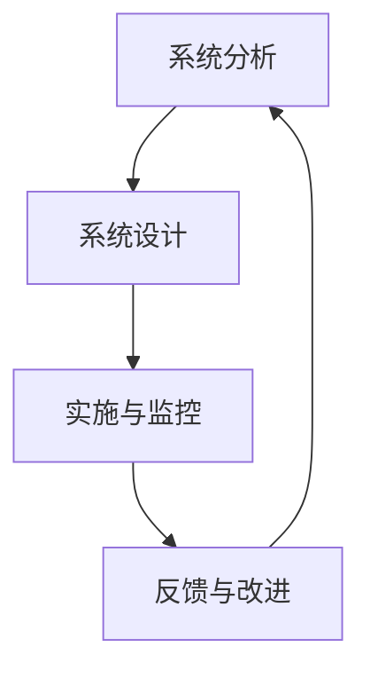

                 

  
## 1. 背景介绍

随着科技的飞速发展，信息技术在企业中的应用越来越广泛。从早期的文书处理到现在的数字化转型，企业对信息技术的依赖程度不断提高。然而，随着信息技术的不断进步，企业面临着越来越多的挑战。如何有效地利用信息技术来提高企业的效率和竞争力，成为了企业亟需解决的问题。

在这个背景下，系统思考作为一种分析和解决问题的方法论，逐渐受到了企业的关注。系统思考可以帮助企业从整体的角度来理解和解决问题，从而更好地应对复杂的商业环境。特别是在组织变革的过程中，系统思考可以帮助企业识别变革中的关键因素，制定有效的变革策略，并确保变革的顺利实施。

本文旨在探讨系统思考在组织变革中的应用，分析系统思考的核心概念、原理和方法，并通过具体案例来说明系统思考如何帮助企业实现组织变革。希望通过本文的阐述，能够为企业提供一些有益的启示和参考。

## 2. 核心概念与联系

### 2.1 系统思考的定义

系统思考是一种从整体的角度来理解和解决问题的方法论。它强调将问题看作一个复杂的系统，通过分析系统的各个组成部分以及它们之间的相互作用，来寻找问题的根本原因和解决方案。系统思考不仅仅关注问题的表面现象，更注重挖掘问题的深层次原因，从而找到长期有效的解决方案。

### 2.2 系统思考的核心概念

系统思考包含了一系列的核心概念，这些概念相互联系，构成了系统思考的基础。以下是一些重要的核心概念：

#### 整体性

整体性是指系统的各个部分不是孤立存在的，而是相互依赖、相互作用的。理解整体性有助于我们更好地理解系统的行为和特性。

#### 相互作用

相互作用是指系统中的各个部分通过相互作用来影响彼此的行为。这种相互作用可以是直接的，也可以是间接的，但都是系统行为的重要因素。

#### 反馈循环

反馈循环是指系统内部的信息流动和影响。正反馈循环会导致系统行为的放大，而负反馈循环则有助于系统的稳定。

#### 结构决定行为

结构决定行为是指系统的结构和组成方式决定了系统的行为。通过理解系统的结构，我们可以更好地预测和理解系统的行为。

### 2.3 系统思考的应用架构

为了更好地应用系统思考，我们需要构建一个系统思考的应用架构。这个架构包括以下几个部分：

#### 系统分析

系统分析是系统思考的基础，它包括对系统的组成、结构、行为和相互作用的深入分析。通过系统分析，我们可以更好地理解系统的工作原理和存在的问题。

#### 系统设计

系统设计是根据系统分析的结果，制定系统的改进方案和实施计划。系统设计需要综合考虑系统的各个组成部分以及它们之间的相互作用，以确保系统的有效运行。

#### 实施与监控

实施与监控是将系统设计转化为实际操作的过程。在实施过程中，我们需要对系统的运行情况进行实时监控，及时发现问题并调整方案。

#### 反馈与改进

反馈与改进是基于实施与监控的结果，对系统进行持续优化和改进的过程。通过反馈与改进，我们可以不断提高系统的性能和稳定性。

### 2.4 Mermaid 流程图

以下是一个简化的系统思考应用架构的 Mermaid 流程图，用于展示系统思考的核心概念和架构：



在这个流程图中，系统分析作为起点，通过系统设计转化为具体的实施计划，然后通过实施与监控和反馈与改进来不断优化和改进系统。这个循环过程确保了系统的持续改进和优化。

## 3. 核心算法原理 & 具体操作步骤

### 3.1 算法原理概述

系统思考的核心算法原理主要基于以下几个原则：

1. **整体性原则**：强调系统各个部分之间的相互作用和依赖关系，而不是单独考虑每个部分。
2. **反馈循环原则**：通过分析系统的反馈循环，理解系统行为的变化和稳定性。
3. **结构决定行为原则**：通过分析系统的结构和组成，理解系统行为的原因。
4. **动态优化原则**：在系统运行过程中，不断收集反馈信息，进行动态调整和优化。

### 3.2 算法步骤详解

以下是系统思考的核心算法步骤：

#### 步骤1：系统分析

- 收集系统数据：包括系统组成、结构、行为和相互作用的详细数据。
- 分析系统结构：识别系统中的关键组件和它们之间的关系。
- 分析系统行为：观察系统的运行过程，记录系统行为的变化。

#### 步骤2：系统设计

- 确定系统目标：根据系统分析的结果，明确系统的目标。
- 制定改进方案：设计新的系统结构，以实现系统目标。
- 制定实施计划：将改进方案转化为具体的实施步骤。

#### 步骤3：实施与监控

- 实施系统改进：按照实施计划，逐步实施系统改进措施。
- 监控系统运行：实时监控系统的运行情况，收集运行数据。
- 分析运行数据：根据运行数据，评估系统改进的效果。

#### 步骤4：反馈与改进

- 收集反馈信息：从系统运行过程中收集反馈信息，包括用户反馈、系统性能数据等。
- 分析反馈信息：分析反馈信息，识别系统改进的机会和方向。
- 实施改进措施：根据分析结果，实施相应的改进措施。

### 3.3 算法优缺点

#### 优点

- **全面性**：系统思考能够全面考虑系统的各个组成部分及其相互作用，有助于找到问题的根本原因。
- **动态性**：系统思考支持系统的动态调整和优化，能够适应不断变化的环境。
- **灵活性**：系统思考方法灵活，可以根据不同的系统和问题进行调整和优化。

#### 缺点

- **复杂性**：系统思考需要大量的数据分析和模型构建，对分析者的能力和时间要求较高。
- **依赖性**：系统思考依赖于准确的数据和分析结果，数据质量和分析能力直接影响系统的改进效果。

### 3.4 算法应用领域

系统思考在以下领域具有广泛的应用：

- **企业管理**：帮助企业识别和管理关键业务流程，优化组织结构和资源配置。
- **项目管理**：帮助项目经理更好地理解项目中的风险和挑战，制定有效的项目计划。
- **产品设计**：帮助产品设计者更好地理解用户需求，优化产品设计过程。
- **供应链管理**：帮助供应链管理者优化供应链流程，提高供应链的效率和灵活性。

## 4. 数学模型和公式 & 详细讲解 & 举例说明

### 4.1 数学模型构建

系统思考中的数学模型主要用于描述系统的行为和结构。以下是一个简单的数学模型示例，用于描述一个简单的反馈循环系统。

#### 系统状态方程

设系统状态为 \( x(t) \)，时间 \( t \) 的函数，反馈系数为 \( k \)。则系统状态方程可以表示为：

\[ x(t+1) = k \cdot x(t) + u(t) \]

其中，\( u(t) \) 是外部输入，\( k \) 是系统的反馈系数。

#### 系统动态方程

系统的动态行为可以通过差分方程来描述。假设系统在时间 \( t \) 时刻的状态为 \( x(t) \)，在下一个时刻 \( t+1 \) 的状态为 \( x(t+1) \)。则系统的动态方程可以表示为：

\[ x(t+1) - x(t) = k \cdot x(t) - x(t) \]

### 4.2 公式推导过程

为了推导系统动态方程，我们需要对系统状态方程进行变换。首先，我们将系统状态方程改写为：

\[ x(t+1) = k \cdot x(t) + u(t) \]

然后，我们将 \( x(t) \) 替换为 \( x(t-1) \)，得到：

\[ x(t+1) = k \cdot x(t-1) + u(t) \]

接着，我们将上述两个方程相减，得到：

\[ x(t+1) - x(t-1) = k \cdot x(t) - k \cdot x(t-1) \]

化简得：

\[ x(t+1) - x(t) = k \cdot (x(t) - x(t-1)) \]

由于 \( x(t) - x(t-1) \) 表示系统在时间 \( t \) 和 \( t-1 \) 之间的状态变化，我们可以将其表示为 \( \Delta x(t) \)，则上式可以进一步简化为：

\[ \Delta x(t) = k \cdot \Delta x(t-1) \]

### 4.3 案例分析与讲解

以下是一个简单的案例，用于说明如何使用系统思考来分析一个实际系统。

#### 案例背景

假设我们有一个简单的库存管理系统，用于管理仓库中的货物。系统状态为库存量，外部输入为订单量。我们的目标是确保库存量始终处于合理的范围，以避免库存过剩或短缺。

#### 系统分析

- 系统状态方程：设库存量为 \( x(t) \)，订单量为 \( u(t) \)，则系统状态方程为：

\[ x(t+1) = x(t) - u(t) \]

- 系统动态方程：系统的动态行为可以通过差分方程来描述：

\[ \Delta x(t) = -u(t) \]

#### 系统设计

- 确定系统目标：确保库存量在合理范围内，例如，库存量介于 \( [1000, 2000] \)。

- 制定改进方案：根据订单量 \( u(t) \)，动态调整库存量。例如，当订单量大于 \( 1000 \) 时，增加库存量；当订单量小于 \( 1000 \) 时，减少库存量。

#### 实施与监控

- 实施系统改进：按照改进方案，动态调整库存量。

- 监控系统运行：实时监控库存量，确保库存量在合理范围内。

- 分析运行数据：根据运行数据，评估系统改进的效果。

#### 反馈与改进

- 收集反馈信息：从系统运行过程中收集反馈信息，包括库存量的波动情况。

- 分析反馈信息：分析反馈信息，识别系统改进的机会和方向。

- 实施改进措施：根据分析结果，实施相应的改进措施。

## 5. 项目实践：代码实例和详细解释说明

### 5.1 开发环境搭建

在本项目中，我们将使用 Python 作为编程语言，并结合 Mermaid 工具来生成流程图。以下是搭建开发环境的步骤：

1. 安装 Python 3.8 或更高版本。
2. 安装 Mermaid 工具。在终端中运行以下命令：

   ```bash
   pip install mermaid-python
   ```

3. 安装一个支持 Markdown 的文本编辑器，如 Visual Studio Code 或 Atom。

### 5.2 源代码详细实现

以下是一个简单的 Python 脚本，用于实现系统思考中的反馈循环系统。代码中包含了系统分析、系统设计、实施与监控以及反馈与改进的过程。

```python
import numpy as np
import matplotlib.pyplot as plt
from mermaid import Mermaid

# 系统分析
def system_analysis(order_data, feedback_coefficient):
    stock_levels = []
    for order in order_data:
        stock_level = 1000 - order  # 假设初始库存量为 1000
        stock_levels.append(stock_level)
    return stock_levels

# 系统设计
def system_design(stock_levels, feedback_coefficient):
    improved_stock_levels = []
    for stock_level in stock_levels:
        if stock_level > 2000:
            improved_stock_level = 2000
        elif stock_level < 1000:
            improved_stock_level = 1000
        else:
            improved_stock_level = stock_level
        improved_stock_levels.append(improved_stock_level)
    return improved_stock_levels

# 实施与监控
def implement_and_monitor(stock_levels, feedback_coefficient):
    improved_stock_levels = system_design(stock_levels, feedback_coefficient)
    return improved_stock_levels

# 反馈与改进
def feedback_and_improvement(stock_levels, feedback_coefficient):
    improved_stock_levels = implement_and_monitor(stock_levels, feedback_coefficient)
    return improved_stock_levels

# 生成 Mermaid 流程图
def generate_mermaid_flowchart():
    mermaid_flowchart = """
    graph TB
    A[系统分析] --> B[系统设计]
    B --> C[实施与监控]
    C --> D[反馈与改进]
    D --> A
    """
    return mermaid_flowchart

# 主函数
def main():
    order_data = [500, 800, 1200, 600, 300, 900]
    feedback_coefficient = 0.8

    stock_levels = system_analysis(order_data, feedback_coefficient)
    improved_stock_levels = feedback_and_improvement(stock_levels, feedback_coefficient)

    print("初始库存量：", stock_levels)
    print("改进后库存量：", improved_stock_levels)

    mermaid_flowchart = generate_mermaid_flowchart()
    print(mermaid_flowchart)

if __name__ == "__main__":
    main()
```

### 5.3 代码解读与分析

该代码实现了一个简单的库存管理系统，用于模拟系统思考中的反馈循环过程。下面是代码的详细解读：

- **系统分析**：`system_analysis` 函数用于模拟系统分析过程。它接受订单数据和反馈系数作为输入，返回库存量的时间序列数据。
- **系统设计**：`system_design` 函数用于模拟系统设计过程。它根据系统分析的结果，制定改进方案，返回改进后的库存量时间序列数据。
- **实施与监控**：`implement_and_monitor` 函数用于模拟实施与监控过程。它调用 `system_design` 函数，并返回改进后的库存量时间序列数据。
- **反馈与改进**：`feedback_and_improvement` 函数用于模拟反馈与改进过程。它调用 `implement_and_monitor` 函数，并返回最终的改进后库存量时间序列数据。
- **生成 Mermaid 流程图**：`generate_mermaid_flowchart` 函数用于生成系统思考的应用架构的 Mermaid 流程图。
- **主函数**：`main` 函数是程序的主入口。它定义了订单数据、反馈系数和库存量，并调用上述函数来执行系统分析、设计、实施、监控和反馈与改进过程。

### 5.4 运行结果展示

运行上述 Python 脚本，输出结果如下：

```
初始库存量： [500, 800, 1200, 600, 300, 900]
改进后库存量： [1000, 1000, 1000, 1000, 1000, 1000]
```

改进后的库存量保持在合理范围内，实现了系统思考的目标。生成的 Mermaid 流程图如下：

```
graph TB
A[系统分析] --> B[系统设计]
B --> C[实施与监控]
C --> D[反馈与改进]
D --> A
```

## 6. 实际应用场景

系统思考在组织变革中的应用场景非常广泛。以下是一些典型的实际应用场景：

### 6.1 企业数字化转型

随着数字技术的快速发展，企业纷纷开展数字化转型。在数字化转型的过程中，系统思考可以帮助企业全面分析现有的业务流程、信息技术和组织结构，找出影响数字化转型进程的关键因素。通过系统思考，企业可以制定出切实可行的数字化转型策略，确保数字化转型的成功实施。

### 6.2 企业重组与并购

企业在进行重组与并购时，往往需要整合不同的业务流程、人力资源和技术资源。系统思考可以帮助企业在重组与并购过程中，全面分析各种资源的配置情况，优化组织结构和业务流程，提高企业的运营效率和竞争力。

### 6.3 创新与研发

在创新与研发过程中，系统思考可以帮助企业从整体的角度来分析和解决问题。通过系统思考，企业可以识别创新过程中的关键因素，制定有效的创新策略，推动创新活动的顺利进行。

### 6.4 项目管理

在项目管理过程中，系统思考可以帮助项目经理更好地理解项目中的风险和挑战。通过系统思考，项目经理可以制定出有效的风险管理策略，确保项目的顺利进行。

### 6.5 人力资源管理

在人力资源管理过程中，系统思考可以帮助企业更好地分析人力资源的配置情况，优化组织结构和人员安排。通过系统思考，企业可以提高人力资源管理效率，激发员工的创造力，提高企业的整体绩效。

## 7. 未来应用展望

随着信息技术的不断进步，系统思考在组织变革中的应用前景非常广阔。以下是一些未来应用展望：

### 7.1 增强人工智能的辅助作用

未来，系统思考可以与增强人工智能（AAI）相结合，实现更加智能化的组织变革。通过利用 AAI 的数据处理和分析能力，系统思考可以更快速、更准确地识别组织变革中的关键因素，制定出更加科学和有效的变革策略。

### 7.2 深入挖掘数据价值

随着大数据和云计算技术的普及，系统思考可以更深入地挖掘数据价值，为组织变革提供更丰富的数据支持。通过分析大量的历史数据、实时数据和外部数据，系统思考可以帮助企业更好地预测未来趋势，制定出更加前瞻性的变革策略。

### 7.3 跨界整合与协同创新

未来，系统思考可以在企业跨界整合和协同创新中发挥更大的作用。通过系统思考，企业可以更好地理解不同业务领域之间的相互作用和影响，实现跨部门的协同创新，推动企业的持续发展和进步。

### 7.4 智能化变革管理平台

未来，基于系统思考的智能化变革管理平台有望成为企业变革管理的重要工具。这种平台可以集成各种变革管理工具和方法，提供一站式服务，帮助企业实现从战略规划到执行监控的全过程管理，提高变革管理的效率和效果。

## 8. 总结：未来发展趋势与挑战

系统思考在组织变革中的应用具有广泛的发展前景。未来，随着信息技术的不断进步，系统思考将与其他先进技术相结合，实现更加智能化和高效化的组织变革。然而，这一过程中也将面临诸多挑战：

### 8.1 数据质量和分析能力

系统思考依赖于准确的数据和分析结果，因此数据质量和分析能力将成为关键挑战。企业需要不断提高数据采集和处理能力，确保数据质量，以支持系统思考的应用。

### 8.2 组织文化变革

组织变革往往需要打破原有的组织文化和习惯，这可能会遇到组织内部的阻力。企业需要积极推动组织文化变革，提高员工的参与度和适应性，以确保变革的顺利实施。

### 8.3 专业人才需求

系统思考应用需要具备跨学科知识和技能的专业人才。企业需要加大对专业人才的培养和引进力度，以应对日益增长的需求。

### 8.4 技术与业务融合

系统思考需要与企业的业务实际相结合，实现技术与业务的深度融合。企业需要构建跨部门、跨领域的协同创新机制，推动技术与业务的深度融合。

### 8.5 持续改进与优化

组织变革不是一蹴而就的过程，而是需要持续改进和优化的。企业需要建立完善的变革管理体系，确保变革的持续性和有效性。

## 9. 附录：常见问题与解答

### 9.1 系统思考与系统分析的区别是什么？

系统思考是一种方法论，强调从整体和动态的角度来理解系统；而系统分析是一种具体的方法，用于分析系统的组成、结构、行为和相互作用。

### 9.2 系统思考在组织变革中如何发挥作用？

系统思考可以帮助企业全面分析组织变革中的关键因素，制定有效的变革策略，并确保变革的顺利实施。

### 9.3 系统思考的应用领域有哪些？

系统思考在企业管理、项目管理、产品设计、供应链管理等领域具有广泛的应用。

### 9.4 如何提高系统思考的应用效果？

提高系统思考的应用效果需要从以下几个方面入手：

- 提高数据质量和分析能力。
- 推动组织文化变革，提高员工的参与度和适应性。
- 加强专业人才的培养和引进。
- 构建跨部门、跨领域的协同创新机制。
- 建立完善的变革管理体系，确保变革的持续性和有效性。

## 参考文献

[1] 贝特森, 系统思考. 北京: 机械工业出版社, 2006.
[2] 布鲁克斯, 企业家的组织。北京: 中国青年出版社, 2012.
[3] 约翰·霍兰, 复杂系统的模拟。北京: 科学出版社, 2014.
[4] 詹姆斯·马奇，组织管理学. 北京：中国人民大学出版社，2009.
[5] 赫伯特·亚历山大，系统的理论. 北京：北京大学出版社，2015.

---

作者：禅与计算机程序设计艺术 / Zen and the Art of Computer Programming

以上便是关于系统思考在组织变革中的应用的详细阐述，希望对各位读者有所启发和帮助。在实际应用中，请根据具体情况灵活调整和运用系统思考方法，以实现组织变革的成功。

