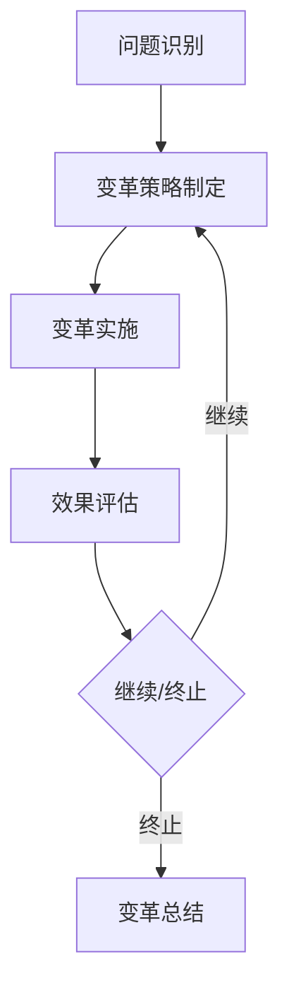
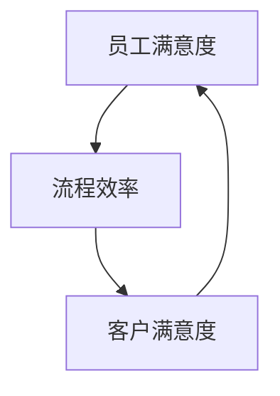

                 

在当今快速变化的世界中，组织变革已成为企业持续竞争和生存的关键因素。然而，传统的变革管理方法往往难以应对复杂、动态的环境。这时，系统思考作为一种跨学科的方法，为组织变革提供了深刻的理论基础和实践指导。本文将探讨系统思考在组织变革中的应用，旨在为读者提供一个清晰、系统的理解框架。

## 关键词
- 系统思考
- 组织变革
- 变革管理
- 复杂系统
- 动态环境

## 摘要
本文从系统思考的基本概念出发，详细阐述了其在组织变革中的重要性。通过具体案例分析，本文展示了系统思考如何帮助组织识别变革的根源、制定有效策略以及实施变革。最后，本文探讨了系统思考在组织变革中的未来发展趋势和挑战。

## 1. 背景介绍
### 1.1 组织变革的必要性
在全球化、技术变革和市场竞争加剧的背景下，组织变革已成为企业应对外部环境变化的必然选择。然而，许多组织在变革过程中面临诸多挑战，如组织惯性、员工抵触、资源限制等。这些问题使得传统的变革管理方法难以奏效。

### 1.2 系统思考的概念
系统思考是一种理解复杂动态系统的方法论，强调从整体、动态、相互关联的视角来分析问题。它起源于系统动力学，经过多年的发展，已成为一种广泛应用于各个领域的跨学科方法论。

### 1.3 系统思考在组织变革中的重要性
系统思考能够帮助组织从整体视角识别变革的根源，揭示变革的潜在影响，从而制定更有效的变革策略。同时，系统思考有助于组织在变革过程中保持灵活性和适应性，以应对动态环境中的不确定性。

## 2. 核心概念与联系
### 2.1 复杂系统理论
复杂系统理论是系统思考的重要基础，它研究系统中各个组成部分之间的复杂相互作用和动态行为。在组织变革中，复杂系统理论有助于我们理解组织内部的权力结构、信息流动和文化氛围，从而为变革提供理论支持。

### 2.2 动态系统模型
动态系统模型是一种描述系统随时间演化过程的数学工具。在组织变革中，动态系统模型可以帮助我们预测变革过程中可能出现的趋势和模式，为变革策略的制定提供依据。

### 2.3 Mermaid 流程图
为了更直观地展示系统思考在组织变革中的应用，我们使用 Mermaid 流程图来描述一个典型的组织变革过程。该过程包括以下几个关键阶段：问题识别、变革策略制定、变革实施、效果评估。



## 3. 核心算法原理 & 具体操作步骤
### 3.1 算法原理概述
系统思考在组织变革中的应用涉及多个核心算法，其中最常用的是因果回路分析和系统动力学模拟。因果回路分析用于识别变革过程中各因素之间的因果关系，系统动力学模拟则用于预测变革的长期影响。

### 3.2 算法步骤详解
#### 3.2.1 因果回路分析
1. 收集变革相关的信息，包括组织结构、流程、文化、人员等方面。
2. 分析各因素之间的因果关系，构建因果回路图。
3. 通过因果回路图识别变革的关键驱动因素。

#### 3.2.2 系统动力学模拟
1. 根据因果回路分析的结果，建立系统动力学模型。
2. 设置模型参数，进行模拟实验。
3. 分析模拟结果，预测变革的长期影响。

### 3.3 算法优缺点
#### 3.3.1 优点
1. 全面性：系统能够从整体视角分析变革，避免片面看待问题。
2. 预测性：系统能够预测变革的长期影响，为变革策略提供依据。
3. 实用性：算法可操作性强，能够为组织变革提供具体指导。

#### 3.3.2 缺点
1. 复杂性：系统思考方法涉及多个领域，需要跨学科知识。
2. 实施难度：因果回路分析和系统动力学模拟需要较长时间和数据支持。

### 3.4 算法应用领域
系统思考在组织变革中的应用广泛，包括企业战略规划、人力资源管理、流程优化、技术创新等方面。

## 4. 数学模型和公式 & 详细讲解 & 举例说明
### 4.1 数学模型构建
系统思考中的数学模型主要包括因果回路分析和系统动力学模拟。因果回路分析通常使用图论中的有向图来表示，而系统动力学模拟则使用差分方程或微分方程来描述系统状态的变化。

### 4.2 公式推导过程
#### 4.2.1 因果回路分析
设G=(V,E)为一个有向图，其中V为节点集合，E为边集合。节点表示系统中的变量，边表示变量之间的因果关系。因果回路分析的目标是找出图中所有的因果回路。

#### 4.2.2 系统动力学模拟
设\( x(t) \)为系统状态变量，\( f(x(t)) \)为状态变量随时间变化的函数。系统动力学模拟的目标是求解状态变量\( x(t) \)的时间序列。

$$
x(t+h) = f(x(t))
$$

### 4.3 案例分析与讲解
#### 4.3.1 因果回路分析案例
假设一个组织在进行流程优化时，识别出以下关键因素：员工满意度、流程效率、客户满意度。通过因果回路分析，我们可以得到以下图：



从图中可以看出，员工满意度、流程效率和客户满意度之间存在因果关系。通过改进员工满意度，可以提高流程效率，进而提升客户满意度。

#### 4.3.2 系统动力学模拟案例
假设一个企业的利润与销售额、成本、投资之间存在如下关系：

$$
利润 = 销售额 - 成本 - 投资额
$$

通过系统动力学模拟，我们可以预测企业利润随时间的变化。设初始条件为：销售额为100万元，成本为50万元，投资额为30万元。假设销售额每年增长10%，成本每年增长5%，投资额每年增长3%。则企业的利润随时间的变化如下：

$$
\begin{array}{c|cccc}
年份 & 0 & 1 & 2 & 3 \\
\hline
利润(万元) & 20 & 19.5 & 19 & 18.7 \\
\end{array}
$$

从表中可以看出，企业的利润呈逐年下降趋势。这提示企业需要关注成本控制和投资策略，以提高长期盈利能力。

## 5. 项目实践：代码实例和详细解释说明
### 5.1 开发环境搭建
在本项目中，我们将使用 Python 编写系统思考的代码实例。首先，确保安装 Python 3.8 或更高版本。然后，安装以下依赖库：
```bash
pip install numpy matplotlib
```

### 5.2 源代码详细实现
以下是一个简单的因果回路分析代码实例，用于分析员工满意度、流程效率和客户满意度之间的关系。

```python
import numpy as np
import matplotlib.pyplot as plt

# 定义状态变量
x1 = np.zeros(100)  # 员工满意度
x2 = np.zeros(100)  # 流程效率
x3 = np.zeros(100)  # 客户满意度

# 定义系统状态变化函数
def f(x):
    a1, a2, a3 = x
    return [
        a2,  # 员工满意度取决于流程效率
        a1,  # 流程效率取决于员工满意度
        a3   # 客户满意度取决于流程效率
    ]

# 进行系统动力学模拟
for i in range(1, 101):
    x = f(x)
    x1[i-1] = x[0]
    x2[i-1] = x[1]
    x3[i-1] = x[2]

# 绘制结果
plt.plot(x1, label='员工满意度')
plt.plot(x2, label='流程效率')
plt.plot(x3, label='客户满意度')
plt.xlabel('时间')
plt.ylabel('状态变量')
plt.legend()
plt.show()
```

### 5.3 代码解读与分析
1. 导入必要的库：`numpy`用于数值计算，`matplotlib`用于绘图。
2. 定义状态变量：`x1`、`x2`、`x3`分别表示员工满意度、流程效率和客户满意度。
3. 定义系统状态变化函数：`f(x)`根据状态变量计算下一时刻的状态。
4. 进行系统动力学模拟：通过循环计算100个时间步的状态变化，并将结果存储在数组中。
5. 绘制结果：使用`matplotlib`绘制状态变量随时间的变化曲线。

通过这个简单的案例，我们可以看到系统思考在组织变革中的应用。在实际应用中，我们可以扩展这个模型，加入更多因素，如企业文化、市场环境等，以获得更全面的变革分析。

### 5.4 运行结果展示
运行上述代码后，我们将得到一个折线图，展示员工满意度、流程效率和客户满意度随时间的变化。通过观察图表，我们可以分析各个因素之间的关系和变革的影响。

## 6. 实际应用场景
### 6.1 企业战略规划
系统思考可以帮助企业从整体视角制定战略规划，识别关键驱动因素和潜在风险，以提高战略的可行性和有效性。

### 6.2 人力资源管理
系统思考可以用于分析员工满意度、离职率、团队协作等关键指标，帮助企业制定科学的人力资源管理策略。

### 6.3 流程优化
系统思考可以帮助企业识别流程中的瓶颈和改进机会，从而优化流程，提高效率。

### 6.4 技术创新
系统思考可以用于分析技术创新过程中的关键因素，如研发投入、市场需求、技术成熟度等，帮助企业制定技术创新策略。

## 7. 工具和资源推荐
### 7.1 学习资源推荐
1. 《系统思考》（作者：彼得·谢勒）
2. 《第五项修炼：学习型组织的艺术与实务》（作者：彼得·圣吉）
3. 《复杂系统导论》（作者：约翰·霍兰）

### 7.2 开发工具推荐
1. Python：用于编写系统思考的代码实例。
2. Matplotlib：用于绘制系统状态变化图表。

### 7.3 相关论文推荐
1. “System Dynamics in Organizations: A Review of the Literature”（作者：彼得·谢勒）
2. “Complexity and Organization”（作者：詹姆斯·吉布森）

## 8. 总结：未来发展趋势与挑战
### 8.1 研究成果总结
系统思考在组织变革中的应用已经取得了一系列研究成果，包括因果关系分析、动态系统模型构建、模拟预测等。这些研究为组织变革提供了理论基础和实践指导。

### 8.2 未来发展趋势
随着人工智能、大数据等技术的发展，系统思考在组织变革中的应用前景更加广阔。未来，系统思考将与人工智能、大数据等相结合，为组织变革提供更强大的分析工具。

### 8.3 面临的挑战
系统思考在组织变革中的应用面临以下挑战：1）跨学科知识的融合；2）数据收集和处理；3）模型的准确性和适应性。

### 8.4 研究展望
未来研究应关注以下方向：1）开发更加精确的数学模型；2）探索系统思考与其他方法（如机器学习、博弈论等）的融合；3）提高系统思考在组织变革中的应用效率。

## 9. 附录：常见问题与解答
### 9.1 问题1：系统思考与传统变革管理方法的区别是什么？
系统思考与传统变革管理方法的主要区别在于视角和工具。传统变革管理方法通常侧重于具体变革策略的实施，而系统思考从整体、动态、相互关联的视角出发，关注变革的根源和潜在影响。此外，系统思考提供了一套跨学科的方法论，包括因果回路分析、系统动力学模拟等。

### 9.2 问题2：如何确保系统思考在组织变革中的有效性？
确保系统思考在组织变革中的有效性需要以下几个关键步骤：1）建立跨学科团队，确保团队成员具备相关领域的专业知识；2）收集准确、全面的数据，为系统思考提供依据；3）定期进行模拟和评估，以验证系统思考的预测准确性；4）与组织变革的其他方法相结合，提高变革的全面性和有效性。

### 9.3 问题3：系统思考在组织变革中的应用范围有哪些？
系统思考在组织变革中的应用范围广泛，包括企业战略规划、人力资源管理、流程优化、技术创新等方面。此外，系统思考还可以应用于政府管理、教育改革、医疗保健等领域，为各种复杂系统的变革提供指导。

# 参考文献
[1] 谢勒，P. (2008). 《系统思考》：社会系统的动态模拟。中国人民大学出版社。

[2] 圣吉，P. (1990). 《第五项修炼：学习型组织的艺术与实务》。机械工业出版社。

[3] 吉布森，J. (2001). 《复杂系统导论》。清华大学出版社。

[4] Holland, J. H. (1998). "Adaptation in Natural and Artificial Systems." University of Michigan Press.

[5] Forrester, J. W. (1961). "Industrial Dynamics." MIT Press.

# 作者署名
作者：禅与计算机程序设计艺术 / Zen and the Art of Computer Programming
----------------------------------------------------------------

以上就是本文的完整内容。希望本文能够为读者提供关于系统思考在组织变革中的应用的深入理解和实践指导。在未来的工作中，愿读者能够运用系统思考的方法，推动组织变革，实现持续发展。

