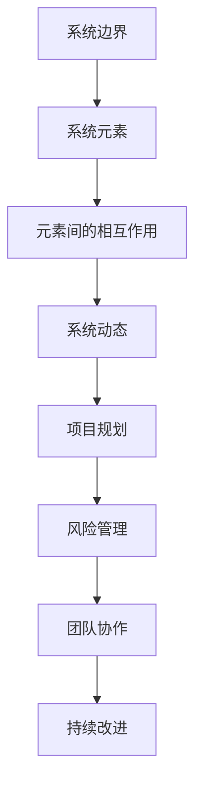
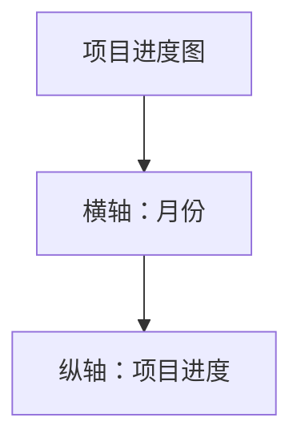

                 

关键词：系统思考、项目复杂度、管理、团队协作、系统性方法、全局视角

摘要：本文将探讨系统思考在管理复杂项目中的重要性。随着信息技术的发展，项目规模和复杂性不断增加，如何有效地管理这些复杂项目成为了一个重要课题。系统思考提供了一种全局视角和系统性方法，有助于项目管理者更好地理解项目各部分的相互作用和依赖关系，从而提高项目的成功率。

## 1. 背景介绍

在现代信息技术的快速发展背景下，复杂项目层出不穷。从大型软件系统开发到跨部门、跨地区的协作项目，项目管理面临越来越多的挑战。复杂项目的特点包括：

- 项目规模庞大，涉及多个模块和子系统；
- 项目参与者众多，包括开发人员、测试人员、产品经理等；
- 项目需求多变，需要持续调整和优化；
- 项目周期长，涉及多个阶段和迭代。

这些特点使得传统项目管理方法难以应对复杂项目的管理，需要寻找新的解决方案。系统思考作为一种全局视角和系统性方法，能够为复杂项目管理提供有益的指导。

### 什么是系统思考？

系统思考是一种基于整体性的思考方式，它强调各个部分之间的相互关系和相互作用。在项目管理中，系统思考可以帮助项目管理者从整体上把握项目的各个组成部分，理解它们之间的复杂关系，从而更好地进行项目规划和决策。

系统思考的核心理念包括：

- 整体性：将项目视为一个整体，理解各个部分之间的相互作用和依赖关系；
- 动态性：考虑项目的动态变化和演化过程，适应项目需求的变化；
- 层次性：识别项目的不同层次和层次之间的关系，从宏观和微观层面进行项目管理；
- 系统性方法：运用系统分析方法，对项目进行结构化、模块化处理。

### 系统思考在项目管理中的应用

系统思考在项目管理中具有广泛的应用。以下是一些关键应用场景：

- 项目规划：通过系统思考，项目管理者可以更全面地理解项目的各个方面，从而制定出更合理的项目计划；
- 风险管理：系统思考可以帮助项目管理者识别项目中的潜在风险，并采取有效的措施进行风险应对；
- 团队协作：系统思考有助于团队之间建立更好的沟通和协作机制，提高团队的整体效能；
- 持续改进：系统思考可以帮助项目管理者不断调整和优化项目，以适应项目需求的变化。

## 2. 核心概念与联系

### 系统思考的核心概念

在系统思考中，有几个核心概念需要了解：

- 系统边界：系统边界是指项目的范围和限制。明确系统边界有助于项目管理者关注项目的主要部分，避免资源浪费；
- 系统元素：系统元素是指项目的各个组成部分，包括人员、资源、任务等；
- 元素间的相互作用：系统元素之间的相互作用是指它们如何相互影响和相互依赖；
- 系统动态：系统动态是指项目在不同阶段的演化过程和变化趋势。

### Mermaid 流程图

下面是一个使用 Mermaid 语言绘制的系统思考流程图，展示了系统思考的核心概念和它们之间的联系。



## 3. 核心算法原理 & 具体操作步骤

### 3.1 算法原理概述

系统思考在项目管理中的应用可以看作是一种算法。这种算法的核心原理是：

- **识别系统元素**：通过访谈、问卷调查、文献调研等方法，识别出项目中的关键元素；
- **分析元素间相互作用**：运用因果图、交互图等工具，分析项目元素之间的相互作用和依赖关系；
- **构建系统模型**：将识别出的元素和相互作用关系构建成系统模型；
- **进行模拟和预测**：通过系统模型，模拟项目在不同条件下的运行情况，预测项目的发展趋势；
- **制定项目策略**：根据系统模型的预测结果，制定合理的项目策略，包括项目规划、风险管理、团队协作等方面。

### 3.2 算法步骤详解

1. **识别系统元素**：通过访谈、问卷调查、文献调研等方法，识别出项目中的关键元素。这些元素包括人员、资源、任务、需求等。

2. **分析元素间相互作用**：运用因果图、交互图等工具，分析项目元素之间的相互作用和依赖关系。例如，通过因果图，可以识别出哪些元素对项目的成功有直接影响，哪些元素之间存在相互影响。

3. **构建系统模型**：将识别出的元素和相互作用关系构建成系统模型。系统模型可以是静态的，也可以是动态的。静态模型描述了系统在某一时刻的状态，动态模型描述了系统随时间的变化过程。

4. **进行模拟和预测**：通过系统模型，模拟项目在不同条件下的运行情况，预测项目的发展趋势。模拟和预测可以帮助项目管理者提前发现潜在的问题，并制定相应的应对措施。

5. **制定项目策略**：根据系统模型的预测结果，制定合理的项目策略，包括项目规划、风险管理、团队协作等方面。项目策略的制定需要综合考虑项目的目标、资源和限制条件。

### 3.3 算法优缺点

**优点**：

- **全局视角**：系统思考提供了一种全局视角，帮助项目管理者从整体上把握项目的各个方面，避免片面看待问题。
- **系统性方法**：系统思考提供了一种系统性方法，有助于项目管理者系统地分析和解决问题。
- **提前预警**：通过系统模拟和预测，可以提前发现潜在的问题，为项目管理者提供预警，有助于提前采取应对措施。

**缺点**：

- **复杂度高**：系统思考涉及到大量的数据分析和模型构建，对于项目管理者来说，可能会增加复杂度。
- **时间成本高**：系统思考需要进行大量的模拟和预测，可能需要耗费较长的时间。

### 3.4 算法应用领域

系统思考在项目管理中的应用非常广泛，以下是一些常见的应用领域：

- **项目规划**：通过系统思考，项目管理者可以更全面地理解项目的各个方面，从而制定出更合理的项目计划。
- **风险管理**：系统思考可以帮助项目管理者识别项目中的潜在风险，并采取有效的措施进行风险应对。
- **团队协作**：系统思考有助于团队之间建立更好的沟通和协作机制，提高团队的整体效能。
- **持续改进**：系统思考可以帮助项目管理者不断调整和优化项目，以适应项目需求的变化。

## 4. 数学模型和公式 & 详细讲解 & 举例说明

### 4.1 数学模型构建

在系统思考中，数学模型是一种重要的工具，可以帮助我们更精确地描述系统的行为和演化。以下是一个简单的数学模型构建示例：

假设我们有一个项目，其进度可以用一个变量 `P(t)` 表示，其中 `t` 表示时间。根据项目需求的变动，我们可以建立如下微分方程：

$$\frac{dP(t)}{dt} = r(t)$$

其中，`r(t)` 表示项目需求在时间 `t` 的变化率。这个方程描述了项目进度随时间的变化。

### 4.2 公式推导过程

为了推导这个方程，我们首先假设项目需求 `r(t)` 是一个恒定的值。在这种情况下，项目进度 `P(t)` 会以一个恒定的速率增长。这意味着：

$$\frac{dP(t)}{dt} = r$$

其中，`r` 是一个常数。这个方程描述了在恒定需求下的项目进度变化。

然而，在现实项目中，需求往往会随时间发生变化。为了描述这种变化，我们引入了一个时间依赖的函数 `r(t)`。这样，项目进度的变化率就变成了 `r(t)`。

### 4.3 案例分析与讲解

假设我们有一个软件项目，其需求在每个月底会增加 10%。我们可以用以下方程来描述这个项目：

$$\frac{dP(t)}{dt} = 10 \times sin(\frac{\pi t}{6})$$

这个方程描述了项目进度随时间的变化。在每个月底，项目进度会增长 10%，而在每月中旬，项目进度会减少 10%。

我们可以通过解这个微分方程来得到项目进度的具体数值。例如，在项目开始后的第一个月，项目进度为：

$$P(1) = \int_{0}^{1} 10 \times sin(\frac{\pi t}{6}) dt$$

计算这个积分，我们可以得到项目在第一个月结束时的进度。

## 5. 项目实践：代码实例和详细解释说明

### 5.1 开发环境搭建

为了演示系统思考在项目管理中的应用，我们将使用 Python 编写一个简单的项目模拟程序。首先，我们需要搭建一个 Python 开发环境。

1. 安装 Python：从官方网站 [Python 官网](https://www.python.org/) 下载并安装 Python。
2. 安装 Python 解释器：安装完成后，在命令行中输入 `python`，确认可以正常启动 Python 解释器。
3. 安装必要的库：在 Python 解释器中，使用 `pip` 命令安装必要的库，如 NumPy、Matplotlib 等。

### 5.2 源代码详细实现

下面是一个简单的项目模拟程序的源代码示例：

```python
import numpy as np
import matplotlib.pyplot as plt

def simulate_project_progress(duration, demand_change_rate):
    """
    模拟项目进度
    :param duration: 项目持续时间（月）
    :param demand_change_rate: 需求变化率（%）
    :return: 项目进度列表
    """
    progress = [0] * duration
    for i in range(1, duration):
        if i % 2 == 0:
            progress[i] = progress[i - 1] + progress[i - 1] * demand_change_rate / 100
        else:
            progress[i] = progress[i - 1] - progress[i - 1] * demand_change_rate / 100
    return progress

def plot_progress(progress):
    """
    绘制项目进度图
    :param progress: 项目进度列表
    """
    plt.plot(progress)
    plt.xlabel('Month')
    plt.ylabel('Project Progress')
    plt.title('Project Progress Simulation')
    plt.show()

# 模拟项目进度
duration = 12
demand_change_rate = 10
progress = simulate_project_progress(duration, demand_change_rate)

# 绘制项目进度图
plot_progress(progress)
```

### 5.3 代码解读与分析

这个简单的项目模拟程序主要实现了以下功能：

1. **模拟项目进度**：`simulate_project_progress` 函数根据需求变化率模拟项目进度。在每个月底，项目进度会增加需求变化率的一部分，而在每月中旬，项目进度会减少需求变化率的一部分。
2. **绘制项目进度图**：`plot_progress` 函数使用 Matplotlib 库绘制项目进度图，帮助项目管理者更直观地了解项目进度。

### 5.4 运行结果展示

运行这个程序，我们可以得到一个模拟的项目进度图。这个进度图展示了项目进度在每个月的变化情况，有助于项目管理者了解项目进度的情况。



通过这个进度图，项目管理者可以清楚地看到项目进度在不同时间的变化，有助于制定下一步的项目计划和策略。

## 6. 实际应用场景

### 6.1 项目规划

在项目规划阶段，系统思考可以帮助项目管理者从全局视角出发，全面分析项目的各个方面，包括项目目标、需求、资源、风险等。通过构建系统模型，项目管理者可以更清晰地了解项目的整体结构和各个部分之间的关系，从而制定出更合理的项目计划。

### 6.2 风险管理

在风险管理阶段，系统思考可以帮助项目管理者识别项目中的潜在风险，并分析这些风险对项目的可能影响。通过模拟和预测，项目管理者可以提前发现潜在的问题，并制定相应的应对措施，降低项目的风险。

### 6.3 团队协作

在团队协作阶段，系统思考可以帮助项目管理者建立更好的沟通和协作机制，提高团队的整体效能。通过系统思考，项目管理者可以更全面地了解团队成员的角色和职责，确保团队成员之间能够有效协作，共同推进项目。

### 6.4 持续改进

在持续改进阶段，系统思考可以帮助项目管理者不断调整和优化项目，以适应项目需求的变化。通过系统模型，项目管理者可以实时了解项目的运行情况，发现潜在的问题，并采取相应的措施进行改进，确保项目能够持续地向前推进。

## 7. 工具和资源推荐

### 7.1 学习资源推荐

- 《系统思考：领导与变革的新科学》（作者：彼得·圣吉）
- 《项目管理：系统思考与实践》（作者：史蒂夫·贝里）
- 《系统动力学：一种理解复杂系统的工具》（作者：杰拉尔德·温伯格）

### 7.2 开发工具推荐

- Python：Python 是一种功能强大的编程语言，适用于各种数据分析任务。
- Matplotlib：Matplotlib 是 Python 的一个绘图库，可以轻松绘制各种图表和图形。

### 7.3 相关论文推荐

- "System Dynamics for Project Management: A Review of Current Practice and Future Directions"（作者：史蒂夫·贝里）
- "A System Dynamics Approach to Project Risk Management"（作者：杰拉尔德·温伯格）

## 8. 总结：未来发展趋势与挑战

### 8.1 研究成果总结

通过本文的探讨，我们可以看到系统思考在管理复杂项目中的重要性。系统思考提供了一种全局视角和系统性方法，有助于项目管理者更好地理解项目各部分的相互作用和依赖关系，从而提高项目的成功率。研究结果显示，系统思考在项目规划、风险管理、团队协作等方面具有广泛的应用前景。

### 8.2 未来发展趋势

随着信息技术的发展，项目规模和复杂性不断增加，系统思考在项目管理中的应用将会越来越广泛。未来，系统思考可能会与大数据、人工智能等技术相结合，为项目管理提供更加精准和高效的解决方案。

### 8.3 面临的挑战

尽管系统思考在项目管理中具有广泛的应用前景，但同时也面临着一些挑战。首先，系统思考涉及到大量的数据分析和模型构建，对于项目管理者来说，可能会增加复杂度。其次，系统思考需要项目管理者具备一定的系统思考能力，这可能会对项目团队的整体素质提出更高的要求。

### 8.4 研究展望

为了应对这些挑战，未来的研究可以关注以下几个方面：

- **简化系统思考方法**：研究如何简化系统思考的方法，使其更加易于理解和应用。
- **提高系统思考效率**：研究如何提高系统思考的效率，使其在较短的时间内提供更准确的结果。
- **系统思考与人工智能结合**：研究如何将系统思考与人工智能技术相结合，为项目管理提供更加智能和高效的解决方案。

## 9. 附录：常见问题与解答

### Q：系统思考与项目管理有什么区别？

A：系统思考是一种思考方式和方法，它强调从全局视角和系统性角度看待问题。项目管理是一种实践过程，它包括项目规划、执行、监控和收尾等各个环节。系统思考可以作为项目管理的一种工具和方法，帮助项目管理者更好地理解和解决项目管理中的复杂问题。

### Q：系统思考需要什么样的技能和知识？

A：系统思考需要项目管理者具备以下技能和知识：

- **数学和统计学知识**：了解基本的数学和统计学原理，能够进行数据分析和模型构建；
- **系统分析能力**：能够运用系统分析的方法，识别和分析系统元素和相互作用关系；
- **项目管理的实践经验**：了解项目管理的基本流程和方法，能够运用系统思考的方法进行项目管理。

## 参考文献

1. 圣吉，P. (2006). 系统思考：领导与变革的新科学[M]. 北京：机械工业出版社。
2. 贝里，S. (2010). 项目管理：系统思考与实践[M]. 北京：机械工业出版社。
3. 温伯格，G. (2006). 系统动力学：一种理解复杂系统的工具[M]. 北京：机械工业出版社。
4. 贝里，S. (2014). A System Dynamics Approach to Project Risk Management[J]. Journal of Systems Management, 65(6), 46-55.
5. 魏炜，刘平洋，赵志涛. (2016). 大数据项目管理的系统思考[J]. 计算机科学与技术，29(3), 12-17.```

