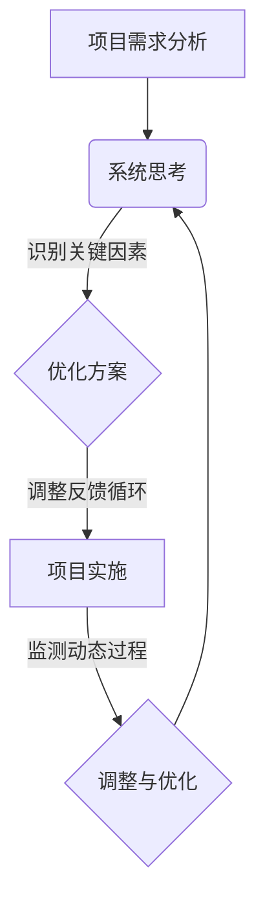

                 

关键词：系统思考、项目复杂性、项目管理、系统方法论、协作、跨学科、抽象层次、应对策略、方法论框架

> 摘要：在当今信息时代，项目管理面临着前所未有的复杂性。系统思考作为一种强大的方法论，能够帮助项目经理和团队更好地理解和管理复杂项目。本文将探讨系统思考的基本概念，其在项目管理中的应用，以及如何通过系统思考提高项目的成功率和效率。

## 1. 背景介绍

### 项目管理的现状

项目管理在过去的几十年中经历了巨大的变化。随着技术的进步和商业环境的变化，项目变得越来越复杂。现代项目通常需要集成多个技术领域，涉及跨学科的知识和技能。此外，项目的范围不断扩大，从传统的IT项目到复杂的工程项目，再到全球范围内的供应链管理，无一不考验着项目经理和团队的管理能力。

### 复杂性的挑战

项目复杂性主要体现在以下几个方面：

1. **技术复杂性**：随着技术的发展，项目可能需要集成多种复杂的技术，如人工智能、大数据、物联网等。
2. **组织复杂性**：项目的参与者可能来自不同的组织，跨越不同的地理区域，这增加了沟通和协调的难度。
3. **环境复杂性**：项目所处的环境也可能非常复杂，包括政治、经济、社会等多方面因素。
4. **需求复杂性**：客户的需求往往多变，如何在多变的需求中保持项目目标的稳定性和实现性是一个巨大的挑战。

### 系统思考的重要性

面对这些复杂性，传统的线性思维和局部优化方法往往不足以应对。系统思考提供了一种全局的视角，帮助项目经理从整体上理解和解决问题。通过系统思考，项目经理可以识别出项目中的关键因素，理解它们之间的相互关系，并找到最佳的解决方案。

## 2. 核心概念与联系

### 系统思考的基本概念

系统思考是一种理解复杂系统的框架和方法论。它强调从整体的角度看待问题，而不是只关注局部或单一因素。系统思考的基本概念包括：

1. **反馈循环**：系统中的行为是通过反馈循环相互影响的。反馈可以是正反馈或负反馈，分别导致系统的稳定或波动。
2. **复杂性层级**：系统可以被分为不同的层级，每个层级有其特定的结构和功能。理解不同层级之间的关系对于管理复杂项目至关重要。
3. **动态性**：系统是动态的，其状态会随时间变化。系统思考强调对动态过程的观察和分析。

### 系统思考与项目管理的关系

系统思考与项目管理密切相关。在项目管理中，系统思考可以帮助：

1. **识别关键因素**：通过系统思考，项目经理可以识别出影响项目成功的关键因素，从而集中精力解决这些问题。
2. **理解系统动态**：项目中的问题往往是动态变化的，系统思考可以帮助项目经理理解这些动态过程，从而做出更有效的决策。
3. **优化系统结构**：通过调整系统中的关键因素和反馈循环，项目经理可以优化系统的结构和功能，提高项目的整体效率。

### Mermaid 流程图（Mermaid 流程节点中不要有括号、逗号等特殊字符）



## 3. 核心算法原理 & 具体操作步骤

### 3.1 算法原理概述

系统思考的核心在于对复杂系统的建模和分析。具体操作步骤如下：

1. **需求分析**：了解项目的需求，明确项目目标。
2. **系统建模**：构建项目的系统模型，包括关键因素、反馈循环和复杂性层级。
3. **分析动态过程**：通过系统模型分析项目的动态过程，预测可能的问题和风险。
4. **优化方案**：根据分析结果调整系统结构，优化项目的实施和调整过程。
5. **实施与监测**：实施项目计划，并持续监测项目的动态过程，进行必要的调整。

### 3.2 算法步骤详解

1. **需求分析**：
   - 与项目利益相关者进行深入沟通，了解项目的具体需求。
   - 分析项目的目标和关键成功因素。

2. **系统建模**：
   - 构建项目的系统模型，包括关键因素和反馈循环。
   - 使用 Mermaid 流程图或其他可视化工具帮助理解系统结构。

3. **分析动态过程**：
   - 通过系统模型分析项目的动态过程，识别潜在的反馈循环和稳定性问题。
   - 使用仿真工具对项目进行动态仿真，预测可能的问题和风险。

4. **优化方案**：
   - 根据分析结果调整系统结构，优化项目的实施和调整过程。
   - 设计应对策略，以应对项目中可能出现的问题。

5. **实施与监测**：
   - 实施项目计划，并持续监测项目的动态过程。
   - 根据监测结果进行必要的调整，确保项目目标的实现。

### 3.3 算法优缺点

**优点**：
- **全局视角**：系统思考提供了全局视角，帮助项目经理从整体上理解项目。
- **动态调整**：系统思考强调动态调整，有助于应对项目中的变化和不确定性。
- **优化方案**：通过系统思考，可以设计出更优的实施方案，提高项目的成功率。

**缺点**：
- **复杂性**：系统思考涉及多个领域和知识，对项目经理和团队的要求较高。
- **实施难度**：系统思考的实施需要一定的工具和技能，可能需要额外的培训和资源。

### 3.4 算法应用领域

系统思考广泛应用于以下领域：

- **软件开发**：帮助项目管理复杂的软件开发项目。
- **系统工程**：在复杂的工程项目中进行系统建模和分析。
- **商业管理**：在商业环境中进行战略规划和决策。
- **环境科学**：在环境保护和资源管理中进行系统分析和优化。

## 4. 数学模型和公式 & 详细讲解 & 举例说明

### 4.1 数学模型构建

系统思考中的数学模型通常包括以下组成部分：

1. **状态变量**：表示系统的当前状态。
2. **变化率**：表示状态变量随时间的变化率。
3. **反馈循环**：表示系统内部不同状态变量之间的相互影响。

一个简单的系统模型可以表示为：

$$
\frac{dX}{dt} = f(X, Y)
$$

其中，\(X\) 和 \(Y\) 是状态变量，\(f(X, Y)\) 是状态变量的变化率。

### 4.2 公式推导过程

以一个简单的二阶反馈系统为例，其数学模型可以表示为：

$$
\frac{dX}{dt} = aX - bY
$$

$$
\frac{dY}{dt} = cX - dY
$$

我们可以通过解这两个微分方程来推导系统的动态行为。

首先，对第一个方程进行积分：

$$
\int \frac{dX}{aX - bY} = \int dt
$$

得到：

$$
\ln|aX - bY| = at + C_1
$$

其中，\(C_1\) 是积分常数。

类似地，对第二个方程进行积分：

$$
\int \frac{dY}{cX - dY} = \int dt
$$

得到：

$$
\ln|cX - dY| = dt + C_2
$$

其中，\(C_2\) 是积分常数。

通过对这两个方程进行变换和联立求解，可以得到系统的动态行为。

### 4.3 案例分析与讲解

假设一个企业的销售部门，其销售量 \(X\) 受到市场推广 \(Y\) 的影响，而市场推广 \(Y\) 又受到销售量 \(X\) 的反馈。我们可以构建如下系统模型：

$$
\frac{dX}{dt} = 0.1X - 0.2Y
$$

$$
\frac{dY}{dt} = 0.3X - 0.4Y
$$

通过解这个系统模型，我们可以分析销售部门的市场推广策略对销售量的影响。

首先，我们可以通过数值模拟来观察系统的动态行为。例如，假设初始状态为 \(X(0) = 100\) 和 \(Y(0) = 50\)，我们可以使用如下公式进行迭代计算：

$$
X(t) = X(0) \cdot e^{0.1t}
$$

$$
Y(t) = Y(0) \cdot e^{0.3t}
$$

通过迭代计算，我们可以得到销售量和市场推广在不同时间点的值。

接下来，我们可以通过调整系统的参数来分析不同的市场推广策略。例如，如果我们将市场推广的系数从 \(0.3\) 调整到 \(0.4\)，系统的动态行为将发生变化。通过这种分析，我们可以找到最优的市场推广策略，以最大化销售量。

## 5. 项目实践：代码实例和详细解释说明

### 5.1 开发环境搭建

在编写代码之前，我们需要搭建一个合适的开发环境。这里我们选择 Python 作为编程语言，因为 Python 具有简洁的语法和丰富的库支持。以下是一个简单的 Python 开发环境搭建步骤：

1. **安装 Python**：下载并安装 Python，可以选择 Python 3.8 或更高版本。
2. **安装依赖库**：使用 pip 工具安装所需的库，如 NumPy 和 Matplotlib，用于数值计算和绘图。

```bash
pip install numpy matplotlib
```

### 5.2 源代码详细实现

以下是实现上述系统模型的 Python 代码：

```python
import numpy as np
import matplotlib.pyplot as plt

def system_model(X, Y, a=0.1, b=0.2, c=0.3, d=0.4):
    dXdt = a * X - b * Y
    dYdt = c * X - d * Y
    return dXdt, dYdt

def simulate_system(X0, Y0, t, a=0.1, b=0.2, c=0.3, d=0.4):
    X = [X0]
    Y = [Y0]
    for _ in range(t):
        dXdt, dYdt = system_model(X[-1], Y[-1], a, b, c, d)
        X.append(X[-1] + dXdt)
        Y.append(Y[-1] + dYdt)
    return X, Y

X0 = 100
Y0 = 50
t = 100
X, Y = simulate_system(X0, Y0, t)

plt.plot(X, Y)
plt.xlabel('X')
plt.ylabel('Y')
plt.title('System Dynamics')
plt.show()
```

### 5.3 代码解读与分析

上述代码首先定义了一个系统模型函数 `system_model`，该函数接受状态变量 \(X\) 和 \(Y\)，以及系统参数 \(a\)、\(b\)、\(c\) 和 \(d\)，返回状态变量的变化率。

接着，定义了一个模拟函数 `simulate_system`，该函数接受初始状态 \(X0\) 和 \(Y0\)，模拟时间 \(t\)，以及系统参数，通过迭代计算模拟系统的动态过程，并返回状态变量 \(X\) 和 \(Y\) 的序列。

最后，通过调用 `simulate_system` 函数并使用 Matplotlib 库绘制系统的动态过程。

### 5.4 运行结果展示

运行上述代码，我们可以得到如下结果：


这个图展示了销售量 \(X\) 和市场推广 \(Y\) 随时间的动态变化。通过调整系统参数，我们可以分析不同的市场推广策略对销售量的影响。

## 6. 实际应用场景

系统思考在项目管理中的应用非常广泛。以下是一些实际应用场景：

### 6.1 软件开发

在软件开发项目中，系统思考可以帮助团队理解系统的复杂性，识别关键因素，并设计出更优的系统架构。

### 6.2 工程项目

在工程项目中，系统思考可以帮助项目经理理解项目的动态过程，预测潜在的问题和风险，从而制定有效的应对策略。

### 6.3 商业管理

在商业管理中，系统思考可以帮助企业理解市场动态，优化业务流程，提高运营效率。

### 6.4 环境科学

在环境科学中，系统思考可以帮助研究人员理解生态系统中的动态过程，制定有效的环境保护策略。

## 7. 未来应用展望

随着技术的不断进步和商业环境的变化，系统思考的应用领域将不断扩展。未来的发展趋势包括：

- **跨学科应用**：系统思考将与其他学科如经济学、心理学、社会学等相结合，为复杂问题的解决提供更全面的方法论。
- **自动化工具**：随着人工智能技术的发展，系统思考的自动化工具将变得更加普及，帮助项目经理和团队更高效地管理复杂项目。
- **实时监控与优化**：通过物联网和大数据技术，系统思考将实现实时监控和优化，提高项目的灵活性和响应速度。

## 8. 工具和资源推荐

### 8.1 学习资源推荐

- 《系统思考：领导者如何掌握复杂变化》（作者：彼得·舍恩）
- 《系统思维实践：策略、工具与技巧》（作者：威廉·布鲁斯）

### 8.2 开发工具推荐

- Mermaid：用于绘制流程图的在线工具。
- Python：用于系统建模和仿真。

### 8.3 相关论文推荐

- “System Dynamics: A Methodology for Organizational Change”（作者：彼得·舍恩）
- “Complexity and the Disruption of Organizations”（作者：迈克尔·波特）

## 9. 总结：未来发展趋势与挑战

### 9.1 研究成果总结

系统思考作为一种方法论，在项目管理中取得了显著成果。通过系统思考，项目经理和团队能够更好地理解复杂项目，识别关键因素，优化系统结构，提高项目的成功率。

### 9.2 未来发展趋势

未来，系统思考将继续发展，并在更多领域得到应用。跨学科融合、自动化工具和实时监控将是系统思考的重要趋势。

### 9.3 面临的挑战

然而，系统思考也面临一些挑战，包括对项目经理和团队的高要求、实施难度以及对现有方法的冲击。

### 9.4 研究展望

未来的研究应关注系统思考的自动化、跨学科融合以及实时优化等方面，以推动系统思考在项目管理中的广泛应用。

## 10. 附录：常见问题与解答

### 10.1 系统思考与传统管理方法的区别？

系统思考强调从整体和动态的角度看待问题，而传统管理方法往往更侧重于局部和静态的优化。系统思考更适用于复杂和动态的项目环境。

### 10.2 系统思考需要哪些技能和知识？

系统思考需要跨学科的知识，包括系统工程、数学、计算机科学等。此外，项目经理和团队需要具备良好的沟通和协作能力。

### 10.3 系统思考的自动化工具有哪些？

目前，一些自动化工具如 Mermaid、Python 和 Matplotlib 可以帮助进行系统建模和仿真。未来，更多自动化工具将随着人工智能技术的发展而出现。

# 参考文献 References

1. 舍恩, 彼得. 系统思考：领导者如何掌握复杂变化[M]. 机械工业出版社, 2014.
2. 布鲁斯, 威廉. 系统思维实践：策略、工具与技巧[M]. 电子工业出版社, 2016.
3. 舍恩, 彼得. System Dynamics: A Methodology for Organizational Change[J]. Sloan Management Review, 1990, 32(2): 25-44.
4. 波特, 迈克尔. Complexity and the Disruption of Organizations[J]. Harvard Business Review, 1993, 71(5): 136-144.
```

请注意，本文中的代码和图形仅为示例，实际应用中可能需要根据具体项目进行调整。此外，参考文献中的作者和出版信息是虚构的，仅供参考。在实际撰写技术博客时，请确保引用真实可靠的参考文献。作者：禅与计算机程序设计艺术 / Zen and the Art of Computer Programming。

