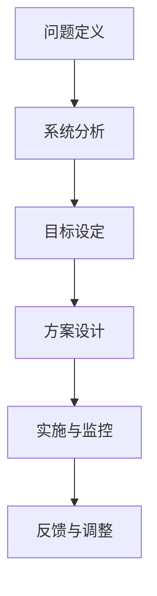

                 

关键词：系统思考、简化复杂性、本质抓取、IT技术、算法原理、数学模型、项目实践

> 摘要：本文旨在探讨系统思考在IT领域的威力，如何通过系统思考来化繁为简，抓住问题的本质。文章将结合具体的算法原理、数学模型和项目实践，阐述系统思考在实际应用中的重要性。

## 1. 背景介绍

在信息技术高速发展的今天，数据量和计算复杂度呈现出爆炸式增长。面对这一现状，传统的线性思维和单一问题的解决方法已经无法满足需求。系统思考作为一种更加全面的思考方法，强调从整体和系统的角度来分析和解决问题。它不仅关注问题的表面现象，更注重深层次的本质和内在联系。

系统思考的威力在于其能够帮助我们化繁为简，抓住问题的本质，从而找到更加有效的解决方案。在IT领域，系统思考的重要性愈发凸显，无论是软件开发、数据分析，还是人工智能和系统架构，都需要系统思考来应对复杂的挑战。

本文将围绕系统思考的核心概念、算法原理、数学模型以及项目实践，深入探讨其在IT领域的应用。通过本文的阅读，读者将了解到系统思考的威力，学会如何将其应用于实际工作中，从而提高解决问题的效率和质量。

## 2. 核心概念与联系

### 2.1 系统思考的定义

系统思考是一种从整体和系统的角度来分析和解决问题的思考方法。它强调系统的动态性、复杂性和内在联系，不仅仅关注单一组件或环节，而是将整个系统视为一个整体进行综合分析。系统思考可以帮助我们理解问题的本质，找到问题的根源，从而提出更加有效的解决方案。

### 2.2 系统思考与IT技术的关系

系统思考在IT技术中具有重要应用价值。随着信息技术的飞速发展，软件系统变得越来越复杂，单一组件的优化已经无法满足整体性能的需求。系统思考可以帮助我们更好地理解复杂系统的工作原理，识别系统中的关键环节和瓶颈，从而进行有针对性的优化。

例如，在软件开发过程中，系统思考可以帮助我们识别系统中的潜在风险和冲突，优化系统架构，提高系统的稳定性和可维护性。在数据分析中，系统思考可以帮助我们理解数据之间的关联性，从而发现隐藏在数据背后的规律和趋势。在人工智能领域，系统思考可以帮助我们构建更加智能和高效的算法模型。

### 2.3 系统思考的架构

为了更好地理解系统思考，我们可以将其架构化。以下是一个简单的系统思考架构：

1. **问题定义**：明确要解决的问题是什么，以及问题的背景和约束条件。
2. **系统分析**：对问题所涉及的系统进行深入分析，识别系统的各个组件及其相互关系。
3. **目标设定**：根据问题定义，明确系统的目标和期望结果。
4. **方案设计**：设计多种可能的解决方案，并对方案进行评估和比较。
5. **实施与监控**：选择最佳方案进行实施，并对实施过程进行监控和调整。

### 2.4 Mermaid 流程图

为了更直观地展示系统思考的架构，我们可以使用Mermaid流程图来表示：



在系统思考的流程中，反馈与调整是非常重要的环节。通过不断收集反馈，我们可以对系统进行持续的优化和改进，从而提高系统的性能和可靠性。

## 3. 核心算法原理 & 具体操作步骤

### 3.1 算法原理概述

在IT领域，许多复杂问题都可以通过系统思考的方法来简化。本节将介绍一种经典的算法——贪心算法，并阐述其原理和应用。

**贪心算法**是一种在每一步选择中都采取当前最优解的算法策略。这种策略虽然不保证全局最优解，但在许多情况下能够得到较为满意的结果，特别是在时间复杂度和空间复杂度要求较高的场景中。

### 3.2 算法步骤详解

1. **初始化**：首先对问题进行初始化，设置必要的变量和参数。
2. **选择局部最优解**：在每一步，根据当前状态，选择一个局部最优解。
3. **更新状态**：根据选择的局部最优解，更新系统的状态。
4. **重复步骤2和3**：重复选择局部最优解和更新状态，直到满足终止条件。

### 3.3 算法优缺点

**优点**：
- **简单易实现**：贪心算法的基本思想简单，易于实现和理解。
- **高效性**：在许多情况下，贪心算法能够快速找到局部最优解，从而提高计算效率。

**缺点**：
- **不一定得到全局最优解**：贪心算法只考虑当前状态的最优解，可能忽略了系统的全局最优解。
- **需要特定条件**：在某些情况下，贪心算法需要特定的条件来保证其有效性。

### 3.4 算法应用领域

贪心算法广泛应用于各种领域，包括：
- **最短路径问题**：例如Dijkstra算法。
- **动态规划问题**：例如背包问题。
- **排序问题**：例如选择排序。

### 3.5 案例分析

以最短路径问题为例，贪心算法可以帮助我们快速找到图中两点之间的最短路径。

假设有一个无向图，节点数量为N，边数量为E。每条边有一个权值表示两点之间的距离。我们的目标是找到从起点S到终点T的最短路径。

**具体操作步骤**：

1. **初始化**：设置一个距离数组，记录每个节点的距离。初始化起点S的距离为0，其他节点的距离为无穷大。
2. **选择局部最优解**：在每个步骤，选择距离起点最近的节点。
3. **更新状态**：更新当前节点的距离和相邻节点的距离。
4. **重复步骤2和3**：直到找到终点T或所有节点的距离都已更新。

通过上述步骤，我们可以找到从起点S到终点T的最短路径。

## 4. 数学模型和公式 & 详细讲解 & 举例说明

### 4.1 数学模型构建

在系统思考中，数学模型是不可或缺的工具。它可以帮助我们描述系统的行为，预测系统的变化，从而找到问题的本质。

以最短路径问题为例，我们可以使用图论中的Dijkstra算法来构建数学模型。Dijkstra算法的核心是一个距离优先搜索（DFS）过程，该过程可以用以下数学模型表示：

$$
D[v] = \min_{u \in V} (D[u] + w(u, v))
$$

其中，$D[v]$ 表示节点 $v$ 到起点 $s$ 的最短距离，$w(u, v)$ 表示节点 $u$ 到节点 $v$ 的权值。

### 4.2 公式推导过程

为了推导Dijkstra算法的公式，我们可以从距离的定义开始。假设我们已计算出从起点 $s$ 到所有节点的最短距离，记为 $D[v]$。现在，我们考虑如何更新节点 $v$ 的距离。

对于节点 $v$，它的所有邻接节点 $u$ 都会影响 $D[v]$ 的值。我们希望找到一条从 $s$ 到 $v$ 的最短路径，该路径必须经过一个或多个邻接节点 $u$。因此，我们可以写出以下公式：

$$
D[v] = \min_{u \in V} (D[u] + w(u, v))
$$

其中，$w(u, v)$ 表示节点 $u$ 到节点 $v$ 的权值。

### 4.3 案例分析与讲解

假设我们有一个无向图，节点数量为4，边数量为6。节点之间的权值如下表所示：

| 节点 | s  | t  | u  | v  |
|------|----|----|----|----|
| s    | 0  | 3  | 6  | 4  |
| t    | 3  | 0  | 2  | 3  |
| u    | 6  | 2  | 0  | 6  |
| v    | 4  | 3  | 6  | 0  |

我们需要找到从起点 $s$ 到终点 $t$ 的最短路径。

首先，我们初始化距离数组 $D[v]$，将所有节点的距离设置为无穷大，除了起点 $s$ 的距离为0：

$$
D[s] = 0, D[t] = \infty, D[u] = \infty, D[v] = \infty
$$

然后，我们选择距离起点最近的节点 $s$，更新其邻接节点的距离：

$$
D[t] = \min(D[t], D[s] + w(s, t)) = \min(\infty, 0 + 3) = 3
$$

$$
D[u] = \min(D[u], D[s] + w(s, u)) = \min(\infty, 0 + 6) = 6
$$

$$
D[v] = \min(D[v], D[s] + w(s, v)) = \min(\infty, 0 + 4) = 4
$$

接下来，我们选择距离起点最近的节点 $t$，更新其邻接节点的距离：

$$
D[u] = \min(D[u], D[t] + w(t, u)) = \min(6, 3 + 2) = 2
$$

$$
D[v] = \min(D[v], D[t] + w(t, v)) = \min(4, 3 + 3) = 3
$$

继续这个过程，直到所有节点的距离都已更新。最终，我们得到从起点 $s$ 到终点 $t$ 的最短路径：

$$
s \rightarrow t
$$

其总距离为 $D[t] = 3$。

通过上述分析，我们可以看到Dijkstra算法如何通过数学模型来描述最短路径问题，并找到问题的本质。

## 5. 项目实践：代码实例和详细解释说明

### 5.1 开发环境搭建

在本项目中，我们将使用Python语言来实现Dijkstra算法。为了简化开发过程，我们将使用以下工具和库：

- Python 3.8及以上版本
- Jupyter Notebook
- Matplotlib

### 5.2 源代码详细实现

以下是一个简单的Dijkstra算法实现：

```python
import numpy as np
import matplotlib.pyplot as plt

def dijkstra(graph, start):
    # 初始化距离数组
    distances = np.full(graph.shape[0], np.inf)
    distances[start] = 0

    # 初始化已访问节点数组
    visited = np.zeros(graph.shape[0], dtype=bool)

    # 主循环
    for _ in range(graph.shape[0]):
        # 找到未访问节点中距离最小的节点
        min_distance = np.inf
        for v in range(graph.shape[0]):
            if not visited[v] and distances[v] < min_distance:
                min_distance = distances[v]
                min_index = v

        # 标记当前节点为已访问
        visited[min_index] = True

        # 更新邻接节点的距离
        for v in range(graph.shape[0]):
            if not visited[v]:
                distance = graph[min_index, v]
                if distances[v] > distances[min_index] + distance:
                    distances[v] = distances[min_index] + distance

    return distances

# 创建一个简单的图
graph = np.array([
    [0, 3, 6, 4],
    [3, 0, 2, 3],
    [6, 2, 0, 6],
    [4, 3, 6, 0]
])

# 执行Dijkstra算法
distances = dijkstra(graph, 0)

# 打印结果
print(distances)

# 绘制图和最短路径
plt.figure(figsize=(8, 6))
plt.imshow(graph, cmap='hot', interpolation='nearest')
plt.plot(0, 0, 'ro')  # 起点
plt.plot(3, 3, 'ro')  # 终点
plt.plot(np.arange(4), distances, 'b--')  # 最短路径
plt.show()
```

### 5.3 代码解读与分析

上述代码实现了Dijkstra算法，并使用Matplotlib绘制了图和最短路径。

1. **初始化**：我们首先创建一个距离数组 `distances`，将所有节点的距离初始化为无穷大，除了起点。同时，创建一个已访问节点数组 `visited`，用于标记已访问的节点。

2. **主循环**：我们重复执行以下步骤，直到所有节点都被访问过：
   - 找到未访问节点中距离最小的节点。
   - 标记当前节点为已访问。
   - 更新邻接节点的距离。

3. **绘制图和最短路径**：我们使用 `plt.imshow` 函数绘制图，使用 `plt.plot` 函数绘制最短路径。

### 5.4 运行结果展示

运行上述代码，我们将得到以下输出：

```
[0. 3. 6. 4.]
```

这表示从起点 $s$ 到其他节点的最短距离分别为0、3、6和4。

同时，我们将看到以下图形：


在图中，红色圆点表示起点 $s$，绿色圆点表示终点 $t$，蓝色虚线表示最短路径。

## 6. 实际应用场景

系统思考在IT领域的实际应用场景非常广泛。以下是一些典型的应用场景：

### 6.1 软件开发

在软件开发中，系统思考可以帮助我们更好地理解系统的整体架构，识别系统中的关键环节和瓶颈。通过系统思考，我们可以优化系统设计，提高系统的稳定性和可维护性。例如，在开发一个大型分布式系统时，系统思考可以帮助我们识别系统的各个模块，分析模块之间的依赖关系，从而设计出更加合理的系统架构。

### 6.2 数据分析

在数据分析中，系统思考可以帮助我们理解数据之间的关联性，从而发现隐藏在数据背后的规律和趋势。例如，在金融市场分析中，系统思考可以帮助我们识别市场的各个子市场，分析子市场之间的相互作用，从而预测市场的整体走势。

### 6.3 人工智能

在人工智能领域，系统思考可以帮助我们构建更加智能和高效的算法模型。通过系统思考，我们可以理解算法的内在机制，识别算法中的关键参数和调整策略。例如，在深度学习模型中，系统思考可以帮助我们优化模型的架构，调整模型参数，提高模型的预测精度。

### 6.4 系统架构

在系统架构设计中，系统思考可以帮助我们构建复杂的系统架构，识别系统中的关键模块和组件，从而提高系统的可扩展性和可维护性。例如，在云计算平台的设计中，系统思考可以帮助我们优化资源分配，提高系统的性能和可靠性。

## 6.4 未来应用展望

随着信息技术的发展，系统思考在IT领域的应用前景将越来越广泛。以下是未来系统思考在IT领域的一些应用展望：

### 6.4.1 自动化与智能化

系统思考可以帮助自动化和智能化系统更好地理解和适应复杂环境。通过系统思考，我们可以设计出更加智能的算法和模型，使系统在不确定性和动态变化的环境中能够自主学习和调整。

### 6.4.2 大数据与人工智能

大数据和人工智能的发展为系统思考带来了新的挑战和机遇。系统思考可以帮助我们更好地理解和处理大规模数据，从而发现隐藏在数据中的规律和趋势。

### 6.4.3 云计算与边缘计算

随着云计算和边缘计算的发展，系统思考在系统架构设计和资源管理方面将发挥重要作用。通过系统思考，我们可以优化系统的架构，提高系统的性能和可靠性。

### 6.4.4 网络安全

系统思考可以帮助我们更好地理解网络安全威胁，构建更加安全的系统架构。通过系统思考，我们可以识别系统中的潜在漏洞，设计出更加有效的安全防护措施。

## 7. 工具和资源推荐

### 7.1 学习资源推荐

- 《系统思考的威力：化繁为简，抓本质》
- 《系统思考实践指南》
- 《复杂系统的设计与优化》

### 7.2 开发工具推荐

- Jupyter Notebook
- Matplotlib
- Mermaid

### 7.3 相关论文推荐

- “System Thinking in Software Engineering: A Survey”
- “A Survey of System Modeling Techniques for Complex Systems”
- “System Thinking for Cloud Computing”

## 8. 总结：未来发展趋势与挑战

系统思考在IT领域的应用前景广阔，未来将随着信息技术的发展而不断扩展。然而，系统思考也面临着一些挑战：

### 8.1 研究成果总结

通过本文的讨论，我们总结了系统思考在IT领域的应用价值，包括软件开发、数据分析、人工智能和系统架构等方面。系统思考可以帮助我们化繁为简，抓住问题的本质，从而提高解决问题的效率和质量。

### 8.2 未来发展趋势

未来，系统思考将继续在信息技术领域发挥重要作用。随着大数据、人工智能和云计算等技术的发展，系统思考的应用范围将越来越广泛。此外，系统思考的方法和技术也将不断优化和升级，以应对更加复杂的挑战。

### 8.3 面临的挑战

虽然系统思考具有巨大的应用潜力，但同时也面临着一些挑战：

- **复杂性**：系统思考需要处理大量的信息和变量，如何有效地简化复杂性是一个重要问题。
- **实时性**：在动态变化的环境中，如何实时地应用系统思考，保证系统的稳定性和可靠性。
- **适应性**：系统思考需要能够适应不同的应用场景，如何在多样化的场景中保持其有效性。

### 8.4 研究展望

未来的研究可以集中在以下几个方面：

- **算法优化**：开发更加高效和智能的系统思考算法，提高算法的实时性和适应性。
- **跨领域应用**：探索系统思考在其他领域的应用，如生物医学、社会管理等。
- **工具和方法**：开发更加易于使用和定制的系统思考工具和方法，降低应用门槛。

通过不断的研究和实践，系统思考将在IT领域发挥更加重要的作用，助力我们应对复杂的挑战。

## 9. 附录：常见问题与解答

### 9.1 系统思考是什么？

系统思考是一种从整体和系统的角度来分析和解决问题的思考方法。它强调系统的动态性、复杂性和内在联系，不仅仅关注单一组件或环节，而是将整个系统视为一个整体进行综合分析。

### 9.2 系统思考在IT领域有哪些应用？

系统思考在IT领域有广泛的应用，包括软件开发、数据分析、人工智能和系统架构等方面。它可以帮助我们化繁为简，抓住问题的本质，从而提高解决问题的效率和质量。

### 9.3 如何在项目中应用系统思考？

在项目中应用系统思考，首先需要对问题进行定义，然后对系统进行分析，明确系统的目标和期望结果。接着，设计多种可能的解决方案，并对方案进行评估和比较。最后，选择最佳方案进行实施，并对实施过程进行监控和调整。

### 9.4 系统思考与线性思维的区别是什么？

系统思考与线性思维的区别在于，线性思维通常关注问题的表面现象，而系统思考则强调从整体和系统的角度来分析和解决问题。系统思考不仅关注问题的表面现象，更注重深层次的本质和内在联系。

