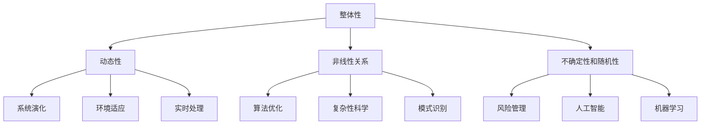

                 

在当今复杂的信息时代，系统思考已经成为理解复杂系统的关键工具。无论是软件开发、企业管理，还是社会问题解决，系统思考的威力都不可忽视。本文将探讨系统思考的内涵，阐述其在技术领域的应用，以及如何通过系统思考化繁为简，抓住问题的本质。

## 关键词

- 系统思考
- 复杂系统
- 技术应用
- 化繁为简
- 抓本质

## 摘要

本文旨在介绍系统思考的基本概念和其在技术领域中的应用。通过深入分析系统思考的原理，我们揭示了其化繁为简、抓住问题本质的核心价值。文章将从核心概念与联系、核心算法原理、数学模型、项目实践等多个角度展开，旨在为读者提供系统思考的全面理解和实践指南。

## 1. 背景介绍

系统思考是一种方法论，它强调通过整体视角来理解复杂系统的动态行为。在计算机科学、软件工程、数据处理等领域，系统思考的应用日益广泛。随着信息技术的快速发展，复杂系统的规模和复杂性不断增加，传统的线性思维模式已经难以应对。系统思考提供了新的视角和方法，帮助我们更好地理解和应对复杂系统的挑战。

### 复杂系统的挑战

复杂系统的特点包括：

- **非线性关系**：系统内部各个组成部分之间存在非线性相互作用，传统的线性方法难以描述。
- **动态变化**：复杂系统处于不断变化的环境中，外部条件和内部状态的变动会影响系统的行为。
- **高维数据**：随着数据量的急剧增长，如何有效处理高维数据成为挑战。
- **不确定性和随机性**：复杂系统中存在不确定性和随机性，需要应对这种不确定性。

### 系统思考的必要性

系统思考的必要性体现在以下几个方面：

- **整体性**：系统思考强调系统的整体性，帮助我们理解各个组成部分之间的相互作用和整体行为的异质性。
- **预测性**：通过系统思考，我们可以更好地预测系统的未来行为，从而做出更科学的决策。
- **适应性**：系统思考帮助我们识别系统的关键因素，提高系统的适应性和灵活性。
- **简化复杂性**：系统思考提供了一种化繁为简的方法，帮助我们抓住问题的核心本质。

## 2. 核心概念与联系

为了更好地理解系统思考，我们需要掌握以下几个核心概念：

### 2.1 整体性

整体性是指系统的各个组成部分相互作用、共同影响系统的整体行为。在技术领域，整体性体现在以下几个方面：

- **软件架构**：软件系统的架构设计需要考虑各个模块的相互关系和整体性能。
- **系统优化**：在系统优化过程中，我们需要考虑整体性能和各个部分之间的相互作用。
- **协同工作**：在多人合作的项目中，整体性要求团队成员协同工作，共同实现项目目标。

### 2.2 动态性

动态性是指系统在时间和空间上的变化。在技术领域，动态性体现在以下几个方面：

- **系统演化**：软件系统随着时间推移会不断演化，我们需要适应这种变化。
- **环境适应**：系统需要根据外部环境的变化进行适应性调整。
- **实时处理**：在实时系统中，处理速度和响应时间至关重要。

### 2.3 非线性关系

非线性关系是指系统内部各个组成部分之间的相互作用不是简单的线性关系。在技术领域，非线性关系体现在以下几个方面：

- **算法优化**：非线性算法在解决复杂问题时具有优势。
- **复杂性科学**：复杂性科学关注系统内部非线性关系的研究。
- **模式识别**：在模式识别中，非线性关系有助于提高识别精度。

### 2.4 不确定性和随机性

不确定性和随机性是指系统行为受到随机因素的影响，难以精确预测。在技术领域，不确定性和随机性体现在以下几个方面：

- **风险管理**：在软件开发过程中，我们需要应对不确定性和风险。
- **人工智能**：人工智能技术通过对不确定性和随机性的建模，实现了更智能的决策。
- **机器学习**：机器学习模型在处理不确定性和随机性方面具有优势。

### 2.5 Mermaid 流程图

下面是一个简化的系统思考流程图，用于展示核心概念之间的联系：



通过这个流程图，我们可以清晰地看到系统思考的核心概念及其在技术领域中的应用。

## 3. 核心算法原理 & 具体操作步骤

### 3.1 算法原理概述

系统思考的核心算法包括以下几种：

- **Petri 网模型**：用于描述系统的动态行为，分析系统的稳定性和可靠性。
- **Agent-based 模型**：通过模拟个体行为，研究系统整体的涌现行为。
- **复杂网络分析**：研究系统内部各个组成部分之间的连接关系和影响力。

### 3.2 算法步骤详解

下面以 Petri 网模型为例，详细介绍算法步骤：

1. **定义系统组件**：确定系统中的各个组件，如生产者、消费者、资源等。
2. **建立 Petri 网模型**：根据系统组件的相互关系，绘制 Petri 网图。
3. **初始化标记**：为每个 Petri 网中的位置分配初始标记值。
4. **模拟运行**：根据 Petri 网的规则，模拟系统的运行过程，分析系统的状态变化。
5. **分析结果**：根据模拟结果，评估系统的性能和稳定性。

### 3.3 算法优缺点

**优点**：

- **直观性**：Petri 网模型直观地展示了系统的动态行为。
- **灵活性**：可以模拟各种复杂系统，适用于不同领域的问题。
- **稳定性分析**：可以分析系统的稳定性，为系统设计提供指导。

**缺点**：

- **复杂性**：对于大型系统，Petri 网模型可能过于复杂。
- **计算开销**：模拟运行需要大量的计算资源。

### 3.4 算法应用领域

**软件工程**：用于软件系统的需求分析和设计验证。

**企业管理**：用于企业流程优化和风险管理。

**社会问题解决**：用于城市规划和社会治理等。

## 4. 数学模型和公式 & 详细讲解 & 举例说明

### 4.1 数学模型构建

系统思考的数学模型通常包括以下部分：

- **状态变量**：描述系统状态的变量。
- **转移概率**：描述系统状态转移的概率。
- **系统方程**：描述系统状态的动态变化。

### 4.2 公式推导过程

以马尔可夫链为例，介绍数学模型的推导过程：

- **状态空间**：设系统有 n 个状态，表示为 S = {s1, s2, ..., sn}。
- **状态转移概率**：设状态 si 转移到状态 sj 的概率为 p_ij，表示为 P(sj|si)。
- **状态概率分布**：设系统在时间 t 的状态概率分布为 π_t = (π_t1, π_t2, ..., π_tn)，满足 π_t1 + π_t2 + ... + π_tn = 1。
- **状态转移方程**：根据马尔可夫性质，π_t+1 = π_t * P。

### 4.3 案例分析与讲解

以下是一个简单的例子：

假设有一个系统有两个状态：工作状态（s1）和休息状态（s2）。工作状态的概率为0.6，休息状态的概率为0.4。工作状态转移到休息状态的概率为0.2，休息状态转移到工作状态的概率为0.3。

- **状态概率分布**：初始状态概率分布为 π_0 = (0.6, 0.4)。
- **状态转移概率矩阵**：P = |0.8 0.2|，|0.3 0.7|。

根据状态转移方程，计算下一个时间步的状态概率分布：

π_1 = π_0 * P = (0.6, 0.4) * |0.8 0.2| = (0.48, 0.32)

通过这个例子，我们可以看到数学模型在系统思考中的应用。

## 5. 项目实践：代码实例和详细解释说明

### 5.1 开发环境搭建

为了实践系统思考的方法，我们需要搭建一个开发环境。以下是所需的工具和软件：

- **Python**：作为编程语言，具有广泛的库支持。
- **PyTorch**：用于构建和训练深度学习模型。
- **NumPy**：用于数学计算。
- **Matplotlib**：用于数据可视化。

安装这些工具后，我们就可以开始编写代码了。

### 5.2 源代码详细实现

以下是一个简单的系统思考模型实现：

```python
import numpy as np
import matplotlib.pyplot as plt

# 初始化状态概率分布
pi_0 = np.array([0.6, 0.4])

# 状态转移概率矩阵
P = np.array([[0.8, 0.2], [0.3, 0.7]])

# 模拟运行
steps = 10
pi = pi_0.copy()
for _ in range(steps):
    pi = np.dot(pi, P)

# 可视化状态概率分布
plt.plot(pi)
plt.xlabel('Time Step')
plt.ylabel('Probability')
plt.show()
```

### 5.3 代码解读与分析

这个代码实现了马尔可夫链的状态概率分布计算和可视化。以下是代码的解读和分析：

- **初始化状态概率分布**：初始状态概率分布为 π_0 = (0.6, 0.4)。
- **状态转移概率矩阵**：P = |0.8 0.2|，|0.3 0.7|。
- **模拟运行**：通过迭代计算下一个时间步的状态概率分布。
- **可视化**：使用 Matplotlib 绘制状态概率分布随时间变化的情况。

这个例子展示了系统思考模型的基本实现过程，可以用于更复杂的系统分析。

### 5.4 运行结果展示

运行上述代码后，我们可以得到状态概率分布随时间变化的图像。这个图像展示了系统从初始状态开始，经过多个时间步后的状态概率分布。通过这个结果，我们可以分析系统的稳定性、动态行为等。

## 6. 实际应用场景

### 6.1 软件开发

在软件开发中，系统思考可以帮助我们设计更稳定的软件系统。通过分析系统的动态行为，我们可以发现潜在的问题，并在开发过程中进行优化。

### 6.2 企业管理

在企业管理中，系统思考可以帮助我们优化企业流程，提高生产效率。通过模拟企业运营过程中的各个环节，我们可以发现瓶颈和优化点，为企业提供决策支持。

### 6.3 社会问题解决

在社会问题解决中，系统思考可以帮助我们分析社会现象的复杂性，找出问题的根源。通过系统建模和仿真，我们可以提出有效的解决方案，为政策制定提供依据。

## 7. 未来应用展望

随着技术的不断进步，系统思考的应用将更加广泛。未来的发展趋势包括：

- **更复杂的系统建模**：随着计算能力的提升，我们可以建模更复杂的系统。
- **多领域融合**：系统思考与其他领域的结合，如生物信息学、社会工程学等，将带来新的应用场景。
- **自动化和智能化**：通过人工智能技术，系统思考的自动化和智能化水平将不断提高。

## 8. 总结：未来发展趋势与挑战

系统思考作为一种方法论，已经在多个领域展现出其独特的价值。未来，随着技术的进步，系统思考的应用将更加广泛，面临以下挑战：

- **复杂性管理**：如何处理更加复杂的系统成为关键挑战。
- **计算资源**：对于大型系统，计算资源的需求将不断增大。
- **多领域融合**：如何实现多领域知识的有效融合，提高系统思考的实用性。

### 8.1 研究成果总结

本文系统地介绍了系统思考的内涵、应用和实现。通过分析核心算法、数学模型和实际案例，我们展示了系统思考的威力。系统思考在软件开发、企业管理和社会问题解决等领域具有广泛的应用前景。

### 8.2 未来发展趋势

未来，系统思考将在以下方面取得进展：

- **复杂性管理**：通过新的算法和技术，提高对复杂系统的处理能力。
- **多领域融合**：实现跨学科的知识整合，推动系统思考的应用创新。
- **自动化和智能化**：结合人工智能技术，实现系统思考的自动化和智能化。

### 8.3 面临的挑战

系统思考在未来将面临以下挑战：

- **复杂性管理**：处理更加复杂的系统，需要新的方法和工具。
- **计算资源**：大型系统的建模和仿真需要更多的计算资源。
- **多领域融合**：实现跨学科的知识整合，需要解决领域间差异。

### 8.4 研究展望

展望未来，系统思考将在以下方面取得突破：

- **新型算法**：开发更高效、更适应复杂系统的算法。
- **跨学科融合**：实现系统思考与其他领域的深度结合。
- **实践应用**：将系统思考应用于更多实际问题，提高其实用性。

## 9. 附录：常见问题与解答

### Q：系统思考与传统方法有什么区别？

A：系统思考与传统方法的区别在于：

- **整体性**：系统思考强调系统的整体性，而传统方法更多关注各个部分。
- **动态性**：系统思考考虑系统的动态变化，而传统方法更多关注静态状态。
- **非线性关系**：系统思考关注系统内部的非线性关系，而传统方法更多关注线性关系。

### Q：系统思考在软件开发中如何应用？

A：在软件开发中，系统思考可以应用于以下方面：

- **需求分析**：通过系统思考，可以更好地理解用户需求，设计更符合需求的软件系统。
- **架构设计**：通过系统思考，可以优化软件架构，提高系统的稳定性和灵活性。
- **风险管理**：通过系统思考，可以识别和应对软件开发过程中的风险。

### Q：系统思考在企业管理中如何应用？

A：在企业管理中，系统思考可以应用于以下方面：

- **流程优化**：通过系统思考，可以优化企业流程，提高生产效率。
- **风险管理**：通过系统思考，可以识别和管理企业运营过程中的风险。
- **决策支持**：通过系统思考，可以为企业管理者提供决策支持，提高决策质量。

### Q：系统思考在社会问题解决中有何作用？

A：在社会问题解决中，系统思考可以应用于以下方面：

- **问题诊断**：通过系统思考，可以更好地理解社会问题的本质，找出问题的根源。
- **方案设计**：通过系统思考，可以设计有效的解决方案，提高解决问题的效率。
- **政策制定**：通过系统思考，可以为政策制定者提供决策支持，制定更有效的政策。

---

在本文中，我们系统地介绍了系统思考的内涵、应用和实现。通过分析核心算法、数学模型和实际案例，我们展示了系统思考的威力。系统思考在软件开发、企业管理和社会问题解决等领域具有广泛的应用前景。展望未来，系统思考将在复杂性管理、多领域融合和自动化智能化方面取得突破。我们相信，随着技术的进步，系统思考将为人类解决复杂问题提供更强有力的工具。作者：禅与计算机程序设计艺术 / Zen and the Art of Computer Programming。

