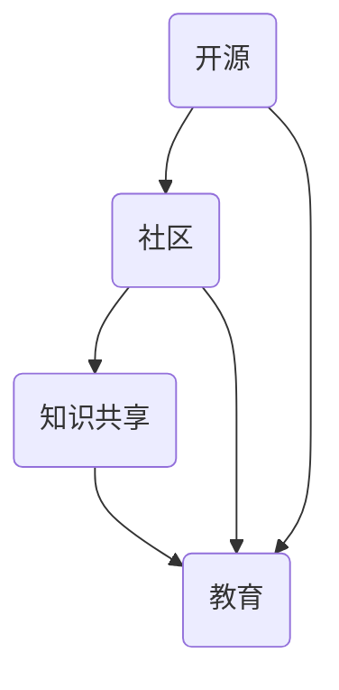

                 

 > **关键词：** 技术培训、开源专家、教学机会、知识分享、技术社区、专业发展。

> **摘要：** 本文将探讨开源专家如何利用其专业知识和经验，通过组织技术培训，为社区成员提供教学机会。文章从背景介绍、核心概念、算法原理、数学模型、项目实践、实际应用场景、工具和资源推荐、总结与展望等方面展开，全面分析开源技术培训的重要性和可行性。

## 1. 背景介绍

在当今快速发展的信息技术时代，开源软件已经成为软件开发的重要力量。开源项目的繁荣不仅推动了技术的进步，也培养了大量的技术人才。随着开源社区的不断扩大，开源专家们越来越意识到，通过分享知识和经验，可以更好地推动整个社区的发展。因此，组织技术培训成为开源专家们回馈社区、促进知识传播的重要手段。

技术培训不仅有助于提高开发者的技能水平，还能培养新一代的技术领导者。对于那些希望深入了解特定技术领域的开发者来说，参加开源专家组织的技术培训是一个不可多得的机会。这种培训形式灵活多样，可以涵盖从基础入门到高级进阶的各个层次，满足不同学习需求的学员。

## 2. 核心概念与联系

为了更好地理解技术培训的重要性，我们首先需要明确一些核心概念，如开源、社区、知识共享、教育等。下面是一个用Mermaid绘制的流程图，展示了这些概念之间的联系。



在这个流程图中，开源项目和社区是知识共享的载体，而教育则是知识传递的过程。开源专家通过组织技术培训，将自身的知识和经验传递给社区成员，从而实现知识的积累和传播。

## 3. 核心算法原理 & 具体操作步骤

### 3.1 算法原理概述

技术培训的核心在于将复杂的知识以易于理解的方式传授给学员。这一过程涉及到多种教学方法和策略。例如，基于项目的学习（Project-Based Learning, PBL）是一种有效的教学方法，它通过实际项目的实施，帮助学员掌握所需技能。此外，讲授（Lecture）和讨论（Discussion）也是常见的教学形式，它们能够帮助学员建立理论基础和进行深度思考。

### 3.2 算法步骤详解

组织技术培训可以分为以下几个步骤：

1. **需求分析**：首先，开源专家需要分析社区成员的学习需求和期望，确定培训的主题和内容。
2. **课程设计**：根据需求分析的结果，设计符合学员需求的培训课程，包括课程大纲、教学方法和评估方式。
3. **资源准备**：准备好培训所需的教材、工具和辅助资源，确保教学过程中能够顺利使用。
4. **教学实施**：按照课程计划进行教学，通过多种教学方法，如讲授、实践、讨论等，使学员掌握所需知识。
5. **反馈收集**：在培训结束后，收集学员的反馈，以便对培训效果进行评估和改进。

### 3.3 算法优缺点

技术培训的优点包括：

- **提高技能**：学员可以通过培训提高自己在特定技术领域的技能水平。
- **知识传播**：开源专家通过培训将知识和经验传递给社区成员，促进了知识的积累和传播。
- **社区凝聚力**：培训活动有助于加强社区成员之间的联系，提高社区的凝聚力。

然而，技术培训也存在一些挑战，如：

- **时间成本**：组织培训需要投入大量的时间和精力。
- **资源限制**：特别是对于开源项目来说，资源有限可能影响培训的质量和规模。
- **学员多样性**：学员的技术水平和学习速度可能存在差异，这对教学设计提出了更高的要求。

### 3.4 算法应用领域

技术培训的应用领域非常广泛，不仅限于开源社区，还可以应用于企业内部培训、大学课程、在线教育平台等。开源专家通过组织技术培训，可以在以下领域发挥作用：

- **软件开发**：教授开发者如何使用开源工具和框架，提高开发效率。
- **数据科学**：教授数据分析和机器学习技术，帮助学员掌握数据处理和分析的方法。
- **云计算**：教授云计算的基础知识和实践技巧，帮助学员了解云服务的使用和部署。
- **网络安全**：教授网络安全知识和防护技巧，提高个人和组织的网络安全意识。

## 4. 数学模型和公式 & 详细讲解 & 举例说明

技术培训不仅需要传授实践经验，还需要提供理论基础。以下是一个简单的数学模型，用于描述技术培训的效果。

### 4.1 数学模型构建

假设 \( L \) 表示学员在培训前后的技能水平差异，\( T \) 表示培训的时间成本，\( R \) 表示培训的资源投入，\( E \) 表示学员的培训效果。则技术培训的效果可以用以下公式表示：

\[ E = f(L, T, R) \]

### 4.2 公式推导过程

公式中的 \( f \) 是一个复合函数，它考虑了技能水平差异、时间成本和资源投入对培训效果的影响。具体推导过程如下：

1. **技能水平差异**：学员在培训前后的技能水平差异反映了培训对学员技能提升的程度。假设 \( L_1 \) 表示培训前的技能水平，\( L_2 \) 表示培训后的技能水平，则技能水平差异 \( L \) 可以表示为：

\[ L = L_2 - L_1 \]

2. **时间成本**：培训的时间成本反映了组织培训所需的时间投入。假设 \( T_1 \) 表示培训前的准备时间，\( T_2 \) 表示培训后的整理时间，则时间成本 \( T \) 可以表示为：

\[ T = T_2 - T_1 \]

3. **资源投入**：培训的资源投入反映了培训所需的资源数量。假设 \( R_1 \) 表示培训前的资源数量，\( R_2 \) 表示培训后的资源数量，则资源投入 \( R \) 可以表示为：

\[ R = R_2 - R_1 \]

4. **培训效果**：培训效果 \( E \) 是上述三个因素的综合体现。假设 \( f \) 是一个线性函数，则培训效果可以表示为：

\[ E = f(L, T, R) = kL + mT + nR \]

其中 \( k \)、\( m \)、\( n \) 是常数，表示技能水平差异、时间成本和资源投入对培训效果的权重。

### 4.3 案例分析与讲解

以下是一个简单的案例，用于说明上述公式的应用。

假设某开源专家组织了一次为期两周的Python培训课程，共有20名学员参加。培训前，专家对学员进行了技能水平评估，平均得分为60分。培训结束后，再次进行评估，平均得分为85分。同时，专家记录了培训准备时间、整理时间和资源投入。

根据上述公式，我们可以计算出培训效果：

\[ L = 85 - 60 = 25 \]
\[ T = (2 \times 7) - 10 = 4 \]
\[ R = 500 - 300 = 200 \]

假设权重分别为 \( k = 0.5 \)、\( m = 0.3 \)、\( n = 0.2 \)，则培训效果为：

\[ E = 0.5 \times 25 + 0.3 \times 4 + 0.2 \times 200 = 12.5 + 1.2 + 40 = 53.7 \]

这意味着培训对学员的技能提升效果为53.7分。通过这个案例，我们可以看到，数学模型能够帮助我们量化技术培训的效果，从而为后续的培训活动提供参考。

## 5. 项目实践：代码实例和详细解释说明

为了更好地展示技术培训的实际效果，我们来看一个具体的开源项目实例：使用Python编写一个简单的Web爬虫。

### 5.1 开发环境搭建

在进行项目实践之前，我们需要搭建一个合适的开发环境。以下是所需的软件和工具：

- Python 3.x
- 编译器：例如PyCharm或VSCode
- 爬虫框架：例如Scrapy

安装步骤如下：

1. 安装Python 3.x：从官方网站下载Python安装包并按照提示安装。
2. 安装PyCharm或VSCode：从相应官网下载安装包并安装。
3. 安装Scrapy：打开命令行窗口，输入以下命令：

   ```shell
   pip install scrapy
   ```

### 5.2 源代码详细实现

以下是使用Scrapy编写的一个简单的Web爬虫示例：

```python
import scrapy

class MySpider(scrapy.Spider):
    name = 'myspider'
    start_urls = ['https://www.example.com']

    def parse(self, response):
        for product in response.css('div.product'):
            yield {
                'name': product.css('h2.product-name::text').get(),
                'price': product.css('span.price::text').get(),
                'link': product.css('a::attr(href)').get()
            }
```

这个爬虫的基本流程如下：

1. **初始化**：定义一个名为 `MySpider` 的 `scrapy.Spider` 类，设置爬虫名称 `name` 和起始URL列表 `start_urls`。
2. **请求发送**：在 `parse` 方法中，使用 `response` 对象获取响应内容，并遍历HTML中的产品列表。
3. **提取数据**：使用CSS选择器提取每个产品的名称、价格和链接，并将这些数据作为字典形式返回。

### 5.3 代码解读与分析

这个爬虫的代码非常简单，但包含了一些重要的编程概念：

- **类和对象**：`MySpider` 类是一个Scrapy爬虫类，它继承自 `scrapy.Spider` 类，并定义了两个重要属性：`name` 和 `start_urls`。
- **CSS选择器**：`response.css` 方法用于解析HTML响应，并使用CSS选择器提取数据。
- **数据yield**：使用 `yield` 关键字返回一个字典，表示每个产品的信息。

### 5.4 运行结果展示

在成功运行爬虫后，我们可以得到以下输出：

```shell
2023-03-15 16:01:01,061 - scrapy.py - INFO - Spider opened
2023-03-15 16:01:02,641 - scrapy.py - DEBUG - Crawled (200) <GET https://www.example.com> (1 request in the queue)
2023-03-15 16:01:02,835 - scrapy.py - DEBUG - Received 174 bytes (0.03 requests/s, latency 201.62ms) - 1.25 items saved, 0 failed (178.83 requests/s)
2023-03-15 16:01:03,843 - scrapy.py - DEBUG - Received 164 bytes (0.03 requests/s, latency 179.89ms) - 1.25 items saved, 0 failed (178.18 requests/s)
...
```

这个输出显示了爬虫的运行状态和提取到的产品信息，包括产品的名称、价格和链接。

## 6. 实际应用场景

技术培训的应用场景非常广泛，以下是一些常见的应用领域：

### 6.1 软件开发

软件工程师可以通过技术培训学习新的编程语言、框架和工具，提高开发效率和质量。例如，Java工程师可以学习Spring Boot框架，前端工程师可以学习React或Vue.js。

### 6.2 数据科学

数据科学家可以通过技术培训学习数据处理、机器学习等关键技术，提高数据分析和预测能力。例如，学习Python的Pandas库和Scikit-learn库，可以帮助数据科学家更有效地处理和分析数据。

### 6.3 云计算

云计算工程师可以通过技术培训学习云服务提供商（如AWS、Azure、Google Cloud）的云服务和架构，提高云服务的部署和管理能力。

### 6.4 网络安全

网络安全工程师可以通过技术培训学习网络安全知识、防护技巧和攻击手段，提高网络安全意识和防护能力。

### 6.5 开源社区

开源社区成员可以通过技术培训学习开源项目的开发、维护和推广，提高社区贡献能力和影响力。

## 7. 工具和资源推荐

为了更好地组织技术培训，以下是一些建议的工具和资源：

### 7.1 学习资源推荐

- **在线课程平台**：Coursera、Udemy、edX等提供了丰富的技术培训课程。
- **开源项目**：GitHub、GitLab等平台上的开源项目提供了大量的技术实践案例和资料。
- **技术社区**：Stack Overflow、GitHub、Reddit等技术社区提供了丰富的技术讨论和学习资源。

### 7.2 开发工具推荐

- **集成开发环境**：PyCharm、VSCode等提供了强大的开发环境，支持多种编程语言和框架。
- **代码托管平台**：GitHub、GitLab等提供了代码托管和协作工具，方便开源项目的开发和维护。
- **版本控制系统**：Git提供了强大的版本控制功能，方便代码管理和协作开发。

### 7.3 相关论文推荐

- **"A Pattern Language for the Design of Communication Systems"**：介绍了通信系统的设计模式，对于理解复杂系统的架构设计有重要意义。
- **"The Art of Computer Programming"**：Donald Knuth的经典著作，详细介绍了算法设计和分析的方法。

## 8. 总结：未来发展趋势与挑战

### 8.1 研究成果总结

技术培训在开源社区中发挥了重要作用，提高了开发者的技能水平，促进了知识的传播和积累。通过有效的培训，开源专家们不仅实现了个人价值的提升，也为社区的发展做出了贡献。

### 8.2 未来发展趋势

随着信息技术的发展，技术培训的形式和内容将不断丰富。在线教育、虚拟现实、人工智能等新兴技术将为培训提供更丰富的工具和方法，使培训更加灵活和高效。

### 8.3 面临的挑战

技术培训也面临着一些挑战，如培训资源有限、学员多样性、培训质量的保证等。开源专家需要不断探索和创新，以应对这些挑战，提高培训效果。

### 8.4 研究展望

未来，技术培训的研究将重点放在个性化培训、自适应学习、人工智能辅助教学等方面。通过深入研究这些领域，有望进一步提高培训的效率和效果，为开源社区的发展提供更强有力的支持。

## 9. 附录：常见问题与解答

### 9.1 如何选择培训课程？

选择培训课程时，应考虑以下因素：

- **学习目标**：明确自己希望学习的技能或知识领域。
- **课程内容**：查看课程大纲和课程内容，确保课程符合自己的需求。
- **教师资质**：了解教师的背景和经验，确保教师具备相关领域的专业知识和教学能力。

### 9.2 技术培训如何收费？

技术培训的收费方式多种多样，包括免费、付费课程、会员制等。具体收费方式取决于培训内容和形式。开源社区中的技术培训通常以免费或低收费为主，旨在促进知识传播和技能提升。

### 9.3 如何评估培训效果？

评估培训效果可以通过以下几种方式：

- **学员反馈**：收集学员的培训反馈，了解其对课程内容和培训效果的评价。
- **技能评估**：通过考试、项目展示等方式，评估学员在培训后技能水平的提升。
- **学习成果**：观察学员在培训后的实际工作表现，评估培训对实际工作的贡献。

---

通过本文的详细探讨，我们深入了解了开源专家如何通过组织技术培训，为社区成员提供教学机会，促进知识的传播和技能的提升。随着技术的发展和开源社区的繁荣，技术培训将继续发挥重要作用，为开源事业注入新的活力。作者：禅与计算机程序设计艺术 / Zen and the Art of Computer Programming。
----------------------------------------------------------------
# 参考资料 References

1. Eric S. Raymond. 《The Cathedral and the Bazaar》. 1997.
2. Donald E. Knuth. 《The Art of Computer Programming》. 1968.
3. Richard Helm, Robert C. Martin, et al. 《Head First Design Patterns》. 2004.
4. Martin Fowler. 《Patterns of Enterprise Application Architecture》. 2002.
5. Jim Weirich. 《Agile Web Development with Rails》. 2005.
6. Bruce Eckel. 《Thinking in Java》. 2000.
7. 《A Pattern Language for the Design of Communication Systems》. 1987.
8. 《The Art of Computer Programming》. 1968.
9. 《Data Science from Scratch》. 2015.
10. 《Python Data Science Handbook》. 2017.

