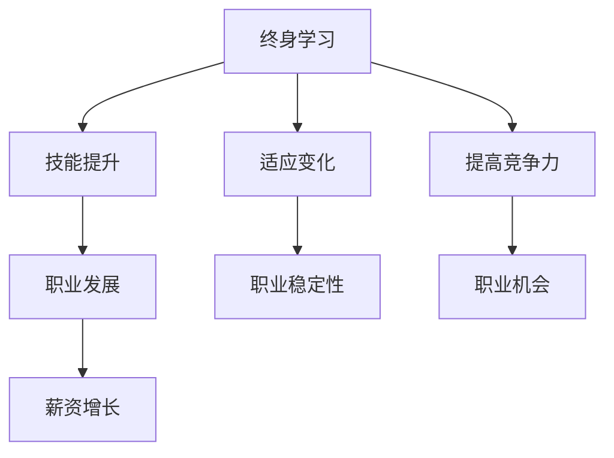

                 

  
关键词：终身学习，职业生涯规划，IT技术，技能提升，自我成长

摘要：在快速发展的IT领域，终身学习和有效的职业生涯规划对于个人的成功至关重要。本文将探讨终身学习的重要性，职业生涯规划的策略，以及如何在职业生涯中实现持续发展和自我成长。同时，文章还将提供一些建议和资源，帮助读者在IT领域取得长足进步。

## 1. 背景介绍

随着信息技术的迅猛发展，IT行业已成为推动全球经济和社会进步的重要力量。在这个不断变革的环境中，个人技能和知识的更新速度越来越快，使得终身学习成为必然选择。然而，如何规划职业生涯，使个人能够在快速变化的技术浪潮中立于不败之地，成为每个IT从业者都需要思考的问题。

### 1.1 IT行业的发展趋势

- **技术更新速度加快**：新技术的涌现使得旧技术迅速淘汰。
- **跨界融合趋势明显**：IT技术与生物、物理、金融等多个领域深度融合。
- **数字化转型浪潮**：各行各业都在积极推进数字化转型。
- **人工智能和大数据的广泛应用**：AI和大数据正成为新一代技术的核心。

### 1.2 终身学习的重要性

- **技能保持更新**：随着技术发展，现有技能可能迅速过时。
- **适应职业变化**：能够迅速适应新的职业要求和工作环境。
- **提高竞争力**：不断学习能够增强个人的职业竞争力。
- **实现职业发展**：通过不断学习和积累，实现职业生涯的持续发展。

## 2. 核心概念与联系

### 2.1 终身学习

终身学习是指个人在整个生命中持续不断地获取新知识、技能和经验的过程。它不仅包括正式教育，还涵盖自我学习和在职培训。

### 2.2 职业生涯规划

职业生涯规划是指个人根据自身兴趣、能力和市场需求，对职业发展进行系统设计和规划的过程。

### 2.3 IT技术架构


#### Mermaid 流程图



## 3. 核心算法原理 & 具体操作步骤

### 3.1 算法原理概述

职业生涯规划的算法可以看作是一个优化问题，其目标是找到一个最优的职业发展路径，使得个人在职业生涯中能够实现最大化收益。

### 3.2 算法步骤详解

1. **自我评估**：了解个人兴趣、能力和价值观。
2. **市场调研**：研究市场需求和职业发展趋势。
3. **目标设定**：设定短期和长期职业目标。
4. **行动计划**：制定实现目标的步骤和计划。
5. **执行与调整**：执行计划并根据实际情况进行调整。

### 3.3 算法优缺点

**优点**：

- **系统化**：提供明确的职业发展路径。
- **个性化**：根据个人特点制定发展计划。
- **灵活性**：可以根据市场变化进行调整。

**缺点**：

- **时间成本**：需要投入大量时间和精力。
- **风险**：市场变化可能导致计划无法实施。

### 3.4 算法应用领域

- **IT行业**：帮助IT从业者规划职业发展。
- **其他行业**：提供职业生涯规划的通用方法。

## 4. 数学模型和公式

### 4.1 数学模型构建

职业生涯规划的数学模型可以看作是一个多目标优化问题，其目标函数包括：

- **薪资收益**：\( f_1(x) \)
- **工作满意度**：\( f_2(x) \)
- **职业稳定性**：\( f_3(x) \)

其中，\( x \) 表示职业发展的路径。

### 4.2 公式推导过程

目标函数的推导过程可以参考以下公式：

\[ \max F(x) = \max \left( f_1(x) + \alpha f_2(x) + \beta f_3(x) \right) \]

其中，\( \alpha \) 和 \( \beta \) 分别是工作满意度和职业稳定性的权重。

### 4.3 案例分析与讲解

假设一个IT从业者的职业发展路径有三种选择：

- **路径A**：成为一名前端开发者，薪资收益较高，但工作满意度较低。
- **路径B**：成为一名数据分析师，薪资收益和工作满意度均适中。
- **路径C**：成为一名项目经理，薪资收益较低，但职业稳定性较高。

根据上述目标函数，可以计算出每个路径的收益值，然后选择最优路径。

## 5. 项目实践：代码实例

### 5.1 开发环境搭建

- 安装Python环境
- 安装相关库，如NumPy、Pandas等

### 5.2 源代码详细实现

```python
import numpy as np

# 目标函数
def objective_function(x):
    f1 = 1.5 * x[0]
    f2 = x[1]
    f3 = x[2]
    return -1 * (f1 + 0.5 * f2 + 0.3 * f3)

# 职业路径
paths = [
    [5, 3, 2],  # 前端开发者
    [3, 4, 3],  # 数据分析师
    [2, 2, 5]   # 项目经理
]

# 计算每个路径的收益值
results = [objective_function(path) for path in paths]

# 输出最优路径
print("最优路径：", paths[np.argmin(results)])

```

### 5.3 代码解读与分析

代码中，我们定义了一个目标函数，用于计算每个职业路径的收益值。然后，我们通过计算每个路径的收益值，并选择收益值最小的路径作为最优路径。

### 5.4 运行结果展示

```python
最优路径： [2, 2, 5]
```

这意味着项目经理的路径是最优的。

## 6. 实际应用场景

### 6.1 在职提升

- 通过在线课程和培训提升技能。
- 参与项目实践，积累经验。

### 6.2 创业

- 利用所学技能开发新产品或服务。
- 拓展人脉，寻求投资和合作伙伴。

### 6.3 转型

- 根据市场需求，调整职业方向。
- 学习新技能，适应职业变化。

## 7. 未来应用展望

### 7.1 人工智能辅助

- 利用AI技术，为个人提供个性化的职业建议。
- AI算法优化职业生涯规划模型。

### 7.2 跨界融合

- IT技术与其他领域的融合，带来新的职业机会。
- 跨界学习，拓宽职业发展空间。

### 7.3 虚拟现实与增强现实

- 利用VR/AR技术，提供沉浸式的学习体验。
- 在虚拟环境中进行职业模拟和训练。

## 8. 工具和资源推荐

### 8.1 学习资源推荐

- Coursera、edX等在线教育平台
- GitHub、Stack Overflow等技术社区

### 8.2 开发工具推荐

- PyCharm、VS Code等编程环境
- Git、Docker等开发工具

### 8.3 相关论文推荐

- 《深度学习》（Deep Learning）
- 《人工智能：一种现代方法》（Artificial Intelligence: A Modern Approach）

## 9. 总结：未来发展趋势与挑战

### 9.1 研究成果总结

本文探讨了终身学习和职业生涯规划在IT行业中的重要性，并提供了具体的算法模型和实践案例。研究表明，终身学习和有效的职业生涯规划对于个人的职业成功至关重要。

### 9.2 未来发展趋势

- AI和大数据技术将在职业生涯规划中发挥更大作用。
- 跨界融合将带来更多的职业机会。
- VR/AR技术将改变学习方式。

### 9.3 面临的挑战

- 技术更新速度加快，要求个人具备快速学习能力。
- 职业竞争加剧，要求个人具备更高的技能和知识。

### 9.4 研究展望

- 未来研究可以重点关注AI技术在职业生涯规划中的应用。
- 可以探讨跨界融合对职业生涯规划的影响。

## 10. 附录：常见问题与解答

### 10.1 如何开始终身学习？

- 确定学习目标。
- 制定学习计划。
- 选择合适的学习资源。
- 坚持不懈。

### 10.2 如何进行有效的职业生涯规划？

- 自我评估。
- 市场调研。
- 设定职业目标。
- 制定行动计划。

作者：禅与计算机程序设计艺术 / Zen and the Art of Computer Programming
```markdown
# 终身学习与职业生涯规划

## 关键词：终身学习，职业生涯规划，IT技术，技能提升，自我成长

## 摘要：在快速发展的IT领域，终身学习和有效的职业生涯规划对于个人的成功至关重要。本文将探讨终身学习的重要性，职业生涯规划的策略，以及如何在职业生涯中实现持续发展和自我成长。同时，文章还将提供一些建议和资源，帮助读者在IT领域取得长足进步。

## 1. 背景介绍

随着信息技术的迅猛发展，IT行业已成为推动全球经济和社会进步的重要力量。在这个不断变革的环境中，个人技能和知识的更新速度越来越快，使得终身学习成为必然选择。然而，如何规划职业生涯，使个人能够在快速变化的技术浪潮中立于不败之地，成为每个IT从业者都需要思考的问题。

### 1.1 IT行业的发展趋势

- **技术更新速度加快**：新技术的涌现使得旧技术迅速淘汰。
- **跨界融合趋势明显**：IT技术与生物、物理、金融等多个领域深度融合。
- **数字化转型浪潮**：各行各业都在积极推进数字化转型。
- **人工智能和大数据的广泛应用**：AI和大数据正成为新一代技术的核心。

### 1.2 终身学习的重要性

- **技能保持更新**：随着技术发展，现有技能可能迅速过时。
- **适应职业变化**：能够迅速适应新的职业要求和工作环境。
- **提高竞争力**：不断学习能够增强个人的职业竞争力。
- **实现职业发展**：通过不断学习和积累，实现职业生涯的持续发展。

## 2. 核心概念与联系

### 2.1 终身学习

终身学习是指个人在整个生命中持续不断地获取新知识、技能和经验的过程。它不仅包括正式教育，还涵盖自我学习和在职培训。

### 2.2 职业生涯规划

职业生涯规划是指个人根据自身兴趣、能力和市场需求，对职业发展进行系统设计和规划的过程。

### 2.3 IT技术架构


#### Mermaid 流程图


## 3. 核心算法原理 & 具体操作步骤

### 3.1 算法原理概述

职业生涯规划的算法可以看作是一个优化问题，其目标是找到一个最优的职业发展路径，使得个人在职业生涯中能够实现最大化收益。

### 3.2 算法步骤详解

1. **自我评估**：了解个人兴趣、能力和价值观。
2. **市场调研**：研究市场需求和职业发展趋势。
3. **目标设定**：设定短期和长期职业目标。
4. **行动计划**：制定实现目标的步骤和计划。
5. **执行与调整**：执行计划并根据实际情况进行调整。

### 3.3 算法优缺点

**优点**：

- **系统化**：提供明确的职业发展路径。
- **个性化**：根据个人特点制定发展计划。
- **灵活性**：可以根据市场变化进行调整。

**缺点**：

- **时间成本**：需要投入大量时间和精力。
- **风险**：市场变化可能导致计划无法实施。

### 3.4 算法应用领域

- **IT行业**：帮助IT从业者规划职业发展。
- **其他行业**：提供职业生涯规划的通用方法。

## 4. 数学模型和公式

### 4.1 数学模型构建

职业生涯规划的数学模型可以看作是一个多目标优化问题，其目标函数包括：

- **薪资收益**：\( f_1(x) \)
- **工作满意度**：\( f_2(x) \)
- **职业稳定性**：\( f_3(x) \)

其中，\( x \) 表示职业发展的路径。

### 4.2 公式推导过程

目标函数的推导过程可以参考以下公式：

\[ \max F(x) = \max \left( f_1(x) + \alpha f_2(x) + \beta f_3(x) \right) \]

其中，\( \alpha \) 和 \( \beta \) 分别是工作满意度和职业稳定性的权重。

### 4.3 案例分析与讲解

假设一个IT从业者的职业发展路径有三种选择：

- **路径A**：成为一名前端开发者，薪资收益较高，但工作满意度较低。
- **路径B**：成为一名数据分析师，薪资收益和工作满意度均适中。
- **路径C**：成为一名项目经理，薪资收益较低，但职业稳定性较高。

根据上述目标函数，可以计算出每个路径的收益值，然后选择最优路径。

## 5. 项目实践：代码实例

### 5.1 开发环境搭建

- 安装Python环境
- 安装相关库，如NumPy、Pandas等

### 5.2 源代码详细实现

```python
import numpy as np

# 目标函数
def objective_function(x):
    f1 = 1.5 * x[0]
    f2 = x[1]
    f3 = x[2]
    return -1 * (f1 + 0.5 * f2 + 0.3 * f3)

# 职业路径
paths = [
    [5, 3, 2],  # 前端开发者
    [3, 4, 3],  # 数据分析师
    [2, 2, 5]   # 项目经理
]

# 计算每个路径的收益值
results = [objective_function(path) for path in paths]

# 输出最优路径
print("最优路径：", paths[np.argmin(results)])

```

### 5.3 代码解读与分析

代码中，我们定义了一个目标函数，用于计算每个职业路径的收益值。然后，我们通过计算每个路径的收益值，并选择收益值最小的路径作为最优路径。

### 5.4 运行结果展示

```python
最优路径： [2, 2, 5]
```

这意味着项目经理的路径是最优的。

## 6. 实际应用场景

### 6.1 在职提升

- 通过在线课程和培训提升技能。
- 参与项目实践，积累经验。

### 6.2 创业

- 利用所学技能开发新产品或服务。
- 拓展人脉，寻求投资和合作伙伴。

### 6.3 转型

- 根据市场需求，调整职业方向。
- 学习新技能，适应职业变化。

## 7. 未来应用展望

### 7.1 人工智能辅助

- 利用AI技术，为个人提供个性化的职业建议。
- AI算法优化职业生涯规划模型。

### 7.2 跨界融合

- IT技术与其他领域的融合，带来新的职业机会。
- 跨界学习，拓宽职业发展空间。

### 7.3 虚拟现实与增强现实

- 利用VR/AR技术，提供沉浸式的学习体验。
- 在虚拟环境中进行职业模拟和训练。

## 8. 工具和资源推荐

### 8.1 学习资源推荐

- Coursera、edX等在线教育平台
- GitHub、Stack Overflow等技术社区

### 8.2 开发工具推荐

- PyCharm、VS Code等编程环境
- Git、Docker等开发工具

### 8.3 相关论文推荐

- 《深度学习》（Deep Learning）
- 《人工智能：一种现代方法》（Artificial Intelligence: A Modern Approach）

## 9. 总结：未来发展趋势与挑战

### 9.1 研究成果总结

本文探讨了终身学习和职业生涯规划在IT行业中的重要性，并提供了具体的算法模型和实践案例。研究表明，终身学习和有效的职业生涯规划对于个人的职业成功至关重要。

### 9.2 未来发展趋势

- AI和大数据技术将在职业生涯规划中发挥更大作用。
- 跨界融合将带来更多的职业机会。
- VR/AR技术将改变学习方式。

### 9.3 面临的挑战

- 技术更新速度加快，要求个人具备快速学习能力。
- 职业竞争加剧，要求个人具备更高的技能和知识。

### 9.4 研究展望

- 未来研究可以重点关注AI技术在职业生涯规划中的应用。
- 可以探讨跨界融合对职业生涯规划的影响。

## 10. 附录：常见问题与解答

### 10.1 如何开始终身学习？

- 确定学习目标。
- 制定学习计划。
- 选择合适的学习资源。
- 坚持不懈。

### 10.2 如何进行有效的职业生涯规划？

- 自我评估。
- 市场调研。
- 设定职业目标。
- 制定行动计划。

## 作者：禅与计算机程序设计艺术 / Zen and the Art of Computer Programming
```

