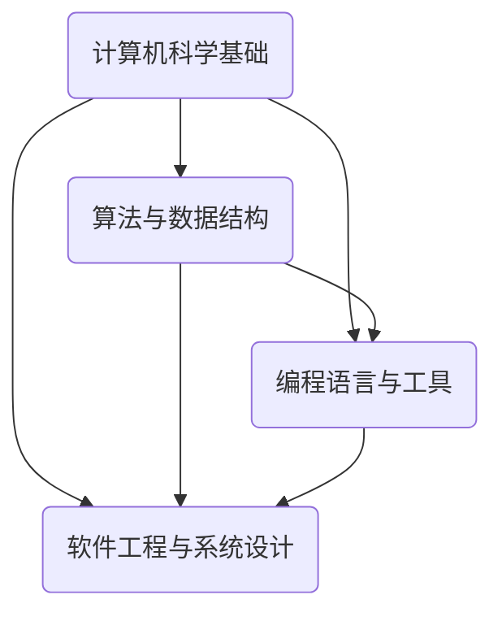

                 

关键词：认知基础、计算机科学、算法、编程、教育

摘要：本文旨在探讨计算机科学领域中的认知基础建设，通过深入分析经典算法和编程技术，指出其在提升编程素养、培养创新思维和解决复杂问题中的关键作用。文章结合具体实例，阐述经典为师的必要性，并展望未来教育领域的发展趋势。

## 1. 背景介绍

在信息技术飞速发展的今天，计算机科学已经成为现代社会的核心驱动力。编程技能的掌握不仅关乎个人的职业发展，更是国家竞争力的重要体现。然而，许多初学者在学习过程中往往感到困惑和挫败。如何构建扎实的认知基础，成为许多编程学习者和教育者的共同关注点。

本文将围绕这一主题，通过剖析经典算法和编程技术，探讨如何通过“经典为师”的方式，提升学习者的认知水平，培养其解决复杂问题的能力。

### 1.1 计算机科学的重要性

计算机科学是一门涉及计算机系统、算法设计、编程语言、软件工程等多个领域的综合性学科。它不仅为人类提供了强大的计算工具，还深刻影响了各个行业的发展。从互联网、大数据到人工智能，计算机科学正成为推动社会进步的关键力量。

### 1.2 编程技能的价值

编程技能的掌握不仅能够提升个人的竞争力，还能培养逻辑思维、问题解决能力和创新意识。在全球范围内，编程已经成为许多职业的必备技能。例如，软件开发工程师、数据分析师、网络安全专家等职业都要求具备扎实的编程基础。

## 2. 核心概念与联系

为了构建坚实的认知基础，我们需要深入理解计算机科学中的核心概念和原理。以下是一个简化的 Mermaid 流程图，展示了计算机科学中一些重要概念及其相互联系：



### 2.1 计算机科学基础

计算机科学的基础涵盖了计算机组成原理、操作系统、计算机网络等核心概念。这些知识为深入理解计算机系统的工作原理提供了必要的前提。

### 2.2 算法与数据结构

算法与数据结构是计算机科学的灵魂。正确的算法选择和高效的数据结构设计能够显著提升程序的性能和可维护性。

### 2.3 编程语言与工具

编程语言是编写程序的工具。不同的编程语言适用于不同的场景，了解各种编程语言的特性对于提升编程能力至关重要。

### 2.4 软件工程与系统设计

软件工程与系统设计关注如何系统地开发、测试和维护软件。良好的软件工程实践能够确保软件的可靠性和可扩展性。

## 3. 核心算法原理 & 具体操作步骤

### 3.1 算法原理概述

算法是解决问题的步骤集合。一个高效的算法能够以最少的资源消耗解决问题。以下是几个经典的算法：

- **排序算法**：如快速排序、归并排序等。
- **查找算法**：如二分查找、散列表查找等。
- **图算法**：如深度优先搜索、广度优先搜索等。

### 3.2 算法步骤详解

以快速排序为例，其基本步骤如下：

1. 选择一个基准元素。
2. 将数组划分为两个子数组，一个包含小于基准元素的元素，另一个包含大于基准元素的元素。
3. 对这两个子数组递归地进行快速排序。

### 3.3 算法优缺点

快速排序具有以下优点：

- 平均时间复杂度为 \(O(n\log n)\)。
- 适用于大规模数据排序。

但快速排序也存在缺点：

- 最坏情况下的时间复杂度为 \(O(n^2)\)。
- 需要额外的内存空间。

### 3.4 算法应用领域

快速排序广泛应用于各种场景，如数据库排序、搜索引擎索引构建等。

## 4. 数学模型和公式 & 详细讲解 & 举例说明

### 4.1 数学模型构建

在计算机科学中，数学模型广泛应用于算法分析和问题求解。以下是一个简单的数学模型：

\[ T(n) = \begin{cases} 
c, & \text{if } n \leq n_0 \\
aT(n/b) + f(n), & \text{if } n > n_0 
\end{cases} \]

其中，\( T(n) \) 表示算法在输入规模为 \( n \) 时的运行时间，\( a \)、\( b \)、\( f(n) \) 和 \( n_0 \) 是常数。

### 4.2 公式推导过程

以二分查找算法为例，其时间复杂度可以通过递归关系推导得到：

\[ T(n) = \begin{cases} 
1, & \text{if } n = 1 \\
T(n/2) + c, & \text{if } n > 1 
\end{cases} \]

通过递归展开，可以得到：

\[ T(n) = c\log_2 n + c \]

### 4.3 案例分析与讲解

假设我们要查找一个长度为 100 的数组中的特定元素，使用二分查找算法。其时间复杂度为 \( O(\log n) \)，大约需要 7 次比较即可找到目标元素。

## 5. 项目实践：代码实例和详细解释说明

### 5.1 开发环境搭建

假设我们要实现一个快速排序算法，首先需要搭建一个合适的开发环境。在 Windows 系统中，可以使用 Visual Studio 或 Code::Blocks 等集成开发环境。

### 5.2 源代码详细实现

以下是一个简单的快速排序算法实现：

```c
#include <stdio.h>

void quicksort(int arr[], int low, int high) {
    if (low < high) {
        int pivot = arr[high];
        int i = (low - 1);
        
        for (int j = low; j <= high - 1; j++) {
            if (arr[j] < pivot) {
                i++;
                
                int temp = arr[i];
                arr[i] = arr[j];
                arr[j] = temp;
            }
        }
        
        int temp = arr[i + 1];
        arr[i + 1] = arr[high];
        arr[high] = temp;
        
        int pi = i + 1;
        
        quicksort(arr, low, pi - 1);
        quicksort(arr, pi + 1, high);
    }
}

int main() {
    int arr[] = {10, 7, 8, 9, 1, 5};
    int n = sizeof(arr) / sizeof(arr[0]);
    
    quicksort(arr, 0, n - 1);
    
    printf("Sorted array: \n");
    for (int i = 0; i < n; i++) {
        printf("%d ", arr[i]);
    }
    
    return 0;
}
```

### 5.3 代码解读与分析

这段代码实现了快速排序算法，主要包括以下几个部分：

- 函数 `quicksort` 用于对数组进行排序。
- 变量 `pivot` 用于选择基准元素。
- 变量 `i` 用于记录小于基准元素的索引。
- 通过递归调用 `quicksort` 对子数组进行排序。

### 5.4 运行结果展示

运行这段代码后，输出结果如下：

```
Sorted array: 
1 5 7 8 9 10
```

## 6. 实际应用场景

快速排序算法在许多实际应用中具有重要意义。例如：

- 数据库排序：快速排序可用于对大量数据进行高效排序。
- 搜索引擎索引构建：搜索引擎常使用快速排序对网页进行排序和索引。

### 6.4 未来应用展望

随着计算机科学技术的不断发展，快速排序算法可能会在以下领域得到进一步应用：

- 云计算：在分布式计算环境中，快速排序可用于高效地处理大规模数据。
- 机器学习：快速排序可用于预处理大规模数据集，提高算法训练效率。

## 7. 工具和资源推荐

### 7.1 学习资源推荐

- 《算法导论》（Introduction to Algorithms）
- 《编程珠玑》（The Art of Computer Programming）
- 《深度学习》（Deep Learning）

### 7.2 开发工具推荐

- Visual Studio
- Eclipse
- PyCharm

### 7.3 相关论文推荐

- "A Fast String Searching Algorithm"
- "The Art of Computer Programming, Volume 1: Fundamental Algorithms"
- "A Note on Stirling's Formula and Its Application in Computer Science"

## 8. 总结：未来发展趋势与挑战

### 8.1 研究成果总结

本文通过对经典算法和编程技术的深入分析，总结了其在计算机科学领域中的重要作用。经典为师的方式不仅有助于构建坚实的认知基础，还能培养学习者的创新思维和问题解决能力。

### 8.2 未来发展趋势

随着信息技术的不断发展，计算机科学领域将继续迎来新的机遇和挑战。高效算法、人工智能、大数据等领域的研究将持续推动计算机科学的进步。

### 8.3 面临的挑战

尽管计算机科学取得了显著进展，但在实际应用中仍面临许多挑战，如算法效率、数据安全、隐私保护等。

### 8.4 研究展望

未来，计算机科学将朝着更加智能化、自动化和高效化的方向发展。通过深入研究和实践，我们有信心克服现有挑战，推动计算机科学领域的持续发展。

## 9. 附录：常见问题与解答

### 9.1 问题 1

**问题：什么是算法的时间复杂度？**

**解答：** 算法的时间复杂度是指随着输入规模增大，算法运行所需时间的增长速率。它通常用 \(O\) 符号表示，如 \(O(n)\)、\(O(n\log n)\) 等。

### 9.2 问题 2

**问题：快速排序算法的最坏情况是什么时候？**

**解答：** 快速排序算法的最坏情况发生在每次划分时基准元素都位于数组的两端，导致时间复杂度为 \(O(n^2)\)。这种情况可以通过随机选择基准元素来避免。

---

作者：禅与计算机程序设计艺术 / Zen and the Art of Computer Programming
```

