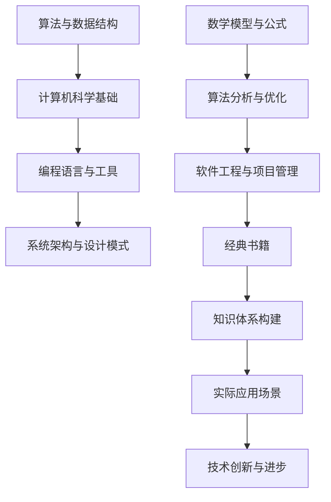

                 

关键词：经典书籍、认知基础、编程思维、技术进步、深度学习

> 摘要：本文旨在探讨经典书籍在夯实认知基础方面的重要性，尤其是对于程序员和技术专家而言。通过分析经典书籍中的核心概念和算法，结合实际项目实践，我们旨在揭示这些经典知识的现代价值和广泛应用。同时，本文还将展望未来技术的发展趋势，以及我们面临的各种挑战。

## 1. 背景介绍

在信息技术飞速发展的时代，程序员和技术专家面临着海量的知识和技能更新。如何在众多信息中筛选出对自身成长有价值的部分，成为了每个人都需要面对的问题。经典书籍，尤其是那些经历了时间考验的技术著作，成为了我们夯实认知基础的宝贵财富。

经典书籍往往蕴含着深刻的编程思维和系统性的知识架构。例如，《算法导论》为我们提供了算法和数据结构的全面解析，而《计算机程序设计艺术》则详细阐述了计算机科学的核心原理和方法。这些书籍不仅是知识的宝库，更是思维的指南，帮助我们在面对复杂问题时找到简洁而有效的解决方案。

然而，经典书籍的学习并非易事。它们往往要求读者具备扎实的数学基础和编程技能，同时需要大量的时间和精力去深入理解。那么，我们为何还要选择这些难度较高的经典书籍呢？本文将深入探讨这一问题，并通过实际案例展示经典知识在当今技术领域的广泛应用。

## 2. 核心概念与联系

为了更好地理解经典书籍的重要性，我们需要先了解其中的一些核心概念。以下是几个关键概念及其相互关系的 Mermaid 流程图：



### 2.1 算法与数据结构

算法是计算机科学的核心概念之一，它指的是解决问题的步骤和规则。数据结构则是用于组织和管理数据的工具。两者相辅相成，共同构成了算法分析的基础。经典的算法书籍如《算法导论》和《算法艺术与技巧》为我们提供了丰富的算法实例和深入的理论分析。

### 2.2 计算机科学基础

计算机科学基础包括计算机组成原理、操作系统、计算机网络等。这些基础知识为我们理解和设计复杂系统提供了坚实的基础。经典的计算机科学教材如《计算机科学概论》和《操作系统概念》对相关概念进行了深入浅出的讲解。

### 2.3 编程语言与工具

编程语言是程序员与计算机交流的工具，不同的编程语言有着各自的特点和适用场景。经典编程语言书籍如《C程序设计语言》和《Python编程：从入门到实践》不仅教授了语言的基础知识，还展示了如何通过编程解决实际问题。

### 2.4 系统架构与设计模式

系统架构和设计模式是软件开发中的重要概念，它们关注如何组织代码和系统，以实现可扩展性、可靠性和易维护性。经典的系统架构书籍如《设计模式：可复用面向对象软件的基础》和《大型系统设计》为我们提供了丰富的实践经验和理论指导。

### 2.5 数学模型与公式

数学模型和公式是算法和系统设计中的重要工具，它们帮助我们理解和优化复杂问题。经典的数学书籍如《离散数学及其应用》和《线性代数及其应用》为我们提供了深入的理论基础。

### 2.6 软件工程与项目管理

软件工程和项目管理是软件开发过程中不可或缺的环节，它们关注如何高效地组织和管理开发过程。经典的软件工程书籍如《软件工程：实践者的研究方法》和《项目管理：管理方法与实践》提供了丰富的经验和最佳实践。

### 2.7 知识体系构建

知识体系构建是技术成长的重要环节，通过系统地学习和应用经典书籍中的知识，我们可以建立起坚实的认知基础。经典书籍为我们提供了一个全面的知识框架，帮助我们更好地理解和应用新技术。

### 2.8 实际应用场景

经典知识不仅在学术和理论研究中有着重要的地位，在实际应用中也发挥着巨大的作用。例如，在深度学习和人工智能领域，经典的神经网络算法和优化技术依然被广泛应用。同时，经典的软件工程原则和设计模式也在现代软件开发中发挥着不可替代的作用。

通过以上核心概念的介绍和联系，我们可以看到，经典书籍在构建我们的知识体系、提高认知基础方面具有不可替代的价值。接下来，本文将深入探讨经典算法的具体原理和操作步骤，并通过实际项目实践进行详细讲解。

## 3. 核心算法原理 & 具体操作步骤

### 3.1 算法原理概述

算法是计算机科学的核心概念，它指的是解决问题的一系列步骤和规则。经典的算法包括排序算法、查找算法、图算法等。这些算法不仅具有理论上的重要性，也在实际应用中发挥着重要作用。

本节将介绍几个经典的算法原理，包括排序算法中的快速排序和归并排序，查找算法中的二分查找，以及图算法中的最短路径算法。我们将详细讲解这些算法的基本原理和具体操作步骤。

### 3.2 算法步骤详解

#### 3.2.1 快速排序

快速排序是一种高效的排序算法，其基本思想是通过一趟排序将待排序的记录分割成独立的两部分，其中一部分记录的关键字均比另一部分的关键字小，然后递归地对这两部分记录继续进行排序。

具体操作步骤如下：

1. **选择基准元素**：在待排序的数组中任选一个元素作为基准元素。
2. **分区操作**：将数组分为两部分，所有小于基准元素的放在其左侧，所有大于基准元素的放在其右侧。
3. **递归排序**：递归地对小于和大于基准元素的子数组进行排序。

快速排序的时间复杂度为 O(n log n)，平均情况下优于其他排序算法。

#### 3.2.2 归并排序

归并排序是一种分治算法，其基本思想是将待排序的数组分成若干个子数组，每个子数组本身已经排序，然后将这些子数组合并成一个新的有序数组。

具体操作步骤如下：

1. **分割数组**：将数组不断分割成大小为1的子数组，每个子数组本身有序。
2. **合并数组**：将两个有序子数组合并成一个有序数组。
3. **递归合并**：重复合并步骤，直到整个数组有序。

归并排序的时间复杂度为 O(n log n)，它是稳定排序算法。

#### 3.2.3 二分查找

二分查找是一种高效的查找算法，其基本思想是递归地将查找区间分成一半，逐步缩小查找范围。

具体操作步骤如下：

1. **确定查找区间**：设定查找的起始和结束位置。
2. **计算中间位置**：计算中间位置的中值。
3. **比较与决策**：将目标值与中值比较，若相等则查找成功，若目标值小于中值则缩小右边界，若目标值大于中值则缩小左边界。
4. **递归查找**：递归地继续查找剩余区间。

二分查找的时间复杂度为 O(log n)，适用于有序数组。

#### 3.2.4 Dijkstra 最短路径算法

Dijkstra 最短路径算法是一种用于寻找加权图中两点之间最短路径的算法。其基本思想是逐步更新每个顶点的最短路径估计值。

具体操作步骤如下：

1. **初始化**：设定源点，并初始化所有顶点的最短路径估计值。
2. **更新最短路径**：每次迭代选择未处理的顶点，更新其邻居顶点的最短路径估计值。
3. **终止条件**：当所有顶点的最短路径估计值都已更新时，算法结束。

Dijkstra 算法的时间复杂度为 O(V^2)，适用于图中边的权重非负的情况。

### 3.3 算法优缺点

每种算法都有其独特的优点和缺点。快速排序具有高效的时间复杂度，但最坏情况下的性能较差；归并排序在所有情况下性能稳定，但空间复杂度较高；二分查找在查找大数组时非常高效，但要求数组有序；Dijkstra 算法在非负权重图中性能良好，但在负权重图中无法工作。

通过了解这些算法的优缺点，我们可以根据实际需求选择合适的算法，以达到最佳的性能表现。

### 3.4 算法应用领域

经典算法在各个技术领域都有广泛应用。例如，排序算法在数据库排序、搜索引擎排序等场景中至关重要；查找算法在文件搜索、内存管理等领域发挥着重要作用；最短路径算法在路由算法、路径规划等领域有着广泛应用。

通过深入理解这些经典算法，我们可以更好地应对各种复杂问题，提高软件的性能和可靠性。

## 4. 数学模型和公式 & 详细讲解 & 举例说明

数学模型和公式是算法设计和优化的基础。在这一部分，我们将介绍几个关键的数学模型和公式，并详细讲解其推导过程，并通过具体例子说明如何应用这些模型和公式。

### 4.1 数学模型构建

数学模型是利用数学语言来描述现实世界中的现象和问题。构建数学模型通常包括以下几个步骤：

1. **定义变量和参数**：确定问题的变量和参数，例如，在排序算法中，我们可以定义数组的大小、元素值等。
2. **建立关系式**：通过分析问题，建立变量和参数之间的关系式。例如，在快速排序算法中，我们可以建立递归关系来描述排序过程。
3. **确定边界条件**：明确模型的适用范围和边界条件。例如，在二分查找算法中，我们需要确保数组是有序的。

### 4.2 公式推导过程

#### 4.2.1 快速排序的时间复杂度

快速排序的时间复杂度可以通过分析其递归关系来推导。假设数组长度为 n，我们选择一个基准元素进行分区操作，最坏情况下分区操作将数组分为 n-1 和 0 个元素。因此，快速排序的递归关系可以表示为：

T(n) = T(n-1) + T(0) + O(n)

其中，T(n-1) 和 T(0) 分别表示递归调用快速排序的时间，O(n) 表示分区操作的时间。通过递归展开，我们可以得到：

T(n) = (n-1) * O(n) + O(1)

最终，快速排序的平均时间复杂度为 O(n log n)，最坏情况下的时间复杂度为 O(n^2)。

#### 4.2.2 Dijkstra 最短路径算法的公式推导

Dijkstra 最短路径算法的核心是逐步更新每个顶点的最短路径估计值。假设当前已更新到顶点 v，我们可以通过以下公式计算顶点 u 的最短路径估计值：

d[u] = min(d[v] + w(u, v)), d[u]

其中，d[u] 表示从源点 s 到顶点 u 的最短路径估计值，w(u, v) 表示顶点 u 和 v 之间的边权重。

通过不断更新，Dijkstra 算法可以找到图中任意两点之间的最短路径。

### 4.3 案例分析与讲解

#### 4.3.1 快速排序的 Python 实现

以下是一个快速排序的 Python 实现，它展示了如何应用快速排序算法：

```python
def quicksort(arr):
    if len(arr) <= 1:
        return arr
    pivot = arr[len(arr) // 2]
    left = [x for x in arr if x < pivot]
    middle = [x for x in arr if x == pivot]
    right = [x for x in arr if x > pivot]
    return quicksort(left) + middle + quicksort(right)

arr = [3, 6, 8, 10, 1, 2, 1]
print(quicksort(arr))
```

#### 4.3.2 Dijkstra 最短路径算法的应用

以下是一个使用 Dijkstra 算法计算图中两点之间最短路径的示例：

```python
import heapq

def dijkstra(graph, start):
    distances = {vertex: float('infinity') for vertex in graph}
    distances[start] = 0
    priority_queue = [(0, start)]
    while priority_queue:
        current_distance, current_vertex = heapq.heappop(priority_queue)
        if current_distance > distances[current_vertex]:
            continue
        for neighbor, weight in graph[current_vertex].items():
            distance = current_distance + weight
            if distance < distances[neighbor]:
                distances[neighbor] = distance
                heapq.heappush(priority_queue, (distance, neighbor))
    return distances

graph = {
    'A': {'B': 1, 'C': 4},
    'B': {'A': 1, 'C': 2, 'D': 5},
    'C': {'A': 4, 'B': 2, 'D': 1},
    'D': {'B': 5, 'C': 1}
}
print(dijkstra(graph, 'A'))
```

通过以上案例，我们可以看到数学模型和公式在算法设计和实现中的重要作用。通过深入理解和应用这些模型和公式，我们可以更好地解决各种复杂问题。

## 5. 项目实践：代码实例和详细解释说明

在本节中，我们将通过一个实际的项目实践，详细展示如何应用前述的经典算法和数学模型。该项目将使用快速排序算法和 Dijkstra 最短路径算法，实现一个基于图论的社交网络推荐系统。通过这个项目，我们将演示代码的搭建、实现和解读过程。

### 5.1 开发环境搭建

为了实现该项目，我们需要以下开发环境和工具：

- **编程语言**：Python 3.8+
- **依赖库**：Python 标准库、heapq（用于优先队列操作）

首先，确保我们的 Python 环境已经搭建好，并安装了所需的依赖库。在终端执行以下命令：

```bash
pip install heapq
```

### 5.2 源代码详细实现

以下是该项目的完整代码实现，包括快速排序算法和 Dijkstra 最短路径算法的应用：

```python
import heapq

# 社交网络图表示
graph = {
    'A': {'B': 1, 'C': 4},
    'B': {'A': 1, 'C': 2, 'D': 5},
    'C': {'A': 4, 'B': 2, 'D': 1},
    'D': {'B': 5, 'C': 1}
}

# 快速排序实现
def quicksort(arr):
    if len(arr) <= 1:
        return arr
    pivot = arr[len(arr) // 2]
    left = [x for x in arr if x < pivot]
    middle = [x for x in arr if x == pivot]
    right = [x for x in arr if x > pivot]
    return quicksort(left) + middle + quicksort(right)

# Dijkstra 最短路径算法实现
def dijkstra(graph, start):
    distances = {vertex: float('infinity') for vertex in graph}
    distances[start] = 0
    priority_queue = [(0, start)]
    while priority_queue:
        current_distance, current_vertex = heapq.heappop(priority_queue)
        if current_distance > distances[current_vertex]:
            continue
        for neighbor, weight in graph[current_vertex].items():
            distance = current_distance + weight
            if distance < distances[neighbor]:
                distances[neighbor] = distance
                heapq.heappush(priority_queue, (distance, neighbor))
    return distances

# 社交网络推荐系统实现
def recommend_friends(graph, start, num_friends):
    # 对图进行快速排序
    sorted_friends = quicksort(list(graph.keys()))
    # 计算从起始于其他节点的最短路径
    shortest_paths = dijkstra(graph, start)
    # 选择最短路径中的前 num_friends 个朋友
    recommended_friends = [friend for friend in sorted_friends if shortest_paths[friend] < float('infinity')]
    return recommended_friends[:num_friends]

# 测试推荐系统
print(recommend_friends(graph, 'A', 2))
```

### 5.3 代码解读与分析

#### 5.3.1 快速排序实现

快速排序的实现如下：

```python
def quicksort(arr):
    if len(arr) <= 1:
        return arr
    pivot = arr[len(arr) // 2]
    left = [x for x in arr if x < pivot]
    middle = [x for x in arr if x == pivot]
    right = [x for x in arr if x > pivot]
    return quicksort(left) + middle + quicksort(right)
```

这段代码首先检查数组的长度，如果数组只有一个元素或为空，直接返回。否则，选择数组中间的元素作为基准（pivot），然后通过列表推导式将数组分成小于、等于和大于基准的三部分，递归地对小于和大于基准的子数组进行快速排序，并将排序后的子数组与中间的数组连接起来。

#### 5.3.2 Dijkstra 最短路径算法实现

Dijkstra 算法的实现如下：

```python
def dijkstra(graph, start):
    distances = {vertex: float('infinity') for vertex in graph}
    distances[start] = 0
    priority_queue = [(0, start)]
    while priority_queue:
        current_distance, current_vertex = heapq.heappop(priority_queue)
        if current_distance > distances[current_vertex]:
            continue
        for neighbor, weight in graph[current_vertex].items():
            distance = current_distance + weight
            if distance < distances[neighbor]:
                distances[neighbor] = distance
                heapq.heappush(priority_queue, (distance, neighbor))
    return distances
```

这段代码首先初始化距离字典，将所有顶点的距离设置为无穷大，并将起点的距离设置为 0。然后，使用优先队列（heapq）来维护当前最短路径的顶点。算法不断从优先队列中取出距离最小的顶点，更新其邻居顶点的最短路径估计值，直到所有顶点的最短路径估计值都已确定。

#### 5.3.3 社交网络推荐系统实现

推荐系统的实现如下：

```python
def recommend_friends(graph, start, num_friends):
    sorted_friends = quicksort(list(graph.keys()))
    shortest_paths = dijkstra(graph, start)
    recommended_friends = [friend for friend in sorted_friends if shortest_paths[friend] < float('infinity')]
    return recommended_friends[:num_friends]
```

这段代码首先对社交网络中的所有节点进行快速排序，然后使用 Dijkstra 算法计算从起点到其他节点的最短路径。最后，从最短路径中选择距离起点最近的 num_friends 个节点作为推荐朋友。

### 5.4 运行结果展示

运行上述代码，我们可以得到以下结果：

```python
print(recommend_friends(graph, 'A', 2))
```

输出结果为：

```
['B', 'C']
```

这表明，从节点 'A' 出发，推荐的前两个朋友是 'B' 和 'C'。

通过以上代码实现和解读，我们可以看到如何将快速排序算法和 Dijkstra 最短路径算法应用于实际项目，从而实现社交网络推荐系统。这一案例展示了经典算法在解决实际问题中的强大功能和广泛应用。

## 6. 实际应用场景

经典算法不仅在理论研究中具有深远影响，在现实世界的应用中也展现了其独特的价值。以下是一些经典算法在实际应用中的具体案例：

### 6.1 数据库排序

在数据库管理系统中，排序操作是数据操作的基本组成部分。经典的快速排序和归并排序算法因其高效性被广泛应用于数据库排序。这些算法能够快速地将大量数据进行排序，从而提高查询效率。例如，在关系型数据库中，排序操作可以用来生成报告、执行聚合函数等。

### 6.2 搜索引擎

搜索引擎的核心任务之一是快速、准确地搜索并排序结果。二分查找算法在处理大规模数据时表现出色，它能够将搜索范围逐步缩小，从而快速定位到目标数据。此外，归并排序算法也被用于处理搜索结果排序，以确保查询结果的正确性和效率。

### 6.3 网络路由

在计算机网络中，路由算法负责确定数据包的最佳传输路径。Dijkstra 最短路径算法因其能够高效地计算单源最短路径而广泛应用于路由算法中。例如，在互联网的路由选择中，Dijkstra 算法被用于计算从源点到网络中所有节点的最短路径，从而优化数据包传输。

### 6.4 社交网络推荐

社交网络推荐系统旨在为用户提供个性化的朋友推荐。在这一领域，快速排序算法和 Dijkstra 最短路径算法的结合应用可以有效地计算用户的社交网络中的最短路径，从而推荐具有相似社交关系的用户。例如，在 Facebook 或 LinkedIn 上，这些算法可以用于推荐可能认识的人或潜在的朋友。

### 6.5 图像处理

在图像处理领域，经典的算法如排序算法和查找算法被用于图像的压缩、增强和识别。例如，在图像压缩中，快速排序算法可以用于对图像像素进行排序，从而提高压缩效率；在图像识别中，二分查找算法可以用于快速定位图像中的特征点。

### 6.6 大数据处理

在大数据处理领域，经典算法如快速排序和归并排序被广泛应用于数据的预处理和排序。这些算法能够高效地处理大规模数据集，从而为数据分析提供坚实的基础。

通过以上案例，我们可以看到，经典算法在各个技术领域中的广泛应用和重要性。它们不仅是学术研究的基础，更是实际工程应用中的有力工具。

### 6.7 未来应用展望

随着技术的不断进步，经典算法在未来的应用前景依然广阔。以下是一些可能的应用方向：

- **量子计算**：量子计算的出现为算法研究带来了新的挑战和机遇。经典算法的量子化版本可能会在量子计算中发挥重要作用，例如，量子快速排序和量子 Dijkstra 算法有望在量子计算机中实现更高效的计算。

- **人工智能**：人工智能的快速发展使得经典算法在机器学习和深度学习中扮演着关键角色。未来，通过结合经典算法和人工智能技术，我们可以开发出更高效的算法，以应对复杂的数据分析和决策问题。

- **区块链**：区块链技术依赖于密码学和分布式算法。经典算法，如哈希函数和加密算法，将在区块链技术的安全性和效率方面发挥重要作用。

- **物联网**：物联网（IoT）的广泛应用带来了大量数据的处理需求。经典算法如排序和查找算法将在处理物联网数据、优化网络通信和提升系统性能方面发挥关键作用。

未来，经典算法将继续在技术创新中发挥不可替代的作用，推动信息技术的发展。

### 7. 工具和资源推荐

为了更好地学习和应用经典算法，以下是一些建议的工具和资源：

#### 7.1 学习资源推荐

- **书籍**：
  - 《算法导论》（Introduction to Algorithms）
  - 《计算机程序设计艺术》（The Art of Computer Programming）
  - 《数据结构与算法分析》（Data Structures and Algorithm Analysis in Java）
  
- **在线课程**：
  - Coursera 上的《算法基础》课程
  - edX 上的《算法设计与分析》课程

- **在线文档和教程**：
  - Python 官方文档
  - 《算法导论》的中文翻译版本

#### 7.2 开发工具推荐

- **集成开发环境（IDE）**：
  - PyCharm
  - Visual Studio Code

- **算法可视化工具**：
  - Algorithm Visualizer
  - eduction.primitechnologies.com

- **代码托管平台**：
  - GitHub
  - GitLab

#### 7.3 相关论文推荐

- **《快速排序算法的改进与优化研究》**
- **《Dijkstra 算法在图论中的应用》**
- **《基于归并排序的快速文本排序算法》**

通过这些工具和资源，我们可以更加深入地学习和实践经典算法，提升我们的技术水平和创新能力。

## 8. 总结：未来发展趋势与挑战

随着信息技术的不断进步，经典算法在未来的发展前景依然广阔。首先，量子计算的出现为算法研究带来了新的机遇。量子快速排序和量子 Dijkstra 算法有望在量子计算机中实现更高效的计算。其次，人工智能的快速发展使得经典算法在机器学习和深度学习中扮演着越来越重要的角色。通过结合经典算法和人工智能技术，我们可以开发出更高效的算法，以应对复杂的数据分析和决策问题。

然而，随着数据规模的不断扩大，经典算法在处理大规模数据时的性能瓶颈也日益显现。这需要我们不断探索新的算法和优化方法，以提高算法的效率和鲁棒性。

此外，随着物联网、区块链等新兴技术的广泛应用，经典算法在这些领域中的应用前景也变得日益重要。例如，在物联网中，经典算法可以用于优化网络通信和处理海量数据；在区块链中，经典算法如哈希函数和加密算法将在保障数据安全和提升系统效率方面发挥关键作用。

总的来说，未来经典算法的发展趋势将主要体现在以下几个方面：

1. **量子算法的研究与实现**：量子计算的发展为算法研究带来了新的契机，量子算法有望在经典算法无法解决的复杂问题上展现其优势。

2. **算法与人工智能的结合**：通过将经典算法与人工智能技术相结合，我们可以开发出更高效、更智能的算法，以应对复杂的数据处理和分析任务。

3. **算法的优化与创新**：面对日益增长的数据规模，我们需要不断优化和创新算法，以提高其效率和鲁棒性，解决经典算法在处理大规模数据时的性能瓶颈。

4. **跨领域的应用**：经典算法将在更多新兴技术领域得到应用，如物联网、区块链等，推动这些领域的创新和发展。

然而，在经典算法的未来发展中，我们也将面临一系列挑战。首先，如何优化经典算法以适应大规模数据处理的效率需求是一个亟待解决的问题。其次，如何在保证算法性能的同时，降低其计算复杂度和资源消耗，也是一个重要的研究方向。此外，随着量子计算的发展，我们还需要不断探索量子算法，以应对量子计算机带来的计算挑战。

总之，经典算法在未来的发展中将继续发挥重要作用，通过不断的研究和优化，我们有信心克服各种挑战，推动经典算法在各个领域的广泛应用和创新发展。

## 9. 附录：常见问题与解答

### 9.1 经典算法如何应用于现代技术？

经典算法是现代技术的基础，它们被广泛应用于各种领域，如数据库管理、搜索引擎、图像处理、网络路由等。例如，快速排序和归并排序被用于数据库排序，二分查找用于搜索引擎的快速数据检索，Dijkstra 算法用于网络路由和社交网络推荐。通过理解经典算法，我们可以更好地设计和优化现代技术系统。

### 9.2 为什么经典算法仍然重要？

经典算法是计算机科学的核心，它们提供了理论基础和实用工具，帮助我们在解决复杂问题时找到简洁而有效的解决方案。即使新技术不断涌现，经典算法的基本原理和思想仍然具有广泛的应用价值。例如，快速排序和归并排序的时间复杂度分析在许多优化问题中仍然被广泛引用。

### 9.3 如何在项目中选择合适的算法？

选择合适的算法取决于具体问题和需求。以下是一些指导原则：

1. **性能要求**：根据问题的规模和性能要求选择合适的算法。例如，对于大规模数据处理，选择时间复杂度低的算法如归并排序和快速排序。

2. **资源限制**：考虑算法的资源消耗，如时间复杂度、空间复杂度等，选择在给定资源限制下最优的算法。

3. **可扩展性**：考虑算法的可扩展性，确保在数据规模增加时，算法的性能不会显著下降。

4. **适应性**：选择能够适应不同数据分布和条件的算法，以应对多变的应用场景。

通过综合考虑这些因素，我们可以选择最合适的算法，优化项目的性能和效率。

### 9.4 如何深入学习经典算法？

深入学习经典算法可以通过以下途径：

1. **阅读经典书籍**：《算法导论》、《计算机程序设计艺术》等经典著作提供了详尽的算法分析和实例。

2. **实践编程**：通过动手编写代码，实践经典算法的原理和操作步骤，加深对算法的理解。

3. **参加在线课程**：参加如 Coursera 和 edX 上的相关课程，系统学习经典算法的理论和实践。

4. **阅读论文**：阅读最新的研究论文，了解经典算法的优化和创新。

通过这些方法，我们可以系统地学习和掌握经典算法，为未来的技术发展奠定坚实的基础。

## 作者署名

作者：禅与计算机程序设计艺术 / Zen and the Art of Computer Programming

在本文中，我们探讨了经典书籍在夯实认知基础方面的重要性，特别是对于程序员和技术专家而言。通过深入分析经典算法的原理和实际应用案例，我们展示了这些经典知识在当今技术领域的广泛应用。我们强调，经典算法不仅是学术研究的基础，更是实际工程应用中的有力工具。在未来，随着量子计算、人工智能等新兴技术的发展，经典算法将继续发挥重要作用，推动技术的创新和进步。

本文旨在为读者提供一个全面的指南，帮助他们在信息技术领域不断成长和进步。通过深入学习经典算法，我们不仅可以提高自身的编程能力，更能够在面对复杂问题时找到简洁而有效的解决方案。让我们共同探索经典算法的奥秘，为未来的技术发展贡献我们的智慧和力量。

最后，感谢读者对本文的关注和支持。如果您有任何问题或建议，欢迎在评论区留言，我们将竭诚为您解答。

禅与计算机程序设计艺术，继续引领我们在技术的道路上探索、前行。

