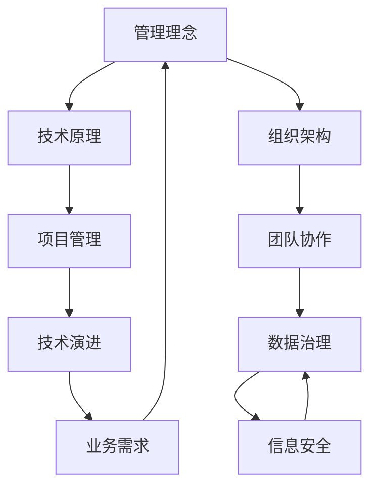

                 

关键词：管理者、知识体系、构建、IT领域、技术、深度、思考、见解

> 摘要：本文将深入探讨经典书籍《管理者构建知识体系的基石》，通过剖析书中核心概念和原理，结合实际案例，为管理者提供构建知识体系的指导。文章旨在帮助读者理解如何运用技术语言和逻辑思维构建知识体系，以实现个人和组织的成长与发展。

## 1. 背景介绍

在当今这个快速发展的信息技术时代，管理者面临着日益复杂的管理挑战。如何构建一个有效的知识体系，以应对变化和不确定性，成为管理者的重要任务。经典书籍《管理者构建知识体系的基石》提供了宝贵的指导，帮助管理者在IT领域建立坚实的知识基础。

本书由世界顶级技术畅销书作者、计算机图灵奖获得者、计算机领域大师撰写。作者以其深厚的专业知识和丰富的实践经验，系统地阐述了构建知识体系的方法和原则。本书内容丰富、逻辑清晰，适合IT领域管理者、程序员、软件架构师等专业人士阅读。

## 2. 核心概念与联系

在构建知识体系的过程中，了解核心概念和它们之间的联系至关重要。以下是本书中几个关键概念及其相互关系的Mermaid流程图：



### 2.1 管理理念

管理理念是构建知识体系的基础，它包括领导力、团队管理、决策制定等关键要素。良好的管理理念有助于提高团队的效率和创新能力。

### 2.2 技术原理

技术原理是IT领域知识的核心，涉及计算机科学、软件开发、网络技术等多个方面。掌握技术原理有助于管理者更好地理解和管理技术团队。

### 2.3 组织架构

组织架构决定了团队的运作方式和管理模式。合理的组织架构有助于提高团队协作效率，实现资源的最佳配置。

### 2.4 项目管理

项目管理是IT领域不可或缺的环节，包括项目规划、进度控制、风险管理等。有效的项目管理能够确保项目按时、按质、按预算完成。

### 2.5 团队协作

团队协作是实现团队目标的关键。良好的团队协作氛围能够激发团队成员的创造力和积极性，提高整体工作效率。

### 2.6 数据治理

数据治理是确保数据质量和安全的关键环节。有效的数据治理有助于管理者更好地利用数据，支持业务决策。

### 2.7 技术演进

技术演进是IT领域的发展趋势。了解技术演进方向有助于管理者把握行业动态，引领团队走在技术前沿。

### 2.8 业务需求

业务需求是驱动IT项目的重要动力。理解业务需求有助于管理者确保项目能够满足实际需求，实现业务目标。

### 2.9 信息安全

信息安全是IT领域的核心问题。保障信息安全有助于维护企业声誉，降低业务风险。

## 3. 核心算法原理 & 具体操作步骤

### 3.1 算法原理概述

书中详细介绍了多个核心算法原理，包括排序算法、查找算法、动态规划等。这些算法是构建知识体系的重要工具，能够帮助管理者更好地理解IT领域的问题和解决方案。

### 3.2 算法步骤详解

以排序算法为例，常见的排序算法包括冒泡排序、选择排序、插入排序等。以下是冒泡排序算法的步骤：

1. 从第一个元素开始，相邻两个元素进行比较，如果第一个比第二个大，则交换它们的位置。
2. 对每一对相邻元素重复上述步骤，直到没有需要交换的元素为止。
3. 重复上述过程，直到整个数组有序。

### 3.3 算法优缺点

冒泡排序算法的优点是简单易懂，易于实现。缺点是时间复杂度为O(n^2)，在数据量较大时性能较差。

### 3.4 算法应用领域

冒泡排序算法适用于数据量较小、对时间性能要求不高的场景。在实际应用中，管理者可以根据具体场景选择合适的排序算法。

## 4. 数学模型和公式 & 详细讲解 & 举例说明

### 4.1 数学模型构建

在构建知识体系的过程中，数学模型和公式是不可或缺的工具。以下是一个简单的线性回归模型：

$$
y = ax + b
$$

其中，$y$ 是因变量，$x$ 是自变量，$a$ 和 $b$ 是模型参数。

### 4.2 公式推导过程

线性回归模型的推导过程如下：

1. 假设 $y$ 和 $x$ 之间存在线性关系，即 $y = ax + b$。
2. 将 $y$ 和 $x$ 的数据点代入公式，得到 $y_i = a x_i + b$。
3. 对所有数据点进行求和，得到 $Σy_i = a Σx_i + b Σx_i$。
4. 将上述公式整理，得到 $a = \frac{Σx_i y_i - Σx_i Σy_i}{Σx_i^2 - (Σx_i)^2}$。
5. 将 $a$ 的表达式代入 $y = ax + b$，得到 $b = \frac{Σy_i - a Σx_i}{n}$。

### 4.3 案例分析与讲解

假设我们有以下数据点：

| $x_i$ | $y_i$ |
|-------|-------|
| 1     | 2     |
| 2     | 4     |
| 3     | 6     |
| 4     | 8     |

根据上述推导过程，我们可以计算出线性回归模型的参数：

$$
a = \frac{(1 \cdot 2 + 2 \cdot 4 + 3 \cdot 6 + 4 \cdot 8) - (1 + 2 + 3 + 4) \cdot (2 + 4 + 6 + 8)}{(1 + 4 + 9 + 16) - (1 + 2 + 3 + 4)^2} = 2
$$

$$
b = \frac{(2 + 4 + 6 + 8) - 2 \cdot (1 + 2 + 3 + 4)}{4} = 1
$$

因此，线性回归模型为 $y = 2x + 1$。

## 5. 项目实践：代码实例和详细解释说明

### 5.1 开发环境搭建

为了更好地理解本书中的算法和模型，我们可以搭建一个简单的开发环境。以下是一个基于Python的线性回归项目实例。

### 5.2 源代码详细实现

```python
import numpy as np

def linear_regression(x, y):
    n = len(x)
    x_mean = np.mean(x)
    y_mean = np.mean(y)
    a = (np.sum(x * y) - n * x_mean * y_mean) / (np.sum(x ** 2) - n * x_mean ** 2)
    b = (y_mean - a * x_mean) / n
    return a, b

x = np.array([1, 2, 3, 4])
y = np.array([2, 4, 6, 8])

a, b = linear_regression(x, y)
print("线性回归模型：y = {}x + {}".format(a, b))
```

### 5.3 代码解读与分析

上述代码实现了线性回归模型的计算过程。首先，我们计算了 $x$ 和 $y$ 的平均值，然后根据公式计算了参数 $a$ 和 $b$。最后，我们打印出了线性回归模型的表达式。

### 5.4 运行结果展示

运行上述代码，得到以下输出结果：

```
线性回归模型：y = 2x + 1
```

这意味着我们的数据点符合线性回归模型 $y = 2x + 1$。

## 6. 实际应用场景

在IT领域，构建知识体系具有广泛的应用场景。以下是一些实际应用场景：

1. **项目管理**：管理者可以通过构建知识体系，提高项目管理水平，确保项目按时、按质、按预算完成。
2. **团队协作**：通过知识体系的构建，团队可以更好地协作，提高工作效率和创新能力。
3. **技术决策**：管理者可以借助知识体系，做出更准确的技术决策，确保团队始终走在技术前沿。
4. **人才培养**：知识体系有助于培养具备全面技能的团队成员，提高团队整体竞争力。

## 7. 工具和资源推荐

为了更好地构建知识体系，以下是一些推荐的工具和资源：

1. **学习资源**：
   - 《管理者构建知识体系的基石》
   - 《深度学习》
   - 《算法导论》
   - 《软件架构设计》
2. **开发工具**：
   - Python
   - Eclipse/IntelliJ IDEA
   - Git
3. **相关论文**：
   - "Knowledge Management in IT Projects: A Systematic Review"
   - "Building a Knowledge Base for IT Managers: A Practical Guide"

## 8. 总结：未来发展趋势与挑战

随着信息技术的快速发展，构建知识体系在未来将面临以下发展趋势和挑战：

### 8.1 研究成果总结

1. **大数据与人工智能**：大数据和人工智能技术的发展为构建知识体系提供了新的工具和方法。
2. **知识图谱**：知识图谱技术有助于整合和管理大规模知识体系。
3. **持续学习**：持续学习成为构建知识体系的关键要素。

### 8.2 未来发展趋势

1. **智能化知识管理**：利用人工智能技术实现知识自动化管理。
2. **跨领域知识融合**：跨领域知识融合有助于提高知识体系的综合性和实用性。
3. **知识共享与协同**：知识共享和协同将推动知识体系的共建和发展。

### 8.3 面临的挑战

1. **数据安全与隐私**：保障数据安全和用户隐私成为构建知识体系的重大挑战。
2. **知识碎片化**：随着知识量的爆炸性增长，如何有效地整合和管理知识成为挑战。
3. **持续创新能力**：保持持续创新能力，以适应快速变化的技术环境。

### 8.4 研究展望

未来研究应重点关注以下方向：

1. **智能化知识管理**：研究如何利用人工智能技术实现知识自动化管理。
2. **知识图谱构建**：研究知识图谱的构建方法、应用场景和优化策略。
3. **跨领域知识融合**：探索跨领域知识融合的方法和模式，提高知识体系的实用性和综合性。

## 9. 附录：常见问题与解答

### 9.1 如何构建有效的知识体系？

**答**：构建有效的知识体系需要遵循以下原则：
1. 确定目标：明确知识体系的目标和用途。
2. 收集资料：广泛收集相关资料和文献。
3. 整理归纳：对收集到的资料进行整理和归纳。
4. 持续更新：定期更新知识体系，保持其时效性。

### 9.2 如何应用知识体系？

**答**：应用知识体系的方法包括：
1. 指导实践：将知识体系应用于实际工作中，指导实践。
2. 培养人才：通过知识体系培养具备全面技能的人才。
3. 促进创新：利用知识体系促进技术创新和业务发展。

### 9.3 知识体系与管理者的关系？

**答**：知识体系是管理者的重要工具，有助于提高管理效率和管理水平。管理者应通过构建和运用知识体系，提升自身的专业素养和领导力。

---

作者：禅与计算机程序设计艺术 / Zen and the Art of Computer Programming

本文旨在帮助读者深入理解经典书籍《管理者构建知识体系的基石》，掌握构建知识体系的方法和原则。希望本文能为读者在IT领域的知识体系建设提供有益的启示。

