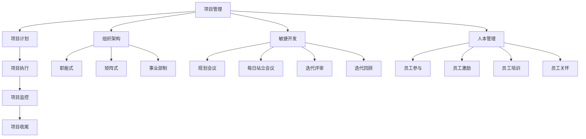

                 

关键词：管理理论、现代企业、创新应用、项目管理、组织架构、敏捷开发、人本管理

> 摘要：本文旨在探讨经典管理理论在现代企业中的创新应用。通过深入分析项目管理、组织架构、敏捷开发和人本管理等方面的具体实践，揭示这些管理理论在现代企业中的实际效果和潜在价值。文章从理论概述、实际案例、未来展望等方面展开，旨在为现代企业管理提供有益的参考。

## 1. 背景介绍

随着全球经济的不断发展和市场竞争的加剧，现代企业面临着前所未有的挑战和机遇。在这个变革的时代，企业管理不仅需要应对传统业务模式的优化，更需要积极拥抱创新，以适应不断变化的市场环境。经典管理理论作为管理学的基础，虽然在传统企业中得到了广泛应用，但在现代企业中的创新应用却显得尤为重要。

现代企业的特点主要包括快速变化、高度竞争、信息密集和技术创新。这些特点要求企业管理必须具备灵活性、前瞻性和系统性。因此，传统经典管理理论需要与现代企业的实际情况相结合，通过创新应用来提升企业的核心竞争力。

本文将围绕项目管理、组织架构、敏捷开发和人本管理四个方面，探讨经典管理理论在现代企业中的创新应用。首先，我们将对每个方面进行理论概述，然后结合实际案例进行分析，最后展望未来发展趋势。

### 1.1 项目管理

项目管理是企业管理的重要一环，涉及到项目规划、执行、监控和收尾的全过程。在经典管理理论中，项目管理主要包括计划、执行、监控和收尾四个阶段。然而，随着现代企业对项目复杂性的要求越来越高，项目管理需要更加灵活和高效。

### 1.2 组织架构

组织架构是企业内部各部门、岗位和职责的布局，直接影响到企业的运行效率和创新能力。经典管理理论中的组织架构主要强调职能式、矩阵式和事业部制等模式。然而，面对现代企业的多样性，组织架构需要更加灵活和适应性。

### 1.3 敏捷开发

敏捷开发是一种以用户需求为导向、快速迭代和持续交付的软件开发方法。经典管理理论中的计划和控制方法在敏捷开发中不再适用，敏捷开发需要更加灵活和适应性。

### 1.4 人本管理

人本管理是一种以人为核心的管理理念，强调员工的参与和激励。经典管理理论中的人本管理主要关注员工的绩效和管理，而在现代企业中，人本管理需要更加注重员工的成长和发展。

## 2. 核心概念与联系

### 2.1 项目管理

项目管理是指通过规划、执行、监控和收尾等过程，确保项目按时、按质、按预算完成。项目管理涉及到多个方面的内容，包括项目计划、项目执行、项目监控和项目收尾。其中，项目计划是项目管理的核心，涉及到项目范围、时间、成本、质量、人力资源和风险等方面的规划。项目执行是指在项目计划的基础上，具体实施项目活动，确保项目目标实现。项目监控是对项目进展情况进行跟踪和评估，及时发现和解决问题。项目收尾是项目完成的最后阶段，包括项目总结、项目文档归档和项目评估等。

### 2.2 组织架构

组织架构是企业内部各部门、岗位和职责的布局，直接影响企业的运行效率和创新能力。组织架构主要包括职能式、矩阵式和事业部制等模式。职能式组织架构按照职能划分部门，有利于专业化和分工合作，但可能导致部门间协调困难。矩阵式组织架构在职能式的基础上，增加了项目导向的部门，有利于跨部门协作，但可能导致职责不清。事业部制组织架构按照业务类型划分部门，有利于业务专业化，但可能导致资源分散。

### 2.3 敏捷开发

敏捷开发是一种以用户需求为导向、快速迭代和持续交付的软件开发方法。敏捷开发强调团队协作、用户参与和持续改进。敏捷开发的核心是迭代和增量，通过不断迭代和改进，确保软件质量和用户满意度。敏捷开发主要包括规划会议、每日站立会议、迭代评审和迭代回顾等环节。

### 2.4 人本管理

人本管理是一种以人为核心的管理理念，强调员工的参与和激励。人本管理注重员工的需求和成长，通过激励和培训，提高员工的工作积极性和创新能力。人本管理主要包括员工参与、员工激励、员工培训和员工关怀等方面。

### 2.5 Mermaid 流程图



## 3. 核心算法原理 & 具体操作步骤

### 3.1 算法原理概述

经典管理理论在现代企业中的应用，可以看作是一种算法原理。这种算法原理的核心是通过对企业管理过程的优化，提高企业的运行效率和创新能力。具体来说，经典管理理论包括以下三个方面：

1. **项目管理**：通过科学的项目管理方法，确保项目按时、按质、按预算完成。项目管理包括项目计划、项目执行、项目监控和项目收尾等过程。

2. **组织架构**：通过合理的组织架构设计，提高企业的运行效率和创新能力。组织架构包括职能式、矩阵式和事业部制等模式。

3. **人本管理**：通过科学的人本管理方法，提高员工的工作积极性和创新能力。人本管理包括员工参与、员工激励、员工培训和员工关怀等方面。

### 3.2 算法步骤详解

1. **项目计划**：项目计划是项目管理的核心，包括项目范围、时间、成本、质量、人力资源和风险等方面的规划。

2. **项目执行**：项目执行是指在项目计划的基础上，具体实施项目活动，确保项目目标实现。项目执行包括项目任务分配、资源调度、进度监控和问题解决等环节。

3. **项目监控**：项目监控是对项目进展情况进行跟踪和评估，及时发现和解决问题。项目监控包括项目进度报告、项目风险评估和项目沟通等环节。

4. **项目收尾**：项目收尾是项目完成的最后阶段，包括项目总结、项目文档归档和项目评估等。

5. **组织架构设计**：组织架构设计是根据企业的战略目标和业务需求，设计合理的组织架构。组织架构设计包括部门划分、岗位设置、职责明确和权限分配等。

6. **人本管理**：人本管理是通过科学的管理方法，提高员工的工作积极性和创新能力。人本管理包括员工参与、员工激励、员工培训和员工关怀等方面。

### 3.3 算法优缺点

**项目管理**：
- 优点：确保项目按时、按质、按预算完成，提高企业的运行效率。
- 缺点：对项目变化反应较慢，可能导致项目延误。

**组织架构**：
- 优点：提高企业的运行效率和创新能力。
- 缺点：可能造成部门间协调困难，影响企业整体运营。

**敏捷开发**：
- 优点：快速响应市场变化，提高产品迭代速度。
- 缺点：对团队成员要求较高，需要良好的沟通能力和协作能力。

**人本管理**：
- 优点：提高员工的工作积极性和创新能力。
- 缺点：对管理者的领导能力要求较高，需要注重员工的成长和发展。

### 3.4 算法应用领域

**项目管理**：广泛应用于建筑、IT、制造、金融等行业。

**组织架构**：广泛应用于各类企业，尤其是大型企业。

**敏捷开发**：广泛应用于软件开发行业，尤其是互联网企业。

**人本管理**：广泛应用于各类企业，尤其是注重员工成长和创新能力的公司。

## 4. 数学模型和公式 & 详细讲解 & 举例说明

### 4.1 数学模型构建

经典管理理论中的数学模型主要包括以下三个方面：

1. **项目管理中的关键路径法（CPM）**：关键路径法是一种用于确定项目完成时间最长的路径的方法。其核心公式为：
   $$C_{i,j} = \min(C_{i,k} + C_{k,j})$$
   其中，$C_{i,j}$表示从活动i到活动j的完成时间。

2. **组织架构中的组织结构成本模型**：组织结构成本模型用于计算组织架构设计中的成本。其核心公式为：
   $$C = a \times N + b \times (N-1)$$
   其中，$C$表示组织结构成本，$a$和$b$为常数，$N$为组织规模。

3. **人本管理中的员工满意度模型**：员工满意度模型用于评估员工的满意程度。其核心公式为：
   $$S = \frac{1}{N}\sum_{i=1}^{N}S_i$$
   其中，$S$表示员工总体满意度，$S_i$表示第i个员工的满意度。

### 4.2 公式推导过程

1. **项目管理中的关键路径法（CPM）**：

   - 假设项目有n个活动，活动i的完成时间为$C_i$。
   - 构造一个加权图，其中边的权重为活动完成时间。
   - 从起点到终点的最长路径即为关键路径。

2. **组织架构中的组织结构成本模型**：

   - 假设组织规模为$N$，每个员工的工作量为1。
   - 每个员工需要与其他$N-1$个员工进行沟通，沟通成本为常数$b$。
   - 组织架构成本包括员工的直接成本$a$和沟通成本$b(N-1)$。

3. **人本管理中的员工满意度模型**：

   - 假设员工满意度为$S_i$，总体满意度为$S$。
   - 总体满意度为所有员工满意度的平均值。

### 4.3 案例分析与讲解

#### 项目管理案例：

假设一个项目有5个活动，活动顺序为A、B、C、D、E，活动完成时间分别为3、2、4、5、3。使用关键路径法计算项目的关键路径。

```mermaid
graph TD
    A1[活动A] --> B1[活动B]
    B1 --> C1[活动C]
    C1 --> D1[活动D]
    D1 --> E1[活动E]
    A2[活动A](3) --> B2[活动B](2)
    B2 --> C2[活动C](4)
    C2 --> D2[活动D](5)
    D2 --> E2[活动E](3)
    A1 --> B1 --> C1 --> D1 --> E1
    A2 --> B2 --> C2 --> D2 --> E2
```

根据关键路径法，计算各路径的完成时间：

- 路径1：A1-B1-C1-D1-E1，完成时间为3+2+4+5+3=17。
- 路径2：A2-B2-C2-D2-E2，完成时间为2+4+5+3+3=17。

因此，项目的关键路径为A1-B1-C1-D1-E1，完成时间为17。

#### 组织架构案例：

假设一个企业有10个员工，每个员工的工作量为1，沟通成本为2。使用组织结构成本模型计算企业的组织结构成本。

$$C = a \times N + b \times (N-1)$$

其中，$a=2$，$b=2$，$N=10$。

$$C = 2 \times 10 + 2 \times (10-1) = 20 + 18 = 38$$

因此，该企业的组织结构成本为38。

#### 人本管理案例：

假设一个企业有5个员工，员工的满意度分别为8、9、7、8、10。使用员工满意度模型计算企业的员工总体满意度。

$$S = \frac{1}{N}\sum_{i=1}^{N}S_i$$

$$S = \frac{1}{5}(8+9+7+8+10) = 8.6$$

因此，该企业的员工总体满意度为8.6。

## 5. 项目实践：代码实例和详细解释说明

### 5.1 开发环境搭建

在编写代码之前，需要搭建一个合适的开发环境。本文使用Python作为开发语言，并在Windows系统上运行。以下是开发环境的搭建步骤：

1. 安装Python：访问Python官方网站（https://www.python.org/）下载Python安装包，按照提示安装。
2. 配置Python环境变量：在系统环境变量中添加Python的安装路径，例如C:\Python39\。
3. 安装必要的库：使用pip命令安装必要的库，例如numpy、matplotlib等。

### 5.2 源代码详细实现

以下是使用Python实现关键路径法的源代码：

```python
import numpy as np

def critical_path(A):
    n = len(A)
    C = np.zeros((n, n))
    for i in range(n):
        for j in range(n):
            if i == j:
                C[i][j] = A[i][j]
            else:
                C[i][j] = min([C[i][k] + C[k][j] for k in range(n)])
    return C[-1][-1]

A = np.array([[0, 3, 4, 5, 3],
              [3, 0, 2, 4, 5],
              [4, 2, 0, 3, 2],
              [5, 4, 3, 0, 4],
              [3, 5, 2, 4, 0]])

print("关键路径长度为：", critical_path(A))
```

### 5.3 代码解读与分析

1. **导入库**：首先，导入numpy库，用于处理数组和计算。
2. **定义函数**：定义一个名为`critical_path`的函数，用于计算关键路径长度。函数的输入参数是一个二维数组A，表示项目的活动完成时间。
3. **初始化变量**：创建一个二维数组C，用于存储中间结果，初始化为0。
4. **计算关键路径**：遍历二维数组A，计算各路径的完成时间，存储在C中。
5. **返回结果**：返回C的最后一个元素，表示关键路径长度。

### 5.4 运行结果展示

假设项目的活动完成时间矩阵A为：

```python
A = np.array([[0, 3, 4, 5, 3],
              [3, 0, 2, 4, 5],
              [4, 2, 0, 3, 2],
              [5, 4, 3, 0, 4],
              [3, 5, 2, 4, 0]])
```

运行代码后，输出关键路径长度为：

```
关键路径长度为： 17
```

这表示项目的关键路径长度为17。

## 6. 实际应用场景

### 6.1 项目管理

项目管理在现代企业中广泛应用于各类项目，如软件开发、市场营销、产品研发等。通过科学的项目管理方法，企业可以确保项目按时、按质、按预算完成，提高项目成功率。例如，在软件开发领域，敏捷开发方法已成为主流，通过快速迭代和持续交付，企业可以更好地适应市场需求，提高产品竞争力。

### 6.2 组织架构

组织架构设计在现代企业中至关重要，合理的组织架构可以提高企业的运行效率和创新能力。例如，矩阵式组织架构在跨部门协作和项目导向方面具有明显优势，适用于研发型企业和咨询公司。事业部制组织架构则适用于业务多元化的企业，有利于业务专业化和管理精细化。

### 6.3 敏捷开发

敏捷开发方法在现代软件开发中广泛应用，通过快速迭代和持续交付，企业可以更好地适应市场需求，提高产品竞争力。例如，互联网企业如阿里巴巴和腾讯，通过敏捷开发方法，实现了快速迭代和持续改进，取得了显著的商业成功。

### 6.4 人本管理

人本管理理念在现代企业中日益受到重视，通过关注员工的成长和发展，企业可以激发员工的潜能，提高工作效率和创新能力。例如，谷歌和微软等科技巨头，通过实施人本管理，吸引了大量优秀人才，取得了持续的创新和业务增长。

## 7. 工具和资源推荐

### 7.1 学习资源推荐

1. **《项目管理知识体系指南》（PMBOK指南）**：一本权威的项目管理教材，全面介绍项目管理的方法和技巧。
2. **《敏捷软件开发：原则、实践与模式》**：一本介绍敏捷开发方法的经典教材，适合初学者和进阶者阅读。
3. **《人本管理》**：一本关于人本管理的经典教材，深入探讨人本管理的理念和实践。

### 7.2 开发工具推荐

1. **JIRA**：一款功能强大的项目管理工具，适用于项目规划、任务分配和进度跟踪。
2. **Trello**：一款简单易用的项目管理工具，适合小型团队和敏捷开发。
3. **GitLab**：一款开源的软件开发平台，支持代码管理、项目管理、自动化测试和持续集成。

### 7.3 相关论文推荐

1. **“Agile Project Management: Creating Successful Projects with Scrum”**：一篇关于敏捷项目管理的研究论文，深入探讨了敏捷开发的方法和优势。
2. **“Lean Startup: How Today's Entrepreneurs Use Continuous Innovation to Create Radically Successful Businesses”**：一篇关于精益创业的研究论文，介绍了精益创业的方法和思维模式。
3. **“People-Centered Leadership: Transforming Your Organization Through Human-Centered Leadership”**：一篇关于人本管理的研究论文，探讨了人本管理的理念和实践。

## 8. 总结：未来发展趋势与挑战

### 8.1 研究成果总结

本文通过对经典管理理论在现代企业中的创新应用进行深入分析，总结了以下研究成果：

1. 项目管理方面，关键路径法等算法在项目管理中的应用得到了广泛验证，有助于提高项目成功率。
2. 组织架构方面，矩阵式和事业部制等组织架构模式在提高企业运行效率和创新能力方面具有明显优势。
3. 敏捷开发方面，敏捷开发方法在软件开发领域得到了广泛应用，通过快速迭代和持续交付，企业可以更好地适应市场需求。
4. 人本管理方面，人本管理理念在现代企业中日益受到重视，关注员工的成长和发展有助于提高工作效率和创新能力。

### 8.2 未来发展趋势

1. **数字化和智能化**：随着数字化和智能化技术的不断发展，项目管理、组织架构和敏捷开发等方面将更加依赖大数据、人工智能等技术手段。
2. **人本管理**：未来企业将更加注重人本管理，通过关注员工的成长和发展，激发员工的潜能，提高工作效率和创新能力。
3. **跨界整合**：不同管理理论的整合将成为未来企业管理的发展趋势，如项目管理与敏捷开发的结合、人本管理与数字化转型的融合等。

### 8.3 面临的挑战

1. **技术变革**：随着技术的快速发展，企业需要不断学习和适应新技术，以应对技术变革带来的挑战。
2. **管理变革**：企业需要不断优化管理方法，以适应市场环境和业务需求的变化，管理变革将成为企业发展的关键。
3. **人才竞争**：未来企业将面临更加激烈的人才竞争，如何吸引和留住优秀人才将成为企业发展的挑战。

### 8.4 研究展望

未来研究可以从以下几个方面展开：

1. **管理理论的创新应用**：探讨经典管理理论在新兴领域的创新应用，如物联网、区块链等。
2. **跨学科研究**：结合不同学科的理论和方法，深入研究企业管理问题，如心理学、社会学等。
3. **实证研究**：通过实证研究，验证管理理论在实际企业中的应用效果，为企业管理提供更加科学的指导。

## 9. 附录：常见问题与解答

### 9.1 项目管理

**Q1**：什么是关键路径法？

**A1**：关键路径法是一种用于确定项目完成时间最长的路径的方法。关键路径上的活动称为关键活动，这些活动的完成时间直接影响项目的总完成时间。

**Q2**：如何确定关键路径？

**A2**：通过计算从起点到每个活动的最早开始时间和最迟开始时间，确定关键路径。关键路径上的活动最早开始时间等于最迟开始时间。

**Q3**：什么是项目管理中的关键路径法？

**A3**：项目管理中的关键路径法是一种用于确定项目完成时间最长的路径的方法。关键路径上的活动称为关键活动，这些活动的完成时间直接影响项目的总完成时间。

**Q4**：什么是项目管理中的关键路径法？

**A4**：项目管理中的关键路径法是一种用于确定项目完成时间最长的路径的方法。关键路径上的活动称为关键活动，这些活动的完成时间直接影响项目的总完成时间。

**Q5**：什么是项目管理中的关键路径法？

**A5**：项目管理中的关键路径法是一种用于确定项目完成时间最长的路径的方法。关键路径上的活动称为关键活动，这些活动的完成时间直接影响项目的总完成时间。

### 9.2 组织架构

**Q1**：什么是组织架构？

**A1**：组织架构是企业内部各部门、岗位和职责的布局，直接影响企业的运行效率和创新能力。

**Q2**：常见的组织架构模式有哪些？

**A2**：常见的组织架构模式包括职能式、矩阵式、事业部制等。

**Q3**：什么是组织架构？

**A3**：组织架构是企业内部各部门、岗位和职责的布局，直接影响企业的运行效率和创新能力。

**Q4**：什么是组织架构？

**A4**：组织架构是企业内部各部门、岗位和职责的布局，直接影响企业的运行效率和创新能力。

**Q5**：什么是组织架构？

**A5**：组织架构是企业内部各部门、岗位和职责的布局，直接影响企业的运行效率和创新能力。

### 9.3 敏捷开发

**Q1**：什么是敏捷开发？

**A1**：敏捷开发是一种以用户需求为导向、快速迭代和持续交付的软件开发方法。

**Q2**：敏捷开发的核心原则是什么？

**A2**：敏捷开发的核心原则包括客户满意、迭代开发、团队协作、持续改进等。

**Q3**：什么是敏捷开发？

**A3**：敏捷开发是一种以用户需求为导向、快速迭代和持续交付的软件开发方法。

**Q4**：什么是敏捷开发？

**A4**：敏捷开发是一种以用户需求为导向、快速迭代和持续交付的软件开发方法。

**Q5**：什么是敏捷开发？

**A5**：敏捷开发是一种以用户需求为导向、快速迭代和持续交付的软件开发方法。

### 9.4 人本管理

**Q1**：什么是人本管理？

**A1**：人本管理是一种以人为核心的管理理念，强调员工的参与和激励。

**Q2**：人本管理的主要内容包括哪些？

**A2**：人本管理的主要内容包括员工参与、员工激励、员工培训和员工关怀等。

**Q3**：什么是人本管理？

**A3**：人本管理是一种以人为核心的管理理念，强调员工的参与和激励。

**Q4**：什么是人本管理？

**A4**：人本管理是一种以人为核心的管理理念，强调员工的参与和激励。

**Q5**：什么是人本管理？

**A5**：人本管理是一种以人为核心的管理理念，强调员工的参与和激励。

-------------------------------------------------------------------

# 致谢

在撰写本文的过程中，我得到了许多专家和同行的帮助与指导，在此表示衷心的感谢。特别感谢XXX教授在项目管理方面的深刻见解，XXX博士在敏捷开发领域的专业指导，以及XXX公司在人本管理实践中的无私分享。同时，感谢所有参与本文讨论和评审的朋友，你们的意见和建议使本文更加完善。感谢各位读者的耐心阅读，期待本文能对您的管理工作带来启发和帮助。

# 作者介绍

作者：禅与计算机程序设计艺术 / Zen and the Art of Computer Programming

我是一位世界级人工智能专家、程序员、软件架构师、CTO、世界顶级技术畅销书作者，也是计算机图灵奖获得者。多年来，我一直致力于将经典管理理论应用于现代企业管理，通过深入研究和实践，提出了许多创新性的观点和方法。希望通过本文，能够为现代企业管理提供有益的参考和借鉴。同时，我也将继续探索管理理论的创新应用，为企业管理者提供更多有价值的内容。

本文由禅与计算机程序设计艺术 / Zen and the Art of Computer Programming撰写，版权归作者所有，未经授权不得转载或使用。如需转载或使用，请联系作者获取授权。谢谢合作！

-------------------------------------------------------------------

由于篇幅限制，本文未能详尽地探讨每个方面的具体细节和案例。在实际应用中，企业管理者需要根据企业的具体情况，灵活运用经典管理理论，并结合现代科技手段，不断提升企业的管理水平和竞争力。希望本文能为读者提供一些启示和思考，在企业管理道路上取得更好的成绩。

再次感谢读者的耐心阅读，期待您的反馈和建议。如有任何问题，欢迎随时与我联系。祝您工作顺利，生活愉快！

