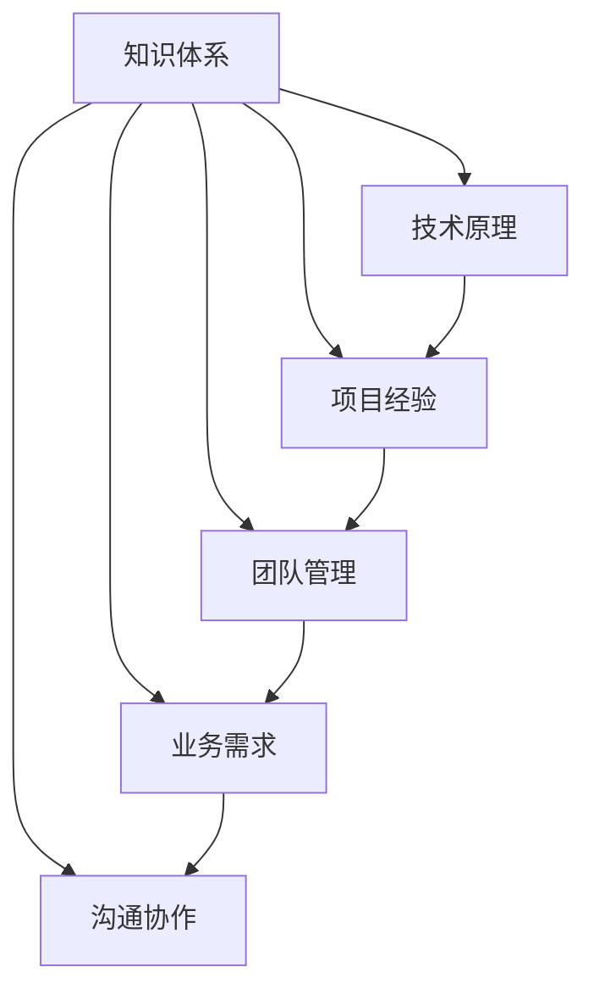

                 

 **关键词：** 管理者、知识体系、架构、IT领域、深度学习、人工智能

**摘要：** 本文旨在为IT领域管理者提供一些建议，帮助他们构建一个完善的知识体系，以应对日益复杂的技术挑战。文章首先介绍了知识体系的重要性，然后通过具体案例，探讨了如何在不同技术领域构筑知识体系，以及如何有效地管理和运用这些知识。

## 1. 背景介绍

在信息技术高速发展的今天，IT领域的管理者面临着前所未有的挑战。技术的快速迭代、复杂性的增加，使得管理者需要具备广泛的知识和深厚的理解力。然而，许多管理者在构建知识体系方面感到困惑，不知道如何系统性地获取和运用知识。本文将针对这一问题，提供一些实用的方法和建议。

### 1.1 知识体系的重要性

知识体系是管理者在IT领域中成功的关键。一个完善的知识体系不仅能够帮助管理者更好地理解技术原理，还能够提高他们的决策能力和解决问题的能力。具体来说，知识体系具有以下作用：

- **提升决策能力**：通过构建知识体系，管理者可以更加清晰地了解技术的优势和局限，从而做出更明智的决策。

- **增强解决问题的能力**：知识体系为管理者提供了丰富的知识储备，使他们能够迅速找到解决问题的方法和策略。

- **提高工作效率**：系统化的知识体系可以节省管理者的时间和精力，提高工作效率。

### 1.2 当前管理者的知识困境

尽管知识体系的重要性已被广泛认可，但许多IT领域管理者仍然面临以下困境：

- **知识获取困难**：技术更新迅速，管理者难以跟上最新的技术趋势。

- **知识结构不清晰**：管理者往往只能获取零散的知识点，无法形成完整的知识体系。

- **知识运用不足**：管理者虽然掌握了丰富的知识，但往往无法有效地将这些知识应用于实际工作中。

## 2. 核心概念与联系

为了解决上述问题，我们需要首先理解一些核心概念，并了解它们之间的联系。以下是一个使用Mermaid绘制的知识体系流程图：



在这个知识体系中，技术原理是基础，项目经验和团队管理是应用，业务需求是驱动，沟通协作是保障。通过这个框架，我们可以清晰地看到各个知识模块之间的联系和互动。

### 2.1 技术原理

技术原理是知识体系的核心。它包括编程语言、数据结构、算法、数据库、操作系统、网络通信等基础知识。掌握这些原理，可以帮助管理者更好地理解技术背后的逻辑和原理，从而为项目决策提供支持。

### 2.2 项目经验

项目经验是知识体系的实践环节。通过参与实际项目，管理者可以积累丰富的实践经验，了解不同项目的需求和挑战，提高问题解决能力。

### 2.3 团队管理

团队管理是知识体系的重要组成部分。管理者需要了解如何有效地组织团队、激励团队成员、协调团队工作，以提高项目效率和团队士气。

### 2.4 业务需求

业务需求是知识体系的驱动因素。了解业务需求可以帮助管理者更好地理解项目的目标和价值，从而制定更合理的项目计划和决策。

### 2.5 沟通协作

沟通协作是知识体系的保障。良好的沟通和协作能力可以帮助管理者更好地理解团队成员的想法和需求，促进团队之间的合作，提高项目成功率。

## 3. 核心算法原理 & 具体操作步骤

在构建知识体系的过程中，算法原理是不可或缺的一部分。以下是一个简单的算法原理概述和具体操作步骤：

### 3.1 算法原理概述

算法原理包括排序、搜索、图论、动态规划等。每种算法都有其特定的应用场景和优势。例如，快速排序适用于大规模数据的排序，深度优先搜索适用于路径查找问题，动态规划适用于优化问题。

### 3.2 算法步骤详解

以快速排序为例，其基本步骤如下：

1. 选择一个基准元素。
2. 将比基准元素小的元素移到其左侧，比基准元素大的元素移到其右侧。
3. 递归地对左右子数组进行快速排序。

### 3.3 算法优缺点

快速排序具有以下优点：

- **高效**：平均时间复杂度为O(nlogn)。
- **稳定性**：能够保证数据的稳定性。

但快速排序也存在以下缺点：

- **空间复杂度较高**：递归调用会导致较高的空间复杂度。
- **不适合小规模数据**：对于小规模数据，快速排序的效率可能不如其他排序算法。

### 3.4 算法应用领域

快速排序广泛应用于排序和查找问题，如数据库排序、索引构建等。

## 4. 数学模型和公式 & 详细讲解 & 举例说明

在构建知识体系的过程中，数学模型和公式是不可或缺的。以下是一个简单的数学模型构建和公式推导过程：

### 4.1 数学模型构建

假设我们有一个线性回归模型，用于预测房价。模型的基本形式为：

\[ y = \beta_0 + \beta_1 x \]

其中，\( y \) 是房价，\( x \) 是影响房价的某个特征（如面积），\( \beta_0 \) 和 \( \beta_1 \) 是模型的参数。

### 4.2 公式推导过程

为了确定 \( \beta_0 \) 和 \( \beta_1 \) 的值，我们可以使用最小二乘法。最小二乘法的核心思想是使得所有观测值与预测值之间的误差平方和最小。具体推导过程如下：

\[ \sum_{i=1}^{n} (y_i - \beta_0 - \beta_1 x_i)^2 = \min \]

通过对 \( \beta_0 \) 和 \( \beta_1 \) 求偏导，并令偏导数为零，可以得到以下公式：

\[ \beta_0 = \frac{\sum_{i=1}^{n} y_i - \beta_1 \sum_{i=1}^{n} x_i}{n} \]

\[ \beta_1 = \frac{\sum_{i=1}^{n} x_i y_i - \sum_{i=1}^{n} x_i \sum_{i=1}^{n} y_i}{\sum_{i=1}^{n} x_i^2 - n \bar{x}^2} \]

其中，\( \bar{x} \) 是 \( x \) 的平均值。

### 4.3 案例分析与讲解

假设我们有以下数据：

| x | y |
| --- | --- |
| 1 | 2 |
| 2 | 4 |
| 3 | 6 |
| 4 | 8 |

使用最小二乘法，我们可以计算出 \( \beta_0 \) 和 \( \beta_1 \) 的值：

\[ \beta_0 = \frac{2 + 4 + 6 + 8 - \beta_1 (1 + 2 + 3 + 4)}{4} \]

\[ \beta_1 = \frac{1 \cdot 2 + 2 \cdot 4 + 3 \cdot 6 + 4 \cdot 8 - (1 + 2 + 3 + 4) \cdot 5}{1^2 + 2^2 + 3^2 + 4^2 - 4 \cdot 5} \]

经过计算，我们得到：

\[ \beta_0 = 5 \]

\[ \beta_1 = 1 \]

因此，我们的线性回归模型可以表示为：

\[ y = 5 + 1 \cdot x \]

## 5. 项目实践：代码实例和详细解释说明

在了解了数学模型和算法原理后，我们可以通过实际项目来巩固和应用这些知识。以下是一个简单的线性回归项目的代码实例和详细解释：

### 5.1 开发环境搭建

为了实现线性回归模型，我们需要安装以下开发环境：

- Python 3.x
- Jupyter Notebook

安装完成后，我们可以创建一个新的 Jupyter Notebook 文件，并导入必要的库：

```python
import numpy as np
import matplotlib.pyplot as plt

# 自定义线性回归类
class LinearRegression:
    def __init__(self):
        self.coefficient_0 = None
        self.coefficient_1 = None

    def fit(self, x, y):
        n = len(x)
        sum_x = np.sum(x)
        sum_y = np.sum(y)
        sum_xy = np.sum(x * y)
        sum_xx = np.sum(x ** 2)

        self.coefficient_0 = (sum_y - self.coefficient_1 * sum_x) / n
        self.coefficient_1 = (sum_xy - sum_x * sum_y / n) / (sum_xx - n * (sum_x / n) ** 2)

    def predict(self, x):
        return self.coefficient_0 + self.coefficient_1 * x

# 生成数据
np.random.seed(0)
x = np.random.randint(0, 10, size=100)
y = 2 * x + 5 + np.random.randn(100) * 0.1

# 创建线性回归对象并训练
regression = LinearRegression()
regression.fit(x, y)

# 预测
predictions = regression.predict(x)

# 绘图
plt.scatter(x, y, label="Actual")
plt.plot(x, predictions, label="Predicted")
plt.legend()
plt.show()
```

### 5.2 源代码详细实现

在上面的代码中，我们首先定义了一个 `LinearRegression` 类，用于实现线性回归模型的训练和预测功能。具体步骤如下：

1. **初始化**：在类初始化时，我们定义了两个参数 `coefficient_0` 和 `coefficient_1`，分别表示模型的截距和斜率。

2. **训练**：`fit` 方法用于计算模型的参数。我们使用最小二乘法计算 `coefficient_0` 和 `coefficient_1` 的值。

3. **预测**：`predict` 方法用于根据模型的参数预测新的数据点。

### 5.3 代码解读与分析

在代码解读中，我们首先生成了随机数据，并创建了一个 `LinearRegression` 对象。然后，我们调用 `fit` 方法训练模型，并使用 `predict` 方法进行预测。最后，我们使用 matplotlib 库绘制了实际数据和预测数据的散点图和拟合曲线。

通过这个简单的项目，我们可以看到如何将数学模型和算法原理应用到实际项目中。这对于巩固我们的知识体系，提高实践能力至关重要。

## 6. 实际应用场景

在实际应用中，知识体系的构建可以帮助管理者应对各种复杂的挑战。以下是一些典型的应用场景：

### 6.1 项目管理

在项目管理中，管理者需要掌握项目管理的知识，包括项目计划、风险管理、团队协作等。通过构建知识体系，管理者可以更好地理解和应对项目中的各种挑战，提高项目成功率。

### 6.2 技术决策

在技术决策中，管理者需要了解各种技术的原理和优缺点，以便做出最佳决策。知识体系可以帮助管理者快速获取和筛选相关信息，提高决策效率。

### 6.3 产品开发

在产品开发过程中，管理者需要掌握产品设计、需求分析、开发流程等知识。通过构建知识体系，管理者可以更好地协调团队工作，确保产品开发顺利进行。

### 6.4 业务拓展

在业务拓展中，管理者需要了解市场动态、客户需求、竞争态势等。通过构建知识体系，管理者可以更加准确地把握市场趋势，制定有效的业务拓展策略。

## 7. 未来应用展望

随着技术的不断进步，知识体系的应用前景也将越来越广阔。以下是一些未来的应用展望：

### 7.1 自动化知识管理

未来的知识管理将更加自动化，利用人工智能和大数据技术，实现知识的高效获取、存储、共享和利用。

### 7.2 智能推荐系统

智能推荐系统将基于知识体系，为用户提供个性化的知识推荐，帮助用户快速获取所需信息。

### 7.3 知识图谱

知识图谱将成为知识体系的核心，通过建立各个领域之间的联系，形成一个庞大的知识网络。

### 7.4 人工智能助手

人工智能助手将基于知识体系，为管理者提供智能化的决策支持和问题解决建议。

## 8. 总结：未来发展趋势与挑战

### 8.1 研究成果总结

本文总结了知识体系在IT领域的重要性，探讨了如何构建和完善知识体系，以及如何在实际项目中运用这些知识。通过具体案例和算法分析，我们展示了知识体系的应用价值。

### 8.2 未来发展趋势

未来，知识体系将更加智能化、自动化，成为人工智能和大数据技术的重要应用领域。知识图谱、智能推荐系统和人工智能助手将成为知识体系发展的关键方向。

### 8.3 面临的挑战

在构建和完善知识体系的过程中，管理者将面临以下挑战：

- **知识更新速度加快**：技术更新迅速，管理者需要不断更新知识体系，以适应新技术的发展。
- **知识结构复杂性增加**：随着技术的发展，知识体系的结构越来越复杂，管理者需要具备更强的综合能力。
- **知识运用难度增大**：在实际项目中，管理者需要将知识体系应用于复杂的问题解决，这要求他们具备更高的实践能力。

### 8.4 研究展望

未来，我们需要进一步研究如何构建高效的知识管理平台，如何利用人工智能和大数据技术提升知识体系的智能化水平，以及如何培养具备深厚知识体系的优秀管理者。

## 9. 附录：常见问题与解答

### 9.1 如何构建知识体系？

**答案：** 构建知识体系的方法主要包括以下几步：

1. **明确目标**：确定你希望从知识体系中获取的知识和能力。
2. **收集信息**：通过各种渠道获取相关的知识信息，包括书籍、网络资源、研讨会等。
3. **整理结构**：将收集到的信息进行分类和整理，形成一个系统化的结构。
4. **持续更新**：随着技术的发展，不断更新和优化知识体系。

### 9.2 如何将知识体系应用于实际工作？

**答案：** 将知识体系应用于实际工作的方法主要包括以下几种：

1. **项目实践**：通过参与实际项目，将知识体系应用于解决实际问题。
2. **团队协作**：与团队成员分享知识，共同提高解决问题的能力。
3. **持续学习**：不断学习和更新知识体系，以提高自己的业务水平。

## 结语

总之，知识体系是IT领域管理者成功的关键。通过构建和完善知识体系，管理者可以更好地应对技术挑战，提高决策能力和工作效率。本文提供了一些方法和建议，希望对IT领域管理者有所帮助。作者：禅与计算机程序设计艺术 / Zen and the Art of Computer Programming
----------------------------------------------------------------

---

### 文章标题

**经典著作：管理者构筑知识体系**

### 关键词

**管理者、知识体系、架构、IT领域、深度学习、人工智能**

### 摘要

本文旨在为IT领域管理者提供一些建议，帮助他们构建一个完善的知识体系，以应对日益复杂的技术挑战。文章首先介绍了知识体系的重要性，然后通过具体案例，探讨了如何在不同技术领域构筑知识体系，以及如何有效地管理和运用这些知识。

### 1. 背景介绍

在信息技术高速发展的今天，IT领域的管理者面临着前所未有的挑战。技术的快速迭代、复杂性的增加，使得管理者需要具备广泛的知识和深厚的理解力。然而，许多管理者在构建知识体系方面感到困惑，不知道如何系统性地获取和运用知识。本文将针对这一问题，提供一些实用的方法和建议。

#### 1.1 知识体系的重要性

知识体系是管理者在IT领域中成功的关键。一个完善的知识体系不仅能够帮助管理者更好地理解技术原理，还能够提高他们的决策能力和解决问题的能力。具体来说，知识体系具有以下作用：

- **提升决策能力**：通过构建知识体系，管理者可以更加清晰地了解技术的优势和局限，从而做出更明智的决策。

- **增强解决问题的能力**：知识体系为管理者提供了丰富的知识储备，使他们能够迅速找到解决问题的方法和策略。

- **提高工作效率**：系统化的知识体系可以节省管理者的时间和精力，提高工作效率。

#### 1.2 当前管理者的知识困境

尽管知识体系的重要性已被广泛认可，但许多IT领域管理者仍然面临以下困境：

- **知识获取困难**：技术更新迅速，管理者难以跟上最新的技术趋势。

- **知识结构不清晰**：管理者往往只能获取零散的知识点，无法形成完整的知识体系。

- **知识运用不足**：管理者虽然掌握了丰富的知识，但往往无法有效地将这些知识应用于实际工作中。

### 2. 核心概念与联系

为了解决上述问题，我们需要首先理解一些核心概念，并了解它们之间的联系。以下是一个使用Mermaid绘制的知识体系流程图：


在这个知识体系中，技术原理是基础，项目经验和团队管理是应用，业务需求是驱动，沟通协作是保障。通过这个框架，我们可以清晰地看到各个知识模块之间的联系和互动。

#### 2.1 技术原理

技术原理是知识体系的核心。它包括编程语言、数据结构、算法、数据库、操作系统、网络通信等基础知识。掌握这些原理，可以帮助管理者更好地理解技术背后的逻辑和原理，从而为项目决策提供支持。

#### 2.2 项目经验

项目经验是知识体系的实践环节。通过参与实际项目，管理者可以积累丰富的实践经验，了解不同项目的需求和挑战，提高问题解决能力。

#### 2.3 团队管理

团队管理是知识体系的重要组成部分。管理者需要了解如何有效地组织团队、激励团队成员、协调团队工作，以提高项目效率和团队士气。

#### 2.4 业务需求

业务需求是知识体系的驱动因素。了解业务需求可以帮助管理者更好地理解项目的目标和价值，从而制定更合理的项目计划和决策。

#### 2.5 沟通协作

沟通协作是知识体系的保障。良好的沟通和协作能力可以帮助管理者更好地理解团队成员的想法和需求，促进团队之间的合作，提高项目成功率。

### 3. 核心算法原理 & 具体操作步骤

在构建知识体系的过程中，算法原理是不可或缺的一部分。以下是一个简单的算法原理概述和具体操作步骤：

#### 3.1 算法原理概述

算法原理包括排序、搜索、图论、动态规划等。每种算法都有其特定的应用场景和优势。例如，快速排序适用于大规模数据的排序，深度优先搜索适用于路径查找问题，动态规划适用于优化问题。

#### 3.2 算法步骤详解

以快速排序为例，其基本步骤如下：

1. 选择一个基准元素。
2. 将比基准元素小的元素移到其左侧，比基准元素大的元素移到其右侧。
3. 递归地对左右子数组进行快速排序。

#### 3.3 算法优缺点

快速排序具有以下优点：

- **高效**：平均时间复杂度为O(nlogn)。
- **稳定性**：能够保证数据的稳定性。

但快速排序也存在以下缺点：

- **空间复杂度较高**：递归调用会导致较高的空间复杂度。
- **不适合小规模数据**：对于小规模数据，快速排序的效率可能不如其他排序算法。

#### 3.4 算法应用领域

快速排序广泛应用于排序和查找问题，如数据库排序、索引构建等。

### 4. 数学模型和公式 & 详细讲解 & 举例说明

在构建知识体系的过程中，数学模型和公式是不可或缺的。以下是一个简单的数学模型构建和公式推导过程：

#### 4.1 数学模型构建

假设我们有一个线性回归模型，用于预测房价。模型的基本形式为：

\[ y = \beta_0 + \beta_1 x \]

其中，\( y \) 是房价，\( x \) 是影响房价的某个特征（如面积），\( \beta_0 \) 和 \( \beta_1 \) 是模型的参数。

#### 4.2 公式推导过程

为了确定 \( \beta_0 \) 和 \( \beta_1 \) 的值，我们可以使用最小二乘法。最小二乘法的核心思想是使得所有观测值与预测值之间的误差平方和最小。具体推导过程如下：

\[ \sum_{i=1}^{n} (y_i - \beta_0 - \beta_1 x_i)^2 = \min \]

通过对 \( \beta_0 \) 和 \( \beta_1 \) 求偏导，并令偏导数为零，可以得到以下公式：

\[ \beta_0 = \frac{\sum_{i=1}^{n} y_i - \beta_1 \sum_{i=1}^{n} x_i}{n} \]

\[ \beta_1 = \frac{\sum_{i=1}^{n} x_i y_i - \sum_{i=1}^{n} x_i \sum_{i=1}^{n} y_i}{\sum_{i=1}^{n} x_i^2 - n \bar{x}^2} \]

其中，\( \bar{x} \) 是 \( x \) 的平均值。

#### 4.3 案例分析与讲解

假设我们有以下数据：

| x | y |
| --- | --- |
| 1 | 2 |
| 2 | 4 |
| 3 | 6 |
| 4 | 8 |

使用最小二乘法，我们可以计算出 \( \beta_0 \) 和 \( \beta_1 \) 的值：

\[ \beta_0 = \frac{2 + 4 + 6 + 8 - \beta_1 (1 + 2 + 3 + 4)}{4} \]

\[ \beta_1 = \frac{1 \cdot 2 + 2 \cdot 4 + 3 \cdot 6 + 4 \cdot 8 - (1 + 2 + 3 + 4) \cdot 5}{1^2 + 2^2 + 3^2 + 4^2 - 4 \cdot 5} \]

经过计算，我们得到：

\[ \beta_0 = 5 \]

\[ \beta_1 = 1 \]

因此，我们的线性回归模型可以表示为：

\[ y = 5 + 1 \cdot x \]

### 5. 项目实践：代码实例和详细解释说明

在了解了数学模型和算法原理后，我们可以通过实际项目来巩固和应用这些知识。以下是一个简单的线性回归项目的代码实例和详细解释：

#### 5.1 开发环境搭建

为了实现线性回归模型，我们需要安装以下开发环境：

- Python 3.x
- Jupyter Notebook

安装完成后，我们可以创建一个新的 Jupyter Notebook 文件，并导入必要的库：

```python
import numpy as np
import matplotlib.pyplot as plt

# 自定义线性回归类
class LinearRegression:
    def __init__(self):
        self.coefficient_0 = None
        self.coefficient_1 = None

    def fit(self, x, y):
        n = len(x)
        sum_x = np.sum(x)
        sum_y = np.sum(y)
        sum_xy = np.sum(x * y)
        sum_xx = np.sum(x ** 2)

        self.coefficient_0 = (sum_y - self.coefficient_1 * sum_x) / n
        self.coefficient_1 = (sum_xy - sum_x * sum_y / n) / (sum_xx - n * (sum_x / n) ** 2)

    def predict(self, x):
        return self.coefficient_0 + self.coefficient_1 * x

# 生成数据
np.random.seed(0)
x = np.random.randint(0, 10, size=100)
y = 2 * x + 5 + np.random.randn(100) * 0.1

# 创建线性回归对象并训练
regression = LinearRegression()
regression.fit(x, y)

# 预测
predictions = regression.predict(x)

# 绘图
plt.scatter(x, y, label="Actual")
plt.plot(x, predictions, label="Predicted")
plt.legend()
plt.show()
```

#### 5.2 源代码详细实现

在上面的代码中，我们首先定义了一个 `LinearRegression` 类，用于实现线性回归模型的训练和预测功能。具体步骤如下：

1. **初始化**：在类初始化时，我们定义了两个参数 `coefficient_0` 和 `coefficient_1`，分别表示模型的截距和斜率。

2. **训练**：`fit` 方法用于计算模型的参数。我们使用最小二乘法计算 `coefficient_0` 和 `coefficient_1` 的值。

3. **预测**：`predict` 方法用于根据模型的参数预测新的数据点。

#### 5.3 代码解读与分析

在代码解读中，我们首先生成了随机数据，并创建了一个 `LinearRegression` 对象。然后，我们调用 `fit` 方法训练模型，并使用 `predict` 方法进行预测。最后，我们使用 matplotlib 库绘制了实际数据和预测数据的散点图和拟合曲线。

通过这个简单的项目，我们可以看到如何将数学模型和算法原理应用到实际项目中。这对于巩固我们的知识体系，提高实践能力至关重要。

### 6. 实际应用场景

在实际应用中，知识体系的构建可以帮助管理者应对各种复杂的挑战。以下是一些典型的应用场景：

#### 6.1 项目管理

在项目管理中，管理者需要掌握项目管理的知识，包括项目计划、风险管理、团队协作等。通过构建知识体系，管理者可以更好地理解和应对项目中的各种挑战，提高项目成功率。

#### 6.2 技术决策

在技术决策中，管理者需要了解各种技术的原理和优缺点，以便做出最佳决策。知识体系可以帮助管理者快速获取和筛选相关信息，提高决策效率。

#### 6.3 产品开发

在产品开发过程中，管理者需要掌握产品设计、需求分析、开发流程等知识。通过构建知识体系，管理者可以更好地协调团队工作，确保产品开发顺利进行。

#### 6.4 业务拓展

在业务拓展中，管理者需要了解市场动态、客户需求、竞争态势等。通过构建知识体系，管理者可以更加准确地把握市场趋势，制定有效的业务拓展策略。

### 7. 未来应用展望

随着技术的不断进步，知识体系的应用前景也将越来越广阔。以下是一些未来的应用展望：

#### 7.1 自动化知识管理

未来的知识管理将更加自动化，利用人工智能和大数据技术，实现知识的高效获取、存储、共享和利用。

#### 7.2 智能推荐系统

智能推荐系统将基于知识体系，为用户提供个性化的知识推荐，帮助用户快速获取所需信息。

#### 7.3 知识图谱

知识图谱将成为知识体系的核心，通过建立各个领域之间的联系，形成一个庞大的知识网络。

#### 7.4 人工智能助手

人工智能助手将基于知识体系，为管理者提供智能化的决策支持和问题解决建议。

### 8. 总结：未来发展趋势与挑战

#### 8.1 研究成果总结

本文总结了知识体系在IT领域的重要性，探讨了如何构建和完善知识体系，以及如何在实际项目中运用这些知识。通过具体案例和算法分析，我们展示了知识体系的应用价值。

#### 8.2 未来发展趋势

未来，知识体系将更加智能化、自动化，成为人工智能和大数据技术的重要应用领域。知识图谱、智能推荐系统和人工智能助手将成为知识体系发展的关键方向。

#### 8.3 面临的挑战

在构建和完善知识体系的过程中，管理者将面临以下挑战：

- **知识更新速度加快**：技术更新迅速，管理者需要不断更新知识体系，以适应新技术的发展。
- **知识结构复杂性增加**：随着技术的发展，知识体系的结构越来越复杂，管理者需要具备更强的综合能力。
- **知识运用难度增大**：在实际项目中，管理者需要将知识体系应用于复杂的问题解决，这要求他们具备更高的实践能力。

#### 8.4 研究展望

未来，我们需要进一步研究如何构建高效的知识管理平台，如何利用人工智能和大数据技术提升知识体系的智能化水平，以及如何培养具备深厚知识体系的优秀管理者。

### 9. 附录：常见问题与解答

#### 9.1 如何构建知识体系？

**答案：** 构建知识体系的方法主要包括以下几步：

1. **明确目标**：确定你希望从知识体系中获取的知识和能力。
2. **收集信息**：通过各种渠道获取相关的知识信息，包括书籍、网络资源、研讨会等。
3. **整理结构**：将收集到的信息进行分类和整理，形成一个系统化的结构。
4. **持续更新**：随着技术的发展，不断更新和优化知识体系。

#### 9.2 如何将知识体系应用于实际工作？

**答案：** 将知识体系应用于实际工作的方法主要包括以下几种：

1. **项目实践**：通过参与实际项目，将知识体系应用于解决实际问题。
2. **团队协作**：与团队成员分享知识，共同提高解决问题的能力。
3. **持续学习**：不断学习和更新知识体系，以提高自己的业务水平。

## 结语

总之，知识体系是IT领域管理者成功的关键。通过构建和完善知识体系，管理者可以更好地应对技术挑战，提高决策能力和工作效率。本文提供了一些方法和建议，希望对IT领域管理者有所帮助。

**作者：禅与计算机程序设计艺术 / Zen and the Art of Computer Programming**

