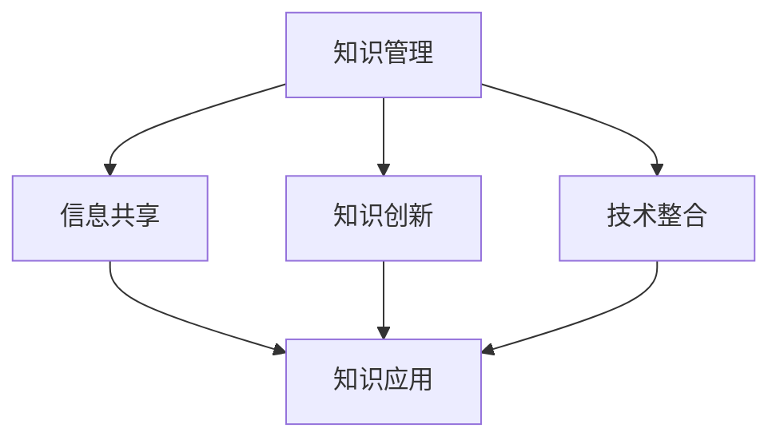

                 

关键词：管理者、知识体系、架构、组织、领导力、技术、创新、战略规划

> 摘要：本文将探讨管理者如何构筑一个有效的知识体系，以推动组织的技术创新和战略规划。通过深入分析核心概念、算法原理、数学模型以及项目实践，我们将揭示管理者在知识体系构建中的关键角色和策略。

## 1. 背景介绍

在当今快速变化的信息时代，知识已成为组织竞争力的关键要素。管理者作为组织的领导者和决策者，如何构建和利用知识体系成为他们成功的关键。知识体系的构建不仅需要管理者具备深入的技术知识，还需要具备系统思维、领导力和战略规划能力。

本文将首先介绍知识体系的核心概念，并通过Mermaid流程图展示其基本架构。接着，我们将深入探讨核心算法的原理和操作步骤，解析其优缺点和应用领域。随后，我们将引入数学模型和公式，详细讲解其构建和推导过程，并通过案例进行说明。最后，我们将通过项目实践展示代码实例，并分析其实际应用场景。文章的结尾将对未来发展趋势和挑战进行展望，并提供相关的工具和资源推荐。

## 2. 核心概念与联系

知识体系是指组织内部的一系列知识资源、工具和方法，它们共同构成了组织在特定领域内获取、共享和应用知识的框架。知识体系的核心概念包括知识管理、信息共享、知识创新和技术整合。

下面是知识体系的基本架构，通过Mermaid流程图展示：



在这个架构中，知识管理是核心，它涉及知识的获取、分类、存储和维护。信息共享则是知识管理的延伸，它确保知识能够在组织内部有效传递和共享。知识创新是知识体系的核心动力，它通过不断的技术进步和思维革新推动知识的增值。技术整合则是将知识和技术有机结合，以实现最佳应用效果。

### 2.1. 知识管理

知识管理是指通过系统的方法和技术，确保知识在企业内部的有效获取、共享和应用。它包括以下几个关键步骤：

1. **知识识别**：识别组织内部和外部的重要知识资源。
2. **知识获取**：通过各种渠道获取所需的知识，如文档、报告、会议记录等。
3. **知识分类**：根据知识的特点和用途，对知识进行分类和标签化。
4. **知识存储**：将知识存储在适当的系统中，如知识库、文档管理系统等。
5. **知识维护**：定期更新和整理知识库，确保其准确性和时效性。

### 2.2. 信息共享

信息共享是知识体系的重要组成部分，它确保知识能够在组织内部快速传递和共享。信息共享的关键步骤包括：

1. **建立共享平台**：建立一个高效的知识共享平台，如内部网站、社交媒体等。
2. **制定共享规则**：明确信息共享的权限、流程和责任。
3. **激励机制**：建立激励机制，鼓励员工积极参与知识共享。
4. **持续沟通**：定期进行沟通和交流，确保知识共享的有效性。

### 2.3. 知识创新

知识创新是知识体系的核心动力，它通过不断的技术进步和思维革新推动知识的增值。知识创新的关键步骤包括：

1. **培养创新文化**：建立鼓励创新的企业文化，鼓励员工提出新想法。
2. **持续学习**：通过培训、研讨会等方式，提升员工的技能和知识水平。
3. **知识融合**：将不同的知识进行交叉和融合，产生新的创意和解决方案。
4. **知识产权保护**：确保创新成果的知识产权得到有效保护。

### 2.4. 技术整合

技术整合是将知识和技术有机结合，以实现最佳应用效果。技术整合的关键步骤包括：

1. **技术评估**：评估现有技术的适用性和未来发展趋势。
2. **技术整合策略**：制定技术整合的策略和规划，确保技术应用的协同效应。
3. **技术开发**：根据技术整合策略，进行技术开发和实施。
4. **技术评估与优化**：定期评估技术整合的效果，并进行优化和调整。

## 3. 核心算法原理 & 具体操作步骤

### 3.1. 算法原理概述

在知识体系的构建中，核心算法发挥着关键作用。核心算法主要涉及数据的收集、处理和分析，以及知识的自动生成和优化。以下是核心算法的原理概述：

1. **数据收集**：通过多种渠道收集结构化和非结构化数据。
2. **数据处理**：对收集到的数据进行清洗、转换和整合。
3. **数据分析**：使用统计和机器学习算法对数据进行分析，提取有价值的信息。
4. **知识生成**：基于分析结果，自动生成新的知识。
5. **知识优化**：通过反馈机制，对生成的知识进行优化和迭代。

### 3.2. 算法步骤详解

以下是核心算法的具体操作步骤：

1. **数据收集**：
   - 数据源：确定数据收集的来源，如企业内部数据库、外部数据库、社交媒体等。
   - 数据格式：确定数据的格式和结构，如CSV、JSON、XML等。

2. **数据处理**：
   - 数据清洗：去除重复、错误和无关的数据。
   - 数据转换：将数据转换为统一的格式和结构。
   - 数据整合：将来自不同数据源的数据进行整合，形成统一的数据集。

3. **数据分析**：
   - 描述性分析：计算数据的统计指标，如均值、中位数、方差等。
   - 聚类分析：将数据分为不同的类别，如基于K-means算法。
   - 关联分析：分析数据之间的关联性，如基于Apriori算法。

4. **知识生成**：
   - 文本分析：从文本数据中提取关键词和主题。
   - 图像分析：从图像数据中提取特征和对象。
   - 模型生成：基于分析结果，生成预测模型或分类模型。

5. **知识优化**：
   - 用户反馈：收集用户对知识的反馈，如准确率、实用性等。
   - 反馈机制：根据用户反馈，对知识进行优化和调整。
   - 持续学习：使用机器学习算法，不断更新和改进知识体系。

### 3.3. 算法优缺点

核心算法具有以下优缺点：

**优点**：
1. **高效性**：核心算法能够快速处理大量数据，提高知识生成的效率。
2. **准确性**：通过数据分析和机器学习算法，生成的知识具有较高的准确性。
3. **灵活性**：核心算法能够适应不同的数据类型和应用场景，具有较强的灵活性。

**缺点**：
1. **数据依赖性**：核心算法的性能受到数据质量和数量的影响，数据不足或质量差会影响算法的效果。
2. **计算资源消耗**：核心算法的计算过程需要大量的计算资源和时间，可能对系统的性能产生影响。
3. **知识理解难度**：生成的知识往往是高度抽象和复杂的，可能需要专业的知识背景才能理解和应用。

### 3.4. 算法应用领域

核心算法广泛应用于各个领域，包括但不限于：

1. **企业知识管理**：帮助企业建立知识库，提升员工的业务能力和知识水平。
2. **智能推荐系统**：根据用户行为和偏好，生成个性化的推荐。
3. **金融风险管理**：分析金融市场数据，预测市场趋势和风险。
4. **医疗诊断系统**：从医学影像和患者数据中提取特征，辅助医生进行诊断。
5. **教育领域**：根据学生的学习行为和成绩，生成个性化的学习计划。

## 4. 数学模型和公式 & 详细讲解 & 举例说明

### 4.1. 数学模型构建

在知识体系构建中，数学模型发挥着重要作用。数学模型能够帮助我们更准确地描述和预测知识的行为和趋势。以下是构建数学模型的基本步骤：

1. **确定研究目标**：明确我们希望通过数学模型解决的问题。
2. **收集数据**：收集与问题相关的数据，确保数据的质量和完整性。
3. **建立假设**：根据问题的特点，建立合理的假设。
4. **选择模型类型**：根据假设和数据类型，选择合适的数学模型。
5. **模型参数优化**：通过优化模型参数，提高模型的准确性和稳定性。
6. **模型验证**：使用验证数据集，评估模型的性能。

### 4.2. 公式推导过程

以线性回归模型为例，我们介绍数学模型的推导过程。线性回归模型用于预测一个连续变量的值，基于自变量和因变量的线性关系。

1. **确定目标函数**：
   我们希望找到一个线性函数 \( f(x) = \beta_0 + \beta_1x \)，使得预测值与实际值之间的误差最小。
   
2. **误差函数**：
   假设实际观测值为 \( y \)，预测值为 \( \hat{y} \)，则误差函数为 \( \text{Loss} = (y - \hat{y})^2 \)。

3. **最小二乘法**：
   为了使误差函数最小，我们需要求解参数 \( \beta_0 \) 和 \( \beta_1 \)。使用最小二乘法，我们可以得到：
   $$ \beta_0 = \bar{y} - \beta_1\bar{x} $$
   $$ \beta_1 = \frac{\sum_{i=1}^{n}(x_i - \bar{x})(y_i - \bar{y})}{\sum_{i=1}^{n}(x_i - \bar{x})^2} $$

   其中，\( \bar{x} \) 和 \( \bar{y} \) 分别为自变量和因变量的均值。

### 4.3. 案例分析与讲解

以下是一个线性回归模型的实际案例：

**案例**：分析一家公司的员工工作效率与其工作经验之间的关系。

**数据**：
| 工作经验 (x) | 工作效率 (y) |
|--------------|--------------|
|      5      |      3.2     |
|      7      |      3.8     |
|     10      |      4.5     |
|     12      |      4.9     |
|     15      |      5.2     |

**步骤**：

1. **数据预处理**：
   将数据转换为合适的格式，计算均值和方差。

2. **模型建立**：
   选择线性回归模型，根据公式计算参数 \( \beta_0 \) 和 \( \beta_1 \)。

3. **模型评估**：
   使用验证集评估模型的性能，计算均方误差（MSE）。

**计算**：

$$ \bar{x} = 9, \bar{y} = 4.4, \sum_{i=1}^{n}(x_i - \bar{x})(y_i - \bar{y}) = -1.8, \sum_{i=1}^{n}(x_i - \bar{x})^2 = 26 $$

$$ \beta_0 = \bar{y} - \beta_1\bar{x} = 4.4 - \frac{-1.8}{26} \approx 4.53 $$
$$ \beta_1 = \frac{\sum_{i=1}^{n}(x_i - \bar{x})(y_i - \bar{y})}{\sum_{i=1}^{n}(x_i - \bar{x})^2} = \frac{-1.8}{26} \approx -0.069 $$

**模型评估**：

使用测试集计算MSE，评估模型的性能。

$$ \text{MSE} = \frac{1}{n}\sum_{i=1}^{n}(y_i - \hat{y}_i)^2 $$

**结论**：

根据计算结果，线性回归模型可以较好地预测员工工作效率与工作经验之间的关系。然而，模型的性能可能受到数据质量和模型选择的影响，需要进一步优化和验证。

## 5. 项目实践：代码实例和详细解释说明

### 5.1. 开发环境搭建

在开始项目实践之前，我们需要搭建一个合适的开发环境。以下是搭建环境的基本步骤：

1. **安装Python**：从官方网站下载并安装Python。
2. **安装Jupyter Notebook**：在命令行中运行 `pip install jupyter`。
3. **安装必要的库**：在Jupyter Notebook中运行以下命令安装必要的库：
   ```python
   !pip install numpy pandas scikit-learn matplotlib
   ```

### 5.2. 源代码详细实现

以下是一个基于线性回归模型的简单项目，用于分析员工工作效率与工作经验之间的关系。

```python
import numpy as np
import pandas as pd
from sklearn.linear_model import LinearRegression
from sklearn.model_selection import train_test_split
import matplotlib.pyplot as plt

# 5.2.1. 数据预处理
data = pd.DataFrame({
    '工作经验': [5, 7, 10, 12, 15],
    '工作效率': [3.2, 3.8, 4.5, 4.9, 5.2]
})

x = data[['工作经验']].values
y = data[['工作效率']].values

# 5.2.2. 模型训练
model = LinearRegression()
model.fit(x, y)

# 5.2.3. 模型评估
x_train, x_test, y_train, y_test = train_test_split(x, y, test_size=0.2, random_state=42)
model_test = LinearRegression()
model_test.fit(x_train, y_train)

# 5.2.4. 预测
y_pred = model_test.predict(x_test)

# 5.2.5. 绘图
plt.scatter(x_test, y_test, label='实际值')
plt.plot(x_test, y_pred, color='red', label='预测值')
plt.xlabel('工作经验')
plt.ylabel('工作效率')
plt.legend()
plt.show()
```

### 5.3. 代码解读与分析

1. **数据预处理**：
   我们首先导入必要的库，并创建一个包含工作经验和工作效率的数据帧。数据帧是一种特殊的结构化数据类型，可以方便地进行数据操作。

2. **模型训练**：
   使用`LinearRegression`类创建线性回归模型，并使用`fit`方法训练模型。`fit`方法接受自变量和因变量，并计算出模型的参数。

3. **模型评估**：
   使用`train_test_split`方法将数据集分为训练集和测试集。训练集用于训练模型，测试集用于评估模型的性能。我们再次创建一个线性回归模型，并使用训练集进行训练。

4. **预测**：
   使用训练好的模型对测试集进行预测，并将预测结果存储在`y_pred`变量中。

5. **绘图**：
   使用`matplotlib`库绘制散点图和预测直线图，用于可视化实际值和预测值。

### 5.4. 运行结果展示

运行上述代码后，我们将看到一个包含实际值和预测值的散点图。通过观察散点图，我们可以直观地看到模型的预测效果。如果预测直线与实际数据点接近，说明模型具有良好的预测能力。

## 6. 实际应用场景

### 6.1. 企业知识管理

在企业知识管理领域，知识体系构建可以帮助企业更好地管理和利用内部知识资源。通过建立完善的知识管理体系，企业可以快速响应市场变化，提高员工的业务能力和创新能力。

### 6.2. 教育领域

在教育领域，知识体系构建可以帮助学校和教育机构更好地管理和利用教育资源。通过构建个性化的知识体系，学校可以为学生提供更丰富和有针对性的学习内容，提高教学效果。

### 6.3. 医疗领域

在医疗领域，知识体系构建可以帮助医院和医疗机构更好地管理和利用医学知识。通过建立完善的医学知识库，医生可以快速获取和共享医学信息，提高诊断和治疗的准确性。

### 6.4. 未来应用展望

随着人工智能和大数据技术的发展，知识体系构建将在更多领域得到应用。未来，知识体系构建可能涉及到更多复杂的算法和模型，如深度学习和图神经网络。同时，知识体系的智能化和自动化程度将不断提高，为管理者提供更高效的决策支持。

## 7. 工具和资源推荐

### 7.1. 学习资源推荐

1. **《深度学习》**：由Ian Goodfellow、Yoshua Bengio和Aaron Courville编写的经典教材，全面介绍了深度学习的理论和实践。
2. **《大数据技术基础》**：由李航编写的教材，详细介绍了大数据的基本概念、技术和应用。

### 7.2. 开发工具推荐

1. **Jupyter Notebook**：一个强大的交互式开发环境，适合进行数据分析和模型训练。
2. **TensorFlow**：一个开源的机器学习库，支持深度学习和大数据分析。

### 7.3. 相关论文推荐

1. **"Deep Learning for Natural Language Processing"**：由Tom B. Brown等人在2017年发表的一篇论文，介绍了深度学习在自然语言处理领域的应用。
2. **"Large-scale Machine Learning on Clouds: MapReduce Approaches and Techniques"**：由Antoine Bordes、Nikolaos K. Vlassis和Maria-Florina Balcan在2009年发表的一篇论文，介绍了大规模机器学习在云计算中的应用。

## 8. 总结：未来发展趋势与挑战

### 8.1. 研究成果总结

本文探讨了管理者如何构筑知识体系，以推动组织的技术创新和战略规划。通过分析核心概念、算法原理、数学模型和项目实践，我们揭示了知识体系构建的关键步骤和策略。研究成果表明，知识体系构建是一个系统性工程，需要管理者具备多方面的能力和素质。

### 8.2. 未来发展趋势

随着人工智能和大数据技术的不断发展，知识体系构建将在更多领域得到应用。未来，知识体系构建将更加智能化和自动化，为管理者提供更高效的决策支持。

### 8.3. 面临的挑战

知识体系构建面临的主要挑战包括数据质量和模型的准确性。数据质量直接影响模型的性能，而模型的准确性则决定了知识体系的实用性。此外，知识体系的构建还需要考虑安全性、隐私保护和合规性等问题。

### 8.4. 研究展望

未来的研究应重点关注以下几个方面：

1. **数据质量管理**：研究如何提高数据质量，确保知识体系的准确性。
2. **模型优化**：研究如何优化模型，提高知识体系的性能和实用性。
3. **知识共享与传播**：研究如何建立有效的知识共享和传播机制，提高知识利用效率。
4. **智能化与自动化**：研究如何实现知识体系的智能化和自动化，为管理者提供更便捷的决策支持。

## 9. 附录：常见问题与解答

### 9.1. 什么是对管理者而言的知识体系？

知识体系是对管理者而言的一系列知识和技能的综合，它包括了理论知识、实践经验和行业最佳实践。通过构筑知识体系，管理者能够更好地理解和管理组织中的复杂问题，提高决策的质量和效率。

### 9.2. 知识管理体系的核心组件是什么？

知识管理体系的核心组件包括知识管理战略、知识管理系统、知识管理和知识共享的流程以及相关的技术和工具。这些组件共同作用，确保知识在组织内得到有效的获取、共享和应用。

### 9.3. 如何评估知识体系的效能？

评估知识体系的效能可以通过以下指标：

1. **知识共享度**：通过测量知识在组织内的共享程度和频率来评估。
2. **知识利用率**：通过测量知识被应用和创造价值的程度来评估。
3. **员工满意度**：通过调查员工对知识体系的满意度和参与度来评估。
4. **业务绩效**：通过分析知识体系对组织业务绩效的影响来评估。

### 9.4. 知识体系在技术创新中的作用是什么？

知识体系在技术创新中的作用是提供必要的基础知识和实践经验，帮助组织更快地理解和应用新技术。它还为创新提供了资源，如人才、工具和资金，从而促进技术的突破和商业应用。

### 9.5. 如何确保知识体系的安全性？

确保知识体系的安全性需要采取以下措施：

1. **数据加密**：对存储的知识数据进行加密处理。
2. **访问控制**：设定严格的访问权限，确保只有授权用户可以访问敏感信息。
3. **定期备份**：定期备份知识库，以防止数据丢失。
4. **安全培训**：对员工进行安全意识和操作规范的培训。

## 结语

管理者构筑知识体系是一项长期而复杂的任务，需要综合考虑多方面的因素。本文通过深入分析核心概念、算法原理、数学模型和项目实践，为管理者提供了构建知识体系的方法和策略。希望本文能为管理者的实践提供有价值的参考，并在未来的工作中取得更大的成就。

作者：禅与计算机程序设计艺术 / Zen and the Art of Computer Programming

