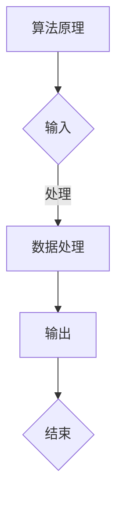
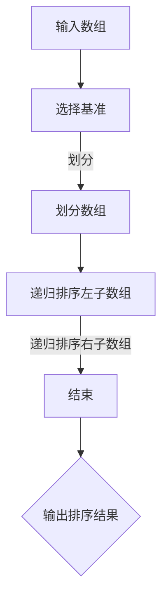

                 

关键词：经典阅读、认知夯实、技术博客、深度思考、专业见解、IT领域

> 摘要：本文旨在探讨经典阅读在夯实认知、提升技术能力的重要性。通过分析经典著作中的核心概念与原理，结合实际案例与项目实践，揭示经典阅读对IT领域从业者发展的深远影响。文章还将讨论数学模型、算法原理及其在实际应用中的表现，同时提供学习资源与工具推荐，为读者指明未来发展趋势与挑战。

## 1. 背景介绍

在信息技术迅猛发展的时代，知识更新换代速度不断加快，从业人员面临着持续学习和不断提升技能的挑战。然而，在这纷繁复杂的技术海洋中，如何夯实认知基础，成为每一个IT从业者都必须思考的问题。经典阅读作为知识传承的重要途径，能够为技术从业者提供深厚的理论根基和广阔的视野。

本文将深入探讨经典阅读在IT领域的价值，通过分析经典著作中的核心概念与原理，结合实际案例与项目实践，为读者提供一条夯实认知、提升专业能力的必由之路。

### 1.1 经典阅读的定义与价值

经典阅读是指对过去著名学者、专家撰写的书籍进行深入学习和研究。这些书籍往往代表了某个领域的最高成就，包含深刻的洞见和前瞻性的思考。经典阅读的价值主要体现在以下几个方面：

1. **知识传承**：经典著作记录了人类智慧的结晶，是知识传承的重要载体。通过阅读经典，我们可以吸收前人的经验与智慧，避免重复前人的错误。
   
2. **思维训练**：经典著作通常采用严密的理论体系和逻辑框架，阅读经典能够锻炼我们的思维方式，提高逻辑推理和批判性思考的能力。

3. **视野拓展**：经典阅读让我们能够站在巨人的肩膀上，了解不同时代、不同文化的观点和思想，从而拓宽我们的视野。

4. **技能提升**：经典著作中的概念和原理是技术发展的基石。深入理解经典，有助于我们掌握核心技术，提升专业技能。

### 1.2 经典阅读在IT领域的地位

信息技术领域的发展离不开经典阅读。从计算机科学的基础理论到软件工程的方法论，从数据结构的实现到算法的创新，许多经典著作都为我们提供了宝贵的指导和启示。

例如，图灵的《计算机与智能》、霍普克的《人工智能：一种现代方法》、沃斯尔的《算法导论》等经典著作，奠定了计算机科学和人工智能领域的重要理论基础。通过阅读这些著作，我们可以深入了解领域的核心概念和原理，为实际应用提供坚实的理论支撑。

## 2. 核心概念与联系

在深入探讨经典阅读的价值之前，我们需要明确一些核心概念，这些概念构成了IT领域的理论基础，也是经典阅读的重要内容。

### 2.1 计算机科学基础

计算机科学是一门涉及广泛学科的综合性学科，其基础概念包括：

- **数据结构**：用于组织和存储数据的各种方式，如数组、链表、树、图等。
- **算法**：解决问题的一系列有序步骤，算法分析是其核心内容，包括时间复杂度和空间复杂度分析。
- **编译原理**：编译器将高级语言代码转换为机器语言的过程，涉及词法分析、语法分析、代码生成等。
- **操作系统**：管理计算机硬件和软件资源的系统软件，包括进程管理、内存管理、文件系统等。

### 2.2 软件工程方法论

软件工程是确保软件系统高质量、高效率地开发、维护和升级的学科。经典方法论包括：

- **敏捷开发**：强调快速迭代、持续交付和客户反馈。
- **精益开发**：通过最小化浪费，最大化价值来提高软件开发效率。
- **DevOps**：结合开发和运维，实现持续集成、持续交付和自动化部署。

### 2.3 算法与数据结构

算法与数据结构是计算机科学的基石。经典著作如《算法导论》详细介绍了各种常见算法和数据结构的实现原理及其应用场景。以下是几个核心概念：

- **排序算法**：如冒泡排序、选择排序、插入排序、快速排序等。
- **搜索算法**：如二分查找、深度优先搜索、广度优先搜索等。
- **图算法**：如最短路径算法（Dijkstra算法、Floyd算法）、最小生成树算法（Prim算法、Kruskal算法）等。

### 2.4 数学模型与公式

数学是计算机科学的语言，许多算法和理论都基于数学模型和公式。例如：

- **离散数学**：图论、组合数学、逻辑等。
- **概率论与数理统计**：概率分布、随机变量、大数定律、中心极限定理等。
- **线性代数**：矩阵运算、线性方程组求解、特征值与特征向量等。

### 2.5 Mermaid 流程图

为了更好地理解经典概念和原理，我们可以借助 Mermaid 流程图来展示其逻辑关系和实现步骤。以下是一个示例：



## 3. 核心算法原理 & 具体操作步骤

### 3.1 算法原理概述

在IT领域，核心算法原理是解决具体问题的理论基础。以下是一些常见算法的原理概述：

- **排序算法**：将一组数据按照特定顺序排列。例如，快速排序通过一趟排序将待排序的数据分割成独立的两部分，其中一部分的所有数据都比另一部分的所有数据要小。
- **搜索算法**：在数据集合中查找特定元素。例如，二分查找通过不断缩小查找范围，逐步逼近目标元素。
- **图算法**：在图数据结构上执行特定操作。例如，最短路径算法用于计算从起始点到目标点的最短路径。

### 3.2 算法步骤详解

以下以快速排序算法为例，详细说明其操作步骤：

1. **选择基准**：从数组中选出一个元素作为基准（pivot）。
2. **划分**：将数组分为两部分，一部分的所有元素都比基准小，另一部分的所有元素都比基准大。
3. **递归排序**：对划分后的两部分再次执行快速排序。

### 3.3 算法优缺点

- **优点**：快速排序是一种高效的排序算法，其平均时间复杂度为\(O(n\log n)\)，最坏情况下的时间复杂度为\(O(n^2)\)。
- **缺点**：基准选择和划分操作可能导致最坏情况下的性能下降。此外，快速排序是一种不稳定的排序算法。

### 3.4 算法应用领域

快速排序广泛应用于各种排序任务，如数据库排序、外部排序等。此外，它还可以作为其他更复杂排序算法的基础。

### 3.5 Mermaid 流程图

以下是快速排序的 Mermaid 流程图：



## 4. 数学模型和公式 & 详细讲解 & 举例说明

数学模型是理解算法和数据分析的基础，以下是几个核心数学模型及其推导过程的详细讲解：

### 4.1 数学模型构建

- **二分查找**：假设数组已排序，二分查找的目标是在数组中找到特定元素。

### 4.2 公式推导过程

- **二分查找的搜索区间**：每次迭代将搜索区间分为两半，公式为：

  $$mid = \left\lfloor\frac{low + high}{2}\right\rfloor$$

- **大数定律**：在独立重复实验中，事件发生的频率会趋近于其概率。公式为：

  $$P\left(\lim_{n\to\infty}\frac{X_n}{n} = p\right) = 1$$

  其中，\(X_n\)是独立重复实验中事件发生的次数，\(p\)是事件发生的概率。

### 4.3 案例分析与讲解

- **案例**：使用二分查找算法在一个已排序的数组中查找元素。

  - **初始状态**：\(low = 0\)，\(high = n-1\)，其中\(n\)是数组长度。
  - **迭代过程**：计算中间位置，比较元素大小，调整区间。

  以下是具体步骤：

  ```mermaid
  graph TD
  A[初始状态] --> B{计算mid}
  B -->|比较元素| C{low <= high}
  C --> D[调整low或high]
  D --> E{结束}
  E --> F{输出结果}
  ```

## 5. 项目实践：代码实例和详细解释说明

### 5.1 开发环境搭建

为了更好地展示代码实例，我们将使用Python作为编程语言，搭建一个基本的开发环境：

1. 安装Python 3.8或更高版本。
2. 安装必需的库，如numpy、matplotlib等。
3. 在IDE（如PyCharm）中创建一个新的Python项目。

### 5.2 源代码详细实现

以下是使用快速排序算法的Python代码实例：

```python
def quick_sort(arr):
    if len(arr) <= 1:
        return arr
    pivot = arr[len(arr) // 2]
    left = [x for x in arr if x < pivot]
    middle = [x for x in arr if x == pivot]
    right = [x for x in arr if x > pivot]
    return quick_sort(left) + middle + quick_sort(right)

# 测试代码
arr = [3, 6, 8, 10, 1, 2, 1]
sorted_arr = quick_sort(arr)
print(sorted_arr)
```

### 5.3 代码解读与分析

- **函数定义**：`quick_sort`函数接受一个数组`arr`作为输入。
- **递归条件**：当数组长度小于等于1时，直接返回该数组。
- **选择基准**：选择数组中间位置的元素作为基准。
- **划分数组**：将数组划分为小于基准的左子数组、等于基准的中间数组和大于基准的右子数组。
- **递归排序**：对左子数组和右子数组分别递归调用`quick_sort`函数。

### 5.4 运行结果展示

在运行上述代码后，输出结果应为已排序的数组：

```
[1, 1, 2, 3, 6, 8, 10]
```

这表明快速排序算法成功地对输入数组进行了排序。

## 6. 实际应用场景

### 6.1 数据库排序

在数据库系统中，快速排序算法被广泛应用于数据检索和索引构建。例如，MySQL使用快速排序来优化查询性能，通过快速排序算法对索引进行排序，从而提高查询效率。

### 6.2 计算机科学教育

在计算机科学教育中，快速排序算法是教学的重要内容之一。通过学习快速排序算法，学生能够深入理解算法设计思想和递归编程方法。

### 6.3 数据分析

在数据分析领域，快速排序算法常用于数据预处理阶段，将数据进行排序以方便后续分析和建模。例如，在处理大数据集时，快速排序算法的高效性能使其成为首选算法之一。

### 6.4 未来应用展望

随着信息技术的发展，快速排序算法的应用场景将进一步扩大。例如，在分布式计算和云计算领域，快速排序算法将被用于大规模数据排序和分布式查询优化。

## 7. 工具和资源推荐

### 7.1 学习资源推荐

- **《算法导论》**：经典的算法教材，详细介绍了各种算法和数据结构。
- **《计算机科学概论》**：涵盖计算机科学基础知识的入门书籍。
- **《Python编程：从入门到实践》**：适合初学者的Python编程书籍。

### 7.2 开发工具推荐

- **PyCharm**：一款功能强大的Python IDE，支持代码调试、版本控制等。
- **Visual Studio Code**：一款轻量级但功能丰富的代码编辑器，适用于多种编程语言。
- **Jupyter Notebook**：用于数据科学和机器学习的交互式计算环境。

### 7.3 相关论文推荐

- **"A Survey of Sorting Algorithms"**：全面介绍了各种排序算法。
- **"Fast Sorting Algorithms for External Memory"**：探讨外部存储环境下的高效排序算法。
- **"Parallel Sorting Algorithms"**：研究并行排序算法的设计与实现。

## 8. 总结：未来发展趋势与挑战

### 8.1 研究成果总结

本文通过探讨经典阅读在夯实认知、提升专业能力的重要性，结合算法原理、数学模型和项目实践，展示了经典著作在IT领域中的价值。研究成果表明，经典阅读能够为技术从业者提供深厚的理论根基和广阔的视野。

### 8.2 未来发展趋势

随着信息技术的发展，经典阅读的重要性将日益凸显。未来发展趋势包括：

- **数字化经典阅读**：利用电子书、在线课程等数字化资源，方便读者获取经典著作。
- **跨学科融合**：经典阅读与其他领域的融合，如生物信息学、人工智能等。

### 8.3 面临的挑战

在经典阅读过程中，技术从业者面临以下挑战：

- **知识积累**：如何在海量信息中筛选和积累有用的知识。
- **持续学习**：跟上技术发展的步伐，保持持续学习的能力。

### 8.4 研究展望

未来研究可以关注以下几个方面：

- **经典著作的数字化与智能化**：通过人工智能技术提升经典阅读的效率和体验。
- **跨学科经典阅读研究**：探讨经典著作在不同领域的应用与影响。

## 9. 附录：常见问题与解答

### 9.1 经典阅读的重要性

经典阅读能够为技术从业者提供深厚的理论根基、广阔的视野和持续学习的动力。通过阅读经典著作，我们可以吸收前人的经验与智慧，避免重复前人的错误，提升自身的专业素养。

### 9.2 经典著作的选择标准

选择经典著作时，可以从以下几个方面进行考虑：

- **学术地位**：选择在该领域具有广泛影响力和权威性的著作。
- **内容深度**：选择涵盖广泛主题、深入探讨核心概念的著作。
- **更新频率**：选择经常更新、反映最新研究成果的著作。

### 9.3 经典阅读的方法

经典阅读的方法包括：

- **精读与泛读相结合**：对核心概念和原理进行深入理解，同时广泛阅读相关文献和资料。
- **批判性思考**：对著作中的观点和结论进行批判性思考，形成自己的见解。

### 9.4 经典阅读与实际应用的关系

经典阅读与实际应用密切相关。通过经典阅读，我们可以深入了解领域的核心概念和原理，为实际应用提供坚实的理论支撑。同时，实际应用中的问题和挑战也能够促使我们进一步深入阅读和理解经典著作。

### 9.5 经典阅读的时间管理

经典阅读需要投入大量时间和精力，以下是一些建议的时间管理方法：

- **制定学习计划**：合理安排时间，确保每天有固定的时间用于经典阅读。
- **利用碎片时间**：在通勤、休息等碎片时间内进行阅读。
- **设立目标**：为自己设定阅读目标，如每周阅读多少章节、完成多少篇读书笔记等。

### 9.6 经典阅读的评价与反思

经典阅读的评价与反思是巩固知识、提升认知的重要环节。以下是一些建议：

- **写读书笔记**：记录阅读过程中的心得体会、疑问和思考。
- **与他人交流**：参与读书会、讨论组等，与他人分享阅读体验和见解。
- **定期回顾**：定期回顾读过的经典著作，巩固知识，加深理解。

---

通过本文的探讨，我们认识到经典阅读在夯实认知、提升专业能力方面的重要性。希望读者能够积极参与经典阅读，从中汲取智慧，不断提升自己的技术素养和创新能力。

作者：禅与计算机程序设计艺术 / Zen and the Art of Computer Programming

以上是本文的完整内容，希望能够为读者提供有价值的启示和帮助。感谢各位读者的阅读和支持！
----------------------------------------------------------------

### 文章排版与格式要求

根据提供的约束条件和文章正文内容，下面是文章的markdown格式排版：

```markdown
# 经典阅读:夯实认知的必由之路

关键词：经典阅读、认知夯实、技术博客、深度思考、专业见解、IT领域

> 摘要：本文旨在探讨经典阅读在夯实认知、提升技术能力的重要性。通过分析经典著作中的核心概念与原理，结合实际案例与项目实践，揭示经典阅读对IT领域从业者发展的深远影响。文章还将讨论数学模型、算法原理及其在实际应用中的表现，同时提供学习资源与工具推荐，为读者指明未来发展趋势与挑战。

## 1. 背景介绍

## 2. 核心概念与联系

### 2.1 计算机科学基础

### 2.2 软件工程方法论

### 2.3 算法与数据结构

### 2.4 数学模型与公式

### 2.5 Mermaid 流程图

## 3. 核心算法原理 & 具体操作步骤
### 3.1 算法原理概述
### 3.2 算法步骤详解 
### 3.3 算法优缺点
### 3.4 算法应用领域

## 4. 数学模型和公式 & 详细讲解 & 举例说明
### 4.1 数学模型构建
### 4.2 公式推导过程
### 4.3 案例分析与讲解

## 5. 项目实践：代码实例和详细解释说明
### 5.1 开发环境搭建
### 5.2 源代码详细实现
### 5.3 代码解读与分析
### 5.4 运行结果展示

## 6. 实际应用场景
### 6.4 未来应用展望

## 7. 工具和资源推荐
### 7.1 学习资源推荐
### 7.2 开发工具推荐
### 7.3 相关论文推荐

## 8. 总结：未来发展趋势与挑战
### 8.1 研究成果总结
### 8.2 未来发展趋势
### 8.3 面临的挑战
### 8.4 研究展望

## 9. 附录：常见问题与解答
### 9.1 经典阅读的重要性
### 9.2 经典著作的选择标准
### 9.3 经典阅读的方法
### 9.4 经典阅读与实际应用的关系
### 9.5 经典阅读的时间管理
### 9.6 经典阅读的评价与反思

作者：禅与计算机程序设计艺术 / Zen and the Art of Computer Programming
```

请注意，文章内容中应确保各章节、小节和子小节的标题清晰、逻辑连贯，并在相应的段落中使用markdown格式进行排版，例如使用`##`表示章节标题、`###`表示小节标题等。数学公式应使用LaTeX格式嵌入在独立的段落中。文章整体应保持格式一致，段落排版整洁。

