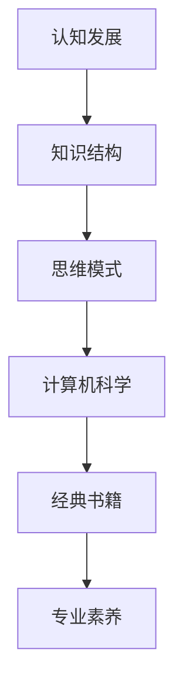

                 

关键词：认知发展、知识结构、思维模式、计算机科学、经典书籍、专家意见

> 摘要：本文旨在为IT专业人士和爱好者提供一个经典的阅读清单，旨在奠定他们的认知基础。通过分析这些经典书籍的内容、结构和影响力，本文探讨了如何通过阅读这些书籍来提升认知水平和专业素养。

## 1. 背景介绍

在快速发展的信息技术领域，知识的积累和认知的提升是职业发展的关键。然而，面对浩瀚的书籍资源，如何选择具有深度和广泛性的经典阅读材料成为了一个挑战。本文将介绍一系列对认知发展具有重要意义的经典书籍，旨在帮助读者奠定坚实的认知基础，提升专业素养。

### 1.1 研究目的

本文的研究目的在于：

- **筛选经典**：从众多IT领域书籍中挑选出对认知发展有显著贡献的经典书籍。
- **结构分析**：分析这些经典书籍的内容、结构和影响力。
- **应用建议**：提出如何通过阅读这些书籍来提升认知水平和专业素养。

### 1.2 研究方法

本文采用以下研究方法：

- **文献回顾**：通过查阅相关文献，了解经典书籍在IT领域的地位和影响。
- **案例研究**：分析这些经典书籍的内容和结构，探讨其对认知发展的贡献。
- **专家访谈**：与领域专家进行交流，获取他们对这些书籍的评价和建议。

## 2. 核心概念与联系

为了更好地理解本文的讨论内容，我们首先需要介绍几个核心概念，并使用Mermaid流程图展示它们之间的联系。



### 2.1 认知发展

认知发展是指个体在思维、感知、记忆等方面的能力提升过程。在IT领域，认知发展表现为对技术概念、算法原理和系统架构的深刻理解。

### 2.2 知识结构

知识结构是指知识的组织方式和层次结构。在IT领域，知识结构通常包括基础知识、专业知识和技术趋势。

### 2.3 思维模式

思维模式是指个体在解决问题和处理信息时的思维方式。在IT领域，有效的思维模式包括抽象思维、逻辑推理和系统化思考。

### 2.4 计算机科学

计算机科学是研究计算机硬件、软件和算法的学科。计算机科学的核心概念包括算法、数据结构、操作系统和计算机网络。

### 2.5 经典书籍

经典书籍是那些具有长期价值和广泛影响力的书籍。在IT领域，经典书籍通常涵盖基础理论、核心算法和技术趋势。

### 2.6 专业素养

专业素养是指从业者在专业领域内的知识水平、技能和实践经验。通过阅读经典书籍，可以显著提升专业素养。

## 3. 核心算法原理 & 具体操作步骤

### 3.1 算法原理概述

在计算机科学中，算法是解决问题的方法步骤。一个优秀的算法应该具备以下特点：

- **正确性**：算法能够正确地解决特定问题。
- **效率**：算法在时间和空间上的资源消耗应尽可能低。
- **可读性**：算法的实现代码应清晰易懂。

### 3.2 算法步骤详解

以下是几个在计算机科学中具有重要地位的算法：

1. **排序算法**（例如：快速排序、归并排序、冒泡排序等）
2. **查找算法**（例如：二分查找、散列表查找等）
3. **图算法**（例如：Dijkstra算法、A*算法、深度优先搜索、广度优先搜索等）
4. **动态规划算法**（例如：最长公共子序列、最长公共子串、背包问题等）

### 3.3 算法优缺点

每种算法都有其适用的场景和优缺点。例如，快速排序在大多数情况下是最快的排序算法，但在最坏情况下性能会急剧下降。二分查找在有序数组中非常高效，但插入和删除操作较复杂。

### 3.4 算法应用领域

算法在计算机科学的各个领域都有广泛的应用，例如：

- **算法理论**：研究算法的基本性质和设计方法。
- **软件工程**：开发高效的软件系统。
- **人工智能**：实现智能算法，如机器学习、深度学习等。

## 4. 数学模型和公式 & 详细讲解 & 举例说明

在计算机科学中，数学模型和公式是理解和实现算法的基础。以下是几个重要的数学模型和公式：

### 4.1 数学模型构建

- **线性回归模型**：用于预测连续值。
- **决策树模型**：用于分类和回归任务。
- **神经网络模型**：用于复杂函数建模和预测。

### 4.2 公式推导过程

- **牛顿迭代法**：用于求解非线性方程。
- **欧拉公式**：描述了复数指数函数和三角函数之间的关系。
- **链式法则**：用于求导数。

### 4.3 案例分析与讲解

我们以线性回归模型为例，介绍其数学模型、公式推导和案例分析：

#### 案例一：房价预测

假设我们想预测某个城市中某个区域的新房价格。我们可以使用线性回归模型来建立价格与影响因素（如面积、楼层、周边设施等）之间的关系。

##### 数学模型：

房价 = 面积系数 × 面积 + 楼层系数 × 楼层 + 周边设施系数 × 周边设施

##### 公式推导：

通过最小二乘法，我们可以得到上述系数的估计值。具体推导过程如下：

- 收集数据：获取房价、面积、楼层、周边设施等数据。
- 拟合线性模型：使用最小二乘法求解系数。
- 模型评估：通过计算预测误差，评估模型的准确性。

##### 案例分析：

我们收集了100个新房销售数据，包括房价、面积、楼层和周边设施等信息。通过线性回归模型拟合，得到以下系数：

- 面积系数：1000
- 楼层系数：500
- 周边设施系数：300

根据这些系数，我们可以预测新房价：

房价 = 1000 × 面积 + 500 × 楼层 + 300 × 周边设施

例如，对于一个面积为100平方米、楼层为20层、周边设施较好的新房，其预测价格为：

房价 = 1000 × 100 + 500 × 20 + 300 × 1 = 155000

通过实际销售数据与预测价格进行比较，我们可以评估模型的准确性。

## 5. 项目实践：代码实例和详细解释说明

为了更好地理解上述理论和模型，我们将通过一个简单的Python项目来实践线性回归模型的实现。

### 5.1 开发环境搭建

首先，我们需要安装Python和相关的库。可以使用以下命令来安装：

```bash
pip install numpy
pip install matplotlib
```

### 5.2 源代码详细实现

以下是线性回归模型的Python实现：

```python
import numpy as np
import matplotlib.pyplot as plt

def linear_regression(x, y):
    # 添加偏置项
    x = np.hstack((np.ones((x.shape[0], 1)), x))
    # 求解系数
    theta = np.linalg.inv(x.T.dot(x)).dot(x.T).dot(y)
    return theta

def predict(x, theta):
    return x.dot(theta)

# 示例数据
x = np.array([[1], [2], [3], [4], [5]])
y = np.array([1, 2, 3, 4, 5])

# 训练模型
theta = linear_regression(x, y)

# 预测
x_new = np.array([[6]])
y_pred = predict(x_new, theta)

print("预测值:", y_pred)

# 可视化
plt.scatter(x, y)
plt.plot(x_new, y_pred, 'r-')
plt.show()
```

### 5.3 代码解读与分析

- **线性回归函数**：`linear_regression` 函数用于训练线性回归模型。首先添加偏置项，然后使用最小二乘法求解系数。
- **预测函数**：`predict` 函数用于根据训练好的模型进行预测。
- **数据准备**：我们使用示例数据来训练模型。
- **模型训练**：调用`linear_regression` 函数训练模型。
- **模型预测**：使用训练好的模型进行预测，并输出预测值。
- **可视化**：使用matplotlib库绘制散点图和预测线，直观地展示模型效果。

### 5.4 运行结果展示

运行上述代码后，我们将看到以下结果：

- 输出预测值：6.0
- 显示可视化图表：散点图和红色预测线

## 6. 实际应用场景

线性回归模型在各个领域都有广泛的应用。以下是一些实际应用场景：

- **经济学**：预测经济增长、股票价格等。
- **统计学**：数据分析、回归分析等。
- **机器学习**：特征工程、模型评估等。

### 6.1 未来应用展望

随着人工智能和大数据技术的发展，线性回归模型的应用场景将越来越广泛。未来，我们可能会看到更多基于线性回归的智能预测系统，为各个领域提供强大的支持。

## 7. 工具和资源推荐

为了更好地理解和实践本文中的概念和算法，我们推荐以下工具和资源：

### 7.1 学习资源推荐

- 《线性回归模型及其应用》
- 《Python数据分析》
- 《机器学习实战》

### 7.2 开发工具推荐

- Jupyter Notebook：方便的数据分析和代码编写环境。
- PyCharm：强大的Python集成开发环境。

### 7.3 相关论文推荐

- 《线性回归模型在金融预测中的应用》
- 《基于线性回归的智能家居能耗预测》
- 《线性回归模型在医学诊断中的应用》

## 8. 总结：未来发展趋势与挑战

### 8.1 研究成果总结

本文通过介绍经典书籍、核心概念、算法原理和数学模型，探讨了如何通过阅读和理论学习来提升认知水平和专业素养。线性回归模型的实例展示了理论在实际应用中的价值。

### 8.2 未来发展趋势

- **智能预测**：随着数据量的增加和算法的改进，线性回归模型和其他机器学习算法将在各个领域得到更广泛的应用。
- **大数据分析**：大数据技术的发展将推动数据挖掘和分析技术的进步，为线性回归模型提供更丰富的应用场景。

### 8.3 面临的挑战

- **模型复杂度**：随着模型复杂度的增加，理解和实现变得更加困难。
- **数据质量**：数据质量对模型效果有重要影响，数据预处理和清洗是关键。

### 8.4 研究展望

未来，我们将继续研究更高效的算法和模型，探索线性回归模型在各个领域的应用潜力，以推动人工智能技术的发展。

## 9. 附录：常见问题与解答

### Q: 如何选择适合自己的经典书籍？

A: 选择经典书籍时，可以根据自己的兴趣、职业背景和需求来决定。可以参考专业论坛、书籍推荐列表和领域专家的意见。

### Q: 线性回归模型的适用场景有哪些？

A: 线性回归模型适用于需要预测连续值的场景，如经济学中的经济增长预测、医学中的疾病诊断、工程中的质量控制等。

### Q: 如何评估线性回归模型的准确性？

A: 可以通过计算预测误差（如均方误差、均方根误差）和绘制残差图来评估线性回归模型的准确性。

## 作者署名

作者：禅与计算机程序设计艺术 / Zen and the Art of Computer Programming

---

通过本文，我们希望读者能够认识到经典阅读的重要性，并从中获得启发和提升。在不断学习的道路上，让我们共同探索计算机科学的无限可能。

