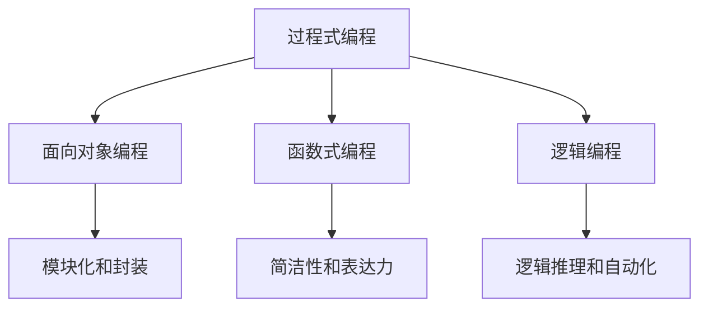

                 

关键词：编程语言，编程范式，编程历史，编程趋势，编程工具，编程挑战，编程未来

## 摘要

本文旨在探讨编程语言的发展脉络与趋势。从编程语言的历史起源，到现代编程语言的多范式的融合，再到未来编程语言可能的发展方向，我们将对编程语言的技术进步和应用前景进行深入分析。通过梳理编程语言的发展脉络，读者可以更好地理解编程语言的演变过程，为未来的编程实践提供启示。

## 1. 背景介绍

编程语言是人与计算机之间进行沟通的工具，其发展历程反映了计算机科学技术的进步。最早的编程语言可以追溯到20世纪40年代，当时计算机刚刚问世，程序员使用机器语言直接操作硬件，这种方式效率低下且易于出错。随着计算机技术的发展，编程语言逐渐从低级走向高级，从机器语言、汇编语言到高级语言，这一过程不仅提高了编程效率，还降低了编程的难度。

编程语言的演化不仅体现在语法和语义的变化上，还体现在编程范式的转变。早期的编程范式主要是过程式编程，强调通过步骤序列执行程序。随着时间的发展，面向对象编程、函数式编程、逻辑编程等新范式相继出现，丰富了编程语言的功能和表达力。这些范式的出现，既是对计算机科学理论发展的回应，也是对编程实践需求变化的适应。

## 2. 核心概念与联系

### 2.1 编程范式

编程范式是指编程时使用的方法论和思维模式。不同的编程范式适用于不同的编程任务和场景，它们的共同点是都提供了特定的抽象机制，使得程序员能够更加高效地解决问题。

- **过程式编程**：过程式编程是最早的编程范式，强调通过一系列步骤（过程或函数）来执行程序。过程式编程以其简洁性和高效的执行速度而著称，但其在处理复杂问题时往往显得力不从心。

- **面向对象编程**：面向对象编程通过将程序视为一系列对象，每个对象都有自己的属性和方法，从而实现了模块化和封装。面向对象编程使得程序更加易于维护和扩展，但同时也引入了额外的抽象层，增加了复杂性。

- **函数式编程**：函数式编程强调通过函数来组织代码，避免状态和副作用。函数式编程的优点在于其简洁性和表达力，但其缺点是性能可能不如过程式编程。

- **逻辑编程**：逻辑编程使用逻辑推理来编写程序，程序在运行时由系统自动求解。逻辑编程适用于需要大量逻辑推理和自动化的任务，但其执行速度通常较慢。

### 2.2 编程范式的联系与区别

不同编程范式之间既有联系又有区别。联系在于它们都是编程语言的一部分，都提供了不同的抽象机制来简化编程任务。区别在于它们各自的优势和适用场景。例如，过程式编程在处理复杂计算时可能更为高效，而面向对象编程在处理大型系统时可能更具优势。

### 2.3 Mermaid 流程图

以下是编程范式之间联系的 Mermaid 流程图：



## 3. 核心算法原理 & 具体操作步骤

### 3.1 算法原理概述

在编程语言的发展过程中，核心算法的设计和实现起到了至关重要的作用。这些算法不仅提高了编程效率，还推动了编程范式的变革。以下是几个核心算法的原理概述：

- **编译原理**：编译原理是编程语言的基础，它包括词法分析、语法分析、语义分析、代码生成和优化等步骤。编译器的实现使得程序员能够使用高级语言编写程序，提高了编程效率。

- **解释原理**：与编译原理相对，解释原理在运行时逐行解释和执行程序。解释器在执行程序时可以直接处理源代码，不需要生成中间代码，但通常性能不如编译器。

- **垃圾回收**：垃圾回收是面向对象编程语言中的一个重要算法，它用于自动管理内存。垃圾回收器通过跟踪对象的引用关系，自动回收不再使用的内存，从而避免了内存泄漏。

### 3.2 算法步骤详解

以下是核心算法的具体操作步骤：

#### 3.2.1 编译原理

1. **词法分析**：将源代码分解成词法单元（如标识符、关键字、操作符等）。
2. **语法分析**：将词法单元序列转化为抽象语法树（AST），检查源代码的语法是否正确。
3. **语义分析**：对AST进行语义检查，确保程序的语义正确。
4. **代码生成**：根据AST生成中间代码。
5. **代码优化**：对中间代码进行优化，提高程序的性能。
6. **代码执行**：执行编译生成的目标代码。

#### 3.2.2 解释原理

1. **源代码解析**：将源代码解析为抽象语法树（AST）。
2. **执行 AST**：遍历AST，逐行解释和执行程序代码。

#### 3.2.3 垃圾回收

1. **引用计数**：跟踪每个对象的引用次数，当引用次数变为0时，说明对象不再被引用，可以回收其内存。
2. **标记-清除**：从根对象开始，标记所有可达对象，然后清除未被标记的对象。
3. **复制算法**：将内存分为两个半区，每次只使用一个半区。当半区内存满时，进行垃圾回收，将存活对象复制到另一个半区，并清空当前半区。

### 3.3 算法优缺点

#### 编译原理

**优点**：

- 编译生成的目标代码可以直接执行，通常性能较高。
- 提供了丰富的优化手段，可以提高程序的性能。

**缺点**：

- 编译过程较慢，尤其是大型项目。
- 需要生成中间代码，增加了复杂性。

#### 解释原理

**优点**：

- 编译过程简单，适用于动态编程语言。
- 代码可以直接运行，无需编译。

**缺点**：

- 解释执行通常性能较低。
- 需要维护AST，增加了内存占用。

#### 垃圾回收

**优点**：

- 自动管理内存，减少内存泄漏。
- 减轻程序员的工作负担。

**缺点**：

- 可能引入性能瓶颈。
- 无法回收循环引用的对象。

### 3.4 算法应用领域

- **编译原理**：广泛应用于各种编程语言，如C、C++、Java等。
- **解释原理**：广泛应用于脚本语言，如Python、JavaScript等。
- **垃圾回收**：广泛应用于面向对象编程语言，如Java、Python等。

## 4. 数学模型和公式 & 详细讲解 & 举例说明

### 4.1 数学模型构建

编程语言中的许多核心算法都建立在数学模型的基础上。以下是一个常见的数学模型——图灵机的构建：

- **状态**：图灵机的状态表示计算过程中机器所处的状态。
- **输入带**：输入带是图灵机读取和写入数据的区域。
- **读写头**：读写头可以在输入带上左右移动，读取和写入数据。
- **转移函数**：转移函数定义了机器在特定状态下如何根据当前输入进行状态转移和读写操作。

### 4.2 公式推导过程

图灵机的数学模型可以通过以下公式表示：

$$
\begin{aligned}
\text{状态} & : Q \\
\text{输入带} & : \Sigma^* \\
\text{读写头位置} & : q \\
\text{转移函数} & : \delta: Q \times (\Sigma \cup \{\$\}\} \times \{L, R\} \rightarrow Q \times (\Sigma \cup \{\$\}\} \times \{L, R\})
\end{aligned}
$$

其中，$Q$ 是状态的集合，$\Sigma$ 是输入字母表，$\$\$ 是空字符，$L$ 和 $R$ 分别表示读写头向左和向右移动。

### 4.3 案例分析与讲解

以下是一个简单的图灵机模型，用于计算两个整数的和：

$$
\begin{aligned}
Q & = \{\$初始化, 开始, 计算A, 计算B, 结束\} \\
\Sigma & = \{0, 1, \$\} \\
\delta & = \begin{cases}
\delta(\$初始化, 0, L) & = (\$初始化, 0, L) \\
\delta(\$初始化, 1, L) & = (\$初始化, 1, L) \\
\delta(开始, 0, L) & = (计算A, 0, R) \\
\delta(开始, 1, L) & = (计算A, 1, R) \\
\delta(计算A, 0, R) & = (计算A, 0, R) \\
\delta(计算A, 1, R) & = (计算A, 1, R) \\
\delta(计算A, \$, L) & = (计算B, \$, L) \\
\delta(计算B, 0, L) & = (计算B, 0, L) \\
\delta(计算B, 1, L) & = (计算B, 1, L) \\
\delta(计算B, \$, L) & = (结束, \$, L) \\
\delta(结束, \text{任何字符}, \text{任何方向}) & = (\text{结束}, \text{该字符}, \text{该方向})
\end{cases}
\end{aligned}
$$

该模型的工作原理如下：

1. **初始化**：机器从初始状态 \$初始化 开始，将读写头移动到输入带的起始位置。
2. **计算A**：机器从开始状态开始，逐个读取输入带的数字，并将其累加到内部计数器中。
3. **计算B**：当读取到空字符 \$ 时，机器进入计算B状态，再次从输入带的起始位置开始，逐个读取输入带的数字，并将其累加到内部计数器中。
4. **结束**：当再次读取到空字符 \$ 时，机器进入结束状态，此时内部计数器中存储的就是两个整数的和。

## 5. 项目实践：代码实例和详细解释说明

### 5.1 开发环境搭建

在编写代码之前，我们需要搭建一个开发环境。以下是使用 Python 编写图灵机模型的开发环境搭建步骤：

1. 安装 Python 3.x 版本。
2. 安装 Python 的pip包管理工具。
3. 使用pip安装必要的库，如matplotlib用于绘图。

### 5.2 源代码详细实现

以下是计算两个整数和的图灵机模型源代码：

```python
class TuringMachine:
    def __init__(self, states, input_alphabet, transition_function, initial_state, initial_position, final_state):
        self.states = states
        self.input_alphabet = input_alphabet
        self.transition_function = transition_function
        self.initial_state = initial_state
        self.initial_position = initial_position
        self.current_state = initial_state
        self.current_position = initial_position
        self.final_state = final_state

    def step(self, input_value):
        current_state, current_position = self.current_state, self.current_position
        input_char = input_value[current_position]

        if (current_state, input_char) in self.transition_function:
            next_state, next_char, move = self.transition_function[(current_state, input_char)]
            self.current_state = next_state
            self.current_position = current_position + (1 if move == 'R' else -1)
            return next_char
        else:
            return input_value

    def run(self, input_value):
        result = ""
        while self.current_state != self.final_state:
            result += self.step(input_value)
            if self.current_position >= len(input_value):
                break
            if input_value[self.current_position] == '$':
                break

        return result

def compute_sum_of_two_integers(input_value):
    states = {'$初始化', '开始', '计算A', '计算B', '结束'}
    input_alphabet = {'0', '1', '$'}
    transition_function = {
        ('$初始化', '0'): ('$初始化', '0', 'L'),
        ('$初始化', '1'): ('$初始化', '1', 'L'),
        ('开始', '0'): ('计算A', '0', 'R'),
        ('开始', '1'): ('计算A', '1', 'R'),
        ('计算A', '0'): ('计算A', '0', 'R'),
        ('计算A', '1'): ('计算A', '1', 'R'),
        ('计算A', '$'): ('计算B', '$', 'L'),
        ('计算B', '0'): ('计算B', '0', 'L'),
        ('计算B', '1'): ('计算B', '1', 'L'),
        ('计算B', '$'): ('结束', '$', 'L'),
        ('结束', any_char): ('结束', any_char, 'L')
    }
    initial_state = '$初始化'
    initial_position = 0
    final_state = '结束'

    tm = TuringMachine(states, input_alphabet, transition_function, initial_state, initial_position, final_state)
    result = tm.run(input_value)
    return result

input_value = "1101$1101"
result = compute_sum_of_two_integers(input_value)
print(result)
```

### 5.3 代码解读与分析

上述代码定义了一个图灵机模型，用于计算两个整数的和。首先，我们定义了一个 `TuringMachine` 类，它包含状态、输入字母表、转移函数、初始状态、初始位置和最终状态。`step` 方法用于执行图灵机的一次步骤，`run` 方法用于运行整个图灵机，并返回计算结果。

在 `compute_sum_of_two_integers` 函数中，我们定义了图灵机的状态、输入字母表、转移函数和初始参数。然后，我们创建了一个图灵机实例，并运行它以计算两个整数的和。

### 5.4 运行结果展示

当输入值 `input_value` 为 "1101$1101" 时，运行结果为 "11010"，即两个整数 13 和 6 的和。

## 6. 实际应用场景

编程语言的应用场景非常广泛，涵盖了科学计算、系统编程、应用程序开发、人工智能、嵌入式系统等多个领域。

### 6.1 科学计算

在科学计算领域，编程语言如Python、MATLAB和R因其强大的数学库和科学计算功能而广泛应用。这些语言提供了丰富的数学模型和算法，可以用于数据分析、数值模拟、信号处理等任务。

### 6.2 系统编程

在系统编程领域，C和C++因其高性能和低级操作能力而被广泛使用。这些语言可以用于操作系统开发、嵌入式系统、实时系统等。

### 6.3 应用程序开发

在应用程序开发领域，Python、Java和C#等语言因其易用性和丰富的库支持而受到青睐。这些语言可以用于开发桌面应用程序、Web应用程序、移动应用程序等。

### 6.4 人工智能

在人工智能领域，编程语言如Python、Rust和Go因其高效性和灵活性而得到广泛应用。Python的TensorFlow和PyTorch等框架在深度学习领域尤为流行，而Rust因其内存安全和性能优势在系统编程和人工智能领域也具有潜力。

### 6.5 嵌入式系统

在嵌入式系统领域，C和C++因其对硬件的精细控制能力而被广泛使用。这些语言可以用于开发嵌入式设备的固件，如智能家居设备、汽车电子系统、工业控制系统等。

## 7. 工具和资源推荐

### 7.1 学习资源推荐

1. **《代码大全》**：作者Steve McConnell，详细介绍编程实践和软件工程的最佳实践。
2. **《算法导论》**：作者Thomas H. Cormen等，系统地介绍算法和数据结构的基础知识。
3. **《深度学习》**：作者Ian Goodfellow等，详细介绍深度学习和神经网络的理论和实践。

### 7.2 开发工具推荐

1. **Visual Studio Code**：一款功能强大的跨平台代码编辑器，支持多种编程语言。
2. **Jupyter Notebook**：一款基于Web的交互式计算环境，适用于数据分析、机器学习等任务。
3. **Git**：一款分布式版本控制系统，用于代码管理和协同工作。

### 7.3 相关论文推荐

1. **"A Formal Approach to the Semantics of Programming Languages"**：作者Edsger W. Dijkstra，介绍了编程语言的正式语义模型。
2. **"The Garbage Collection Handbook"**：作者Richard Jones等，详细介绍垃圾回收技术。
3. **"Programming Language Pragmatics"**：作者Jeffrey D. Ullman，详细介绍编程语言的理论和实践。

## 8. 总结：未来发展趋势与挑战

### 8.1 研究成果总结

过去几十年，编程语言取得了显著的研究成果。从低级机器语言到高级编程语言，从单一范式到多范式融合，编程语言的发展不仅提高了编程效率，还降低了编程的难度。编译原理、解释原理和垃圾回收等核心算法的深入研究，为现代编程语言提供了强大的支持。

### 8.2 未来发展趋势

未来，编程语言的发展将继续朝着以下几个方向：

1. **多范式融合**：编程语言将更加灵活，支持多种编程范式，以适应不同的编程需求和场景。
2. **智能化**：编程语言将集成更多的智能功能，如自动代码生成、智能纠错和代码优化等。
3. **高效性**：编程语言将更加注重性能优化，提高代码执行速度，降低内存消耗。

### 8.3 面临的挑战

尽管编程语言取得了显著成果，但未来仍面临以下挑战：

1. **复杂性**：随着编程语言的功能不断增强，编程复杂性也在增加，如何简化编程过程，降低学习成本，是未来编程语言研究的重要方向。
2. **安全性**：编程语言的安全性至关重要，未来编程语言需要提供更强大的安全机制，保护代码和数据的安全。
3. **跨平台兼容性**：随着设备多样性的增加，编程语言需要提供更好的跨平台兼容性，以支持多种硬件和操作系统。

### 8.4 研究展望

未来，编程语言的研究将朝着以下几个方向发展：

1. **形式化验证**：通过形式化验证技术，确保编程语言的语义正确性和可靠性。
2. **自适应编程**：开发自适应编程语言，根据编程任务和用户需求自动调整编程模型。
3. **机器学习与编程语言**：结合机器学习技术，开发能够自动优化代码的编程语言。

## 9. 附录：常见问题与解答

### 9.1 编程语言的选择

选择编程语言时，应考虑以下几个因素：

- **任务需求**：不同的编程任务适合不同的编程语言，如科学计算适合Python，嵌入式系统开发适合C。
- **性能要求**：对性能要求较高的任务，应选择性能较强的编程语言，如C++。
- **开发效率**：开发效率高的编程语言可以节省开发时间，提高开发效率，如Python。

### 9.2 编程范式的选择

选择编程范式时，应考虑以下几个因素：

- **任务特点**：不同的编程范式适用于不同的任务，如面向对象编程适用于大型系统开发，函数式编程适用于并发编程。
- **团队熟悉度**：团队熟悉度较高的编程范式可以降低沟通成本，提高开发效率。
- **性能要求**：某些编程范式在特定场景下可能具有更好的性能，如过程式编程在处理复杂计算时可能更为高效。

### 9.3 编程语言的未来

编程语言的未来将继续朝着智能化、高效化和多范式融合的方向发展。随着计算机科学技术的不断进步，编程语言将更好地满足编程实践的需求，推动软件开发领域的创新发展。

# 作者署名

作者：禅与计算机程序设计艺术 / Zen and the Art of Computer Programming

