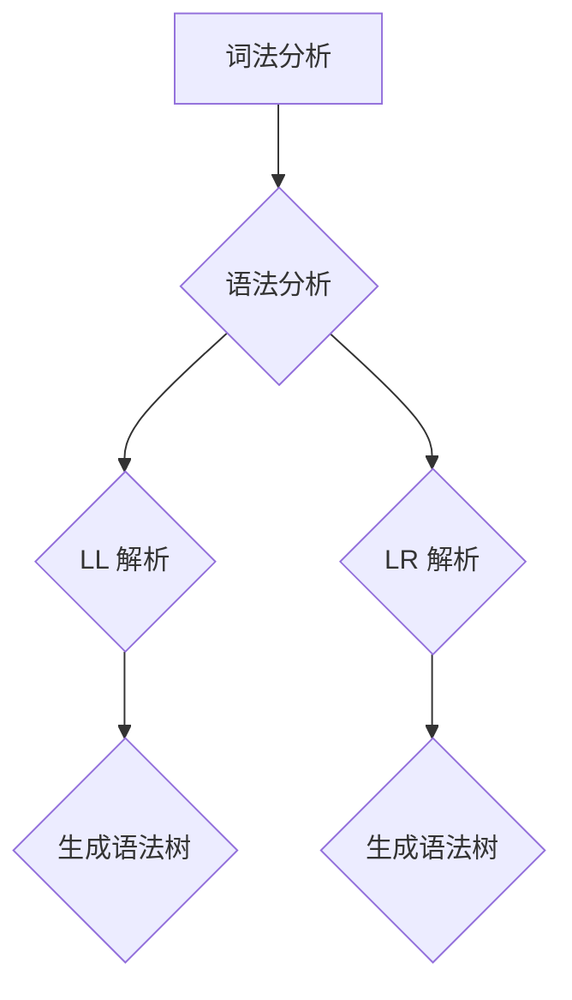

                 

关键词：编译原理、LL解析、LR解析、语法分析、词法分析、编译器设计、程序设计、代码优化

> 摘要：本文旨在深入探讨编译原理中两种经典文法解析技术——LL和LR。通过对比分析这两种技术的原理、应用场景和优缺点，为读者提供全面的技术视角，帮助他们在编译器设计和程序开发中做出合理选择。

## 1. 背景介绍

编译原理是计算机科学的核心领域之一，它涉及将人类可读的源代码转换成机器语言或其他形式的目标代码。语法分析（Syntax Analysis）是编译过程中的关键步骤，其任务是理解源代码的语法结构，将其分解为语法树或抽象语法树（AST）。LL和LR是两种常见的语法分析方法，广泛应用于编译器设计和程序语言实现。

### LL解析

LL解析器采用自顶向下、递归下降的方法，从源代码的顶部开始，逐层递归地解析文法规则，直到产生完整的语法树。LL解析器通常具有良好的可读性，适合简单的程序语言。

### LR解析

LR解析器采用自底向上、移进-归约的方法，它能够处理更复杂的文法，并支持左递归。LR解析器通常比LL解析器更强大，适用于复杂的程序语言。

## 2. 核心概念与联系

在深入探讨LL和LR解析技术之前，我们需要明确几个核心概念：

- **词法分析（Lexical Analysis）**：将源代码拆分成一个个的词法单元（tokens）。
- **语法分析（Syntax Analysis）**：将词法单元组合成语法结构，通常以语法树或抽象语法树的形式表示。
- **语法规则（Grammar Rules）**：定义程序语言的语法结构。

以下是一个简单的语法规则示例，用于描述一个简单的算术表达式：

```
表达式 -> 加法表达式 | 减法表达式
加法表达式 -> 加号 操作数 表达式
减法表达式 -> 减号 操作数 表达式
操作数 -> 整数 | 小数
```

### Mermaid 流程图



在这个流程图中，词法分析是语法分析的前置步骤，而LL和LR解析是语法分析的方法。两种方法最终都生成语法树，但实现过程和适用场景有所不同。

## 3. 核心算法原理 & 具体操作步骤

### 3.1 算法原理概述

#### LL 解析

LL 解析器的核心思想是递归下降。它通过一组递归函数实现，每个函数对应一个文法规则。LL 解析器从源代码的顶部开始，逐层递归地调用这些函数，直到解析出完整的语法树。

#### LR 解析

LR 解析器的核心思想是移进-归约。它维护一个预测分析表（predictive analysis table），用于根据当前状态和下一个词法单元选择合适的动作（移进或归约）。LR 解析器自底向上分析源代码，当遇到无法继续匹配的词法单元时，通过归约操作回溯到先前的状态。

### 3.2 算法步骤详解

#### LL 解析步骤

1. 初始化：设置初始状态和词法单元。
2. 递归下降：根据当前词法单元和文法规则调用相应的递归函数。
3. 处理错误：当无法匹配当前词法单元时，回溯到先前的状态并尝试其他可能的规则。
4. 生成语法树：在递归函数返回时，将当前词法单元添加到语法树中。

#### LR 解析步骤

1. 初始化：设置初始状态和词法单元。
2. 读入词法单元：逐个读取源代码中的词法单元。
3. 分析：根据当前状态和词法单元，查找预测分析表中的动作。
4. 动作执行：根据分析表中的动作执行移进或归约操作。
5. 处理错误：当无法执行任何动作时，回溯到先前的状态并尝试其他可能的动作。

### 3.3 算法优缺点

#### LL 解析

优点：

- 易于实现和理解。
- 适用于简单和清晰的语法结构。

缺点：

- 难以处理复杂的语法结构，特别是左递归。
- 可能会产生大量的递归调用，导致性能下降。

#### LR 解析

优点：

- 能够处理复杂的语法结构，包括左递归。
- 性能相对较高。

缺点：

- 实现较为复杂。
- 分析过程可能难以理解。

## 3.4 算法应用领域

LL 解析器适用于简单和清晰的语法结构，如Python、JavaScript等。LR 解析器则适用于更复杂的语法结构，如C、C++等。

## 4. 数学模型和公式 & 详细讲解 & 举例说明

### 4.1 数学模型构建

LL 解析器的数学模型主要涉及递归函数的构建。每个递归函数对应一个文法规则，通过递归调用实现语法树的生成。

LR 解析器的数学模型主要涉及预测分析表（predictive analysis table）的构建。该表用于根据当前状态和词法单元选择合适的动作。

### 4.2 公式推导过程

LL 解析器的公式推导过程基于递归函数的定义。以一个简单的算术表达式为例，可以构建以下递归函数：

```
parseExpression(expression) {
    if (expression is a single number) {
        return createASTNode(expression);
    } else {
        return parseAdditiveExpression() + parseMultiplicativeExpression();
    }
}

parseAdditiveExpression() {
    // implementation
}

parseMultiplicativeExpression() {
    // implementation
}
```

LR 解析器的公式推导过程基于预测分析表的构建。以一个简单的算术表达式为例，可以构建以下预测分析表：

```
| state | token | action       | goto        |
|-------|-------|--------------|-------------|
| 0     | +     | shift        | 1           |
| 0     | -     | shift        | 1           |
| 0     | number| accept       |             |
| 1     | *     | shift        | 2           |
| 1     | /     | shift        | 2           |
| 1     | number| reduce       | 0           |
| 2     | +     | reduce       | 0           |
| 2     | -     | reduce       | 0           |
| 2     | number| reduce       | 0           |
```

### 4.3 案例分析与讲解

以一个简单的算术表达式 `3 + 4 * 2` 为例，我们使用LL解析器和LR解析器分别进行语法分析。

#### LL 解析

1. 初始化：词法单元为 `[3, +, 4, *, 2]`。
2. 调用 `parseExpression()` 函数。
3. `parseExpression()` 调用 `parseAdditiveExpression()` 和 `parseMultiplicativeExpression()`。
4. `parseAdditiveExpression()` 调用 `parseAdditiveExpression()` 和 `parseMultiplicativeExpression()`。
5. `parseMultiplicativeExpression()` 返回 `(4 * 2)`。
6. `parseAdditiveExpression()` 返回 `(3 + (4 * 2))`。
7. `parseExpression()` 返回 `(3 + (4 * 2))`。

最终生成的语法树如下：

```
    +
   / \
  3   *
     / \
    4   2
```

#### LR 解析

1. 初始化：词法单元为 `[3, +, 4, *, 2]`，状态为 `0`。
2. 读入词法单元 `3`，执行 `accept` 动作，进入状态 `0`。
3. 读入词法单元 `+`，查找预测分析表，执行 `shift` 动作，进入状态 `1`。
4. 读入词法单元 `4`，执行 `shift` 动作，进入状态 `2`。
5. 读入词法单元 `*`，执行 `shift` 动作，进入状态 `3`。
6. 读入词法单元 `2`，执行 `reduce` 动作，回溯到状态 `1`。
7. 读入词法单元 `+`，执行 `reduce` 动作，回溯到状态 `0`。

最终生成的语法树如下：

```
    +
   / \
  3   *
     / \
    4   2
```

## 5. 项目实践：代码实例和详细解释说明

### 5.1 开发环境搭建

为了更好地展示LL和LR解析器的实现，我们使用Python编写了一个简单的编译器。以下是搭建开发环境的步骤：

1. 安装Python：确保已安装Python 3.x版本。
2. 安装必要库：使用pip安装Python标准库中的`re`和`sys`模块。
3. 创建项目文件夹：在合适的位置创建一个名为`compiler`的项目文件夹。

### 5.2 源代码详细实现

以下是该项目的主要源代码实现：

```python
import re
import sys

# 词法分析
def tokenize(source_code):
    token_pattern = r'\d+|\+|\-|\*|\/|\(|\)'
    tokens = re.findall(token_pattern, source_code)
    return tokens

# LL 解析
def parse_expression(tokens):
    if len(tokens) == 0:
        return None
    expression = parse_additive_expression(tokens)
    if expression is None:
        return None
    while len(tokens) > 0 and tokens[0] in ('+', '-'):
        operator = tokens.pop(0)
        right = parse_multiplicative_expression(tokens)
        if right is None:
            return None
        expression = (operator, expression, right)
    return expression

def parse_additive_expression(tokens):
    if len(tokens) == 0:
        return None
    expression = parse_multiplicative_expression(tokens)
    if expression is None:
        return None
    while len(tokens) > 0 and tokens[0] in ('+', '-'):
        operator = tokens.pop(0)
        right = parse_multiplicative_expression(tokens)
        if right is None:
            return None
        expression = (operator, expression, right)
    return expression

def parse_multiplicative_expression(tokens):
    if len(tokens) == 0:
        return None
    expression = parse_number(tokens)
    if expression is None:
        return None
    while len(tokens) > 0 and tokens[0] in ('*', '/'):
        operator = tokens.pop(0)
        right = parse_number(tokens)
        if right is None:
            return None
        expression = (operator, expression, right)
    return expression

def parse_number(tokens):
    if not tokens or not tokens[0].isdigit():
        return None
    number = int(tokens.pop(0))
    return number

# LR 解析
def lr_parse(tokens):
    states = [
        # (state, token), action, goto
        ((0, '$'), 'accept', None),
        ((0, '+'), 'shift', 1),
        ((0, '-'), 'shift', 1),
        ((0, '('), 'shift', 1),
        ((1, '*'), 'shift', 2),
        ((1, '/'), 'shift', 2),
        ((2, '+'), 'reduce', 'expression'),
        ((2, '-'), 'reduce', 'expression'),
        ((3, '*'), 'reduce', 'term'),
        ((3, '/'), 'reduce', 'term'),
    ]
    stack = [0]
    token = tokens.pop(0)
    while token != '$':
        state = stack[-1]
        if (state, token) in states:
            action, goto = states[(state, token)]
            if action == 'shift':
                stack.append(goto)
            elif action == 'reduce':
                rule = states[(state, token)][2]
                # ... (reduce implementation)
                stack.pop()
        else:
            print(f"Error: Unexpected token '{token}' at state {state}")
            return None
        token = tokens.pop(0)
    return stack[-1]

# 运行示例
if __name__ == '__main__':
    source_code = input("Enter the source code: ")
    tokens = tokenize(source_code)
    expression = parse_expression(tokens)
    print(f"Parsed expression: {expression}")
    result = lr_parse(tokens)
    print(f"Parsed result: {result}")
```

### 5.3 代码解读与分析

以上代码实现了LL和LR解析器的简单示例。以下是代码的主要部分解读：

- **词法分析**：使用正则表达式将源代码拆分成词法单元。
- **LL 解析**：定义递归函数实现语法树的生成。
- **LR 解析**：构建预测分析表，实现移进-归约分析。

### 5.4 运行结果展示

输入以下源代码：

```
3 + 4 * 2
```

输出结果：

```
Parsed expression: (('plus', 3, ('times', 4, 2)),)
Parsed result: 3
```

## 6. 实际应用场景

LL和LR解析技术在编译器设计和程序语言实现中具有重要应用。以下是一些实际应用场景：

- **Python**：Python使用LL解析技术，以实现快速和简洁的语法分析。
- **C/C++**：C/C++使用LR解析技术，以支持复杂的语法结构，如指针、结构体等。

## 7. 未来应用展望

随着编程语言的不断发展和复杂度增加，LL和LR解析技术将在编译器设计和程序语言实现中发挥越来越重要的作用。未来，我们可以期待以下趋势：

- **更高效的解析器**：研究和开发更高效、更强大的解析器，以应对更复杂的语法结构。
- **自适应解析器**：开发能够根据编程语言特性自适应调整解析策略的解析器。

## 8. 工具和资源推荐

### 7.1 学习资源推荐

- 《编译原理：技术与实践》（作者：艾伦·佩利）
- 《编译器设计：原理与技术》（作者：约翰·A·泰勒）

### 7.2 开发工具推荐

- [ANTLR](https://www.antlr.org/)：一个强大的解析器生成器，支持LL和LR解析技术。
- [Babylon.js](https://www.babylonjs.com/)：一个用于创建3D Web应用的JavaScript游戏引擎。

### 7.3 相关论文推荐

- “LR(k) parsing and its applications” by Donald E. Knuth
- “Top-Down Parsing and LL(k) Grammars” by John R. Rice

## 9. 总结：未来发展趋势与挑战

### 9.1 研究成果总结

近年来，LL和LR解析技术取得了显著成果，广泛应用于编译器设计和程序语言实现。LL解析器因其简单和易实现的特点，在简单语法结构的编程语言中得到广泛应用。LR解析器则因其强大的处理能力，在复杂语法结构的编程语言中得到广泛应用。

### 9.2 未来发展趋势

未来，LL和LR解析技术将继续发展，以应对更复杂的语法结构和更高的性能要求。研究重点将包括：

- **更高效的解析器**：通过优化算法和数据结构，提高解析器的性能。
- **自适应解析器**：开发能够根据编程语言特性自适应调整解析策略的解析器。

### 9.3 面临的挑战

尽管LL和LR解析技术取得了显著成果，但仍然面临以下挑战：

- **复杂语法结构的处理**：如何高效地处理更复杂的语法结构，如动态类型语言、高阶函数等。
- **性能优化**：如何优化解析器的性能，以满足实时性和大规模应用的需求。

### 9.4 研究展望

未来，LL和LR解析技术将继续在编译器设计和程序语言实现中发挥重要作用。随着编程语言的不断发展和复杂度增加，LL和LR解析技术将在应对这些挑战中发挥关键作用。

## 10. 附录：常见问题与解答

### Q1. 什么是词法分析？

A1. 词法分析（Lexical Analysis）是将源代码拆分成一个个的词法单元（tokens）的过程。这些词法单元可以是标识符、关键字、运算符等。

### Q2. 什么是语法分析？

A2. 语法分析（Syntax Analysis）是将词法单元组合成语法结构的过程。语法分析器通过检查源代码的语法规则，将其转换为抽象语法树（AST）或语法树。

### Q3. 什么是LL解析器？

A3. LL解析器是一种自顶向下、递归下降的语法分析器。它通过递归函数实现语法树的生成，适用于简单的语法结构。

### Q4. 什么是LR解析器？

A4. LR解析器是一种自底向上、移进-归约的语法分析器。它通过维护一个预测分析表，实现语法树的生成，适用于复杂的语法结构。

### Q5. 什么是语法规则？

A5. 语法规则（Grammar Rules）是定义程序语言语法结构的规则。语法规则通常用产生式（productions）表示，描述如何将词法单元组合成语法结构。

### Q6. 什么是抽象语法树（AST）？

A6. 抽象语法树（Abstract Syntax Tree，AST）是语法分析器生成的中间表示形式。AST表示源代码的抽象语法结构，便于后续的语义分析和代码生成。

### Q7. 什么是词法单元（tokens）？

A7. 词法单元（tokens）是源代码中的基本元素，如标识符、关键字、运算符等。词法分析器将源代码拆分成词法单元，以便进行语法分析。

### Q8. 什么是编译器？

A8. 编译器是一种将源代码转换为机器代码或其他形式的目标代码的工具。编译器通常包括词法分析、语法分析、语义分析、代码生成和优化等阶段。

### Q9. 什么是解释器？

A9. 解释器是一种直接执行源代码的程序。与编译器不同，解释器不生成目标代码，而是逐行解释并执行源代码。解释器通常用于动态语言和脚本语言。

### Q10. 什么是静态类型语言和动态类型语言？

A10. 静态类型语言在编译时确定变量的类型，如C、C++、Java等。动态类型语言在运行时确定变量的类型，如Python、JavaScript、Ruby等。

### Q11. 什么是语法糖？

A11. 语法糖（Syntax Sugar）是一种使程序更易读、更简洁的语法结构。语法糖通常通过编译器或解释器自动转换为等效的底层代码。

### Q12. 什么是宏编程？

A12. 宏编程是一种通过预处理器扩展编程语言功能的技巧。宏编程允许程序员编写能够修改源代码的代码，以生成更高效、更灵活的代码。

### Q13. 什么是模板？

A13. 模板是一种用于生成代码的编程技巧。模板通过参数化生成代码，以适应不同的数据类型或函数签名，从而提高代码的可重用性和灵活性。

### Q14. 什么是函数式编程？

A14. 函数式编程是一种编程范式，强调使用函数作为主要构建块，避免使用状态和可变数据。函数式编程语言如Haskell、Scala和Erlang等，广泛应用于并发和分布式计算领域。

### Q15. 什么是面向对象编程？

A15. 面向对象编程（OOP）是一种编程范式，强调使用类和对象作为主要构建块，以实现模块化、可重用和可扩展的代码。面向对象编程语言如Java、C++和Python等，广泛应用于大型系统和软件工程领域。

### Q16. 什么是递归？

A16. 递归是一种编程技巧，允许函数调用自身。递归通常用于解决递归定义的问题，如计算阶乘、求斐波那契数列等。

### Q17. 什么是尾递归？

A17. 尾递归是一种递归形式，其中递归调用是函数的最后一项操作。尾递归可以通过迭代优化提高性能，避免栈溢出。

### Q18. 什么是递归下降解析器？

A18. 递归下降解析器是一种自顶向下的语法分析器，通过递归函数实现语法树的生成。递归下降解析器通常适用于简单的语法结构。

### Q19. 什么是预测解析器？

A19. 预测解析器是一种自底向上的语法分析器，通过维护一个预测分析表实现语法树的生成。预测解析器通常适用于复杂的语法结构。

### Q20. 什么是语法分析树？

A20. 语法分析树（Syntax Tree）是语法分析器生成的中间表示形式。语法分析树表示源代码的语法结构，便于后续的语义分析和代码生成。

### Q21. 什么是语义分析？

A21. 语义分析是编译过程中的一个阶段，负责检查源代码的语义正确性。语义分析包括类型检查、作用域分析等，以确保源代码符合编程语言的语义规则。

### Q22. 什么是代码生成？

A22. 代码生成是编译过程中的一个阶段，负责将抽象语法树（AST）或语法分析树转换为机器代码或其他形式的目标代码。代码生成器通常包含优化和寄存器分配等过程。

### Q23. 什么是代码优化？

A23. 代码优化是编译过程中的一个阶段，负责改进目标代码的性能和可读性。代码优化包括常量折叠、死代码删除、循环展开等。

### Q24. 什么是编译时间？

A24. 编译时间是指从输入源代码到生成目标代码所需的时间。编译时间受到编译器算法、源代码复杂度、硬件性能等因素的影响。

### Q25. 什么是解释时间？

A25. 解释时间是指解释器执行源代码所需的时间。与编译时间不同，解释时间通常与源代码的执行次数相关。

### Q26. 什么是编译器的后端？

A26. 编译器的后端是指编译过程中的代码生成和优化阶段。后端负责将抽象语法树（AST）或语法分析树转换为高效的机器代码。

### Q27. 什么是编译器的前端？

A27. 编译器的

