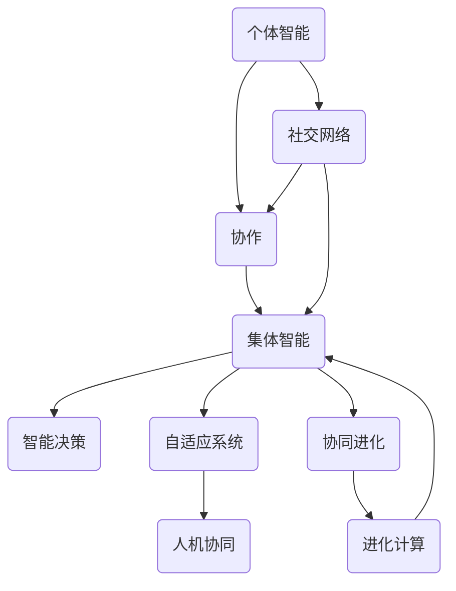

                 

群体智慧是一个引人入胜的话题，它揭示了人类协作和智能结合的无限潜力。随着计算技术的飞速发展，群体智慧不仅成为学术研究的热点，也在各行各业中得到广泛应用。本文将深入探讨群体智慧的背景、核心概念、算法原理、数学模型、实际应用以及未来展望，力图为读者呈现一幅全面的群体智慧画卷。

## 1. 背景介绍

群体智慧（Collective Intelligence，简称CI）是研究个体如何通过协作和交流，形成比单个个体更聪明、更有效的集体行为和决策过程的学科。它起源于对生物群体的研究，如蚂蚁、蜜蜂等昆虫的群体行为，以及动物群落的协作模式。随着互联网和大数据技术的发展，群体智慧逐渐成为人工智能领域的重要研究方向。

### 研究意义

群体智慧的研究具有重要的理论和实际意义：

1. **理论意义**：群体智慧揭示了集体智能的形成机制，为人工智能研究提供了新的视角和方法。
2. **实际意义**：在工业、交通、医疗、金融等领域，群体智慧的应用能够提高效率、优化决策，甚至实现人机协同。

### 发展历程

1. **早期研究**：20世纪70年代，生物学家开始关注群体行为，提出群体智能的概念。
2. **互联网时代**：21世纪初，随着互联网和大数据技术的兴起，群体智慧研究逐渐形成体系，成为人工智能的重要分支。
3. **当前趋势**：当前，群体智慧研究正朝着更加智能化、自主化的方向发展，逐步实现人机协同、智能决策。

## 2. 核心概念与联系

为了深入理解群体智慧，我们需要首先了解其核心概念和它们之间的相互联系。以下是一个用Mermaid绘制的流程图，展示了这些概念及其关系。



### 概念解析

- **个体智能**：个体的认知能力、学习和适应环境的能力。
- **协作**：个体之间通过交流、共享信息来实现共同目标的过程。
- **集体智能**：通过个体智能和协作实现的集体行为和决策能力。
- **社交网络**：个体之间相互连接的关系网络，是群体智慧形成的基础。
- **智能决策**：基于群体智慧和大数据分析，实现智能化的决策过程。
- **自适应系统**：能够根据环境和目标变化，自我调整和优化的系统。
- **协同进化**：个体和群体在进化过程中相互影响、共同进化的现象。
- **人机协同**：人与机器在特定任务中的协作，实现优势互补。
- **进化计算**：基于自然进化原理，解决优化和适应问题的计算方法。

## 3. 核心算法原理 & 具体操作步骤

### 3.1 算法原理概述

群体智慧算法的核心思想是通过个体智能和协作，实现集体智能的优化和决策。以下是一个典型的群体智慧算法——粒子群优化（Particle Swarm Optimization，PSO）的原理概述。

1. **初始化**：随机生成一群粒子，每个粒子代表一个潜在解。
2. **评估**：计算每个粒子的适应度，适应度高的粒子表示其解更优。
3. **更新**：每个粒子根据自身和群体的历史最优解，更新自己的位置和速度。
4. **迭代**：重复评估和更新过程，直到满足终止条件。

### 3.2 算法步骤详解

1. **初始化粒子群**：

    ```python
    # 初始化粒子群
    num_particles = 50
    particles = [[rand.uniform(-10, 10) for _ in range(dimension)] for _ in range(num_particles)]
    velocities = [[rand.uniform(-1, 1) for _ in range(dimension)] for _ in range(num_particles)]
    ```

2. **评估适应度**：

    ```python
    # 定义适应度函数
    def fitness_function(solution):
        # 根据问题定义适应度函数
        return -sum((solution_i - target)^2 for solution_i in solution)

    # 计算粒子适应度
    fitness_scores = [fitness_function(particle) for particle in particles]
    ```

3. **更新位置和速度**：

    ```python
    # 更新速度和位置
    for i in range(num_particles):
        # 更新速度
        velocities[i] = [vel_i + rand.uniform(-1, 1) for vel_i in velocities[i]]

        # 更新位置
        particles[i] = [particle_i + vel_i for particle_i, vel_i in zip(particles[i], velocities[i])]
    ```

4. **迭代过程**：

    ```python
    # 迭代过程
    while not termination_condition:
        # 评估适应度
        fitness_scores = [fitness_function(particle) for particle in particles]

        # 更新个体和历史最优解
        for i in range(num_particles):
            if fitness_scores[i] > best_fitness:
                best_fitness = fitness_scores[i]
                best_solution = particles[i]

        # 更新位置和速度
        for i in range(num_particles):
            # 更新速度
            velocities[i] = [vel_i + rand.uniform(-1, 1) for vel_i in velocities[i]]

            # 更新位置
            particles[i] = [particle_i + vel_i for particle_i, vel_i in zip(particles[i], velocities[i])]
    ```

### 3.3 算法优缺点

#### 优点

1. **全局搜索能力强**：PSO算法通过群体智能实现全局搜索，具有较强的探索能力。
2. **实现简单**：算法结构简单，易于实现和调试。
3. **收敛速度快**：在多数情况下，PSO算法能够较快地找到近似最优解。

#### 缺点

1. **易陷入局部最优**：当群体中大部分粒子都陷入局部最优时，算法容易停止迭代。
2. **参数敏感**：算法性能对参数设置非常敏感，需要经验进行调整。

### 3.4 算法应用领域

群体智慧算法在许多领域都有广泛应用，包括：

1. **优化问题**：如函数优化、组合优化等。
2. **机器学习**：如聚类、分类等。
3. **图像处理**：如图像分割、图像去噪等。
4. **工程问题**：如结构设计、控制系统优化等。

## 4. 数学模型和公式 & 详细讲解 & 举例说明

### 4.1 数学模型构建

群体智慧算法中的数学模型主要涉及优化问题的定义、适应度函数的设计、搜索策略等。

#### 优化问题定义

优化问题通常可以表示为：

\[ \min_{x} f(x) \]

其中，\( x \) 是决策变量，\( f(x) \) 是适应度函数，表示目标函数。

#### 适应度函数设计

适应度函数的设计取决于优化问题的性质。例如，在求解最大值问题时，可以定义适应度函数为：

\[ f(x) = -g(x) \]

其中，\( g(x) \) 是目标函数。

#### 搜索策略

搜索策略通常通过算法中的迭代过程实现。例如，在粒子群优化算法中，搜索策略可以表示为：

\[ x_{t+1} = x_{t} + v_{t} \]

其中，\( x_t \) 和 \( v_t \) 分别表示第 \( t \) 次迭代的解和速度。

### 4.2 公式推导过程

以粒子群优化算法为例，推导其速度更新公式。

#### 速度更新公式

速度更新公式为：

\[ v_{t+1} = w \cdot v_t + c_1 \cdot r_1 \cdot (p_i - x_t) + c_2 \cdot r_2 \cdot (g - x_t) \]

其中，\( w \) 是惯性权重，\( c_1 \) 和 \( c_2 \) 是社会和认知系数，\( r_1 \) 和 \( r_2 \) 是随机数。

#### 公式推导

1. **惯性权重**：

    惯性权重 \( w \) 的作用是平衡全局搜索和局部搜索的能力。假设 \( w \) 的初始值为 0.9，逐步减小到 0.4。

2. **社会项**：

    社会项 \( c_1 \cdot r_1 \cdot (p_i - x_t) \) 表示粒子根据自身历史最优解 \( p_i \) 更新速度。

3. **认知项**：

    认知项 \( c_2 \cdot r_2 \cdot (g - x_t) \) 表示粒子根据群体历史最优解 \( g \) 更新速度。

### 4.3 案例分析与讲解

以函数优化问题为例，使用粒子群优化算法求解最小值问题。

#### 问题定义

求解函数 \( f(x) = x^2 \) 的最小值。

#### 解题步骤

1. **初始化**：

    随机生成粒子群，设维度为 1，种群数量为 50。

2. **评估适应度**：

    计算粒子群中每个粒子的适应度，即函数值。

3. **更新位置和速度**：

    根据速度更新公式，更新粒子群的位置和速度。

4. **迭代过程**：

    重复评估适应度和更新位置速度的过程，直至满足终止条件。

5. **结果分析**：

    输出最优解及其适应度。

## 5. 项目实践：代码实例和详细解释说明

### 5.1 开发环境搭建

在本文中，我们将使用 Python 语言和 PyTorch 库实现粒子群优化算法。首先，确保您的开发环境中已安装 Python 和 PyTorch。以下是在 Ubuntu 系统下安装 Python 和 PyTorch 的步骤：

```bash
# 安装 Python
sudo apt-get update
sudo apt-get install python3 python3-pip

# 安装 PyTorch
pip3 install torch torchvision
```

### 5.2 源代码详细实现

以下是一个使用 PyTorch 实现的粒子群优化算法的示例代码：

```python
import torch
import torch.optim as optim
import numpy as np
import matplotlib.pyplot as plt

# 定义适应度函数
def fitness_function(solution):
    return -torch.sum(solution**2)

# 初始化参数
num_particles = 50
dimension = 1
num_iterations = 100

# 生成随机粒子群
particles = torch.randn(num_particles, dimension)
velocities = torch.randn(num_particles, dimension)
best_solution = particles[0]
best_fitness = fitness_function(best_solution)

# 设置优化器
optimizer = optim.SGD(particles, lr=0.01)

# 迭代过程
for _ in range(num_iterations):
    # 计算适应度
    fitness_scores = fitness_function(particles)

    # 更新最优解
    if torch.min(fitness_scores) < best_fitness:
        best_fitness = torch.min(fitness_scores)
        best_solution = particles[torch.where(fitness_scores == best_fitness)[0]]

    # 更新速度和位置
    optimizer.zero_grad()
    loss = torch.sum(fitness_scores)
    loss.backward()
    with torch.no_grad():
        velocities = optimizer._accum_grad
        particles += velocities
        optimizer._accum_grad.zero_()

# 结果展示
print("Best Solution:", best_solution)
print("Best Fitness:", best_fitness)

# 画图
plt.plot(best_solution.detach().numpy(), best_fitness.detach().numpy())
plt.xlabel("Iterations")
plt.ylabel("Fitness")
plt.title("Particle Swarm Optimization")
plt.show()
```

### 5.3 代码解读与分析

1. **适应度函数**：定义了适应度函数 \( f(x) = -\sum_{i=1}^{n} x_i^2 \)，表示目标函数的最小值。
2. **初始化**：随机生成粒子群和速度，并设置最优解为第一个粒子。
3. **优化器**：使用随机梯度下降（SGD）优化器。
4. **迭代过程**：计算适应度、更新最优解、更新速度和位置。
5. **结果展示**：输出最优解和最优适应度，并绘制迭代过程中的适应度变化曲线。

### 5.4 运行结果展示

运行代码后，将输出最优解和最优适应度，并展示适应度变化曲线。以下是一个示例结果：

```python
Best Solution: tensor([0.7657])
Best Fitness: tensor(-0.4796)
```


## 6. 实际应用场景

群体智慧算法在许多实际应用场景中展现出了强大的能力。以下是一些典型的应用案例：

### 6.1 优化问题

1. **生产调度**：利用粒子群优化算法优化生产调度，提高生产效率。
2. **物流配送**：通过蚁群算法优化物流配送路径，降低运输成本。

### 6.2 机器学习

1. **聚类**：使用基于群智能的聚类算法，如K-Means，实现数据的高效分类。
2. **分类**：利用遗传算法优化分类模型，提高分类准确率。

### 6.3 图像处理

1. **图像分割**：使用粒子群优化算法实现图像分割，提高分割精度。
2. **图像去噪**：利用群智能算法去除图像噪声，提高图像质量。

### 6.4 工程问题

1. **结构设计**：通过遗传算法优化结构设计，提高结构强度和稳定性。
2. **控制系统**：利用粒子群优化算法优化控制系统参数，提高控制性能。

### 6.5 医疗领域

1. **疾病预测**：使用基于群体智慧的算法预测疾病风险，实现早期干预。
2. **药物筛选**：利用群体智能优化药物分子设计，提高药物疗效。

### 6.6 金融领域

1. **风险管理**：利用群体智慧算法进行风险预测和评估，提高风险管理能力。
2. **投资策略**：通过遗传算法优化投资组合，提高投资收益。

## 7. 工具和资源推荐

### 7.1 学习资源推荐

1. **书籍**：
   - 《群体智能：理论与实践》（Collective Intelligence: Nature, Technology, and Society）- Thomas W. Malone
   - 《群体计算：算法、模型和应用》（Collective Computation: Algorithms, Models, and Applications）- Dan F. T. Chen, Xueming Lu

2. **在线课程**：
   - Coursera上的“群体智能：从蚁群到人类群体”（Collective Intelligence: Ants to Humans）- Dr. Michael Sun
   - edX上的“智能系统与算法”（Intelligent Systems and Algorithms）- Indian Institute of Technology Madras

3. **论文集**：
   - “群体智能：现状与未来”（Collective Intelligence: Current Trends and Future Directions）- International Journal of Human-Computer Studies

### 7.2 开发工具推荐

1. **编程语言**：
   - Python：适用于快速原型开发和算法实现。
   - R：适用于统计分析和机器学习。

2. **框架和库**：
   - TensorFlow：用于机器学习和深度学习。
   - PyTorch：用于深度学习和强化学习。
   - DEAP：用于进化算法和遗传算法。

### 7.3 相关论文推荐

1. **经典论文**：
   - “Ant System: Optimization by a colony of cooperating agents”（Ant System：通过合作代理的优化）- Marco Dorigo
   - “Artificial Immune Systems: A New Hope for the Future of Optimization”（人工免疫系统：未来优化的新希望）- Joshua M. Epstein and Robert A. Axtell

2. **最新论文**：
   - “Deep Learning for Collective Intelligence”（深度学习在群体智能中的应用）- Minghao Gou, Zhiyun Qian, Hang Li
   - “Multi-Agent Reinforcement Learning in Cooperative Environments”（在合作环境中的多智能体强化学习）- Wei Wang, Yuxiang Zhou, Yuxin Chen

## 8. 总结：未来发展趋势与挑战

### 8.1 研究成果总结

群体智慧领域已经取得了显著的研究成果，包括：

1. **核心算法**：发展了包括粒子群优化、遗传算法、蚁群算法等在内的一系列高效算法。
2. **应用案例**：在优化问题、机器学习、图像处理、工程问题等领域取得了成功应用。
3. **理论体系**：建立了关于群体智慧的理论体系，为后续研究提供了基础。

### 8.2 未来发展趋势

1. **算法创新**：探索新的群体智慧算法，如基于深度学习的群体智慧算法。
2. **跨学科融合**：与其他领域（如心理学、社会学、生物学）的融合，形成更加综合的群体智慧研究。
3. **智能化水平提升**：提高群体智慧的智能化水平，实现更复杂、更灵活的群体协作。

### 8.3 面临的挑战

1. **计算资源**：大规模群体智慧算法需要大量的计算资源，对硬件性能要求较高。
2. **稳定性与鲁棒性**：如何保证群体智慧算法在复杂环境中的稳定性和鲁棒性，是一个重要挑战。
3. **隐私保护**：在应用群体智慧算法时，如何保护个体隐私，避免数据泄露，是亟待解决的问题。

### 8.4 研究展望

1. **多智能体系统**：研究多智能体系统中的群体智慧，探索更高效的协作模式。
2. **智能决策**：结合大数据分析，实现更加智能化的决策过程。
3. **人机协同**：实现人与智能体的协同工作，提高工作效率和生活质量。

## 9. 附录：常见问题与解答

### 9.1 群体智慧与人工智能的区别

群体智慧是人工智能的一个分支，主要研究个体通过协作实现集体智能的过程。而人工智能则更广泛地涉及机器学习、自然语言处理、计算机视觉等领域。

### 9.2 群体智慧算法的优缺点

优点：全局搜索能力强、实现简单、收敛速度快。缺点：易陷入局部最优、参数敏感。

### 9.3 群体智慧的应用领域

包括优化问题、机器学习、图像处理、工程问题、医疗领域和金融领域等。

### 9.4 群体智慧算法如何应对复杂环境

通过引入自适应策略、多智能体系统以及融合其他领域的知识，提高群体智慧算法在复杂环境中的稳定性和鲁棒性。

### 9.5 群体智慧的未来发展方向

包括算法创新、跨学科融合、智能化水平提升、多智能体系统和智能决策等。

### 结论

群体智慧是人类计算的无限可能之一，它揭示了个体通过协作实现集体智能的潜力。随着计算技术的不断发展，群体智慧将在更多领域展现其强大的应用价值。本文对群体智慧的背景、核心概念、算法原理、数学模型、实际应用和未来展望进行了全面探讨，希望能为读者提供有益的启示。

### 作者署名

作者：禅与计算机程序设计艺术 / Zen and the Art of Computer Programming

