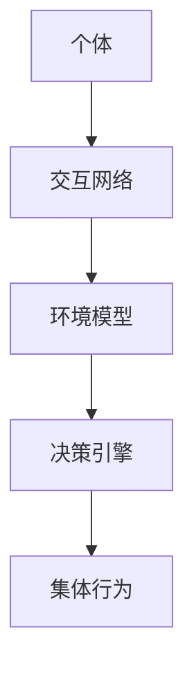

                 

关键词：群体智慧、集体决策、分布式算法、协作系统、复杂性科学、人工智能、大数据分析、社会网络、演化算法、认知建模、网络效应、平台经济学。

## 摘要

在复杂多变的世界中，决策的复杂性日益增加，单一主体的局限性变得愈发明显。本文探讨了群体智慧作为一种新的决策引擎，如何通过集体智慧实现高效、准确的决策过程。我们将深入探讨群体智慧的核心概念、理论基础、算法原理及应用领域，结合数学模型和实际项目案例，揭示群体智慧在推动社会进步、科技创新及企业竞争中的巨大潜力。

## 1. 背景介绍

随着信息技术的飞速发展和大数据时代的来临，个体获取和处理信息的能力逐渐增强。然而，面对复杂的问题和巨大的数据量，个体往往显得力不从心。单一主体的决策能力受到认知局限、信息不对称及计算能力限制的制约。与此同时，复杂系统的研究表明，集体行为往往能够产生比个体行为更优的结果。这一现象在自然界、经济和社会系统中得到了广泛的验证。

例如，蜜蜂的群体行为展示了惊人的智慧，单个蜜蜂通过简单的“跳舞”方式传递信息，整个蜂群能够高效地找到食物源和最佳路径。类似的，鸟群的迁徙、鱼群的游动和狼群的狩猎都体现了群体智慧的力量。人类社会的协同工作、集体决策和团队合作也不断证明，个体通过协作能够实现更高的效率和创新。

### 1.1 群体智慧的概念

群体智慧（Swarm Intelligence）是指通过个体的简单交互和分布式计算，群体整体表现出复杂、智能的行为和决策能力。这种智慧不是单个个体的智能累加，而是一种全新的集体智能形式。在群体智慧中，个体通常没有全局视角，但通过局部信息交换和规则遵循，能够实现全局优化的目标。

### 1.2 群体智慧的应用领域

群体智慧在多个领域展现出巨大的应用潜力，包括但不限于：

- **社会网络分析**：通过对个体行为和互动的研究，分析社会结构和关系，预测行为趋势和传播模式。
- **交通管理**：通过智能交通系统，优化交通流和减少拥堵，提高交通效率。
- **供应链管理**：通过群体智慧优化库存管理、需求预测和物流调度。
- **金融市场预测**：通过群体智慧和大数据分析，提高市场预测的准确性和投资策略的优化。
- **生物医学**：在基因组学、药物研发和个性化医疗中，群体智慧能够提供更有效的解决方案。
- **能源管理**：在智能电网和可再生能源系统中，群体智慧优化能源分配和调度。

## 2. 核心概念与联系

### 2.1 核心概念

#### 群体
群体是由多个个体组成的集合，每个个体都有一定的行为和能力。在群体智慧系统中，个体通常通过简单的规则进行交互和协作。

#### 分布式计算
分布式计算是指将计算任务分布在多个节点上，通过节点之间的协作和通信实现任务的目标。分布式计算是群体智慧实现高效决策的关键技术。

#### 集体行为
集体行为是指群体中个体在交互和协作中形成的整体行为模式。集体行为通常表现出复杂的智能特征，如自组织、自适应和自优化。

### 2.2 群体智慧的架构

群体智慧系统通常由以下几个关键组件构成：

- **个体**：系统中的每个个体都有一定的能力和行为规则。
- **交互网络**：个体之间的通信和交互方式，决定了群体的整体行为和决策过程。
- **环境模型**：个体对环境的感知和理解，影响其行为选择。
- **决策引擎**：通过群体交互和计算，实现群体智能决策的核心算法。

### 2.3 Mermaid 流程图



## 3. 核心算法原理 & 具体操作步骤

### 3.1 算法原理概述

群体智慧的核心算法通常基于以下几个原理：

- **局部规则**：个体仅根据局部信息做出决策，遵循简单的规则。
- **协同效应**：个体通过交互和协作，实现整体智能的提升。
- **自组织**：群体在动态环境中能够自发形成有效的结构和行为模式。
- **自适应**：个体和群体能够根据环境变化调整行为和决策规则。

### 3.2 算法步骤详解

群体智慧算法的具体步骤通常包括：

1. **初始化**：设定个体的初始状态和规则。
2. **感知**：个体感知环境信息，包括自身状态和其他个体状态。
3. **决策**：个体根据感知到的信息，利用简单的规则进行决策。
4. **交互**：个体与其他个体进行信息交换和协作。
5. **更新**：根据交互结果更新个体状态和规则。
6. **评估**：评估群体行为的效率和效果，进行反馈和调整。

### 3.3 算法优缺点

#### 优点

- **高效性**：通过分布式计算和协同效应，群体智慧能够快速处理复杂问题。
- **灵活性**：个体和群体能够根据环境变化自适应调整行为。
- **鲁棒性**：在面对不确定性和动态环境时，群体智慧具有较好的鲁棒性。

#### 缺点

- **信息冗余**：个体之间的信息交换可能导致信息冗余和通信成本。
- **计算复杂度**：随着个体数量的增加，算法的计算复杂度可能急剧上升。
- **局部最优**：在某些情况下，群体智慧可能陷入局部最优，难以达到全局最优。

### 3.4 算法应用领域

群体智慧算法在多个领域都有广泛的应用，包括：

- **智能交通**：通过群体智慧优化交通流和减少拥堵。
- **金融风控**：通过群体智慧进行市场预测和风险评估。
- **供应链管理**：通过群体智慧优化库存管理和物流调度。
- **生物医学**：通过群体智慧进行基因组分析和疾病预测。
- **社会网络分析**：通过群体智慧分析社会结构和行为模式。

## 4. 数学模型和公式 & 详细讲解 & 举例说明

### 4.1 数学模型构建

群体智慧算法通常涉及到以下数学模型：

- **个体状态模型**：描述个体在某一时刻的状态。
- **交互模型**：描述个体之间的交互方式。
- **决策模型**：描述个体如何根据感知到的信息做出决策。
- **评估模型**：描述群体行为的效率和效果。

### 4.2 公式推导过程

以下是一个简化的群体智慧算法的数学模型：

- **个体状态更新**：$$s_t^{i} = s_t^{i-1} + \Delta s_t^i$$
- **交互更新**：$$s_t^{i} = \sum_{j \in N_i} w_{ij} s_t^{j}$$
- **决策更新**：$$d_t^{i} = f(s_t^{i}, a_t^{i})$$
- **评估更新**：$$e_t = g(d_t)$$

其中，$s_t^{i}$表示个体在时刻$t$的状态，$d_t^{i}$表示个体在时刻$t$的决策，$e_t$表示群体在时刻$t$的评估。$N_i$表示与个体$i$交互的其他个体集合，$w_{ij}$表示个体$i$与个体$j$之间的权重。

### 4.3 案例分析与讲解

假设一个简单的群体智慧算法用于优化交通流。个体代表道路上的车辆，状态包括位置、速度和方向。个体之间的交互通过传感器网络实现。个体在某一时刻根据感知到的信息（如前方车辆的位置和速度）做出决策（如加速或减速）。群体的评估基于整体交通流的效率和安全性。

**案例1**：假设一辆车在某一时刻感知到前方有车辆减速，根据交互模型和决策模型，这辆车也会减速。这样，整个交通流能够在短时间内实现平滑过渡，减少拥堵。

**案例2**：假设一辆车在某一时刻感知到前方道路拥堵，根据评估模型，这辆车可能会选择转向其他道路，以减少整体交通压力。

通过这个案例，我们可以看到群体智慧算法如何通过简单的规则和分布式计算，实现复杂交通系统的优化。

## 5. 项目实践：代码实例和详细解释说明

### 5.1 开发环境搭建

为了演示群体智慧算法的应用，我们选择Python作为开发语言，使用Pandas库进行数据处理，使用NetworkX库构建交互网络，使用matplotlib库进行可视化。

```bash
pip install pandas networkx matplotlib
```

### 5.2 源代码详细实现

以下是一个简单的群体智慧算法实现：

```python
import pandas as pd
import numpy as np
import networkx as nx
import matplotlib.pyplot as plt

# 初始化个体状态
num_vehicles = 10
positions = np.random.uniform(0, 100, num_vehicles)
velocities = np.random.uniform(0, 10, num_vehicles)
directions = np.random.uniform(0, 2 * np.pi, num_vehicles)

# 构建交互网络
G = nx.Graph()
G.add_nodes_from(range(num_vehicles))
for i in range(num_vehicles):
    for j in range(i + 1, num_vehicles):
        G.add_edge(i, j)

# 定义交互模型和决策模型
def interact(position_i, velocity_i, direction_i, position_j, velocity_j, direction_j):
    # 计算交互权重
    distance = abs(position_i - position_j)
    weight = 1 / (1 + distance)
    # 更新速度和方向
    velocity_i_new = velocity_i + weight * (velocity_j - velocity_i)
    direction_i_new = direction_i + weight * (direction_j - direction_i)
    return velocity_i_new, direction_i_new

# 运行群体智慧算法
for t in range(100):
    # 更新个体状态
    for i in range(num_vehicles):
        # 感知其他个体状态
        neighbors = G.neighbors(i)
        positions[i], velocities[i], directions[i] = positions[i], velocities[i], directions[i]
        for j in neighbors:
            position_j, velocity_j, direction_j = positions[j], velocities[j], directions[j]
            # 更新速度和方向
            velocities[i], directions[i] = interact(positions[i], velocities[i], directions[i], position_j, velocity_j, direction_j)

# 可视化群体行为
nx.draw(G, with_labels=True)
plt.scatter(*zip(*positions))
plt.show()
```

### 5.3 代码解读与分析

- **初始化个体状态**：使用随机数生成个体的初始位置、速度和方向。
- **构建交互网络**：使用NetworkX库构建一个无向图，表示个体之间的交互关系。
- **定义交互模型和决策模型**：交互模型用于计算个体之间的交互权重，决策模型用于更新个体的速度和方向。
- **运行群体智慧算法**：在指定的时间步内，根据交互模型和决策模型，更新个体的状态。
- **可视化群体行为**：使用matplotlib库将群体行为可视化，展示个体在交互过程中的位置变化。

通过这个案例，我们可以看到如何使用简单的Python代码实现一个群体智慧算法，模拟个体在交互过程中形成集体行为的过程。

## 6. 实际应用场景

群体智慧在多个实际应用场景中展现出强大的应用潜力。以下是几个典型的应用场景：

### 6.1 智能交通系统

在智能交通系统中，群体智慧可以用于优化交通流，减少拥堵，提高交通效率。通过部署传感器网络和车辆之间的通信，车辆能够实时感知周围交通状况，根据群体智慧算法动态调整速度和行驶方向。例如，在高峰时段，通过车辆间的协同工作，可以避免交通堵塞，提高道路通行能力。

### 6.2 金融风控

在金融领域中，群体智慧可以用于市场预测和风险评估。通过分析大量交易数据，个体投资者可以利用群体智慧算法形成共识，提高市场预测的准确性。此外，在风险管理方面，群体智慧可以帮助金融机构识别潜在风险，制定更加有效的风险控制策略。

### 6.3 供应链管理

在供应链管理中，群体智慧可以优化库存管理、需求预测和物流调度。通过个体企业之间的信息共享和协同工作，可以更好地应对市场需求变化，提高供应链的整体效率。例如，在供应链网络中，个体企业可以通过群体智慧算法动态调整库存水平，避免库存过剩或短缺。

### 6.4 生物医学

在生物医学领域，群体智慧可以用于基因组分析、药物研发和个性化医疗。通过群体智慧算法，可以更好地理解基因与疾病之间的关系，发现新的药物靶点。此外，个性化医疗可以根据个体患者的基因信息，提供更加精准的治疗方案。

### 6.5 社会网络分析

在社会网络分析中，群体智慧可以用于研究社会结构和行为模式。通过分析个体之间的互动关系，可以揭示社会网络中的关键节点和影响力。例如，在疫情防控中，通过群体智慧算法，可以识别高风险个体，制定更加有效的防控措施。

## 7. 未来应用展望

群体智慧作为一种新兴的决策引擎，在未来具有广阔的应用前景。以下是一些未来的应用展望：

### 7.1 智慧城市建设

智慧城市的发展离不开群体智慧的应用。通过部署智能传感器和通信设备，城市中的个体（如行人、车辆、设备等）可以形成智能群体，实现城市资源的优化配置和高效管理。例如，智慧交通系统可以通过群体智慧优化交通流，提高道路通行效率；智慧能源系统可以通过群体智慧实现能源的高效利用和调度。

### 7.2 人工智能协同工作

人工智能的协同工作离不开群体智慧的支持。通过群体智慧算法，可以更好地协调不同人工智能系统之间的合作，实现更高效、更智能的决策。例如，在智能制造中，通过群体智慧优化生产流程，提高生产效率和产品质量；在智能客服中，通过群体智慧提高客户服务质量，降低企业运营成本。

### 7.3 生物医学研究

生物医学研究面临着复杂的数据分析和计算任务。群体智慧算法可以提供有效的解决方案，帮助研究人员从海量数据中挖掘有价值的信息。例如，在基因组学研究中，通过群体智慧分析大规模基因组数据，可以更好地理解基因与疾病之间的关系，推动新药研发和个性化医疗的发展。

### 7.4 社会治理

社会治理的复杂性日益增加，群体智慧可以提供新的治理思路和方法。通过群体智慧算法，可以更好地理解和预测社会行为，提高社会治理的效率和效果。例如，在公共安全管理中，通过群体智慧实时监测和分析社会动态，提高公共安全预警和应对能力；在疫情防控中，通过群体智慧优化防疫策略，提高疫情防控的精准度和有效性。

## 8. 工具和资源推荐

### 8.1 学习资源推荐

- **《群体智能：原理与应用》**：这是一本关于群体智能的全面介绍，涵盖了群体智能的基础理论、算法和应用案例。
- **《复杂性科学导论》**：这本书介绍了复杂性科学的基本概念和方法，对于理解群体智慧的理论基础有很大帮助。
- **在线课程**：例如Coursera上的《群体智能与复杂系统》课程，提供了丰富的理论和实践知识。

### 8.2 开发工具推荐

- **Python**：Python是一种简单易学的编程语言，适用于开发群体智慧算法。
- **Pandas**：用于数据处理和统计分析。
- **NetworkX**：用于构建和分析复杂网络。
- **matplotlib**：用于数据可视化。

### 8.3 相关论文推荐

- **“Swarm Intelligence in Artificial Life”**：这是一篇关于人工生命和群体智能的经典论文。
- **“Coevolving Neural Networks and the Complexity of Behavioural Evolution”**：探讨了神经网络在群体智能中的应用。
- **“The Physics of Social Dynamics”**：分析了社会动力学中的群体行为。

## 9. 总结：未来发展趋势与挑战

### 9.1 研究成果总结

群体智慧作为一种新兴的决策引擎，在复杂系统优化、智能交通、金融风控、生物医学和社会治理等领域展现出巨大的应用潜力。通过个体简单交互和分布式计算，群体智慧能够实现高效、灵活和鲁棒的决策过程。

### 9.2 未来发展趋势

未来，群体智慧的发展将朝着以下方向发展：

- **跨领域应用**：群体智慧将在更多领域得到应用，如智能制造、智慧医疗、智慧城市等。
- **算法优化**：随着计算能力的提升，群体智慧算法将变得更加高效和精确。
- **理论与实证结合**：未来研究将更加注重理论与实践的结合，探索群体智慧的内在机制和优化方法。

### 9.3 面临的挑战

群体智慧的发展也面临一些挑战：

- **计算复杂度**：随着个体数量的增加，算法的计算复杂度可能急剧上升，需要更高效的算法和计算资源。
- **隐私保护**：群体智慧算法需要处理大量个体数据，如何保护隐私是一个重要问题。
- **理论深化**：群体智慧的理论基础尚不完善，需要进一步深入研究。

### 9.4 研究展望

未来，群体智慧的研究将继续深入，有望在以下方向取得突破：

- **复杂性科学**：将复杂性科学的理论和方法应用于群体智慧研究，揭示群体智慧的内在机制。
- **跨学科研究**：将计算机科学、数学、生物学和社会科学等多学科知识融合，推动群体智慧的发展。
- **应用创新**：结合实际需求，开发更加实用、高效的群体智慧应用系统。

## 附录：常见问题与解答

### 问题1：群体智慧与人工智能有何区别？

群体智慧是一种集体智能形式，强调个体之间的协作和分布式计算。而人工智能（AI）是一种模拟人类智能的技术，强调机器的学习、推理和决策能力。群体智慧是人工智能的一个子领域，关注个体之间的协同效应和集体行为。

### 问题2：群体智慧算法在计算资源有限的情况下如何优化？

在计算资源有限的情况下，可以通过以下方法优化群体智慧算法：

- **简化模型**：简化算法模型，减少计算复杂度。
- **分布式计算**：利用分布式计算资源，提高算法的并行计算能力。
- **数据预处理**：对数据进行预处理，减少冗余信息，提高数据质量。

### 问题3：群体智慧算法在应对动态环境时有哪些挑战？

群体智慧算法在应对动态环境时面临以下挑战：

- **实时响应**：需要快速处理环境变化，提高算法的实时性。
- **不确定性处理**：面对不确定性和随机性，需要算法具有较好的鲁棒性和适应性。
- **通信延迟**：个体之间的通信延迟可能导致算法性能下降，需要优化通信机制。

## 作者署名

作者：禅与计算机程序设计艺术 / Zen and the Art of Computer Programming

通过这篇文章，我们深入探讨了群体智慧作为一种新的决策引擎，如何在复杂多变的环境中实现高效、准确的决策。群体智慧不仅在理论上具有重要意义，更在多个实际应用领域中展现出巨大的潜力。未来，随着技术的不断进步和研究的深入，群体智慧将继续推动社会进步和科技创新。希望本文能够为读者提供有益的启示和思考。

