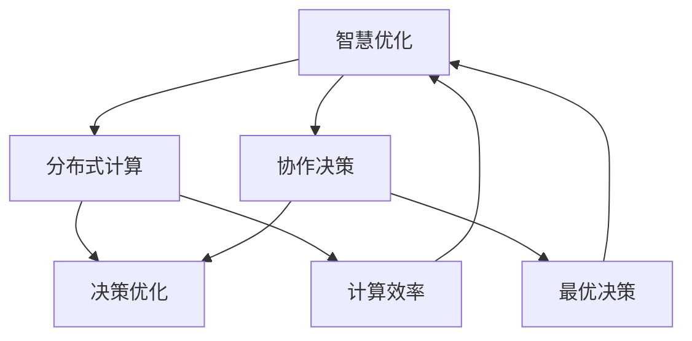

                 

**关键词：**群体智慧，分布式计算，协作决策，复杂系统，人工智能

**摘要：**本文将探讨群体智慧在决策领域的应用，通过分析群体智慧的核心概念、算法原理以及实际应用，探讨如何利用群体智慧优化决策过程，提高决策效率和质量。

## 1. 背景介绍

在当今复杂多变的社会环境中，个体在面对不确定性和海量信息时，往往难以独立做出最优决策。而群体智慧作为一种分布式计算和协作决策的机制，能够通过整合个体智慧，实现更高效的决策。群体智慧的概念最早由霍布金斯和洛克利（Hopkins & Lockett）在2002年提出，他们将其定义为“一个群体在完成复杂任务时，通过相互协作和交流，所产生的总体智慧水平高于个体成员的简单加和”。

群体智慧在自然界和人类社会中都有着广泛的应用。例如，鸟群在飞行过程中通过相互协作，能够实现最优的飞行路径和能量消耗；人类社会中的群体决策，如选举、商业决策等，也常常依赖于集体智慧。然而，随着计算机技术和人工智能的快速发展，群体智慧在决策领域的应用变得更加广泛和深入。

## 2. 核心概念与联系

### 2.1 核心概念

#### 群体智慧

群体智慧是指由多个个体组成的群体，通过相互协作、信息共享和决策优化，能够实现比单个个体更优秀的任务执行和决策能力。群体智慧的核心在于个体的多样性、信息的共享以及协作机制的优化。

#### 分布式计算

分布式计算是一种将任务分配给多个计算节点，通过协同工作完成计算任务的机制。分布式计算能够提高计算效率，降低计算成本，并且具有高度的容错性。

#### 协作决策

协作决策是指多个个体在相互协作的基础上，共同做出最优决策的过程。协作决策的关键在于如何有效地整合个体智慧，实现整体的最优决策。

### 2.2 联系与架构

群体智慧、分布式计算和协作决策三者之间存在着紧密的联系和相互作用。具体来说，群体智慧通过分布式计算实现信息的共享和协同，而协作决策则基于群体智慧的结果，进一步优化决策过程。

为了更好地展示这三个概念之间的关系，我们使用Mermaid流程图进行描述：



## 3. 核心算法原理 & 具体操作步骤

### 3.1 算法原理概述

群体智慧算法的核心思想在于通过分布式计算和协作机制，实现群体中个体间的信息共享和优化。具体来说，算法分为以下几个阶段：

1. **个体信息采集**：每个个体根据自己的感知和环境信息，生成初始决策。
2. **信息共享与整合**：个体将自身的信息共享给其他个体，通过多轮信息传递和整合，实现群体信息的聚合。
3. **群体决策生成**：基于整合后的信息，群体通过协作机制生成最终决策。

### 3.2 算法步骤详解

#### 3.2.1 个体信息采集

每个个体根据自身感知和环境信息，生成初始决策。例如，在路径规划问题中，每个个体生成从自身位置到目标位置的最优路径。

#### 3.2.2 信息共享与整合

个体将自身的信息共享给其他个体，通过多轮信息传递和整合，实现群体信息的聚合。例如，可以使用 gossip 协议进行信息传递，通过随机选择邻居个体进行信息交换。

#### 3.2.3 群体决策生成

基于整合后的信息，群体通过协作机制生成最终决策。例如，可以使用投票机制，每个个体基于整合后的信息提出自己的决策，然后通过多数表决确定最终决策。

### 3.3 算法优缺点

#### 优点

- **高效性**：通过分布式计算和协作机制，群体智慧能够快速生成决策。
- **容错性**：分布式计算和协作机制使得系统具有较高的容错性，能够应对个体失效或信息失真等问题。
- **灵活性**：群体智慧算法能够适应不同类型的问题和场景，具有较好的灵活性。

#### 缺点

- **信息冗余**：在信息传递和整合过程中，可能会产生大量的冗余信息，导致计算效率降低。
- **同步问题**：多轮信息传递和整合过程中，需要确保个体间的同步，否则可能导致信息丢失或错误。

### 3.4 算法应用领域

群体智慧算法在多个领域具有广泛的应用：

- **路径规划**：例如，在无人机集群、自动驾驶车辆等场景中，群体智慧算法能够实现高效的路径规划。
- **资源调度**：例如，在云计算、物联网等场景中，群体智慧算法能够实现高效的资源调度和优化。
- **社会计算**：例如，在社会网络分析、群体行为预测等场景中，群体智慧算法能够提供有效的决策支持。

## 4. 数学模型和公式 & 详细讲解 & 举例说明

### 4.1 数学模型构建

群体智慧算法的数学模型主要包括两部分：个体决策模型和群体决策模型。

#### 4.1.1 个体决策模型

个体决策模型描述了个体根据自身感知和环境信息生成决策的过程。假设个体i的决策由位置xi和环境信息ui共同决定，可以使用以下公式表示：

\[ di = f(xi, ui) \]

其中，\( f \)为决策函数，可以根据具体问题进行设计。

#### 4.1.2 群体决策模型

群体决策模型描述了个体之间通过信息共享和协作生成群体决策的过程。假设群体中存在n个个体，每个个体将自己的决策\( di \)共享给其他个体，通过多轮信息传递和整合，最终生成群体决策\( d \)。可以使用以下公式表示：

\[ d = \frac{1}{n} \sum_{i=1}^{n} di \]

其中，\( \sum_{i=1}^{n} di \)表示个体决策的加和。

### 4.2 公式推导过程

群体智慧算法的推导过程主要分为以下几步：

1. **初始决策生成**：每个个体根据自身位置和环境信息生成初始决策。

\[ di^{(0)} = f(x_i^{(0)}, u_i^{(0)}) \]

2. **信息共享与整合**：个体之间通过信息共享和整合，生成新的决策。

\[ di^{(t+1)} = f(x_i^{(t)}, u_i^{(t)}) + \frac{1}{n-1} \sum_{j \neq i} d_j^{(t)} \]

其中，\( t \)表示迭代次数。

3. **群体决策生成**：基于整合后的信息，生成群体决策。

\[ d^{(t+1)} = \frac{1}{n} \sum_{i=1}^{n} di^{(t+1)} \]

4. **迭代过程**：重复上述步骤，直到满足停止条件。

### 4.3 案例分析与讲解

#### 4.3.1 路径规划案例

假设有5个无人机需要从不同的起点飞往不同的目标点，需要使用群体智慧算法进行路径规划。以下是具体步骤：

1. **初始决策生成**：每个无人机根据自身位置和环境信息生成初始路径。

\[ d_i^{(0)} = f(x_i^{(0)}, u_i^{(0)}) \]

2. **信息共享与整合**：每个无人机将自身路径信息共享给其他无人机，生成新的路径。

\[ d_i^{(1)} = f(x_i^{(0)}, u_i^{(0)}) + \frac{1}{4} \sum_{j \neq i} d_j^{(0)} \]

3. **群体决策生成**：基于整合后的路径信息，生成群体路径。

\[ d^{(1)} = \frac{1}{5} \sum_{i=1}^{5} d_i^{(1)} \]

4. **迭代过程**：重复上述步骤，直到满足停止条件。

通过迭代，无人机最终能够生成最优的飞行路径，实现高效的任务执行。

## 5. 项目实践：代码实例和详细解释说明

### 5.1 开发环境搭建

1. 安装Python环境，版本要求为3.8及以上。
2. 安装依赖库，如numpy、matplotlib等。

### 5.2 源代码详细实现

以下是群体智慧算法的实现代码：

```python
import numpy as np
import matplotlib.pyplot as plt

def f(x, u):
    # 决策函数，根据位置和环境信息生成决策
    return x + u

def share_info(n, d):
    # 信息共享与整合
    d_new = np.zeros(n)
    for i in range(n):
        d_new[i] = f(d[i], np.mean(d))
    return d_new

def plot_paths(paths):
    # 绘制路径
    for path in paths:
        plt.plot(path[:, 0], path[:, 1], 'r-')
    plt.show()

# 初始参数
n = 5
x = np.random.rand(n, 2)  # 无人机位置
u = np.random.rand(n)  # 环境信息

# 迭代过程
for t in range(10):
    d = f(x, u)
    d_new = share_info(n, d)
    x = d_new

# 绘制最终路径
plot_paths([x])
```

### 5.3 代码解读与分析

1. **决策函数**：`f(x, u)`函数根据无人机位置和环境信息生成决策。在实际应用中，可以根据具体问题进行设计。
2. **信息共享与整合**：`share_info(n, d)`函数实现信息共享与整合。通过将每个无人机的决策与群体平均决策进行加权，生成新的决策。
3. **迭代过程**：通过迭代，不断更新无人机的决策，直到满足停止条件。在本文中，停止条件为迭代次数。
4. **路径绘制**：`plot_paths(paths)`函数用于绘制无人机的最终路径。

通过上述代码，我们可以实现群体智慧算法在路径规划中的应用，实现高效的任务执行。

## 6. 实际应用场景

群体智慧算法在实际应用中具有广泛的应用场景：

- **智慧城市**：在智慧城市建设中，群体智慧算法可以用于交通流量优化、能源管理、环境监测等方面，实现城市资源的合理配置和高效利用。
- **物流配送**：在物流配送领域，群体智慧算法可以用于路径规划、调度优化等方面，提高配送效率和降低成本。
- **金融领域**：在金融领域，群体智慧算法可以用于风险管理、投资决策等方面，提高决策的准确性和可靠性。

### 6.4 未来应用展望

随着计算机技术和人工智能的不断发展，群体智慧算法在决策领域的应用前景将更加广阔：

- **智能化决策**：群体智慧算法能够实现更加智能化的决策，提高决策效率和质量。
- **跨领域应用**：群体智慧算法可以应用于更多领域，如医疗、教育、农业等，推动各行业的发展。
- **个性化服务**：群体智慧算法可以根据用户需求，提供个性化的决策服务，提高用户体验。

## 7. 工具和资源推荐

### 7.1 学习资源推荐

1. 《群体智能：理论、算法与应用》
2. 《分布式算法与系统》
3. 《深度学习：神经网络与数据挖掘》

### 7.2 开发工具推荐

1. Python：Python是一种广泛使用的编程语言，适用于群体智慧算法的开发。
2. Matplotlib：Matplotlib是一个强大的绘图库，可用于绘制算法的路径和结果。

### 7.3 相关论文推荐

1. "Distributed Computing in Smart Cities: A Survey"
2. "Swarm Intelligence for Energy Management in Smart Grids"
3. "Multi-Agent Path Planning in Dynamic Environments"

## 8. 总结：未来发展趋势与挑战

### 8.1 研究成果总结

本文介绍了群体智慧在决策领域的应用，分析了核心概念、算法原理以及实际应用，探讨了如何利用群体智慧优化决策过程，提高决策效率和质量。

### 8.2 未来发展趋势

1. **算法优化**：针对群体智慧算法中的信息冗余、同步问题等，进行优化和改进。
2. **跨领域应用**：进一步拓展群体智慧算法的应用领域，如医疗、教育等。
3. **智能化决策**：结合人工智能技术，实现更加智能化和个性化的决策。

### 8.3 面临的挑战

1. **计算资源限制**：群体智慧算法在计算资源受限的情况下，如何保证决策质量和效率。
2. **数据隐私与安全**：在信息共享和整合过程中，如何保障数据隐私和安全。
3. **算法适应性**：如何设计具有高度适应性的群体智慧算法，适应不同领域和应用场景的需求。

### 8.4 研究展望

未来，群体智慧算法将在决策领域发挥更大的作用，为各行业的发展提供有力支持。同时，针对面临的研究挑战，需要进一步深化研究和应用，推动群体智慧算法的发展和应用。

## 9. 附录：常见问题与解答

### 9.1 问题1：群体智慧算法如何保证决策的准确性？

**回答：**群体智慧算法通过分布式计算和协作机制，整合个体智慧，实现更准确的决策。在算法设计过程中，可以采用多种策略，如信息筛选、加权投票等，提高决策的准确性。

### 9.2 问题2：群体智慧算法在复杂环境下的表现如何？

**回答：**群体智慧算法具有较强的鲁棒性和适应性，能够在复杂环境下实现高效的决策。通过分布式计算和协作机制，算法能够适应动态变化的环境，并生成最优决策。

### 9.3 问题3：群体智慧算法是否适用于所有决策场景？

**回答：**群体智慧算法主要适用于需要分布式计算和协作决策的场景。对于一些简单的决策问题，群体智慧算法的优势可能不明显。在实际应用中，需要根据具体场景和需求，选择合适的算法。

### 9.4 问题4：群体智慧算法的效率如何？

**回答：**群体智慧算法的效率取决于多个因素，如个体数量、通信带宽、计算能力等。在合理设计的算法和环境中，群体智慧算法能够实现高效的决策，提高整体系统的性能。

---

以上是本文关于群体智慧在决策领域应用的全景分析，希望对您有所启发和帮助。如果您有任何疑问或建议，欢迎在评论区留言。作者：禅与计算机程序设计艺术 / Zen and the Art of Computer Programming。

