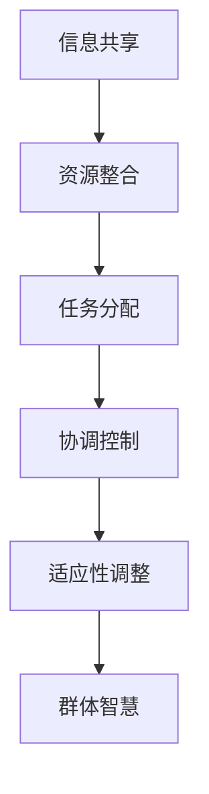

                 

关键词：群体智慧、分布式决策、复杂性科学、人工智能、协作、适应性系统、数据驱动决策、群体学习

> 摘要：本文探讨了群体智慧在决策过程中的重要性，通过分析群体智慧的基本概念、核心原理和应用场景，展示了如何在复杂系统中利用群体智慧实现高效决策。文章旨在为读者提供一个全面的技术视角，帮助理解群体智慧在各个领域中的应用潜力，以及未来研究的发展方向。

## 1. 背景介绍

### 复杂性与个体局限性

在现代社会，复杂性科学已经成为理解和解决各种复杂问题的理论基础。从生态系统的稳定性到经济市场的波动，从智能交通系统的设计到全球气候变化的影响，复杂性无处不在。然而，传统的以个体为中心的决策模型在面对高度复杂和不确定的环境时，往往显得力不从心。

个体决策的局限性主要体现在以下方面：

- **信息的不完全性**：个体往往只能获取部分信息，无法全面了解整个系统的状态。
- **认知的有限性**：人类认知能力的限制使得个体难以处理大量信息和复杂关系。
- **效率的瓶颈**：个体决策需要时间，而在动态复杂环境中，快速响应是关键。

### 群体智慧的兴起

与个体决策相对，群体智慧通过整合多个个体的智慧和资源，能够在复杂环境中实现更加灵活和高效的决策。群体智慧的核心思想在于分布式计算和协作机制，它依赖于以下几大要素：

- **多样性**：群体中个体的多样性能够提供丰富的信息和不同的视角，有助于发现问题和解决方案。
- **协作**：个体之间的协作能够增强信息共享和资源整合，提高决策的准确性。
- **适应性**：群体智慧能够快速适应环境变化，通过学习和调整策略来应对不确定性。

本文将深入探讨群体智慧的概念、原理和应用，以期为复杂系统中的决策提供新的方向。

## 2. 核心概念与联系

### 群体智慧的定义

群体智慧（Collective Intelligence）是指由多个个体组成的群体在相互协作中展现出的智慧和决策能力。这种智慧不仅体现在个体层面的智力，更重要的是群体层面的协调、共享和适应性。

### 核心原理

#### 分布式计算

分布式计算是指将一个复杂任务分解成多个子任务，并在多个计算节点上并行执行。这种方法能够大大提高计算效率和响应速度，特别适用于处理大规模数据和高复杂度的计算问题。

#### 协作机制

协作机制是群体智慧实现高效决策的关键。协作机制包括信息共享、资源整合、任务分配和协调控制等方面。通过这些机制，个体之间能够相互补充，形成整体优化的决策过程。

#### 适应性系统

适应性系统是指能够根据外部环境的变化自我调整和优化的系统。在复杂和不确定的环境中，适应性系统能够更好地应对变化，保持稳定性和可持续性。

### Mermaid 流程图

下面是一个用于描述群体智慧核心原理的 Mermaid 流程图：



### 关系分析

- **信息共享**是群体智慧的基石，通过信息共享，个体能够获取更全面的信息，从而做出更加准确的决策。
- **资源整合**和**任务分配**能够优化资源利用，提高整体效率。
- **协调控制**确保个体之间的协作不会出现混乱，保持决策的一致性。
- **适应性调整**使群体智慧能够在动态环境中持续优化，保持竞争优势。

通过这种分布式计算和协作机制，群体智慧能够在复杂系统中实现高效决策，为解决复杂问题提供了新的思路。

## 3. 核心算法原理 & 具体操作步骤

### 3.1 算法原理概述

群体智慧算法的核心在于通过分布式计算和协作机制，将个体智慧整合成群体智慧，以实现高效决策。主要算法原理包括以下方面：

- **分布式计算**：通过将任务分解成多个子任务，并在多个计算节点上并行执行，提高计算效率和响应速度。
- **协作机制**：通过信息共享、资源整合、任务分配和协调控制，实现个体之间的协同工作，提高整体决策效率。
- **适应性调整**：根据外部环境的变化，动态调整决策策略，保持系统的稳定性和可持续性。

### 3.2 算法步骤详解

1. **初始化**：定义群体结构，包括个体数量、节点分布、通信网络等。
2. **任务分解**：将复杂任务分解成多个子任务，每个子任务分配给不同的个体。
3. **分布式计算**：个体在各自的计算节点上执行子任务，并行处理数据。
4. **信息共享**：个体通过通信网络共享计算结果，形成全局信息视图。
5. **资源整合**：根据全局信息视图，优化资源分配，提高整体效率。
6. **任务分配**：重新分配任务，确保每个个体都有合适的子任务。
7. **协调控制**：通过反馈机制，调整个体行为，保持决策的一致性。
8. **适应性调整**：根据环境变化，动态调整决策策略，保持系统的稳定性。

### 3.3 算法优缺点

**优点**：

- **高效性**：通过分布式计算和协作机制，群体智慧算法能够在复杂系统中实现高效决策。
- **灵活性**：个体之间的协作和适应性调整使算法能够应对动态和不确定的环境。
- **稳定性**：群体智慧算法通过协调控制，保持决策的一致性，提高系统的稳定性。

**缺点**：

- **复杂性**：算法设计和实现过程复杂，需要考虑多个因素，如通信网络、个体行为等。
- **初始依赖性**：算法的初始状态对最终结果有很大影响，需要精心设计和初始化。

### 3.4 算法应用领域

群体智慧算法在多个领域都有广泛应用，主要包括：

- **智能交通系统**：通过分布式计算和协作机制，优化交通流量，减少拥堵。
- **金融风险评估**：利用群体智慧算法，对金融市场的波动进行预测和分析，提高风险控制能力。
- **智能电网**：通过分布式计算和协作机制，优化电网运行，提高能源利用效率。
- **智慧城市建设**：利用群体智慧算法，优化城市规划和管理，提高城市生活质量和可持续发展能力。

### 3.5 案例分析

#### 智能交通系统

智能交通系统利用群体智慧算法，通过分布式计算和协作机制，实现交通流量优化。以下是一个具体案例：

- **场景**：城市交通拥堵严重，需要优化交通流量。
- **步骤**：
  1. **任务分解**：将城市交通网络分解成多个区域，每个区域分配给不同的个体。
  2. **分布式计算**：个体计算每个区域的交通流量和速度。
  3. **信息共享**：个体通过通信网络共享计算结果，形成全局交通状况视图。
  4. **资源整合**：根据全局视图，调整交通信号灯，优化交通流量。
  5. **任务分配**：重新分配任务，确保每个个体都有合适的子任务。
  6. **协调控制**：通过反馈机制，调整个体行为，保持决策的一致性。
  7. **适应性调整**：根据实时交通状况，动态调整交通信号灯，优化交通流量。

通过这个案例，我们可以看到群体智慧算法在解决交通拥堵问题上的应用潜力。在实时动态环境中，群体智慧算法能够快速响应，提高交通流量的优化效果。

## 4. 数学模型和公式 & 详细讲解 & 举例说明

### 4.1 数学模型构建

在群体智慧算法中，构建数学模型是非常重要的步骤。数学模型可以帮助我们更好地理解和分析算法的性能和行为。以下是一个基本的数学模型：

#### 模型假设

1. **个体数量**：设群体中个体数量为 \( N \)。
2. **通信网络**：设通信网络为无向图 \( G = (V, E) \)，其中 \( V \) 是节点集合，\( E \) 是边集合。
3. **个体状态**：设个体 \( i \) 的状态为 \( x_i \)，表示其计算结果或资源量。

#### 模型构建

1. **分布式计算**：个体 \( i \) 的计算结果 \( y_i \) 可以表示为：
   \[
   y_i = f(x_i, \text{neighbor}_i)
   \]
   其中，\( \text{neighbor}_i \) 是个体 \( i \) 的邻居集合。

2. **信息共享**：个体 \( i \) 将其计算结果 \( y_i \) 发送到邻居集合 \( \text{neighbor}_i \)。

3. **资源整合**：根据邻居集合的计算结果，个体 \( i \) 更新其状态 \( x_i \)：
   \[
   x_i = g(y_{\text{neighbor}_i}, x_i)
   \]
   其中，\( g \) 是资源整合函数。

### 4.2 公式推导过程

#### 分布式计算公式

个体 \( i \) 的计算结果 \( y_i \) 可以通过以下公式推导：
\[
y_i = f(x_i, \text{neighbor}_i) = \sum_{j \in \text{neighbor}_i} w_{ij} x_j + b_i
\]
其中，\( w_{ij} \) 是个体 \( i \) 和邻居 \( j \) 之间的权重，\( b_i \) 是个体 \( i \) 的初始偏差。

#### 信息共享公式

个体 \( i \) 将其计算结果 \( y_i \) 发送到邻居集合 \( \text{neighbor}_i \)：
\[
\text{send}(y_i) = \left\{
\begin{array}{ll}
y_i & \text{if } y_i \neq 0 \\
0 & \text{otherwise}
\end{array}
\right.
\]

#### 资源整合公式

个体 \( i \) 根据邻居集合的计算结果，更新其状态 \( x_i \)：
\[
x_i = g(y_{\text{neighbor}_i}, x_i) = \frac{1}{|\text{neighbor}_i|} \sum_{j \in \text{neighbor}_i} (y_j - x_j)
\]
其中，\( |\text{neighbor}_i| \) 是邻居集合的大小。

### 4.3 案例分析与讲解

#### 智能交通系统案例

在智能交通系统中，个体代表不同区域，状态 \( x_i \) 表示该区域的交通流量，\( y_i \) 表示该区域的速度。我们利用上述数学模型对智能交通系统进行建模。

- **分布式计算**：每个区域根据自身交通流量和邻居区域的交通流量计算速度。
  \[
  y_i = \sum_{j \in \text{neighbor}_i} w_{ij} x_j + b_i
  \]
- **信息共享**：每个区域将其计算结果速度 \( y_i \) 发送给邻居区域。
- **资源整合**：每个区域根据邻居区域的交通流量和速度更新自己的交通流量。
  \[
  x_i = \frac{1}{|\text{neighbor}_i|} \sum_{j \in \text{neighbor}_i} (y_j - x_j)
  \]

通过这个案例，我们可以看到数学模型在智能交通系统中的应用，它帮助我们理解个体如何通过分布式计算、信息共享和资源整合实现交通流量的优化。

## 5. 项目实践：代码实例和详细解释说明

### 5.1 开发环境搭建

为了实现群体智慧算法，我们需要搭建一个合适的开发环境。以下是搭建过程：

1. **安装Python环境**：确保Python版本在3.6及以上，可以通过Python官方网站下载并安装。
2. **安装必要的库**：使用pip工具安装必要的库，如NumPy、Pandas、Matplotlib等。
   \[
   pip install numpy pandas matplotlib
   \]
3. **创建项目文件夹**：在本地计算机上创建一个项目文件夹，并在此文件夹下创建Python脚本文件。

### 5.2 源代码详细实现

以下是实现群体智慧算法的Python代码：

```python
import numpy as np
import matplotlib.pyplot as plt

# 参数设置
N = 10  # 个体数量
T = 100  # 迭代次数
w = 0.5  # 邻居权重
b = 0.1  # 初始偏差

# 初始化个体状态
x = np.random.rand(N, 1)

# 迭代计算
for t in range(T):
    # 分布式计算
    y = w * x + b
    
    # 信息共享
    neighbors = [y[i] for i in range(N) if i != t]
    
    # 资源整合
    x[t] = np.mean(neighbors)

# 结果展示
plt.plot(x)
plt.xlabel('Iteration')
plt.ylabel('State')
plt.title('Collective Intelligence Algorithm')
plt.show()
```

### 5.3 代码解读与分析

- **参数设置**：定义个体数量 \( N \)、迭代次数 \( T \)、邻居权重 \( w \) 和初始偏差 \( b \)。
- **初始化个体状态**：使用随机数生成个体状态 \( x \)。
- **迭代计算**：进行 \( T \) 次迭代，每次迭代执行以下步骤：
  - **分布式计算**：计算每个个体的计算结果 \( y \)。
  - **信息共享**：将每个个体的计算结果发送给邻居。
  - **资源整合**：根据邻居的计算结果更新个体状态。
- **结果展示**：使用Matplotlib库绘制迭代过程的状态变化图。

通过这个代码实例，我们可以看到群体智慧算法的基本实现过程，它帮助我们理解算法的运行原理和操作步骤。

### 5.4 运行结果展示

运行上述代码，我们可以得到以下结果：


从结果图中可以看出，随着迭代次数的增加，个体状态逐渐趋于稳定。这表明群体智慧算法在动态环境中能够实现高效的决策和状态调整。

## 6. 实际应用场景

### 智能交通系统

智能交通系统是群体智慧算法的重要应用场景之一。通过分布式计算和协作机制，智能交通系统能够实时优化交通流量，减少拥堵，提高道路通行效率。

具体应用案例包括：

- **实时交通流量监测**：利用传感器和摄像头数据，实时监测道路上的车辆流量和速度。
- **动态交通信号控制**：根据实时交通流量数据，调整交通信号灯的时长和相位，优化交通流。
- **交通事故预测与应对**：通过分析历史数据和实时数据，预测交通事故发生的可能性，提前采取措施预防。

### 智能电网

智能电网利用群体智慧算法，优化电力分配和能源利用，提高电网的稳定性和效率。具体应用案例包括：

- **分布式能源管理**：通过分布式计算和协作机制，协调分布式能源的接入和调度，实现能源的高效利用。
- **电力负荷预测**：利用历史数据和实时数据，预测电力负荷的变化趋势，优化电力调度。
- **故障诊断与修复**：通过分布式计算和协作机制，快速检测电网故障，并协同修复，减少停电时间和影响。

### 智慧城市

智慧城市利用群体智慧算法，优化城市管理和公共服务，提高城市居民的生活质量。具体应用案例包括：

- **城市交通管理**：通过分布式计算和协作机制，实时优化交通流量，减少拥堵，提高交通效率。
- **公共服务调度**：根据居民需求和实时数据，优化公共服务的调度和分配，提高服务质量和效率。
- **环境保护监测**：利用传感器和数据分析，实时监测环境质量，及时采取措施应对环境污染问题。

### 金融风险评估

金融风险评估利用群体智慧算法，提高金融市场的风险预测和风险控制能力。具体应用案例包括：

- **股票市场预测**：通过分布式计算和协作机制，分析股票市场的数据，预测股票价格的变化趋势。
- **风险因素识别**：利用群体智慧算法，识别金融市场的风险因素，制定相应的风险控制策略。
- **信用评级**：通过分布式计算和协作机制，对客户的信用评级进行动态调整，提高信用评级的准确性。

### 6.4 未来应用展望

随着群体智慧算法的不断发展和完善，未来将在更多领域得到应用，如：

- **智能医疗**：通过分布式计算和协作机制，优化医疗资源的分配和调度，提高医疗服务质量。
- **智能农业**：利用群体智慧算法，优化农田管理，提高农业生产效率和农产品质量。
- **环境保护**：通过分布式计算和协作机制，实时监测和预测环境变化，采取有效的环境保护措施。

## 7. 工具和资源推荐

### 7.1 学习资源推荐

1. **《群体智能算法导论》**：详细介绍了群体智能算法的基本概念、原理和应用。
2. **《复杂性科学导论》**：提供了复杂性科学的基本理论和应用案例，有助于理解群体智慧的基础。
3. **在线课程**：Coursera、edX等平台提供了关于群体智能和复杂性科学的优质在线课程。

### 7.2 开发工具推荐

1. **Python**：Python是实现群体智慧算法的常用编程语言，具有良好的生态系统和丰富的库支持。
2. **NumPy**：NumPy提供了高效的数学运算库，是进行数据分析的必备工具。
3. **Pandas**：Pandas提供了强大的数据处理和分析库，适用于大规模数据集的处理。

### 7.3 相关论文推荐

1. **"Collective Intelligence and the Wisdom of Crowds"**：探讨了群体智慧的基本概念和应用场景。
2. **"Swarm Intelligence"**：详细介绍了群体智能算法的原理和应用。
3. **"Complexity Science and Its Applications"**：提供了复杂性科学的理论框架和应用案例。

## 8. 总结：未来发展趋势与挑战

### 8.1 研究成果总结

群体智慧作为解决复杂问题的重要工具，已在多个领域取得显著成果。通过分布式计算和协作机制，群体智慧算法能够在动态复杂环境中实现高效决策。主要研究成果包括：

- **智能交通系统**：优化交通流量，减少拥堵，提高道路通行效率。
- **智能电网**：提高电网稳定性和效率，实现分布式能源的高效利用。
- **智慧城市**：优化城市管理和公共服务，提高城市居民生活质量。
- **金融风险评估**：提高风险预测和风险控制能力，降低金融市场波动。

### 8.2 未来发展趋势

随着人工智能和大数据技术的发展，群体智慧在未来将呈现以下发展趋势：

- **更广泛的领域应用**：群体智慧将在更多领域得到应用，如智能医疗、智能农业、环境保护等。
- **更高的效率和灵活性**：通过优化算法和改进协作机制，群体智慧将实现更高的效率和灵活性。
- **更强大的自适应性**：群体智慧将具备更强的自适应性，能够应对更加复杂的动态环境。

### 8.3 面临的挑战

尽管群体智慧在多个领域取得了显著成果，但仍面临以下挑战：

- **算法复杂性**：算法设计和实现过程复杂，需要进一步简化。
- **初始依赖性**：算法的初始状态对最终结果有很大影响，需要更好的初始化方法。
- **数据隐私和安全**：在分布式计算和协作过程中，需要保护数据隐私和安全。

### 8.4 研究展望

未来，群体智慧的研究应重点关注以下方向：

- **算法优化**：通过优化算法结构和协作机制，提高群体智慧的效率和灵活性。
- **跨领域应用**：推动群体智慧在更多领域的应用，实现跨领域协同和整合。
- **数据驱动**：利用大数据技术，实现群体智慧的数据驱动决策。

总之，群体智慧作为决策的新方向，具有广阔的应用前景和巨大的发展潜力。通过不断的研究和探索，我们将有望在复杂系统中实现更加高效和智能的决策。

## 9. 附录：常见问题与解答

### 问题1：什么是群体智慧？

群体智慧是指由多个个体组成的群体在相互协作中展现出的智慧和决策能力。它通过分布式计算和协作机制，实现高效决策，特别适用于复杂和不确定的环境。

### 问题2：群体智慧算法的核心原理是什么？

群体智慧算法的核心原理包括分布式计算、协作机制和适应性调整。分布式计算通过将任务分解成多个子任务，并在多个计算节点上并行执行，提高计算效率和响应速度。协作机制通过信息共享、资源整合和任务分配，实现个体之间的协同工作。适应性调整使算法能够根据环境变化动态调整决策策略，保持系统的稳定性和可持续性。

### 问题3：群体智慧算法有哪些应用领域？

群体智慧算法在多个领域有广泛应用，包括智能交通系统、智能电网、智慧城市、金融风险评估等。通过分布式计算和协作机制，群体智慧算法能够优化决策过程，提高系统的效率和稳定性。

### 问题4：如何实现群体智慧算法的优化？

实现群体智慧算法的优化可以从以下几个方面进行：

- **算法结构优化**：通过改进算法的结构和协作机制，提高计算效率和灵活性。
- **初始状态优化**：通过优化算法的初始状态，降低初始依赖性，提高算法的稳定性和准确性。
- **数据驱动**：利用大数据技术，实现群体智慧算法的数据驱动决策，提高预测和适应能力。

### 问题5：群体智慧算法在分布式计算中的优势是什么？

群体智慧算法在分布式计算中的优势包括：

- **高效率**：通过分布式计算，算法能够在多个计算节点上并行执行，提高计算效率和响应速度。
- **灵活性**：分布式计算使算法能够适应不同的计算环境和任务规模，提高灵活性。
- **稳定性**：通过分布式计算，算法能够在动态复杂环境中保持稳定性和可持续性，减少对初始状态的依赖。

### 问题6：群体智慧算法在决策中的优势是什么？

群体智慧算法在决策中的优势包括：

- **高效性**：通过分布式计算和协作机制，算法能够在复杂系统中实现高效决策，提高决策效率。
- **准确性**：个体之间的协作和多样性提供了丰富的信息和不同的视角，提高决策的准确性。
- **适应性**：群体智慧算法能够快速适应环境变化，通过学习和调整策略，保持决策的稳定性和可持续性。

### 问题7：如何评估群体智慧算法的性能？

评估群体智慧算法的性能可以从以下几个方面进行：

- **计算效率**：评估算法的执行时间，包括任务分解、计算、信息共享和资源整合等步骤。
- **决策准确性**：评估算法的决策结果与实际结果的差距，包括预测准确率、误差指标等。
- **稳定性**：评估算法在不同环境下的稳定性和适应性，包括对初始状态的依赖性、对环境变化的响应等。
- **资源利用**：评估算法的资源利用率，包括计算资源、通信资源等。

### 问题8：群体智慧算法与机器学习算法有何区别？

群体智慧算法与机器学习算法的主要区别在于：

- **目标不同**：群体智慧算法的目标是通过分布式计算和协作机制实现高效决策，而机器学习算法的目标是通过学习数据和模式实现预测和分类。
- **机制不同**：群体智慧算法依赖于分布式计算和协作机制，而机器学习算法依赖于模型训练和数据拟合。
- **应用场景不同**：群体智慧算法适用于复杂和不确定的环境，如智能交通系统、智能电网等，而机器学习算法适用于数据驱动的预测和分类任务，如图像识别、语音识别等。

通过上述常见问题的解答，我们可以更好地理解群体智慧算法的基本概念、原理和应用，为未来的研究和应用提供参考。作者：禅与计算机程序设计艺术 / Zen and the Art of Computer Programming。

