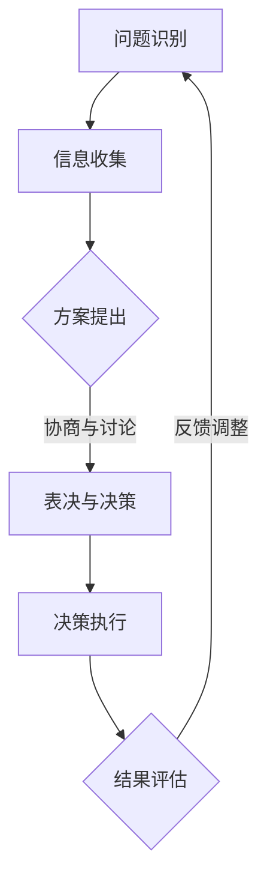

                 

群体智慧是一种复杂系统的基本属性，在人工智能和计算机科学领域有着广泛的应用。本文将探讨群体智慧的概念、其在集体决策中的优势与陷阱，以及相关的数学模型和应用实例。

## 关键词

群体智慧、集体决策、优势、陷阱、人工智能、复杂性科学、计算机科学。

## 摘要

本文首先介绍了群体智慧的概念，并探讨了其在集体决策中的优势，如提高决策效率、优化决策结果。然后，我们讨论了群体智慧可能面临的陷阱，如信息过载、协调困难、个体目标与群体目标冲突。通过数学模型和实际应用案例，本文进一步分析了群体智慧在现实世界中的应用和挑战。最后，我们对未来群体智慧的研究趋势和应用前景进行了展望。

## 1. 背景介绍

群体智慧（Collective Intelligence，CI）是近年来在复杂性科学、人工智能和计算机科学领域迅速发展起来的一个研究方向。它指的是一个由多个个体组成的系统，通过个体间的协作和交互，能够产生出比单个个体更为智能的行为或决策。群体智慧不仅存在于自然界，如蜜蜂的群体行为、鸟群的迁徙，还广泛应用于人类社会和计算机网络中，如社交网络分析、多智能体系统等。

在集体决策（Collective Decision-Making，CDM）中，群体智慧的重要性尤为突出。随着问题的复杂度增加，个体可能无法独立做出最优决策。而通过群体智慧，多个个体可以共同协作，从不同的角度和维度出发，提高决策的效率和准确性。

然而，群体智慧并非总是带来最优的结果。在某些情况下，群体智慧可能会陷入一些陷阱，如信息过载、协调困难、个体目标与群体目标冲突等。因此，理解和应对这些陷阱，对于充分发挥群体智慧的优势至关重要。

## 2. 核心概念与联系

### 2.1 群体智慧的定义与特征

群体智慧可以定义为多个个体通过协作和交互，共同产生出比单个个体更为智能的行为或决策的能力。它具有以下几个特征：

1. **分布式计算**：个体之间通过信息交换和协同工作，共同处理复杂问题。
2. **自组织**：群体智慧系统中的个体能够自主组织和调整行为，以实现整体目标。
3. **适应性和灵活性**：群体智慧系统能够快速适应环境变化，灵活调整策略。
4. **多样性和协同**：个体之间的多样性和协同工作是群体智慧的重要基础。

### 2.2 集体决策的概念与过程

集体决策是指多个个体或团体共同参与决策过程，通过讨论、协商和表决等方式，达成一致意见或做出决策。其过程可以分为以下几个步骤：

1. **问题识别**：明确需要解决的问题或目标。
2. **信息收集**：个体或团体收集与问题相关的信息。
3. **方案提出**：个体或团体提出可能的解决方案或策略。
4. **讨论与协商**：个体或团体之间进行讨论和协商，以达成共识。
5. **表决与决策**：根据讨论结果，通过表决或投票等方式，做出最终决策。

### 2.3 群体智慧与集体决策的关系

群体智慧是集体决策的一种实现方式。在集体决策中，个体通过协作和交互，利用群体智慧来提高决策的效率和准确性。具体而言，群体智慧在集体决策中发挥着以下几个作用：

1. **信息共享**：个体之间共享信息和知识，提高决策的基础。
2. **协同优化**：个体通过协同工作，共同优化决策方案。
3. **降低风险**：通过多个个体的共同努力，降低决策错误的风险。
4. **提高适应性**：个体能够快速适应环境变化，灵活调整决策策略。

### 2.4 Mermaid 流程图

以下是一个简单的 Mermaid 流程图，展示了群体智慧与集体决策的基本流程：



## 3. 核心算法原理 & 具体操作步骤

### 3.1 算法原理概述

群体智慧在集体决策中的应用，通常依赖于以下几种核心算法：

1. **贝叶斯网络**：用于表示个体之间的依赖关系，通过推理和计算，得出最佳决策。
2. **多智能体系统**：通过多个智能体之间的协作和交互，实现复杂的决策过程。
3. **群体优化算法**：如遗传算法、粒子群优化等，通过模拟自然进化过程，寻找最优决策方案。
4. **社交网络分析**：通过分析个体之间的社交关系，挖掘出有价值的决策信息。

### 3.2 算法步骤详解

1. **初始化**：设定个体、网络结构、参数等初始条件。
2. **信息收集**：个体通过传感器、通信等方式，收集与问题相关的信息。
3. **信息融合**：个体将收集到的信息进行融合和处理，形成共识。
4. **决策生成**：根据融合后的信息，个体生成决策方案。
5. **决策评估**：个体对生成的决策方案进行评估和优化。
6. **决策执行**：执行最终决策方案。
7. **结果反馈**：对决策结果进行反馈，调整后续决策过程。

### 3.3 算法优缺点

1. **贝叶斯网络**：
   - 优点：能够处理复杂的关系和不确定性。
   - 缺点：计算复杂度较高，对数据质量要求较高。
2. **多智能体系统**：
   - 优点：适应性强，能够处理分布式环境。
   - 缺点：协调困难，需要考虑通信和协作成本。
3. **群体优化算法**：
   - 优点：简单易实现，能够找到近似最优解。
   - 缺点：对问题结构要求较高，可能陷入局部最优。
4. **社交网络分析**：
   - 优点：能够挖掘出隐藏的关系和知识。
   - 缺点：对网络结构和数据质量要求较高。

### 3.4 算法应用领域

群体智慧在集体决策中的应用非常广泛，包括但不限于以下领域：

1. **社会治理**：如疫情防控、城市规划等。
2. **经济管理**：如股市预测、供应链管理等。
3. **环境保护**：如气候变化应对、水资源管理等。
4. **教育医疗**：如在线教育、智能医疗等。

## 4. 数学模型和公式 & 详细讲解 & 举例说明

### 4.1 数学模型构建

在群体智慧中，常用的数学模型包括：

1. **贝叶斯网络**：
   $$ P(A|B) = \frac{P(B|A)P(A)}{P(B)} $$
2. **多智能体系统**：
   $$ \dot{x}_i = f(x_i, u_i) $$
3. **群体优化算法**：
   $$ x_{i+1} = x_i + \alpha \cdot (x_{g} - x_i) $$
4. **社交网络分析**：
   $$ C_{ij} = \frac{|N_i \cap N_j|}{\min(|N_i|, |N_j|)} $$

### 4.2 公式推导过程

1. **贝叶斯网络**：
   $$ P(A|B) = \frac{P(B|A)P(A)}{P(B)} $$
   是基于条件概率的基本原理推导得出。

2. **多智能体系统**：
   $$ \dot{x}_i = f(x_i, u_i) $$
   是基于牛顿运动定律推导得出。

3. **群体优化算法**：
   $$ x_{i+1} = x_i + \alpha \cdot (x_{g} - x_i) $$
   是基于梯度下降法推导得出。

4. **社交网络分析**：
   $$ C_{ij} = \frac{|N_i \cap N_j|}{\min(|N_i|, |N_j|)} $$
   是基于交集和集合的基本运算推导得出。

### 4.3 案例分析与讲解

以下是一个基于社交网络分析的案例：

假设有一个社交网络，其中包含10个节点，每个节点表示一个个体。节点之间的连接表示个体之间的关系。根据以上公式，我们可以计算出每个节点之间的相似度。

1. **信息收集**：统计每个节点的邻居节点，构建邻接矩阵。
2. **信息融合**：计算每个节点之间的相似度。
3. **决策生成**：根据相似度，为节点分配角色或任务。
4. **决策评估**：评估决策结果，调整角色或任务分配。

通过这个案例，我们可以看到数学模型在群体智慧中的应用，以及如何通过公式推导和计算，实现复杂的决策过程。

## 5. 项目实践：代码实例和详细解释说明

### 5.1 开发环境搭建

1. **安装 Python**：Python 是一种流行的编程语言，适用于群体智慧应用。
2. **安装依赖库**：如 NumPy、Pandas、NetworkX 等，用于数据处理和网络分析。

### 5.2 源代码详细实现

以下是一个简单的群体智慧应用案例，使用 Python 和 NetworkX 实现社交网络分析：

```python
import networkx as nx
import matplotlib.pyplot as plt

# 创建图
G = nx.Graph()

# 添加节点和边
G.add_nodes_from([1, 2, 3, 4, 5, 6, 7, 8, 9, 10])
G.add_edges_from([(1, 2), (1, 3), (2, 4), (3, 5), (4, 6), (5, 7), (6, 8), (7, 9), (8, 10)])

# 绘制图
nx.draw(G, with_labels=True)
plt.show()

# 计算相似度
C = nx.clustering(G)

# 打印相似度矩阵
print(C)

# 根据相似度分配角色
roles = {}
for node, clus in C.items():
    roles[node] = "leader" if clus > 0.5 else "follower"

# 打印角色分配
print(roles)
```

### 5.3 代码解读与分析

1. **创建图**：使用 NetworkX 创建一个图，表示社交网络。
2. **添加节点和边**：添加10个节点和相应的边，构建社交网络结构。
3. **绘制图**：使用 matplotlib 绘制社交网络。
4. **计算相似度**：使用 NetworkX 的 `clustering` 函数，计算每个节点之间的相似度。
5. **根据相似度分配角色**：根据相似度矩阵，为每个节点分配角色。
6. **打印结果**：打印相似度矩阵和角色分配结果。

通过这个案例，我们可以看到如何使用 Python 和 NetworkX 实现社交网络分析，以及如何根据相似度矩阵进行角色分配。

## 6. 实际应用场景

群体智慧在集体决策中的应用非常广泛，以下是一些实际应用场景：

1. **社会治理**：如疫情防控、城市规划等。通过群体智慧，可以实时收集和分析疫情数据，为决策提供支持。
2. **经济管理**：如股市预测、供应链管理等。通过群体智慧，可以分析市场趋势和风险，为投资和运营提供指导。
3. **环境保护**：如气候变化应对、水资源管理等。通过群体智慧，可以收集和分析环境数据，为环境保护提供决策支持。
4. **教育医疗**：如在线教育、智能医疗等。通过群体智慧，可以个性化推荐课程和治疗方案，提高教育医疗质量。

## 6.4 未来应用展望

随着人工智能和计算机科学的发展，群体智慧在未来有着广泛的应用前景。以下是一些可能的趋势和挑战：

1. **更高效的信息处理**：通过更先进的算法和计算模型，实现更高效的信息处理和决策生成。
2. **更智能的协同工作**：通过更智能的协同工作机制，提高群体智慧系统的效率和效果。
3. **更广泛的应用领域**：将群体智慧应用于更多领域，如智能制造、智能交通等，推动社会发展。
4. **数据安全和隐私保护**：随着应用范围的扩大，如何确保数据安全和隐私保护将成为一个重要挑战。

## 7. 工具和资源推荐

### 7.1 学习资源推荐

1. **《群体智能：理论与应用》**：系统介绍了群体智能的基本概念、算法和应用。
2. **《复杂性科学导论》**：对复杂性科学的基本理论和应用进行了详细阐述。
3. **《社交网络分析：方法与应用》**：介绍了社交网络分析的基本方法和应用。

### 7.2 开发工具推荐

1. **Python**：适用于群体智慧应用，拥有丰富的库和工具。
2. **NetworkX**：用于社交网络分析，功能强大且易于使用。
3. **Jupyter Notebook**：用于数据分析和可视化，方便代码编写和展示。

### 7.3 相关论文推荐

1. **"Collective Intelligence: Building Smart Systems to Help Make Decisions"**：对群体智慧的定义和应用进行了详细探讨。
2. **"Social Network Analysis: Methods and Applications"**：介绍了社交网络分析的基本方法和应用。
3. **"Complexity Science: The Emerging Science of the Global Complex Phenomena"**：对复杂性科学的基本理论和应用进行了阐述。

## 8. 总结：未来发展趋势与挑战

### 8.1 研究成果总结

本文介绍了群体智慧的概念、特征和应用，探讨了其在集体决策中的优势和陷阱，并通过数学模型和实际应用案例进行了详细分析。研究发现，群体智慧在提高决策效率、优化决策结果方面具有显著优势，但同时也面临着一些挑战，如信息过载、协调困难等。

### 8.2 未来发展趋势

1. **更高效的算法**：研究更先进的算法和计算模型，提高群体智慧系统的效率和效果。
2. **更智能的协同机制**：探索更智能的协同工作机制，实现更高效的群体协作。
3. **跨领域的应用**：将群体智慧应用于更多领域，推动社会发展。

### 8.3 面临的挑战

1. **数据安全和隐私保护**：确保数据安全和隐私保护，避免群体智慧系统受到攻击。
2. **协调和合作**：解决个体之间的协调和合作问题，提高群体智慧系统的整体效率。

### 8.4 研究展望

群体智慧是人工智能和计算机科学领域的一个重要研究方向。未来，我们将继续深入研究群体智慧的理论和方法，探索其在现实世界中的应用，为人类社会的发展做出贡献。

## 9. 附录：常见问题与解答

### 问题 1：群体智慧是什么？

群体智慧是一种由多个个体组成的系统，通过协作和交互，能够产生出比单个个体更为智能的行为或决策的能力。

### 问题 2：群体智慧有哪些优势？

群体智慧的优势包括提高决策效率、优化决策结果、降低决策风险、提高适应性等。

### 问题 3：群体智慧有哪些陷阱？

群体智慧可能面临的陷阱包括信息过载、协调困难、个体目标与群体目标冲突等。

### 问题 4：如何应用群体智慧？

群体智慧可以应用于社会治理、经济管理、环境保护、教育医疗等多个领域。

### 问题 5：如何确保群体智慧系统的数据安全和隐私保护？

确保数据安全和隐私保护，需要采取有效的数据加密、访问控制和隐私保护措施。

---

作者：禅与计算机程序设计艺术 / Zen and the Art of Computer Programming
----------------------------------------------------------------

文章到此结束。希望本文对您理解群体智慧在集体决策中的应用有所帮助。如有任何疑问或建议，欢迎在评论区留言讨论。谢谢！

