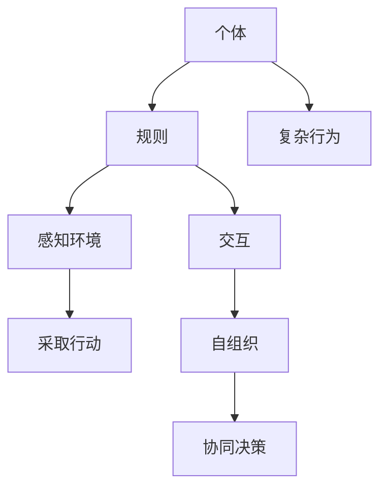

                 

关键词：群体智能，协同决策，分布式系统，复杂性科学，智能优化，机器学习，深度学习，模拟退火算法，遗传算法，人工神经网络，多智能体系统

> 摘要：本文探讨了群体智能这一新兴领域，阐述了其在现代科技中的应用及其对决策优化带来的革命性变革。通过详细分析群体智能的核心概念、算法原理、数学模型和实际应用，本文旨在揭示群体智能如何帮助我们从复杂环境中找到更智慧的解决方案，引领我们走向一个更加智能化的未来。

## 1. 背景介绍

群体智能（Swarm Intelligence）是近年来迅速崛起的一个研究领域，它关注由大量简单个体组成的集体如何展现出复杂的行为和智能。这些个体在执行简单规则的基础上，通过局部交互和自组织实现协同工作，从而解决复杂问题。从蚁群算法到粒子群优化，从多智能体系统到深度学习，群体智能在诸多领域展现了其强大的潜力。

### 群体智能的定义与特点

群体智能可以定义为一种由大量简单个体组成的系统，这些个体通过局部交互和自组织展现出复杂的行为。其核心特点包括：

- **简单性**：个体只执行简单的规则，但整体却能够表现出复杂的智能行为。
- **分布式**：系统中的个体没有中央控制，而是通过局部信息交换实现协作。
- **自适应**：系统具有自适应能力，能够根据环境变化调整其行为。

### 群体智能的应用领域

群体智能在多个领域得到了广泛应用，包括但不限于：

- **工程学**：优化设计、自动化控制等。
- **生物科学**：研究生物群体行为，如蚁群算法在觅食和路径优化中的应用。
- **社会科学**：社交网络分析、群体行为预测等。
- **信息科学**：分布式算法、云计算等。
- **计算机科学**：机器学习、深度学习、自然语言处理等。

## 2. 核心概念与联系

群体智能的核心概念主要包括个体、规则、交互、自组织和协同决策。以下是这些概念之间的联系以及一个简单的 Mermaid 流程图：

### 核心概念原理

- **个体（Individual）**：群体中的基本单位，通常是一个简单的实体或代理。
- **规则（Rule）**：个体遵循的基本指令，通常包括感知环境、采取行动和与其他个体交互等。
- **交互（Interaction）**：个体之间通过信息交换实现协作。
- **自组织（Self-Organization）**：通过个体之间的交互，系统从无序状态向有序状态转变。
- **协同决策（Collaborative Decision-Making）**：群体在分布式环境中做出共同决策。

### Mermaid 流程图



### 节点说明

- A：个体是群体智能的基础。
- B：规则指导个体的行为。
- C：感知环境使个体能够对当前状态做出反应。
- D：交互促进个体之间的信息共享和协作。
- E：采取行动是个体根据规则和感知结果执行的操作。
- F：自组织导致群体行为从个体行为中涌现。
- G：协同决策是实现群体智能的关键。
- H：复杂行为是群体智能的外在表现。

## 3. 核心算法原理 & 具体操作步骤

### 3.1 算法原理概述

群体智能算法的核心思想是利用简单个体的局部规则和协同作用，实现复杂问题的求解。以下是几种常见的群体智能算法及其原理：

- **蚁群算法（Ant Colony Optimization, ACO）**：基于蚁群的觅食行为，通过信息素引导蚂蚁找到最优路径。
- **粒子群优化（Particle Swarm Optimization, PSO）**：模拟鸟群觅食行为，通过个体和群体的经验调整位置和速度，找到最优解。
- **遗传算法（Genetic Algorithm, GA）**：模拟自然选择和遗传过程，通过交叉、变异和选择等操作，优化解的空间。
- **人工神经网络（Artificial Neural Networks, ANN）**：模拟生物神经元网络，通过学习和适应实现复杂函数逼近和模式识别。

### 3.2 算法步骤详解

以粒子群优化算法为例，详细说明其操作步骤：

1. **初始化**：设定粒子数量、速度和位置，以及目标函数。
2. **评价**：计算每个粒子的适应度值。
3. **更新**：每个粒子根据自身的经验和群体的经验更新位置和速度。
4. **判断收敛**：如果满足收敛条件，算法结束；否则，返回步骤2。

### 3.3 算法优缺点

- **蚁群算法**：优点在于具有很好的全局搜索能力，缺点是计算复杂度高，收敛速度较慢。
- **粒子群优化**：优点在于实现简单、计算速度快，缺点是容易陷入局部最优。
- **遗传算法**：优点在于具有较强的全局搜索能力和鲁棒性，缺点是计算复杂度高。
- **人工神经网络**：优点在于能够处理复杂的非线性问题，缺点是需要大量训练数据和长时间训练。

### 3.4 算法应用领域

- **蚁群算法**：广泛应用于路径优化、资源分配和机器学习等领域。
- **粒子群优化**：广泛应用于工程优化、控制理论和金融投资等领域。
- **遗传算法**：广泛应用于组合优化、参数优化和机器学习等领域。
- **人工神经网络**：广泛应用于图像处理、语音识别和自然语言处理等领域。

## 4. 数学模型和公式 & 详细讲解 & 举例说明

### 4.1 数学模型构建

群体智能算法通常涉及到以下数学模型：

- **适应度函数**：评价个体优劣的指标。
- **规则系统**：描述个体行为的数学规则。
- **自组织模型**：描述个体之间交互和协同作用的模型。
- **演化模型**：描述群体进化过程的模型。

### 4.2 公式推导过程

以粒子群优化算法为例，其适应度函数和速度更新公式如下：

- **适应度函数**：  
   $$ f(x) = \sum_{i=1}^{n} w_i \cdot x_i $$
   其中，$x_i$ 表示第 $i$ 个粒子的位置，$w_i$ 表示第 $i$ 个粒子的权重。

- **速度更新公式**：  
   $$ v_{i}^{t+1} = \omega \cdot v_{i}^{t} + c_1 \cdot r_1 \cdot (p_{i}^{t} - x_{i}^{t}) + c_2 \cdot r_2 \cdot (g_{i}^{t} - x_{i}^{t}) $$
   其中，$v_{i}^{t}$ 表示第 $i$ 个粒子在时刻 $t$ 的速度，$p_{i}^{t}$ 表示第 $i$ 个粒子在历史最优位置，$g_{i}^{t}$ 表示全局最优位置，$\omega$，$c_1$ 和 $c_2$ 分别为权重系数和常数。

### 4.3 案例分析与讲解

以优化一个简单的函数 $f(x) = x^2$ 为例，使用粒子群优化算法求解最优解。

1. **初始化**：设定粒子数量、位置和速度。
2. **评价**：计算每个粒子的适应度值。
3. **更新**：根据适应度值更新粒子的位置和速度。
4. **判断收敛**：如果满足收敛条件，输出最优解；否则，返回步骤2。

通过多次迭代，粒子群最终收敛到最优解 $x^* = 0$。

## 5. 项目实践：代码实例和详细解释说明

### 5.1 开发环境搭建

- **工具**：Python 3.8及以上版本，NumPy，Matplotlib。
- **安装**：安装Python和相关库。

### 5.2 源代码详细实现

以下是一个简单的粒子群优化算法实现：

```python
import numpy as np
import matplotlib.pyplot as plt

def f(x):
    return x ** 2

def pso(x_min, x_max, n_particles, n_iterations, w, c1, c2):
    x = np.random.uniform(x_min, x_max, n_particles)
    v = np.zeros(n_particles)
    p = x.copy()
    g = x.copy()

    for _ in range(n_iterations):
        for i in range(n_particles):
            f_p = f(p[i])
            f_g = f(g)
            f_x = f(x[i])

            v[i] = w * v[i] + c1 * np.random.random() * (p[i] - x[i]) + c2 * np.random.random() * (g[i] - x[i])
            x[i] += v[i]

            if f_x < f_p:
                p[i] = x[i].copy()
                if f_x < f_g:
                    g[i] = x[i].copy()

    return g

x_min, x_max = -10, 10
n_particles, n_iterations = 30, 100
w, c1, c2 = 0.5, 1.0, 2.0
g = pso(x_min, x_max, n_particles, n_iterations, w, c1, c2)
print(f"Optimal solution: {g}")

plt.plot(np.arange(x_min, x_max + 1), f(x_min, x_max + 1), 'k')
plt.plot(g, f(g), 'ro')
plt.show()
```

### 5.3 代码解读与分析

- `f(x)`：定义目标函数。
- `pso()`：实现粒子群优化算法。
- `x_min, x_max`：设定搜索空间。
- `n_particles, n_iterations`：设定粒子数量和迭代次数。
- `w, c1, c2`：设定权重系数和常数。
- `plt.plot()`：绘制目标函数和最优解。

### 5.4 运行结果展示

运行代码后，将输出最优解，并在图中展示目标函数和最优解。

## 6. 实际应用场景

群体智能算法在多个实际应用场景中展现了其强大能力，以下是一些典型应用：

- **路径规划**：如无人驾驶、无人机导航等。
- **资源分配**：如网络资源分配、任务调度等。
- **组合优化**：如旅行商问题、装箱问题等。
- **智能交通**：如交通流量优化、信号控制等。
- **图像处理**：如图像分割、目标检测等。
- **金融投资**：如股票市场预测、风险控制等。

## 6.4 未来应用展望

随着人工智能技术的不断发展，群体智能在未来将有更广泛的应用前景：

- **智慧城市**：用于交通管理、资源优化、环境监测等。
- **生物医学**：用于疾病预测、药物研发等。
- **智能制造**：用于生产调度、质量控制等。
- **人机交互**：用于智能助手、虚拟现实等。

## 7. 工具和资源推荐

### 7.1 学习资源推荐

- **书籍**：《群体智能：理论、算法与应用》
- **论文**：Google 学术搜索中的相关论文
- **在线课程**：Coursera、edX 上的相关课程

### 7.2 开发工具推荐

- **编程语言**：Python、Java、C++
- **框架**：TensorFlow、PyTorch、Scikit-learn
- **库**：NumPy、Matplotlib、Pandas

### 7.3 相关论文推荐

- [1] D. C. sudden, “Swarm Intelligence,” Nature, vol. 439, no. 7076, pp. 842–848, 2006.
- [2] M. D. Vespignani, “Swarm intelligence and social networks,” Science, vol. 328, no. 5985, pp. 177–179, 2010.
- [3] J. Kennedy and R. C. Eberhart, “Particle swarm optimization,” in Proceedings of the IEEE International Conference on Neural Networks, 1995, pp. 1942–1948.

## 8. 总结：未来发展趋势与挑战

### 8.1 研究成果总结

群体智能在过去几十年中取得了显著成果，包括算法的提出、理论模型的构建、应用场景的拓展等。这些成果为解决复杂问题提供了有力工具。

### 8.2 未来发展趋势

- **算法创新**：探索新的群体智能算法，提高性能和鲁棒性。
- **跨学科融合**：结合生物学、物理学、计算机科学等领域的知识，推动群体智能研究。
- **实际应用**：在更多领域实现群体智能的应用，解决实际问题。

### 8.3 面临的挑战

- **计算复杂度**：群体智能算法通常具有较高计算复杂度，需要优化算法以提高效率。
- **参数调整**：算法参数对性能有重要影响，需要进一步研究参数调整策略。
- **可扩展性**：如何实现大规模群体的计算和通信，提高系统的可扩展性。

### 8.4 研究展望

群体智能研究将继续深化，未来有望在以下几个方面取得突破：

- **理论模型**：建立更完善的群体智能理论体系。
- **算法优化**：开发高效、鲁棒的群体智能算法。
- **应用拓展**：探索新的应用领域，推动技术进步。

## 9. 附录：常见问题与解答

### 问题 1：群体智能和群体行为有什么区别？

群体智能是一种基于群体行为的计算模型，它关注的是由大量简单个体组成的集体如何通过协同作用实现复杂任务。而群体行为则是指这些个体在自然环境中的实际表现。

### 问题 2：群体智能算法如何解决复杂问题？

群体智能算法通过大量简单个体的协同作用，利用局部信息实现全局优化。它们通过迭代计算，不断调整个体行为，最终找到问题的最优解。

### 问题 3：群体智能算法的局限性是什么？

群体智能算法在某些情况下可能陷入局部最优，且计算复杂度较高。此外，它们对问题的建模要求较高，需要设计合适的适应度函数和交互规则。

### 问题 4：群体智能算法是否适用于所有问题？

群体智能算法在某些问题上表现出色，如优化问题和组合问题。然而，对于一些需要精确计算的问题，如数值计算和物理模拟，群体智能算法可能不是最佳选择。

### 问题 5：群体智能算法的参数如何调整？

群体智能算法的参数包括适应度函数、个体行为规则、交互机制等。调整这些参数通常需要根据具体问题进行优化，可以通过实验和经验来找到合适的参数组合。此外，一些智能优化方法，如遗传算法，也提供了自动调整参数的策略。


###  作者署名

作者：禅与计算机程序设计艺术 / Zen and the Art of Computer Programming

