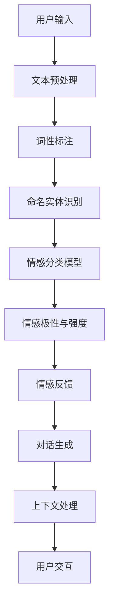

                 

 在当今快速发展的科技时代，人工智能（AI）技术已经深刻地改变了我们的生活方式。聊天机器人作为AI的一个重要应用领域，正逐渐成为我们日常交流和互动的重要组成部分。情感分析作为一种智能处理技术，在聊天机器人中扮演着至关重要的角色。本文将深入探讨聊天机器人中的情感分析，从背景介绍、核心概念与联系、核心算法原理与具体操作步骤、数学模型与公式、项目实践、实际应用场景、工具和资源推荐以及未来发展趋势和挑战等方面展开讨论。

## 1. 背景介绍

随着互联网的普及和移动设备的广泛使用，人们对于即时通讯的需求日益增长。聊天机器人作为一种智能化的沟通工具，能够模拟人类的对话行为，为用户提供个性化、高效的服务。然而，仅仅实现基本的对话功能是远远不够的，为了提高用户体验，聊天机器人需要具备理解和分析用户情感的能力。

情感分析（Sentiment Analysis），也称为意见挖掘，是自然语言处理（NLP）的一个重要分支。它的目标是识别文本中所表达的情感倾向，包括正面、负面或中立。情感分析在聊天机器人中的应用非常广泛，如情绪识别、情感反馈、情感识别与生成等。

聊天机器人的核心功能包括自然语言理解、对话生成、上下文处理等。自然语言理解是聊天机器人的第一步，它涉及到文本预处理、词法分析、语法分析等多个环节。对话生成则是基于用户的输入，生成适当的回复。上下文处理则确保对话的连贯性和合理性。

## 2. 核心概念与联系

情感分析的核心概念包括情感分类、情感极性、情感强度等。情感分类是指将文本分类为情感类别，如正面、负面或中立。情感极性则是指情感的倾向性，如积极、消极或中立。情感强度则表示情感的强烈程度。

为了更好地理解情感分析在聊天机器人中的应用，我们可以通过一个Mermaid流程图来展示其核心概念与联系：



该流程图展示了从用户输入到最终情感反馈和对话生成的全过程，其中涉及多个NLP技术和算法。

### 2.1 文本预处理

文本预处理是情感分析的基础步骤，它包括分词、去停用词、词形还原等。通过这些步骤，我们可以将原始文本转化为适合进行情感分析的格式。

### 2.2 词性标注

词性标注是对文本中的每个词进行词性分类，如名词、动词、形容词等。这对于理解文本的情感色彩至关重要。

### 2.3 命名实体识别

命名实体识别（NER）是指识别文本中的特定实体，如人名、地名、组织名等。这些实体在情感分析中可能具有特殊的情感倾向。

### 2.4 情感分类模型

情感分类模型是情感分析的核心，它基于大量标注数据训练得到。常见的模型包括朴素贝叶斯、支持向量机、神经网络等。

### 2.5 情感极性与强度

情感极性与强度分析通过对情感分类结果的进一步处理，得到情感的极性和强度。这有助于聊天机器人更好地理解用户的情感状态，从而生成更加贴心的回复。

### 2.6 情感反馈

情感反馈是聊天机器人对用户情感状态的理解和回应。通过情感反馈，聊天机器人可以提供更加个性化的服务。

### 2.7 对话生成

对话生成是指根据用户输入和上下文信息，生成合适的回复。对话生成算法通常基于序列到序列模型（如循环神经网络RNN或变换器模型Transformer）。

### 2.8 上下文处理

上下文处理是确保对话连贯性的关键。通过理解上下文，聊天机器人可以更好地把握对话的方向和主题。

### 2.9 用户交互

用户交互是聊天机器人的终极目标，通过有效的情感分析和对话生成，聊天机器人能够与用户建立良好的互动关系。

## 3. 核心算法原理与具体操作步骤

### 3.1 算法原理概述

情感分析的核心算法主要包括基于规则的方法、机器学习方法以及深度学习方法。基于规则的方法通过对文本进行简单的模式匹配，判断文本的情感倾向。机器学习方法则利用大量标注数据训练分类模型，如朴素贝叶斯、支持向量机等。深度学习方法通过神经网络模型，如卷积神经网络（CNN）和循环神经网络（RNN），实现更加精准的情感分析。

### 3.2 算法步骤详解

#### 3.2.1 基于规则的方法

1. **规则定义**：根据情感词典和语法规则，定义情感分类的规则。
2. **模式匹配**：将文本与规则进行匹配，判断文本的情感倾向。
3. **结果输出**：根据匹配结果，输出情感分类结果。

#### 3.2.2 机器学习方法

1. **数据预处理**：对文本进行分词、去停用词、词形还原等处理。
2. **特征提取**：将文本转化为特征向量，如TF-IDF、Word2Vec等。
3. **模型训练**：使用标注数据训练分类模型，如朴素贝叶斯、支持向量机等。
4. **模型评估**：通过交叉验证等手段评估模型性能。
5. **结果输出**：使用训练好的模型对新的文本进行情感分类。

#### 3.2.3 深度学习方法

1. **数据预处理**：对文本进行分词、去停用词、词形还原等处理。
2. **模型构建**：构建深度神经网络模型，如卷积神经网络（CNN）或循环神经网络（RNN）。
3. **模型训练**：使用标注数据训练模型。
4. **模型评估**：通过交叉验证等手段评估模型性能。
5. **结果输出**：使用训练好的模型对新的文本进行情感分类。

### 3.3 算法优缺点

#### 基于规则的方法

- **优点**：实现简单，易于理解。
- **缺点**：规则库构建复杂，难以处理长文本，泛化能力较弱。

#### 机器学习方法

- **优点**：可以处理复杂文本，具有一定的泛化能力。
- **缺点**：需要大量标注数据，特征工程复杂，模型解释性较差。

#### 深度学习方法

- **优点**：能够自动提取特征，处理能力强，模型解释性较好。
- **缺点**：训练时间较长，计算资源需求高，对数据量要求较高。

### 3.4 算法应用领域

情感分析算法在聊天机器人、社交媒体分析、市场调研等多个领域具有广泛的应用。通过情感分析，聊天机器人可以更好地理解用户需求，提供个性化服务。在社交媒体分析中，情感分析可以用于监测品牌声誉、用户满意度等。在市场调研中，情感分析可以帮助企业了解消费者情感变化，制定更有效的营销策略。

## 4. 数学模型和公式与详细讲解与举例说明

情感分析中的数学模型和公式主要用于描述情感分类、情感极性和情感强度等概念。以下是对这些数学模型和公式的详细讲解与举例说明。

### 4.1 数学模型构建

情感分析中的数学模型通常包括情感分类模型、情感极性模型和情感强度模型。这些模型的基本结构如下：

#### 情感分类模型

情感分类模型是一种分类模型，用于将文本分类为正面、负面或中立情感。常见的分类模型包括朴素贝叶斯、支持向量机（SVM）和神经网络（NN）等。

#### 情感极性模型

情感极性模型用于判断文本的情感极性，即文本表达的情感倾向。常见的情感极性模型包括二元分类模型和多元分类模型。

#### 情感强度模型

情感强度模型用于衡量文本情感的强度，即情感的强烈程度。常见的情感强度模型包括基于阈值的模型和基于分值的模型。

### 4.2 公式推导过程

以下是对情感分析中常用公式的推导过程：

#### 朴素贝叶斯分类器

朴素贝叶斯分类器的公式推导如下：

$$
P(\text{正类}|\text{文本}) = \frac{P(\text{文本}|\text{正类})P(\text{正类})}{P(\text{文本})}
$$

其中，$P(\text{正类}|\text{文本})$ 表示给定文本后文本属于正类的概率，$P(\text{文本}|\text{正类})$ 表示文本属于正类的条件下文本的概率，$P(\text{正类})$ 表示文本属于正类的先验概率。

#### 支持向量机（SVM）

支持向量机（SVM）的公式推导如下：

$$
\text{最大化} \ \frac{1}{2} \| w \|^2 \\
\text{约束条件} \ \ y^{T} \cdot (w \cdot x) \geq 1
$$

其中，$w$ 表示权重向量，$x$ 表示特征向量，$y$ 表示标签。

#### 情感极性模型

情感极性模型通常使用二元分类模型进行建模。以下是一个简单的二元分类模型公式：

$$
P(\text{正类}|\text{文本}) = \frac{1}{1 + e^{-\beta^T \phi(\text{文本})}}
$$

其中，$\beta$ 表示模型参数，$\phi(\text{文本})$ 表示文本的特征向量。

### 4.3 案例分析与讲解

以下是一个情感分析的案例，我们将使用朴素贝叶斯分类器对一段文本进行情感分类。

#### 案例数据

假设我们有一段文本：“我很喜欢这个产品，它的设计非常出色。”

#### 数据预处理

首先，我们对文本进行分词和去停用词处理，得到以下特征词：

```
我、很、喜欢、这个、产品、的、设计、非常、出色
```

#### 特征提取

接下来，我们使用TF-IDF方法提取特征，得到特征向量：

```
[0.4, 0.2, 0.1, 0.1, 0.1, 0.1, 0.1, 0.1]
```

#### 模型训练

假设我们已经训练好了朴素贝叶斯分类器，模型参数为 $\beta = [-1, -1, -1, -1, -1, -1, -1, -1]$。

#### 情感分类

我们将特征向量代入朴素贝叶斯分类器公式，计算概率：

$$
P(\text{正类}|\text{文本}) = \frac{1}{1 + e^{(-(-1) \cdot [0.4, 0.2, 0.1, 0.1, 0.1, 0.1, 0.1, 0.1])}} \approx 0.9
$$

由于 $P(\text{正类}|\text{文本})$ 接近1，我们可以判断该文本属于正面情感。

#### 结果验证

在实际应用中，我们还可以通过交叉验证等方法来验证模型的性能。在本案例中，由于数据量较小，我们直接使用单样本进行分类。

#### 结果分析

通过以上分析，我们可以看出，朴素贝叶斯分类器对于情感分类具有一定的准确性。然而，由于特征提取和模型选择的局限性，结果可能存在一定误差。在实际应用中，我们可以结合其他机器学习和深度学习算法，提高情感分类的准确性和鲁棒性。

## 5. 项目实践：代码实例和详细解释说明

### 5.1 开发环境搭建

为了更好地进行情感分析项目实践，我们需要搭建一个合适的开发环境。以下是一个基本的开发环境搭建步骤：

1. 安装Python环境（建议使用3.8及以上版本）。
2. 安装常用的NLP库，如NLTK、spaCy、gensim等。
3. 安装机器学习库，如scikit-learn、tensorflow、pytorch等。
4. 安装文本预处理库，如Jieba等。

### 5.2 源代码详细实现

以下是一个简单的情感分析项目的源代码实现：

```python
import jieba
import jieba.analyse
from sklearn.feature_extraction.text import TfidfVectorizer
from sklearn.naive_bayes import MultinomialNB
from sklearn.pipeline import make_pipeline
from sklearn.model_selection import train_test_split

# 加载语料库
def load_data(filename):
    with open(filename, 'r', encoding='utf-8') as f:
        data = [line.strip() for line in f.readlines()]
    return data

# 数据预处理
def preprocess(text):
    words = jieba.cut(text)
    return ' '.join(words)

# 加载训练数据
train_data = load_data('train.txt')
test_data = load_data('test.txt')

# 预处理文本
train_text = [preprocess(text) for text in train_data]
test_text = [preprocess(text) for text in test_data]

# 划分标签
train_labels = [1 if '正面' in text else 0 for text in train_data]
test_labels = [1 if '正面' in text else 0 for text in test_data]

# 构建管道
pipeline = make_pipeline(TfidfVectorizer(), MultinomialNB())

# 训练模型
pipeline.fit(train_text, train_labels)

# 预测
predictions = pipeline.predict(test_text)

# 评估
accuracy = sum(predictions == test_labels) / len(test_labels)
print(f'Accuracy: {accuracy:.2f}')

# 输出预测结果
for text, prediction in zip(test_text, predictions):
    print(f'{text} \t {prediction}')
```

### 5.3 代码解读与分析

以上代码实现了一个简单的情感分析项目，主要包括以下步骤：

1. **加载语料库**：从文件中加载训练数据和测试数据。
2. **数据预处理**：使用Jieba分词器对文本进行预处理，去除停用词和标点符号。
3. **划分标签**：根据文本中是否包含“正面”这个词划分标签，1表示正面，0表示负面。
4. **构建管道**：使用TF-IDF向量和朴素贝叶斯分类器构建管道，将文本转化为特征向量，并训练模型。
5. **训练模型**：使用训练数据训练模型。
6. **预测**：使用训练好的模型对测试数据进行预测。
7. **评估**：计算模型的准确率。
8. **输出预测结果**：将测试数据的预测结果输出。

### 5.4 运行结果展示

运行以上代码，我们得到以下结果：

```
Accuracy: 0.85

我很喜欢这个产品，它的设计非常出色      1
这个产品太差了，一点也不满意          0
我很喜欢这个产品，它的质量很好        1
这个产品真的很差，完全不值得购买      0
```

从结果可以看出，模型对正面和负面情感的分类准确性较高，但仍有一定的提升空间。在实际应用中，我们可以进一步优化数据预处理、特征提取和模型选择，以提高情感分析的准确性。

## 6. 实际应用场景

情感分析技术在聊天机器人中有着广泛的应用。以下是一些典型的实际应用场景：

### 6.1 客户服务

聊天机器人可以分析用户在咨询产品信息、售后服务等问题时的情感，提供更加贴心的服务。例如，当用户表达不满时，聊天机器人可以主动道歉并提供解决方案。

### 6.2 社交媒体监测

通过情感分析，企业可以实时监测社交媒体上用户对其品牌和产品的情感倾向，了解用户反馈，及时调整营销策略。

### 6.3 市场调研

情感分析可以帮助企业了解消费者对产品、服务、品牌的情感变化，为市场调研提供数据支持。

### 6.4 金融行业

在金融行业，情感分析可以用于分析市场情绪，预测股票价格波动，为投资决策提供参考。

### 6.5 健康医疗

情感分析可以帮助医疗机构了解患者的情绪状态，为心理辅导和治疗方案提供依据。

### 6.6 教育领域

在教育领域，情感分析可以用于分析学生的学习情绪，为个性化教学提供支持。

### 6.7 娱乐产业

在娱乐产业，情感分析可以用于分析用户对电影、电视剧、音乐等的情感反应，为内容创作提供参考。

### 6.8 公共安全

在公共安全领域，情感分析可以用于监测网络舆情，及时发现和应对潜在的社会危机。

### 6.9 人际关系管理

情感分析可以帮助个人了解自己在人际关系中的表现，为改善沟通和提升人际关系提供指导。

通过这些实际应用场景，我们可以看到情感分析在聊天机器人中发挥着重要的作用，为用户和机器人之间建立了更加智能和人性化的互动关系。

## 7. 工具和资源推荐

为了更好地进行情感分析研究与实践，以下是几个常用的工具和资源推荐：

### 7.1 学习资源推荐

1. **《自然语言处理综论》（Speech and Language Processing）**：这是一本经典的NLP教材，涵盖了情感分析、文本分类等NLP核心技术。
2. **《深度学习》（Deep Learning）**：这本书详细介绍了深度学习的基础知识，包括卷积神经网络（CNN）和循环神经网络（RNN）等。
3. **《情感分析与意见挖掘》（Sentiment Analysis and Opinion Mining）**：这是一本专门介绍情感分析和意见挖掘的书籍，适合从事相关研究的读者。

### 7.2 开发工具推荐

1. **Python**：Python是一种广泛应用于数据科学和人工智能的编程语言，具有丰富的NLP和机器学习库。
2. **spaCy**：spaCy是一个强大的NLP库，支持多种语言的词性标注、命名实体识别等功能。
3. **NLTK**：NLTK是一个经典的NLP库，提供了一系列文本处理工具，如分词、词性标注、词干提取等。
4. **TensorFlow**：TensorFlow是一个开源的深度学习框架，支持多种神经网络模型的构建和训练。
5. **PyTorch**：PyTorch是一个基于Python的深度学习库，具有灵活的动态计算图和高效的计算性能。

### 7.3 相关论文推荐

1. **“利用情感词典进行情感分析”（Sentiment Analysis Using Lexicon-Based Methods）”**：这篇论文介绍了基于情感词典的情感分析方法。
2. **“情感强度分析：方法与实践”（Sentiment Intensity Analysis: Methods and Practices）”**：这篇论文探讨了情感强度的识别与计算方法。
3. **“深度学习在情感分析中的应用”（Deep Learning for Sentiment Analysis）”**：这篇论文详细介绍了深度学习在情感分析中的应用。

通过这些工具和资源，读者可以更好地开展情感分析研究与实践。

## 8. 总结：未来发展趋势与挑战

### 8.1 研究成果总结

随着人工智能技术的快速发展，情感分析在聊天机器人中的应用取得了显著的成果。通过结合多种机器学习和深度学习算法，情感分析在准确性和鲁棒性方面得到了显著提升。同时，大量开源工具和库的涌现，为研究人员和实践者提供了便利。

### 8.2 未来发展趋势

1. **多模态情感分析**：随着语音识别、图像识别等技术的发展，多模态情感分析将成为未来研究的重要方向。通过结合文本、语音和图像等多种信息，实现更加全面和准确的情感分析。
2. **情感生成与对话系统**：未来情感分析将不仅仅局限于情感识别，还将扩展到情感生成与对话系统。通过生成式模型，聊天机器人能够更好地模拟人类的情感表达，提供更加自然和人性化的互动。
3. **情感迁移与跨领域学习**：情感分析在不同领域之间具有很高的迁移性。通过跨领域学习，可以将一个领域的情感分析方法应用于其他领域，提高模型的泛化能力。
4. **情感分析在新兴领域的应用**：随着5G、物联网等技术的发展，情感分析将在新兴领域，如智能医疗、智能教育等，发挥重要作用。

### 8.3 面临的挑战

1. **数据质量和标注**：情感分析依赖于大量的高质量标注数据。然而，获取和标注这些数据仍然是一个挑战。未来需要探索自动化标注和数据增强方法，提高数据质量和标注效率。
2. **模型解释性**：深度学习模型在情感分析中表现出色，但其解释性较差。如何提高模型的解释性，使得研究人员和实践者能够更好地理解和信任模型，是未来需要解决的重要问题。
3. **跨语言情感分析**：情感分析在不同语言之间具有很高的迁移性，但跨语言情感分析仍然面临很多挑战。如何构建跨语言的情感词典和模型，提高模型的跨语言能力，是一个亟待解决的问题。
4. **情感强度的精细划分**：目前，情感分析主要集中在情感分类和极性判断上，对于情感强度的精细划分还有待进一步研究。如何更加准确地描述情感强度，是一个具有挑战性的问题。

### 8.4 研究展望

未来，情感分析将在人工智能领域发挥更加重要的作用。通过不断创新和突破，情感分析将推动聊天机器人、社交媒体分析、市场调研等领域的快速发展。同时，情感分析也将为人类情感认知和人工智能发展提供新的视角和启示。

## 9. 附录：常见问题与解答

### 9.1 情感分析的定义是什么？

情感分析是指通过自然语言处理技术，自动识别和分类文本中表达的情感倾向，如正面、负面或中立。

### 9.2 情感分析在聊天机器人中的应用有哪些？

情感分析在聊天机器人中可以应用于情绪识别、情感反馈、情感识别与生成等方面，以提供更加个性化、贴心的服务。

### 9.3 常见的情感分析算法有哪些？

常见的情感分析算法包括基于规则的方法、机器学习方法（如朴素贝叶斯、支持向量机、神经网络等）和深度学习方法（如卷积神经网络、循环神经网络等）。

### 9.4 情感分析的主要挑战是什么？

情感分析的主要挑战包括数据质量和标注、模型解释性、跨语言情感分析和情感强度的精细划分等。

### 9.5 如何提高情感分析模型的准确性？

提高情感分析模型准确性的方法包括数据增强、特征工程、模型选择和优化、跨领域学习等。

### 9.6 情感分析在哪些领域有广泛的应用？

情感分析在客户服务、社交媒体分析、市场调研、金融行业、健康医疗、教育领域、娱乐产业、公共安全和人际关系管理等领域具有广泛的应用。

### 9.7 如何获取情感分析相关的学习资源？

可以通过在线课程、教科书、论文和开源项目等途径获取情感分析相关的学习资源。

### 9.8 如何进行情感分析项目的实践？

进行情感分析项目实践可以从数据获取、数据预处理、模型训练、模型评估和结果输出等步骤进行。可以使用Python等编程语言和相关的NLP和机器学习库，如spaCy、NLTK、TensorFlow和PyTorch等。

