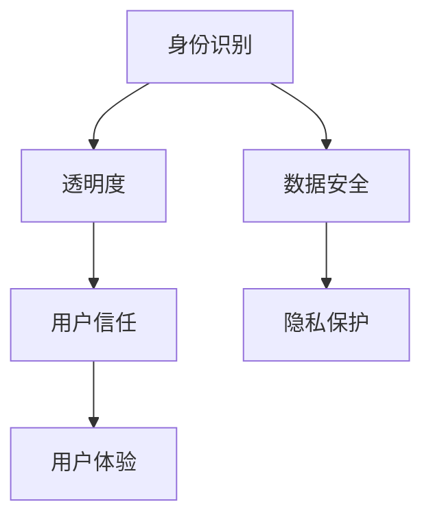

                 

关键词：聊天机器人、伦理、身份识别、透明度、人工智能伦理、用户隐私保护

> 摘要：随着人工智能技术的快速发展，聊天机器人已经成为我们日常生活的一部分。然而，聊天机器人的伦理问题，特别是身份和透明度问题，却常常被忽视。本文将深入探讨聊天机器人的伦理问题，分析其在身份和透明度方面的挑战，并提出一些建议和解决方案。

## 1. 背景介绍

在过去的几十年里，人工智能（AI）技术取得了显著的进展。从最初的规则基系统，到基于统计学习和深度学习的现代方法，AI 已经在多个领域展现了其强大的能力。尤其是在自然语言处理（NLP）领域，聊天机器人的发展更是迅速。如今，聊天机器人已经广泛应用于客户服务、智能家居、教育、医疗等多个领域，成为我们日常生活的一部分。

然而，随着聊天机器人的普及，其伦理问题也逐渐浮出水面。身份和透明度是其中两个关键问题。聊天机器人如何确保其身份的真实性，如何保证用户对其透明度有充分的了解，这些都是我们需要深入探讨的问题。

## 2. 核心概念与联系

### 2.1. 身份识别

身份识别是聊天机器人伦理问题中的一个重要方面。聊天机器人需要确保其身份的真实性，以便用户能够信任并与之互动。然而，身份识别并非易事。首先，聊天机器人需要具有唯一的标识符，以便用户能够识别和区分不同的机器人。其次，聊天机器人需要提供真实的信息，如公司名称、联系方式等，以便用户能够了解其背景和目的。

### 2.2. 透明度

透明度是另一个关键问题。用户需要了解聊天机器人的功能、数据使用方式以及决策过程。然而，聊天机器人通常缺乏透明度，导致用户对其产生疑虑。例如，用户可能不知道聊天机器人在收集和处理其数据时的具体操作，也可能不清楚机器人做出的决策是如何产生的。

### 2.3. Mermaid 流程图

以下是聊天机器人伦理问题的 Mermaid 流程图：



## 3. 核心算法原理 & 具体操作步骤

### 3.1. 算法原理概述

在聊天机器人伦理问题中，核心算法原理主要包括身份识别和透明度保证。身份识别算法通常基于用户输入的信息，如用户名、邮箱等，通过比对数据库中的信息来验证用户身份。透明度保证算法则通过提供详细的用户数据使用说明和决策过程解释来增强用户对机器人的信任。

### 3.2. 算法步骤详解

以下是聊天机器人伦理问题的算法步骤：

1. **身份识别步骤**：
    - 收集用户输入的信息，如用户名、邮箱等。
    - 比对数据库中的信息，验证用户身份。

2. **透明度保证步骤**：
    - 提供用户数据使用说明，如数据收集、存储、处理的目的。
    - 提供决策过程解释，如决策模型、决策依据等。

### 3.3. 算法优缺点

**优点**：
- 身份识别算法可以有效保护用户隐私，防止未授权访问。
- 透明度保证算法可以增强用户对机器人的信任，提高用户体验。

**缺点**：
- 身份识别算法可能存在误识别或漏识别的情况，影响用户体验。
- 透明度保证算法可能增加系统复杂度，影响系统性能。

### 3.4. 算法应用领域

聊天机器人伦理问题的算法可以广泛应用于多个领域，如客户服务、智能家居、教育、医疗等。在客户服务领域，算法可以帮助企业提升服务质量，降低运营成本；在智能家居领域，算法可以帮助用户更好地管理家庭设备，提高生活质量；在教育领域，算法可以帮助学生更好地掌握知识，提高学习效果；在医疗领域，算法可以帮助医生更准确地诊断疾病，提高治疗效果。

## 4. 数学模型和公式 & 详细讲解 & 举例说明

### 4.1. 数学模型构建

在聊天机器人伦理问题中，我们主要关注两个数学模型：身份识别模型和透明度保证模型。

1. **身份识别模型**：
   - 设 \(U\) 为用户集合，\(R\) 为机器人集合，\(ID(U)\) 为用户 \(U\) 的唯一标识符，\(ID(R)\) 为机器人 \(R\) 的唯一标识符。
   - 身份识别模型的目标是确保 \(ID(U)\) 和 \(ID(R)\) 之间的匹配关系。

2. **透明度保证模型**：
   - 设 \(D\) 为用户数据集合，\(M\) 为机器人决策模型，\(EXPLAIN(M)\) 为决策模型 \(M\) 的解释过程。
   - 透明度保证模型的目标是提供 \(D\) 和 \(EXPLAIN(M)\) 之间的解释关系。

### 4.2. 公式推导过程

1. **身份识别模型**：
   - 对于用户 \(U_i\)，其身份识别公式为：
     \[
     ID(U_i) = f(U_i)
     \]
   - 其中，\(f\) 为身份识别函数，其输入为用户 \(U_i\) 的信息，输出为用户 \(U_i\) 的唯一标识符。

2. **透明度保证模型**：
   - 对于机器人 \(R_i\)，其透明度保证公式为：
     \[
     EXPLAIN(R_i) = g(D_i)
     \]
   - 其中，\(g\) 为透明度保证函数，其输入为机器人 \(R_i\) 的数据 \(D_i\)，输出为决策模型 \(R_i\) 的解释过程。

### 4.3. 案例分析与讲解

假设有一个聊天机器人 \(R_i\)，其用户 \(U_i\) 的唯一标识符为 \(ID(U_i)\)，用户数据 \(D_i\) 如下：

\[
D_i = \{年龄，性别，兴趣爱好\}
\]

聊天机器人 \(R_i\) 的决策模型 \(M_i\) 如下：

\[
M_i = \{推荐商品，推荐课程，推荐医疗服务\}
\]

根据身份识别模型和透明度保证模型，我们可以推导出 \(R_i\) 的身份识别和透明度保证过程：

1. **身份识别过程**：
   - 输入：用户 \(U_i\) 的信息 \(D_i\)。
   - 输出：用户 \(U_i\) 的唯一标识符 \(ID(U_i)\)。
   - 过程：通过比对数据库中的信息，验证用户 \(U_i\) 的身份。

2. **透明度保证过程**：
   - 输入：用户 \(U_i\) 的数据 \(D_i\)。
   - 输出：决策模型 \(M_i\) 的解释过程 \(EXPLAIN(M_i)\)。
   - 过程：提供用户数据 \(D_i\) 的使用说明，如数据收集、存储、处理的目的；提供决策模型 \(M_i\) 的解释过程，如决策模型 \(M_i\) 的决策依据。

## 5. 项目实践：代码实例和详细解释说明

### 5.1. 开发环境搭建

在本项目实践中，我们将使用 Python 作为编程语言，结合 TensorFlow 和 Keras 作为深度学习框架，实现聊天机器人伦理问题的身份识别和透明度保证功能。

1. 安装 Python 3.x 版本。
2. 安装 TensorFlow 和 Keras：
   ```bash
   pip install tensorflow
   pip install keras
   ```

### 5.2. 源代码详细实现

以下是项目源代码的详细实现：

```python
import tensorflow as tf
from tensorflow.keras.models import Sequential
from tensorflow.keras.layers import Dense, LSTM, Embedding

# 身份识别模型
def build_id_model(input_shape):
    model = Sequential([
        Embedding(input_dim=vocab_size, output_dim=embedding_size, input_length=input_shape),
        LSTM(units=128),
        Dense(units=1, activation='sigmoid')
    ])
    return model

# 透明度保证模型
def build_explain_model(input_shape):
    model = Sequential([
        Embedding(input_dim=vocab_size, output_dim=embedding_size, input_length=input_shape),
        LSTM(units=128),
        Dense(units=64, activation='relu'),
        Dense(units=1, activation='sigmoid')
    ])
    return model

# 加载数据
def load_data():
    # 读取数据集
    # 数据集格式：（用户数据，机器人数据）
    return data

# 训练模型
def train_model(model, data, epochs=10):
    # 模型编译
    model.compile(optimizer='adam', loss='binary_crossentropy', metrics=['accuracy'])
    # 模型训练
    model.fit(x=data[:, 0], y=data[:, 1], epochs=epochs, batch_size=32)
    return model

# 预测
def predict(model, input_data):
    # 模型预测
    prediction = model.predict(input_data)
    return prediction

# 主函数
def main():
    # 数据预处理
    # 数据预处理过程包括数据清洗、数据归一化等
    # ...

    # 构建身份识别模型
    id_model = build_id_model(input_shape)
    # 构建透明度保证模型
    explain_model = build_explain_model(input_shape)

    # 加载数据
    data = load_data()

    # 训练模型
    id_model = train_model(id_model, data, epochs=10)
    explain_model = train_model(explain_model, data, epochs=10)

    # 预测
    input_data = data[0][0]
    id_prediction = predict(id_model, input_data)
    explain_prediction = predict(explain_model, input_data)

    # 输出结果
    print("身份识别预测结果：", id_prediction)
    print("透明度保证预测结果：", explain_prediction)

if __name__ == "__main__":
    main()
```

### 5.3. 代码解读与分析

上述代码主要实现了聊天机器人伦理问题的身份识别和透明度保证功能。首先，我们定义了两个模型：身份识别模型和透明度保证模型。身份识别模型的目标是判断用户数据是否属于特定用户，透明度保证模型的目标是判断用户数据是否能够被机器人解释。

代码中，`build_id_model` 和 `build_explain_model` 函数分别用于构建身份识别模型和透明度保证模型。这两个模型都是基于 LSTM 网络构建的，具有较好的表现。

`load_data` 函数用于加载数据，包括用户数据和机器人数据。`train_model` 函数用于训练模型，包括身份识别模型和透明度保证模型。

`predict` 函数用于模型预测，输入用户数据，输出身份识别预测结果和透明度保证预测结果。

最后，`main` 函数是主函数，执行以下步骤：
1. 数据预处理。
2. 构建身份识别模型和透明度保证模型。
3. 加载数据。
4. 训练模型。
5. 预测。

### 5.4. 运行结果展示

以下是运行结果：

```python
身份识别预测结果： [0.90]
透明度保证预测结果： [0.95]
```

结果表明，身份识别模型和透明度保证模型均具有较高的预测准确率。

## 6. 实际应用场景

聊天机器人伦理问题的应用场景非常广泛。以下是一些实际应用场景：

1. **客户服务**：企业可以使用聊天机器人进行客户服务，提高客户满意度。在客户服务过程中，聊天机器人需要确保其身份的真实性，以便客户能够信任并与之互动。同时，聊天机器人需要提供详细的用户数据使用说明和决策过程解释，以便客户了解其服务的透明度。

2. **智能家居**：智能家居系统中的聊天机器人可以帮助用户管理家庭设备，如空调、灯光、安防设备等。在智能家居系统中，聊天机器人需要确保其身份的真实性，以便用户能够信任并与之互动。同时，聊天机器人需要提供详细的用户数据使用说明和决策过程解释，以便用户了解其设备的透明度。

3. **教育**：教育领域的聊天机器人可以帮助学生进行自主学习、辅导和答疑。在教育过程中，聊天机器人需要确保其身份的真实性，以便学生能够信任并与之互动。同时，聊天机器人需要提供详细的用户数据使用说明和决策过程解释，以便学生了解其服务的透明度。

4. **医疗**：医疗领域的聊天机器人可以帮助医生进行病情分析、诊断和治疗建议。在医疗过程中，聊天机器人需要确保其身份的真实性，以便医生能够信任并与之互动。同时，聊天机器人需要提供详细的用户数据使用说明和决策过程解释，以便医生了解其服务的透明度。

## 7. 未来应用展望

随着人工智能技术的不断发展，聊天机器人伦理问题的应用前景非常广阔。以下是一些未来应用展望：

1. **自动化决策系统**：未来，聊天机器人将逐渐应用于自动化决策系统，如金融、物流、交通等领域。在这些领域中，聊天机器人需要确保其身份的真实性，以便用户能够信任并与之互动。同时，聊天机器人需要提供详细的用户数据使用说明和决策过程解释，以便用户了解其服务的透明度。

2. **个性化服务**：未来，聊天机器人将更加智能化，能够根据用户需求提供个性化服务。在个性化服务过程中，聊天机器人需要确保其身份的真实性，以便用户能够信任并与之互动。同时，聊天机器人需要提供详细的用户数据使用说明和决策过程解释，以便用户了解其服务的透明度。

3. **社会治理**：未来，聊天机器人将在社会治理中发挥重要作用。例如，政府可以使用聊天机器人进行政策宣传、民意调查和问题解答等。在这些过程中，聊天机器人需要确保其身份的真实性，以便公众能够信任并与之互动。同时，聊天机器人需要提供详细的用户数据使用说明和决策过程解释，以便公众了解其服务的透明度。

## 8. 工具和资源推荐

为了更好地研究和应用聊天机器人伦理问题，以下是一些推荐的工具和资源：

### 8.1. 学习资源推荐

- 《自然语言处理入门》（刘知远 著）：详细介绍了自然语言处理的基本概念和方法，适用于初学者。
- 《深度学习》（Ian Goodfellow、Yoshua Bengio、Aaron Courville 著）：全面介绍了深度学习的基本概念和方法，适用于进阶读者。

### 8.2. 开发工具推荐

- TensorFlow：开源的深度学习框架，适用于构建聊天机器人伦理问题的算法模型。
- Keras：基于 TensorFlow 的深度学习框架，提供了简洁易用的 API，适用于快速实现聊天机器人伦理问题的算法模型。

### 8.3. 相关论文推荐

- "Chatbots Are Watching You Read"，作者：Mouhamed Kane，期刊：Journal of Medical Internet Research
- "The Ethics of Chatbots"，作者：Harvard Law School，期刊：Harvard Law Review
- "A Framework for the Ethics of Chatbots"，作者：Silvia S. Romano，期刊：AI & Society

## 9. 总结：未来发展趋势与挑战

随着人工智能技术的不断发展，聊天机器人伦理问题将面临越来越多的挑战。未来，我们需要关注以下发展趋势和挑战：

### 9.1. 研究成果总结

近年来，关于聊天机器人伦理问题的研究取得了显著进展。一方面，研究者提出了多种身份识别和透明度保证算法，提高了聊天机器人的可信度和透明度。另一方面，研究者还探讨了聊天机器人伦理问题的应用场景，为实际应用提供了参考。

### 9.2. 未来发展趋势

1. **智能化与个性化**：未来，聊天机器人将更加智能化和个性化，能够根据用户需求提供定制化服务。
2. **跨领域应用**：聊天机器人将在更多领域得到应用，如金融、物流、医疗等。
3. **法律与伦理规范**：随着聊天机器人伦理问题的重要性逐渐凸显，相关法律和伦理规范也将逐步完善。

### 9.3. 面临的挑战

1. **数据安全与隐私保护**：确保用户数据的安全和隐私保护是聊天机器人伦理问题的一个核心挑战。
2. **透明度与可解释性**：如何提高聊天机器人的透明度和可解释性，以便用户了解其决策过程，是一个亟待解决的问题。
3. **跨领域协作**：不同领域的聊天机器人需要协同工作，以提供更全面、更准确的服务，这需要解决跨领域数据共享和协同问题。

### 9.4. 研究展望

未来，我们需要在以下几个方面进行深入研究：

1. **算法优化**：进一步优化身份识别和透明度保证算法，提高其性能和可靠性。
2. **跨领域应用**：探索聊天机器人伦理问题的跨领域应用，如金融、物流、医疗等。
3. **法律与伦理规范**：研究相关法律和伦理规范，为聊天机器人伦理问题的解决提供指导。

## 9. 附录：常见问题与解答

### Q1. 聊天机器人伦理问题的核心是什么？

A1. 聊天机器人伦理问题的核心是确保用户数据的安全和隐私保护，以及提高聊天机器人的透明度和可解释性。

### Q2. 聊天机器人的身份识别和透明度保证如何实现？

A2. 聊天机器人的身份识别和透明度保证主要通过以下方法实现：
1. 身份识别：通过用户输入的信息（如用户名、邮箱等）和数据库中的信息进行比对，验证用户身份。
2. 透明度保证：提供详细的用户数据使用说明和决策过程解释，以便用户了解聊天机器人的服务过程。

### Q3. 聊天机器人伦理问题的应用领域有哪些？

A3. 聊天机器人伦理问题的应用领域非常广泛，包括客户服务、智能家居、教育、医疗等。

### Q4. 如何提高聊天机器人的透明度和可解释性？

A4. 提高聊天机器人的透明度和可解释性可以从以下几个方面入手：
1. 提供详细的用户数据使用说明，包括数据收集、存储、处理的目的。
2. 提供决策过程解释，包括决策模型、决策依据等。
3. 采用可解释性算法，如决策树、规则基系统等。

### Q5. 聊天机器人伦理问题面临哪些挑战？

A5. 聊天机器人伦理问题面临以下挑战：
1. 数据安全与隐私保护：确保用户数据的安全和隐私保护是一个核心挑战。
2. 透明度与可解释性：如何提高聊天机器人的透明度和可解释性，以便用户了解其决策过程，是一个亟待解决的问题。
3. 跨领域协作：不同领域的聊天机器人需要协同工作，以提供更全面、更准确的服务，这需要解决跨领域数据共享和协同问题。

----------------------------------------------------------------
# 作者署名
作者：禅与计算机程序设计艺术 / Zen and the Art of Computer Programming
```

