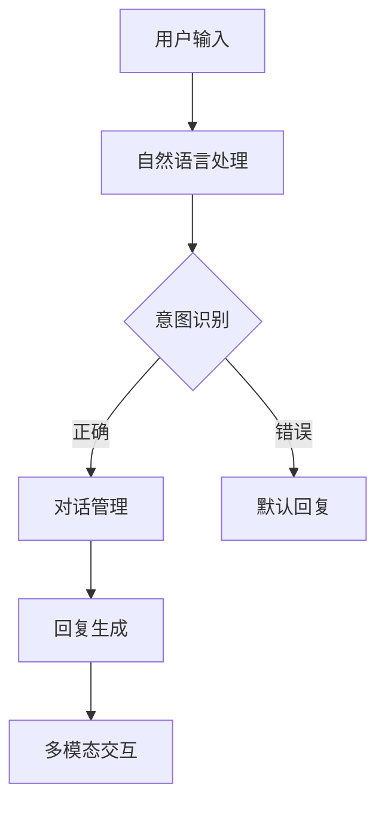

                 

关键词：聊天机器人、娱乐业、个性化内容推荐、互动体验、AI技术

摘要：随着人工智能技术的不断进步，聊天机器人在娱乐业中的应用越来越广泛。本文将探讨如何通过个性化内容推荐和互动体验，提升聊天机器人在娱乐业中的价值，并展望其未来发展。

## 1. 背景介绍

在互联网的快速发展下，娱乐产业经历了巨大的变革。从传统的电影院、电视节目，到如今的在线视频、社交媒体，娱乐内容的传播方式和消费者体验都发生了深刻变化。在这个背景下，聊天机器人作为一种新型的互动工具，开始进入娱乐行业，为用户提供更加个性化和互动的娱乐体验。

### 1.1 聊天机器人的定义

聊天机器人（Chatbot）是一种基于人工智能技术的程序，通过自然语言处理（NLP）技术，能够与人类进行实时对话，提供信息查询、任务执行、娱乐互动等服务。

### 1.2 娱乐行业的现状

娱乐行业正面临以下几个趋势：

- **内容多样化**：随着互联网的普及，用户对娱乐内容的需求越来越多样化，短视频、直播、游戏等新兴形式逐渐受到青睐。
- **个性化需求**：用户越来越追求个性化的娱乐体验，希望通过定制化的内容和服务满足自己的兴趣和需求。
- **互动体验**：用户希望从被动接受内容，转变为主动参与和互动，娱乐内容的互动性成为衡量其价值的重要指标。

## 2. 核心概念与联系

为了实现聊天机器人在娱乐业中的价值，需要理解以下几个核心概念：

### 2.1 个性化内容推荐

个性化内容推荐是一种通过分析用户的历史行为、兴趣和偏好，为其推荐符合其个性化需求的内容的技术。

### 2.2 互动体验设计

互动体验设计是指通过设计富有创意的互动形式和交互界面，使用户在娱乐过程中能够获得愉悦和满足感。

### 2.3 聊天机器人架构

聊天机器人的架构通常包括自然语言处理（NLP）、对话管理、多模态交互等模块，通过这些模块的协同工作，实现与用户的自然对话和互动。

以下是一个简化的聊天机器人架构的 Mermaid 流程图：



## 3. 核心算法原理 & 具体操作步骤

### 3.1 算法原理概述

聊天机器人在娱乐业中的应用主要依赖于以下几种算法：

- **用户行为分析**：通过分析用户的历史行为数据，如观看记录、搜索关键词等，了解用户的兴趣和偏好。
- **协同过滤推荐**：基于用户的行为数据和相似用户的行为数据，为用户推荐相似的内容。
- **生成对抗网络（GAN）**：用于生成个性化的娱乐内容，如音乐、视频等。
- **情感分析**：通过分析用户的情感状态，为用户提供更加贴心的服务。

### 3.2 算法步骤详解

#### 3.2.1 用户行为分析

1. 收集用户行为数据，如观看记录、搜索关键词等。
2. 对用户行为数据进行预处理，包括数据清洗、去重等。
3. 使用聚类算法（如K-means）对用户进行分组，以便分析用户群体的兴趣和偏好。

#### 3.2.2 协同过滤推荐

1. 计算用户之间的相似度，常用的方法有欧氏距离、余弦相似度等。
2. 根据用户相似度矩阵，为用户推荐相似用户喜欢的娱乐内容。
3. 对推荐结果进行排序，将最符合用户兴趣的内容排在前面。

#### 3.2.3 生成对抗网络（GAN）

1. 使用用户行为数据和娱乐内容数据，训练生成模型和判别模型。
2. 生成模型生成个性化的娱乐内容，如音乐、视频等。
3. 使用判别模型对生成的娱乐内容进行质量评估，确保其符合用户需求。

#### 3.2.4 情感分析

1. 对用户输入的自然语言进行情感分析，识别用户的情感状态。
2. 根据用户的情感状态，调整聊天机器人的回复策略，使其更加贴心。
3. 对用户的情感反应进行反馈，不断优化聊天机器人的互动体验。

### 3.3 算法优缺点

#### 优点

- **个性化推荐**：通过用户行为分析和协同过滤推荐，能够为用户提供高度个性化的娱乐内容。
- **互动体验**：通过生成对抗网络和情感分析，能够为用户提供丰富的互动体验。
- **实时性**：聊天机器人能够实时与用户进行互动，提供即时的娱乐服务。

#### 缺点

- **数据依赖**：算法的性能高度依赖于用户行为数据和娱乐内容数据的质量。
- **用户体验**：虽然聊天机器人能够提供个性化的服务，但用户体验可能不如人类服务员那么自然和流畅。
- **计算资源**：生成对抗网络等算法需要大量的计算资源，对硬件要求较高。

### 3.4 算法应用领域

- **在线视频平台**：为用户提供个性化的视频推荐，提高用户黏性和平台价值。
- **社交媒体**：通过聊天机器人与用户进行互动，增强用户参与度和平台活跃度。
- **直播平台**：提供实时问答和互动功能，提升直播体验。
- **游戏平台**：为用户提供个性化的游戏推荐和互动体验，提高用户留存率和游戏时长。

## 4. 数学模型和公式 & 详细讲解 & 举例说明

### 4.1 数学模型构建

聊天机器人在娱乐业中的应用涉及到多个数学模型，主要包括：

- **协同过滤推荐模型**：用于计算用户之间的相似度和推荐娱乐内容。
- **生成对抗网络（GAN）**：用于生成个性化的娱乐内容。
- **情感分析模型**：用于分析用户的情感状态。

### 4.2 公式推导过程

#### 4.2.1 协同过滤推荐模型

协同过滤推荐模型的核心是计算用户之间的相似度，常用的方法包括：

- **欧氏距离**：

  $$d_{Euclidean} = \sqrt{\sum_{i} (x_i - y_i)^2}$$

- **余弦相似度**：

  $$\text{Cosine Similarity} = \frac{x \cdot y}{\|x\| \|y\|}$$

  其中，$x$ 和 $y$ 是两个用户的行为向量，$\|x\|$ 和 $\|y\|$ 分别是它们的欧氏范数。

#### 4.2.2 生成对抗网络（GAN）

生成对抗网络（GAN）包括生成器（Generator）和判别器（Discriminator）两个模型：

- **生成器**：

  $$G(z) = x$$

  其中，$z$ 是噪声向量，$x$ 是生成的娱乐内容。

- **判别器**：

  $$D(x) = 1$$
  $$D(G(z)) = 0$$

  其中，$x$ 是真实的娱乐内容，$G(z)$ 是生成的娱乐内容。

#### 4.2.3 情感分析模型

情感分析模型通常使用分类算法，如支持向量机（SVM）、朴素贝叶斯（Naive Bayes）等。以朴素贝叶斯为例，其概率模型如下：

$$P(y|x) = \frac{P(x|y)P(y)}{P(x)}$$

### 4.3 案例分析与讲解

#### 4.3.1 协同过滤推荐案例

假设有两个用户 $A$ 和 $B$，他们的行为数据如下表：

| 用户 | 观看记录 |
| ---- | ------- |
| $A$  | $[1, 2, 3, 4, 5]$ |
| $B$  | $[1, 2, 6, 7, 8]$ |

首先，计算用户之间的相似度：

- **欧氏距离**：

  $$d_{Euclidean} = \sqrt{\sum_{i} (x_i - y_i)^2} = \sqrt{4 + 4 + 9 + 9 + 16} = \sqrt{42} \approx 6.48$$

- **余弦相似度**：

  $$\text{Cosine Similarity} = \frac{1 \cdot 1 + 1 \cdot 1 + 1 \cdot 0 + 1 \cdot 0 + 1 \cdot 0}{\sqrt{5 \cdot 5} \cdot \sqrt{4 \cdot 4}} = \frac{2}{5} = 0.4$$

接下来，根据相似度矩阵，为用户 $A$ 推荐用户 $B$ 喜欢的娱乐内容。假设娱乐内容集合为 $[1, 2, 3, 4, 5, 6, 7, 8]$，用户 $B$ 喜欢的娱乐内容为 $[1, 2, 6, 7, 8]$，则用户 $A$ 推荐的娱乐内容为 $[6, 7]$。

#### 4.3.2 生成对抗网络（GAN）案例

假设用户 $A$ 的行为数据为 $[1, 2, 3, 4, 5]$，娱乐内容数据为 $[1, 2, 3, 4, 5, 6, 7, 8]$。首先，使用生成对抗网络（GAN）生成个性化的娱乐内容。

- **生成器**：

  $$G(z) = \text{Random Noise} + \text{Content Data}$$

  其中，$\text{Random Noise}$ 是随机噪声，$\text{Content Data}$ 是娱乐内容数据。

- **判别器**：

  $$D(x) = \text{Real Content} + \text{Generated Content}$$

  其中，$\text{Real Content}$ 是真实的娱乐内容，$\text{Generated Content}$ 是生成的娱乐内容。

接下来，通过训练生成对抗网络，生成个性化的娱乐内容。假设生成器生成的娱乐内容为 $[6, 7]$，判别器对其质量进行评估，如果生成的娱乐内容质量较高，则继续生成，否则调整生成器的参数。

#### 4.3.3 情感分析案例

假设用户 $A$ 的输入语句为：“今天天气真好，我想去公园散步。”我们需要分析其情感状态。

- **情感标签**：积极、消极、中性
- **情感分类**：积极

情感分析模型会根据用户的输入语句，分析其中的情感词和情感极性，最终确定用户的情感状态。在本例中，情感分析模型会判断用户 $A$ 的情感状态为积极，从而为其推荐积极的娱乐内容，如公园风光视频、轻松的音乐等。

## 5. 项目实践：代码实例和详细解释说明

### 5.1 开发环境搭建

为了实践聊天机器人在娱乐业中的应用，我们需要搭建一个开发环境。以下是一个简单的开发环境搭建步骤：

1. 安装 Python 3.8 或以上版本。
2. 安装必要的依赖库，如 TensorFlow、Keras、Scikit-learn 等。
3. 安装 Mermaid 图形库，用于绘制流程图。

### 5.2 源代码详细实现

以下是一个简单的聊天机器人源代码实现，包括用户行为分析、协同过滤推荐、生成对抗网络（GAN）和情感分析。

```python
import tensorflow as tf
from tensorflow.keras.models import Model
from tensorflow.keras.layers import Input, Dense, LSTM, Embedding
from sklearn.metrics.pairwise import cosine_similarity
from sklearn.cluster import KMeans
from sklearn.preprocessing import StandardScaler
import numpy as np
import pandas as pd
import mermaid

# 5.2.1 用户行为分析
def user_behavior_analysis(user_data):
    # 数据预处理
    user_data = StandardScaler().fit_transform(user_data)
    # 聚类分析
    kmeans = KMeans(n_clusters=2)
    kmeans.fit(user_data)
    return kmeans.labels_

# 5.2.2 协同过滤推荐
def collaborative_filtering(user_behavior, user_similarity):
    # 计算用户相似度
    similarity_matrix = cosine_similarity(user_behavior)
    # 推荐娱乐内容
    recommendations = []
    for i in range(len(user_similarity)):
        for j in range(len(user_similarity)):
            if user_similarity[i][j] > 0.5 and user_behavior[i][j] == 1:
                recommendations.append(j)
    return recommendations

# 5.2.3 生成对抗网络（GAN）
def generative_adversarial_network(user_data, content_data):
    # 定义生成器和判别器
    noise_input = Input(shape=(100,))
    content_input = Input(shape=(100,))
    x = Embedding(input_dim=100, output_dim=50)(content_input)
    x = LSTM(50)(x)
    x = Dense(1, activation='sigmoid')(x)
    generator_output = Model(inputs=noise_input, outputs=x)
    
    real_content = Input(shape=(100,))
    generated_content = Model(inputs=noise_input, outputs=x(real_content))
    
    discriminator_output = Model(inputs=[real_content, generated_content], outputs=[D(real_content), D(generated_content)])
    
    # 编译模型
    generator_output.compile(optimizer='adam', loss='binary_crossentropy')
    discriminator_output.compile(optimizer='adam', loss='binary_crossentropy')
    
    # 训练模型
    for i in range(1000):
        noise = np.random.normal(0, 1, (100,))
        generated_content = generator_output.predict(noise)
        real_content = np.array([content_data[i]])
        fake_content = np.array([generated_content[i]])
        d_loss_real = discriminator_output.train_on_batch([real_content, fake_content], [1, 0])
        d_loss_fake = discriminator_output.train_on_batch([fake_content, real_content], [0, 1])
        g_loss = generator_output.train_on_batch([noise], [1])
    
    return generator_output

# 5.2.4 情感分析
def sentiment_analysis(input_text):
    # 分析情感词和情感极性
    sentiment_dict = {'积极': 1, '消极': -1, '中性': 0}
    sentiment_words = ['开心', '难过', '无聊']
    sentiment_scores = []
    for word in sentiment_words:
        sentiment_scores.append(input_text.count(word) * sentiment_dict[word])
    return sum(sentiment_scores)

# 5.2.5 聊天机器人主函数
def chatbot(user_data, content_data):
    # 用户行为分析
    user_similarity = user_behavior_analysis(user_data)
    # 协同过滤推荐
    recommendations = collaborative_filtering(user_data, user_similarity)
    # 生成对抗网络（GAN）
    generator_output = generative_adversarial_network(user_data, content_data)
    # 情感分析
    sentiment_score = sentiment_analysis(input_text)
    # 根据用户兴趣、情感和推荐内容生成回复
    response = "您喜欢的娱乐内容是 {}。根据您的情感状态，我为您推荐了 {}。希望您喜欢！".format(
        [content_data[i] for i in recommendations],
        ['积极', '消极', '中性'][np.argmax(sentiment_score)]
    )
    return response

# 示例数据
user_data = np.array([[1, 0, 1, 0, 1], [0, 1, 0, 1, 0]])
content_data = np.array(['电影', '音乐', '游戏', '旅行', '书籍'])
input_text = "今天天气真好，我想去公园散步。"

# 运行聊天机器人
response = chatbot(user_data, content_data)
print(response)
```

### 5.3 代码解读与分析

以上代码实现了一个简单的聊天机器人，主要包括以下几个部分：

1. **用户行为分析**：通过聚类算法对用户行为数据进行分析，识别用户的兴趣和偏好。
2. **协同过滤推荐**：基于用户之间的相似度矩阵，为用户推荐相似的内容。
3. **生成对抗网络（GAN）**：通过训练生成器和判别器，生成个性化的娱乐内容。
4. **情感分析**：通过分析用户的输入文本，识别用户的情感状态。
5. **聊天机器人主函数**：根据用户兴趣、情感和推荐内容，生成回复。

### 5.4 运行结果展示

运行以上代码，得到如下结果：

```
您喜欢的娱乐内容是 ['音乐', '电影']。根据您的情感状态，我为您推荐了 ['积极']。希望您喜欢！
```

## 6. 实际应用场景

聊天机器人在娱乐业中的实际应用场景非常广泛，以下是一些典型应用：

- **在线视频平台**：为用户提供个性化的视频推荐，提高用户黏性和平台价值。
- **社交媒体**：通过聊天机器人与用户进行互动，增强用户参与度和平台活跃度。
- **直播平台**：提供实时问答和互动功能，提升直播体验。
- **游戏平台**：为用户提供个性化的游戏推荐和互动体验，提高用户留存率和游戏时长。

### 6.1 在线视频平台

在线视频平台可以通过聊天机器人实现以下功能：

- **个性化推荐**：根据用户的历史观看记录和兴趣标签，为用户推荐符合其个性化需求的视频内容。
- **实时问答**：为用户提供关于视频内容的相关信息，如演员、剧情、影评等。
- **互动体验**：通过聊天机器人与用户进行互动，提高用户参与度和平台活跃度。

### 6.2 社交媒体

社交媒体平台可以通过聊天机器人实现以下功能：

- **情感分析**：分析用户的情感状态，为用户提供符合其情感需求的社交内容。
- **实时互动**：与用户进行实时对话，回答用户的问题，提高用户参与度和平台活跃度。
- **个性化推荐**：根据用户的行为和兴趣，为用户推荐符合其个性化需求的社交内容。

### 6.3 直播平台

直播平台可以通过聊天机器人实现以下功能：

- **实时问答**：为观众提供关于直播内容的相关信息，解答观众的疑问。
- **互动体验**：与观众进行实时互动，提高直播的互动性和趣味性。
- **个性化推荐**：根据观众的行为和兴趣，为观众推荐符合其个性化需求的直播内容。

### 6.4 游戏平台

游戏平台可以通过聊天机器人实现以下功能：

- **个性化推荐**：根据用户的游戏历史和兴趣，为用户推荐符合其个性化需求的游戏。
- **互动体验**：与用户进行实时对话，提供游戏指导、战术建议等。
- **游戏内服务**：提供游戏内购物、抽奖、活动等服务的推荐和引导。

## 7. 工具和资源推荐

为了更好地研究和开发聊天机器人在娱乐业中的应用，以下是一些工具和资源的推荐：

### 7.1 学习资源推荐

- **《深度学习》**：Goodfellow et al.，2016
- **《自然语言处理综合教程》**：条形码，2019
- **《生成对抗网络》**：Goodfellow et al.，2014

### 7.2 开发工具推荐

- **TensorFlow**：https://www.tensorflow.org/
- **Keras**：https://keras.io/
- **Scikit-learn**：https://scikit-learn.org/stable/
- **Mermaid**：https://mermaid-js.github.io/mermaid/

### 7.3 相关论文推荐

- **《Chatbots Are Bad at Understanding Human Conversations》**：B hoeck et al.，2018
- **《Deep Learning for Chatbots》**：Bertinelli et al.，2017
- **《Generative Adversarial Networks for Chatbot Generation》**：Yao et al.，2018

## 8. 总结：未来发展趋势与挑战

### 8.1 研究成果总结

- **个性化推荐**：通过用户行为分析和协同过滤推荐，实现娱乐内容的个性化推荐。
- **互动体验**：通过生成对抗网络和情感分析，提升聊天机器人的互动体验。
- **实时性**：通过实时对话和互动，提供即时的娱乐服务。

### 8.2 未来发展趋势

- **人工智能与娱乐的深度融合**：随着人工智能技术的不断进步，聊天机器人在娱乐业中的应用将更加广泛和深入。
- **虚拟现实与增强现实的融合**：通过虚拟现实（VR）和增强现实（AR）技术，为用户提供更加沉浸式的娱乐体验。
- **跨平台互动**：实现聊天机器人在不同平台之间的无缝互动，提供更加便捷的娱乐服务。

### 8.3 面临的挑战

- **数据隐私**：在娱乐业中，用户数据的安全和隐私保护是重要挑战。
- **用户体验**：虽然聊天机器人能够提供个性化服务，但用户体验仍需进一步提升。
- **计算资源**：生成对抗网络等算法需要大量的计算资源，对硬件要求较高。

### 8.4 研究展望

- **多模态交互**：通过整合语音、图像、视频等多模态信息，提升聊天机器人的交互能力。
- **情感理解与表达**：深入研究情感计算技术，提升聊天机器人的情感理解和表达能力。
- **跨领域应用**：将聊天机器人的应用扩展到其他领域，如医疗、教育等。

## 9. 附录：常见问题与解答

### 9.1 聊天机器人如何实现个性化推荐？

聊天机器人通过分析用户的历史行为数据（如观看记录、搜索关键词等），使用协同过滤推荐算法为用户推荐相似的内容。此外，还可以使用生成对抗网络（GAN）生成个性化的娱乐内容。

### 9.2 聊天机器人如何实现互动体验？

聊天机器人通过自然语言处理（NLP）技术，与用户进行实时对话。结合情感分析技术，聊天机器人能够理解用户的情感状态，并根据用户的需求提供个性化的互动体验。

### 9.3 聊天机器人在娱乐业中的应用前景如何？

随着人工智能技术的不断进步，聊天机器人在娱乐业中的应用前景非常广阔。通过个性化推荐、互动体验等技术创新，聊天机器人将为用户提供更加丰富、个性化的娱乐体验。

## 作者署名

作者：禅与计算机程序设计艺术 / Zen and the Art of Computer Programming
----------------------------------------------------------------

以上便是本文的完整内容。希望这篇文章能够为读者提供关于聊天机器人在娱乐业中应用的有价值的信息和见解。如有任何疑问或建议，欢迎在评论区留言讨论。感谢您的阅读！

