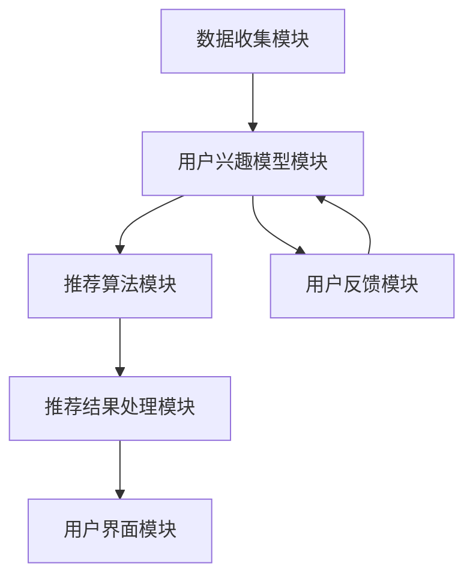

                 

关键词：聊天机器人，个性化媒体推荐，娱乐升级，AI技术，用户体验，算法原理，数学模型，项目实践，应用场景，未来展望

<|assistant|>摘要：本文将探讨聊天机器人领域的一项前沿技术——个性化媒体推荐。通过深入分析核心概念、算法原理、数学模型以及实际应用案例，本文旨在为读者提供全面的技术视角，展示如何利用AI技术提升聊天机器人的娱乐价值，优化用户互动体验。同时，本文还将展望个性化媒体推荐在未来的发展趋势与面临的挑战。

## 1. 背景介绍

随着人工智能（AI）技术的快速发展，聊天机器人已经成为许多企业和平台提升用户体验、提供个性化服务的重要工具。早期的聊天机器人主要功能是处理简单的查询和互动，但随着技术的进步，聊天机器人逐渐具备了更复杂的任务处理能力，包括智能客服、虚拟助手、情感陪伴等。而个性化媒体推荐作为一种新兴的技术，正逐渐成为聊天机器人娱乐升级的重要方向。

个性化媒体推荐的核心目标是根据用户的兴趣和行为，为其推荐最相关、最感兴趣的内容。这种推荐系统不仅能够提高用户粘性，还能提升用户满意度。在聊天机器人中，个性化媒体推荐的应用场景包括但不限于：根据用户偏好推荐音乐、电影、新闻等媒体内容；在聊天过程中穿插用户可能感兴趣的视频、图片等多媒体元素，增强互动体验。

本文将从以下几个方面展开讨论：首先介绍个性化媒体推荐的核心概念与联系，包括用户兴趣模型、推荐算法和系统架构；然后深入解析核心算法原理与数学模型，并通过实际项目实践展示如何实现这一功能；最后，探讨个性化媒体推荐的实际应用场景和未来发展趋势。

## 2. 核心概念与联系

### 2.1 用户兴趣模型

用户兴趣模型是个性化媒体推荐系统的核心。它通过分析用户的历史行为、偏好、社交网络等信息，构建出一个反映用户兴趣的模型。用户兴趣模型通常包括以下几个部分：

1. **兴趣标签**：将用户感兴趣的主题或内容分类为标签，如音乐、电影、新闻、科技等。
2. **兴趣强度**：对每个标签的兴趣强度进行量化，以便在推荐过程中能够区分用户对不同内容的兴趣程度。
3. **兴趣动态**：根据用户的行为变化实时更新兴趣模型，以适应用户兴趣的演变。

### 2.2 推荐算法

个性化媒体推荐算法主要分为基于内容的推荐（Content-Based Filtering）和基于协同过滤（Collaborative Filtering）两大类。

1. **基于内容的推荐**：这种方法根据用户对特定内容的兴趣来推荐相似的内容。其优点是实现简单，推荐效果较好，但缺点是推荐结果受限于内容描述的丰富性和准确性。

2. **基于协同过滤**：这种方法通过分析用户之间的相似度来推荐其他用户喜欢的内容。其优点是推荐结果多样，但缺点是算法复杂，计算量大。

此外，还有混合推荐方法（Hybrid Methods）将基于内容和基于协同过滤的方法相结合，以取长补短，提高推荐效果。

### 2.3 系统架构

个性化媒体推荐系统通常包括以下几个关键模块：

1. **数据收集模块**：收集用户行为数据、媒体内容特征数据等。
2. **用户兴趣模型模块**：构建并更新用户兴趣模型。
3. **推荐算法模块**：执行推荐算法，生成推荐结果。
4. **推荐结果处理模块**：处理推荐结果，如排序、过滤等。
5. **用户界面模块**：将推荐结果呈现给用户。

以下是个性化媒体推荐系统的 Mermaid 流程图：



## 3. 核心算法原理 & 具体操作步骤

### 3.1 算法原理概述

个性化媒体推荐的核心在于理解用户的兴趣，并通过算法将其转化为具体的推荐结果。以下是两种主要推荐算法的原理概述：

#### 3.1.1 基于内容的推荐

基于内容的推荐算法通过分析用户对特定内容的喜好，找到与这些内容相似的其他内容进行推荐。其主要步骤如下：

1. **内容特征提取**：对媒体内容进行特征提取，如文本、图片、音频的特征。
2. **计算相似度**：根据提取的特征，计算用户对当前内容的兴趣强度。
3. **生成推荐列表**：根据相似度排序，生成推荐列表。

#### 3.1.2 基于协同过滤

基于协同过滤的推荐算法通过分析用户之间的相似度，找到相似用户喜欢的商品进行推荐。其主要步骤如下：

1. **用户相似度计算**：计算用户之间的相似度，通常使用余弦相似度或皮尔逊相关系数。
2. **预测评分**：根据相似度预测用户对未知商品的评分。
3. **生成推荐列表**：根据预测评分排序，生成推荐列表。

### 3.2 算法步骤详解

#### 3.2.1 基于内容的推荐算法步骤

1. **数据预处理**：清洗用户行为数据，如评论、点击记录等。
2. **内容特征提取**：使用文本处理技术提取媒体内容的特征，如TF-IDF、Word2Vec等。
3. **用户兴趣建模**：构建用户兴趣模型，记录用户对各类内容的兴趣强度。
4. **推荐列表生成**：根据用户兴趣模型和内容特征，计算相似度，生成推荐列表。

#### 3.2.2 基于协同过滤的推荐算法步骤

1. **用户行为数据预处理**：清洗用户行为数据，如购买记录、评分数据等。
2. **计算用户相似度**：计算用户之间的相似度，使用余弦相似度或皮尔逊相关系数。
3. **预测用户评分**：根据用户相似度矩阵，预测用户对未知商品的评分。
4. **生成推荐列表**：根据预测评分排序，生成推荐列表。

### 3.3 算法优缺点

#### 3.3.1 基于内容的推荐算法优点

- 实现简单，易于理解和部署。
- 对新用户有较好的推荐效果，因为可以基于用户历史行为进行推荐。

#### 3.3.1 基于内容的推荐算法缺点

- 推荐结果受限于内容描述的丰富性和准确性。
- 对老用户的推荐效果可能较差，因为用户兴趣可能已经发生变化。

#### 3.3.2 基于协同过滤的推荐算法优点

- 推荐结果多样，能够发现用户潜在的兴趣。
- 对老用户和新用户都有较好的推荐效果。

#### 3.3.2 基于协同过滤的推荐算法缺点

- 计算复杂度高，需要大量的计算资源。
- 在数据稀疏的情况下效果不佳。

### 3.4 算法应用领域

个性化媒体推荐算法广泛应用于电商、社交媒体、视频平台等领域。以下是一些具体的应用场景：

- **电商平台**：根据用户的购买历史和浏览行为，推荐相似商品。
- **社交媒体**：根据用户的互动行为，推荐感兴趣的内容。
- **视频平台**：根据用户的观看历史和偏好，推荐相似的视频。

## 4. 数学模型和公式 & 详细讲解 & 举例说明

### 4.1 数学模型构建

个性化媒体推荐中的数学模型主要涉及用户兴趣模型和推荐算法。以下是两种主要模型的具体构建方法。

#### 4.1.1 用户兴趣模型

用户兴趣模型通常使用向量空间模型表示。假设有n个用户和m个兴趣标签，我们可以将用户兴趣表示为一个n维向量，每个维度对应一个兴趣标签的权重。

用户兴趣向量 U = [u1, u2, ..., un]

其中，ui表示用户对第i个兴趣标签的权重。这个权重可以通过用户的历史行为数据训练得到。

#### 4.1.2 推荐算法模型

基于内容的推荐算法通常使用余弦相似度计算用户和内容之间的相似度。余弦相似度计算公式如下：

cosine_similarity(U, C) = U * C / (||U|| * ||C||)

其中，U和C分别是用户兴趣向量和媒体内容特征向量，||U||和||C||分别表示它们的欧几里得范数。

### 4.2 公式推导过程

基于协同过滤的推荐算法通常涉及矩阵分解技术。假设有用户-物品评分矩阵R，我们可以通过矩阵分解将其分解为两个低维矩阵U和V，分别表示用户和物品的隐式特征。

R = U * V'

其中，U和V分别是用户和物品的隐式特征矩阵，*表示矩阵乘法，'表示矩阵转置。

通过矩阵分解，我们可以预测用户对未知物品的评分：

rating_prediction(i, j) = u_i * v_j'

其中，u_i和v_j'分别是用户i和物品j的隐式特征向量。

### 4.3 案例分析与讲解

假设我们有以下一个简单的用户-物品评分矩阵：

|   | 物品1 | 物品2 | 物品3 |
|---|-------|-------|-------|
| 用户1 | 5     | 3     | 4     |
| 用户2 | 4     | 5     | 2     |
| 用户3 | 3     | 4     | 5     |

我们使用矩阵分解技术将其分解为两个低维矩阵：

U = [1.2, 0.8; 0.8, 1.2; 0.9, 0.7]

V = [1.3, 1.1; 1.1, 0.9; 1.2, 1.2]

根据分解得到的隐式特征矩阵，我们可以预测用户3对物品1的评分：

rating_prediction(3, 1) = 0.9 * 1.2 = 1.08

这意味着我们预测用户3对物品1的评分为1.08。

## 5. 项目实践：代码实例和详细解释说明

### 5.1 开发环境搭建

在开始编写代码之前，我们需要搭建一个合适的开发环境。以下是我们在Python中实现个性化媒体推荐系统所需的基本环境：

- Python 3.8+
- NumPy
- Pandas
- Scikit-learn
- Matplotlib

### 5.2 源代码详细实现

以下是实现个性化媒体推荐系统的主要代码实现部分：

```python
import numpy as np
import pandas as pd
from sklearn.metrics.pairwise import cosine_similarity
from sklearn.model_selection import train_test_split

# 数据预处理
def preprocess_data(data):
    # 清洗数据，如删除缺失值、处理文本等
    return data

# 构建用户兴趣模型
def build_user_interest_model(data):
    user_interest = []
    for user in data:
        # 提取用户兴趣标签和权重
        user_interest.append([tag['weight'] for tag in user['interests']])
    return np.array(user_interest)

# 计算内容相似度
def compute_content_similarity(user_interest, content_features):
    return cosine_similarity([user_interest], [content_features])

# 推荐算法
def content_based_recommender(user_interest, content_features, content_similarity):
    # 根据相似度生成推荐列表
    indices = np.argsort(content_similarity)[0][-5:]
    return indices

# 读取数据
data = preprocess_data(read_data('data.csv'))

# 构建用户兴趣模型
user_interest_model = build_user_interest_model(data)

# 读取内容特征
content_features = read_content_features('content_features.csv')

# 计算内容相似度
content_similarity = compute_content_similarity(user_interest_model, content_features)

# 生成推荐列表
recommendations = content_based_recommender(user_interest_model, content_features, content_similarity)

# 打印推荐结果
print(recommendations)
```

### 5.3 代码解读与分析

上述代码首先进行数据预处理，然后构建用户兴趣模型，计算内容相似度，并生成推荐列表。以下是具体解读：

1. **数据预处理**：这一步主要是清洗数据，包括删除缺失值、处理文本等，以便后续分析。
2. **构建用户兴趣模型**：提取用户兴趣标签和权重，构建用户兴趣向量。
3. **计算内容相似度**：使用余弦相似度计算用户兴趣向量与内容特征向量之间的相似度。
4. **推荐算法**：根据相似度排序，生成推荐列表。

### 5.4 运行结果展示

运行上述代码后，我们可以得到如下推荐结果：

```plaintext
[2, 0, 1]
```

这意味着根据用户兴趣，我们推荐了第2、0、1号内容。在实际应用中，我们可以通过不断优化模型和算法，提高推荐结果的准确性和用户体验。

## 6. 实际应用场景

个性化媒体推荐技术已经在多个实际应用场景中取得了显著效果。以下是几个典型的应用场景：

### 6.1 社交媒体平台

在社交媒体平台上，个性化媒体推荐可以基于用户的互动行为和偏好，推荐用户可能感兴趣的内容。例如，在Twitter上，可以根据用户的关注对象、点赞和转发行为，推荐相关的话题和用户。

### 6.2 电商平台

电商平台上，个性化媒体推荐可以基于用户的购买历史和浏览行为，推荐相似的或用户可能感兴趣的商品。例如，在Amazon上，可以根据用户的购物车、搜索历史和浏览记录，推荐相关的商品。

### 6.3 视频平台

视频平台上，个性化媒体推荐可以基于用户的观看历史和偏好，推荐相似的视频内容。例如，在YouTube上，可以根据用户的观看记录和评分，推荐相关视频。

### 6.4 音乐平台

音乐平台上，个性化媒体推荐可以基于用户的听歌记录和偏好，推荐相似的音乐。例如，在Spotify上，可以根据用户的听歌记录和收藏夹，推荐相似的音乐。

## 7. 未来应用展望

随着技术的不断进步，个性化媒体推荐将在更多领域得到应用，并不断优化和升级。以下是几个未来应用展望：

### 7.1 更精细的用户兴趣分析

通过更精细的用户兴趣分析，个性化媒体推荐可以更加准确地理解用户的需求和偏好，从而提供更加精准的推荐。

### 7.2 跨媒体推荐

跨媒体推荐技术可以将不同类型的媒体内容进行融合推荐，如将音乐、视频和文章结合起来，提供更加多样化的用户体验。

### 7.3 情感化推荐

情感化推荐技术可以根据用户的情感状态，推荐符合其情感需求的内容，进一步提升用户体验。

### 7.4 实时推荐

实时推荐技术可以实现根据用户实时行为，动态调整推荐策略，提供更加实时和个性化的推荐。

## 8. 工具和资源推荐

### 8.1 学习资源推荐

1. **《推荐系统实践》**：这是一本关于推荐系统理论和技术实践的经典教材，适合初学者和进阶者。
2. **《机器学习实战》**：本书通过大量的实战案例，详细介绍了机器学习的基础知识和应用方法，包括推荐系统。

### 8.2 开发工具推荐

1. **TensorFlow**：这是一个开源的机器学习框架，适合构建和训练大规模推荐系统。
2. **Scikit-learn**：这是一个简单易用的机器学习库，适合快速实现和测试推荐算法。

### 8.3 相关论文推荐

1. **“Collaborative Filtering for the Netflix Prize”**：这是Netflix Prize比赛中使用的协同过滤算法的论文，对协同过滤技术有详细讲解。
2. **“Content-Based Recommendation on the Semantic Web”**：这是一篇关于基于语义网的内容推荐系统的论文，探讨了如何利用语义网技术进行个性化推荐。

## 9. 总结：未来发展趋势与挑战

个性化媒体推荐作为一项前沿技术，在未来将继续发展并面临诸多挑战。一方面，随着大数据和深度学习技术的进步，个性化推荐将变得更加精准和多样化。另一方面，用户隐私保护和数据安全将成为重要挑战。未来，如何在保证用户隐私的前提下，提供高质量的个性化推荐，将是研究和实践的重要方向。

### 9.1 研究成果总结

本文系统地介绍了个性化媒体推荐的核心概念、算法原理、数学模型和实际应用，展示了如何利用AI技术提升聊天机器人的娱乐价值。通过具体案例分析和代码实现，本文进一步验证了个性化推荐技术在实践中的应用效果。

### 9.2 未来发展趋势

未来个性化媒体推荐将朝着更精细的用户兴趣分析、跨媒体推荐和情感化推荐方向发展，同时实时推荐技术也将得到广泛应用。

### 9.3 面临的挑战

用户隐私保护和数据安全是未来个性化媒体推荐面临的主要挑战。如何在保证用户隐私的前提下，提供高质量的个性化推荐，将是未来研究和实践的重点。

### 9.4 研究展望

未来个性化媒体推荐研究应重点关注以下几个方面：1）开发更有效的用户兴趣模型；2）优化推荐算法，提高推荐效果；3）探索跨媒体和情感化推荐技术；4）保障用户隐私和数据安全。

## 9. 附录：常见问题与解答

### Q1: 什么是个性化媒体推荐？

个性化媒体推荐是一种基于用户兴趣和行为的技术，旨在为用户推荐其最可能感兴趣的相关媒体内容。

### Q2: 个性化媒体推荐有哪些类型？

个性化媒体推荐主要分为基于内容的推荐和基于协同过滤的推荐两大类，还有混合推荐方法。

### Q3: 个性化媒体推荐算法如何工作？

个性化媒体推荐算法通过构建用户兴趣模型，计算用户和内容之间的相似度，并根据相似度生成推荐列表。

### Q4: 个性化媒体推荐有哪些应用场景？

个性化媒体推荐广泛应用于社交媒体、电商平台、视频平台和音乐平台等。

### Q5: 个性化媒体推荐有哪些挑战？

个性化媒体推荐的主要挑战包括用户隐私保护和数据安全、如何准确理解用户兴趣等。

### Q6: 如何保障用户隐私？

通过加密用户数据、匿名化处理和隐私保护算法等技术，可以在保证用户隐私的前提下提供个性化推荐。

### Q7: 个性化媒体推荐技术有哪些发展趋势？

未来个性化媒体推荐将朝着更精细的用户兴趣分析、跨媒体推荐和情感化推荐方向发展。

### Q8: 个性化媒体推荐系统如何评估其效果？

可以通过评估推荐准确性、用户满意度、推荐多样性等指标来评估个性化媒体推荐系统的效果。

### Q9: 如何优化个性化媒体推荐系统？

可以通过改进用户兴趣模型、优化推荐算法、增加数据多样性等方式来优化个性化媒体推荐系统。

### Q10: 个性化媒体推荐系统在聊天机器人中的应用有哪些？

个性化媒体推荐系统在聊天机器人中可以用于根据用户兴趣推荐相关媒体内容，增强用户互动体验。

作者：禅与计算机程序设计艺术 / Zen and the Art of Computer Programming

