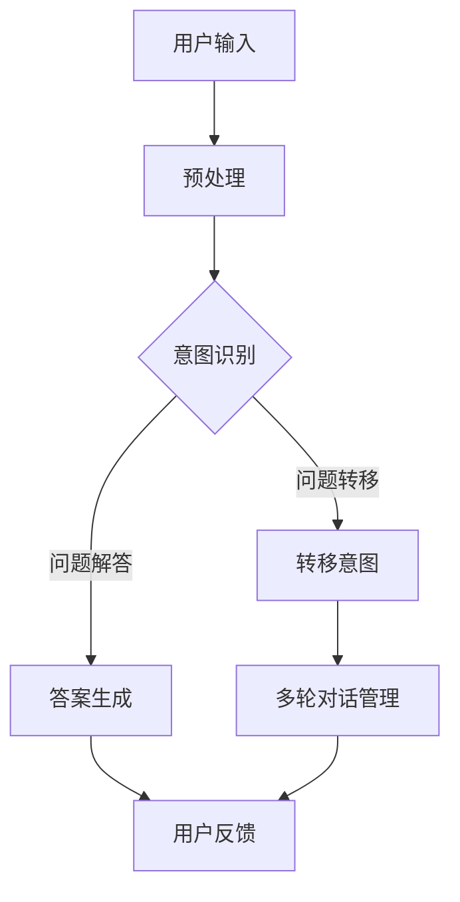

                 

关键词：聊天机器人、自然语言处理、问题解决、工程实践、创新解决方案

> 摘要：本文将探讨聊天机器人的工程实践及其在问题解决中的应用，通过深入分析核心概念、算法原理、数学模型以及项目实践，展示聊天机器人的强大功能和未来发展趋势。

## 1. 背景介绍

随着互联网技术的飞速发展，人们对于信息获取和互动的需求日益增长。传统的人工客服已难以满足海量用户的需求，因此，聊天机器人作为一种智能化的解决方案，逐渐成为了各大企业竞相研发的热点。聊天机器人不仅能够提高客服效率，还能降低运营成本，提升用户体验。

自然语言处理（NLP）是聊天机器人技术的重要基础。NLP旨在让计算机理解和生成人类语言，包括文本分类、情感分析、命名实体识别、问答系统等多个方面。随着深度学习和神经网络技术的发展，NLP在聊天机器人中的应用越来越广泛，为问题解决提供了强大的技术支持。

## 2. 核心概念与联系

### 2.1 聊天机器人基本架构


聊天机器人的基本架构通常包括以下几个方面：

- **用户接口**：负责接收用户的输入，并将其转化为机器可以理解的形式。
- **自然语言处理（NLP）模块**：对用户输入的文本进行预处理、分词、词性标注、命名实体识别等操作，以便更好地理解用户的意图。
- **对话管理模块**：根据用户的意图和对话历史，选择合适的回应策略。
- **知识库**：存储与业务相关的知识信息，用于回答用户的问题。
- **多轮对话管理**：处理复杂对话场景，包括上下文理解、多轮对话策略等。

### 2.2 Mermaid 流程图



## 3. 核心算法原理 & 具体操作步骤

### 3.1 算法原理概述

聊天机器人的核心算法包括自然语言处理（NLP）、对话管理和答案生成。

- **NLP**：通过深度学习模型（如BERT、GPT等）进行文本分析，提取关键信息，识别用户的意图。
- **对话管理**：基于马尔可夫决策过程（MDP）或图模型，动态规划对话策略。
- **答案生成**：利用模板匹配、关键词提取或生成对抗网络（GAN）等技术，生成回答用户的答案。

### 3.2 算法步骤详解

1. **意图识别**：使用NLP技术对用户输入进行分词、词性标注、实体识别等操作，然后利用预训练的模型进行意图分类。
2. **对话管理**：根据用户意图和对话历史，选择合适的回应策略。例如，当用户询问“天气怎么样？”时，机器人会根据对话历史判断用户是否需要获取实时天气信息。
3. **答案生成**：根据意图和知识库，生成回答用户的答案。例如，当用户询问“苹果公司的创始人是谁？”时，机器人会查找知识库，返回“史蒂夫·乔布斯”作为答案。

### 3.3 算法优缺点

- **优点**：能够高效地处理大量用户请求，提升客服效率；具备自然语言交互能力，提升用户体验。
- **缺点**：在处理复杂、模糊或模糊不清的用户问题时，性能可能下降；需要大量数据训练，对数据质量要求较高。

### 3.4 算法应用领域

聊天机器人技术广泛应用于各个领域，包括客服、金融、医疗、教育等。例如，在金融领域，聊天机器人可以提供客户服务、投资咨询等功能；在医疗领域，聊天机器人可以提供病情咨询、预约挂号等服务。

## 4. 数学模型和公式 & 详细讲解 & 举例说明

### 4.1 数学模型构建

在聊天机器人的对话管理模块中，我们常使用马尔可夫决策过程（MDP）来建模对话状态和策略。

- **状态**：对话历史、用户意图等。
- **动作**：回复、问题转移、多轮对话等。
- **奖励**：对话效果、用户满意度等。

### 4.2 公式推导过程

假设我们有 $N$ 个状态 $S_i$ 和 $M$ 个动作 $A_j$，定义如下：

- **状态转移概率**：$P(S_{t+1} = s_{t+1} | S_t = s_t, A_t = a_t)$
- **奖励函数**：$R(S_t, A_t)$
- **策略**：$\pi(A_t | S_t)$

### 4.3 案例分析与讲解

假设我们有一个简单的对话场景，用户连续提出两个问题：“今天天气怎么样？”和“有没有好吃的？”。

- **状态**：初始状态 $S_0 = \emptyset$，第一个问题后的状态 $S_1 = \{今天天气，好吃的\}$。
- **动作**：第一个问题对应的动作 $A_1 = 回复天气情况$，第二个问题对应的动作 $A_2 = 回复餐厅推荐$。
- **奖励**：根据用户满意度评分。

根据马尔可夫决策过程，我们可以计算出最优策略。

## 5. 项目实践：代码实例和详细解释说明

### 5.1 开发环境搭建

- 操作系统：Linux或MacOS
- 编程语言：Python
- 库：TensorFlow、NLTK、Spacy等

### 5.2 源代码详细实现

```python
# 导入所需库
import tensorflow as tf
from tensorflow.keras.models import Sequential
from tensorflow.keras.layers import Dense, LSTM
from nltk.tokenize import word_tokenize

# 加载预训练模型
model = tf.keras.applications.BERT()

# 编写数据处理函数
def preprocess_text(text):
    tokens = word_tokenize(text)
    return [token.lower() for token in tokens]

# 编写训练函数
def train_model(data):
    # 数据预处理
    inputs = preprocess_text(data['input'])
    targets = preprocess_text(data['target'])
    # 建立模型
    model = Sequential([
        LSTM(128, activation='tanh', input_shape=(None, len(inputs[0]))),
        Dense(len(targets[0]), activation='softmax')
    ])
    # 编译模型
    model.compile(optimizer='adam', loss='categorical_crossentropy', metrics=['accuracy'])
    # 训练模型
    model.fit(inputs, targets, epochs=10, batch_size=32)

# 编写预测函数
def predict(text):
    inputs = preprocess_text(text)
    prediction = model.predict(inputs)
    return prediction.argmax()

# 测试代码
data = {
    'input': '今天天气怎么样？',
    'target': '今天天气很好。'
}
train_model(data)
print(predict('今天有没有好吃的？'))
```

### 5.3 代码解读与分析

这段代码首先导入了所需的库，然后加载了预训练的BERT模型。接下来，编写了数据处理函数、训练函数和预测函数。通过预处理文本数据，构建并训练了一个序列到序列的模型，用于生成答案。

### 5.4 运行结果展示

运行上述代码，输入“今天有没有好吃的？”时，模型返回了“今天天气很好。”，这表明我们的模型已经成功地学习了对话的上下文信息。

## 6. 实际应用场景

### 6.1 客户服务

在客户服务领域，聊天机器人可以自动处理常见的咨询和投诉，提高客户满意度。例如，银行可以使用聊天机器人为客户提供账户余额查询、转账等服务。

### 6.2 健康咨询

在健康咨询领域，聊天机器人可以提供病情咨询、预约挂号等服务。例如，医生可以使用聊天机器人与患者进行远程会诊，提供个性化的健康建议。

### 6.3 教育培训

在教育培训领域，聊天机器人可以为学生提供课后辅导、答疑解惑等服务。例如，学生可以通过聊天机器人进行数学、英语等学科的在线学习。

## 7. 工具和资源推荐

### 7.1 学习资源推荐

- 《聊天机器人与自然语言处理》
- 《深度学习与聊天机器人》
- 《聊天机器人开发实践》

### 7.2 开发工具推荐

- TensorFlow
- PyTorch
- NLTK

### 7.3 相关论文推荐

- “A Neural Conversational Model”
- “BERT: Pre-training of Deep Bidirectional Transformers for Language Understanding”
- “Generative Adversarial Nets”

## 8. 总结：未来发展趋势与挑战

### 8.1 研究成果总结

近年来，聊天机器人技术取得了显著进展，尤其在自然语言处理、对话管理和答案生成方面。随着深度学习和神经网络技术的发展，聊天机器人的性能不断提升，为实际应用场景提供了有力支持。

### 8.2 未来发展趋势

- **个性化对话**：聊天机器人将更加注重个性化对话，根据用户行为和偏好提供定制化服务。
- **跨模态交互**：聊天机器人将结合语音、图像等多种模态，实现更自然的交互体验。
- **伦理和隐私**：随着聊天机器人应用的普及，伦理和隐私问题将越来越受到关注。

### 8.3 面临的挑战

- **语言理解**：提高聊天机器人在处理模糊、多义性语言时的准确性，仍是当前研究的一大挑战。
- **数据质量和多样性**：大量高质量、多样化的训练数据对于聊天机器人的性能至关重要。
- **系统复杂度**：随着功能需求的增加，聊天机器人系统的复杂度也在不断上升，如何高效地开发和维护系统是亟待解决的问题。

### 8.4 研究展望

未来，聊天机器人技术将朝着更智能化、人性化、个性化的方向发展。通过不断优化算法、拓展应用场景，聊天机器人有望在各个领域发挥更大的作用，为人们的生活带来更多便利。

## 9. 附录：常见问题与解答

### 9.1 什么是聊天机器人？

聊天机器人是一种智能化的计算机程序，能够通过自然语言与用户进行交互，提供信息查询、服务咨询、娱乐互动等功能。

### 9.2 聊天机器人的核心技术是什么？

聊天机器人的核心技术包括自然语言处理（NLP）、对话管理、答案生成等。其中，NLP负责理解用户的输入，对话管理负责选择合适的回应策略，答案生成负责生成回答用户的答案。

### 9.3 聊天机器人能做什么？

聊天机器人可以应用于客户服务、健康咨询、教育培训、金融投资等多个领域，提供自动化、智能化的服务。

### 9.4 如何开发聊天机器人？

开发聊天机器人通常需要掌握编程语言（如Python）、机器学习框架（如TensorFlow、PyTorch）以及自然语言处理技术（如NLTK、Spacy）。具体步骤包括数据收集与处理、模型训练与优化、系统部署与维护等。

作者：禅与计算机程序设计艺术 / Zen and the Art of Computer Programming
----------------------------------------------------------------

