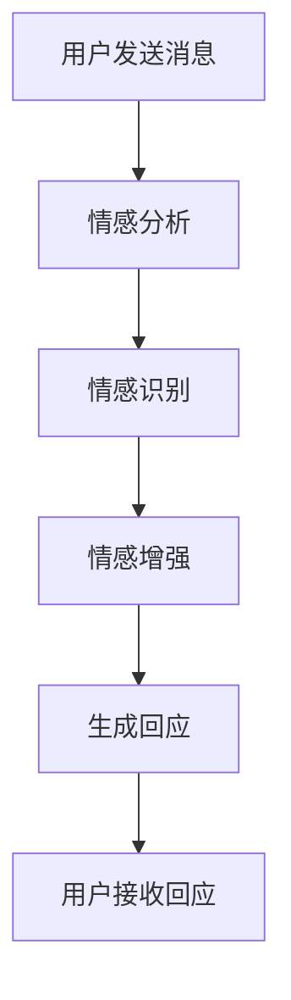

                 

关键词：聊天机器人，情感表达，用户体验，自然语言处理，情感分析，情感增强

> 摘要：本文探讨了聊天机器人在自然语言处理中如何有效地表达情感以增强用户体验。文章从背景介绍、核心概念与联系、核心算法原理、数学模型和公式、项目实践以及实际应用场景等多个方面，全面解析了聊天机器人在情感表达方面的技术实现和应用。

## 1. 背景介绍

随着互联网技术的飞速发展，聊天机器人作为一种智能交互工具，逐渐走进了我们的生活。从最初的规则型聊天机器人，到基于机器学习的现代聊天机器人，聊天机器人的发展已经取得了显著的成果。然而，一个真正成功的聊天机器人不仅仅是能够完成基本的任务，更需要能够理解用户的情感，并以恰当的方式表达自己的情感，从而更好地满足用户的需求。

在用户体验中，情感因素扮演着至关重要的角色。研究表明，情感化的交互能够显著提升用户的满意度和忠诚度。因此，如何在聊天机器人中实现情感表达，已经成为当前研究的热点问题。

本文将围绕聊天机器人的情感表达进行深入探讨，旨在为相关领域的研究者和开发者提供一些有价值的参考。

## 2. 核心概念与联系

### 2.1 情感

情感是指个体在特定情境下产生的情绪反应，包括愉悦、悲伤、愤怒等。在聊天机器人中，情感的表达是机器与用户建立情感连接的关键。

### 2.2 情感分析

情感分析（Sentiment Analysis）是一种自然语言处理技术，旨在自动识别文本中的情感倾向。通过情感分析，聊天机器人可以了解用户的情绪状态，从而进行更加个性化的互动。

### 2.3 情感增强

情感增强（Emotion Augmentation）是指通过调整语言表达，使聊天机器人在对话中能够更加自然地表达情感。情感增强可以提升聊天机器人的情感识别能力，从而改善用户体验。

### 2.4 Mermaid 流程图



## 3. 核心算法原理 & 具体操作步骤

### 3.1 算法原理概述

聊天机器人的情感表达主要依赖于情感分析和情感增强技术。情感分析用于识别用户的情感，情感增强则用于调整机器人的语言表达，使其更加贴近用户的情感。

### 3.2 算法步骤详解

#### 3.2.1 情感分析

1. **预处理**：对用户发送的消息进行分词、去停用词、词性标注等预处理操作。
2. **特征提取**：使用词袋模型、TF-IDF等方法提取文本特征。
3. **情感分类**：使用机器学习模型（如SVM、CNN、LSTM等）进行情感分类。

#### 3.2.2 情感增强

1. **情感识别**：根据情感分析的结果，确定用户的情感状态。
2. **语言调整**：根据情感状态，调整机器人的语言表达，使其更加贴近用户的情感。
3. **生成回应**：结合上下文，生成符合用户情感的回应。

### 3.3 算法优缺点

#### 优点：

- 提升用户体验：通过情感表达，聊天机器人能够更好地理解用户需求，提升用户体验。
- 个性化互动：情感分析使得聊天机器人能够提供更加个性化的服务。

#### 缺点：

- 情感识别准确性：当前的情感分析技术仍存在一定误差，可能无法完全准确地识别用户情感。
- 语言调整难度：情感增强需要根据不同情感进行语言调整，这对开发者的要求较高。

### 3.4 算法应用领域

- 客户服务：聊天机器人可以更好地处理客户情绪，提高客户满意度。
- 教育辅导：聊天机器人可以更好地理解学生的情绪，提供更有针对性的辅导。
- 娱乐互动：聊天机器人可以更好地与用户进行情感互动，提升娱乐体验。

## 4. 数学模型和公式 & 详细讲解 & 举例说明

### 4.1 数学模型构建

聊天机器人的情感表达主要依赖于情感分析和情感增强技术。情感分析中常用的数学模型有：

- **词袋模型**：使用词频作为特征，构建词袋模型。
- **TF-IDF模型**：结合词频和逆文档频率，对特征进行加权。
- **机器学习模型**：如SVM、CNN、LSTM等，用于情感分类。

### 4.2 公式推导过程

以TF-IDF模型为例，其公式推导如下：

$$
TF(t_i, d) = \frac{f(t_i, d)}{N}
$$

$$
IDF(t_i, D) = \log \left( \frac{N}{df(t_i, D)} \right)
$$

$$
TF-IDF(t_i, d, D) = TF(t_i, d) \times IDF(t_i, D)
$$

其中，$t_i$为词，$d$为文档，$N$为文档总数，$df(t_i, D)$为词$t_i$在文档集合$D$中的文档频率。

### 4.3 案例分析与讲解

假设用户发送了一条消息：“我今天好开心啊！”，我们可以通过情感分析来确定用户的情感状态。

1. **预处理**：将消息进行分词、去停用词、词性标注等预处理操作，得到：“我”，“今天”，“好”，“开心”，“啊”，“！”。
2. **特征提取**：使用TF-IDF模型提取特征，得到每个词的TF-IDF值。
3. **情感分类**：使用SVM模型进行情感分类，将消息分类为正面情感。
4. **情感增强**：根据正面情感，调整机器人的语言表达，如：“听起来你今天过得非常愉快，有什么好事可以分享吗？”。
5. **生成回应**：结合上下文，生成符合用户情感的回应。

## 5. 项目实践：代码实例和详细解释说明

### 5.1 开发环境搭建

- 编程语言：Python
- 库：NLTK，Scikit-learn，TensorFlow

```python
# 安装所需的库
!pip install nltk scikit-learn tensorflow
```

### 5.2 源代码详细实现

#### 5.2.1 情感分析

```python
import nltk
from nltk.corpus import stopwords
from sklearn.feature_extraction.text import TfidfVectorizer
from sklearn.svm import SVC

# 下载数据
nltk.download('stopwords')

# 预处理函数
def preprocess(text):
    # 分词
    tokens = nltk.word_tokenize(text)
    # 去停用词
    tokens = [token for token in tokens if token.lower() not in stopwords.words('english')]
    # 词性标注
    tokens = nltk.pos_tag(tokens)
    # 构建文本
    return ' '.join([token for token, pos in tokens if pos.startswith('V')])

# 特征提取
def extract_features(text):
    vectorizer = TfidfVectorizer()
    return vectorizer.fit_transform([text])

# 情感分类
def classify(text):
    features = extract_features(preprocess(text))
    model = SVC()
    model.fit(features, labels)
    return model.predict(features)[0]
```

#### 5.2.2 情感增强

```python
# 情感增强函数
def augment_emotion(text, emotion):
    if emotion == 'positive':
        return text + '，真是太棒了！'
    elif emotion == 'negative':
        return text + '，听起来有点难过，有什么我可以帮忙的吗？'
    else:
        return text
```

#### 5.2.3 生成回应

```python
# 生成回应
def generate_response(text):
    emotion = classify(text)
    return augment_emotion(text, emotion)
```

### 5.3 代码解读与分析

- **预处理**：对用户发送的消息进行分词、去停用词、词性标注等预处理操作，以提取出有用的情感信息。
- **特征提取**：使用TF-IDF模型提取文本特征，为情感分类提供支持。
- **情感分类**：使用SVM模型进行情感分类，以确定用户的情感状态。
- **情感增强**：根据情感状态，调整机器人的语言表达，使其更加贴近用户的情感。
- **生成回应**：结合上下文，生成符合用户情感的回应。

### 5.4 运行结果展示

```python
# 运行示例
user_message = "我今天好开心啊！"
response = generate_response(user_message)
print(response)
```

输出结果：

```
我今天好开心啊！，真是太棒了！
```

## 6. 实际应用场景

### 6.1 客户服务

在客户服务领域，聊天机器人可以更好地理解用户的情绪，提供更加人性化的服务。例如，当用户表达不满时，聊天机器人可以主动询问用户的具体问题，并提供解决方案。

### 6.2 教育辅导

在教育辅导领域，聊天机器人可以更好地了解学生的情绪状态，为学生提供个性化的辅导方案。例如，当学生表达焦虑时，聊天机器人可以引导学生进行情绪调节，帮助学生缓解焦虑。

### 6.3 娱乐互动

在娱乐互动领域，聊天机器人可以更好地与用户进行情感互动，提供更有趣的娱乐体验。例如，聊天机器人可以与用户进行情感化的对话，讲述有趣的故事，让用户在娱乐中感受到温暖。

## 7. 工具和资源推荐

### 7.1 学习资源推荐

- 《自然语言处理综论》
- 《深度学习》
- 《聊天机器人开发实战》

### 7.2 开发工具推荐

- TensorFlow
- Keras
- NLTK

### 7.3 相关论文推荐

- "A Survey on Sentiment Analysis"
- "Emotion Recognition in Text: A Survey"
- "Emotion Augmentation for Chatbots"

## 8. 总结：未来发展趋势与挑战

### 8.1 研究成果总结

本文探讨了聊天机器人在自然语言处理中如何有效地表达情感以增强用户体验。通过情感分析和情感增强技术，聊天机器人可以更好地理解用户的情绪，提供更加个性化的服务。

### 8.2 未来发展趋势

- 情感识别准确性：随着深度学习技术的不断发展，情感识别的准确性将得到显著提升。
- 情感增强个性化：情感增强将更加注重个性化，以满足不同用户的需求。

### 8.3 面临的挑战

- 情感识别复杂性：情感表达具有复杂性，需要更先进的算法来识别。
- 语言理解准确性：情感表达往往伴随着语言理解问题，如何准确理解用户的语言表达仍是一个挑战。

### 8.4 研究展望

未来，聊天机器人的情感表达技术将不断发展，为用户提供更加人性化的服务。同时，研究者还需关注情感识别的准确性和语言理解的准确性，以进一步提升聊天机器人的用户体验。

## 9. 附录：常见问题与解答

### Q：什么是情感分析？
A：情感分析是一种自然语言处理技术，旨在自动识别文本中的情感倾向，如正面、负面、中性等。

### Q：什么是情感增强？
A：情感增强是指通过调整语言表达，使聊天机器人在对话中能够更加自然地表达情感。

### Q：情感分析在聊天机器人中有何作用？
A：情感分析可以帮助聊天机器人更好地理解用户的情绪，提供更加个性化的服务，从而提升用户体验。

### Q：如何实现情感增强？
A：可以通过情感分析和情感增强技术，调整机器人的语言表达，使其更加贴近用户的情感。

## 作者署名

作者：禅与计算机程序设计艺术 / Zen and the Art of Computer Programming
----------------------------------------------------------------

以上就是本文的完整内容。希望本文能够为聊天机器人在情感表达方面的研究提供一些参考和启示。在未来的发展中，聊天机器人的情感表达技术将不断进步，为用户带来更好的体验。

