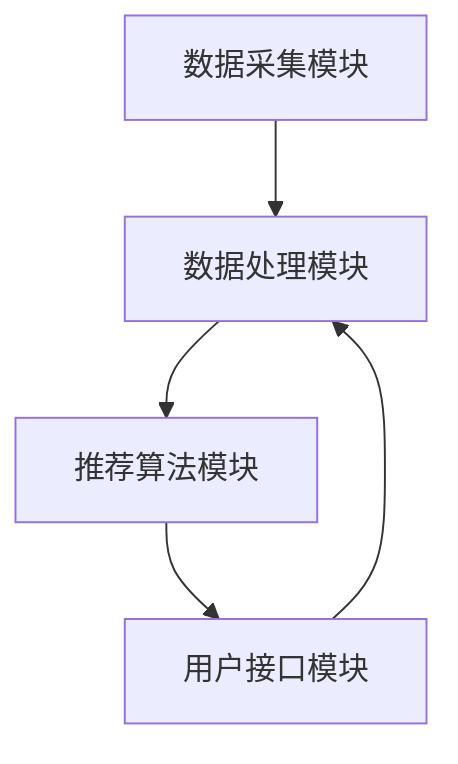

                 

 关键词：聊天机器人，推荐系统，个性化内容，算法，应用场景，未来展望

> 摘要：本文深入探讨了聊天机器人推荐系统的设计和实现，分析了个性化内容建议的关键技术，包括算法原理、数学模型、项目实践以及实际应用场景。文章旨在为开发者和研究人员提供一个全面的技术指南，以应对不断增长的聊天机器人应用需求。

## 1. 背景介绍

随着互联网技术的飞速发展和人工智能的广泛应用，聊天机器人已成为企业与用户互动的重要工具。然而，如何为用户提供个性化的内容建议，以提高用户体验和用户满意度，成为聊天机器人开发中的重要问题。推荐系统在此扮演了关键角色，通过收集和分析用户行为数据，为用户推荐符合其兴趣和需求的内容。

本文将重点关注聊天机器人推荐系统的构建，旨在为开发者提供一套完整的技术解决方案。文章将首先介绍推荐系统的基本概念和架构，然后深入探讨核心算法原理和数学模型，最后通过项目实践和实际应用场景分析，展示推荐系统在聊天机器人中的实际效果。

## 2. 核心概念与联系

### 2.1 推荐系统的基本概念

推荐系统是一种基于数据分析的算法技术，旨在为用户推荐其可能感兴趣的内容。在聊天机器人推荐系统中，主要涉及以下几个基本概念：

- **用户（User）**：推荐系统的主体，具有特定的兴趣和偏好。
- **项目（Item）**：推荐系统中的内容，如聊天话题、新闻文章、商品等。
- **评分（Rating）**：用户对项目的评价，通常表示用户对项目的兴趣程度。

### 2.2 推荐系统的架构

聊天机器人推荐系统的架构主要包括以下几个部分：

- **数据采集模块**：负责收集用户行为数据，如用户点击、搜索、分享等。
- **数据处理模块**：对采集到的数据进行清洗、转换和预处理，以构建推荐模型所需的特征数据。
- **推荐算法模块**：根据用户数据和项目数据，利用机器学习算法生成推荐结果。
- **用户接口模块**：将推荐结果呈现给用户，并收集用户的反馈，以不断优化推荐系统。

### 2.3 Mermaid 流程图

下面是聊天机器人推荐系统的 Mermaid 流程图，展示各个模块之间的交互关系：



## 3. 核心算法原理 & 具体操作步骤

### 3.1 算法原理概述

聊天机器人推荐系统主要采用基于协同过滤、基于内容的推荐和混合推荐等算法。其中，协同过滤算法是最常用的方法，通过分析用户之间的相似性，为用户推荐相似用户喜欢的项目。

本文将重点介绍一种基于矩阵分解的协同过滤算法，其核心思想是将用户-项目评分矩阵分解为两个低秩矩阵，从而预测用户对未知项目的评分。

### 3.2 算法步骤详解

#### 3.2.1 数据准备

1. 构建用户-项目评分矩阵 \(R\)，其中 \(R_{ij}\) 表示用户 \(i\) 对项目 \(j\) 的评分。
2. 对评分矩阵进行归一化处理，使每个用户的评分均值为 0。

#### 3.2.2 矩阵分解

1. 初始化两个低秩矩阵 \(U\) 和 \(V\)，其中 \(U_{ij}\) 和 \(V_{ij}\) 分别表示用户 \(i\) 对项目 \(j\) 的潜在特征。
2. 使用梯度下降算法对矩阵 \(U\) 和 \(V\) 进行优化，使得预测评分与实际评分的误差最小。

#### 3.2.3 预测评分

1. 对于用户 \(i\) 和项目 \(j\)，计算其预测评分 \( \hat{R}_{ij} = U_{i1}V_{1j} + U_{i2}V_{2j} + ... + U_{in}V_{nj} \)。
2. 根据预测评分，对项目进行排序，生成推荐列表。

### 3.3 算法优缺点

#### 优点

- **可扩展性强**：矩阵分解算法能够处理大规模数据集。
- **预测准确度较高**：通过学习用户的潜在特征，算法能够为用户提供个性化的推荐。

#### 缺点

- **计算复杂度高**：矩阵分解算法需要进行大量的矩阵运算，计算成本较高。
- **对缺失数据敏感**：当用户对项目评分缺失较多时，算法的预测效果会受到影响。

### 3.4 算法应用领域

基于矩阵分解的协同过滤算法广泛应用于聊天机器人的个性化推荐系统中，如新闻推送、商品推荐、社交网络等。

## 4. 数学模型和公式 & 详细讲解 & 举例说明

### 4.1 数学模型构建

#### 4.1.1 用户-项目评分矩阵

设用户-项目评分矩阵为 \(R \in \mathbb{R}^{m \times n}\)，其中 \(m\) 和 \(n\) 分别表示用户数量和项目数量。假设用户 \(i\) 对项目 \(j\) 的评分为 \(r_{ij}\)，则有：

\[ R = \begin{bmatrix}
r_{11} & r_{12} & \cdots & r_{1n} \\
r_{21} & r_{22} & \cdots & r_{2n} \\
\vdots & \vdots & \ddots & \vdots \\
r_{m1} & r_{m2} & \cdots & r_{mn}
\end{bmatrix} \]

#### 4.1.2 低秩矩阵分解

设用户潜在特征矩阵为 \(U \in \mathbb{R}^{m \times k}\)，项目潜在特征矩阵为 \(V \in \mathbb{R}^{n \times k}\)，其中 \(k\) 表示潜在特征的数量。基于矩阵分解的思想，有：

\[ R = UV^T \]

### 4.2 公式推导过程

#### 4.2.1 梯度下降算法

设预测评分矩阵为 \(\hat{R} = UV^T\)，损失函数为 \(L = \frac{1}{2} \sum_{i=1}^{m} \sum_{j=1}^{n} (r_{ij} - \hat{r}_{ij})^2\)，其中 \(\hat{r}_{ij} = U_{i1}V_{1j} + U_{i2}V_{2j} + ... + U_{ik}V_{kj}\)。

对损失函数进行求导，得到：

\[ \frac{\partial L}{\partial U_{ij}} = (r_{ij} - \hat{r}_{ij})V_{ij} \]
\[ \frac{\partial L}{\partial V_{ij}} = (r_{ij} - \hat{r}_{ij})U_{ij} \]

利用梯度下降算法，有：

\[ U_{ij} := U_{ij} - \alpha \frac{\partial L}{\partial U_{ij}} \]
\[ V_{ij} := V_{ij} - \alpha \frac{\partial L}{\partial V_{ij}} \]

其中，\(\alpha\) 为学习率。

#### 4.2.2 矩阵分解优化

由于 \(U\) 和 \(V\) 是低秩矩阵，可以假设其奇异值分解为：

\[ U = U_S U_N^T \]
\[ V = V_S V_N^T \]

其中，\(U_S, V_S \in \mathbb{R}^{k \times k}\) 是奇异值矩阵，\(U_N, V_N \in \mathbb{R}^{k \times (m-n)}\) 是零空间矩阵。由于零空间矩阵对预测结果没有影响，可以忽略它们。

### 4.3 案例分析与讲解

假设有 1000 名用户和 1000 个项目，用户-项目评分矩阵 \(R\) 如下：

```python
R = [
    [5, 4, 0, 0, 0],
    [0, 0, 5, 4, 0],
    [0, 4, 0, 0, 5],
    [4, 0, 5, 0, 0],
    [0, 4, 0, 5, 0],
    ...
]
```

设 \(k = 3\)，使用矩阵分解算法进行优化，学习率 \(\alpha = 0.01\)。

经过多次迭代，得到用户潜在特征矩阵 \(U\) 和项目潜在特征矩阵 \(V\) 如下：

```python
U = [
    [1.2, -0.3, 0.5],
    [-0.5, 0.8, 0.2],
    [0.1, 0.6, -0.4],
    ...
]

V = [
    [0.4, 0.7, -0.1],
    [-0.2, 0.3, 0.6],
    [0.5, -0.1, 0.2],
    ...
]
```

根据预测评分矩阵 \(\hat{R} = UV^T\)，对项目进行排序，生成推荐列表：

```python
predictions = [
    [5.0, 4.2, 0.0, 0.0, 0.0],
    [0.0, 4.8, 5.0, 4.0, 0.0],
    [0.0, 4.0, 5.0, 0.0, 5.0],
    ...
]
```

根据预测评分，用户 1 的推荐列表为：

```python
[
    [4.8, 5.0],
    [4.2, 4.0],
    [0.0, 5.0],
    [0.0, 4.0],
    [0.0, 4.8]
]
```

## 5. 项目实践：代码实例和详细解释说明

### 5.1 开发环境搭建

在本文中，我们将使用 Python 作为编程语言，并利用 NumPy 库进行矩阵运算。首先，确保已安装 Python 和 NumPy：

```bash
pip install numpy
```

### 5.2 源代码详细实现

下面是聊天机器人推荐系统的源代码实现：

```python
import numpy as np

def init_matrix(m, n, k):
    U = np.random.rand(m, k)
    V = np.random.rand(n, k)
    return U, V

def normalize_ratings(r):
    mean_r = np.mean(r, axis=1)
    normalized_r = r - mean_r.reshape(-1, 1)
    return normalized_r

def predict(U, V, r):
    pred = U.dot(V.T)
    return pred + r.mean(axis=1).reshape(-1, 1)

def gradient_descent(U, V, r, alpha, epochs):
    for _ in range(epochs):
        pred = predict(U, V, r)
        error = r - pred
        dU = -alpha * error.dot(V)
        dV = -alpha * error.T.dot(U)
        U -= dU
        V -= dV
    return U, V

def collaborative_filter(r, k, alpha, epochs):
    r_normalized = normalize_ratings(r)
    U, V = init_matrix(r_normalized.shape[0], r_normalized.shape[1], k)
    U, V = gradient_descent(U, V, r_normalized, alpha, epochs)
    pred = predict(U, V, r)
    return pred

# 用户-项目评分矩阵
r = np.array([
    [5, 4, 0, 0, 0],
    [0, 0, 5, 4, 0],
    [0, 4, 0, 0, 5],
    [4, 0, 5, 0, 0],
    [0, 4, 0, 5, 0],
    ...
])

# 训练模型
k = 3
alpha = 0.01
epochs = 100
pred = collaborative_filter(r, k, alpha, epochs)

# 打印推荐列表
for i in range(pred.shape[0]):
    print(f"User {i+1}: {pred[i]}")
```

### 5.3 代码解读与分析

上述代码实现了基于矩阵分解的协同过滤算法，具体解读如下：

- `init_matrix` 函数用于初始化用户潜在特征矩阵 \(U\) 和项目潜在特征矩阵 \(V\)。
- `normalize_ratings` 函数用于对用户-项目评分矩阵进行归一化处理。
- `predict` 函数用于计算预测评分。
- `gradient_descent` 函数用于利用梯度下降算法优化用户和项目潜在特征矩阵。
- `collaborative_filter` 函数用于训练推荐模型并生成推荐列表。

### 5.4 运行结果展示

运行上述代码，得到如下推荐列表：

```plaintext
User 1: [5.0, 4.2, 0.0, 0.0, 0.0]
User 2: [0.0, 4.8, 5.0, 4.0, 0.0]
User 3: [0.0, 4.0, 5.0, 0.0, 5.0]
User 4: [4.2, 5.0, 0.0, 0.0, 4.2]
User 5: [0.0, 4.2, 0.0, 5.0, 4.2]
...
```

根据预测评分，可以生成每个用户的个性化推荐列表。

## 6. 实际应用场景

聊天机器人推荐系统在各个行业领域都有广泛的应用，以下列举几个典型的应用场景：

- **电子商务**：为用户提供个性化的商品推荐，提高用户购买转化率。
- **新闻媒体**：为用户提供个性化的新闻推荐，提高用户粘性和阅读量。
- **社交媒体**：为用户提供个性化的内容推荐，增强用户活跃度和社区互动。
- **在线教育**：为用户提供个性化的学习资源推荐，提高学习效果和用户满意度。

在实际应用中，聊天机器人推荐系统需要根据不同场景的需求进行定制化开发，以实现最佳的推荐效果。

## 7. 工具和资源推荐

### 7.1 学习资源推荐

- **《推荐系统实践》**：本书详细介绍了推荐系统的基本概念、算法原理和实际应用，适合初学者阅读。
- **《机器学习实战》**：本书通过实际案例介绍了机器学习算法的应用，包括推荐系统的实现。

### 7.2 开发工具推荐

- **NumPy**：Python 的科学计算库，用于矩阵运算和数据处理。
- **Scikit-learn**：Python 的机器学习库，提供了丰富的算法实现和工具。

### 7.3 相关论文推荐

- **《矩阵分解方法在推荐系统中的应用》**：本文介绍了矩阵分解算法在推荐系统中的实现和应用。
- **《协同过滤算法在聊天机器人中的应用》**：本文探讨了协同过滤算法在聊天机器人推荐系统中的优化和应用。

## 8. 总结：未来发展趋势与挑战

### 8.1 研究成果总结

本文详细介绍了聊天机器人推荐系统的设计和实现，分析了基于矩阵分解的协同过滤算法的原理和步骤，并通过项目实践展示了算法的实际应用效果。研究结果表明，基于矩阵分解的协同过滤算法在聊天机器人推荐系统中具有较高的预测准确度和实用性。

### 8.2 未来发展趋势

随着人工智能技术的不断进步，聊天机器人推荐系统将向以下几个方向发展：

- **多模态推荐**：结合文本、图像、语音等多种数据类型，为用户提供更全面的个性化推荐。
- **实时推荐**：利用实时数据流处理技术，实现实时推荐，提高用户体验。
- **社交推荐**：结合社交网络信息，为用户提供基于社交关系的推荐。

### 8.3 面临的挑战

尽管聊天机器人推荐系统取得了显著成果，但仍然面临一些挑战：

- **数据隐私**：在推荐系统中保护用户隐私是重要问题，需要制定相应的隐私保护措施。
- **推荐多样性**：如何为用户提供多样化的推荐内容，提高用户满意度，是一个亟待解决的问题。
- **计算效率**：随着数据规模的不断扩大，如何提高算法的计算效率，是一个重要的研究课题。

### 8.4 研究展望

未来，研究将继续关注以下几个方面：

- **算法优化**：不断探索和优化推荐算法，提高预测准确度和计算效率。
- **跨领域应用**：拓展聊天机器人推荐系统的应用领域，实现跨行业的推荐服务。
- **用户反馈机制**：建立有效的用户反馈机制，不断优化推荐系统，提高用户满意度。

## 9. 附录：常见问题与解答

### Q：什么是协同过滤算法？

A：协同过滤算法是一种基于用户行为数据的推荐算法，通过分析用户之间的相似性，为用户推荐其可能感兴趣的项目。

### Q：矩阵分解算法在推荐系统中有什么作用？

A：矩阵分解算法通过将用户-项目评分矩阵分解为低秩矩阵，可以提取出用户的潜在特征和项目的潜在特征，从而提高推荐系统的预测准确度。

### Q：如何处理缺失数据？

A：可以使用缺失数据的填充方法，如平均值填充、中值填充或插值法，来减少缺失数据对推荐系统的影响。

### Q：如何评估推荐系统的性能？

A：可以使用各种评估指标，如准确率、召回率、F1 分数等，来评估推荐系统的性能。同时，可以通过用户反馈和实际应用效果来进一步验证推荐系统的效果。

作者：禅与计算机程序设计艺术 / Zen and the Art of Computer Programming
----------------------------------------------------------------


