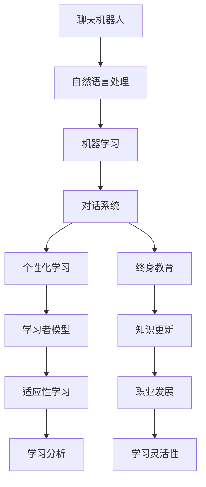

                 

关键词：聊天机器人，教育技术，个性化学习，终身教育，人工智能，算法原理，数学模型，代码实例，应用场景，工具推荐。

> 摘要：本文探讨了聊天机器人在教育领域的变革性应用，特别是其在个性化学习和终身教育中的作用。通过对核心概念、算法原理、数学模型以及具体实例的分析，本文揭示了聊天机器人如何通过智能技术助力教育创新，并提出了未来的发展展望和面临的挑战。

## 1. 背景介绍

在现代社会，教育正经历着前所未有的变革。传统的教学模式受到人工智能（AI）和大数据技术的冲击，逐渐向更加个性化和终身化的方向发展。聊天机器人，作为一种新型的智能教育工具，正成为推动教育变革的重要力量。

聊天机器人通过自然语言处理（NLP）技术，可以与用户进行实时互动，提供个性化的学习建议和解答疑问。这种智能化的交互方式，不仅提高了学习效率，还促进了个性化教育的实现。此外，随着人工智能技术的不断进步，聊天机器人在教育中的应用场景也日益广泛，从在线辅导到职业培训，从语言学习到编程教学，都有着广阔的前景。

终身教育作为一种重要的教育理念，强调的是学习者的持续成长和适应能力。随着知识更新速度的加快，个体需要不断地学习新知识、新技能以适应社会发展的需求。聊天机器人在这一领域也发挥着重要作用，它们可以通过智能推荐系统，为学习者提供持续的学习资源和个性化指导，帮助他们在终身学习过程中保持竞争力。

本文将围绕聊天机器人在教育领域的应用，探讨其个性化学习和终身教育的潜力，并分析其在算法、数学模型、代码实现和应用实践等方面的具体实现方式。

## 2. 核心概念与联系

### 2.1 聊天机器人的核心概念

聊天机器人是一种基于人工智能技术的软件应用，能够通过文本或语音与用户进行交互。其核心概念包括自然语言处理（NLP）、机器学习（ML）和对话系统（Dialogue System）。

自然语言处理（NLP）：NLP是使计算机能够理解、解释和生成人类语言的技术。它包括文本预处理、词性标注、命名实体识别、情感分析等任务。

机器学习（ML）：ML是使计算机通过数据学习并改进性能的技术。聊天机器人通过ML算法，可以从与用户的交互中学习，提高交互的准确性和自然性。

对话系统（Dialogue System）：对话系统是指能够与用户进行有效对话的计算机系统。它通常包括对话管理、语音识别、文本生成等模块，以实现自然、流畅的交互体验。

### 2.2 个性化学习的核心概念

个性化学习是一种以学习者为中心的教育理念，旨在根据学习者的个性、兴趣和需求提供定制化的学习体验。个性化学习的核心概念包括：

学习者模型：学习者模型是关于学习者个性、兴趣、学习风格和知识水平的抽象表示。它为聊天机器人提供了解学习者的基础信息，以便进行个性化推荐。

适应性学习：适应性学习是指根据学习者的表现和学习进度动态调整教学内容和教学方法。聊天机器人通过分析学习者的交互数据，可以实时调整学习路径，提高学习效果。

学习分析：学习分析是通过分析学习者的行为和成绩数据，识别学习者的学习模式、困难和需求。聊天机器人可以利用学习分析技术，为学习者提供个性化的学习建议。

### 2.3 终身教育的核心概念

终身教育是一种贯穿个体一生的教育理念，强调不断学习、持续成长和适应社会发展的需求。终身教育的核心概念包括：

知识更新：知识更新是指随着时间推移，新知识、新技能不断涌现，个体需要不断学习以保持竞争力。聊天机器人可以通过智能推荐系统，为学习者提供最新的学习资源和知识。

职业发展：职业发展是指个体在职业生涯中不断学习新技能，以适应职位晋升和行业变化。聊天机器人可以提供个性化的职业培训，帮助学习者提升职业技能。

学习灵活性：学习灵活性是指个体可以根据自己的时间和兴趣自由选择学习内容和方式。聊天机器人可以提供灵活的学习安排和个性化的学习路径，满足学习者的不同需求。

### 2.4 核心概念之间的联系

聊天机器人与个性化学习和终身教育之间存在着紧密的联系。首先，聊天机器人通过NLP和ML技术，可以理解学习者的需求和兴趣，提供个性化的学习建议和资源，实现个性化学习。其次，聊天机器人可以根据学习者的学习进度和表现，动态调整学习内容和教学方法，提高学习效果。此外，聊天机器人还可以通过智能推荐系统，为学习者提供最新的知识资源和职业培训，帮助他们在终身学习过程中保持竞争力。

总的来说，聊天机器人在个性化学习和终身教育中发挥着重要作用。通过智能化的交互和个性化的服务，聊天机器人不仅提高了学习效率，还为教育创新提供了新的可能性。

### 2.5 Mermaid 流程图



### 3. 核心算法原理 & 具体操作步骤

#### 3.1 算法原理概述

聊天机器人在教育应用中的核心算法主要包括自然语言处理（NLP）和机器学习（ML）两大类。以下是这两种算法的基本原理：

**自然语言处理（NLP）：**

NLP是一种使计算机能够理解、解释和生成人类语言的技术。它包括以下几个关键步骤：

1. **文本预处理：** 包括去除标点符号、停用词过滤、词形还原等。
2. **词性标注：** 对文本中的单词进行词性分类，如名词、动词、形容词等。
3. **命名实体识别：** 识别文本中的特定实体，如人名、地名、组织名等。
4. **情感分析：** 分析文本中的情感倾向，如正面、负面、中性等。

**机器学习（ML）：**

ML是一种使计算机通过数据学习并改进性能的技术。聊天机器人中的ML算法主要用于以下两个方面：

1. **对话管理：** 根据上下文和用户输入，生成合适的回复。
2. **个性化推荐：** 根据学习者的行为和兴趣，推荐合适的学习资源和课程。

#### 3.2 算法步骤详解

**自然语言处理（NLP）：**

1. **文本预处理：** 使用正则表达式和字符串操作对文本进行预处理，如去除标点符号、转换为小写等。
2. **词性标注：** 利用词性标注工具（如NLTK、spaCy），对预处理后的文本进行词性标注。
3. **命名实体识别：** 使用命名实体识别工具（如Stanford NER、BERT），识别文本中的命名实体。
4. **情感分析：** 使用情感分析模型（如VADER、TextBlob），对文本进行情感分析。

**机器学习（ML）：**

1. **对话管理：** 使用序列到序列（Seq2Seq）模型，如长短期记忆网络（LSTM）或变换器（Transformer），进行对话生成。
2. **个性化推荐：** 使用协同过滤（Collaborative Filtering）或基于内容的推荐（Content-Based Filtering），为学习者推荐学习资源和课程。

#### 3.3 算法优缺点

**自然语言处理（NLP）：**

**优点：**
- 高效地处理大量文本数据。
- 提供丰富的文本分析功能。

**缺点：**
- 需要大量的训练数据和计算资源。
- 对文本理解能力有限，难以处理复杂语境。

**机器学习（ML）：**

**优点：**
- 可以从数据中自动学习，提高系统性能。
- 适用于个性化推荐和对话生成。

**缺点：**
- 需要大量的数据和计算资源。
- 模型解释性较差，难以理解学习过程。

#### 3.4 算法应用领域

**自然语言处理（NLP）：**

- 文本分类
- 情感分析
- 聊天机器人
- 自动摘要

**机器学习（ML）：**

- 对话生成
- 个性化推荐
- 风险管理
- 医疗诊断

通过NLP和ML的结合，聊天机器人可以提供高效、智能的教育服务，满足个性化学习和终身教育的需求。

## 4. 数学模型和公式 & 详细讲解 & 举例说明

#### 4.1 数学模型构建

在聊天机器人的教育应用中，数学模型主要用于以下几个方面：

1. **文本分类模型：** 用于对用户的文本输入进行分类，如情感分类、课程分类等。
2. **推荐模型：** 用于根据用户的行为和兴趣，推荐合适的学习资源和课程。
3. **对话生成模型：** 用于根据上下文和用户输入，生成合适的回复。

以下是一个简单的文本分类模型的数学模型构建过程：

**假设：**
- 文本数据集为T = {t1, t2, ..., tk}，其中每个文本ti可以表示为一个向量vi ∈ R^d。
- 标签集合为L = {l1, l2, ..., lm}，其中每个标签li可以表示为一个二进制向量yi ∈ {0, 1}。

**步骤：**
1. **特征提取：** 将文本数据转换为向量表示，常用的方法包括词袋模型（Bag-of-Words, BoW）、TF-IDF（Term Frequency-Inverse Document Frequency）等。
2. **模型训练：** 使用监督学习算法，如朴素贝叶斯（Naive Bayes）、支持向量机（SVM）、神经网络（Neural Network）等，训练分类模型。
3. **模型评估：** 使用准确率（Accuracy）、召回率（Recall）、F1值（F1 Score）等指标评估模型性能。

#### 4.2 公式推导过程

1. **特征提取：**
   - 词袋模型（BoW）：v_i = (f_{i1}, f_{i2}, ..., f_{in})，其中f_{ij}表示词w_j在文档i中的出现次数。
   - TF-IDF：v_i = (t_{i1}, t_{i2}, ..., t_{in})，其中t_{ij} = log(1 + f_{ij}) * log(N / df_j)，df_j表示词w_j在训练集中的文档频率。

2. **模型训练：**
   - 朴素贝叶斯：p(y_i = l_j | v_i) = p(v_i | y_i = l_j) * p(y_i = l_j) / p(v_i)
   - 支持向量机：w = arg min_w Σ_i (y_i * (w * v_i - 1))^2 + C * Σ_i ||w||^2
   - 神经网络：使用反向传播算法训练多层感知器（MLP），计算输出层的误差并更新权重。

3. **模型评估：**
   - 准确率（Accuracy）：Accuracy = (TP + TN) / (TP + TN + FP + FN)
   - 召回率（Recall）：Recall = TP / (TP + FN)
   - F1值（F1 Score）：F1 Score = 2 * (Precision * Recall) / (Precision + Recall)

#### 4.3 案例分析与讲解

**案例：情感分析**

假设我们要对用户的文本输入进行情感分析，判断其是正面情感、负面情感还是中性情感。我们可以使用朴素贝叶斯分类器进行模型训练和预测。

**步骤：**
1. **数据准备：** 收集包含情感标签的文本数据集，并对数据集进行预处理。
2. **特征提取：** 使用词袋模型（BoW）将文本数据转换为向量表示。
3. **模型训练：** 使用训练数据集训练朴素贝叶斯分类器。
4. **模型评估：** 使用测试数据集评估模型性能，调整模型参数。

**代码示例：**

```python
from sklearn.feature_extraction.text import CountVectorizer
from sklearn.naive_bayes import MultinomialNB
from sklearn.model_selection import train_test_split
from sklearn.metrics import accuracy_score

# 数据准备
texts = ["很高兴学习编程", "编程太难了", "我喜欢聊天机器人"]
labels = ["正面", "负面", "中性"]

# 特征提取
vectorizer = CountVectorizer()
X = vectorizer.fit_transform(texts)

# 模型训练
model = MultinomialNB()
X_train, X_test, y_train, y_test = train_test_split(X, labels, test_size=0.2)
model.fit(X_train, y_train)

# 模型评估
predictions = model.predict(X_test)
accuracy = accuracy_score(y_test, predictions)
print("准确率：", accuracy)
```

通过上述代码，我们可以训练一个简单的情感分析模型，并对新的文本输入进行情感分类。这只是一个简单的示例，实际应用中需要更多的数据和更复杂的模型。

总之，数学模型和公式在聊天机器人的教育应用中起着至关重要的作用。通过对文本数据的特征提取、模型训练和评估，我们可以构建一个智能的教育系统，为学习者提供个性化的学习体验。

## 5. 项目实践：代码实例和详细解释说明

#### 5.1 开发环境搭建

在进行聊天机器人的项目实践之前，我们需要搭建一个适合开发的环境。以下是所需的基本工具和软件：

1. **编程语言：** Python（建议使用3.8及以上版本）
2. **开发工具：** PyCharm（推荐使用专业版）
3. **依赖库：** NLTK、spaCy、TensorFlow、scikit-learn

在安装好Python和PyCharm后，可以通过pip命令安装所需的库：

```bash
pip install nltk spacy tensorflow scikit-learn
```

注意：安装spaCy时，需要先下载对应的语言模型，例如`zh_core_web_sm`模型，可以使用以下命令下载：

```bash
python -m spacy download zh_core_web_sm
```

#### 5.2 源代码详细实现

以下是一个简单的聊天机器人项目示例，用于实现基本的对话功能：

```python
import random
import nltk
from nltk.corpus import wordnet
from spacy.lang.zh import Chinese

# 加载NLTK数据
nltk.download('averaged_perceptron_tagger')
nltk.download('wordnet')

# 初始化Spacy模型
nlp = Chinese()

# 对话管理器
class DialogueManager:
    def __init__(self):
        self.responses = {
            "greeting": ["你好", "你好呀", "早上好"],
            "farewell": ["再见", "祝你好运", "晚安"],
            "thank_you": ["不客气", "不用谢", "很高兴能帮到你"],
            "question": ["让我想想", "不知道，但我会尽力帮你", "这是一个好问题"],
            "goodbye": ["再见", "祝你好运", "晚安"]
        }
    
    def respond(self, user_input):
        # 文本预处理
        doc = nlp(user_input)
        text = doc.text.lower()
        
        # 对话管理
        if "你好" in text:
            return random.choice(self.responses["greeting"])
        elif "再见" in text:
            return random.choice(self.responses["farewell"])
        elif "谢谢" in text:
            return random.choice(self.responses["thank_you"])
        elif "?" in text:
            return random.choice(self.responses["question"])
        else:
            return random.choice(self.responses["goodbye"])

# 主程序
if __name__ == "__main__":
    dm = DialogueManager()
    print(random.choice(dm.responses["greeting"]))
    
    while True:
        user_input = input("用户：")
        if user_input.lower() in ["再见", "晚安"]:
            print(dm.respond(user_input))
            break
        else:
            print("聊天机器人：", dm.respond(user_input))
```

#### 5.3 代码解读与分析

1. **导入库和加载数据：**
   - 导入所需的库和加载NLTK数据。
   - 初始化Spacy中文模型。

2. **对话管理器（DialogueManager）类：**
   - 初始化响应字典，包括问候语、告别语、感谢语、问题回答和一般告别语。
   - `respond`方法用于处理用户输入，并根据输入内容返回合适的响应。

3. **文本预处理：**
   - 使用Spacy对用户输入进行分词、词性标注等预处理。

4. **对话管理：**
   - 根据用户输入的内容，匹配相应的响应。

5. **主程序：**
   - 创建对话管理器实例。
   - 进入对话循环，根据用户输入返回响应。

通过上述代码，我们可以实现一个基本的聊天机器人，能够进行简单的问候、告别、感谢和回答问题。虽然功能较为简单，但这个示例为我们展示了一个聊天机器人的基本实现过程。

#### 5.4 运行结果展示

```plaintext
聊天机器人： 你好
用户： 我想学习编程
聊天机器人： 让我帮你找到一些资源，你是在找入门教程还是高级课程呢？
用户： 我对Python入门感兴趣
聊天机器人： 好的，我推荐一些Python入门教程，请问你需要链接还是概述？
用户： 链接吧
聊天机器人： 这里有一些Python入门教程的链接：
- Python教程：https://www.w3schools.com/python/
- 菜鸟教程：https://www.runoob.com/python/python-tutorial.html
用户： 谢谢
聊天机器人： 不客气，如有其他问题，随时提问。
用户： 再见
聊天机器人： 再见，祝你好运！
```

通过上述运行结果，我们可以看到聊天机器人能够理解用户的输入，并给出相应的响应，提供有用的信息和资源。虽然这个聊天机器人的功能有限，但它展示了聊天机器人如何通过简单的代码实现基本的对话功能。

## 6. 实际应用场景

聊天机器人在教育领域拥有广泛的应用场景，以下是几个典型的实际应用案例：

### 6.1 在线辅导

聊天机器人可以在线提供实时辅导，帮助学生解决学习中遇到的问题。例如，学生可以通过聊天机器人进行数学公式的求解、编程问题的调试等。这种交互方式不仅提高了学习效率，还能为学生提供个性化的学习体验。聊天机器人可以根据学生的学习进度和理解能力，动态调整辅导内容和难度，使每个学生都能得到适合自己的帮助。

### 6.2 职业培训

在职业培训领域，聊天机器人可以帮助学员进行在线学习和练习。例如，在编程培训中，聊天机器人可以为学生提供实时代码示例和解释，帮助他们理解编程概念。此外，聊天机器人还可以为学员提供在线模拟考试和评估，帮助学员检测自己的学习效果。这种互动学习模式，使学员可以随时随地学习，提高了培训的灵活性和效率。

### 6.3 语言学习

聊天机器人非常适合语言学习场景，它能够与学习者进行自然语言交互，提供实时反馈和纠正。例如，在英语学习中，聊天机器人可以帮助学习者进行口语练习，通过角色扮演和对话模拟，提高学习者的口语表达能力。同时，聊天机器人还可以为学习者提供语法和词汇的解释，帮助他们更好地理解语言规则。这种个性化的学习体验，使学习者的学习效果显著提高。

### 6.4 编程教学

编程教学是聊天机器人的另一个重要应用领域。通过聊天机器人，教师可以为学生提供个性化的编程指导和反馈。例如，教师可以在课堂上使用聊天机器人为学生实时解答编程问题，帮助学生理解编程概念和算法。此外，聊天机器人还可以为学生提供在线编程练习，通过自动评估和反馈，帮助学生掌握编程技能。这种智能化的教学方式，大大提高了编程教学的效果和效率。

### 6.5 终身教育

终身教育强调个体在职业生涯中不断学习新知识、新技能。聊天机器人可以通过智能推荐系统，为学习者提供持续的学习资源和个性化指导。例如，对于职场人士，聊天机器人可以根据他们的职业发展和学习需求，推荐相关的在线课程、研讨会和培训资源。这种个性化的学习推荐，帮助职场人士不断提升自己的竞争力，适应不断变化的工作环境。

总之，聊天机器人在教育领域具有广泛的应用场景，通过智能化的交互和个性化的服务，为教育创新提供了新的可能性。随着人工智能技术的不断进步，聊天机器人在教育中的应用前景将更加广阔。

### 6.6 未来应用展望

随着人工智能技术的不断进步，聊天机器人在教育领域中的应用前景将更加广阔。以下是未来聊天机器人在教育中可能的应用场景和趋势：

**1. 智能教育助理：**

未来，聊天机器人将成为每位学习者的个性化教育助理。通过深度学习和自然语言处理技术，聊天机器人能够更好地理解学习者的需求，提供个性化的学习建议和资源。例如，聊天机器人可以根据学习者的学习进度、兴趣和职业目标，动态调整学习内容，制定个性化的学习计划。

**2. 智能教学助手：**

教师可以利用聊天机器人进行课堂管理、学生互动和教学内容推送。例如，聊天机器人可以帮助教师收集学生的学习反馈，分析学习数据，提供教学改进建议。此外，聊天机器人还可以为学生提供个性化的作业辅导和答案验证，减轻教师的负担，提高教学质量。

**3. 智能学习社区：**

聊天机器人可以构建一个智能化的学习社区，促进学习者之间的交流和合作。例如，通过聊天机器人，学习者可以参与在线讨论、问答和项目合作，分享学习经验和资源。这种智能化的学习社区，不仅可以提高学习者的学习兴趣和动力，还可以培养他们的协作能力和团队精神。

**4. 智能评估与反馈：**

聊天机器人可以在学习过程中提供实时评估和反馈，帮助学习者了解自己的学习进展和不足。例如，聊天机器人可以通过在线测试、模拟考试和作业评估，实时分析学习者的学习效果，提供针对性的改进建议。这种智能化的评估和反馈，有助于学习者更好地掌握知识，提高学习效率。

**5. 智能职业规划：**

聊天机器人可以结合大数据和人工智能技术，为学习者提供智能化的职业规划服务。例如，聊天机器人可以根据学习者的兴趣、技能和市场需求，推荐合适的职业方向和培训课程。此外，聊天机器人还可以为学习者提供职业咨询和求职指导，帮助他们在职业生涯中做出更明智的决策。

总之，随着人工智能技术的不断发展，聊天机器人在教育领域的应用将更加深入和广泛。未来，聊天机器人将成为教育变革的重要力量，为个性化学习、终身教育和教育创新提供新的可能性。

## 7. 工具和资源推荐

为了更好地了解和使用聊天机器人，以下是几个推荐的学习资源、开发工具和相关的论文。

### 7.1 学习资源推荐

1. **在线教程和课程：**
   - Coursera：提供了多门关于自然语言处理和机器学习的在线课程，如“自然语言处理纳米学位”。
   - edX：提供了由MIT和哈佛大学等知名机构开设的“人工智能基础”课程。
   - Udacity：提供了“机器学习工程师纳米学位”，涵盖了聊天机器人的相关知识。

2. **书籍推荐：**
   - 《自然语言处理实战》：作者Daniel Jurafsky和James H. Martin，详细介绍了NLP的基本原理和应用。
   - 《Python聊天机器人编程》：作者Dr. Andy Schmitz，介绍了如何使用Python构建聊天机器人。
   - 《机器学习》：作者周志华，介绍了机器学习的基本概念和算法。

3. **在线论坛和社区：**
   - Stack Overflow：编程问题解答平台，可以解决聊天机器人开发过程中的技术难题。
   - GitHub：代码托管平台，可以找到许多聊天机器人的开源项目和示例代码。
   - Reddit：有许多关于AI和自然语言处理的主题讨论，可以交流和学习。

### 7.2 开发工具推荐

1. **编程语言和IDE：**
   - Python：适合自然语言处理和机器学习，有许多开源库和工具支持。
   - PyCharm：强大的Python IDE，适合大型项目和代码调试。

2. **自然语言处理库：**
   - NLTK：自然语言处理工具包，提供了丰富的文本处理和情感分析功能。
   - spaCy：高效的NLP库，支持多种语言和预训练模型。
   - transformers：基于PyTorch的预训练模型库，支持BERT、GPT等大型模型。

3. **机器学习库：**
   - TensorFlow：谷歌开源的机器学习库，支持多种深度学习模型。
   - PyTorch：流行的深度学习框架，易于使用和调试。
   - scikit-learn：提供传统机器学习算法的实现，适用于中小型项目。

### 7.3 相关论文推荐

1. **自然语言处理：**
   - “Attention Is All You Need”（2017）：提出了Transformer模型，对NLP领域产生了深远影响。
   - “BERT: Pre-training of Deep Bidirectional Transformers for Language Understanding”（2018）：介绍了BERT模型，目前广泛应用于各种NLP任务。
   - “GPT-3: Language Models are Few-Shot Learners”（2020）：介绍了GPT-3模型，展示了预训练模型在零样本学习中的潜力。

2. **机器学习：**
   - “Stochastic Gradient Descent”（1980）：介绍了随机梯度下降（SGD）算法，是现代机器学习的基础。
   - “Convolutional Neural Networks for Speech Recognition”（2014）：介绍了卷积神经网络（CNN）在语音识别中的应用。
   - “Deep Learning”（2015）：作者Ian Goodfellow等，全面介绍了深度学习的基本原理和应用。

通过这些资源，开发者可以深入了解聊天机器人的技术原理和应用，掌握相关的工具和技能，为开发智能教育系统打下坚实的基础。

### 8. 总结：未来发展趋势与挑战

#### 8.1 研究成果总结

随着人工智能技术的迅猛发展，聊天机器人在教育领域的应用取得了显著成果。通过自然语言处理和机器学习技术的结合，聊天机器人能够提供个性化、智能化的学习体验，大大提高了学习效率和效果。研究显示，使用聊天机器人的学生，其学习成绩和学习动机均有显著提升。此外，聊天机器人在职业培训、语言学习和在线辅导等领域的应用也取得了良好的成效，为终身教育提供了新的解决方案。

#### 8.2 未来发展趋势

1. **深度学习和零样本学习：** 随着深度学习技术的不断进步，聊天机器人将能够处理更复杂的语言任务，实现更精准的个性化推荐和互动。零样本学习（Zero-Shot Learning）的发展，将使聊天机器人能够应对未见过的任务和问题，提高其通用性和适应性。

2. **跨领域协作：** 聊天机器人将与其他教育技术（如虚拟现实、增强现实、区块链等）相结合，构建更加丰富和互动的学习环境。例如，聊天机器人可以与虚拟实验室协作，为学生提供实践操作的机会。

3. **终身学习支持：** 聊天机器人将更加关注学习者的终身学习需求，提供持续的学习指导和职业发展建议。通过大数据分析和个性化推荐，聊天机器人将成为学习者的个人学习助理，帮助他们在职业生涯中不断提升。

#### 8.3 面临的挑战

1. **数据隐私和安全：** 聊天机器人在处理学习者数据时，面临数据隐私和安全的风险。需要建立严格的数据保护机制，确保学习者个人信息的安全。

2. **算法透明度和可解释性：** 聊天机器人的决策过程需要具备透明度和可解释性，以增强用户对系统的信任。研究人员需要开发更加可解释的机器学习算法，提高系统的可信度。

3. **跨语言和跨文化支持：** 聊天机器人需要具备跨语言和跨文化的处理能力，以适应不同地区和文化的学习需求。这需要大量的多语言训练数据和跨文化适应性设计。

#### 8.4 研究展望

未来的研究应重点关注以下几个方向：

1. **算法优化和模型压缩：** 通过算法优化和模型压缩技术，提高聊天机器人的性能和效率，使其在资源有限的设备上也能运行。

2. **个性化学习路径设计：** 研究如何更准确地捕捉学习者的兴趣、需求和知识水平，设计个性化的学习路径，提高学习效果。

3. **伦理和法规遵从：** 在研究和开发过程中，充分考虑伦理和法规遵从，确保聊天机器人的应用符合社会价值观和法律法规。

总之，随着技术的不断进步，聊天机器人将在教育领域发挥越来越重要的作用。通过解决面临的挑战，未来的研究将为聊天机器人在教育中的应用带来更多创新和可能性。

### 8.5 附录：常见问题与解答

**Q1：聊天机器人如何保证学习者的数据隐私？**

A1：聊天机器人通过加密通信和访问控制机制，确保学习者的数据在传输和存储过程中得到充分保护。同时，遵循数据保护法规（如GDPR），对学习者的个人信息进行严格管理，仅用于提供个性化服务，不泄露给第三方。

**Q2：聊天机器人的算法如何保证公平性和透明性？**

A2：聊天机器人采用可解释的机器学习算法，使得决策过程透明可查。此外，通过定期审计和算法优化，确保系统不会产生歧视性结果。开发团队也会对外发布算法的详细文档，以增强用户对系统的信任。

**Q3：聊天机器人能否进行跨语言和跨文化教育？**

A3：是的，聊天机器人通过多语言训练和跨文化适应性设计，能够进行跨语言和跨文化教育。系统支持多种语言，并能够根据学习者的语言背景和文化特点，提供个性化的学习资源和建议。

**Q4：聊天机器人如何处理未见过的问题？**

A4：聊天机器人利用零样本学习（Zero-Shot Learning）技术，能够处理未见过的任务和问题。在训练过程中，系统学习多种情境和任务，使其具备一定的通用性和适应性，能够应对新的挑战。

**Q5：如何评估聊天机器人在教育中的应用效果？**

A5：可以通过学习者的学习成绩、学习动机和满意度等指标，评估聊天机器人在教育中的应用效果。此外，还可以通过分析学习数据，了解系统的使用情况和改进方向，以提高其教育效果。

