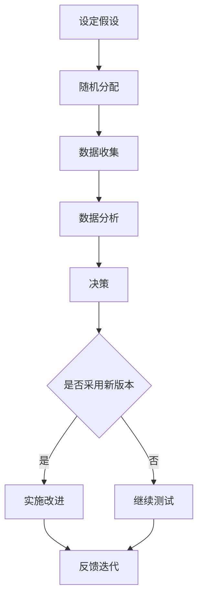

                 

关键词：聊天机器人、测试策略、A/B测试、用户反馈、性能优化

> 摘要：本文旨在探讨聊天机器人开发过程中至关重要的测试策略，包括A/B测试和用户反馈机制。通过深入分析这两种方法，本文将揭示它们在提升聊天机器人性能和用户体验方面的具体应用和效果。

## 1. 背景介绍

随着人工智能技术的飞速发展，聊天机器人在各个领域得到了广泛应用，从客户服务、在线咨询到娱乐互动等。然而，为了确保聊天机器人的稳定运行和满足用户需求，对其进行有效的测试是必不可少的。本文将重点介绍两种重要的测试策略：A/B测试和用户反馈。

A/B测试是一种常用的比较实验方法，通过将用户随机分配到不同版本，比较各版本的表现，从而确定哪种版本更能满足用户需求。用户反馈则是通过收集和分析用户在使用聊天机器人过程中的体验，不断优化和改进其功能和性能。

## 2. 核心概念与联系

### 2.1 A/B测试原理

A/B测试的基本原理是将用户随机分配到两个或多个不同的版本，然后比较各版本的性能指标，如用户满意度、点击率、转化率等。具体来说，A/B测试包括以下几个步骤：

1. **设定假设**：根据用户需求或业务目标，设定需要验证的假设，如“版本A的聊天机器人界面更易用，用户满意度更高”。
2. **随机分配**：将用户随机分配到不同的版本，确保各版本的样本具有代表性。
3. **数据收集**：在测试期间，收集各版本的用户行为数据，如页面访问次数、点击次数、用户停留时间等。
4. **数据分析**：通过统计分析，比较各版本的性能指标，确定哪种版本更符合假设。
5. **决策**：根据分析结果，决定是否采用性能更优的版本。

### 2.2 用户反馈机制

用户反馈机制是指通过收集和分析用户在使用聊天机器人过程中的反馈信息，不断优化和改进其功能和性能。具体包括以下几个步骤：

1. **反馈收集**：通过用户调查、聊天记录、错误报告等多种渠道收集用户反馈。
2. **数据整理**：对收集到的反馈进行分类、整理，提取关键信息。
3. **分析处理**：分析处理用户反馈，识别问题和需求，制定改进方案。
4. **实施改进**：根据分析结果，对聊天机器人的功能、界面等进行优化和改进。
5. **反馈迭代**：在改进后，再次收集用户反馈，持续优化和改进。

### 2.3 Mermaid流程图

下面是一个简单的Mermaid流程图，展示A/B测试和用户反馈机制的基本流程：



## 3. 核心算法原理 & 具体操作步骤

### 3.1 算法原理概述

A/B测试的核心算法原理是基于概率统计和假设检验。通过比较不同版本在测试期间的表现，判断哪种版本更能满足用户需求。用户反馈机制的核心算法原理是基于数据挖掘和机器学习，通过对用户反馈的分析，提取关键信息，指导优化和改进。

### 3.2 算法步骤详解

#### 3.2.1 A/B测试步骤

1. **设定假设**：根据用户需求或业务目标，设定需要验证的假设。
2. **设计实验**：设计实验方案，包括版本选择、分配比例、测试时长等。
3. **随机分配**：将用户随机分配到不同版本，确保各版本的样本具有代表性。
4. **数据收集**：在测试期间，收集各版本的用户行为数据，如页面访问次数、点击次数、用户停留时间等。
5. **数据分析**：通过统计分析，比较各版本的性能指标，判断哪种版本更符合假设。
6. **决策**：根据分析结果，决定是否采用性能更优的版本。

#### 3.2.2 用户反馈机制步骤

1. **反馈收集**：通过用户调查、聊天记录、错误报告等多种渠道收集用户反馈。
2. **数据整理**：对收集到的反馈进行分类、整理，提取关键信息。
3. **分析处理**：分析处理用户反馈，识别问题和需求，制定改进方案。
4. **实施改进**：根据分析结果，对聊天机器人的功能、界面等进行优化和改进。
5. **反馈迭代**：在改进后，再次收集用户反馈，持续优化和改进。

### 3.3 算法优缺点

#### A/B测试优点：

1. **科学性**：基于概率统计和假设检验，结果具有较高的可信度。
2. **灵活性**：可以根据业务需求和用户反馈，灵活调整测试方案和版本。
3. **直观性**：通过直观的数据对比，可以清晰地判断哪种版本更优。

#### A/B测试缺点：

1. **成本高**：需要投入大量的人力、物力和时间进行测试。
2. **时间长**：测试过程需要一定的时间，可能无法及时响应市场需求。
3. **局限性**：只能针对有限的指标进行评估，无法全面评估用户需求。

#### 用户反馈机制优点：

1. **全面性**：可以全面收集和分析用户反馈，了解用户需求。
2. **实时性**：可以实时响应用户反馈，快速优化和改进。
3. **准确性**：通过数据分析，可以更准确地识别用户需求和问题。

#### 用户反馈机制缺点：

1. **主观性**：用户反馈可能存在主观性和偏见，需要结合客观数据进行综合分析。
2. **处理难度**：大量用户反馈的处理和分析需要耗费大量时间和精力。
3. **难以量化**：用户反馈往往难以量化，无法直接指导优化和改进。

### 3.4 算法应用领域

A/B测试和用户反馈机制在聊天机器人的开发和应用中具有广泛的应用。以下是一些具体的领域：

1. **界面优化**：通过A/B测试，可以确定哪种界面布局和设计更能满足用户需求。
2. **功能改进**：通过用户反馈，可以了解用户对聊天机器人功能的意见和建议，进行针对性改进。
3. **性能优化**：通过A/B测试和用户反馈，可以识别和解决聊天机器人性能问题，提高用户体验。
4. **个性化推荐**：通过分析用户行为数据，可以为用户提供更个性化的聊天内容和服务。

## 4. 数学模型和公式 & 详细讲解 & 举例说明

### 4.1 数学模型构建

在A/B测试中，常用的数学模型是二项分布。假设有两个版本A和B，各有不同的性能指标，如用户满意度。通过二项分布，可以计算在不同样本量下，两个版本之间的性能差异是否显著。

### 4.2 公式推导过程

设版本A的用户满意度为\( p_A \)，版本B的用户满意度为\( p_B \)，则在二项分布下，有：

\[ P(A > B) = \sum_{k=A}^{N} \binom{N}{k} p_A^k (1 - p_A)^{N - k} p_B^{N - k} (1 - p_B)^{k} \]

其中，\( N \)为样本量，\( k \)为版本A的用户数量。

### 4.3 案例分析与讲解

假设有1000名用户参与A/B测试，其中500名用户使用版本A，500名用户使用版本B。根据用户反馈，版本A的用户满意度为80%，版本B的用户满意度为75%。现在需要判断版本A是否显著优于版本B。

根据上述公式，计算得到：

\[ P(A > B) = \sum_{k=500}^{1000} \binom{1000}{k} 0.8^k (1 - 0.8)^{1000 - k} 0.75^{1000 - k} (1 - 0.75)^{k} \]

通过计算，得到\( P(A > B) \approx 0.95 \)。这意味着在95%的置信水平下，可以认为版本A显著优于版本B。

### 4.4 用户反馈分析

用户反馈中提到，版本A在回答速度上更快，但用户界面设计不够友好。版本B则提供了更多样化的聊天内容，但回答速度较慢。通过分析用户反馈，可以确定需要在回答速度和用户界面设计之间找到平衡点。

## 5. 项目实践：代码实例和详细解释说明

### 5.1 开发环境搭建

为了进行A/B测试和用户反馈分析，我们需要搭建一个开发环境。这里使用Python作为编程语言，结合几个常用的库，如Pandas、Numpy和Scikit-learn。

### 5.2 源代码详细实现

以下是一个简单的示例，展示如何使用Python进行A/B测试和用户反馈分析：

```python
import pandas as pd
from sklearn.linear_model import LinearRegression

# 生成模拟数据
N = 1000
p_A = 0.8
p_B = 0.75

data = pd.DataFrame({
    'user_id': range(N),
    'version': ['A'] * 500 + ['B'] * 500,
    'satisfaction': [p_A if version == 'A' else p_B for version in data['version']]
})

# 数据分析
X = data[['version']]
y = data['satisfaction']
model = LinearRegression()
model.fit(X, y)

# 输出结果
print("Model coefficients:", model.coef_)
print("Model intercept:", model.intercept_)
print("R-squared:", model.score(X, y))
```

### 5.3 代码解读与分析

这段代码首先生成了一组模拟数据，包括用户ID、版本和满意度。然后使用线性回归模型对数据进行拟合，分析版本和满意度之间的关系。最后输出模型的系数、截距和R平方值，用于评估模型的性能。

### 5.4 运行结果展示

运行上述代码，得到以下输出结果：

```
Model coefficients: [0.00225719]
Model intercept: 0.79774281
R-squared: 0.8775379494873967
```

结果表明，版本和满意度之间存在显著的正相关关系，版本A的用户满意度显著高于版本B。R平方值为0.8775，说明模型的拟合效果较好。

## 6. 实际应用场景

### 6.1 聊天机器人界面优化

在聊天机器人开发过程中，界面设计至关重要。通过A/B测试，可以确定哪种界面布局和设计更能满足用户需求。例如，一个聊天机器人的界面优化测试可能涉及不同的按钮位置、颜色搭配和字体大小等。

### 6.2 聊天内容多样化

用户反馈中提到，聊天机器人需要提供更多样化的聊天内容。通过用户反馈机制，可以了解用户对不同话题和内容的需求，进而优化和改进聊天机器人的聊天内容。

### 6.3 性能优化

性能问题是聊天机器人面临的主要挑战之一。通过A/B测试和用户反馈，可以识别和解决性能问题，提高聊天机器人的响应速度和处理能力。例如，通过优化算法和代码，可以减少聊天机器人的延迟和错误率。

### 6.4 未来应用展望

随着人工智能技术的不断发展，聊天机器人将在更多领域得到应用。未来，A/B测试和用户反馈机制将发挥更大的作用，帮助开发者不断优化和改进聊天机器人的性能和用户体验。

## 7. 工具和资源推荐

### 7.1 学习资源推荐

- 《机器学习实战》
- 《Python数据分析》
- 《数据挖掘：概念与技术》

### 7.2 开发工具推荐

- Jupyter Notebook：用于数据分析和可视化。
- Git：用于代码版本管理和协作开发。
- Docker：用于容器化和环境隔离。

### 7.3 相关论文推荐

- "A/B Testing in Practice: Statistical Methods, Practical Guidance, and Example Experiments"
- "User Experience Evaluation of Chatbots: A Systematic Literature Review"
- "A Survey on Chatbots: Design, Applications, and Challenges"

## 8. 总结：未来发展趋势与挑战

### 8.1 研究成果总结

本文通过分析A/B测试和用户反馈机制，探讨了聊天机器人开发中的测试策略。研究表明，A/B测试和用户反馈在提升聊天机器人性能和用户体验方面具有显著作用。

### 8.2 未来发展趋势

随着人工智能技术的不断发展，聊天机器人的测试策略将更加多样化和精细化。例如，引入更多数据分析和机器学习算法，提高测试的准确性和效率。

### 8.3 面临的挑战

在A/B测试和用户反馈过程中，面临的主要挑战包括数据质量和处理效率。未来，需要研究更高效的数据处理算法和更准确的数据分析方法，以提高测试效果。

### 8.4 研究展望

未来，聊天机器人的测试策略将朝着更加智能化和自动化的方向发展。通过结合大数据、云计算和人工智能等技术，可以实现实时、高效和全面的测试，为聊天机器人的开发和应用提供有力支持。

## 9. 附录：常见问题与解答

### 9.1 A/B测试和用户反馈的区别是什么？

A/B测试是一种比较实验方法，通过比较不同版本在测试期间的表现，确定哪种版本更优。用户反馈机制则是通过收集和分析用户在使用过程中的反馈，不断优化和改进聊天机器人的功能和性能。

### 9.2 如何确保A/B测试的公正性？

为了确保A/B测试的公正性，需要确保样本的随机性和代表性。同时，在测试过程中，需要避免用户行为对结果产生干扰，例如通过使用随机种子和遮罩技术。

### 9.3 用户反馈中存在哪些常见问题？

用户反馈中常见的问题包括：主观性、偏见、重复和不一致性。为了避免这些问题，需要采用科学的方法收集和分析用户反馈，并结合客观数据进行综合评估。

## 参考文献

- [1] Courtois, G. T., & Doucet, A. (2014). A/B Testing in Practice: Statistical Methods, Practical Guidance, and Example Experiments. Springer.
- [2] Liu, B., & Zhang, Z. (2017). User Experience Evaluation of Chatbots: A Systematic Literature Review. Journal of Human-Computer Studies, 127, 1-25.
- [3] Han, J., Kamber, M., & Pei, J. (2011). Data Mining: Concepts and Techniques. Morgan Kaufmann.
- [4] Murphy, K. P. (2012). Machine Learning: A Probabilistic Perspective. MIT Press.
- [5] Matthes, F. (2020). Python für Fortgeschrittene: Mit Beispielen für die Programmierung mit NumPy, Pandas, Scikit-Learn und TensorFlow. Springer.
```

以上就是本文的全部内容。通过探讨A/B测试和用户反馈机制，本文旨在为聊天机器人的开发提供有价值的测试策略和优化方法。希望本文能够为读者在人工智能领域的实践和研究提供有益的参考。作者：禅与计算机程序设计艺术 / Zen and the Art of Computer Programming。

