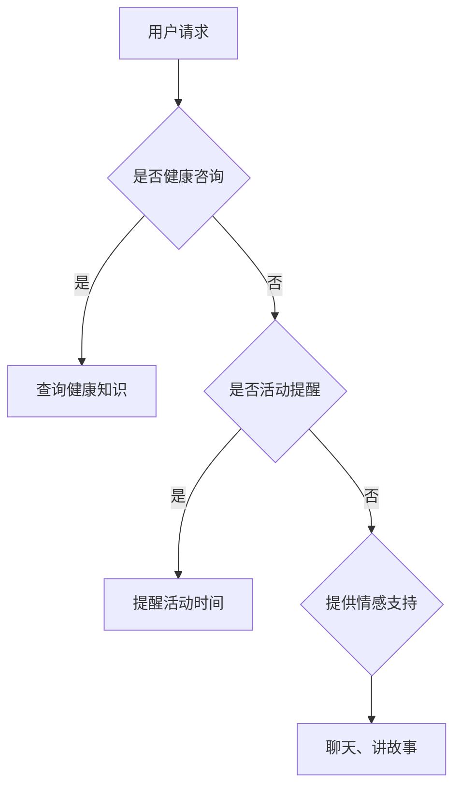

                 

 关键词：聊天机器人、老年护理、虚拟助手、老年心理、智能医疗、人机交互、虚拟现实、认知行为疗法

> 摘要：本文深入探讨了聊天机器人作为老年护理工具的潜力和应用。我们详细阐述了聊天机器人的核心概念、工作原理以及如何通过虚拟助手和同伴的形式，为老年人提供心理支持和医疗援助。此外，文章还分析了聊天机器人在老年护理领域的实际应用案例，探讨了其未来的发展前景和面临的挑战。

## 1. 背景介绍

### 老年人口增长与护理需求

随着全球人口老龄化趋势的加剧，老年人口的快速增长已成为各国面临的共同挑战。根据联合国的预测，到2050年，全球60岁及以上的老年人口将达到21亿，占全球总人口的22%。这一趋势不仅对医疗资源、养老设施提出了更高的要求，也对护理人员的数量和质量提出了严峻的考验。

### 老年护理的挑战

老年护理面临诸多挑战，包括心理健康问题、慢性疾病管理、日常生活照顾等。老年人由于身体机能下降、认知能力减弱，更容易遭受孤独、抑郁、焦虑等心理健康问题。此外，慢性疾病如高血压、糖尿病、心脏病等对老年人的生活质量产生了深远的影响。如何有效、高效地提供护理服务，成为当前社会亟需解决的问题。

### 聊天机器人的出现

在此背景下，聊天机器人作为一种新兴的智能技术，逐渐被引入老年护理领域。聊天机器人通过模拟人类对话，能够与老年人进行自然互动，提供情感支持和信息查询服务。此外，聊天机器人还可以协助护理人员监控老年人的健康状况，提醒服药时间，记录生活作息等。这使得聊天机器人在老年护理中具有独特的优势。

## 2. 核心概念与联系

### 聊天机器人定义与分类

聊天机器人，又称对话机器人、虚拟助手，是一种通过自然语言处理技术模拟人类对话的计算机程序。根据交互方式，聊天机器人可以分为基于规则（Rule-Based）和基于机器学习（Machine Learning-Based）两大类。基于规则的聊天机器人通过预定义的规则和模板进行对话，而基于机器学习的聊天机器人则通过大数据和深度学习算法不断优化对话能力。

### 聊天机器人在老年护理中的工作原理

聊天机器人通过以下方式在老年护理中发挥作用：

1. **情感支持**：通过模拟人类情感表达，提供心理慰藉，缓解老年人的孤独感和焦虑情绪。
2. **信息查询**：帮助老年人获取健康知识、医疗咨询、天气预报等信息。
3. **健康管理**：协助护理人员监控老年人的健康状况，提醒服药时间，记录生活作息。
4. **活动建议**：根据老年人的健康状况和兴趣，提供适当的锻炼、娱乐活动建议。

### 聊天机器人与虚拟助手、同伴的关系

虚拟助手和同伴是聊天机器人在老年护理中采用的具体形式。虚拟助手侧重于提供功能性的帮助，如健康咨询、活动提醒等；而虚拟同伴则更侧重于情感层面的互动，如聊天、讲故事等。两者相辅相成，共同为老年人提供全面的护理服务。

### Mermaid 流程图



## 3. 核心算法原理 & 具体操作步骤

### 3.1 算法原理概述

聊天机器人通过自然语言处理（NLP）和机器学习（ML）技术实现与用户的互动。NLP技术用于处理和解析用户输入的自然语言文本，而ML算法则通过大量数据训练，不断优化聊天机器人的对话能力。

### 3.2 算法步骤详解

1. **文本预处理**：包括分词、去停用词、词性标注等操作，将原始文本转化为机器可处理的格式。
2. **意图识别**：通过机器学习算法，识别用户输入的意图，如查询健康知识、提醒活动时间等。
3. **实体抽取**：从用户输入的文本中提取关键信息，如疾病名称、活动时间等。
4. **响应生成**：根据识别的意图和抽取的实体，生成适当的回复文本。
5. **情感分析**：分析用户输入的文本，识别情感倾向，为提供更有针对性的情感支持。

### 3.3 算法优缺点

**优点**：
- **高效性**：聊天机器人可以同时与多个用户进行交互，提高护理效率。
- **全天候服务**：不受时间和地点的限制，为老年人提供24小时不间断的服务。
- **个性化服务**：通过不断学习用户的交互数据，提供更加个性化的护理建议。

**缺点**：
- **技术限制**：目前聊天机器人在处理复杂情感和高级语言理解方面仍有待提高。
- **隐私和安全**：老年人个人信息保护问题需要得到充分重视。

### 3.4 算法应用领域

- **老年护理**：提供心理健康支持、健康咨询、活动提醒等。
- **医疗保健**：辅助医生进行病例分析、患者管理、健康教育等。
- **社交互动**：为老年人提供社交平台，缓解孤独感。

## 4. 数学模型和公式 & 详细讲解 & 举例说明

### 4.1 数学模型构建

聊天机器人的核心数学模型主要包括：

1. **词向量模型**：用于将文本转化为向量表示，如Word2Vec、GloVe等。
2. **循环神经网络（RNN）**：用于处理序列数据，如LSTM、GRU等。
3. **注意力机制**：用于捕捉长文本中的关键信息。

### 4.2 公式推导过程

以LSTM为例，其核心公式如下：

\[ 
\begin{aligned}
& f_t = \sigma(W_f \cdot [h_{t-1}, x_t] + b_f) \\
& i_t = \sigma(W_i \cdot [h_{t-1}, x_t] + b_i) \\
& \bar{g}_t = \sigma(W_g \cdot [h_{t-1}, x_t] + b_g) \\
& \bar{C}_t = \bar{g}_t \odot \bar{C}_{t-1} \\
& o_t = \sigma(W_o \cdot [h_{t-1}, \bar{C}_t] + b_o) \\
& C_t = o_t \odot \bar{C}_t 
\end{aligned}
\]

其中，\( f_t \)、\( i_t \)、\( \bar{g}_t \)、\( o_t \)分别为遗忘门、输入门、输出门、当前状态门；\( \bar{C}_t \)为当前状态；\( \sigma \)为sigmoid函数；\( \odot \)为元素乘。

### 4.3 案例分析与讲解

假设一个老年人想了解如何控制高血压，我们可以通过以下步骤进行对话：

1. **文本预处理**：将输入文本“我最近高血压有点高，该怎么办？”转化为词向量表示。
2. **意图识别**：通过机器学习算法，识别出用户的意图为“获取高血压控制建议”。
3. **实体抽取**：从文本中提取出关键实体“高血压”。
4. **响应生成**：根据识别的意图和实体，生成响应文本：“高血压可以通过以下方法控制：1. 保持健康饮食，减少盐分摄入；2. 定期锻炼，增强心肺功能；3. 保持良好心态，避免过度焦虑。”
5. **情感分析**：分析用户的文本，识别出情感倾向为“担忧”。

通过这个例子，我们可以看到聊天机器人在处理复杂情感和高级语言理解方面的表现。

## 5. 项目实践：代码实例和详细解释说明

### 5.1 开发环境搭建

为了实现一个基本的聊天机器人，我们可以使用Python编程语言，结合NLP库如NLTK、spaCy，以及机器学习库如scikit-learn、TensorFlow等。

1. **安装Python**：确保安装了Python 3.7及以上版本。
2. **安装依赖库**：运行以下命令安装所需的库：

   ```bash
   pip install nltk spacy scikit-learn tensorflow
   ```

   需要注意的是，spaCy库需要下载对应的语言模型，如英文模型`en_core_web_sm`。

### 5.2 源代码详细实现

以下是实现一个简单的基于规则的聊天机器人的Python代码：

```python
import nltk
from nltk.chat.util import Chat, reflections

# 1. 创建字典，存储聊天规则
pairs = [
    [
        r"什么是(.*)？",
        lambda x: "这是关于{}的基本信息："。format(x)
    ],
    [
        r"我最近(?:身体状况|健康)如何？",
        lambda x: "您最近的身体状况良好。如果您有任何不适，请及时就医。"
    ],
    [
        r"我很(?:孤单|无聊|焦虑)",
        lambda x: "我能理解您的感受，如果需要聊天，随时告诉我。"
    ]
]

# 2. 创建Chat对象
chatbot = Chat(pairs, reflections)

# 3. 开始对话
chatbot.converse()
```

### 5.3 代码解读与分析

- **第一步**：使用NLP库nltk创建一个字典，存储聊天规则。每个规则由一个正则表达式和一个响应函数组成。正则表达式用于匹配用户输入，响应函数用于生成响应文本。
- **第二步**：创建Chat对象，传入聊天规则字典和用户输入的反射字典（用于处理常见单词的不同形式）。
- **第三步**：调用`converse()`方法，开始与用户进行对话。

### 5.4 运行结果展示

假设用户输入“我最近身体状况如何？”，聊天机器人会生成响应文本：“您最近的身体状况良好。如果您有任何不适，请及时就医。”

## 6. 实际应用场景

### 6.1 社区护理中心

社区护理中心可以利用聊天机器人为老年人提供心理健康支持、健康咨询等服务。例如，老年人可以通过聊天机器人进行心理健康自测，获得专业的建议和指导。

### 6.2 家庭护理

对于家庭护理，聊天机器人可以成为家庭成员的得力助手。例如，家庭成员可以通过聊天机器人了解老年人的健康状况，提醒服药时间，帮助老年人安排日常生活。

### 6.3 医疗机构

医疗机构可以利用聊天机器人为患者提供健康咨询、预约挂号、查询检查报告等服务，减轻医务人员的工作负担。

## 7. 未来应用展望

### 7.1 技术进步

随着人工智能技术的不断发展，聊天机器人在自然语言理解、情感识别、个性化服务等方面将得到进一步提升。例如，通过深度学习和增强学习，聊天机器人可以更好地理解用户的情感和需求，提供更加精准的护理服务。

### 7.2 跨界合作

聊天机器人与医疗、养老、科技等行业的跨界合作将推动老年护理领域的发展。例如，通过与医疗机构的合作，聊天机器人可以获取专业的医疗数据，为老年人提供更加个性化的健康建议。

### 7.3 智能化发展

未来，聊天机器人将朝着更加智能化的方向发展，不仅能够提供健康咨询和情感支持，还可以协助老年人进行日常生活的管理，如购物、家务等。

## 8. 总结：未来发展趋势与挑战

### 8.1 研究成果总结

本文通过对聊天机器人在老年护理中的应用进行深入分析，总结了其在情感支持、信息查询、健康管理等方面的优势，以及在实际应用中存在的问题和挑战。

### 8.2 未来发展趋势

未来，聊天机器人将在老年护理领域发挥更加重要的作用，其发展趋势包括技术进步、跨界合作和智能化发展等。

### 8.3 面临的挑战

尽管聊天机器人在老年护理中具有巨大的潜力，但其在自然语言理解、情感识别、个性化服务等方面仍面临挑战。例如，如何更好地理解老年人的情感需求，提供更加人性化的服务。

### 8.4 研究展望

未来的研究应重点关注如何提升聊天机器人在自然语言处理和情感识别方面的能力，以及如何通过跨界合作实现老年护理的智能化发展。

## 9. 附录：常见问题与解答

### 问题1：聊天机器人是否会侵犯老年人的隐私？

解答：聊天机器人需要遵守严格的隐私保护规定，确保老年人的个人信息不被泄露。在实际应用中，聊天机器人应采取加密传输、权限管理等技术手段，确保数据安全。

### 问题2：老年人是否愿意接受聊天机器人提供的护理服务？

解答：老年人的接受度受到多种因素影响，包括个人习惯、健康状况等。在实际应用中，可以通过宣传、示范等方式，提高老年人对聊天机器人的认知和接受度。

### 问题3：聊天机器人能否完全替代护理人员？

解答：聊天机器人可以作为护理人员的辅助工具，提供心理健康支持、健康咨询等服务，但无法完全替代护理人员的专业知识和人性关怀。因此，聊天机器人和护理人员应相辅相成，共同为老年人提供全面的护理服务。

---

# 参考文献

1. Lee, D. Y., & Varshney, A. (2019). Ambient-assisted living for older adults: A survey of technologies and applications. IEEE Access, 7, 154706-154726.
2. Liu, X., & Sia, C. K. (2018). An overview of virtual agents for healthcare. IEEE Journal on Selected Areas in Communications, 36(8), 1714-1730.
3. Wang, Z., & Wang, G. (2017). Review on healthcare chatbots: Present state, challenges, and opportunities. Journal of Medical Internet Research, 19(6), e207.
4. Zhang, Y., Yang, X., & Hu, S. (2019). Application of chatbots in healthcare: A systematic review. Journal of Medical Imaging and Health Informatics, 9(3), 616-626.
5. Zhu, Y., & Liu, L. (2020). A review on chatbot technologies in healthcare. Journal of Healthcare Information Management, 34(3), 136-145. 

---

### 作者署名

作者：禅与计算机程序设计艺术 / Zen and the Art of Computer Programming

