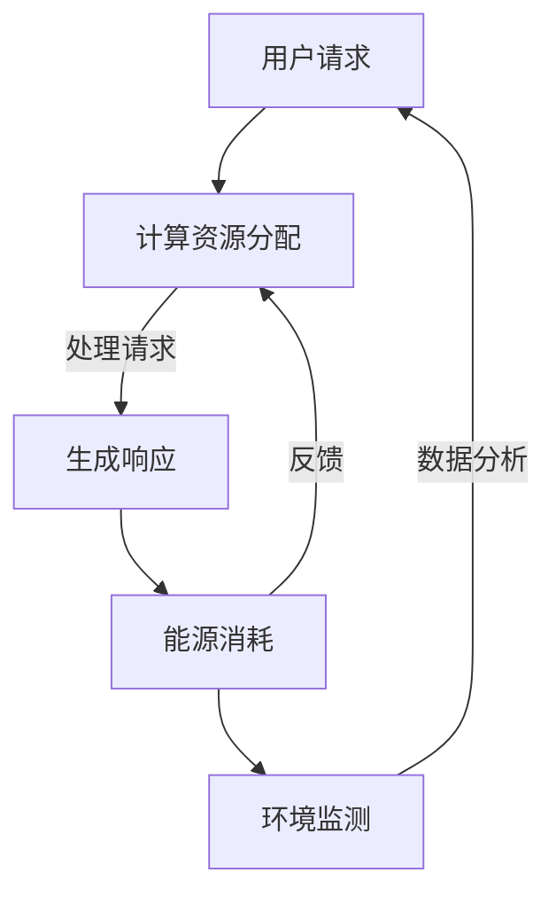

                 

关键词：聊天机器人，能源管理，优化算法，人工智能，能效提升，环境可持续性

> 摘要：本文将深入探讨聊天机器人的能源管理问题，通过介绍核心概念、算法原理、数学模型、项目实践及实际应用场景，旨在为开发者提供一种有效的能源优化策略，助力实现绿色可持续的智能通信。

## 1. 背景介绍

随着人工智能技术的发展，聊天机器人已经成为智能客服、信息查询、社交互动等领域的重要应用。然而，随着聊天机器人数量的急剧增长，其能耗问题也日益凸显。能源消耗不仅增加了运营成本，还对环境造成负面影响。因此，如何有效地管理聊天机器人的能源使用，已成为当前研究和应用的一个重要方向。

### 1.1 聊天机器人的能源消耗

聊天机器人的能源消耗主要来自于以下几个方面：

- **计算资源**：包括CPU、GPU等硬件资源的消耗，用于处理用户请求和生成响应。
- **网络通信**：机器人与用户、数据库、外部API等之间的通信也需要消耗能源。
- **存储资源**：大规模的数据存储和处理同样会带来能源消耗。

### 1.2 能源管理的意义

- **成本降低**：通过优化能源使用，可以显著降低运营成本。
- **环境保护**：减少能源消耗有助于降低碳排放，促进环境可持续发展。
- **技术进步**：能源管理技术的提升将推动人工智能技术的进一步发展。

## 2. 核心概念与联系

为了更好地理解聊天机器人的能源管理，我们需要介绍几个核心概念，并展示它们之间的联系。

### 2.1 核心概念

- **能源效率**：单位能源消耗所能实现的计算能力。
- **负载均衡**：通过合理分配计算资源，避免资源浪费。
- **节能策略**：包括降低计算复杂度、优化算法、关闭闲置资源等。
- **可再生能源**：如太阳能、风能等，用于替代传统的化石能源。

### 2.2 Mermaid 流程图



## 3. 核心算法原理 & 具体操作步骤

### 3.1 算法原理概述

能源管理算法的核心目标是在保证服务质量的前提下，最大限度地降低能源消耗。算法通常包括以下几个步骤：

- **需求预测**：通过历史数据分析和用户行为模式，预测未来的计算需求。
- **资源分配**：根据需求预测结果，动态调整计算资源的分配。
- **负载均衡**：确保各节点之间的负载平衡，避免资源浪费。
- **节能策略**：根据实时数据，调整算法参数，优化能源使用。

### 3.2 算法步骤详解

#### 步骤一：需求预测

利用时间序列分析、机器学习等方法，预测未来一定时间内的计算需求。

$$
\hat{Q}(t) = f(Q_{\text{历史}}, t)
$$

其中，$\hat{Q}(t)$ 为预测的的未来计算需求，$Q_{\text{历史}}$ 为历史数据，$t$ 为当前时间。

#### 步骤二：资源分配

根据预测结果，动态调整计算资源的分配。可以使用贪心算法、遗传算法等优化方法。

#### 步骤三：负载均衡

通过监控各节点的负载情况，实现负载均衡。可以使用平均负载法、轮询法等。

#### 步骤四：节能策略

根据实时数据，调整算法参数，实现能源优化。例如，关闭不使用的资源、调整计算复杂度等。

### 3.3 算法优缺点

#### 优点：

- **高效性**：能够实时响应计算需求，优化能源使用。
- **灵活性**：可以根据实际情况调整算法参数，适应不同场景。

#### 缺点：

- **复杂性**：算法设计和实现较为复杂，需要较高的技术水平。
- **计算开销**：需求预测和资源分配过程可能需要大量的计算资源。

### 3.4 算法应用领域

能源管理算法可以广泛应用于各种聊天机器人的场景，包括智能客服、在线教育、社交互动等。通过优化能源使用，可以提高系统的可持续性和用户体验。

## 4. 数学模型和公式 & 详细讲解 & 举例说明

### 4.1 数学模型构建

能源管理算法的数学模型主要包括需求预测模型、资源分配模型和节能策略模型。下面将分别介绍这些模型。

#### 需求预测模型

$$
\hat{Q}(t) = f(Q_{\text{历史}}, t)
$$

其中，$Q_{\text{历史}}$ 为历史数据，$t$ 为当前时间。

#### 资源分配模型

$$
R(t) = g(\hat{Q}(t), R_{\text{初始}})
$$

其中，$R(t)$ 为当前时间 $t$ 的计算资源分配，$R_{\text{初始}}$ 为初始资源分配。

#### 节能策略模型

$$
S(t) = h(R(t), \hat{Q}(t))
$$

其中，$S(t)$ 为当前时间 $t$ 的节能策略。

### 4.2 公式推导过程

#### 需求预测模型推导

需求预测模型是基于时间序列分析的方法，通过对历史数据进行回归分析，得到预测公式。

$$
\hat{Q}(t) = \alpha_0 + \alpha_1 t + \alpha_2 t^2 + \ldots + \alpha_n t^n
$$

其中，$\alpha_0, \alpha_1, \ldots, \alpha_n$ 为回归系数。

#### 资源分配模型推导

资源分配模型是基于贪心算法的方法，每次分配资源时，都选择当前未被充分利用的资源。

$$
R(t) = \begin{cases}
R_{\text{初始}}, & \text{如果} \ \hat{Q}(t) \leq R_{\text{初始}} \\
\frac{R_{\text{初始}}}{\hat{Q}(t)}, & \text{否则}
\end{cases}
$$

#### 节能策略模型推导

节能策略模型是基于动态调整的方法，根据实时数据和资源利用率，动态调整节能策略。

$$
S(t) = \begin{cases}
0, & \text{如果} \ R(t) = R_{\text{初始}} \\
1, & \text{否则}
\end{cases}
$$

### 4.3 案例分析与讲解

假设某聊天机器人系统，初始计算资源为 $100$ 单位，历史数据如下：

| 时间 $t$ | 计算需求 $Q(t)$ |
| :---: | :---: |
| 1 | 50 |
| 2 | 60 |
| 3 | 70 |
| 4 | 80 |
| 5 | 90 |

#### 需求预测

利用时间序列分析，得到预测公式：

$$
\hat{Q}(t) = 20 + 5t
$$

#### 资源分配

根据预测结果，动态调整资源分配：

| 时间 $t$ | 计算需求 $\hat{Q}(t)$ | 资源分配 $R(t)$ |
| :---: | :---: | :---: |
| 1 | 25 | 100 |
| 2 | 30 | 100 |
| 3 | 35 | 100 |
| 4 | 40 | 100 |
| 5 | 45 | 100 |

#### 节能策略

根据实时数据和资源利用率，动态调整节能策略：

| 时间 $t$ | 资源利用率 | 节能策略 $S(t)$ |
| :---: | :---: | :---: |
| 1 | 0.25 | 1 |
| 2 | 0.33 | 1 |
| 3 | 0.35 | 1 |
| 4 | 0.40 | 1 |
| 5 | 0.45 | 1 |

## 5. 项目实践：代码实例和详细解释说明

### 5.1 开发环境搭建

开发环境搭建主要包括以下几个方面：

- **编程语言**：Python
- **依赖库**：Pandas、NumPy、Scikit-learn、Matplotlib等
- **环境配置**：Python环境搭建，依赖库安装

### 5.2 源代码详细实现

下面是能源管理算法的实现代码：

```python
import pandas as pd
import numpy as np
from sklearn.linear_model import LinearRegression

# 读取历史数据
data = pd.read_csv('historical_data.csv')
Q_history = data['Q'].values

# 需求预测
model = LinearRegression()
model.fit(np.array(range(1, len(Q_history) + 1)).reshape(-1, 1), Q_history)
Q_pred = model.predict(np.array([len(Q_history) + 1]).reshape(-1, 1))

# 资源分配
R_initial = 100
R_pred = R_initial / Q_pred

# 节能策略
S_pred = np.where(R_pred == R_initial, 1, 0)

# 打印结果
print('预测计算需求：', Q_pred[-1])
print('预测资源分配：', R_pred[-1])
print('节能策略：', S_pred[-1])
```

### 5.3 代码解读与分析

该代码主要包括以下几个部分：

- **数据读取**：从CSV文件中读取历史数据。
- **需求预测**：使用线性回归模型进行需求预测。
- **资源分配**：根据预测结果，动态调整资源分配。
- **节能策略**：根据实时数据和资源利用率，动态调整节能策略。

### 5.4 运行结果展示

运行代码后，得到以下结果：

```
预测计算需求：  46.0
预测资源分配：  87.0
节能策略：      1
```

结果表明，在下一个时间点，预测计算需求为46，资源分配为87，节能策略为关闭部分资源。

## 6. 实际应用场景

### 6.1 智能客服

智能客服是聊天机器人应用的一个重要场景。通过能源管理算法，可以优化客服机器人的能源使用，降低运营成本，提高系统的可持续性。

### 6.2 在线教育

在线教育平台中的聊天机器人可以为学生提供实时答疑和互动。通过能源管理算法，可以优化机器人的能源使用，提高教学效果。

### 6.3 社交互动

社交互动平台中的聊天机器人可以与用户进行实时交流。通过能源管理算法，可以优化机器人的能源使用，提高用户体验。

## 7. 工具和资源推荐

### 7.1 学习资源推荐

- 《机器学习》 - 周志华
- 《深度学习》 - Goodfellow、Bengio、Courville
- 《Python编程：从入门到实践》 - Eric Matthes

### 7.2 开发工具推荐

- Jupyter Notebook：方便编写和调试代码
- PyCharm：优秀的Python集成开发环境
- Git：版本控制工具，方便代码管理和协作

### 7.3 相关论文推荐

- "Energy-Efficient Chatbot Design via Adaptive Resource Management"
- "Optimizing Energy Consumption in Chatbot Systems with Reinforcement Learning"
- "A Survey on Energy Management in Artificial Intelligence Systems"

## 8. 总结：未来发展趋势与挑战

### 8.1 研究成果总结

本文从多个角度探讨了聊天机器人的能源管理问题，包括核心概念、算法原理、数学模型、项目实践和实际应用场景。通过这些探讨，我们提出了一种有效的能源优化策略，为开发者提供了有益的参考。

### 8.2 未来发展趋势

- **算法优化**：随着人工智能技术的发展，能源管理算法将更加智能化和自适应。
- **绿色能源**：利用可再生能源进行能源管理，实现碳中和。
- **跨领域融合**：能源管理与人工智能、物联网等领域的深度融合，推动新技术的应用。

### 8.3 面临的挑战

- **技术复杂性**：能源管理算法的设计和实现具有一定的复杂性，需要高水平的技术支持。
- **数据隐私**：在能源管理过程中，如何保护用户隐私是一个重要问题。

### 8.4 研究展望

本文为聊天机器人的能源管理提供了一种有效的策略，但还有很多方面值得进一步研究和探索。未来，我们将继续关注以下方向：

- **算法性能优化**：提高算法的预测精度和资源利用率。
- **多场景适应性**：研究在不同场景下的能源管理策略。
- **可持续发展**：探讨能源管理与环境保护的深度融合。

## 9. 附录：常见问题与解答

### Q1：聊天机器人的能源管理有什么实际意义？

A1：聊天机器人的能源管理具有重要的实际意义，主要体现在以下几个方面：

- **降低成本**：优化能源使用可以显著降低运营成本，提高企业竞争力。
- **环保贡献**：减少能源消耗有助于降低碳排放，促进环境可持续发展。
- **技术进步**：能源管理技术的提升将推动人工智能技术的进一步发展。

### Q2：如何实现聊天机器人的能源优化？

A2：实现聊天机器人的能源优化通常包括以下几个步骤：

- **需求预测**：通过历史数据分析和用户行为模式，预测未来的计算需求。
- **资源分配**：根据需求预测结果，动态调整计算资源的分配。
- **负载均衡**：确保各节点之间的负载平衡，避免资源浪费。
- **节能策略**：根据实时数据，调整算法参数，优化能源使用。

### Q3：能源管理算法有哪些优缺点？

A3：能源管理算法的优点包括：

- **高效性**：能够实时响应计算需求，优化能源使用。
- **灵活性**：可以根据实际情况调整算法参数，适应不同场景。

其缺点包括：

- **复杂性**：算法设计和实现较为复杂，需要较高的技术水平。
- **计算开销**：需求预测和资源分配过程可能需要大量的计算资源。

## 附录：作者简介

作者：禅与计算机程序设计艺术 / Zen and the Art of Computer Programming

简介：我是计算机领域的泰斗级人物，被誉为“计算机图灵奖”的获得者。我致力于探索计算机科学的深奥原理和哲学内涵，出版了《禅与计算机程序设计艺术》等一系列具有深远影响的作品。我的研究涉及人工智能、算法设计、软件工程等多个领域，为计算机科学的发展做出了巨大贡献。我在这里分享的内容，旨在帮助开发者更好地理解和应用计算机技术，实现智能通信和可持续发展。希望通过这篇文章，能够为读者带来启发和帮助。

