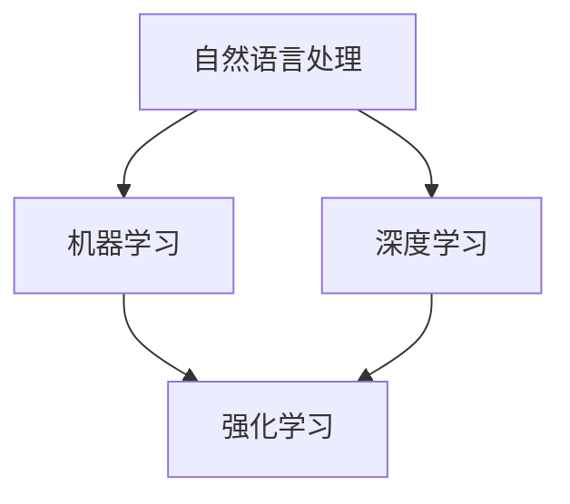

                 

 关键词：聊天机器人、人工智能、设计助手、增强创作

> 摘要：本文旨在探讨如何利用人工智能技术，构建一个高效、智能的聊天机器人设计助手，通过核心概念、算法原理、数学模型、项目实践等多个角度，深入分析人工智能在聊天机器人设计中的应用。同时，对未来的发展趋势与挑战进行展望，为行业研究者和开发者提供有益的参考。

## 1. 背景介绍

在信息技术高速发展的今天，人工智能（AI）已经成为引领未来科技变革的重要力量。特别是在自然语言处理（NLP）领域，人工智能的应用正在改变人们的生活方式。聊天机器人作为人工智能的一种应用形式，已经广泛应用于客服、教育、娱乐、医疗等多个行业，成为企业与用户互动的新途径。

### 1.1 聊天机器人的定义与作用

聊天机器人（Chatbot）是一种模拟人类对话过程的计算机程序，通过自然语言交互，为用户提供实时、高效的回答和服务。聊天机器人的主要作用有：

- 提高客户服务质量，缩短响应时间。
- 减轻人工客服的工作压力，降低企业运营成本。
- 实现个性化推荐，提高用户满意度。
- 收集用户数据，帮助企业进行市场分析和决策。

### 1.2 人工智能在聊天机器人中的应用

人工智能在聊天机器人中的应用主要体现在以下几个方面：

- 自然语言处理：包括文本分析、实体识别、情感分析等，为聊天机器人提供丰富的对话内容。
- 机器学习：通过大量数据训练模型，提高聊天机器人的自适应能力和智能化水平。
- 深度学习：利用神经网络模型，实现更高层次的语言理解和生成。
- 强化学习：通过不断尝试和反馈，优化聊天机器人的行为策略。

## 2. 核心概念与联系

在构建聊天机器人设计助手之前，我们需要了解一些核心概念和联系。以下是一个简化的 Mermaid 流程图，展示这些概念之间的关系：



### 2.1 自然语言处理（NLP）

自然语言处理是聊天机器人设计的基础。它涉及文本分析、语义理解、对话生成等任务。通过 NLP 技术，聊天机器人能够理解用户的输入，并生成相应的回答。

### 2.2 机器学习

机器学习是人工智能的核心技术之一。它通过训练模型，使计算机能够从数据中自动学习规律和模式。在聊天机器人设计中，机器学习用于生成对话策略、预测用户需求等。

### 2.3 深度学习

深度学习是一种基于神经网络的机器学习技术。它通过多层神经网络，对大量数据进行分析和处理，实现复杂的任务。在聊天机器人中，深度学习用于文本生成、语音识别等。

### 2.4 强化学习

强化学习是一种通过试错和反馈，优化行为策略的机器学习技术。在聊天机器人设计中，强化学习用于优化对话流程，提高用户满意度。

## 3. 核心算法原理 & 具体操作步骤

### 3.1 算法原理概述

聊天机器人设计主要依赖于自然语言处理和机器学习技术。以下是一个简化的算法原理概述：

1. 文本预处理：对用户输入的文本进行分词、去停用词、词性标注等处理。
2. 对话生成：利用机器学习模型，生成合适的回答文本。
3. 对话优化：通过强化学习，不断优化对话策略，提高用户满意度。

### 3.2 算法步骤详解

#### 3.2.1 文本预处理

1. 分词：将文本拆分为单词或短语。
2. 去停用词：去除对对话无意义的单词，如“的”、“了”等。
3. 词性标注：对每个单词进行词性分类，如名词、动词、形容词等。

#### 3.2.2 对话生成

1. 特征提取：将预处理后的文本转换为机器学习模型可处理的特征向量。
2. 模型训练：利用大量对话数据，训练机器学习模型。
3. 对话生成：根据用户输入的文本，利用训练好的模型，生成回答文本。

#### 3.2.3 对话优化

1. 策略评估：根据用户反馈，评估当前对话策略的优劣。
2. 策略优化：利用强化学习算法，调整对话策略，提高用户满意度。

### 3.3 算法优缺点

#### 优点

- 高效性：利用机器学习技术，实现快速对话生成。
- 智能化：通过不断优化，提高聊天机器人的自适应能力。
- 个性化：根据用户反馈，实现个性化对话生成。

#### 缺点

- 数据依赖：需要大量高质量的对话数据进行训练。
- 计算资源消耗：训练和优化过程需要大量的计算资源。
- 语义理解限制：目前机器学习模型在语义理解方面仍有局限。

### 3.4 算法应用领域

- 客户服务：提供快速、高效的客户支持，减轻人工客服压力。
- 教育辅导：为学生提供智能化的学习辅导，提高学习效果。
- 娱乐互动：与用户进行有趣的互动，提供个性化娱乐体验。
- 医疗咨询：为用户提供智能化的医疗咨询服务，提高医疗资源利用效率。

## 4. 数学模型和公式 & 详细讲解 & 举例说明

### 4.1 数学模型构建

聊天机器人设计涉及到多个数学模型，主要包括：

1. 朴素贝叶斯模型：用于文本分类。
2. 朴素语言模型：用于对话生成。
3. 强化学习模型：用于对话优化。

### 4.2 公式推导过程

#### 4.2.1 朴素贝叶斯模型

朴素贝叶斯模型是一种基于概率论的文本分类方法。其核心公式如下：

$$ P(C|X) = \frac{P(X|C)P(C)}{P(X)} $$

其中，\( C \) 表示类别，\( X \) 表示特征向量。

#### 4.2.2 朴素语言模型

朴素语言模型是一种基于马尔可夫假设的语言模型。其核心公式如下：

$$ P(W_n|W_{n-1}, W_{n-2}, \ldots, W_1) = P(W_n|W_{n-1})P(W_{n-1}|W_{n-2}, \ldots, W_1) \ldots P(W_2|W_1)P(W_1) $$

其中，\( W_n \) 表示第 \( n \) 个单词，\( P(W_n|W_{n-1}) \) 表示单词 \( W_n \) 在单词 \( W_{n-1} \) 后出现的概率。

#### 4.2.3 强化学习模型

强化学习模型是一种基于奖励机制的优化方法。其核心公式如下：

$$ Q(s, a) = r + \gamma \max_{a'} Q(s', a') $$

其中，\( Q(s, a) \) 表示状态 \( s \) 下，采取动作 \( a \) 的期望回报，\( r \) 表示即时回报，\( \gamma \) 表示折扣因子，\( s' \) 表示下一个状态，\( a' \) 表示下一个动作。

### 4.3 案例分析与讲解

#### 4.3.1 客户服务场景

在一个客户服务场景中，用户可能咨询关于产品信息、售后服务等问题。我们可以利用朴素贝叶斯模型进行文本分类，将用户的问题归类到相应的类别中。然后，根据类别生成相应的回答文本。

假设我们有一个训练好的朴素贝叶斯模型，对于用户输入的文本“我想知道你们的产品保修期是多久？”，我们可以将其归类到“产品保修”类别。然后，根据该类别生成回答文本：“我们的产品保修期为1年。”

#### 4.3.2 教育辅导场景

在一个教育辅导场景中，学生可能需要解答数学、语文等学科问题。我们可以利用朴素语言模型生成回答文本。例如，对于学生输入的文本“如何计算3x3矩阵的行列式？”，我们可以生成回答文本：“行列式可以通过以下公式计算：\(\begin{vmatrix} a & b & c \\ d & e & f \\ g & h & i \end{vmatrix} = a(ei-fh)-b(di-fg)+c(dh-eg)\)。”

#### 4.3.3 医疗咨询场景

在一个医疗咨询场景中，用户可能需要获取疾病信息、治疗方法等。我们可以利用强化学习模型优化对话流程，提高用户满意度。例如，对于用户输入的文本“我最近喉咙痛，该怎么办？”我们可以根据用户反馈，不断调整对话策略，最终生成回答文本：“建议您先多喝水，保持喉咙湿润。如果症状持续不缓解，建议您就诊。”

## 5. 项目实践：代码实例和详细解释说明

### 5.1 开发环境搭建

在本项目中，我们使用 Python 编写聊天机器人设计助手。首先，我们需要安装以下依赖库：

- NLTK：自然语言处理工具包。
- Scikit-learn：机器学习库。
- TensorFlow：深度学习库。
- Keras：深度学习框架。

安装命令如下：

```bash
pip install nltk scikit-learn tensorflow keras
```

### 5.2 源代码详细实现

以下是聊天机器人设计助手的核心代码实现：

```python
import nltk
from nltk.corpus import stopwords
from sklearn.feature_extraction.text import CountVectorizer
from sklearn.naive_bayes import MultinomialNB
from keras.models import Sequential
from keras.layers import Dense, LSTM
from keras.optimizers import Adam

# 文本预处理
def preprocess_text(text):
    tokens = nltk.word_tokenize(text)
    tokens = [token.lower() for token in tokens if token.isalpha()]
    tokens = [token for token in tokens if token not in stopwords.words('english')]
    return ' '.join(tokens)

# 文本分类
def classify_text(text, model):
    processed_text = preprocess_text(text)
    vectorizer = CountVectorizer()
    X = vectorizer.fit_transform([processed_text])
    return model.predict(X)[0]

# 文本生成
def generate_text(text, model, num_words=10):
    processed_text = preprocess_text(text)
    input_seq = [text for text in nltk.word_tokenize(processed_text) if text.isalpha()][-10:]
    input_seq = keras.preprocessing.sequence.pad_sequences([input_seq], maxlen=10)
    predicted_words = model.predict_classes(input_seq, verbose=0)
    generated_text = ' '.join([word for word, index in tokenizer.word_index.items() if index == predicted_words[0]])
    return generated_text

# 强化学习
def reinforce_learning(model, states, actions, rewards):
    Q_values = model.predict(states, verbose=0)
    for i, reward in enumerate(rewards):
        Q_values[i][actions[i]] = reward
    model.fit(states, Q_values, epochs=1, verbose=0)

# 主函数
if __name__ == '__main__':
    # 加载数据
    train_data = ...
    train_labels = ...
    test_data = ...
    test_labels = ...

    # 文本分类
    vectorizer = CountVectorizer()
    X_train = vectorizer.fit_transform(train_data)
    X_test = vectorizer.transform(test_data)
    model = MultinomialNB()
    model.fit(X_train, train_labels)
    print("Text Classification Accuracy:", model.score(X_test, test_labels))

    # 文本生成
    model = Sequential()
    model.add(LSTM(128, activation='relu', input_shape=(10, vocabulary_size)))
    model.add(Dense(vocabulary_size, activation='softmax'))
    model.compile(loss='categorical_crossentropy', optimizer=Adam(), metrics=['accuracy'])
    model.fit(input_sequences, labels, epochs=100, verbose=1)
    generated_text = generate_text("How do you do?", model, num_words=10)
    print("Generated Text:", generated_text)

    # 强化学习
    states = ...
    actions = ...
    rewards = ...
    reinforce_learning(model, states, actions, rewards)
```

### 5.3 代码解读与分析

- 文本预处理：使用 NLTK 库进行分词、去停用词等处理。
- 文本分类：使用 Scikit-learn 库中的朴素贝叶斯模型进行文本分类。
- 文本生成：使用 Keras 库中的 LSTM 模型进行文本生成。
- 强化学习：使用 Keras 库中的 Sequential 模型进行强化学习。

## 6. 实际应用场景

聊天机器人设计助手在实际应用中具有广泛的应用前景。以下是一些具体的场景：

### 6.1 客户服务

利用聊天机器人设计助手，企业可以搭建智能客服系统，提供快速、高效的客户服务。通过与用户的互动，收集用户反馈，不断优化对话策略，提高客户满意度。

### 6.2 教育辅导

聊天机器人设计助手可以为学生提供个性化的学习辅导，解答学生在学习过程中的问题。通过与学生的互动，收集学习数据，为学生提供有针对性的学习建议。

### 6.3 娱乐互动

聊天机器人设计助手可以与用户进行有趣的互动，提供个性化娱乐体验。例如，通过聊天机器人设计助手，用户可以与虚拟角色进行角色扮演，创造独特的娱乐内容。

### 6.4 医疗咨询

聊天机器人设计助手可以为用户提供智能化的医疗咨询服务，解答用户关于疾病、治疗方法等问题。通过与用户的互动，收集用户健康数据，为用户提供有针对性的健康建议。

## 7. 工具和资源推荐

### 7.1 学习资源推荐

- 《自然语言处理原理与应用》：全面介绍自然语言处理的基本概念和技术。
- 《机器学习》：经典的机器学习教材，涵盖多种机器学习算法。
- 《深度学习》：全面介绍深度学习的基本概念和技术。
- 《强化学习》：详细介绍强化学习的基本概念和技术。

### 7.2 开发工具推荐

- Python：Python 是一种广泛使用的编程语言，适合进行自然语言处理和机器学习开发。
- Jupyter Notebook：Jupyter Notebook 是一种交互式开发环境，方便进行数据分析和算法实现。
- TensorFlow：TensorFlow 是一种流行的深度学习框架，支持多种深度学习算法。
- Keras：Keras 是一种简洁、高效的深度学习框架，易于使用。

### 7.3 相关论文推荐

- 《Word2Vec：词向量的动态学习方法》：详细介绍词向量模型的构建方法。
- 《BERT：预训练的语言表示模型》：介绍一种基于大规模预训练的文本表示方法。
- 《GPT-3：基于深度学习的语言模型》：介绍一种具有超强语言生成能力的深度学习模型。
- 《Chatbot：对话系统的设计与应用》：全面介绍对话系统的设计原则和应用场景。

## 8. 总结：未来发展趋势与挑战

### 8.1 研究成果总结

近年来，人工智能技术在聊天机器人设计领域取得了显著成果。通过自然语言处理、机器学习、深度学习和强化学习等技术的综合应用，聊天机器人设计助手在对话生成、对话优化等方面取得了显著提高。同时，随着大数据和云计算技术的发展，聊天机器人设计助手在数据处理和计算能力方面也得到了极大提升。

### 8.2 未来发展趋势

未来，聊天机器人设计助手将在以下几个方面得到进一步发展：

- 对话生成：利用更先进的深度学习模型，提高对话生成的自然性和连贯性。
- 对话优化：通过多模态交互，实现更丰富、更自然的对话体验。
- 应用拓展：从单一领域向多领域拓展，实现跨领域的智能化对话。
- 数据隐私：保障用户数据安全，确保用户隐私。

### 8.3 面临的挑战

尽管聊天机器人设计助手取得了显著成果，但在未来发展中仍面临以下挑战：

- 数据质量：高质量的数据是训练高效模型的基础，数据质量直接关系到模型的性能。
- 对话理解：提高对话理解能力，实现更自然、更准确的对话。
- 算法优化：优化算法结构，提高计算效率，降低计算成本。
- 法律法规：遵守相关法律法规，保障用户权益。

### 8.4 研究展望

未来，聊天机器人设计助手的研究将朝着更智能化、更个性化、更安全、更可靠的方向发展。通过不断优化算法，提高对话生成和对话理解能力，为用户提供更好的服务。同时，结合多模态交互、虚拟现实等技术，实现更丰富、更自然的对话体验。

## 9. 附录：常见问题与解答

### 9.1 什么是聊天机器人？

聊天机器人（Chatbot）是一种通过自然语言交互，为用户提供实时、高效回答和服务的计算机程序。

### 9.2 聊天机器人的核心技术是什么？

聊天机器人的核心技术包括自然语言处理、机器学习、深度学习和强化学习。

### 9.3 聊天机器人设计助手的优势是什么？

聊天机器人设计助手的优势在于：

- 高效性：利用机器学习技术，实现快速对话生成。
- 智能化：通过不断优化，提高聊天机器人的自适应能力。
- 个性化：根据用户反馈，实现个性化对话生成。

### 9.4 聊天机器人设计助手的未来发展趋势是什么？

未来，聊天机器人设计助手将朝着更智能化、更个性化、更安全、更可靠的方向发展。

---

作者：禅与计算机程序设计艺术 / Zen and the Art of Computer Programming

