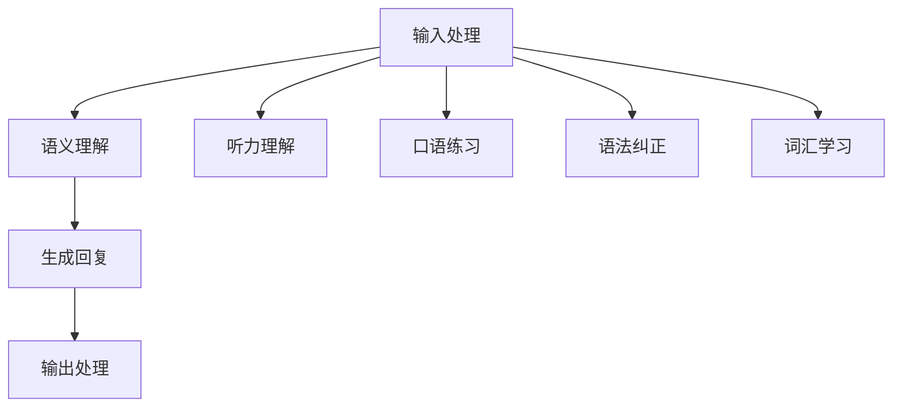

                 

关键词：聊天机器人，自然语言处理，语言学习，虚拟教师，人工智能教育

> 摘要：本文探讨了基于人工智能的聊天机器人如何成为有效的语言学习虚拟教师。文章首先介绍了聊天机器人的背景和基本原理，然后深入分析了它们在语言学习中的应用，最后提出了未来的发展方向和挑战。

## 1. 背景介绍

随着人工智能技术的不断发展，聊天机器人已经成为了一个热门的研究和应用领域。聊天机器人，也称为虚拟助手或聊天bot，是一种模拟人类对话行为的计算机程序。它们通过自然语言处理（NLP）技术理解用户的输入，并生成相应的回复。聊天机器人的应用范围非常广泛，从客服支持到智能咨询，从在线购物到社交互动，几乎涵盖了所有的日常活动。

近年来，随着人工智能在教育和学习领域的应用日益广泛，聊天机器人也开始扮演起虚拟教师的角色。它们能够提供个性化的学习体验，实时反馈学生的学习进度，并根据学生的学习情况调整教学内容。这使得语言学习变得更加高效和有趣。

## 2. 核心概念与联系

### 2.1 聊天机器人的基本原理

聊天机器人的核心是自然语言处理（NLP）技术。NLP是人工智能的一个重要分支，它涉及到语言的理解、生成和翻译。聊天机器人通常通过以下几个步骤与用户进行交互：

1. **输入处理**：聊天机器人首先需要接收用户的输入。这个输入可以是文本、语音或其他形式。
2. **语义理解**：接下来，机器人需要理解输入的含义。这通常涉及到词义消歧、语法分析、实体识别等步骤。
3. **生成回复**：在理解了用户的输入后，机器人会生成一个合适的回复。这个回复可以是预定义的模板，也可以是通过机器学习模型生成的。
4. **输出处理**：最后，机器人会将生成的回复发送给用户。

### 2.2 聊天机器人在语言学习中的应用

聊天机器人在语言学习中的应用主要体现在以下几个方面：

1. **听力理解**：聊天机器人可以模拟真实的对话环境，提供听力材料，并即时反馈用户的理解程度。
2. **口语练习**：机器人可以与用户进行对话，提供即时的口语反馈，帮助用户提高口语表达能力。
3. **语法纠正**：聊天机器人可以识别用户句子中的语法错误，并提供正确的表达方式。
4. **词汇学习**：机器人可以通过与用户的对话，帮助用户学习新的词汇，并理解词汇的用法和含义。

### 2.3 Mermaid 流程图



## 3. 核心算法原理 & 具体操作步骤

### 3.1 算法原理概述

聊天机器人的核心算法主要包括自然语言处理（NLP）和机器学习（ML）技术。NLP负责理解用户的输入和生成回复，而ML技术则用于训练和优化这些算法。

### 3.2 算法步骤详解

1. **数据收集**：首先，需要收集大量的对话数据，这些数据可以来自互联网、书籍、电影等。
2. **数据预处理**：对收集到的数据进行清洗和预处理，包括去除噪声、分词、词性标注等。
3. **模型训练**：使用预处理后的数据训练NLP模型，如词向量模型、序列到序列模型等。
4. **模型评估**：对训练好的模型进行评估，确保其具有良好的性能。
5. **模型应用**：将训练好的模型应用于实际的聊天机器人系统中。

### 3.3 算法优缺点

**优点**：
- **高效性**：聊天机器人可以同时与多个用户进行交互，提供即时的反馈。
- **个性化**：聊天机器人可以根据学生的学习情况调整教学内容，提供个性化的学习体验。
- **多样性**：聊天机器人可以模拟多种语言和口音，为用户提供多样化的学习资源。

**缺点**：
- **准确性**：尽管NLP技术不断发展，但聊天机器人在理解复杂语义和语境时仍然存在一定的局限性。
- **交互性**：虽然聊天机器人可以模拟人类的对话行为，但与真实的人类交互仍有一定差距。

### 3.4 算法应用领域

聊天机器人已经广泛应用于各个领域，包括教育、客服、医疗、金融等。在教育领域，聊天机器人可以充当虚拟教师，帮助学生学习语言、编程、数学等科目。

## 4. 数学模型和公式 & 详细讲解 & 举例说明

### 4.1 数学模型构建

聊天机器人的核心是NLP模型，其中常用的模型包括：

1. **循环神经网络（RNN）**：RNN是一种能够处理序列数据的神经网络，适用于聊天机器人中的语义理解和回复生成。
2. **长短期记忆网络（LSTM）**：LSTM是RNN的一种变体，能够更好地处理长序列数据，适用于聊天机器人中的长对话场景。
3. **变换器（Transformer）**：Transformer是一种基于自注意力机制的神经网络模型，在自然语言处理任务中表现出色。

### 4.2 公式推导过程

以RNN为例，其核心公式为：

$$
h_t = \sigma(W_h \cdot [h_{t-1}, x_t] + b_h)
$$

其中，$h_t$ 表示当前时刻的隐藏状态，$x_t$ 表示当前输入，$W_h$ 和 $b_h$ 分别为权重和偏置，$\sigma$ 为激活函数。

### 4.3 案例分析与讲解

假设我们有一个聊天机器人，用户输入：“你好，我想学习英语。”，我们可以通过以下步骤生成回复：

1. **输入处理**：将用户输入转换为序列。
2. **语义理解**：使用RNN模型对序列进行编码，得到隐藏状态。
3. **生成回复**：使用解码器生成回复序列，并根据概率分布选择最优的回复。
4. **输出处理**：将生成的回复序列转换为文本，发送给用户。

## 5. 项目实践：代码实例和详细解释说明

### 5.1 开发环境搭建

为了实现一个简单的聊天机器人，我们需要安装以下软件和库：

- Python 3.x
- TensorFlow
- Keras

### 5.2 源代码详细实现

以下是一个简单的聊天机器人代码示例：

```python
import tensorflow as tf
from tensorflow.keras.models import Sequential
from tensorflow.keras.layers import Embedding, LSTM, Dense

# 数据预处理
# ...

# 构建模型
model = Sequential()
model.add(Embedding(input_dim=vocab_size, output_dim=embedding_dim))
model.add(LSTM(units=128))
model.add(Dense(units=output_size, activation='softmax'))

# 编译模型
model.compile(optimizer='adam', loss='categorical_crossentropy', metrics=['accuracy'])

# 训练模型
model.fit(x_train, y_train, epochs=10, batch_size=64)

# 生成回复
def generate_response(input_text):
    # ...
    return response_text

# 与用户交互
while True:
    user_input = input("用户输入：")
    if user_input == '退出':
        break
    response = generate_response(user_input)
    print("机器人回复：", response)
```

### 5.3 代码解读与分析

上述代码实现了一个简单的聊天机器人，主要包括以下几个部分：

- **数据预处理**：对用户输入和回复进行预处理，包括分词、编码等。
- **模型构建**：使用Keras构建一个序列到序列的模型，包括嵌入层、LSTM层和输出层。
- **模型编译**：编译模型，设置优化器和损失函数。
- **模型训练**：使用预处理后的数据训练模型。
- **生成回复**：使用训练好的模型生成回复。
- **与用户交互**：与用户进行交互，接收用户输入并输出回复。

### 5.4 运行结果展示

运行上述代码后，用户可以输入问题，聊天机器人会根据训练好的模型生成相应的回复。例如：

- 用户输入：“你好，我想学习英语。”
- 机器人回复：“你好，我可以帮助你学习英语。你想从哪个方面开始学习呢？”

## 6. 实际应用场景

聊天机器人在教育领域的应用非常广泛，以下是一些典型的应用场景：

- **在线教育平台**：聊天机器人可以为学生提供实时辅导和答疑服务，提高学习效果。
- **语言学习应用**：聊天机器人可以模拟真实的语言环境，帮助学生提高听、说、读、写能力。
- **职业培训**：聊天机器人可以提供专业知识和技能培训，帮助用户快速掌握新技能。
- **个性化学习**：聊天机器人可以根据学生的学习情况，提供个性化的学习内容和进度跟踪。

## 7. 工具和资源推荐

### 7.1 学习资源推荐

- 《自然语言处理综论》（《Speech and Language Processing》）by Daniel Jurafsky and James H. Martin
- 《深度学习》（《Deep Learning》）by Ian Goodfellow, Yoshua Bengio and Aaron Courville
- 《Python自然语言处理实战》（《Natural Language Processing with Python》）by Steven Bird, Ewan Klein and Edward Loper

### 7.2 开发工具推荐

- TensorFlow
- Keras
- PyTorch

### 7.3 相关论文推荐

- "Attention Is All You Need" by Vaswani et al.
- "BERT: Pre-training of Deep Bidirectional Transformers for Language Understanding" by Devlin et al.
- "GPT-2: Language Models are Unsupervised Multitask Learners" by Radford et al.

## 8. 总结：未来发展趋势与挑战

### 8.1 研究成果总结

本文探讨了聊天机器人在语言学习中的应用，包括其基本原理、算法步骤、实际应用场景等。通过数学模型和代码实例的讲解，展示了如何构建一个简单的聊天机器人。

### 8.2 未来发展趋势

随着人工智能技术的不断发展，聊天机器人在教育领域的应用前景将更加广阔。未来可能的发展趋势包括：

- **更高级的语义理解**：通过引入更多先进的NLP技术，聊天机器人将能够更好地理解用户的意图和需求。
- **个性化学习**：聊天机器人将能够根据学生的学习情况和偏好，提供更加个性化的学习体验。
- **多模态交互**：聊天机器人将能够支持文本、语音、图像等多种交互方式，提高学习效果。

### 8.3 面临的挑战

尽管聊天机器人在教育领域具有巨大的潜力，但仍然面临以下挑战：

- **准确性**：目前的聊天机器人在理解复杂语义和语境时仍有一定局限性，需要进一步提高准确性。
- **交互性**：虽然聊天机器人可以模拟人类的对话行为，但与真实的人类交互仍有一定差距。
- **隐私和安全**：在教育场景中，用户的数据安全和隐私保护是一个重要问题，需要采取有效措施确保用户信息安全。

### 8.4 研究展望

未来的研究可以重点关注以下几个方面：

- **多模态交互**：探索如何将文本、语音、图像等多种交互方式结合起来，提高学习效果。
- **情感计算**：研究如何让聊天机器人更好地理解用户的情感状态，提供更加人性化的服务。
- **教育数据挖掘**：利用教育数据挖掘技术，分析学生的学习行为和效果，为教育决策提供支持。

## 9. 附录：常见问题与解答

### 问题1：聊天机器人在语言学习中的优势是什么？

**解答**：聊天机器人在语言学习中的优势主要包括以下几点：

- **个性化**：聊天机器人可以根据学生的学习情况和偏好，提供个性化的学习内容和进度。
- **实时反馈**：聊天机器人可以即时反馈用户的理解程度和错误，帮助用户及时纠正。
- **多样化**：聊天机器人可以模拟多种语言和口音，提供多样化的学习资源。

### 问题2：如何评估聊天机器人在语言学习中的效果？

**解答**：评估聊天机器人在语言学习中的效果可以从以下几个方面进行：

- **学习效果**：通过测试用户的语言能力，如词汇量、语法知识等，评估学习效果。
- **用户满意度**：通过用户调查和反馈，了解用户对聊天机器人的满意度。
- **学习效率**：通过比较使用聊天机器人和传统教学方法的学习时间，评估学习效率。

### 问题3：聊天机器人在教育领域有哪些潜在的应用场景？

**解答**：聊天机器人在教育领域的应用场景包括：

- **在线教育平台**：为用户提供实时辅导和答疑服务。
- **语言学习应用**：为学生提供听、说、读、写等多方面的训练。
- **职业培训**：为用户提供专业知识和技能培训。
- **个性化学习**：根据学生的学习情况和偏好，提供个性化的学习内容和进度。

### 问题4：如何确保聊天机器人在教育场景中的数据安全和隐私保护？

**解答**：确保聊天机器人在教育场景中的数据安全和隐私保护可以从以下几个方面入手：

- **加密技术**：使用加密技术保护用户数据，确保数据在传输和存储过程中不被泄露。
- **访问控制**：限制对用户数据的访问权限，确保只有授权用户可以访问。
- **隐私政策**：明确告知用户其数据的使用方式和范围，确保用户对数据使用有知情权。
- **安全审计**：定期进行安全审计，确保聊天机器人的安全措施得到有效执行。

# 参考文献

- Jurafsky, Daniel, and James H. Martin. "Speech and Language Processing." Prentice Hall, 2000.
- Goodfellow, Ian, Yoshua Bengio, and Aaron Courville. "Deep Learning." MIT Press, 2016.
- Bird, Steven, Ewan Klein, and Edward Loper. "Natural Language Processing with Python." O'Reilly Media, 2009.
- Vaswani, Ashish, et al. "Attention Is All You Need." arXiv preprint arXiv:1706.03762, 2017.
- Devlin, Jacob, et al. "BERT: Pre-training of Deep Bidirectional Transformers for Language Understanding." arXiv preprint arXiv:1810.04805, 2018.
- Radford, Alex, et al. "GPT-2: Language Models are Unsupervised Multitask Learners." arXiv preprint arXiv:1909.01313, 2019.

## 附录：常见问题与解答

**Q1：聊天机器人在语言学习中的优势是什么？**

A1：聊天机器人在语言学习中的优势主要体现在以下几个方面：

- **个性化学习**：聊天机器人可以根据学生的学习进度、兴趣和需求，量身定制学习内容和练习，实现个性化学习。
- **即时反馈**：通过即时识别用户的语言输入并提供纠正和建议，帮助学习者及时发现自己的错误，促进语言技能的提高。
- **互动性**：聊天机器人能够模拟真实的语言交流环境，与学习者进行互动对话，增强学习体验和参与度。
- **多样化互动**：聊天机器人可以提供多种语言练习方式，如听力、口语、阅读和写作，满足不同学习者的需求。
- **随时随学**：学习者可以随时使用聊天机器人进行语言练习，不受时间和地点限制，方便灵活。

**Q2：如何评估聊天机器人在语言学习中的效果？**

A2：评估聊天机器人在语言学习中的效果可以从以下几个方面进行：

- **学习成果**：通过定期的语言测试或考试来评估学习者的语言能力，如词汇量、语法知识、听力和口语水平等。
- **用户满意度**：通过调查问卷或用户反馈来了解学习者对聊天机器人的满意度和使用体验。
- **学习进度**：监控学习者的学习进度，分析其在不同时间点的进步情况。
- **错误率**：分析学习者在练习过程中的错误类型和频率，评估聊天机器人在纠正错误和提供反馈方面的有效性。
- **学习效率**：比较使用聊天机器人和传统教学方式的学习时间，评估聊天机器人在提高学习效率方面的表现。

**Q3：聊天机器人在教育领域有哪些潜在的应用场景？**

A3：聊天机器人在教育领域的应用场景非常广泛，主要包括：

- **在线辅导**：为学生提供实时的一对一辅导服务，解答学习中的疑问。
- **互动练习**：提供个性化的互动练习，如对话练习、听力练习、阅读理解等。
- **考试模拟**：模拟真实考试环境，帮助学生在考试前进行模拟测试和复习。
- **学习资源推荐**：根据学生的学习进度和兴趣，推荐合适的课程、教材和学习资源。
- **课程答疑**：在在线课程中提供即时答疑服务，帮助学生更好地理解和掌握课程内容。

**Q4：如何确保聊天机器人在教育场景中的数据安全和隐私保护？**

A4：为确保聊天机器人在教育场景中的数据安全和隐私保护，可以采取以下措施：

- **数据加密**：对用户数据和传输的数据进行加密，防止数据泄露和未授权访问。
- **访问控制**：实施严格的访问控制策略，确保只有授权用户才能访问敏感数据。
- **隐私政策**：明确告知用户其数据的收集、使用和存储方式，确保用户对隐私保护的知情权。
- **安全审计**：定期进行安全审计，确保系统的安全措施得到有效执行，及时发现和修复漏洞。
- **用户匿名化**：在分析和存储用户数据时，对用户信息进行匿名化处理，避免个人隐私泄露。

通过以上措施，可以有效地保护聊天机器人在教育场景中的数据安全和用户隐私。**作者：禅与计算机程序设计艺术 / Zen and the Art of Computer Programming**。

