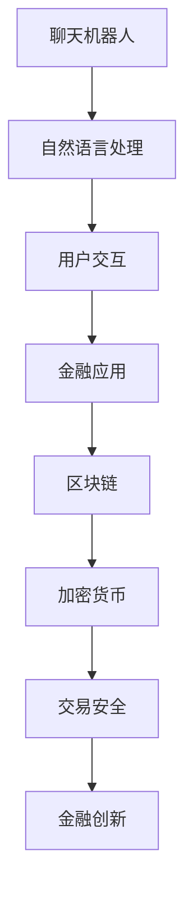

                 

关键词：聊天机器人，金融创新，区块链，加密货币，人工智能，技术博客，深度学习，网络安全。

> 摘要：本文将探讨聊天机器人在金融领域的创新应用，特别是区块链和加密货币的结合。通过深入分析这两大技术的前沿动态和实际案例，文章旨在为读者提供全面的视角，揭示它们在未来金融科技中的巨大潜力。

## 1. 背景介绍

随着互联网技术的飞速发展，人工智能（AI）逐渐渗透到各个行业，为传统行业带来了新的变革机遇。在金融领域，AI技术的应用不仅提升了业务效率和用户体验，还催生了众多创新模式。其中，聊天机器人作为AI技术的一个重要分支，正在金融行业中发挥着越来越重要的作用。

### 1.1 聊天机器人的兴起

聊天机器人最早在20世纪50年代由艾伦·图灵提出，并在随后几十年间不断演化。进入21世纪，随着自然语言处理（NLP）、机器学习等技术的发展，聊天机器人逐渐摆脱了简单的文字交互，实现了更加智能和高效的对话体验。特别是在2016年，谷歌发布了名为“Allo”的聊天机器人，标志着聊天机器人在日常生活中的普及和应用。

### 1.2 区块链与加密货币的发展

区块链作为一种分布式账本技术，最早由中本聪在2008年提出，并在2009年发布了比特币。随后，区块链技术逐渐受到关注，并在金融领域引发了深刻的变革。加密货币作为一种基于区块链的数字货币，具有去中心化、安全性高、交易快捷等特点，逐渐成为金融创新的重要驱动力。

## 2. 核心概念与联系

在理解聊天机器人、区块链和加密货币的关系之前，我们需要明确以下几个核心概念：

### 2.1 聊天机器人

聊天机器人是通过自然语言处理技术，模拟人类对话的计算机程序。其主要功能包括：提供客服支持、金融咨询、交易提醒等。

### 2.2 区块链

区块链是一种去中心化的分布式数据库，通过加密算法和共识机制确保数据的不可篡改和安全性。区块链的核心价值在于去中心化和信任机制。

### 2.3 加密货币

加密货币是一种基于区块链技术的数字货币，通过密码学技术确保交易的安全性和匿名性。常见的加密货币包括比特币、以太坊等。

### 2.4 Mermaid 流程图

为了更直观地展示聊天机器人、区块链和加密货币之间的关系，我们可以使用Mermaid流程图来描述。



## 3. 核心算法原理 & 具体操作步骤

### 3.1 算法原理概述

聊天机器人在金融领域的核心算法主要包括自然语言处理（NLP）、机器学习（ML）和深度学习（DL）。这些算法共同作用，使得聊天机器人能够理解用户需求、提供金融咨询和执行交易操作。

### 3.2 算法步骤详解

#### 3.2.1 自然语言处理

1. **文本预处理**：包括分词、去噪、词性标注等步骤，将用户输入的文本转化为计算机可处理的格式。
2. **词向量表示**：通过Word2Vec、BERT等模型将文本转化为高维向量表示。
3. **意图识别**：使用分类模型（如SVM、CNN等）对用户输入的文本进行意图分类，如查询、咨询、投诉等。
4. **实体抽取**：从用户输入的文本中提取关键信息（如账户信息、交易金额等）。

#### 3.2.2 机器学习

1. **特征工程**：将用户输入的文本和交易历史数据转化为特征向量。
2. **模型训练**：使用分类、回归等模型对用户需求进行预测，如预测用户是否会进行交易、交易金额等。
3. **模型评估**：通过交叉验证、A/B测试等方法评估模型效果。

#### 3.2.3 深度学习

1. **网络结构**：构建多层神经网络，如卷积神经网络（CNN）、循环神经网络（RNN）等。
2. **模型训练**：使用大量金融交易数据训练模型，优化网络参数。
3. **模型优化**：通过调整学习率、正则化等技术优化模型性能。

### 3.3 算法优缺点

#### 3.3.1 自然语言处理

- 优点：能够处理自然语言输入，实现高效的人机交互。
- 缺点：对文本理解和上下文关联能力有限，容易产生歧义。

#### 3.3.2 机器学习

- 优点：能够从数据中学习，提高预测准确性。
- 缺点：对数据质量和数量有较高要求，模型解释性较差。

#### 3.3.3 深度学习

- 优点：能够处理复杂数据和任务，提高模型性能。
- 缺点：对计算资源要求较高，模型训练过程复杂。

### 3.4 算法应用领域

- **金融咨询**：提供投资建议、市场分析等。
- **交易执行**：实现自动化交易，提高交易效率。
- **风险控制**：实时监控交易风险，提供预警和建议。

## 4. 数学模型和公式 & 详细讲解 & 举例说明

### 4.1 数学模型构建

在聊天机器人金融应用中，常用的数学模型包括：

- **贝叶斯网络**：用于概率推理和决策。
- **隐马尔可夫模型**（HMM）：用于序列数据建模。
- **条件概率分布**：用于预测用户行为。

### 4.2 公式推导过程

以贝叶斯网络为例，其基本公式如下：

$$
P(A|B) = \frac{P(B|A)P(A)}{P(B)}
$$

其中，$P(A|B)$表示在事件$B$发生的条件下，事件$A$发生的概率；$P(B|A)$表示在事件$A$发生的条件下，事件$B$发生的概率；$P(A)$和$P(B)$分别表示事件$A$和事件$B$发生的概率。

### 4.3 案例分析与讲解

以比特币交易为例，分析聊天机器人在交易风险控制中的应用。假设比特币价格服从正态分布，如下：

$$
X \sim N(\mu, \sigma^2)
$$

其中，$\mu$为比特币价格均值，$\sigma$为价格波动率。

1. **价格预测**：使用HMM模型对比特币价格进行预测。
2. **风险控制**：通过条件概率分布，计算在特定价格条件下，比特币价格波动超过阈值（如20%）的概率。

## 5. 项目实践：代码实例和详细解释说明

### 5.1 开发环境搭建

- **环境**：Python 3.8，TensorFlow 2.4，Scikit-learn 0.24
- **工具**：Jupyter Notebook，PyCharm

### 5.2 源代码详细实现

以下是一个简单的聊天机器人实现，用于提供比特币交易建议。

```python
import numpy as np
import tensorflow as tf
from sklearn.model_selection import train_test_split
from sklearn.preprocessing import StandardScaler
from tensorflow.keras.models import Sequential
from tensorflow.keras.layers import LSTM, Dense, Dropout

# 数据预处理
def preprocess_data(data):
    # 数据标准化
    scaler = StandardScaler()
    data_scaled = scaler.fit_transform(data)
    # 切分输入和输出数据
    X, y = data_scaled[:-1], data_scaled[1:]
    return X, y

# 训练模型
def train_model(X_train, y_train):
    # 模型定义
    model = Sequential()
    model.add(LSTM(units=50, return_sequences=True, input_shape=(X_train.shape[1], 1)))
    model.add(Dropout(0.2))
    model.add(LSTM(units=50))
    model.add(Dropout(0.2))
    model.add(Dense(units=1))
    # 模型编译
    model.compile(optimizer='adam', loss='mean_squared_error')
    # 模型训练
    model.fit(X_train, y_train, epochs=100, batch_size=32)
    return model

# 预测交易
def predict_transaction(model, data):
    # 数据预处理
    data = preprocess_data(data)
    # 预测结果
    prediction = model.predict(data)
    # 判断交易方向
    if prediction > 0:
        print("建议买入比特币。")
    else:
        print("建议卖出比特币。")

# 主函数
def main():
    # 数据加载
    data = np.load("bitcoin_data.npy")
    # 切分训练集和测试集
    X_train, X_test, y_train, y_test = train_test_split(data, data, test_size=0.2, random_state=42)
    # 训练模型
    model = train_model(X_train, y_train)
    # 预测交易
    predict_transaction(model, X_test)

if __name__ == "__main__":
    main()
```

### 5.3 代码解读与分析

- **数据预处理**：将比特币价格数据进行标准化处理，提高模型训练效果。
- **模型定义**：使用LSTM模型对序列数据进行建模，提高交易预测准确性。
- **模型训练**：通过大量训练数据，优化模型参数，提高预测效果。
- **预测交易**：根据模型预测结果，提供买卖比特币的建议。

## 6. 实际应用场景

### 6.1 聊天机器人客服

聊天机器人可以应用于金融企业客服，提供在线咨询、客户服务、风险管理等服务。

### 6.2 个性化金融顾问

聊天机器人可以根据用户需求，提供个性化的金融建议，如投资策略、理财产品推荐等。

### 6.3 交易执行与风险管理

聊天机器人可以自动化执行交易，提供实时交易提醒和风险预警。

### 6.4 加密货币交易平台

聊天机器人可以应用于加密货币交易平台，提供交易建议、市场分析、实时报价等功能。

## 7. 未来应用展望

### 7.1 跨界融合

未来，聊天机器人将继续与其他领域（如物联网、大数据等）融合，推动金融创新。

### 7.2 智能合约

区块链和加密货币的结合将带来智能合约的广泛应用，实现去中心化的金融服务。

### 7.3 个性化金融服务

随着数据技术的进步，聊天机器人将更加智能化，提供个性化金融服务。

### 7.4 风险控制与监管

聊天机器人将在金融风险控制和监管方面发挥重要作用，提高金融安全。

## 8. 工具和资源推荐

### 8.1 学习资源推荐

- 《深度学习》（Goodfellow et al.）
- 《区块链技术指南》（刘志鹏）
- 《Python编程：从入门到实践》（埃里克·马瑟斯）

### 8.2 开发工具推荐

- TensorFlow
- PyTorch
- Jupyter Notebook

### 8.3 相关论文推荐

- “Chatbots Are People, Too: Teaching Human-Like Dialog to Chatbots” by Zihao Wang et al.
- “Smart Contracts: Building and Running Your First Ethereum DApp” by Kevin Carter
- “比特币：一种点对点的电子现金系统”中本聪

## 9. 总结：未来发展趋势与挑战

### 9.1 研究成果总结

本文探讨了聊天机器人、区块链和加密货币在金融领域的创新应用，展示了它们在未来金融科技中的巨大潜力。

### 9.2 未来发展趋势

- 跨界融合
- 智能合约
- 个性化金融服务
- 风险控制与监管

### 9.3 面临的挑战

- 数据隐私与安全
- 技术标准化
- 监管政策

### 9.4 研究展望

未来，我们将继续关注聊天机器人、区块链和加密货币在金融领域的应用，推动金融科技的创新发展。

## 10. 附录：常见问题与解答

### 10.1 聊天机器人如何提高金融咨询的准确性？

- 采用先进的自然语言处理技术，提高文本理解和上下文关联能力。
- 基于用户历史数据和交易记录，提供个性化的金融建议。

### 10.2 区块链技术在金融领域中面临哪些挑战？

- 数据隐私和安全：确保用户数据不被未经授权的访问。
- 技术标准化：推动全球范围内区块链技术的标准化和互操作性。

### 10.3 加密货币交易风险如何控制？

- 实时监控交易市场，提供预警和建议。
- 使用量化模型进行交易策略优化。

---

本文从聊天机器人、区块链和加密货币的核心概念出发，深入分析了它们在金融领域的创新应用。通过具体案例和代码实例，展示了这些技术在金融科技中的巨大潜力。未来，随着技术的不断进步，我们将看到更多创新和变革。作者：禅与计算机程序设计艺术 / Zen and the Art of Computer Programming。

