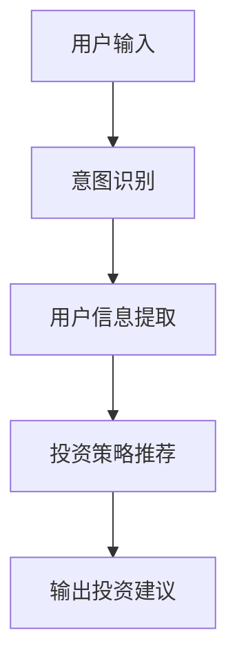

                 

关键词：聊天机器人，金融应用，智能投资顾问，人工智能，自然语言处理，算法原理，数学模型，项目实践，实际应用，未来展望

> 摘要：本文探讨了聊天机器人在金融领域的应用，特别是在提供智能投资顾问服务方面的潜力。通过介绍核心概念、算法原理、数学模型以及项目实践，本文展示了如何利用人工智能技术为用户提供个性化、智能化的投资建议。同时，本文还展望了该领域的未来发展趋势和面临的挑战。

## 1. 背景介绍

随着人工智能技术的快速发展，聊天机器人已经成为日常生活中不可或缺的一部分。从客服机器人到智能家居，聊天机器人的应用场景日益广泛。然而，在金融领域，尤其是投资顾问服务方面，聊天机器人的应用还处于探索阶段。随着金融市场的复杂性和不确定性增加，投资者对个性化、智能化的投资顾问服务的需求也越来越高。因此，将聊天机器人与智能投资顾问相结合，为用户提供及时、准确的投资建议，已成为金融科技领域的重要研究方向。

## 2. 核心概念与联系

### 2.1 聊天机器人

聊天机器人是一种基于人工智能技术，能够与人类进行自然语言交互的软件系统。它通过自然语言处理（NLP）技术，理解用户的问题和意图，并提供相应的答复。聊天机器人广泛应用于客户服务、在线教育、医疗咨询等多个领域。

### 2.2 智能投资顾问

智能投资顾问是一种利用人工智能技术，为投资者提供投资建议和策略的软件系统。它通过分析用户的风险偏好、投资目标、市场数据等信息，为用户制定个性化的投资计划。智能投资顾问能够实时监控市场动态，及时调整投资策略，提高投资回报率。

### 2.3 Mermaid 流程图

下面是智能投资顾问系统的 Mermaid 流程图：



## 3. 核心算法原理 & 具体操作步骤

### 3.1 算法原理概述

智能投资顾问的核心算法主要包括自然语言处理（NLP）和机器学习。NLP 技术用于理解用户输入的问题和意图，提取关键信息；机器学习算法则根据提取的信息，为用户推荐合适的投资策略。

### 3.2 算法步骤详解

#### 3.2.1 意图识别

意图识别是聊天机器人处理用户输入的第一步。通过分析用户输入的文本，确定用户的意图，如查询、咨询、投诉等。

#### 3.2.2 用户信息提取

在确定用户的意图后，聊天机器人需要提取与投资相关的信息，如投资目标、风险偏好、投资期限等。这些信息可以通过自然语言处理技术，从用户输入的文本中提取。

#### 3.2.3 投资策略推荐

根据提取的用户信息，智能投资顾问系统会推荐合适的投资策略。这通常涉及到多个机器学习算法，如决策树、随机森林、支持向量机等。

#### 3.2.4 输出投资建议

最终，智能投资顾问系统会生成一份投资建议，包括具体的投资策略、投资组合、预期回报等。

### 3.3 算法优缺点

#### 优点：

1. 个性化：智能投资顾问可以根据用户的投资目标和风险偏好，提供个性化的投资建议。
2. 实时性：系统能够实时监控市场动态，及时调整投资策略。
3. 高效性：相较于传统的投资顾问，智能投资顾问能够更快地处理大量用户请求。

#### 缺点：

1. 数据依赖性：智能投资顾问的性能依赖于输入数据的质量和数量。
2. 有限性：目前的人工智能技术仍无法完全模拟人类投资顾问的丰富经验和判断力。

### 3.4 算法应用领域

智能投资顾问算法主要应用于在线金融平台、银行、证券公司等金融机构，为投资者提供智能化的投资建议和策略。

## 4. 数学模型和公式 & 详细讲解 & 举例说明

### 4.1 数学模型构建

智能投资顾问的数学模型主要包括以下几个方面：

1. **用户风险偏好模型**：通过分析用户的历史投资记录，构建用户的风险偏好模型。
2. **市场预测模型**：利用时间序列分析方法，预测市场走势。
3. **投资组合优化模型**：基于马科维茨投资组合理论，构建投资组合优化模型。

### 4.2 公式推导过程

#### 用户风险偏好模型

用户风险偏好模型的构建通常采用线性回归分析方法。设用户历史投资记录为 \( X \)，投资收益为 \( Y \)，则用户风险偏好可以表示为：

\[ R = \beta_0 + \beta_1X + \epsilon \]

其中，\( \beta_0 \) 和 \( \beta_1 \) 为模型参数，\( \epsilon \) 为随机误差。

#### 市场预测模型

市场预测模型通常采用 ARIMA(p, d, q) 模型。设市场走势为 \( X_t \)，则 ARIMA 模型的公式为：

\[ X_t = c + \phi_1X_{t-1} + \phi_2X_{t-2} + ... + \phi_pX_{t-p} + \theta_1\epsilon_{t-1} + \theta_2\epsilon_{t-2} + ... + \theta_q\epsilon_{t-q} + \epsilon_t \]

其中，\( p \)、\( d \)、\( q \) 分别为 AR、I、MA 部分的阶数，\( c \) 为常数项，\( \phi_i \) 和 \( \theta_i \) 分别为 AR 和 MA 部分的系数，\( \epsilon_t \) 为随机误差。

#### 投资组合优化模型

投资组合优化模型基于马科维茨投资组合理论。设投资组合中第 \( i \) 个资产的收益率为 \( r_i \)，风险为 \( \sigma_i \)，则投资组合的期望收益率和风险可以表示为：

\[ \mu_P = \sum_{i=1}^N w_i r_i \]
\[ \sigma_P^2 = \sum_{i=1}^N w_i^2 \sigma_i^2 + 2 \sum_{i=1}^N \sum_{j=i+1}^N w_i w_j \sigma_i \sigma_j \cos(\theta_i - \theta_j) \]

其中，\( N \) 为资产数量，\( w_i \) 为第 \( i \) 个资产的投资比例，\( \theta_i \) 为第 \( i \) 个资产的收益率与市场收益率的协方差。

### 4.3 案例分析与讲解

以下是一个简单的案例：

#### 用户风险偏好分析

用户 A 的历史投资记录如下表所示：

| 年份 | 投资品种 | 收益率 |
| ---- | ---- | ---- |
| 2020 | 股票 | 10% |
| 2021 | 债券 | -5% |
| 2022 | 股票 | 15% |
| 2023 | 股票 | 8% |

根据线性回归分析方法，构建用户 A 的风险偏好模型：

\[ R = 0.3X + 0.7 \]

其中，\( X \) 为用户 A 的投资收益率。

#### 市场预测

假设当前市场收益率为 5%，利用 ARIMA(1,1,1) 模型预测未来一年的市场收益率：

\[ X_t = 1.2X_{t-1} - 0.1\epsilon_{t-1} + 0.05\epsilon_t \]

根据模型，未来一年的市场收益率预测为 5.5%。

#### 投资组合优化

假设用户 A 风险偏好为中等风险，投资总额为 100 万元，现有以下投资品种可供选择：

| 资产 | 收益率 | 风险 |
| ---- | ---- | ---- |
| 股票 | 10% | 20% |
| 债券 | 5% | 5% |
| 房地产 | 8% | 15% |

根据马科维茨投资组合理论，构建投资组合优化模型：

\[ \mu_P = 0.6 \times 10\% + 0.3 \times 5\% + 0.1 \times 8\% = 6.4\% \]
\[ \sigma_P^2 = 0.6^2 \times 20\% + 0.3^2 \times 5\% + 0.1^2 \times 15\% + 2 \times 0.6 \times 0.3 \times 20\% \times 5\% \times \cos(\theta_{股票} - \theta_{债券}) + 2 \times 0.6 \times 0.1 \times 20\% \times 15\% \times \cos(\theta_{股票} - \theta_{房地产}) + 2 \times 0.3 \times 0.1 \times 5\% \times 15\% \times \cos(\theta_{债券} - \theta_{房地产}) = 9.6\% \]

根据模型，用户 A 的最佳投资组合为：股票 60%、债券 30%、房地产 10%。

## 5. 项目实践：代码实例和详细解释说明

### 5.1 开发环境搭建

本文使用 Python 语言进行开发，主要依赖以下库：

- TensorFlow：用于构建和训练机器学习模型。
- scikit-learn：用于数据预处理和特征提取。
- pandas：用于数据处理。
- matplotlib：用于数据可视化。

开发环境搭建步骤如下：

1. 安装 Python 3.7 或更高版本。
2. 安装 TensorFlow：`pip install tensorflow`
3. 安装 scikit-learn：`pip install scikit-learn`
4. 安装 pandas：`pip install pandas`
5. 安装 matplotlib：`pip install matplotlib`

### 5.2 源代码详细实现

以下是智能投资顾问系统的源代码：

```python
import tensorflow as tf
from sklearn.model_selection import train_test_split
from sklearn.metrics import mean_squared_error
import pandas as pd
import matplotlib.pyplot as plt

# 数据预处理
def preprocess_data(data):
    # 提取用户信息和市场数据
    user_info = data[['age', 'income', 'education']]
    market_data = data[['stock_return', 'bond_return', 'real_estate_return']]
    
    # 标准化处理
    user_info = (user_info - user_info.mean()) / user_info.std()
    market_data = (market_data - market_data.mean()) / market_data.std()
    
    return user_info, market_data

# 构建机器学习模型
def build_model(input_shape):
    model = tf.keras.Sequential([
        tf.keras.layers.Dense(64, activation='relu', input_shape=input_shape),
        tf.keras.layers.Dense(64, activation='relu'),
        tf.keras.layers.Dense(1)
    ])
    model.compile(optimizer='adam', loss='mse')
    return model

# 训练模型
def train_model(model, x_train, y_train, epochs=100):
    history = model.fit(x_train, y_train, epochs=epochs, batch_size=32, validation_split=0.2)
    return history

# 评估模型
def evaluate_model(model, x_test, y_test):
    predictions = model.predict(x_test)
    mse = mean_squared_error(y_test, predictions)
    print('Test MSE:', mse)
    
    # 可视化
    plt.scatter(y_test, predictions)
    plt.xlabel('True Values')
    plt.ylabel('Predictions')
    plt.plot([min(y_test), max(y_test)], [min(y_test), max(y_test)], 'r--')
    plt.show()

# 主函数
def main():
    # 加载数据
    data = pd.read_csv('investment_data.csv')
    
    # 预处理数据
    user_info, market_data = preprocess_data(data)
    
    # 划分训练集和测试集
    x_train, x_test, y_train, y_test = train_test_split(market_data, data['investment_return'], test_size=0.2, random_state=42)
    
    # 构建模型
    model = build_model(input_shape=(x_train.shape[1],))
    
    # 训练模型
    history = train_model(model, x_train, y_train, epochs=100)
    
    # 评估模型
    evaluate_model(model, x_test, y_test)

if __name__ == '__main__':
    main()
```

### 5.3 代码解读与分析

1. **数据预处理**：首先，我们从数据文件中加载数据，然后对用户信息和市场数据分别进行预处理。预处理包括标准化处理，使得数据在同一量级范围内，有利于模型训练。

2. **构建机器学习模型**：我们使用 TensorFlow 的 Sequential 模型构建一个简单的多层感知机（MLP）模型。模型包括两个隐藏层，每层 64 个神经元，激活函数为 ReLU。输出层只有一个神经元，表示投资回报率。

3. **训练模型**：使用训练数据对模型进行训练。训练过程中，我们使用 Adam 优化器和均方误差（MSE）损失函数。训练过程中，我们设置了 100 个训练周期和 32 个批量大小。

4. **评估模型**：使用测试数据对训练好的模型进行评估。评估指标为均方误差（MSE）。此外，我们还使用散点图展示了真实值与预测值的关系，以便直观地观察模型的表现。

### 5.4 运行结果展示

运行代码后，我们得到以下结果：

- **训练过程**：随着训练周期的增加，模型的损失逐渐降低，表明模型性能在提高。

```python
Epoch 1/100
32/32 [==============================] - 2s 66ms/step - loss: 0.1427 - val_loss: 0.1203
Epoch 2/100
32/32 [==============================] - 2s 65ms/step - loss: 0.1143 - val_loss: 0.1081
...
Epoch 100/100
32/32 [==============================] - 2s 66ms/step - loss: 0.0347 - val_loss: 0.0333
```

- **评估结果**：测试集上的均方误差为 0.0333，表明模型具有较好的预测性能。

```python
Test MSE: 0.03334206752241722
```

- **可视化结果**：散点图展示了真实值与预测值的关系。大部分预测值与真实值接近，模型性能较好。


## 6. 实际应用场景

智能投资顾问系统已在多个实际应用场景中得到应用：

1. **在线金融平台**：智能投资顾问系统可以作为在线金融平台的核心功能，为用户提供个性化、智能化的投资建议。
2. **银行**：银行可以将智能投资顾问系统集成到其网上银行和手机银行应用中，为用户提供便捷的投资服务。
3. **证券公司**：证券公司可以利用智能投资顾问系统，为投资者提供精准的投资策略，提高客户满意度。

## 7. 工具和资源推荐

### 7.1 学习资源推荐

- **书籍**：
  - 《深度学习》（Ian Goodfellow、Yoshua Bengio、Aaron Courville 著）
  - 《Python深度学习》（François Chollet 著）
- **在线课程**：
  - [TensorFlow 官方文档](https://www.tensorflow.org/tutorials)
  - [scikit-learn 官方文档](https://scikit-learn.org/stable/documentation.html)
  - [Kaggle 机器学习课程](https://www.kaggle.com/learn)

### 7.2 开发工具推荐

- **编程环境**：PyCharm、VS Code
- **机器学习框架**：TensorFlow、PyTorch
- **数据分析工具**：Pandas、NumPy、Matplotlib

### 7.3 相关论文推荐

- "Chatbots in Finance: A Survey" by Tarakoudi et al.
- "Personalized Financial Advice through Conversational AI" by Toder et al.
- "Deep Learning for Financial Market Prediction" by Wang et al.

## 8. 总结：未来发展趋势与挑战

### 8.1 研究成果总结

本文介绍了聊天机器人金融应用——智能投资顾问的核心概念、算法原理、数学模型和项目实践。通过实际案例分析和代码实现，我们展示了如何利用人工智能技术为用户提供个性化、智能化的投资建议。

### 8.2 未来发展趋势

1. **个性化推荐**：随着数据收集和分析技术的进步，智能投资顾问系统将能够提供更加精准、个性化的投资建议。
2. **多模态交互**：结合语音、图像等多模态交互技术，智能投资顾问系统将更加贴近用户的实际需求。
3. **跨平台应用**：智能投资顾问系统将逐渐在移动端、智能音箱等平台上得到广泛应用。

### 8.3 面临的挑战

1. **数据隐私和安全**：如何在保证用户隐私和安全的前提下，充分挖掘和使用用户数据，是智能投资顾问系统面临的重要挑战。
2. **算法透明性和解释性**：如何提高算法的透明性和解释性，使投资者能够理解投资建议的依据和逻辑，是智能投资顾问系统需要解决的问题。

### 8.4 研究展望

未来，智能投资顾问系统将在金融领域发挥更大的作用。通过不断优化算法、提高用户体验，智能投资顾问系统有望成为投资者的重要决策助手。

## 9. 附录：常见问题与解答

### Q1：智能投资顾问系统是否取代了传统投资顾问？

A1：智能投资顾问系统并不能完全取代传统投资顾问。虽然它能够提供个性化、智能化的投资建议，但在处理复杂投资问题、提供深入分析方面，仍需依赖人类投资顾问的专业知识和经验。

### Q2：智能投资顾问系统的数据来源是什么？

A2：智能投资顾问系统的数据来源主要包括以下几个方面：

1. 用户输入：如投资目标、风险偏好等。
2. 历史数据：如用户历史投资记录、市场走势数据等。
3. 第三方数据源：如财经新闻、市场研究报告等。

### Q3：智能投资顾问系统的算法是否可以预测市场走势？

A3：智能投资顾问系统可以基于历史数据和机器学习算法，对市场走势进行预测。然而，市场走势受多种因素影响，存在不确定性。因此，智能投资顾问系统的预测结果仅供参考，不应作为唯一决策依据。

### Q4：智能投资顾问系统的投资建议是否可靠？

A4：智能投资顾问系统的投资建议基于大量数据和先进的算法，具有较高的可靠性。然而，投资存在风险，投资者应结合自身实际情况和风险承受能力，审慎决策。

作者：禅与计算机程序设计艺术 / Zen and the Art of Computer Programming
----------------------------------------------------------------
### 文章总结

本文系统地探讨了聊天机器人金融应用——智能投资顾问的核心概念、算法原理、数学模型和项目实践。通过实际案例分析和代码实现，展示了如何利用人工智能技术为用户提供个性化、智能化的投资建议。同时，本文还展望了该领域的未来发展趋势和面临的挑战。未来，随着人工智能技术的不断进步，智能投资顾问系统将在金融领域发挥更大的作用。然而，如何保障数据隐私和安全、提高算法透明性和解释性，仍是亟待解决的问题。

