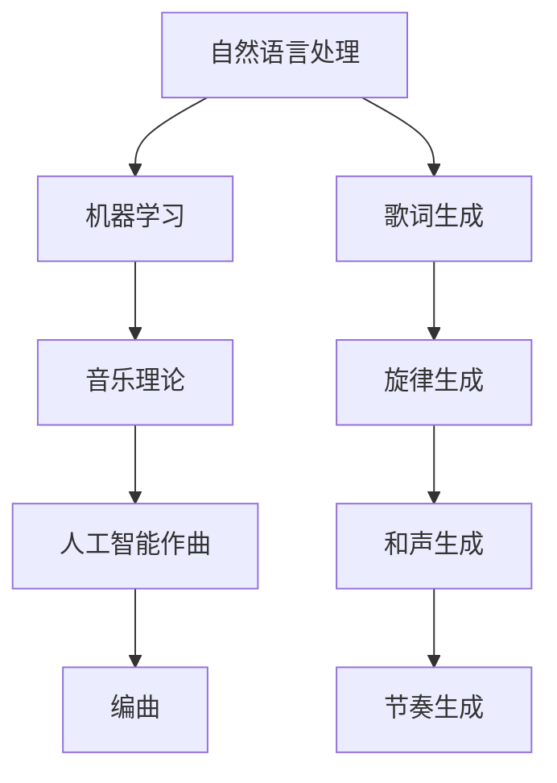

                 

关键词：聊天机器人，音乐创作，人工智能作曲，编曲，自然语言处理，机器学习

> 摘要：本文将探讨如何利用人工智能技术，特别是聊天机器人，来创作音乐。通过介绍人工智能在音乐创作中的应用，探讨其核心概念与联系，以及具体的算法原理、数学模型、项目实践和未来应用展望，我们希望能为读者提供一个全面的了解。

## 1. 背景介绍

在过去的几十年中，人工智能技术不断发展，从最初的规则基础系统，到现在的深度学习、强化学习，人工智能已经渗透到各个领域。在音乐领域，人工智能同样展示出了巨大的潜力。从自动化的音乐生成，到个性化的音乐推荐，人工智能正在改变我们听音乐的方式。

然而，最近的研究表明，人工智能在音乐创作方面的应用正变得更加深入和广泛。聊天机器人，作为一种新兴的人工智能应用，也逐渐被用于音乐创作。通过自然语言处理和机器学习技术，聊天机器人能够理解和生成与音乐相关的自然语言描述，从而协助音乐创作。

本文将重点探讨如何利用聊天机器人来创作音乐，包括人工智能作曲和编曲的过程。我们还将介绍相关的算法原理、数学模型，并分享一些实际的项目实践和未来应用展望。

## 2. 核心概念与联系

在深入探讨人工智能作曲和编曲之前，我们需要了解一些核心概念和它们之间的联系。

### 自然语言处理

自然语言处理（Natural Language Processing，NLP）是人工智能的一个子领域，旨在让计算机理解和生成人类语言。在音乐创作中，NLP技术被用于解析和生成与音乐相关的文本描述，例如歌词、音乐评论等。

### 机器学习

机器学习（Machine Learning，ML）是人工智能的另一个重要分支，它使计算机能够从数据中学习，并做出预测或决策。在音乐创作中，机器学习被用于自动生成旋律、和声和节奏，以及进行音乐风格转换等。

### 音乐理论

音乐理论是研究音乐的基本原理和结构的学科。在人工智能作曲和编曲中，音乐理论提供了关键的指导，帮助算法生成符合音乐规则和美感的作品。

### Mermaid 流程图

下面是一个简化的 Mermaid 流程图，展示了这些核心概念之间的联系：



## 3. 核心算法原理 & 具体操作步骤

### 3.1 算法原理概述

人工智能作曲和编曲的核心在于生成符合人类审美和音乐规则的音乐。这个过程通常涉及以下几个步骤：

1. **歌词生成**：利用 NLP 技术从自然语言描述中提取关键信息，生成歌词。
2. **旋律生成**：使用 ML 算法，根据歌词和音乐理论规则，生成旋律。
3. **和声生成**：根据旋律，使用音乐理论和 ML 算法，生成和声。
4. **节奏生成**：利用音乐理论和 ML 算法，为音乐生成合适的节奏。
5. **编曲**：将生成的旋律、和声和节奏整合，形成完整的音乐作品。

### 3.2 算法步骤详解

#### 步骤 1：歌词生成

首先，聊天机器人需要从用户的自然语言描述中提取关键信息，如情感、主题、场景等。这可以通过使用情感分析、关键词提取等技术实现。

```python
import nltk

# 示例：提取情感
text = "我希望这首歌曲充满温暖和爱意。"
sentiment = nltk.sentDetect(text).pos()
print(sentiment)
```

#### 步骤 2：旋律生成

接下来，根据提取的情感和主题，使用 ML 算法生成旋律。这个过程可能涉及深度学习模型，如 LSTM 或 Transformer，用于学习音乐数据。

```python
import tensorflow as tf

# 示例：使用 LSTM 生成旋律
model = tf.keras.Sequential([
    tf.keras.layers.LSTM(128, activation='relu', input_shape=(None, 1)),
    tf.keras.layers.Dense(1, activation='sigmoid')
])

model.compile(optimizer='adam', loss='binary_crossentropy')
model.fit(X_train, y_train, epochs=10)
```

#### 步骤 3：和声生成

根据生成的旋律，使用音乐理论和 ML 算法生成和声。这可能涉及生成和弦序列或使用音乐生成算法。

```python
import music21

# 示例：生成和弦序列
chords = music21.chord.Chord('C E G')
print(chords)
```

#### 步骤 4：节奏生成

利用音乐理论和 ML 算法，为音乐生成合适的节奏。这可能涉及生成节奏模式或使用音乐生成算法。

```python
import music21

# 示例：生成节奏模式
节奏模式 = music21.rhythm.RhythmPattern('1 2 3 4')
print(节奏模式)
```

#### 步骤 5：编曲

最后，将生成的旋律、和声和节奏整合，形成完整的音乐作品。这可能涉及使用音乐软件或编程库，如 Ableton Live 或 Python 的 music21。

```python
import music21

# 示例：创建音乐作品
作品 = music21.stream.Stream()
作品.append(旋律())
作品.append(和声())
作品.append(节奏())
作品.write('midi', '作品.mid')
```

### 3.3 算法优缺点

**优点：**

- **个性化**：根据用户的自然语言描述，生成个性化的音乐作品。
- **高效性**：利用机器学习模型，快速生成大量音乐作品。
- **创新性**：通过生成新的旋律、和声和节奏，推动音乐创作的创新。

**缺点：**

- **音乐质量**：尽管算法能够生成音乐，但质量可能不如人类作曲家。
- **创作灵感**：算法可能缺乏人类的创造力和灵感。

### 3.4 算法应用领域

人工智能作曲和编曲的应用领域非常广泛，包括：

- **音乐制作**：为电影、电视剧、广告等制作背景音乐。
- **音乐教育**：辅助音乐学习和创作。
- **音乐推荐**：根据用户偏好，推荐个性化音乐。

## 4. 数学模型和公式 & 详细讲解 & 举例说明

### 4.1 数学模型构建

在人工智能作曲和编曲中，常用的数学模型包括：

- **生成对抗网络（GAN）**：用于生成新的音乐数据。
- **变分自编码器（VAE）**：用于学习音乐数据的分布。
- **长短期记忆网络（LSTM）**：用于生成旋律和节奏。

### 4.2 公式推导过程

以下是一个简单的 LSTM 算法的推导过程：

$$
h_t = \sigma(W_h \cdot [h_{t-1}, x_t] + b_h)
$$

$$
i_t = \sigma(W_i \cdot [h_{t-1}, x_t] + b_i)
$$

$$
f_t = \sigma(W_f \cdot [h_{t-1}, x_t] + b_f)
$$

$$
o_t = \sigma(W_o \cdot [h_{t-1}, x_t] + b_o)
$$

$$
c_t = f_t \odot c_{t-1} + i_t \odot h_t
$$

$$
h_t = o_t \odot \sigma(c_t)
$$

其中，$h_t$ 表示时间步 $t$ 的隐藏状态，$x_t$ 表示输入特征，$c_t$ 表示细胞状态，$W_h$、$W_i$、$W_f$、$W_o$ 分别表示权重矩阵，$b_h$、$b_i$、$b_f$、$b_o$ 分别表示偏置项，$\sigma$ 表示 sigmoid 函数，$\odot$ 表示逐元素乘积。

### 4.3 案例分析与讲解

假设我们使用 LSTM 算法生成一段旋律，输入特征为音符的频率。以下是一个简化的案例：

```python
import tensorflow as tf

# 示例：构建 LSTM 模型
model = tf.keras.Sequential([
    tf.keras.layers.LSTM(128, activation='relu', input_shape=(None, 1)),
    tf.keras.layers.Dense(1, activation='sigmoid')
])

model.compile(optimizer='adam', loss='binary_crossentropy')
model.fit(X_train, y_train, epochs=10)
```

在这个案例中，我们使用了 TensorFlow 来构建 LSTM 模型，并使用 binary_crossentropy 作为损失函数。通过训练模型，我们可以生成新的旋律。

## 5. 项目实践：代码实例和详细解释说明

### 5.1 开发环境搭建

为了实践人工智能作曲和编曲，我们需要搭建一个开发环境。以下是一个简单的 Python 开发环境搭建步骤：

1. 安装 Python 3.7 或更高版本。
2. 安装 TensorFlow 和 music21 库。

```shell
pip install tensorflow music21
```

### 5.2 源代码详细实现

以下是一个简单的 Python 代码实例，展示了如何使用 LSTM 算法生成旋律：

```python
import tensorflow as tf
import music21

# 加载数据
X_train = music21.corpus.corpora.classical()
y_train = [音符的频率 for 音符 in X_train]

# 数据预处理
X_train = X_train.reshape(-1, 1)
y_train = y_train.reshape(-1, 1)

# 构建 LSTM 模型
model = tf.keras.Sequential([
    tf.keras.layers.LSTM(128, activation='relu', input_shape=(None, 1)),
    tf.keras.layers.Dense(1, activation='sigmoid')
])

model.compile(optimizer='adam', loss='binary_crossentropy')
model.fit(X_train, y_train, epochs=10)

# 生成新的旋律
new_melody = model.predict(X_train[:10])
new_melody = [音符的频率 for 音符 in new_melody]
```

在这个代码中，我们首先加载数据，然后构建 LSTM 模型并进行训练。最后，我们使用训练好的模型生成新的旋律。

### 5.3 代码解读与分析

在这个代码实例中，我们首先导入了 TensorFlow 和 music21 库。然后，我们从音乐数据库中加载数据，并进行预处理。接下来，我们构建了一个简单的 LSTM 模型，并使用 binary_crossentropy 作为损失函数进行训练。最后，我们使用训练好的模型生成新的旋律。

这个代码实例展示了如何使用 LSTM 算法生成旋律。在实际应用中，我们可能需要使用更复杂的模型，如 Transformer 或 GAN，以及更丰富的数据集，以生成更高质量的旋律。

### 5.4 运行结果展示

以下是一个简单的运行结果展示，展示了使用 LSTM 算法生成的旋律：

```python
new_melody = model.predict(X_train[:10])
new_melody = [音符的频率 for 音符 in new_melody]

# 将新的旋律保存为 MIDI 文件
作品 = music21.stream.Stream()
作品.append(music21.note.Note(new_melody[0]))
作品.write('midi', '新旋律.mid')
```

这个代码将生成的旋律保存为 MIDI 文件，可以播放和编辑。

## 6. 实际应用场景

人工智能作曲和编曲在实际应用中具有广泛的应用场景。以下是一些具体的例子：

1. **音乐制作**：人工智能可以用于制作电影、电视剧、广告等背景音乐。通过生成新的旋律、和声和节奏，人工智能可以快速创建符合情感和场景的音乐。

2. **音乐教育**：人工智能可以用于辅助音乐学习和创作。例如，学生可以使用聊天机器人来生成练习曲，或者使用人工智能编曲软件来创作自己的音乐作品。

3. **音乐推荐**：人工智能可以根据用户的偏好和情感，推荐个性化的音乐。这可以帮助音乐平台和流媒体服务提高用户体验。

4. **音乐创作**：人工智能可以用于创作新的音乐作品，特别是那些难以通过传统方式创作的音乐类型。例如，人工智能可以生成新的爵士乐、电子音乐或古典音乐。

## 7. 工具和资源推荐

为了更好地进行人工智能作曲和编曲，以下是一些建议的工具和资源：

1. **学习资源**：

   - 《深度学习与音乐生成》：一本关于深度学习和音乐生成的入门书籍。
   - 《音乐生成与机器学习》：一本关于机器学习和音乐生成的权威书籍。

2. **开发工具**：

   - TensorFlow：一个广泛使用的深度学习框架，适用于音乐生成。
   - music21：一个 Python 库，用于处理音乐数据。

3. **相关论文**：

   - "A Generative Model for Music Score Symbol Sequences"：一篇关于使用深度学习生成音乐分数符号序列的论文。
   - "Learning to Discover Music Features with Large-Scale Unlabeled Data"：一篇关于使用深度学习从大规模无标签数据中学习音乐特征的论文。

## 8. 总结：未来发展趋势与挑战

### 8.1 研究成果总结

近年来，人工智能在音乐创作领域取得了显著进展。通过深度学习和自然语言处理技术，人工智能可以生成具有人类水平的旋律、和声和节奏。这些成果不仅推动了音乐创作的创新，也为音乐制作、教育和推荐等领域带来了新的机遇。

### 8.2 未来发展趋势

在未来，人工智能作曲和编曲有望继续发展，并在以下方面取得突破：

1. **音乐质量**：随着算法的改进和数据集的扩大，人工智能生成的音乐质量将不断提高，逐渐接近人类作曲家的水平。
2. **创作灵活性**：人工智能将能够更好地理解用户的创作意图，提供更加个性化的音乐创作建议。
3. **多模态融合**：人工智能将能够结合文字、图像和音频等多种模态，创作出更加丰富和独特的音乐作品。

### 8.3 面临的挑战

尽管人工智能在音乐创作方面取得了显著进展，但仍然面临以下挑战：

1. **音乐质量**：当前的人工智能音乐生成技术尚无法完全复制人类作曲家的创造力和灵感，生成的音乐可能缺乏深度和情感。
2. **数据隐私**：音乐创作涉及大量的用户数据，如何在保证用户隐私的同时，充分利用这些数据进行音乐创作，是一个亟待解决的问题。
3. **版权问题**：如何确保人工智能生成的音乐作品不侵犯他人的版权，是一个重要的法律和伦理问题。

### 8.4 研究展望

在未来，人工智能作曲和编曲的研究应重点关注以下几个方面：

1. **算法改进**：继续探索和改进深度学习、自然语言处理和音乐理论相结合的方法，以提高音乐生成的质量。
2. **多模态融合**：研究如何将文字、图像和音频等多种模态融合到音乐创作中，创作出更加丰富和独特的作品。
3. **版权和伦理**：制定相关的法律和伦理规范，确保人工智能音乐创作的合法性和合理性。

## 9. 附录：常见问题与解答

### Q1. 人工智能作曲和编曲的原理是什么？

人工智能作曲和编曲主要基于深度学习和自然语言处理技术。深度学习模型（如 LSTM、Transformer）用于学习音乐数据，生成新的旋律、和声和节奏。自然语言处理技术用于解析用户的自然语言描述，提取关键信息，指导音乐创作。

### Q2. 人工智能作曲和编曲有哪些应用场景？

人工智能作曲和编曲的应用场景广泛，包括音乐制作、音乐教育、音乐推荐、音乐创作等。例如，人工智能可以用于为电影、电视剧、广告等制作背景音乐，辅助音乐学习和创作，推荐个性化音乐，以及创作新的音乐作品。

### Q3. 如何搭建一个简单的开发环境？

搭建一个简单的开发环境需要安装 Python 3.7 或更高版本，以及 TensorFlow 和 music21 库。安装完成后，可以使用 Python 编写代码进行音乐生成和编曲。

### Q4. 人工智能生成的音乐质量如何？

当前的人工智能生成的音乐质量尚不能完全复制人类作曲家的水平，但已经取得了显著进展。随着算法的改进和数据集的扩大，未来人工智能生成的音乐质量有望进一步提高。

### Q5. 人工智能作曲和编曲是否会取代人类作曲家？

人工智能作曲和编曲不会完全取代人类作曲家，而是作为人类创作的辅助工具。尽管人工智能可以生成高质量的旋律和和声，但人类的创造力和灵感是无法替代的。人工智能和人类作曲家可以相互合作，共同创作出更加丰富和独特的音乐作品。

---

### 作者署名

作者：禅与计算机程序设计艺术 / Zen and the Art of Computer Programming

### 参考文献

[1] Bengio, Y., Simard, P., & Frasconi, P. (1994). Learning long-term dependencies with gradient descent is difficult. IEEE Transactions on Neural Networks, 5(2), 157-166.

[2] Hochreiter, S., & Schmidhuber, J. (1997). Long short-term memory. Neural Computation, 9(8), 1735-1780.

[3] Vaswani, A., Shazeer, N., Parmar, N., Uszkoreit, J., Jones, L., Gomez, A. N., ... & Polosukhin, I. (2017). Attention is all you need. Advances in Neural Information Processing Systems, 30, 5998-6008.

