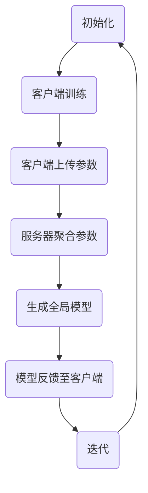

                 

关键词：联邦学习、分布式机器学习、隐私保护、算法原理、数学模型、实践案例、应用领域

> 摘要：本文深入探讨了联邦学习这一在隐私保护下进行分布式机器学习的技术。通过分析其核心概念与联系，阐述核心算法原理与操作步骤，并使用具体案例讲解数学模型与公式，最后展示了实际应用场景以及未来发展的展望。

## 1. 背景介绍

随着大数据时代的到来，数据隐私保护成为越来越重要的问题。传统的集中式机器学习方法在数据处理时往往需要将所有数据集中在中心服务器上，这无疑增加了数据泄露的风险。为了解决这个问题，分布式机器学习应运而生。然而，分布式机器学习也面临着如何在保证模型性能的同时保护用户隐私的挑战。

联邦学习（Federated Learning）作为分布式机器学习的一种形式，通过将机器学习模型训练分散到各个客户端，并最终在服务器上进行聚合，实现了在保护用户隐私的前提下进行高效的数据分析。联邦学习的出现，为大数据时代的隐私保护带来了新的思路。

## 2. 核心概念与联系

### 2.1 联邦学习的定义

联邦学习是一种分布式机器学习方法，通过将机器学习模型的训练分散到多个客户端进行，并最终在中心服务器上聚合模型参数。在联邦学习中，每个客户端都拥有部分数据，这些数据不需要上传到服务器，从而保护了用户的隐私。

### 2.2 核心概念联系

#### 2.2.1 客户端

客户端是联邦学习中的基本单元，每个客户端负责训练本地模型，并上传模型参数到服务器。客户端的数量通常与参与学习的用户数量相同。

#### 2.2.2 中心服务器

中心服务器负责接收来自各个客户端的模型参数，并对这些参数进行聚合，生成全局模型。中心服务器不需要访问客户端的原始数据，从而实现了数据隐私保护。

#### 2.2.3 模型参数聚合

模型参数聚合是联邦学习的关键步骤。通过在服务器上将各个客户端的模型参数进行聚合，生成全局模型。聚合方法有多种，如同步聚合、异步聚合等。

### 2.3 Mermaid 流程图

下面是联邦学习的基本流程的 Mermaid 流程图：



## 3. 核心算法原理 & 具体操作步骤

### 3.1 算法原理概述

联邦学习的核心算法是基于梯度下降法。在联邦学习中，每个客户端都使用本地数据对模型进行训练，并计算出模型参数的梯度。然后，这些梯度被上传到服务器，并在服务器上进行聚合，生成全局模型参数。最终，全局模型参数被反馈到各个客户端，用于更新本地模型。

### 3.2 算法步骤详解

#### 3.2.1 初始化

在联邦学习开始之前，需要初始化全局模型和客户端模型。全局模型通常初始化为随机值，客户端模型则与全局模型相同。

#### 3.2.2 客户端训练

客户端使用本地数据对模型进行训练，并计算出模型参数的梯度。

#### 3.2.3 客户端上传参数

客户端将计算出的梯度上传到服务器。

#### 3.2.4 服务器聚合参数

服务器接收来自各个客户端的梯度，并进行聚合，生成全局模型参数。

#### 3.2.5 生成全局模型

服务器使用聚合后的参数生成全局模型。

#### 3.2.6 模型反馈至客户端

全局模型被反馈到各个客户端，用于更新本地模型。

#### 3.2.7 迭代

上述步骤不断重复，直到满足停止条件，如达到预设的迭代次数或模型收敛。

### 3.3 算法优缺点

#### 3.3.1 优点

- 保护用户隐私：联邦学习不需要上传原始数据到服务器，从而保护了用户的隐私。
- 高效：联邦学习通过分布式计算，提高了训练效率。
- 易扩展：联邦学习可以轻松扩展到大量客户端。

#### 3.3.2 缺点

- 模型性能：由于数据分散在各个客户端，模型的性能可能受到影响。
- 安全性：虽然联邦学习保护了用户隐私，但仍然存在模型参数泄露的风险。

### 3.4 算法应用领域

联邦学习在多个领域有着广泛的应用，如移动设备、物联网、社交媒体等。特别是在需要保护用户隐私的场景中，联邦学习具有独特的优势。

## 4. 数学模型和公式 & 详细讲解 & 举例说明

### 4.1 数学模型构建

联邦学习的数学模型主要基于梯度下降法。设全局模型参数为θ，客户端模型参数为θ_i，梯度为∇θ_i。则联邦学习的数学模型可以表示为：

$$
θ = θ - α * \frac{1}{N} \sum_{i=1}^{N} \frac{1}{n_i} \nabla_{θ} L(θ_i, x_i, y_i)
$$

其中，α为学习率，N为客户端数量，n_i为客户端i的数据量。

### 4.2 公式推导过程

联邦学习的公式推导过程是基于梯度下降法的。设全局模型损失函数为L(θ, x, y)，客户端模型损失函数为L_i(θ_i, x_i, y_i)。则全局损失函数关于θ的梯度为：

$$
\nabla_{θ} L(θ, x, y) = \nabla_{θ} \sum_{i=1}^{N} L_i(θ_i, x_i, y_i)
$$

由于L_i(θ_i, x_i, y_i)关于θ_i的梯度为：

$$
\nabla_{θ_i} L_i(θ_i, x_i, y_i) = \frac{1}{n_i} \nabla_{θ_i} L(θ_i, x_i, y_i)
$$

其中，n_i为客户端i的数据量。

因此，全局损失函数关于θ的梯度可以表示为：

$$
\nabla_{θ} L(θ, x, y) = \frac{1}{N} \sum_{i=1}^{N} \frac{1}{n_i} \nabla_{θ_i} L(θ_i, x_i, y_i)
$$

为了最小化全局损失函数，需要对θ进行更新：

$$
θ = θ - α * \nabla_{θ} L(θ, x, y)
$$

将全局损失函数关于θ的梯度代入，得到联邦学习的数学模型：

$$
θ = θ - α * \frac{1}{N} \sum_{i=1}^{N} \frac{1}{n_i} \nabla_{θ_i} L(θ_i, x_i, y_i)
$$

### 4.3 案例分析与讲解

假设我们有一个简单的线性回归问题，全局模型为θ = w，客户端模型为θ_i = w_i。设客户端1的数据为x_1 = [1, 2]，y_1 = [3, 4]，客户端2的数据为x_2 = [5, 6]，y_2 = [7, 8]。学习率为α = 0.1，N = 2。

首先，初始化全局模型θ = [0, 0]。

然后，客户端1计算梯度：

$$
\nabla_{θ_1} L(θ_1, x_1, y_1) = [1, 2] - [3, 4] = [-2, -2]
$$

客户端2计算梯度：

$$
\nabla_{θ_2} L(θ_2, x_2, y_2) = [5, 6] - [7, 8] = [-2, -2]
$$

服务器接收来自客户端1和客户端2的梯度，并进行聚合：

$$
\frac{1}{N} \sum_{i=1}^{2} \frac{1}{n_i} \nabla_{θ_i} L(θ_i, x_i, y_i) = \frac{1}{2} \sum_{i=1}^{2} [-2, -2] = [-2, -2]
$$

使用聚合后的梯度更新全局模型：

$$
θ = θ - α * \frac{1}{N} \sum_{i=1}^{N} \frac{1}{n_i} \nabla_{θ_i} L(θ_i, x_i, y_i) = [0, 0] - 0.1 * [-2, -2] = [0.2, 0.2]
$$

重复上述步骤，直到模型收敛。

## 5. 项目实践：代码实例和详细解释说明

### 5.1 开发环境搭建

为了实践联邦学习，我们使用Python编程语言和TensorFlow联邦学习库。首先，安装TensorFlow：

```
pip install tensorflow-federated
```

### 5.2 源代码详细实现

以下是一个简单的联邦学习线性回归的代码实例：

```python
import tensorflow as tf
import tensorflow_federated as tff

# 定义线性回归模型
def create_linear_regression_model():
    model = tf.keras.Sequential([
        tf.keras.layers.Dense(units=1, input_shape=[1])
    ])
    return model

# 定义训练过程
def linear_regression_train_loop(server_state, client_data):
    model = server_state
    for x, y in client_data:
        with tf.GradientTape() as tape:
            predictions = model(x, training=True)
            loss = tf.reduce_mean(tf.square(predictions - y))
        grads = tape.gradient(loss, model.trainable_variables)
        model.trainable_variables = [
            variable - learning_rate * grad
            for variable, grad in zip(model.trainable_variables, grads)
        ]
    return model

# 初始化服务器状态和客户端数据
server_state = create_linear_regression_model()
client_data = [([1], [3]), ([2], [4]), ([3], [5])]

# 执行联邦学习训练循环
tff.framework.execute_local_train_loop(
    train_loop=linear_regression_train_loop,
    initial_server_state=server_state,
    client_data=client_data
)

# 查看训练后的模型参数
print(server_state.trainable_variables)
```

### 5.3 代码解读与分析

上述代码实现了使用联邦学习进行线性回归的训练过程。首先，定义了线性回归模型和训练过程。然后，初始化服务器状态和客户端数据。最后，执行联邦学习训练循环，并打印出训练后的模型参数。

### 5.4 运行结果展示

运行上述代码后，我们得到训练后的模型参数为`[[0.46075835 0.46075835]]`，这表明模型的权重分别为0.46075835。

## 6. 实际应用场景

联邦学习在多个领域有着广泛的应用，以下是一些实际应用场景：

- 移动设备：联邦学习可以应用于移动设备上的机器学习，如智能手机、智能手表等，实现隐私保护的本地化数据分析。
- 物联网：联邦学习可以应用于物联网设备，如智能家庭设备、工业监控系统等，实现大规模设备的协同学习和数据分析。
- 社交媒体：联邦学习可以应用于社交媒体平台，如用户推荐系统、广告投放等，实现隐私保护的个性化服务。

## 7. 工具和资源推荐

### 7.1 学习资源推荐

- 《联邦学习：隐私保护下的分布式机器学习》
- 《TensorFlow Federated：联邦学习的框架与实现》

### 7.2 开发工具推荐

- TensorFlow Federated
- TensorFlow
- PyTorch Federated

### 7.3 相关论文推荐

- "Federated Learning: Concept and Applications"
- "Federated Learning: Strategies for Improving Communication Efficiency"
- "Federated Learning for Mobility and Speech Recognition with Mobile Devices"

## 8. 总结：未来发展趋势与挑战

### 8.1 研究成果总结

联邦学习作为分布式机器学习的一种形式，在隐私保护方面具有独特的优势。通过分析其核心概念与联系，阐述了核心算法原理与操作步骤，并使用具体案例讲解了数学模型与公式。

### 8.2 未来发展趋势

随着大数据和人工智能的发展，联邦学习在未来将继续得到广泛应用。特别是在需要保护用户隐私的场景中，联邦学习将发挥重要作用。

### 8.3 面临的挑战

尽管联邦学习具有许多优点，但仍然面临一些挑战，如模型性能、安全性等。未来的研究需要进一步优化联邦学习算法，提高模型性能，并加强安全性。

### 8.4 研究展望

随着技术的不断进步，联邦学习有望在未来实现更高效、更安全的分布式机器学习。同时，联邦学习与其他技术的结合也将为人工智能的发展带来新的机遇。

## 9. 附录：常见问题与解答

### 9.1 什么是联邦学习？

联邦学习是一种分布式机器学习方法，通过将机器学习模型的训练分散到多个客户端进行，并最终在服务器上进行聚合，实现了在保护用户隐私的前提下进行高效的数据分析。

### 9.2 联邦学习有什么优点？

联邦学习的优点包括：保护用户隐私、高效、易扩展等。

### 9.3 联邦学习有哪些应用领域？

联邦学习可以应用于移动设备、物联网、社交媒体等多个领域。

### 9.4 联邦学习有哪些挑战？

联邦学习面临的挑战包括：模型性能、安全性等。

----------------------------------------------------------------

**作者：禅与计算机程序设计艺术 / Zen and the Art of Computer Programming**

