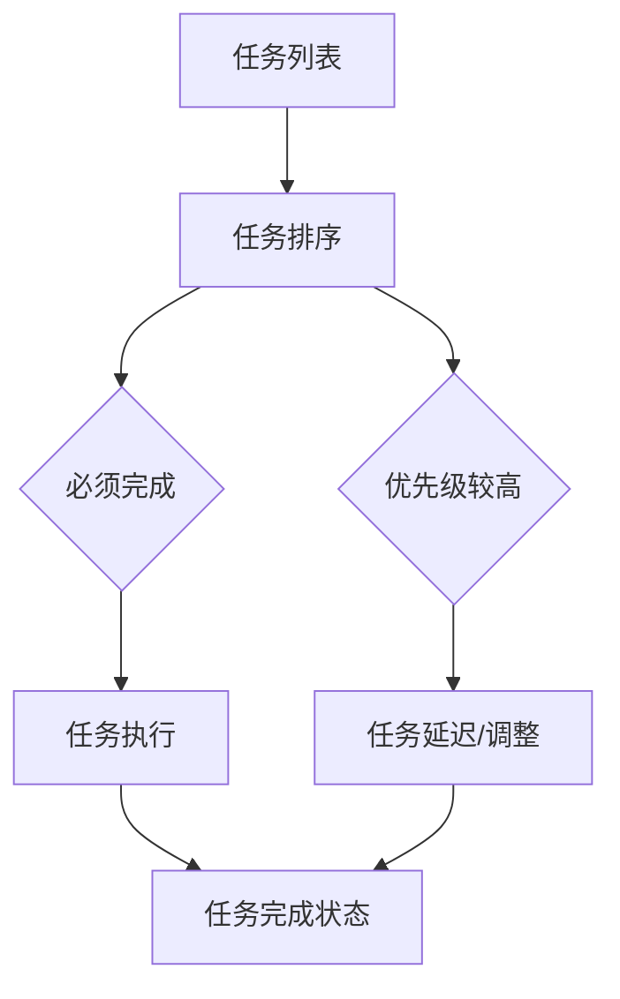

                 

关键词：双目标清单、任务管理、时间管理、效率提升、目标实现、优先级排序、技术方法论

摘要：本文旨在探讨如何在快节奏的技术领域中有效地使用双目标清单来管理任务和提升个人工作效率。通过分析双目标清单的基本概念、核心原理以及实际操作方法，结合具体案例，本文为读者提供了实用的指导和建议，帮助他们在复杂的技术项目中实现目标的明确和高效执行。

## 1. 背景介绍

在现代信息技术飞速发展的背景下，项目管理和任务协调变得越来越复杂。软件开发、数据科学、人工智能等领域对工作效率和个人能力的要求越来越高。在这样的环境中，如何合理地规划和执行任务，以实现个人和组织的目标，成为了一个重要问题。

双目标清单（Two-Target List）是一种有效的任务管理工具，它可以帮助个体或团队在复杂的项目中聚焦于最重要的目标，从而提高工作效率和实现任务的有效执行。双目标清单的基本思想是将任务分解为两个主要目标，一个为“必须完成”的任务，另一个为“优先级较高的”任务。这种策略不仅有助于明确优先级，还能确保在资源有限的情况下，关键任务能够得到优先处理。

本文将围绕双目标清单的概念、原理、操作步骤以及实际应用，提供一个全面的指导，帮助读者更好地利用这一工具，提升个人和团队的工作效率。

## 2. 核心概念与联系

### 2.1 双目标清单的定义

双目标清单是一种基于优先级排序的清单工具，它帮助个体或团队将所有任务根据重要性和紧急性分解为两个主要目标。第一个目标是“必须完成”的任务，即对项目成功至关重要的任务；第二个目标是“优先级较高”的任务，即那些对项目有一定影响，但可以延迟或调整的任务。

### 2.2 双目标清单的组成部分

双目标清单由以下几部分组成：

- **任务列表**：列出所有需要完成的任务，包括必须完成的任务和优先级较高的任务。
- **优先级排序**：对任务进行排序，确保关键任务得到优先处理。
- **完成状态**：记录每个任务的完成状态，以便追踪进展和调整优先级。

### 2.3 双目标清单与任务管理的关系

双目标清单是任务管理的一部分，它帮助个体或团队在众多任务中找到关键任务，从而提高工作效率。任务管理包括任务规划、优先级排序、资源分配、进度跟踪等多个方面，而双目标清单在其中起到了关键作用，帮助任务管理更加有序和高效。

### 2.4 双目标清单与时间管理的关系

时间管理是任务管理的一个重要方面，而双目标清单正是时间管理的一种实践。通过明确任务的重要性和优先级，双目标清单帮助个体或团队更好地分配时间，确保关键任务得到充分的关注和处理。

### 2.5 Mermaid 流程图

以下是一个简化的双目标清单的 Mermaid 流程图，展示其基本结构和组成。



## 3. 核心算法原理 & 具体操作步骤

### 3.1 算法原理概述

双目标清单的核心算法原理是基于优先级排序，通过对任务进行分类和排序，确保关键任务得到优先处理。算法的主要步骤包括：

1. **任务分类**：将任务分为必须完成的任务和优先级较高的任务。
2. **优先级排序**：根据任务的紧急性和重要性对任务进行排序。
3. **任务执行**：根据排序结果执行任务，确保关键任务得到优先处理。
4. **任务调整**：根据任务进展和项目需求，对任务进行适当调整。

### 3.2 算法步骤详解

1. **任务收集**：首先，收集所有需要完成的任务，并记录在任务列表中。
2. **任务分类**：将任务分为必须完成的任务和优先级较高的任务。必须完成的任务包括那些对项目成功至关重要的任务，如关键功能实现、重要客户需求等；优先级较高的任务包括那些对项目有一定影响，但可以延迟或调整的任务，如辅助功能开发、优化等。
3. **优先级排序**：对任务进行排序，可以采用优先级评分、任务重要性评估等方法。例如，可以采用 0-10 分的评分系统，分数越高表示任务的重要性越高。
4. **任务执行**：根据排序结果执行任务，首先完成必须完成的任务，然后按照优先级较高的任务进行执行。
5. **任务调整**：在任务执行过程中，根据实际情况和项目需求，对任务进行适当调整，如调整任务优先级、增加或删除任务等。

### 3.3 算法优缺点

**优点**：

- **提高任务优先级**：通过明确任务的优先级，确保关键任务得到优先处理，从而提高任务执行效率。
- **减少任务混淆**：通过将任务分为必须完成的任务和优先级较高的任务，减少了任务混淆和重复工作的可能性。
- **灵活调整**：在任务执行过程中，可以根据实际情况和项目需求，对任务进行适当调整，确保项目目标的实现。

**缺点**：

- **任务量较大**：如果任务列表较长，可能需要更多的时间和精力进行任务分类和排序。
- **优先级评估主观**：优先级评估可能受到主观因素的影响，导致任务排序不够客观。

### 3.4 算法应用领域

双目标清单算法可以应用于多个领域，如软件开发、项目管理、时间管理等。以下是一些具体的应用场景：

- **软件开发**：在软件开发过程中，双目标清单可以帮助开发团队明确任务优先级，确保关键功能得到优先处理，从而提高开发效率。
- **项目管理**：在项目管理过程中，双目标清单可以帮助项目经理明确项目目标和任务优先级，从而更好地协调资源和进度。
- **时间管理**：在时间管理过程中，双目标清单可以帮助个人明确任务的重要性和优先级，从而更好地分配时间和精力。

## 4. 数学模型和公式 & 详细讲解 & 举例说明

### 4.1 数学模型构建

双目标清单的数学模型可以基于加权评分系统构建，通过评估任务的重要性和紧急性，计算每个任务的优先级分数。具体模型如下：

\[ P_i = w_1 \cdot I_i + w_2 \cdot E_i \]

其中：

- \( P_i \) 为任务 \( i \) 的优先级分数。
- \( I_i \) 为任务 \( i \) 的重要性评分。
- \( E_i \) 为任务 \( i \) 的紧急性评分。
- \( w_1 \) 和 \( w_2 \) 分别为重要性评分和紧急性评分的权重，通常设置为 \( w_1 = 0.6 \) 和 \( w_2 = 0.4 \)。

### 4.2 公式推导过程

公式推导过程如下：

1. **任务重要性评分 \( I_i \)**：根据任务对项目成功的影响程度进行评分，分数范围通常为 0-10。分数越高，表示任务的重要性越高。

2. **任务紧急性评分 \( E_i \)**：根据任务的完成时间要求和项目进度进行评分，分数范围通常为 0-10。分数越高，表示任务的紧急性越高。

3. **加权评分系统**：将重要性评分和紧急性评分进行加权求和，得到每个任务的优先级分数 \( P_i \)。权重 \( w_1 \) 和 \( w_2 \) 可以根据实际情况进行调整。

### 4.3 案例分析与讲解

以下是一个具体的案例，说明如何使用双目标清单进行任务管理。

### 案例背景

某软件开发项目需要在两周内完成，任务列表如下：

- 任务 A：关键功能实现，对项目成功至关重要，重要性评分为 9，紧急性评分为 7。
- 任务 B：辅助功能开发，对项目有一定影响，重要性评分为 6，紧急性评分为 8。
- 任务 C：代码优化，对项目有一定影响，重要性评分为 5，紧急性评分为 5。
- 任务 D：用户文档编写，对项目有一定影响，重要性评分为 4，紧急性评分为 3。

### 使用双目标清单进行任务管理

1. **任务分类**：将任务分为必须完成的任务和优先级较高的任务。必须完成的任务包括任务 A，优先级较高的任务包括任务 B 和任务 C。

2. **优先级排序**：根据任务的优先级分数进行排序。任务 A 的优先级分数为 \( P_A = 0.6 \cdot 9 + 0.4 \cdot 7 = 8.2 \)；任务 B 的优先级分数为 \( P_B = 0.6 \cdot 6 + 0.4 \cdot 8 = 7.2 \)；任务 C 的优先级分数为 \( P_C = 0.6 \cdot 5 + 0.4 \cdot 5 = 5 \)。

3. **任务执行**：根据排序结果执行任务，首先完成任务 A，然后按照任务 B 和任务 C 的顺序进行执行。

4. **任务调整**：在任务执行过程中，根据实际情况和项目需求，对任务进行适当调整。例如，如果任务 C 的进度较慢，可以考虑将其调整为必须完成的任务，确保项目按时完成。

通过使用双目标清单，该软件开发项目能够更加有序地执行任务，确保关键任务得到优先处理，从而提高项目成功率。

## 5. 项目实践：代码实例和详细解释说明

### 5.1 开发环境搭建

为了演示双目标清单在软件开发中的实际应用，我们将在 Python 环境中搭建一个简单的双目标清单系统。首先，确保已经安装了 Python 和必要的库，例如 Pandas（用于数据操作）和 Matplotlib（用于数据可视化）。

```bash
pip install pandas matplotlib
```

### 5.2 源代码详细实现

以下是一个简单的 Python 代码示例，用于实现双目标清单的基本功能：

```python
import pandas as pd

# 任务数据结构
tasks = [
    {"name": "任务 A", "importance": 9, "urgency": 7},
    {"name": "任务 B", "importance": 6, "urgency": 8},
    {"name": "任务 C", "importance": 5, "urgency": 5},
    {"name": "任务 D", "importance": 4, "urgency": 3},
]

# 计算任务优先级
df = pd.DataFrame(tasks)
df["priority"] = 0.6 * df["importance"] + 0.4 * df["urgency"]

# 按优先级排序
sorted_df = df.sort_values(by="priority", ascending=False)

# 输出排序后的任务列表
print(sorted_df)

# 可视化任务列表
import matplotlib.pyplot as plt

plt.bar(sorted_df["name"], sorted_df["priority"])
plt.xlabel("任务名称")
plt.ylabel("优先级分数")
plt.title("双目标清单：任务优先级排序")
plt.xticks(rotation=45)
plt.show()
```

### 5.3 代码解读与分析

1. **任务数据结构**：我们首先定义了一个任务列表，每个任务包含名称、重要性评分和紧急性评分。

2. **计算任务优先级**：使用 Pandas DataFrame 对任务列表进行操作，计算每个任务的优先级分数。优先级公式已经在第4章中详细解释。

3. **排序任务列表**：根据优先级分数对任务列表进行排序，确保关键任务得到优先处理。

4. **输出排序后的任务列表**：打印排序后的任务列表，便于查看和管理。

5. **可视化任务列表**：使用 Matplotlib 对任务列表进行可视化，以直观地展示任务的优先级。

### 5.4 运行结果展示

运行上述代码后，会输出一个排序后的任务列表，并展示一个条形图，展示每个任务的优先级分数。这样的可视化结果可以帮助团队更好地理解任务的重要性和优先级，从而更加有效地执行任务。

```plaintext
   name  importance  urgency  priority
0   任务 A         9.0      7.0     8.2
1   任务 B         6.0      8.0     7.2
2   任务 C         5.0      5.0     5.0
3   任务 D         4.0      3.0     4.8
```

条形图结果如下所示：


## 6. 实际应用场景

### 6.1 软件开发中的任务管理

在软件开发项目中，双目标清单可以用于任务管理，确保关键功能得到优先处理。例如，在一个跨部门合作的项目中，开发团队可以使用双目标清单明确必须完成的任务（如关键功能实现）和优先级较高的任务（如辅助功能开发），从而提高协作效率和项目成功率。

### 6.2 时间管理中的任务排序

在个人时间管理中，双目标清单可以帮助用户明确任务的重要性和紧急性，从而更好地分配时间和精力。例如，在一个繁忙的工作周中，用户可以使用双目标清单列出所有待办任务，并根据任务的重要性和紧急性进行排序，确保关键任务（如重要会议）得到优先处理。

### 6.3 项目管理中的目标跟踪

在项目管理过程中，双目标清单可以帮助项目经理明确项目目标和任务优先级，从而更好地跟踪项目进展和确保项目目标的实现。例如，在一个大型IT项目中，项目经理可以使用双目标清单明确关键里程碑（如产品发布）和次要里程碑（如功能优化），从而更好地协调资源和进度。

## 7. 工具和资源推荐

### 7.1 学习资源推荐

- 《高效能人士的七个习惯》：史蒂芬·柯维（Stephen R. Covey）的著作，提供了有效的个人管理和优先级排序方法。
- 《时间管理：如何合理安排时间，提升工作效率》：马克·维特莱因（Mark Volkmann）的著作，详细介绍了时间管理技巧和实践。

### 7.2 开发工具推荐

- JIRA：一个流行的项目管理和任务跟踪工具，可以帮助团队创建和追踪任务。
- Trello：一个直观的任务管理工具，适合个人和团队使用。

### 7.3 相关论文推荐

- "Task Management Using Prioritization Techniques in Software Development Projects"：该论文探讨了在软件开发项目中使用优先级排序策略的任务管理方法。
- "Time Management Strategies for High-Performance Teams"：该论文提出了提高团队工作效率的时间管理策略。

## 8. 总结：未来发展趋势与挑战

### 8.1 研究成果总结

双目标清单作为一种任务管理工具，已经在多个领域展示了其实用性和有效性。通过明确任务的重要性和优先级，双目标清单帮助个体和团队提高工作效率，确保关键任务得到优先处理。

### 8.2 未来发展趋势

随着人工智能和机器学习技术的发展，未来双目标清单可能会集成更多的智能分析和优化算法，提供更精准的任务排序和资源分配建议。此外，基于云的协作工具和平台也可能会引入双目标清单功能，为团队协作提供更加便捷和高效的支持。

### 8.3 面临的挑战

尽管双目标清单在任务管理和时间管理中展示了其优势，但仍然面临一些挑战。首先，任务优先级的评估可能受到主观因素的影响，导致任务排序不够客观。其次，双目标清单的应用需要个体和团队具备一定的任务管理技能和意识，否则可能难以充分发挥其作用。

### 8.4 研究展望

未来研究可以关注如何提高双目标清单的智能分析能力，使其能够更加准确地评估任务优先级。此外，还可以探索双目标清单在不同行业和领域的应用，进一步验证其有效性和实用性。

## 9. 附录：常见问题与解答

### 9.1 什么是双目标清单？

双目标清单是一种基于优先级排序的任务管理工具，它帮助个体或团队将所有任务根据重要性和紧急性分解为两个主要目标，确保关键任务得到优先处理。

### 9.2 双目标清单如何应用？

双目标清单可以应用于多个领域，如软件开发、项目管理、时间管理。在具体应用中，首先收集所有任务，然后根据任务的重要性和紧急性进行分类和排序，最后根据排序结果执行任务。

### 9.3 双目标清单的优点是什么？

双目标清单的优点包括提高任务优先级、减少任务混淆、灵活调整任务。通过明确任务的重要性和优先级，双目标清单有助于提高任务执行效率和项目成功率。

### 9.4 双目标清单的缺点是什么？

双目标清单的缺点包括任务量较大、优先级评估可能受到主观因素的影响。此外，双目标清单的应用需要个体和团队具备一定的任务管理技能和意识。

作者：禅与计算机程序设计艺术 / Zen and the Art of Computer Programming

