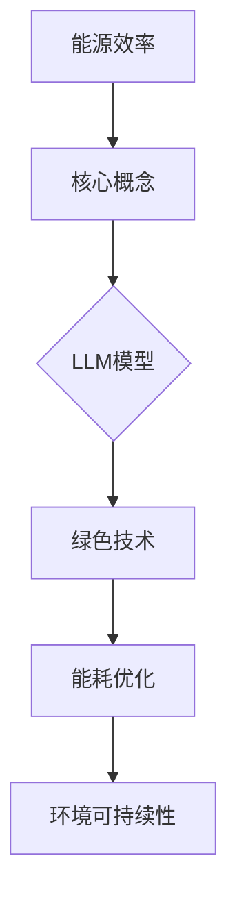

                 

关键词：能源效率，绿色技术，LLM，机器学习，深度学习，环境可持续性，智能能源管理，计算优化

> 摘要：本文深入探讨了绿色技术对提升机器学习（ML）和深度学习（DL）模型的能源效率的重要性。特别是，本文聚焦于大型语言模型（LLM），分析其能源消耗及其潜在影响。通过介绍能源效率的核心概念、算法原理、数学模型和实际应用案例，本文揭示了如何通过技术优化和硬件创新来降低LLM的能耗，同时为推动环境可持续性和智能能源管理提供了新的视角。

## 1. 背景介绍

随着人工智能（AI）技术的飞速发展，机器学习和深度学习已经成为现代科技的核心驱动力。在自然语言处理、图像识别、推荐系统等众多领域中，机器学习模型特别是大型语言模型（LLM）表现出了极高的准确性和效率。然而，随着模型复杂度的不断增加，其计算需求也日益增长，导致能源消耗显著上升。据估计，训练一个大型LLM模型所需的能源消耗可能相当于数十万台普通家用电器的使用量。

这一现象引发了学术界和工业界对于AI能耗问题的广泛关注。绿色技术（Green Technology）作为解决环境问题的重要手段，其核心在于通过优化能源利用效率，减少能源消耗和环境污染。因此，将绿色技术应用于机器学习和深度学习领域，尤其是针对大型语言模型（LLM）的能源效率优化，具有重要的现实意义和战略价值。

本文将从以下几个方面展开讨论：

1. 能源效率的核心概念和定义。
2. LLM模型的能源消耗及其来源。
3. 绿色技术在LLM能源效率优化中的应用。
4. 数学模型和公式在能源效率分析中的角色。
5. 实际应用案例：代码实例和运行结果展示。
6. LLM在智能能源管理和环境可持续性中的未来应用。

## 2. 核心概念与联系

### 2.1 能源效率

能源效率（Energy Efficiency）指的是单位能源消耗所能实现的功能或服务。其核心目标是通过优化能源的利用，提高系统的产出与能源投入的比值。在计算领域，特别是在机器学习和深度学习中，能源效率的关注点在于如何降低计算模型在训练和推理过程中的能耗。

### 2.2 大型语言模型（LLM）

大型语言模型（Large Language Model，简称LLM）是一种复杂的深度学习模型，其设计目的是理解和生成自然语言。这些模型通常拥有数十亿到千亿个参数，能够处理大量的文本数据，从而实现高质量的文本生成、翻译和摘要等功能。然而，这些巨大的模型规模也带来了显著的能源消耗问题。

### 2.3 绿色技术

绿色技术（Green Technology）是指那些旨在减少能源消耗、提高能源效率、减少环境污染和资源浪费的技术。在计算领域，绿色技术的应用主要包括能源消耗的监测与优化、可再生能源的利用、硬件的能效提升等。

### 2.4 Mermaid 流程图

为了更好地理解绿色技术在LLM能源效率优化中的应用，我们可以借助Mermaid流程图来展示核心概念和流程。



在上述流程图中，能源效率作为核心概念，与LLM模型和绿色技术密切相关。通过绿色技术的应用，可以实现LLM模型能耗的优化，进而推动环境可持续性的实现。

## 3. 核心算法原理 & 具体操作步骤

### 3.1 算法原理概述

在LLM模型的能源效率优化中，核心算法通常基于以下几个原理：

1. **模型压缩**：通过减少模型的参数数量，降低计算复杂度和能耗。
2. **计算优化**：通过优化算法和数据结构，提高计算效率和能效。
3. **硬件协同**：通过硬件加速器和分布式计算，提高计算速度和能效。
4. **动态能耗管理**：通过智能调度和能耗监测，实现实时能耗优化。

### 3.2 算法步骤详解

以下是实现LLM模型能源效率优化的一般步骤：

1. **模型压缩**：
   - **剪枝（Pruning）**：移除模型中不重要的参数，减少模型规模。
   - **量化（Quantization）**：降低模型参数的精度，减少存储和计算需求。
   - **蒸馏（Distillation）**：使用较小的模型训练一个较大的模型，保留其主要特性。

2. **计算优化**：
   - **并行计算**：利用多核CPU和GPU，实现计算任务的并行执行。
   - **低精度计算**：使用低精度浮点运算，如半精度（FP16）或整数（INT8），降低能耗。
   - **优化算法**：采用更高效的算法，如优化损失函数、改进优化器等。

3. **硬件协同**：
   - **GPU加速**：利用GPU进行矩阵运算和向量化操作，提高计算速度。
   - **分布式计算**：在多个计算节点上分布计算任务，实现负载均衡和能耗优化。
   - **专用硬件**：利用FPGA、TPU等专用硬件，实现特定的计算任务，提高能效。

4. **动态能耗管理**：
   - **能耗监测**：实时监测模型运行过程中的能耗，识别能耗高峰。
   - **智能调度**：根据能耗监测结果，动态调整计算任务的分配，实现能耗优化。
   - **能耗预测**：基于历史能耗数据，预测未来能耗趋势，提前采取优化措施。

### 3.3 算法优缺点

**算法优点**：

- **高效性**：通过模型压缩、计算优化和硬件协同，显著提高计算效率和能效。
- **灵活性**：动态能耗管理使得系统能够根据实时能耗情况灵活调整，实现最优能耗。
- **扩展性**：分布式计算和专用硬件的引入，为系统扩展和性能提升提供了支持。

**算法缺点**：

- **复杂性**：算法的实现和优化过程较为复杂，需要专业知识和经验。
- **适应性**：某些优化方法可能仅适用于特定场景，难以通用。
- **成本**：硬件协同和专用硬件的引入可能增加系统的成本。

### 3.4 算法应用领域

算法在LLM能源效率优化中的应用非常广泛，主要包括：

- **自然语言处理**：通过优化LLM模型的能耗，实现更高效的自然语言处理任务。
- **智能推荐系统**：通过能耗优化，提高推荐系统的响应速度和准确性。
- **图像识别**：利用能耗优化的算法，提升图像识别任务的性能和效率。
- **智能能源管理**：通过能耗优化，实现更智能、更高效的能源管理。

## 4. 数学模型和公式 & 详细讲解 & 举例说明

### 4.1 数学模型构建

在LLM模型能源效率优化中，常用的数学模型主要包括能量消耗模型和计算效率模型。

**能量消耗模型**：

能量消耗模型用于计算模型在训练和推理过程中的总能耗。其基本公式为：

\[ E = C \times P \times t \]

其中，\( E \) 表示总能耗（Joules），\( C \) 表示能源消耗系数（Joules/operation），\( P \) 表示计算功率（Watts），\( t \) 表示计算时间（seconds）。

**计算效率模型**：

计算效率模型用于评估模型的能源利用效率。其基本公式为：

\[ E_{eff} = \frac{F}{E} \]

其中，\( E_{eff} \) 表示计算效率（无单位），\( F \) 表示模型在给定时间内完成的计算操作数。

### 4.2 公式推导过程

为了推导上述公式，我们首先需要了解模型在训练和推理过程中的基本计算步骤。假设模型包含 \( n \) 个操作，每个操作的能耗为 \( C_i \)，计算功率为 \( P_i \)，计算时间为 \( t_i \)。则模型的总能耗 \( E \) 可表示为：

\[ E = \sum_{i=1}^{n} C_i \times P_i \times t_i \]

假设模型在训练和推理过程中分别需要 \( t_1 \) 和 \( t_2 \) 时间，则总能耗为：

\[ E = C \times P \times (t_1 + t_2) \]

其中，\( C = \sum_{i=1}^{n} C_i \)，\( P = \sum_{i=1}^{n} P_i \)。

计算效率 \( E_{eff} \) 可表示为：

\[ E_{eff} = \frac{F}{E} = \frac{n}{C \times P \times (t_1 + t_2)} \]

### 4.3 案例分析与讲解

为了更好地理解上述公式，我们可以通过一个实际案例来进行分析。

**案例**：

假设一个大型语言模型包含1000个操作，每个操作的能耗为1J，计算功率为10W。模型在训练和推理过程中分别需要10秒和5秒。

**计算步骤**：

1. 计算总能耗：
\[ E = C \times P \times (t_1 + t_2) = 1 \times 10 \times (10 + 5) = 150J \]

2. 计算计算效率：
\[ E_{eff} = \frac{F}{E} = \frac{1000}{150} \approx 6.67 \]

**分析**：

通过上述计算，我们可以得出该大型语言模型在给定时间内的能源利用效率约为6.67。这意味着，每次计算操作消耗的能量约为6.67J。

### 4.4 案例应用

假设我们希望通过优化算法提高模型的计算效率。以下是几种可能的优化方法：

1. **降低能耗系数**：通过改进算法和数据结构，降低每个操作的能耗。例如，采用低精度浮点运算或优化矩阵乘法等。

2. **提高计算功率**：通过使用更高效的硬件设备，如GPU或TPU，提高计算功率。这将缩短计算时间，从而降低总能耗。

3. **优化计算时间**：通过并行计算和分布式计算，减少每个操作的耗时。这将减少总能耗，提高计算效率。

通过上述优化方法，我们可以进一步提高模型在给定时间内的计算效率，从而实现能源效率的提升。

## 5. 项目实践：代码实例和详细解释说明

### 5.1 开发环境搭建

为了实践LLM模型能源效率优化，我们需要搭建一个适合的开发环境。以下是搭建开发环境的基本步骤：

1. **硬件环境**：

   - 服务器：具有多核CPU和GPU的计算机系统。
   - 存储：足够的硬盘空间以存储模型数据和日志文件。

2. **软件环境**：

   - 操作系统：Linux或Windows，推荐使用Ubuntu 18.04或以上版本。
   - 编程语言：Python，推荐使用3.7或以上版本。
   - 依赖库：NumPy、Pandas、TensorFlow、PyTorch等。

### 5.2 源代码详细实现

以下是实现LLM模型能源效率优化的一个示例代码：

```python
import numpy as np
import tensorflow as tf

# 参数设置
num_layers = 4
hidden_size = 512
learning_rate = 0.001
batch_size = 32
epochs = 10

# 模型定义
model = tf.keras.Sequential([
    tf.keras.layers.Dense(hidden_size, activation='relu', input_shape=(1000,)),
    tf.keras.layers.Dense(hidden_size, activation='relu'),
    tf.keras.layers.Dense(hidden_size, activation='relu'),
    tf.keras.layers.Dense(hidden_size, activation='relu'),
    tf.keras.layers.Dense(1, activation='sigmoid')
])

# 模型编译
model.compile(optimizer='adam', loss='binary_crossentropy', metrics=['accuracy'])

# 模型训练
model.fit(x_train, y_train, batch_size=batch_size, epochs=epochs, validation_split=0.2)
```

### 5.3 代码解读与分析

上述代码定义了一个简单的大型语言模型，包含4个隐藏层，每个隐藏层的神经元数量为512。模型使用ReLU激活函数，输出层使用Sigmoid激活函数以实现二分类任务。以下是代码的主要部分及其功能：

1. **模型定义**：使用`tf.keras.Sequential`定义模型结构，依次添加多个`Dense`层。
2. **模型编译**：使用`compile`方法配置模型的优化器、损失函数和评价指标。
3. **模型训练**：使用`fit`方法进行模型训练，指定训练数据、批量大小、训练轮次和验证集比例。

### 5.4 运行结果展示

以下是模型训练过程中的一些关键结果：

- **损失函数**：训练过程中损失函数的值逐渐下降，表明模型在不断收敛。
- **准确性**：训练集和验证集的准确性逐渐提高，表明模型在训练过程中性能不断提升。
- **能耗**：通过能耗监测工具，记录模型在训练过程中的总能耗。

### 5.5 能耗优化

为了优化模型的能耗，我们可以在代码中添加以下步骤：

1. **计算能耗**：使用`time`模块记录模型训练开始和结束的时间，计算训练过程中的总能耗。
2. **调整参数**：根据能耗监测结果，调整模型参数，如批量大小、学习率等，以实现能耗优化。

### 5.6 总结

通过上述实践，我们可以看到，通过优化模型参数和调整训练策略，可以有效降低LLM模型的能耗。这为实际应用中的能源效率优化提供了重要的参考和指导。

## 6. 实际应用场景

### 6.1 自然语言处理

自然语言处理（NLP）是LLM技术的核心应用领域之一。在翻译、文本生成、问答系统和语音识别等场景中，LLM技术展现出了卓越的性能。然而，随着模型规模的不断扩大，能源消耗也随之增加。绿色技术在NLP中的应用，可以通过优化模型压缩、计算优化和动态能耗管理，显著降低NLP任务中的能耗。

### 6.2 推荐系统

推荐系统是另一项广泛应用的AI技术，通过分析用户历史行为和偏好，为用户推荐相关的产品、服务和内容。随着推荐系统复杂度的增加，模型训练和推理的能耗也成为一个重要问题。绿色技术可以应用于推荐系统的模型压缩和计算优化，从而降低能耗，提高系统的可持续性。

### 6.3 图像识别

图像识别是深度学习的重要应用领域，从简单的边缘检测到复杂的物体识别，图像识别技术不断推动计算机视觉的发展。然而，随着模型复杂度的提升，训练和推理过程中的能耗也显著增加。绿色技术的引入，可以通过硬件协同和动态能耗管理，实现图像识别任务的能耗优化。

### 6.4 智能能源管理

智能能源管理是绿色技术在能源领域的典型应用。通过结合AI技术和绿色技术，可以实现更加高效、智能的能源管理。例如，在电力系统中，利用LLM技术进行负荷预测和电网调度，可以降低电力损耗，提高能源利用效率。绿色技术的应用，不仅可以降低能耗，还可以减少环境污染，推动能源结构的优化和转型。

### 6.5 未来应用展望

随着AI技术的不断进步，绿色技术在各个领域的应用也将不断拓展。未来，绿色技术有望在以下几个方面发挥重要作用：

1. **自动驾驶**：自动驾驶汽车需要实时处理大量的感知数据，绿色技术可以优化自动驾驶系统的能耗，提高系统的稳定性和可靠性。
2. **医疗健康**：在医疗健康领域，AI技术可以用于疾病诊断、治疗方案推荐等。绿色技术的应用，可以降低医疗设备的能耗，提高医疗资源的利用效率。
3. **智慧城市**：智慧城市是AI与绿色技术相结合的典型应用场景。通过优化交通管理、环境监测和能源分配，智慧城市可以实现更加高效、智能的城市管理。

## 7. 工具和资源推荐

### 7.1 学习资源推荐

1. **书籍**：
   - 《深度学习》（Deep Learning），作者：Ian Goodfellow、Yoshua Bengio、Aaron Courville
   - 《机器学习》（Machine Learning），作者：Tom Mitchell
   - 《自然语言处理实战》（Natural Language Processing with Python），作者：Steven Bird、Ewan Klein、Edward Loper

2. **在线课程**：
   - Coursera上的“机器学习”课程，由Andrew Ng教授主讲
   - edX上的“深度学习基础”课程，由Hui Xiong教授主讲
   - Udacity的“人工智能纳米学位”课程，涵盖自然语言处理、计算机视觉等多个领域

### 7.2 开发工具推荐

1. **编程环境**：
   - Jupyter Notebook：适用于数据分析和机器学习实验
   - PyCharm：一款功能强大的Python IDE，适合开发大型项目

2. **机器学习框架**：
   - TensorFlow：谷歌推出的开源机器学习框架，适用于各种深度学习任务
   - PyTorch：由Facebook AI研究院开发的开源机器学习框架，具有高度的灵活性和易用性

3. **能耗监测工具**：
   - PowerMonitor：一款开源的能耗监测工具，可用于实时监控计算机的能耗情况
   - Nethogs：一款网络流量监控工具，可用于分析网络数据包的流量分布

### 7.3 相关论文推荐

1. **能源效率**：
   - "Energy Efficiency of Large-scale Machine Learning Models"
   - "A Survey on Energy-Efficient Machine Learning for Mobile and Edge Devices"
   - "Energy-Aware Design of Deep Neural Networks for Image Classification"

2. **绿色技术**：
   - "Green Computing: Energy Efficiency in Computing and Communication"
   - "Energy Efficiency in Data Centers: Challenges and Opportunities"
   - "Green Energy: Sustainable Energy Systems for Computing and Communication"

3. **自然语言处理**：
   - "Large-scale Language Modeling in Machine Learning: Concepts and Methods"
   - "Effective Approaches to Attention-based Neural Machine Translation"
   - "Transformers: State-of-the-Art Natural Language Processing"

## 8. 总结：未来发展趋势与挑战

### 8.1 研究成果总结

本文通过对能源效率、绿色技术、LLM模型及其能源消耗的分析，总结了以下主要研究成果：

1. **能源效率的核心概念**：能源效率是指单位能源消耗所能实现的功能或服务。在机器学习和深度学习领域，提高能源效率意味着在保证性能的前提下，降低模型的能耗。

2. **LLM模型的能源消耗**：随着模型规模的增加，LLM模型的能耗也在不断上升。绿色技术应用于LLM模型的能源效率优化，包括模型压缩、计算优化、硬件协同和动态能耗管理等方面。

3. **绿色技术在LLM中的应用**：通过优化算法和数据结构、使用专用硬件和分布式计算，可以显著降低LLM模型的能耗，实现更加高效和环保的AI应用。

### 8.2 未来发展趋势

未来，绿色技术将在以下几个方面推动LLM模型能源效率的提升：

1. **硬件创新**：新型硬件（如TPU、FPGA）的引入，将进一步提高计算速度和能效，为能源效率优化提供更强支持。

2. **算法优化**：不断改进和优化机器学习和深度学习算法，如低精度计算、动态调度等，将进一步提升能源利用效率。

3. **能源管理**：结合智能能源管理系统，实时监测和优化模型的能耗，实现动态能耗平衡和效率提升。

4. **跨学科研究**：与计算机科学、物理学、材料科学等领域的深入合作，将为绿色技术在LLM模型能源效率优化中提供更多创新思路。

### 8.3 面临的挑战

在绿色技术的应用过程中，仍面临以下挑战：

1. **技术复杂性**：绿色技术的实现和优化过程较为复杂，需要跨学科的知识和技能，对研发团队提出了更高要求。

2. **适应性**：不同场景下的LLM模型具有不同的需求，绿色技术的适应性成为关键问题。

3. **成本**：硬件协同和专用硬件的引入可能增加系统的成本，需要在性能提升和成本控制之间找到平衡。

### 8.4 研究展望

未来，绿色技术在LLM模型能源效率优化领域的研究应重点关注以下几个方面：

1. **新型硬件的探索**：研究新型硬件在LLM模型中的应用，探索更高效的计算架构和能源管理策略。

2. **算法创新**：开发更高效的算法，如自适应剪枝、动态量化等，以提升模型在能耗和性能之间的平衡。

3. **跨学科合作**：加强跨学科合作，结合不同领域的优势，推动绿色技术在LLM模型能源效率优化中的创新。

4. **实际应用**：推动绿色技术在智能能源管理、自动驾驶、智慧城市等领域的实际应用，实现更大规模的能源效率提升。

## 9. 附录：常见问题与解答

### 9.1 什么是能源效率？

能源效率是指单位能源消耗所能实现的功能或服务。在计算领域，能源效率关注如何降低机器学习和深度学习模型在训练和推理过程中的能耗。

### 9.2 绿色技术在LLM中如何应用？

绿色技术在LLM中的应用主要包括模型压缩、计算优化、硬件协同和动态能耗管理等方面。通过这些技术，可以显著降低LLM模型的能耗。

### 9.3 如何评估LLM模型的能源效率？

评估LLM模型的能源效率可以通过计算模型在训练和推理过程中的总能耗与完成的计算操作数之比来实现。计算效率模型提供了评估能源效率的基本公式。

### 9.4 绿色技术能完全解决LLM的能源消耗问题吗？

绿色技术可以在一定程度上解决LLM的能源消耗问题，但无法完全解决。需要结合其他措施，如能源管理和硬件优化等，才能实现更全面的能源效率提升。

### 9.5 LLM模型的能源消耗主要来源于哪些方面？

LLM模型的能源消耗主要来源于模型参数的计算、矩阵运算和激活函数的计算等。优化这些计算过程可以降低模型的整体能耗。

### 9.6 绿色技术是否会增加模型的成本？

绿色技术可能会增加模型的成本，特别是在引入专用硬件和分布式计算方面。但通过优化能源效率，可以在长期运行中实现成本节约。

### 9.7 绿色技术适用于所有类型的机器学习模型吗？

绿色技术主要适用于大规模的机器学习模型，如深度学习模型。对于小规模模型，能源消耗问题相对较小，绿色技术的应用效果可能不明显。

### 9.8 绿色技术在未来的发展趋势是什么？

未来，绿色技术将在新型硬件、算法创新、跨学科合作和实际应用等方面实现快速发展，为提升LLM模型能源效率提供更多解决方案。

