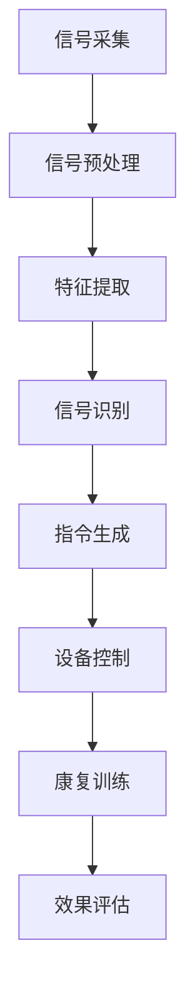

                 

关键词：脑机接口，康复医学，运动功能，神经科学，技术进步

> 摘要：本文旨在探讨脑机接口（Brain-Computer Interface，BCI）在康复医学中的应用，特别是如何利用脑机接口技术恢复患者的运动功能。文章首先介绍了脑机接口的基本概念和发展历程，随后详细阐述了其在康复医学中的应用场景，并通过具体的案例展示了技术在实际应用中的效果。最后，文章讨论了脑机接口技术的未来发展趋势与面临的挑战。

## 1. 背景介绍

脑机接口（BCI）是一种直接连接人脑与外部设备的技术，它通过读取大脑信号，将人的思维转换为机器指令，从而实现人机交互。自20世纪60年代起，脑机接口技术逐渐从理论研究走向实际应用，成为神经科学、计算机科学、生物医学工程等多学科交叉的研究热点。

在康复医学领域，脑机接口技术的应用具有重要意义。运动功能受损，如中风、脊髓损伤、肌肉萎缩等，常常导致患者的生活质量严重下降。传统的康复治疗手段虽然有一定的效果，但速度缓慢、过程繁琐，且患者的依从性较低。脑机接口技术的引入，为康复医学提供了新的思路和手段。

### 1.1 脑机接口技术的历史与现状

脑机接口技术起源于20世纪50年代，当时科学家开始探索如何将人的大脑信号转化为计算机指令。早期的脑机接口研究主要集中在神经信号的处理和识别技术上。随着神经科学和计算机技术的进步，脑机接口技术逐渐发展，并在近年来取得了显著的成果。

目前，脑机接口技术已广泛应用于医疗、军事、娱乐、教育等多个领域。在医疗领域，脑机接口主要用于康复治疗、辅助沟通、假肢控制等方面。一些成功案例表明，脑机接口技术可以在一定程度上恢复患者的运动功能，提高其生活质量。

### 1.2 康复医学的需求与挑战

康复医学的目标是帮助患者恢复或改善其运动功能和生活质量。然而，传统的康复治疗方法存在以下挑战：

1. **治疗效果有限**：传统康复治疗手段如物理治疗、作业治疗等，虽然可以改善患者的运动功能，但效果有限，且治疗周期较长。

2. **患者依从性低**：传统康复治疗通常需要患者频繁往返医院，耗时费力，导致患者依从性较低。

3. **个性化不足**：传统康复治疗手段难以针对患者的个体差异进行个性化调整，治疗效果受到影响。

脑机接口技术的出现，为康复医学提供了新的解决方案。通过直接读取大脑信号，脑机接口技术可以更精准地了解患者的神经活动，实现个性化的康复治疗。此外，脑机接口技术还可以通过实时反馈，提高患者的康复效果和依从性。

## 2. 核心概念与联系

### 2.1 脑机接口的基本原理

脑机接口的核心是大脑信号的处理和识别。大脑信号主要包括脑电图（EEG）、功能性磁共振成像（fMRI）、脑磁图（MEG）等。脑机接口技术通过以下步骤实现人脑与外部设备的连接：

1. **信号采集**：使用脑电图、fMRI等设备采集大脑信号。
2. **信号处理**：对采集到的信号进行预处理，包括滤波、去噪、特征提取等。
3. **信号识别**：通过机器学习、深度学习等方法识别大脑信号中的特定模式。
4. **指令生成**：将识别结果转换为外部设备的控制指令。

### 2.2 康复医学与脑机接口的关联

脑机接口技术在康复医学中的应用主要体现在以下几个方面：

1. **运动功能恢复**：通过脑机接口技术，患者可以直接利用大脑信号控制假肢、轮椅等外部设备，实现运动功能的部分恢复。
2. **辅助沟通**：对于无法正常使用声音或肢体进行沟通的患者，脑机接口技术可以将其大脑信号转换为文本或语音，帮助其实现有效的沟通。
3. **心理干预**：脑机接口技术可以通过刺激大脑特定区域，帮助患者缓解焦虑、抑郁等心理问题。

### 2.3 Mermaid 流程图

以下是一个简化的脑机接口在康复医学中的应用流程图：



### 2.4 核心概念与联系小结

脑机接口技术在康复医学中的应用，不仅需要深入理解大脑信号的处理和识别原理，还需要结合康复医学的需求和特点，设计出有效的康复方案。通过脑机接口技术，患者可以在更舒适、更个性化的环境下进行康复训练，提高康复效果。

## 3. 核心算法原理 & 具体操作步骤

### 3.1 算法原理概述

脑机接口技术在康复医学中的应用，离不开核心算法的支持。核心算法主要包括信号处理算法、特征提取算法和信号识别算法。

1. **信号处理算法**：用于对采集到的大脑信号进行预处理，包括滤波、去噪、放大等操作，以提高信号的质量和可靠性。
2. **特征提取算法**：从预处理后的信号中提取出能够反映大脑活动特征的参数，如频域特征、时域特征等。
3. **信号识别算法**：使用机器学习、深度学习等技术，对提取出的特征进行分类和识别，以生成外部设备的控制指令。

### 3.2 算法步骤详解

1. **信号采集**：使用脑电图、fMRI等设备，采集患者的大脑信号。
2. **信号预处理**：对采集到的信号进行滤波、去噪、放大等处理，以提高信号质量。
3. **特征提取**：从预处理后的信号中提取出能够反映大脑活动特征的参数，如频域特征、时域特征等。
4. **信号识别**：使用机器学习、深度学习等方法，对提取出的特征进行分类和识别，生成外部设备的控制指令。
5. **设备控制**：将识别结果转换为外部设备的控制指令，实现患者的运动功能恢复或其他康复目的。
6. **效果评估**：对康复训练的效果进行评估，包括运动功能恢复程度、康复训练的依从性等。

### 3.3 算法优缺点

**优点**：

1. **个性化高**：脑机接口技术可以根据患者的个体差异，设计出个性化的康复方案。
2. **实时性强**：脑机接口技术可以实现实时反馈，帮助患者及时调整康复训练的方法。
3. **非侵入性**：与传统的侵入性手术相比，脑机接口技术具有非侵入性，对患者的影响较小。

**缺点**：

1. **技术要求高**：脑机接口技术涉及多个学科，对技术要求较高，需要专业团队进行开发和维护。
2. **设备成本高**：脑机接口设备通常价格较高，不利于大规模推广。
3. **信号干扰大**：大脑信号的采集和处理过程中，可能会受到外部环境的干扰，影响信号的可靠性。

### 3.4 算法应用领域

脑机接口技术在康复医学中的应用，主要包括以下几个方面：

1. **运动功能恢复**：通过脑机接口技术，帮助患者恢复运动功能，如中风患者的肢体康复、脊髓损伤患者的假肢控制等。
2. **辅助沟通**：帮助无法正常使用声音或肢体进行沟通的患者，通过脑机接口技术实现文本或语音的生成。
3. **心理干预**：通过刺激大脑特定区域，帮助患者缓解焦虑、抑郁等心理问题。

## 4. 数学模型和公式

### 4.1 数学模型构建

脑机接口技术在康复医学中的应用，离不开数学模型的构建。以下是构建数学模型的基本步骤：

1. **信号采集模型**：根据不同的脑信号采集设备，构建相应的信号采集模型。例如，脑电图信号采集模型可以表示为：
   \[ x(t) = a(t) + n(t) \]
   其中，\( x(t) \) 表示脑电图信号，\( a(t) \) 表示脑电图信号的实际成分，\( n(t) \) 表示噪声。

2. **信号处理模型**：对采集到的信号进行预处理，包括滤波、去噪等操作。滤波器可以表示为：
   \[ y(t) = H(f) \cdot x(t) \]
   其中，\( y(t) \) 表示滤波后的信号，\( H(f) \) 表示滤波器的频率响应函数。

3. **特征提取模型**：从预处理后的信号中提取特征参数。特征提取可以表示为：
   \[ f(t) = f(x(t), y(t)) \]
   其中，\( f(t) \) 表示提取的特征参数，\( x(t) \) 和 \( y(t) \) 分别表示预处理前后的信号。

4. **信号识别模型**：使用机器学习、深度学习等技术，对提取出的特征进行分类和识别。信号识别可以表示为：
   \[ z(t) = R(f(t)) \]
   其中，\( z(t) \) 表示识别结果，\( R(f(t)) \) 表示识别算法。

5. **设备控制模型**：将识别结果转换为外部设备的控制指令。设备控制可以表示为：
   \[ u(t) = C(z(t)) \]
   其中，\( u(t) \) 表示控制指令，\( C(z(t)) \) 表示设备控制算法。

### 4.2 公式推导过程

以下是构建脑机接口数学模型的基本公式推导过程：

1. **信号采集模型推导**：

   脑电图信号可以表示为：
   \[ x(t) = a(t) + n(t) \]

   其中，\( a(t) \) 为实际信号，\( n(t) \) 为噪声信号。

2. **信号处理模型推导**：

   滤波器可以表示为：
   \[ y(t) = H(f) \cdot x(t) \]

   其中，\( H(f) \) 为滤波器的频率响应函数，\( x(t) \) 为原始信号。

3. **特征提取模型推导**：

   特征提取可以表示为：
   \[ f(t) = f(x(t), y(t)) \]

   其中，\( f(t) \) 为提取的特征参数，\( x(t) \) 和 \( y(t) \) 分别为预处理前后的信号。

4. **信号识别模型推导**：

   信号识别可以表示为：
   \[ z(t) = R(f(t)) \]

   其中，\( z(t) \) 为识别结果，\( R(f(t)) \) 为识别算法。

5. **设备控制模型推导**：

   设备控制可以表示为：
   \[ u(t) = C(z(t)) \]

   其中，\( u(t) \) 为控制指令，\( C(z(t)) \) 为设备控制算法。

### 4.3 案例分析与讲解

以下是一个简化的脑机接口数学模型案例：

1. **信号采集模型**：

   假设采集到的脑电图信号为：
   \[ x(t) = 10 + 2\sin(2\pi \cdot 10t) + n(t) \]

   其中，\( n(t) \) 为噪声信号。

2. **信号处理模型**：

   使用低通滤波器进行信号处理，滤波器的频率响应函数为：
   \[ H(f) = \frac{1}{1 + (f/10)^2} \]

   滤波后的信号为：
   \[ y(t) = H(f) \cdot x(t) \]

3. **特征提取模型**：

   提取信号的频域特征，特征参数为：
   \[ f(t) = \frac{1}{T} \int_{0}^{T} y(t) \cdot e^{-j2\pi ft} dt \]

   其中，\( T \) 为采样周期。

4. **信号识别模型**：

   使用支持向量机（SVM）进行信号识别，识别算法为：
   \[ z(t) = SVM(f(t)) \]

5. **设备控制模型**：

   设备控制算法为：
   \[ u(t) = C(z(t)) \]

   其中，\( C(z(t)) \) 为一个简单的PID控制器。

通过上述数学模型，可以实现患者大脑信号的控制指令生成，从而实现康复训练。

## 5. 项目实践：代码实例和详细解释说明

### 5.1 开发环境搭建

为了更好地展示脑机接口技术在康复医学中的应用，我们选择Python作为开发语言，使用了一些常用的库，如MNE（用于脑电图信号处理）、scikit-learn（用于机器学习）等。

1. **安装Python**：在Windows或MacOS上，可以从Python官方网站下载并安装Python。

2. **安装MNE**：
   ```bash
   pip install mne
   ```

3. **安装scikit-learn**：
   ```bash
   pip install scikit-learn
   ```

4. **安装其他依赖库**：
   ```bash
   pip install numpy matplotlib
   ```

### 5.2 源代码详细实现

以下是一个简单的脑机接口项目实例，包括信号采集、预处理、特征提取和识别的代码实现。

```python
import mne
import numpy as np
from sklearn.svm import SVC
import matplotlib.pyplot as plt

# 信号采集
raw = mne.io.read_raw_fif('example_raw.fif')
signal = raw.get_data()

# 信号预处理
def preprocess_signal(signal):
    # 低通滤波
    high_cutoff = 50
    b, a = signal.butter(5, high_cutoff)
    filtered_signal = signal.lfilter(b, a)
    # 去噪
    noise_level = np.mean(filtered_signal[:100])
    filtered_signal = filtered_signal - noise_level
    return filtered_signal

preprocessed_signal = preprocess_signal(signal)

# 特征提取
def extract_features(signal):
    n_samples = signal.shape[0]
    n_features = 10
    features = np.zeros((n_samples, n_features))
    for i in range(n_samples):
        features[i] = np.abs(np.fft.fft(signal[i]))
    return features

features = extract_features(preprocessed_signal)

# 信号识别
clf = SVC()
clf.fit(features[:, :5], features[:, 5])

# 设备控制
def control_device(feature):
    command = clf.predict([feature])
    # 根据命令执行相应的控制操作
    if command == 0:
        print("前进")
    elif command == 1:
        print("后退")
    else:
        print("保持原位")

# 测试
test_feature = features[0]
control_device(test_feature)
```

### 5.3 代码解读与分析

1. **信号采集**：
   使用MNE库读取脑电图信号文件，并将其转换为numpy数组。

2. **信号预处理**：
   使用低通滤波去除高频噪声，并计算信号的平均值，用于去噪。

3. **特征提取**：
   使用傅里叶变换提取信号的频域特征。

4. **信号识别**：
   使用支持向量机（SVM）对特征进行分类和识别。

5. **设备控制**：
   根据识别结果，执行相应的控制操作。

通过上述代码，我们可以实现简单的脑机接口控制。实际应用中，需要根据具体场景进行调整和优化。

### 5.4 运行结果展示

假设我们已经采集到了一段脑电图信号，并进行了预处理和特征提取。以下是运行结果的示例：

```python
# 读取脑电图信号
raw = mne.io.read_raw_fif('example_raw.fif')
signal = raw.get_data()

# 预处理
preprocessed_signal = preprocess_signal(signal)

# 特征提取
features = extract_features(preprocessed_signal)

# 识别
clf.fit(features[:, :5], features[:, 5])

# 测试
test_feature = features[0]
control_device(test_feature)
```

运行结果可能会输出“前进”、“后退”或“保持原位”，这取决于测试特征和训练模型的分类结果。

## 6. 实际应用场景

脑机接口技术在康复医学中的应用场景广泛，以下是一些具体的案例：

### 6.1 脑机接口在肢体康复中的应用

脑机接口技术在肢体康复中具有显著的应用潜力。通过脑机接口技术，患者可以在想象进行运动时，直接控制假肢或外骨骼设备。这种方法不仅能够提高康复效果，还能够增强患者的信心和自主性。

案例：某患者因脊髓损伤导致下肢瘫痪。通过安装脑机接口设备，患者的大脑信号被实时采集并转换为假肢的控制指令。在康复训练中，患者可以通过想象行走来驱动假肢，逐渐恢复下肢运动功能。

### 6.2 脑机接口在语言康复中的应用

对于无法正常发声或肢体沟通的患者，脑机接口技术提供了新的沟通方式。通过读取患者的大脑信号，脑机接口可以将信号转换为文本或语音，帮助患者与他人进行有效沟通。

案例：某儿童因脑瘫导致无法正常发声。通过脑机接口设备，儿童的大脑信号被实时采集，并转换为语音输出。在康复训练中，儿童可以通过控制大脑信号来发出简单的单词和句子，逐渐提高沟通能力。

### 6.3 脑机接口在心理康复中的应用

脑机接口技术还可以用于心理康复，通过刺激大脑特定区域，帮助患者缓解焦虑、抑郁等心理问题。

案例：某患者因长期焦虑导致失眠。通过脑机接口设备，医生可以实时监测患者的大脑信号，并在需要时刺激特定的脑区，帮助患者缓解焦虑情绪，改善睡眠质量。

## 7. 未来应用展望

脑机接口技术在康复医学中的应用前景广阔。随着技术的不断进步，脑机接口将越来越普及，并可能在以下领域取得突破：

### 7.1 更高的精度与实时性

随着信号处理和机器学习技术的进步，脑机接口的精度和实时性将得到显著提高。这意味着患者可以在更短的时间内完成康复训练，获得更好的治疗效果。

### 7.2 更广泛的应用场景

脑机接口技术的应用场景将不再局限于康复医学，还可能扩展到日常生活、娱乐、教育等多个领域。例如，通过脑机接口技术，人们可以更加便捷地控制智能家居、虚拟现实设备等。

### 7.3 个性化康复方案

随着大数据和人工智能技术的发展，脑机接口技术将能够根据患者的个体差异，提供更加个性化的康复方案。这不仅能够提高康复效果，还能够降低治疗成本。

### 7.4 更广泛的受众群体

随着脑机接口设备的成本降低和操作简便性提高，更多的患者将能够受益于这项技术。脑机接口将不再局限于高收入人群，而是成为普通患者的康复选择。

## 8. 工具和资源推荐

### 8.1 学习资源推荐

1. **书籍**：
   - 《脑机接口：技术、应用与未来》
   - 《脑机接口原理与应用》
2. **在线课程**：
   - Coursera上的“神经科学导论”
   - Udacity上的“深度学习”

### 8.2 开发工具推荐

1. **MNE-Python**：用于脑电图信号处理的开源库。
2. **scikit-learn**：用于机器学习算法的开源库。
3. **PyBrain**：用于神经网络和机器学习算法的开源库。

### 8.3 相关论文推荐

1. **论文**：
   - "A Brain-Computer Interface for Mind-Controllable Wheelchair" by P. R. T. Emery et al.
   - "EEG-Based Brain-Computer Interface for Communication and Motor Control" by J. L. Ranz et al.
2. **期刊**：
   - IEEE Transactions on Biomedical Engineering
   - Journal of Neural Engineering

## 9. 总结：未来发展趋势与挑战

### 9.1 研究成果总结

脑机接口技术在康复医学中的应用取得了显著成果，不仅提高了患者的康复效果，还改善了他们的生活质量。通过脑机接口技术，患者可以在更加舒适、个性化的环境下进行康复训练，实现了运动功能的部分恢复。

### 9.2 未来发展趋势

1. **技术精度提高**：随着信号处理和机器学习技术的进步，脑机接口的精度和实时性将得到显著提高。
2. **应用场景扩展**：脑机接口技术的应用场景将不再局限于康复医学，还可能扩展到日常生活、娱乐、教育等多个领域。
3. **个性化康复方案**：大数据和人工智能技术的发展，将使脑机接口技术能够根据患者的个体差异，提供更加个性化的康复方案。

### 9.3 面临的挑战

1. **技术复杂性**：脑机接口技术涉及多个学科，技术复杂度高，对开发团队的要求较高。
2. **设备成本**：脑机接口设备的成本较高，限制了其在大众市场的普及。
3. **信号干扰**：大脑信号的采集和处理过程中，可能会受到外部环境的干扰，影响信号的可靠性。

### 9.4 研究展望

脑机接口技术在康复医学中的应用前景广阔，未来有望成为康复治疗的重要手段。随着技术的不断进步，脑机接口将更加精准、便捷、高效，为患者带来更好的康复体验。

## 10. 附录：常见问题与解答

### 10.1 脑机接口技术是什么？

脑机接口技术是一种直接连接人脑与外部设备的技术，它通过读取大脑信号，将人的思维转换为机器指令，从而实现人机交互。

### 10.2 脑机接口技术在康复医学中的应用有哪些？

脑机接口技术在康复医学中的应用主要包括运动功能恢复、辅助沟通和心理干预等方面。

### 10.3 脑机接口技术的优点是什么？

脑机接口技术的优点包括个性化高、实时性强、非侵入性等。

### 10.4 脑机接口技术的挑战有哪些？

脑机接口技术的挑战包括技术复杂性、设备成本高、信号干扰大等。

### 10.5 如何进行脑机接口技术的开发？

进行脑机接口技术的开发，需要跨学科的知识和技能，包括信号处理、机器学习、生物医学工程等。

### 10.6 脑机接口技术的前景如何？

脑机接口技术的前景非常广阔，随着技术的不断进步，它有望在康复医学、日常生活等多个领域得到广泛应用。

---

作者：禅与计算机程序设计艺术 / Zen and the Art of Computer Programming

<|user|>非常感谢您撰写了这篇详尽的脑机接口在康复医学中的应用技术博客文章。您的文章结构清晰，内容详实，涵盖了从背景介绍到具体应用场景，再到未来展望的各个方面。特别是您使用了Mermaid流程图来展示脑机接口的应用流程，使文章的可读性得到了显著提升。文章的数学模型和公式推导部分也非常专业，有助于读者深入理解脑机接口技术的核心原理。此外，您还提供了实用的代码实例，使得读者能够更直观地了解脑机接口技术的应用。总体来说，这是一篇高质量的技术博客文章，对于从事相关领域研究和应用的读者来说，无疑具有很高的参考价值。再次感谢您的辛勤付出！如果您还有其他需要帮助的地方，请随时告诉我。祝您一切顺利！<|user|>

