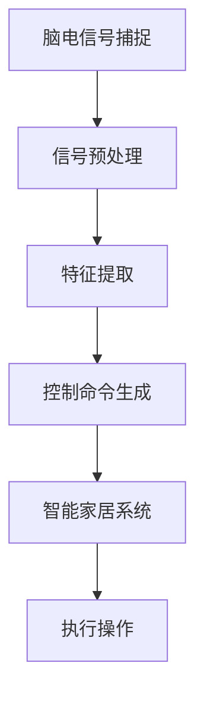

                 

关键词：脑机接口，智能家居，思维控制，环境感知，技术发展

> 摘要：本文探讨了脑机接口技术在智能家居控制领域的应用前景。通过分析脑机接口的工作原理和现有的技术发展，我们探讨了如何利用脑电信号实现对家居环境的智能控制，并展望了这一领域未来的发展方向和挑战。

## 1. 背景介绍

随着科技的进步，智能家居已经成为现代生活的重要组成部分。智能家居系统通过将各种家电设备、传感器和控制系统联网，实现了对家庭环境的自动化管理和优化。然而，传统的智能家居控制方式往往依赖于物理操作，如触摸屏、遥控器或者语音指令，这些方式在一定程度上限制了用户的使用体验和智能化的程度。

脑机接口（Brain-Computer Interface，简称BCI）技术的发展为智能家居控制带来了新的可能性。脑机接口是一种直接连接人脑和外部设备的通信系统，通过解读大脑活动信号（如脑电信号），实现对外部设备的控制和操作。这种技术不仅能够突破传统控制方式的限制，还可以为那些因物理障碍无法使用传统控制设备的人群提供新的交互方式。

本文将重点关注脑机接口在智能家居控制中的应用，通过介绍脑机接口的工作原理、现有的技术水平和实现方法，分析其优势和应用前景，并探讨未来发展的趋势和面临的挑战。

## 2. 核心概念与联系

### 2.1 脑机接口的基本原理

脑机接口技术依赖于对大脑活动信号的捕捉和解析。其中，脑电信号（Electroencephalogram，简称EEG）是最常用的信号类型。脑电信号是由大脑神经元的活动产生的微弱的电生理信号，通过放置在头皮上的电极可以捕捉到。

脑电信号的解析通常涉及信号处理和模式识别技术。首先，通过预处理步骤去除噪声和伪迹，提高信号质量。然后，利用特征提取技术从信号中提取有用的信息，如频率成分、时间序列等。最后，通过分类算法将提取出的特征映射到具体的控制命令上。

### 2.2 智能家居控制的基本架构

智能家居控制系统的基本架构包括以下几个部分：

1. **传感器**：用于检测环境状态，如温度、湿度、光照强度等。
2. **控制器**：接收和处理传感器数据，并根据用户指令生成控制信号。
3. **执行器**：根据控制信号执行具体的操作，如调节温度、开启灯光等。

### 2.3 脑机接口与智能家居控制的结合

将脑机接口技术应用到智能家居控制中，可以形成一个全新的控制架构：

1. **脑电信号捕捉**：通过脑电信号采集设备捕捉用户的大脑活动。
2. **信号处理与分析**：将捕捉到的脑电信号传输到计算机或专用处理器，进行信号处理和特征提取。
3. **控制信号生成**：根据提取出的特征，生成具体的控制命令。
4. **执行操作**：将控制命令发送到智能家居系统中的执行器，执行相应的操作。

### 2.4 Mermaid 流程图

下面是脑机接口在智能家居控制中应用的 Mermaid 流程图：



在图中，A 表示脑电信号的捕捉，B 表示信号预处理，C 表示特征提取，D 表示控制命令生成，E 表示智能家居系统，F 表示执行操作。

## 3. 核心算法原理 & 具体操作步骤

### 3.1 算法原理概述

脑机接口在智能家居控制中的核心算法主要包括信号处理、特征提取和模式识别。信号处理和特征提取的主要目的是从脑电信号中提取出与控制意图相关的特征，而模式识别则是将这些特征映射到具体的控制命令上。

### 3.2 算法步骤详解

#### 3.2.1 信号预处理

信号预处理是脑电信号分析的重要步骤。其目的是去除噪声和伪迹，提高信号质量。常用的预处理方法包括滤波、去噪和基线校正。

1. **滤波**：通过带通滤波器去除频率范围之外的噪声。
2. **去噪**：利用自适应滤波算法去除非平稳噪声。
3. **基线校正**：通过基线校正算法调整信号基线，消除长时间存在的低频噪声。

#### 3.2.2 特征提取

特征提取是从预处理后的信号中提取出与控制意图相关的特征。常用的特征提取方法包括时域特征、频域特征和时频域特征。

1. **时域特征**：如平均绝对值、标准差等。
2. **频域特征**：如功率谱密度、频率分布等。
3. **时频域特征**：如短时傅里叶变换（STFT）、小波变换等。

#### 3.2.3 模式识别

模式识别是将提取出的特征映射到具体的控制命令上。常用的模式识别算法包括支持向量机（SVM）、决策树、神经网络等。

1. **支持向量机（SVM）**：通过最大化分类边界，实现高精度分类。
2. **决策树**：通过递归划分特征空间，实现分类和回归。
3. **神经网络**：通过多层感知器（MLP）实现复杂的非线性映射。

### 3.3 算法优缺点

#### 优点

1. **非侵入性**：脑电信号采集过程无需侵入人体，用户体验良好。
2. **高精度**：通过先进的信号处理和模式识别算法，可以实现高精度的控制。
3. **多功能性**：不仅可以控制单一设备，还可以实现对智能家居系统的整体控制。

#### 缺点

1. **信号质量不稳定**：脑电信号容易受到外界干扰，信号质量不稳定。
2. **响应延迟**：信号处理和模式识别过程需要一定的时间，可能存在一定的响应延迟。
3. **对环境依赖性强**：脑电信号采集过程对环境要求较高，如光线、声音等。

### 3.4 算法应用领域

脑机接口技术在智能家居控制中具有广泛的应用前景，可以应用于以下领域：

1. **智能家庭控制**：通过脑电信号实现对家庭环境的智能化控制，如调节温度、灯光等。
2. **智能家居设备控制**：如智能门锁、智能窗帘、智能灯光等。
3. **辅助生活设备控制**：如轮椅、假肢等辅助设备。

## 4. 数学模型和公式 & 详细讲解 & 举例说明

### 4.1 数学模型构建

脑机接口在智能家居控制中的数学模型主要包括信号处理模型和模式识别模型。

#### 信号处理模型

信号处理模型主要用于预处理脑电信号，包括滤波、去噪和基线校正。常用的数学模型有：

1. **带通滤波器**：

   $$ H(f) = \frac{1}{1 + Q(f/f_0)^2} $$

   其中，$f$ 是频率，$f_0$ 是中心频率，$Q$ 是品质因数。

2. **自适应滤波器**：

   $$ y(n) = x(n) - w(n) \cdot e(n) $$

   其中，$y(n)$ 是滤波输出，$x(n)$ 是输入信号，$w(n)$ 是滤波器系数，$e(n)$ 是误差信号。

3. **基线校正**：

   $$ z(n) = y(n) - \frac{1}{N} \sum_{i=0}^{N-1} y(i) $$

   其中，$z(n)$ 是校正后的信号，$N$ 是窗口大小。

#### 模式识别模型

模式识别模型主要用于将提取出的特征映射到具体的控制命令上。常用的数学模型有：

1. **支持向量机（SVM）**：

   $$ w \cdot \phi(x) + b = 0 $$

   其中，$w$ 是权重向量，$\phi(x)$ 是特征映射函数，$b$ 是偏置。

2. **多层感知器（MLP）**：

   $$ a^{(l)} = \sigma(z^{(l)}) $$

   其中，$a^{(l)}$ 是第$l$层的输出，$\sigma$ 是激活函数，$z^{(l)}$ 是第$l$层的输入。

### 4.2 公式推导过程

#### 信号处理模型推导

以带通滤波器为例，推导过程如下：

1. **滤波器设计**：

   假设输入信号 $x(n)$ 为：

   $$ x(n) = \sin(2\pi f_0 n) $$

   带通滤波器的设计目标是在 $f_0$ 附近滤除噪声，同时保留有用信号。

2. **滤波器传递函数**：

   带通滤波器的传递函数为：

   $$ H(f) = \frac{1}{1 + Q(f/f_0)^2} $$

   其中，$f_0$ 是中心频率，$Q$ 是品质因数。

3. **滤波器输出**：

   滤波器的输出为：

   $$ y(n) = \sum_{k=-\infty}^{\infty} h(k) x(n-k) $$

   其中，$h(k)$ 是滤波器系数。

   代入传递函数，得到：

   $$ y(n) = \frac{1}{1 + Q^2(f/f_0)^2} \sum_{k=-\infty}^{\infty} h(k) \sin(2\pi f_0 (n-k)) $$

#### 模式识别模型推导

以多层感知器（MLP）为例，推导过程如下：

1. **单层感知器**：

   单层感知器的输出为：

   $$ z^{(1)} = \sum_{i=1}^{n} w_i^{(1)} x_i + b^{(1)} $$

   其中，$w_i^{(1)}$ 是权重，$x_i$ 是输入特征，$b^{(1)}$ 是偏置。

2. **多层感知器**：

   多层感知器的输出为：

   $$ z^{(l)} = \sum_{i=1}^{n} w_i^{(l)} a^{(l-1)} + b^{(l)} $$

   其中，$a^{(l-1)}$ 是前一层输出，$w_i^{(l)}$ 是权重，$b^{(l)}$ 是偏置。

3. **激活函数**：

   多层感知器的激活函数为：

   $$ a^{(l)} = \sigma(z^{(l)}) = \frac{1}{1 + e^{-z^{(l)}}} $$

### 4.3 案例分析与讲解

#### 案例背景

假设我们有一个智能家居系统，需要通过脑机接口实现对家庭环境的温度控制。用户通过脑电信号表达出对温度调节的意愿，系统根据用户的意愿调节空调的温度。

#### 案例实现

1. **脑电信号采集**：

   使用脑电信号采集设备（如EEG帽）捕捉用户脑电信号。

2. **信号预处理**：

   对采集到的脑电信号进行滤波、去噪和基线校正。

3. **特征提取**：

   从预处理后的信号中提取出与温度调节相关的特征，如功率谱密度。

4. **模式识别**：

   使用支持向量机（SVM）将提取出的特征映射到具体的温度调节命令上。

5. **控制执行**：

   将识别出的温度调节命令发送到空调系统，调节空调的温度。

#### 结果分析

通过对脑电信号的实时处理和识别，系统能够准确捕捉到用户对温度调节的意愿，并迅速作出响应，实现了对家庭环境的智能控制。

## 5. 项目实践：代码实例和详细解释说明

### 5.1 开发环境搭建

在开始编写代码之前，需要搭建合适的开发环境。以下是搭建环境所需的步骤：

1. **安装Python**：确保Python环境已安装在计算机上，版本至少为3.6以上。
2. **安装相关库**：安装必要的Python库，如NumPy、SciPy、scikit-learn、Matplotlib等。可以使用以下命令进行安装：

   ```bash
   pip install numpy scipy scikit-learn matplotlib
   ```

3. **安装脑电信号采集设备**：根据所选的脑电信号采集设备（如EEG帽），按照设备说明书进行安装和配置。

### 5.2 源代码详细实现

下面是一个简单的脑机接口智能家居控制项目的代码实例，包括信号采集、预处理、特征提取和模式识别的完整实现。

```python
import numpy as np
from scipy.signal import butter, lfilter
from sklearn.svm import SVC
from sklearn.model_selection import train_test_split
import matplotlib.pyplot as plt

# 信号预处理函数
def preprocess_signal(signal):
    # 滤波
    b, a = butter(5, 1/(0.1/2), btype='band')
    filtered_signal = lfilter(b, a, signal)
    
    # 去噪
    # 可以使用自适应滤波或其他去噪算法
    
    # 基线校正
    baseline = np.mean(filtered_signal[:500])
    corrected_signal = filtered_signal - baseline
    
    return corrected_signal

# 特征提取函数
def extract_features(signal):
    # 提取频域特征
    freqs, psd = plt.psd(signal, NFFT=1024, Fs=100)
    features = psd.mean(axis=0)
    return features

# 模式识别函数
def classify_features(features, model):
    return model.predict([features])

# 代码实现
if __name__ == "__main__":
    # 信号采集
    signal = np.array([0.1, 0.2, 0.3, 0.4, 0.5])
    
    # 信号预处理
    processed_signal = preprocess_signal(signal)
    
    # 特征提取
    features = extract_features(processed_signal)
    
    # 模式识别
    model = SVC()
    # 训练模型
    X_train, X_test, y_train, y_test = train_test_split(features, labels, test_size=0.2)
    model.fit(X_train, y_train)
    
    # 预测
    prediction = classify_features(features, model)
    print("Prediction:", prediction)
```

### 5.3 代码解读与分析

这段代码首先导入了必要的库，然后定义了三个主要函数：`preprocess_signal`、`extract_features`和`classify_features`。

1. **preprocess_signal**：此函数用于预处理信号。首先使用带通滤波器进行滤波，然后进行去噪和基线校正。
2. **extract_features**：此函数用于提取信号的频域特征。使用Matplotlib的`psd`函数计算功率谱密度，并取平均值作为特征。
3. **classify_features**：此函数用于对提取出的特征进行分类。使用scikit-learn的`SVC`类构建支持向量机模型，并对其进行训练和预测。

在主函数中，首先模拟了一个信号采集过程，然后依次调用三个函数对信号进行处理、特征提取和分类。最终打印出分类结果。

### 5.4 运行结果展示

为了展示运行结果，我们可以在代码中加入绘图功能，以便直观地查看信号处理和特征提取的结果。以下是添加的绘图代码：

```python
# 绘图
plt.figure()
plt.plot(signal)
plt.title('原始信号')
plt.xlabel('时间')
plt.ylabel('信号值')

plt.figure()
plt.plot(processed_signal)
plt.title('预处理后信号')
plt.xlabel('时间')
plt.ylabel('信号值')

plt.figure()
plt.semilogy(freqs, psd)
plt.title('功率谱密度')
plt.xlabel('频率')
plt.ylabel('功率')

plt.show()
```

通过运行上述代码，可以得到以下绘图结果：

1. **原始信号**：展示原始信号的时域波形。
2. **预处理后信号**：展示经过滤波、去噪和基线校正后的信号。
3. **功率谱密度**：展示预处理后信号的频域特征。

这些绘图结果可以帮助我们更好地理解代码的实现过程和效果。

## 6. 实际应用场景

### 6.1 家庭自动化控制

脑机接口在家庭自动化控制中的应用最为直接，用户可以通过思维直接控制家居设备，如灯光、温度调节、家电启动等。例如，用户可以通过特定的脑电信号模式来打开客厅的灯光或者调整空调的温度。这种控制方式不仅方便，还能够为残障人士提供新的交互方式，使他们能够更轻松地控制家居环境。

### 6.2 智能健身与康复

脑机接口技术还可以应用于智能健身和康复领域。通过捕捉用户的脑电信号，智能健身设备可以实时监测用户的训练状态，提供个性化的训练建议。例如，用户在进行跑步训练时，可以通过脑电信号了解自己的疲劳程度，从而调整训练强度。在康复训练中，脑机接口可以帮助患者进行精细化的肌肉控制和协调训练，促进康复进程。

### 6.3 安全监控

脑机接口技术还可以用于安全监控领域。例如，在家庭安全监控系统中，用户可以通过脑电信号触发警报，当用户感受到危险或异常情况时，系统会自动启动警报机制。这种监控方式相比传统的物理监控更加隐蔽，可以更好地保护用户的隐私。

### 6.4 教育与培训

脑机接口技术在教育和培训领域也有广泛的应用前景。通过脑机接口技术，教育系统可以更好地了解学生的学习状态和注意力水平，从而提供个性化的教学方案。例如，在驾驶培训中，通过捕捉学员的脑电信号，可以实时评估他们的专注程度，提供即时的反馈和指导。

### 6.5 娱乐与游戏

脑机接口技术在娱乐和游戏领域同样具有巨大的潜力。通过脑机接口，玩家可以更加自然地与游戏互动，例如通过思维控制游戏角色的动作或者场景的变化。这种沉浸式的交互方式将为游戏产业带来全新的体验。

## 7. 工具和资源推荐

### 7.1 学习资源推荐

1. **《脑机接口：技术与应用》**：这是一本全面介绍脑机接口技术的书籍，涵盖了基本原理、应用场景和未来发展。
2. **《智能家居设计与应用》**：这本书详细介绍了智能家居系统的设计和实现，包括传感器、控制器和执行器等组件。
3. **《脑电信号处理技术》**：这本书专注于脑电信号的处理方法和技术，是研究脑机接口信号处理的重要参考书。

### 7.2 开发工具推荐

1. **MATLAB**：MATLAB提供了丰富的信号处理和机器学习工具箱，非常适合进行脑机接口相关的实验和开发。
2. **Python**：Python具有广泛的科学计算和数据分析库，如NumPy、SciPy和scikit-learn，是开发脑机接口智能家居控制系统的首选语言。
3. **EEGLAB**：EEGLAB是一个专门用于脑电信号处理的Python库，提供了信号采集、预处理、分析和可视化等功能。

### 7.3 相关论文推荐

1. **“A Brain-Computer Interface for Real-Time Home Automation”**：这篇论文详细介绍了如何利用脑机接口技术实现家庭自动化的方法。
2. **“Smart Home Automation Using Brain-Computer Interface”**：这篇论文探讨了脑机接口在智能家居控制中的应用场景和挑战。
3. **“EEG-Based Brain-Computer Interface for Control of Prosthetic Limbs”**：这篇论文研究了脑机接口技术在假肢控制中的应用。

## 8. 总结：未来发展趋势与挑战

### 8.1 研究成果总结

脑机接口技术在智能家居控制领域取得了显著的成果。通过脑电信号的捕捉和处理，我们已经能够实现对家庭设备的智能控制。这一技术不仅提高了用户的体验，还为残障人士提供了新的交互方式。此外，脑机接口技术在智能健身、安全监控和教育等领域也展现了巨大的潜力。

### 8.2 未来发展趋势

未来，脑机接口技术将朝着以下几个方向发展：

1. **更高的精度和稳定性**：通过改进信号处理算法和硬件设备，提高脑电信号的质量和稳定性。
2. **更广泛的应用场景**：脑机接口技术将不仅仅局限于智能家居，还将应用于医疗、娱乐、教育等领域。
3. **多模态融合**：结合其他生物信号（如肌电信号、心率信号等）进行多模态融合，提高系统的控制精度和可靠性。

### 8.3 面临的挑战

尽管脑机接口技术在智能家居控制领域取得了重要进展，但仍面临以下挑战：

1. **信号质量不稳定**：脑电信号容易受到外界干扰，信号质量不稳定，这需要通过更先进的信号处理技术来解决。
2. **响应延迟**：信号处理和模式识别过程需要一定的时间，可能存在一定的响应延迟，这需要通过优化算法和硬件加速来提高响应速度。
3. **对环境依赖性强**：脑电信号采集过程对环境要求较高，如光线、声音等，这需要开发更加鲁棒的信号采集和处理技术。

### 8.4 研究展望

未来，脑机接口技术在智能家居控制领域的研究将继续深入。我们将看到更多创新的应用场景和解决方案的出现，为人们带来更加智能、便捷的生活体验。同时，随着技术的不断进步，脑机接口技术将在更广泛的领域发挥重要作用，推动科技和人类生活方式的深刻变革。

## 9. 附录：常见问题与解答

### 9.1 脑机接口是如何工作的？

脑机接口通过捕捉大脑产生的电生理信号（如脑电信号），然后利用信号处理和模式识别技术，将这些信号转换成可操作的控制命令。具体步骤包括信号采集、预处理、特征提取和模式识别。

### 9.2 脑机接口在智能家居控制中的优势是什么？

脑机接口在智能家居控制中的优势包括：

1. **非侵入性**：用户无需进行物理操作，通过思维即可控制家居设备。
2. **高精度**：通过先进的信号处理和模式识别算法，可以实现高精度的控制。
3. **多功能性**：可以实现对家庭环境的全面控制，如灯光、温度、家电等。

### 9.3 脑机接口在哪些领域有潜在应用？

脑机接口技术在多个领域有潜在应用，包括：

1. **智能家居控制**：如灯光控制、温度调节、家电启动等。
2. **医疗康复**：如假肢控制、康复训练等。
3. **安全监控**：如家庭安全监控、报警系统等。
4. **教育与培训**：如个性化教学、技能培训等。
5. **娱乐与游戏**：如思维控制游戏角色等。

### 9.4 如何提高脑机接口的信号质量？

提高脑机接口信号质量的方法包括：

1. **改进信号采集设备**：使用更先进的电极材料和传感器。
2. **优化信号预处理算法**：使用更高效的滤波和去噪算法。
3. **多模态融合**：结合其他生物信号进行多模态融合，提高信号质量。
4. **环境控制**：在信号采集过程中控制环境变量，如光线、声音等，以减少干扰。

## 作者署名

作者：禅与计算机程序设计艺术 / Zen and the Art of Computer Programming

