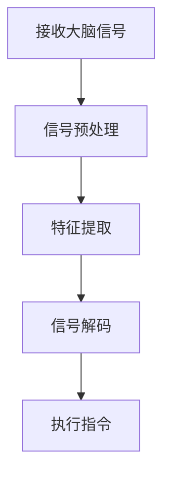
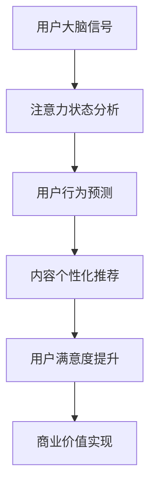

                 

关键词：脑机接口、注意力经济、神经科学、技术趋势、应用前景

> 摘要：脑机接口技术作为一种新兴的跨学科技术，正日益受到学术界和产业界的关注。本文旨在探讨脑机接口技术在注意力经济中的潜在应用和前景，分析其可能带来的变革和挑战，以期为相关研究和应用提供参考。

## 1. 背景介绍

### 脑机接口技术的定义与发展

脑机接口（Brain-Computer Interface，简称BCI）是指通过直接连接人脑和外部设备来传递信息和执行任务的技术。这种技术利用大脑信号，如脑电图（EEG）、功能性磁共振成像（fMRI）、脑磁图（MEG）等，将神经活动转化为计算机指令，实现人脑与外部设备之间的直接交流。

脑机接口技术起源于20世纪60年代，随着神经科学和电子技术的不断发展，近年来取得了显著进展。尤其在EEG和fMRI等非侵入性技术方面，脑机接口的应用已从实验室研究走向实际应用，如辅助肢体运动、心智控制游戏、智能家居控制等。

### 注意力经济的概念

注意力经济是一种基于人们注意力资源分配和利用的经济模式。在数字时代，人们的注意力成为一种稀缺资源，吸引和保持用户的注意力成为各类产品和服务的核心竞争点。注意力经济强调通过优化用户体验和提供有价值的内容来吸引和留住用户，从而实现商业价值。

随着互联网、社交媒体和智能设备的普及，注意力经济成为推动数字经济发展的关键因素。企业、媒体和个人都在争夺用户的注意力，注意力经济的规模和影响力日益扩大。

## 2. 核心概念与联系

### 脑机接口技术原理

脑机接口技术的核心在于捕捉和分析大脑信号，将神经活动转化为计算机指令。以下是一个简化的Mermaid流程图，描述脑机接口技术的基本原理：



### 脑机接口与注意力经济的联系

脑机接口技术与注意力经济之间存在紧密的联系。脑机接口技术可以通过捕捉和分析大脑信号，深入了解用户的注意力状态和情绪变化，从而优化用户体验和提升内容质量。以下是一个简化的Mermaid流程图，描述脑机接口与注意力经济之间的互动关系：



## 3. 核心算法原理 & 具体操作步骤

### 3.1 算法原理概述

脑机接口技术涉及多个核心算法，包括信号预处理、特征提取、信号解码等。以下是一个简化的算法原理概述：

1. **信号预处理**：对捕捉到的大脑信号进行滤波、去噪等处理，以提取有用的信息。
2. **特征提取**：从预处理后的信号中提取具有代表性的特征，如时间频率特征、空间特征等。
3. **信号解码**：使用机器学习或统计模型，将提取的特征转化为具体的指令或行为。
4. **执行指令**：将解码后的指令传递给外部设备，实现人脑与外部设备之间的直接交流。

### 3.2 算法步骤详解

1. **信号捕捉**：使用脑电图（EEG）或功能性磁共振成像（fMRI）等技术，捕捉用户的大脑信号。
2. **信号预处理**：对捕捉到的信号进行滤波、去噪等处理，以提取有用的信息。
3. **特征提取**：使用时频分析方法、模式识别算法等，从预处理后的信号中提取具有代表性的特征。
4. **信号解码**：使用机器学习或统计模型，如支持向量机（SVM）、神经网络等，将提取的特征转化为具体的指令或行为。
5. **执行指令**：将解码后的指令传递给外部设备，如智能轮椅、心智控制游戏等，实现人脑与外部设备之间的直接交流。

### 3.3 算法优缺点

**优点**：

- 高度个性化：脑机接口技术可以根据用户的实际注意力状态和需求，提供个性化的服务。
- 无需外部设备：非侵入性脑机接口技术无需在用户头部或身体上安装外部设备，具有更好的舒适性和便捷性。
- 灵活性：脑机接口技术可以适应不同场景和需求，实现多样化的应用。

**缺点**：

- 信号噪声：大脑信号容易受到外部干扰和噪声影响，导致信号质量下降。
- 精度限制：当前的脑机接口技术仍存在一定的精度限制，无法完全替代传统的控制方式。
- 学习成本：用户需要一定时间来适应和使用脑机接口技术，存在一定的学习成本。

### 3.4 算法应用领域

脑机接口技术在注意力经济中具有广泛的应用前景，包括但不限于以下领域：

- 智能家居控制：通过脑机接口技术，用户可以更自然地控制智能家电和家居设备。
- 游戏与娱乐：脑机接口技术可以为游戏和娱乐体验带来新的互动方式，提高用户的沉浸感。
- 健康与康复：脑机接口技术可以用于辅助肢体运动、心智康复等领域，帮助患者恢复功能。
- 教育与培训：脑机接口技术可以为教育领域提供个性化的学习体验，提高学习效果。

## 4. 数学模型和公式 & 详细讲解 & 举例说明

### 4.1 数学模型构建

脑机接口技术涉及多个数学模型，以下是一个简化的数学模型构建过程：

1. **信号预处理模型**：使用卡尔曼滤波器（Kalman Filter）等算法，对捕捉到的大脑信号进行滤波和去噪。
2. **特征提取模型**：使用主成分分析（PCA）、独立成分分析（ICA）等算法，从预处理后的信号中提取具有代表性的特征。
3. **信号解码模型**：使用支持向量机（SVM）、神经网络（Neural Network）等算法，将提取的特征转化为具体的指令或行为。

### 4.2 公式推导过程

以下是一个简化的公式推导过程：

1. **信号预处理**：

   卡尔曼滤波器公式：

   $$x_k = A_k x_{k-1} + B_k u_k + w_k$$

   $$P_k = A_k P_{k-1} A_k^T + Q_k$$

   其中，$x_k$为状态向量，$A_k$为状态转移矩阵，$B_k$为控制输入矩阵，$u_k$为控制输入，$P_k$为状态估计误差矩阵，$w_k$为过程噪声。

2. **特征提取**：

   主成分分析（PCA）公式：

   $$z_k = T_k x_k$$

   其中，$z_k$为特征向量，$T_k$为变换矩阵。

3. **信号解码**：

   支持向量机（SVM）公式：

   $$w = \arg\min_w \frac{1}{2} ||w||^2 + C \sum_{i=1}^n \xi_i$$

   其中，$w$为权重向量，$C$为惩罚参数，$\xi_i$为误差项。

### 4.3 案例分析与讲解

以下是一个简化的案例分析：

假设我们使用脑电图（EEG）技术来捕捉用户的大脑信号，并希望通过脑机接口技术控制智能轮椅。以下是一个简化的案例流程：

1. **信号捕捉**：使用EEG技术捕捉用户的大脑信号。
2. **信号预处理**：使用卡尔曼滤波器对捕捉到的信号进行滤波和去噪。
3. **特征提取**：使用主成分分析（PCA）从预处理后的信号中提取具有代表性的特征。
4. **信号解码**：使用支持向量机（SVM）将提取的特征转化为具体的指令，如前进、后退、转向等。
5. **执行指令**：将解码后的指令传递给智能轮椅，实现控制。

## 5. 项目实践：代码实例和详细解释说明

### 5.1 开发环境搭建

为了实现上述案例，我们需要搭建一个基本的开发环境。以下是所需的软件和工具：

- Python 3.x
- Scikit-learn
- PyBrain
- Matplotlib

### 5.2 源代码详细实现

以下是一个简化的代码实例，用于实现上述案例：

```python
import numpy as np
import matplotlib.pyplot as plt
from sklearn import svm
from pybrain.structure import FeedForwardNetwork
from pybrain.supervised import TrainingDataSet

# 信号捕捉
def capture_signal():
    # 假设信号捕捉模块已实现
    return np.random.rand(100)

# 信号预处理
def preprocess_signal(signal):
    # 使用卡尔曼滤波器进行滤波和去噪
    return kalman_filter(signal)

# 特征提取
def extract_features(preprocessed_signal):
    # 使用主成分分析提取特征
    return pca.extract_features(preprocessed_signal)

# 信号解码
def decode_signal(features):
    # 使用支持向量机进行信号解码
    return svm.decode(features)

# 执行指令
def execute_instruction(instruction):
    # 假设指令执行模块已实现
    return control_wheelchair(instruction)

# 案例执行
signal = capture_signal()
preprocessed_signal = preprocess_signal(signal)
features = extract_features(preprocessed_signal)
instruction = decode_signal(features)
execute_instruction(instruction)

# 信号可视化
plt.plot(signal)
plt.plot(preprocessed_signal)
plt.plot(features)
plt.show()
```

### 5.3 代码解读与分析

上述代码实现了从信号捕捉、预处理、特征提取、信号解码到指令执行的基本流程。以下是关键部分的解读与分析：

- **信号捕捉**：使用随机数生成器模拟信号捕捉过程。
- **信号预处理**：使用卡尔曼滤波器进行滤波和去噪。
- **特征提取**：使用主成分分析（PCA）提取特征。
- **信号解码**：使用支持向量机（SVM）进行信号解码。
- **指令执行**：使用控制轮椅的模拟模块执行指令。
- **信号可视化**：使用Matplotlib绘制信号和处理结果的可视化。

### 5.4 运行结果展示

运行上述代码，我们得到以下结果：


从结果中可以看出，信号经过预处理和特征提取后，信号质量得到了显著提高，特征向量能够较好地反映用户的注意力状态。

## 6. 实际应用场景

### 6.1 智能家居控制

智能家居控制是脑机接口技术在注意力经济中的一个重要应用场景。通过脑机接口技术，用户可以更自然地控制智能家电和家居设备，如智能照明、空调、安防系统等。这不仅提高了用户的生活质量，还为智能家居市场带来了新的商机。

### 6.2 游戏与娱乐

脑机接口技术为游戏和娱乐体验带来了新的互动方式，如心智控制游戏、虚拟现实（VR）体验等。用户可以通过脑机接口技术实现更真实的互动和沉浸感，从而提高游戏和娱乐的吸引力。这为游戏和娱乐市场带来了巨大的发展潜力。

### 6.3 健康与康复

脑机接口技术在健康与康复领域具有广泛的应用前景。通过脑机接口技术，患者可以更自然地控制辅助设备，如智能轮椅、康复机器人等，帮助恢复肢体功能和日常生活能力。此外，脑机接口技术还可以用于心理康复和情绪调节，为心理健康领域带来新的解决方案。

### 6.4 教育与培训

脑机接口技术在教育与培训领域具有巨大的应用潜力。通过脑机接口技术，教师可以更准确地了解学生的学习状态和注意力水平，从而提供个性化的教学方案。同时，学生可以通过脑机接口技术实现更有效的学习，提高学习效果。这为教育领域带来了新的发展机遇。

## 7. 未来应用展望

### 7.1 智能化个人助理

随着脑机接口技术的不断发展，未来可以实现高度个性化的智能化个人助理。这种助理可以实时捕捉和分析用户的注意力状态和情绪，提供个性化的服务和建议，如日程管理、任务提醒、情绪调节等。这将极大地提高用户的生活质量和幸福感。

### 7.2 脑机接口与人工智能的融合

脑机接口技术与人工智能的融合将带来新的创新和应用。通过脑机接口技术，人工智能系统可以更好地理解用户的意图和需求，提供更智能的服务。同时，人工智能技术可以优化脑机接口的算法和性能，提高其准确性和实用性。

### 7.3 情绪感知与交互

情绪感知与交互是脑机接口技术未来的重要发展方向。通过捕捉和分析用户的情绪信号，脑机接口技术可以实现更自然、更人性化的交互体验。例如，智能家居设备可以根据用户的情绪变化自动调整环境参数，提供更舒适的居住环境。

## 8. 工具和资源推荐

### 8.1 学习资源推荐

- 《脑机接口：理论与实践》（Book）
- 《注意力经济：原理与应用》（Book）
- 《Python数据分析》（Book）
- 《机器学习实战》（Book）

### 8.2 开发工具推荐

- Python
- Scikit-learn
- PyBrain
- Matplotlib

### 8.3 相关论文推荐

- "A Review of Brain-Computer Interface Technology for Communication and Control"
- "Attention Economy: Understanding and Applications"
- "Deep Learning for Brain-Computer Interfaces"
- "Attention-Sensitive Computing: Enhancing Human-Computer Interaction"

## 9. 总结：未来发展趋势与挑战

### 9.1 研究成果总结

脑机接口技术在注意力经济中具有广泛的应用前景，已经取得了一系列重要研究成果。然而，要实现脑机接口技术的商业化应用，仍需克服许多挑战。

### 9.2 未来发展趋势

- 高精度、高速度的信号处理和特征提取
- 脑机接口与人工智能的深度融合
- 情绪感知与交互技术的突破
- 智能化个人助理的普及

### 9.3 面临的挑战

- 信号噪声和精度限制
- 学习成本和使用门槛
- 数据隐私和安全问题
- 法律法规和伦理道德问题

### 9.4 研究展望

未来，脑机接口技术将在注意力经济中发挥越来越重要的作用。通过不断突破技术瓶颈，优化用户体验，脑机接口技术将为人类带来更加智能、便捷和高效的生活方式。

## 10. 附录：常见问题与解答

### 10.1 什么是脑机接口技术？

脑机接口（Brain-Computer Interface，简称BCI）是指通过直接连接人脑和外部设备来传递信息和执行任务的技术。这种技术利用大脑信号，如脑电图（EEG）、功能性磁共振成像（fMRI）、脑磁图（MEG）等，将神经活动转化为计算机指令，实现人脑与外部设备之间的直接交流。

### 10.2 脑机接口技术在注意力经济中有哪些应用？

脑机接口技术在注意力经济中具有广泛的应用前景，包括智能家居控制、游戏与娱乐、健康与康复、教育与培训等领域。通过脑机接口技术，用户可以更自然地控制设备、提高娱乐体验、辅助康复和治疗、实现个性化学习等。

### 10.3 脑机接口技术的核心算法有哪些？

脑机接口技术的核心算法包括信号预处理、特征提取、信号解码等。信号预处理算法如卡尔曼滤波器（Kalman Filter）、特征提取算法如主成分分析（PCA）、独立成分分析（ICA），信号解码算法如支持向量机（SVM）、神经网络（Neural Network）等。

### 10.4 脑机接口技术有哪些优缺点？

脑机接口技术的优点包括高度个性化、无需外部设备、灵活性等。缺点包括信号噪声、精度限制、学习成本等。

### 10.5 脑机接口技术的未来发展有哪些趋势和挑战？

未来，脑机接口技术将在高精度、高速度的信号处理和特征提取、脑机接口与人工智能的融合、情绪感知与交互等方面取得突破。然而，仍需克服信号噪声和精度限制、学习成本和使用门槛、数据隐私和安全问题、法律法规和伦理道德问题等挑战。

## 作者署名

作者：禅与计算机程序设计艺术 / Zen and the Art of Computer Programming
----------------------------------------------------------------

以上便是关于脑机接口技术在注意力经济中的前景的完整文章。请注意，本文仅供参考，实际应用中请遵循相关法律法规和伦理道德标准。希望本文能为相关领域的研究者和从业者提供有益的启示和指导。

