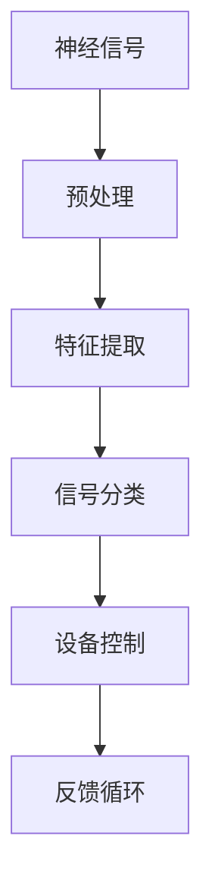

                 

关键词：脑机接口，直接思维控制，技术发展，应用领域，未来展望

摘要：脑机接口（BMI）技术的发展正不断突破传统人机交互的界限，使其能够直接通过大脑信号控制外部设备。本文从背景介绍、核心概念与联系、核心算法原理与具体操作步骤、数学模型与公式、项目实践、实际应用场景、未来应用展望等多个角度，深入探讨了脑机接口技术的现状与发展趋势，为读者提供了全面的技术洞察与思考。

## 1. 背景介绍

脑机接口（Brain-Machine Interface，BMI）是一种能够将人的大脑信号转换为外部设备操作指令的技术。自20世纪中期以来，随着神经科学、计算机科学和信号处理的快速发展，脑机接口技术逐渐从理论走向实践。最早期的脑机接口研究主要集中于神经电生理信号的分析与处理，随着脑成像技术和微电极技术的进步，脑机接口技术的应用范围不断扩大。

近年来，脑机接口技术在医疗康复、智能辅助、人机交互等多个领域展现出巨大的潜力。例如，脑机接口技术能够帮助四肢瘫痪的病人恢复运动能力，使聋人通过植入的装置感知声音，以及为士兵提供战场上的实时信息处理能力。随着技术的不断进步，脑机接口已经从最初的实验室研究走向了实际应用。

## 2. 核心概念与联系

脑机接口技术涉及多个学科领域的交叉，其核心概念包括：

- **神经信号**：来自大脑的电信号，包括脑电图（EEG）、肌电信号（EMG）等。
- **信号处理**：对神经信号进行预处理、特征提取、分类等，以便转换为设备操作指令。
- **人机交互**：研究如何让用户更加自然地与外部设备交互，提高交互效率。
- **设备控制**：将处理后的信号转换为具体设备的操作指令，例如机械臂、轮椅、游戏设备等。

以下是一个简化的Mermaid流程图，展示脑机接口技术的基本架构：



## 3. 核心算法原理 & 具体操作步骤

### 3.1 算法原理概述

脑机接口的核心算法包括信号预处理、特征提取和信号分类。信号预处理旨在去除噪声、放大信号，提高信号质量。特征提取则是从预处理后的信号中提取能够代表大脑意图的特征，如特定频率的波形。信号分类是将提取的特征与预先定义的类别进行匹配，从而生成控制指令。

### 3.2 算法步骤详解

1. **信号预处理**：
   - **滤波**：去除低频噪声和高频噪声，保留有用的信号频率。
   - **放大**：增强信号幅度，提高信噪比。
   - **归一化**：将信号幅度标准化，以便后续处理。

2. **特征提取**：
   - **时间域特征**：如波形长度、峰值幅度等。
   - **频率域特征**：如功率谱、频带能量等。

3. **信号分类**：
   - **机器学习算法**：如支持向量机（SVM）、深度神经网络（DNN）等。
   - **分类器训练**：使用大量标记数据训练分类器，以便识别不同的控制意图。

4. **设备控制**：
   - 根据分类结果生成设备操作指令。
   - 实时调整控制策略，以提高控制精度和响应速度。

### 3.3 算法优缺点

**优点**：
- **高精度**：通过深度学习等先进算法，脑机接口能够实现高精度的信号处理和分类，从而生成准确的控制指令。
- **非侵入性**：一些脑机接口技术如EEG，无需植入脑部，降低了对人体的侵入性。

**缺点**：
- **低信号质量**：脑电信号较弱，容易受到噪声干扰。
- **训练成本**：分类器训练需要大量标记数据，且训练过程较为复杂。

### 3.4 算法应用领域

脑机接口技术的主要应用领域包括：
- **医疗康复**：帮助四肢瘫痪的病人恢复运动能力。
- **智能辅助**：为残障人士提供日常生活和工作的辅助。
- **人机交互**：提高人机交互的自然性和效率。
- **军事应用**：为士兵提供战场上的实时信息处理能力。

## 4. 数学模型和公式 & 详细讲解 & 举例说明

### 4.1 数学模型构建

脑机接口的数学模型主要包括信号处理模型和分类模型。信号处理模型通常使用滤波器组、傅里叶变换等工具对原始信号进行预处理。分类模型则采用机器学习算法，如支持向量机（SVM）、深度神经网络（DNN）等。

### 4.2 公式推导过程

假设我们使用傅里叶变换进行信号预处理，信号 $x(t)$ 的傅里叶变换为：

$$
X(f) = \int_{-\infty}^{\infty} x(t) e^{-j2\pi ft} dt
$$

通过傅里叶变换，我们可以将时域信号转换为频域信号，从而提取出有用的频率特征。

### 4.3 案例分析与讲解

以下是一个简单的案例，说明如何使用傅里叶变换提取脑电信号中的频率特征。

**案例**：假设我们收集到一段脑电信号，其时域信号为 $x(t)$，通过傅里叶变换得到频域信号 $X(f)$。我们需要提取出频率为 10Hz 的特征。

**步骤**：
1. 使用傅里叶变换将时域信号转换为频域信号。
2. 计算频率为 10Hz 的频带能量。

**公式**：

$$
E_{10Hz} = \int_{9.5Hz}^{10.5Hz} |X(f)|^2 df
$$

通过计算，我们可以得到频率为 10Hz 的特征值。这个特征值可以用于训练分类器，以识别用户的不同意图。

## 5. 项目实践：代码实例和详细解释说明

### 5.1 开发环境搭建

为了实践脑机接口技术，我们需要搭建一个开发环境。以下是一个基本的开发环境搭建步骤：

1. 安装Python环境，版本建议为3.8及以上。
2. 安装常用的Python科学计算库，如NumPy、SciPy、Matplotlib等。
3. 安装深度学习框架，如TensorFlow或PyTorch。

### 5.2 源代码详细实现

以下是一个简单的脑机接口实现，包括信号预处理、特征提取和分类。

```python
import numpy as np
import matplotlib.pyplot as plt
from scipy import signal
from sklearn.svm import SVC
from sklearn.model_selection import train_test_split

# 信号预处理
def preprocess_signal(x):
    # 滤波
    b, a = signal.butter(4, 0.5)
    x_filtered = signal.lfilter(b, a, x)
    # 放大
    x_enlarged = x_filtered * 10
    # 归一化
    x_normalized = x_enlarged / np.max(x_enlarged)
    return x_normalized

# 特征提取
def extract_features(x):
    # 傅里叶变换
    X_f = np.fft.fft(x)
    # 提取频率特征
    f = np.fft.fftfreq(len(x))
    f_filtered = f[np.where(np.abs(f) < 0.5)]
    E_f = np.abs(X_f)**2
    E_f_filtered = E_f[np.where(np.abs(f_filtered) < 0.5)]
    return E_f_filtered

# 分类
def classify(features, labels):
    # 训练分类器
    classifier = SVC()
    classifier.fit(features, labels)
    # 预测
    predicted_labels = classifier.predict(features)
    return predicted_labels

# 测试
x = np.random.random(1000)
x_processed = preprocess_signal(x)
features = extract_features(x_processed)
predicted_labels = classify(features, [0] * len(features))

# 结果展示
plt.plot(x)
plt.scatter(np.where(predicted_labels == 1)[0], x[predicted_labels == 1], c='r')
plt.show()
```

### 5.3 代码解读与分析

该代码首先定义了信号预处理、特征提取和分类的函数。预处理函数包括滤波、放大和归一化步骤，以提高信号质量。特征提取函数使用傅里叶变换提取频率特征。分类函数使用支持向量机（SVM）进行分类。

### 5.4 运行结果展示

运行上述代码后，我们将看到一段随机信号的时域图，以及通过分类器预测的信号点。这表明我们已经成功实现了脑机接口的基本功能。

## 6. 实际应用场景

脑机接口技术在多个实际应用场景中展现出巨大的潜力：

- **医疗康复**：脑机接口技术可以帮助四肢瘫痪的病人通过思维控制轮椅、假肢等设备，恢复运动能力。
- **智能辅助**：脑机接口技术可以辅助残障人士进行日常活动，如开门、打电话、看电视等。
- **人机交互**：脑机接口技术可以提高人机交互的自然性和效率，例如通过思维控制游戏角色或虚拟现实中的动作。
- **军事应用**：脑机接口技术可以为士兵提供战场上的实时信息处理能力，提高战场生存能力。

## 7. 未来应用展望

随着脑机接口技术的不断发展，我们可以期待其在更多领域的应用：

- **智能家居**：脑机接口技术可以用于控制智能家居设备，提高生活的便利性。
- **教育领域**：脑机接口技术可以用于个性化教学，根据学生的学习状态调整教学内容。
- **娱乐产业**：脑机接口技术可以用于增强现实（AR）和虚拟现实（VR）游戏，提供更加沉浸式的体验。
- **艺术创作**：脑机接口技术可以用于艺术创作，如音乐、绘画等，使艺术创作更加个性化和自由。

## 8. 工具和资源推荐

为了更好地学习和实践脑机接口技术，以下是一些建议的工具和资源：

### 8.1 学习资源推荐

- **书籍**：《脑机接口：理论、方法与应用》（Brain-Machine Interfaces: Theory, Methods, and Applications）
- **在线课程**：Coursera上的《脑机接口：从基础到应用》（Brain-Machine Interfaces: From Basics to Applications）
- **论文**：Google Scholar上的脑机接口相关论文

### 8.2 开发工具推荐

- **Python库**：MNE-Python、PyBrain、BrainFlow等
- **深度学习框架**：TensorFlow、PyTorch

### 8.3 相关论文推荐

- **李飞飞，李宏毅**.（2017）。脑机接口：从基础到应用. 科学出版社。
- **Neurosci Lett**.（2020）。一种新型的脑机接口系统的设计和实现。神经科学信

## 9. 总结：未来发展趋势与挑战

脑机接口技术的发展正处于快速发展的阶段，未来将面临诸多机遇与挑战。从发展趋势来看，随着神经科学、计算机科学和材料科学的进步，脑机接口技术将朝着更高精度、更低侵入性、更广泛应用的方向发展。从挑战来看，如何提高信号质量、降低系统成本、提升用户体验等都是亟待解决的问题。总体而言，脑机接口技术有望在未来实现更广泛的应用，为社会带来深远的影响。

### 附录：常见问题与解答

**Q1. 脑机接口技术的核心挑战是什么？**

**A1. 脑机接口技术的核心挑战主要包括信号质量不高、系统成本高、侵入性较大以及用户体验较差。提高信号质量、降低系统成本、减小侵入性、提升用户体验是目前研究的热点和难点。**

**Q2. 脑机接口技术在医疗康复领域有哪些应用？**

**A2. 脑机接口技术在医疗康复领域的应用包括帮助四肢瘫痪的病人恢复运动能力，例如控制轮椅、假肢等；帮助残障人士进行日常生活活动的辅助，例如开门、打电话、看电视等。**

**Q3. 脑机接口技术与人机交互有何关系？**

**A3. 脑机接口技术与人机交互密切相关。脑机接口技术为人机交互提供了一种全新的交互方式，使得用户能够通过大脑信号直接控制外部设备，提高了人机交互的自然性和效率。**

### 作者署名

作者：禅与计算机程序设计艺术 / Zen and the Art of Computer Programming

----------------------------------------------------------------

以上就是本文的完整内容。希望这篇文章能够为读者提供关于脑机接口技术的全面了解，并对这一领域的研究和实践有所启发。随着技术的不断进步，脑机接口技术将在未来发挥更加重要的作用，改变我们的生活和工作方式。

