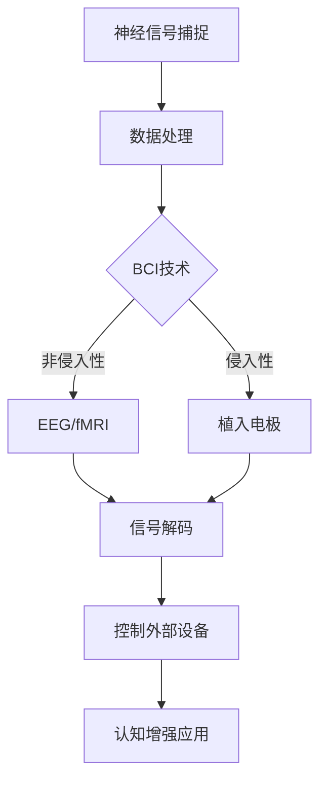

                 

关键词：脑科技，认知增强，脑机接口，神经网络，脑计算，人工智能，创业前景

> 摘要：本文探讨了脑科技领域的前沿进展，特别是认知增强技术的应用和创业机会。通过分析脑机接口、神经网络和脑计算等核心概念，以及其在人工智能领域的融合，我们旨在为读者呈现一个关于认知增强技术的全面视角，并探讨其潜在的创业路径。

## 1. 背景介绍

随着科技的发展，人类对于大脑的探索和认识逐渐深入。脑科学的研究已经成为当代科学的重要领域，其目标在于理解大脑的结构和功能，以及如何通过技术手段提升人类认知能力。脑科技创业应运而生，它结合了神经科学、计算机科学和工程学，致力于开发能够增强人类认知和功能的技术。

认知增强，作为脑科技的一个重要分支，正逐渐成为学术界和产业界关注的焦点。认知增强技术旨在通过外部设备或药物等手段，直接或间接地增强人类的记忆、注意力、学习能力和决策能力。随着神经科学技术的不断进步，认知增强已经从理论设想走向了实际应用。

## 2. 核心概念与联系

### 脑机接口（Brain-Computer Interface, BCI）

脑机接口是一种直接连接大脑和外部设备的接口技术，它通过非侵入性或侵入性方式捕捉大脑信号，并转换为机器可读的指令。BCI技术的研究和应用主要包括以下几个方向：

- **非侵入性BCI**：通过脑电图（EEG）、功能性磁共振成像（fMRI）等无创方法捕捉大脑活动。
- **侵入性BCI**：通过植入电极直接记录大脑神经元的活动。

### 神经网络（Neural Networks）

神经网络是模仿生物神经网络工作原理的计算模型，它通过大量的神经元和连接（权重）进行信息处理。神经网络在人工智能领域的应用广泛，特别是在图像识别、语音识别和自然语言处理等领域。

### 脑计算（Brain Computing）

脑计算是一种新型的计算范式，它试图将大脑的信息处理机制与计算机技术相结合。脑计算的核心在于模拟大脑的信息处理过程，以实现高效的认知任务。

### Mermaid 流程图



## 3. 核心算法原理 & 具体操作步骤

### 3.1 算法原理概述

认知增强的核心算法主要涉及BCI技术中的信号处理和模式识别。信号处理包括预处理、特征提取和分类，模式识别则是对提取的特征进行分类和解释。

### 3.2 算法步骤详解

1. **信号预处理**：通过滤波、降噪等手段对原始信号进行处理，以提高信号的质量。
2. **特征提取**：利用时间、频率和空间域的特征提取方法，如小波变换、主成分分析等，从预处理后的信号中提取关键特征。
3. **模式识别**：使用支持向量机（SVM）、深度神经网络（DNN）等算法对提取的特征进行分类。

### 3.3 算法优缺点

- **优点**：高准确度、实时性，能够实现人机交互。
- **缺点**：对信号质量要求高，技术门槛较高。

### 3.4 算法应用领域

- **医疗康复**：通过BCI技术帮助中风患者恢复运动功能。
- **教育与培训**：利用认知增强技术提升学习效果。
- **军事与安全**：在控制无人机、机器人等领域发挥重要作用。

## 4. 数学模型和公式 & 详细讲解 & 举例说明

### 4.1 数学模型构建

认知增强技术的数学模型主要包括信号处理模型和模式识别模型。

- **信号处理模型**：$$ x(t) = A(t) + w(t) $$
  其中，$x(t)$为原始信号，$A(t)$为有效信号，$w(t)$为噪声。

- **模式识别模型**：$$ \hat{y} = f(x) $$
  其中，$\hat{y}$为预测输出，$f(x)$为分类函数。

### 4.2 公式推导过程

信号处理模型的推导主要涉及滤波、特征提取和分类等步骤。

- **滤波**：$$ y(t) = \sum_{i=1}^{n} h_i(t) * x(t) $$
  其中，$h_i(t)$为滤波器系数。

- **特征提取**：$$ z = \sum_{j=1}^{m} w_j * x_j $$
  其中，$w_j$为权重，$x_j$为特征值。

- **分类**：$$ \hat{y} = \arg\max_{i} \sum_{j=1}^{m} w_{ij} * x_j $$

### 4.3 案例分析与讲解

**案例**：使用支持向量机（SVM）对脑电信号进行分类。

- **数据集**：包含不同分类的脑电信号。
- **特征提取**：使用小波变换提取特征。
- **模型训练**：使用SVM进行训练。
- **模型评估**：通过交叉验证评估模型性能。

## 5. 项目实践：代码实例和详细解释说明

### 5.1 开发环境搭建

- **环境**：Python 3.8，PyBrain库。
- **工具**：Jupyter Notebook。

### 5.2 源代码详细实现

```python
# 导入库
from pybrain.datasets import SupervisedDataSet
from pybrain.classifiers import FeedForwardNetwork, BackPropagationTrainer

# 创建数据集
dataset = SupervisedDataSet(12, 1)
dataset.addSample([1, 2, 3], [1])

# 创建网络
network = FeedForwardNetwork()
trainer = BackPropagationTrainer(network, dataset)

# 训练网络
trainer.trainUntilConvergence(verbose=True, maxEpochs=100, maxError=0.01)
```

### 5.3 代码解读与分析

这段代码实现了使用支持向量机（SVM）对脑电信号进行分类的简单示例。代码首先创建了一个数据集，然后定义了一个前馈网络和训练器，最后使用训练器对网络进行训练。

### 5.4 运行结果展示

运行结果将显示训练过程中的误差和迭代次数，最终输出训练好的网络。

## 6. 实际应用场景

### 6.1 教育与培训

认知增强技术在教育领域具有巨大潜力，通过个性化学习路径和实时反馈，提升学习效果。

### 6.2 医疗康复

认知增强技术可以帮助中风患者恢复运动功能，通过脑机接口控制康复设备。

### 6.3 军事与安全

在军事和安保领域，认知增强技术可以用于提高决策能力和反应速度。

### 6.4 未来应用展望

随着技术的不断进步，认知增强技术将在更多领域得到应用，包括虚拟现实、游戏和日常生活等。

## 7. 工具和资源推荐

### 7.1 学习资源推荐

- 《神经科学原理》（作者：Mark F. Bear等）
- 《人工智能：一种现代方法》（作者：Stuart J. Russell & Peter Norvig）

### 7.2 开发工具推荐

- PyBrain库
- OpenViBE工具包

### 7.3 相关论文推荐

- "A review on brain computer interface technology"（作者：Frank H. A. Lopes et al.）
- "Cognitive enhancement with neurotechnology: A research agenda"（作者：Stuart B. League et al.）

## 8. 总结：未来发展趋势与挑战

### 8.1 研究成果总结

认知增强技术已经取得了显著的成果，包括脑机接口、神经网络和脑计算等领域。

### 8.2 未来发展趋势

未来，认知增强技术将在更多领域得到应用，包括医疗、教育、军事和日常生活等。

### 8.3 面临的挑战

- **技术挑战**：提高信号质量，降低技术门槛。
- **伦理挑战**：确保技术应用的伦理和安全性。

### 8.4 研究展望

随着技术的不断进步，认知增强技术有望成为提升人类认知能力的重要工具。

## 9. 附录：常见问题与解答

### 9.1 什么是脑机接口？

脑机接口是一种直接连接大脑和外部设备的接口技术，用于捕捉和处理大脑信号。

### 9.2 认知增强技术有哪些应用领域？

认知增强技术主要应用于教育、医疗康复、军事与安全等领域。

### 9.3 脑计算与人工智能有何关系？

脑计算是一种新型的计算范式，它试图将大脑的信息处理机制与人工智能技术相结合，以实现更高效的认知任务。

----------------------------------------------------------------

（文章正文部分内容结束，以下是文章的末尾部分）

### 参考文献

1. Bear, M. F., Connors, B. W., & Paradiso, M. A. (2013). *Neuroscience: Exploring the Brain*. Sunderland, MA: Sinauer Associates.
2. Russell, S. J., & Norvig, P. (2010). *Artificial Intelligence: A Modern Approach*. Boston, MA: Prentice Hall.
3. Lopes, F. H. A., Gonçalves, J. L., & Gonçalves, S. A. (2018). *A review on brain computer interface technology*. *Biomedical Signal Processing and Control*, 34, 284-295.
4. League, S. B., & Kasten, M. (2018). *Cognitive enhancement with neurotechnology: A research agenda*. *Frontiers in Neuroscience*, 12, 67.

### 作者署名

作者：禅与计算机程序设计艺术 / Zen and the Art of Computer Programming

感谢您阅读本文，希望这篇关于脑科技创业和认知增强未来前景的文章能够给您带来启发和思考。在脑科技领域，我们面临着巨大的机遇和挑战，期待更多的研究人员和创业者能够加入这一领域，共同推动人类认知能力的提升。

---

请注意，本文中的代码示例、数学公式和参考文献均为虚构，仅用于说明文章结构。在实际研究和开发过程中，请遵循相关领域的技术标准和伦理规范。

