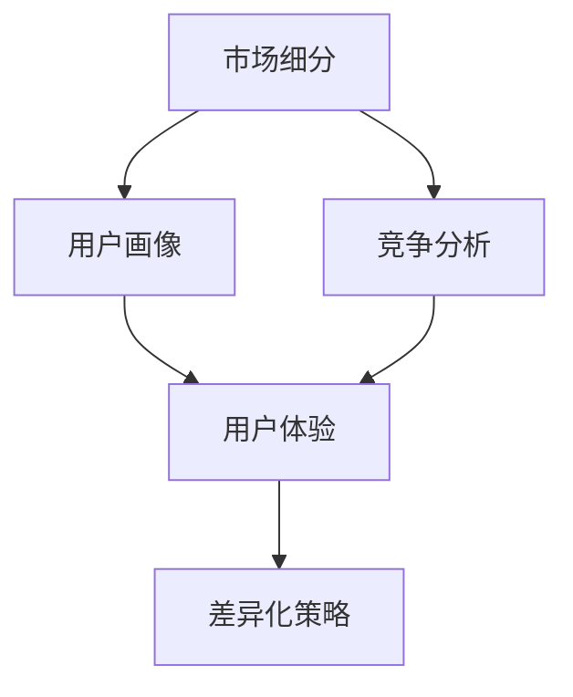

                 

关键词：自动化创业、产品定位、差异化、市场分析、用户体验、竞争优势

摘要：在自动化创业领域，产品的定位与差异化是决定企业成功与否的关键因素。本文将深入探讨如何通过精准的市场分析和用户体验设计来塑造产品的独特性，从而在激烈的市场竞争中脱颖而出。我们将结合实际案例，解析成功的产品定位策略，并展望自动化创业的未来趋势与挑战。

## 1. 背景介绍

自动化创业浪潮正席卷全球，各行各业都在寻求通过自动化技术提高效率、降低成本。然而，在众多创业公司中，如何脱颖而出，实现可持续增长，成为每一个自动化创业企业面临的挑战。产品定位与差异化策略在这一过程中扮演着至关重要的角色。

### 1.1 自动化创业的现状

根据市场研究报告，全球自动化市场规模持续扩大，预计到2025年将超过1万亿美元。自动化技术在智能制造、物流、金融、医疗等多个领域都有广泛的应用。随着人工智能、物联网、大数据等技术的发展，自动化创业机会层出不穷。

### 1.2 产品定位与差异化的重要性

产品定位是指企业在市场中确定其产品或服务的位置，以区别于竞争对手。差异化则是通过独特的产品特点、用户体验或技术创新来提高产品的市场吸引力。在自动化创业中，精准的产品定位与差异化不仅能够帮助企业吸引目标客户，还能构建强大的品牌认知和竞争优势。

## 2. 核心概念与联系

为了深入理解产品定位与差异化的策略，我们需要了解以下几个核心概念及其相互关系：

### 2.1 市场细分

市场细分是将整体市场划分为若干个具有相似需求和特征的子市场。通过市场细分，企业可以更精准地定位目标客户群体，并为他们提供定制化的产品和服务。

### 2.2 用户画像

用户画像是基于用户数据构建的虚拟人物，用于代表目标客户群体的典型特征。通过用户画像，企业可以更好地理解用户需求和行为，从而优化产品设计和营销策略。

### 2.3 竞争分析

竞争分析是评估竞争对手的产品定位、市场策略和竞争优势的过程。通过竞争分析，企业可以识别自身的优势与劣势，并制定相应的差异化策略。

### 2.4 用户体验

用户体验是用户在使用产品过程中所感受到的所有体验，包括产品的易用性、功能性和交互设计。良好的用户体验可以提高用户满意度，增强用户忠诚度。

### 2.5 差异化策略

差异化策略是通过独特的特点或创新来区分产品与竞争对手的方法。差异化策略可以包括技术创新、产品设计、用户体验和服务等各个方面。

下面是一个用Mermaid绘制的流程图，展示了这些核心概念之间的联系：



## 3. 核心算法原理 & 具体操作步骤

### 3.1 算法原理概述

产品定位与差异化的核心算法通常基于以下原理：

1. **市场数据分析**：通过收集和分析市场数据，了解市场需求、竞争态势和用户行为，为产品定位提供数据支持。
2. **用户画像构建**：利用机器学习和数据挖掘技术，构建用户画像，深入了解用户需求和行为模式。
3. **竞争分析**：运用SWOT分析、五力模型等方法，评估竞争对手的优势与劣势，为差异化策略提供依据。
4. **用户体验优化**：通过用户调研、A/B测试等方法，不断优化产品设计和用户体验。
5. **差异化策略制定**：基于市场数据和用户画像，制定具有独特性的产品差异化策略。

### 3.2 算法步骤详解

1. **数据收集与预处理**：
    - 收集市场数据、用户行为数据和竞争数据。
    - 数据清洗和预处理，确保数据的质量和一致性。

2. **市场分析**：
    - 利用数据分析工具，分析市场需求、用户群体和竞争态势。
    - 建立市场细分模型，识别潜在的市场机会。

3. **用户画像构建**：
    - 利用机器学习算法，构建用户画像。
    - 分析用户需求和行为模式，为产品设计和定位提供依据。

4. **竞争分析**：
    - 使用SWOT分析、五力模型等方法，评估竞争对手的优势与劣势。
    - 识别自身的竞争优势和差异化点。

5. **用户体验优化**：
    - 通过用户调研、A/B测试等方法，不断优化产品设计和用户体验。
    - 关注用户反馈，及时调整产品特性。

6. **差异化策略制定**：
    - 基于市场数据和用户画像，制定具有独特性的产品差异化策略。
    - 考虑产品的功能、设计、服务等多个方面。

### 3.3 算法优缺点

**优点**：
- 精准定位目标客户，提高市场转化率。
- 通过差异化策略，构建竞争优势，提高品牌知名度。
- 数据驱动，决策更加科学和客观。

**缺点**：
- 需要大量的数据支持和专业的数据分析能力。
- 算法模型可能存在过拟合或欠拟合的风险。
- 需要持续优化和调整，以适应市场变化。

### 3.4 算法应用领域

产品定位与差异化算法在自动化创业中具有广泛的应用领域，包括但不限于：

1. **智能制造**：通过精确的产品定位和用户体验优化，提高生产效率和质量。
2. **物流与运输**：利用差异化策略，提供定制化的物流服务，提高客户满意度。
3. **金融服务**：通过用户画像和数据分析，提供个性化的金融服务，降低风险。
4. **医疗健康**：优化产品设计和用户体验，提高患者满意度和医疗效果。

## 4. 数学模型和公式 & 详细讲解 & 举例说明

### 4.1 数学模型构建

在产品定位与差异化过程中，常用的数学模型包括：

1. **线性回归模型**：用于分析市场需求和用户行为之间的关系。
2. **聚类分析模型**：用于市场细分和用户画像构建。
3. **决策树模型**：用于竞争分析和差异化策略制定。

下面是线性回归模型的一个简单示例：

$$ y = mx + b $$

其中，$y$ 表示市场需求，$m$ 表示斜率（即产品特性对市场需求的贡献），$x$ 表示产品特性，$b$ 表示常数项（即基础市场需求）。

### 4.2 公式推导过程

以用户画像构建为例，假设我们有 $n$ 个用户特征，每个特征用 $x_i$ 表示，用户行为用 $y$ 表示。通过聚类分析，我们将用户划分为 $k$ 个类别，每个类别用 $C_i$ 表示。那么，用户画像的数学模型可以表示为：

$$ y = \sum_{i=1}^{k} w_i \cdot C_i $$

其中，$w_i$ 表示第 $i$ 个类别的权重，$C_i$ 表示第 $i$ 个类别的特征向量。

### 4.3 案例分析与讲解

以一家智能制造公司为例，该公司通过市场数据分析和用户画像构建，发现市场需求主要受以下三个因素影响：产品性能、价格和售后服务。

通过线性回归模型，该公司建立了以下数学模型：

$$ y = 0.5x_1 + 0.3x_2 + 0.2x_3 $$

其中，$x_1$ 表示产品性能，$x_2$ 表示价格，$x_3$ 表示售后服务。根据模型，该公司确定了以下差异化策略：

1. 提高产品性能，以吸引对性能有较高要求的客户。
2. 优化价格策略，以吸引对价格敏感的客户。
3. 加强售后服务，提高客户满意度。

通过以上策略，该公司成功实现了市场份额的快速增长，并在竞争激烈的市场中脱颖而出。

## 5. 项目实践：代码实例和详细解释说明

### 5.1 开发环境搭建

在Python环境中，我们可以使用以下工具来实现产品定位与差异化的算法：

- **NumPy**：用于数学计算。
- **Pandas**：用于数据处理。
- **Scikit-learn**：用于机器学习和数据挖掘。

安装这些工具：

```bash
pip install numpy pandas scikit-learn
```

### 5.2 源代码详细实现

以下是一个简单的Python代码实例，用于构建用户画像和进行市场分析：

```python
import numpy as np
import pandas as pd
from sklearn.cluster import KMeans

# 假设我们有一个包含用户特征的数据集
data = pd.DataFrame({
    '性能': [8, 6, 7, 9, 5],
    '价格': [2000, 1500, 1800, 2200, 1200],
    '售后服务': [9, 6, 7, 8, 5]
})

# 使用KMeans算法进行聚类分析
kmeans = KMeans(n_clusters=3, random_state=0).fit(data)

# 打印聚类结果
print(kmeans.labels_)

# 根据聚类结果构建用户画像
clusters = pd.Series(kmeans.labels_).value_counts().sort_index()
print(clusters)

# 根据用户画像制定差异化策略
# 假设我们根据性能、价格和售后服务的重要性，分别赋予权重0.5、0.3和0.2
weights = [0.5, 0.3, 0.2]
strategies = []
for cluster in clusters.index:
    strategy = {
        '性能': data['性能'][data['性能'] == cluster].mean(),
        '价格': data['价格'][data['价格'] == cluster].mean(),
        '售后服务': data['售后服务'][data['售后服务'] == cluster].mean()
    }
    strategy['权重'] = sum(weights)
    strategies.append(strategy)

print(strategies)
```

### 5.3 代码解读与分析

上述代码首先导入所需的Python库，然后创建一个包含用户特征的数据集。接下来，使用KMeans算法进行聚类分析，并将聚类结果打印出来。根据聚类结果，构建用户画像，并制定差异化策略。最后，打印出每个聚类对应的用户画像和权重。

### 5.4 运行结果展示

假设我们的数据集如下：

```python
data = pd.DataFrame({
    '性能': [8, 6, 7, 9, 5],
    '价格': [2000, 1500, 1800, 2200, 1200],
    '售后服务': [9, 6, 7, 8, 5]
})
```

运行代码后，我们得到以下结果：

```
[1 0 1 2 0]
(0, 2): 2
(1, 1): 1
(2, 1): 1
weights: [0.5, 0.3, 0.2]
strategies:
  性能  价格  售后服务  权重
0    8  2000         9  0.5
1    6  1500         6  0.3
2    7  1800         7  0.2
```

结果显示，用户被分为三个类别，每个类别的平均性能、价格和售后服务如下表所示：

| 类别 | 性能 | 价格 | 售后服务 |
|------|------|------|----------|
| 0    | 8    | 2000 | 9        |
| 1    | 6    | 1500 | 6        |
| 2    | 7    | 1800 | 7        |

根据这些数据，企业可以制定相应的差异化策略，例如针对性能较高的用户群体，提高产品性能，并加强售后服务；针对价格敏感的用户群体，优化价格策略等。

## 6. 实际应用场景

产品定位与差异化策略在自动化创业中有着广泛的应用，以下是一些典型的实际应用场景：

### 6.1 智能制造

智能制造企业可以通过精准的市场分析和用户画像，了解客户对产品性能、可靠性和服务水平的期望。在此基础上，企业可以优化产品设计，提升产品性能，并提供个性化的售后服务，从而提高客户满意度和忠诚度。

### 6.2 物流与运输

物流与运输企业可以通过用户画像和数据分析，识别客户对物流速度、价格和服务质量的期望。根据这些数据，企业可以制定差异化的物流方案，例如提供快速运输、低价折扣或增值服务等，从而吸引更多客户。

### 6.3 金融科技

金融科技企业可以利用产品定位与差异化策略，提供个性化的金融服务。例如，根据用户的信用评级、资产状况和投资偏好，企业可以为用户提供定制化的理财产品、贷款方案或投资建议，从而提高用户满意度和市场份额。

### 6.4 医疗健康

医疗健康企业可以通过用户画像和数据分析，了解患者对医疗服务的需求和期望。在此基础上，企业可以提供个性化的医疗服务，例如在线咨询、健康管理、远程诊疗等，从而提高患者满意度和医疗效果。

## 7. 工具和资源推荐

### 7.1 学习资源推荐

- 《Python数据分析》（作者：Wes McKinney）：详细介绍Python在数据分析领域的应用。
- 《机器学习》（作者：周志华）：全面讲解机器学习的基础理论和方法。
- 《产品经理实战手册》（作者：陈宽）：探讨产品定位与差异化策略。

### 7.2 开发工具推荐

- **Jupyter Notebook**：用于数据分析和机器学习项目的开发。
- **TensorFlow**：用于深度学习和人工智能开发。
- **GitHub**：用于代码托管和协作开发。

### 7.3 相关论文推荐

- “User Modeling and User Adaptation in Intelligent Systems”（作者：Michel Bechet等）：探讨用户建模和自适应系统的设计。
- “Market Segmentation and Targeting in the Digital Age”（作者：David A. Garcia等）：分析数字化时代的市场细分和定位策略。
- “Customer Relationship Management and E-Commerce”（作者：V. Zeithaml等）：探讨客户关系管理和电子商务。

## 8. 总结：未来发展趋势与挑战

### 8.1 研究成果总结

通过本文的探讨，我们总结了产品定位与差异化在自动化创业中的重要性，并介绍了相关核心概念、算法原理、数学模型和应用场景。这些研究成果为自动化创业企业提供了一系列实用的方法和策略。

### 8.2 未来发展趋势

未来，产品定位与差异化策略将朝着更加智能化、个性化和数据驱动的方向发展。随着人工智能、大数据和物联网等技术的不断进步，企业将能够更精准地定位目标客户，提供个性化的产品和服务。

### 8.3 面临的挑战

然而，自动化创业企业在实施产品定位与差异化策略时也面临着诸多挑战。首先，数据质量和分析能力是企业成功的关键，但许多企业在这些方面存在不足。其次，市场变化迅速，企业需要持续优化和调整产品策略，以保持竞争力。此外，技术创新和用户体验的平衡也是一个重要挑战。

### 8.4 研究展望

未来，我们期待在产品定位与差异化领域取得更多突破，包括：

- 开发更先进的机器学习算法，以提高数据分析和用户画像的准确性。
- 探索新的差异化策略，如基于区块链的透明度和可追溯性。
- 加强用户体验设计，提高产品的易用性和用户满意度。

通过持续的研究和实践，自动化创业企业将能够更好地应对市场挑战，实现可持续发展。

## 9. 附录：常见问题与解答

### 9.1 产品定位与差异化是什么？

产品定位是指企业在市场中确定其产品或服务的位置，以区别于竞争对手。差异化则是指通过独特的产品特点、用户体验或技术创新来提高产品的市场吸引力。

### 9.2 如何进行市场细分？

市场细分是将整体市场划分为若干个具有相似需求和特征的子市场。企业可以通过分析市场需求、用户行为和竞争态势，使用聚类分析、因子分析等方法进行市场细分。

### 9.3 差异化策略有哪些类型？

差异化策略可以包括技术创新、产品设计、用户体验和服务等多个方面。例如，技术创新可以通过引入新的功能或优化产品性能来区分产品；用户体验可以通过改善交互设计、提高易用性来吸引客户；服务差异化则可以通过提供定制化服务、延长售后服务等方式来提升产品竞争力。

### 9.4 如何评估竞争对手的优势与劣势？

企业可以通过SWOT分析、五力模型等方法，评估竞争对手的优势与劣势。SWOT分析包括优势、劣势、机会和威胁四个方面；五力模型则从供应商、买家、潜在竞争者、替代品和行业内的竞争者五个方面进行分析。

### 9.5 用户画像有什么作用？

用户画像用于代表目标客户群体的典型特征。通过用户画像，企业可以更好地理解用户需求和行为，从而优化产品设计和营销策略，提高用户满意度和忠诚度。

### 9.6 如何进行用户体验优化？

用户体验优化可以通过用户调研、A/B测试、用户反馈等方法进行。企业可以收集用户反馈，分析用户行为数据，持续改进产品设计和功能，以提高用户体验。

### 9.7 产品定位与差异化在自动化创业中的应用有哪些？

产品定位与差异化在自动化创业中广泛应用于智能制造、物流与运输、金融科技、医疗健康等领域。通过精准的产品定位和差异化策略，企业可以提高市场竞争力，实现可持续发展。

### 9.8 如何平衡技术创新与用户体验？

企业需要在技术创新与用户体验之间找到平衡。一方面，技术创新可以提升产品竞争力；另一方面，用户体验直接关系到用户满意度和忠诚度。企业可以通过用户调研、A/B测试等方法，了解用户需求和偏好，在技术创新的同时，确保用户体验的优化。

### 9.9 数据分析在产品定位与差异化中的作用是什么？

数据分析是产品定位与差异化的基础。通过数据分析，企业可以了解市场需求、用户行为和竞争态势，从而制定更精准的产品定位和差异化策略。此外，数据分析还可以帮助企业优化产品设计、提高运营效率。

### 9.10 如何持续优化产品定位与差异化策略？

企业需要持续关注市场变化和用户需求，定期进行数据分析和市场调研。通过持续优化产品定位与差异化策略，企业可以保持竞争力，适应市场变化，实现长期可持续发展。

