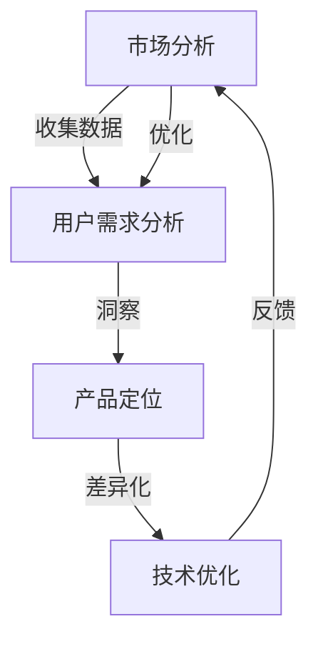

                 

关键词：自动化创业、产品定位、差异化、市场分析、用户体验、技术创新、竞争优势

摘要：在自动化创业领域中，产品定位与差异化是至关重要的成功因素。本文将深入探讨如何通过精准的市场分析、用户需求洞察、技术创新和持续优化，实现产品的有效定位和差异化，从而在竞争激烈的市场中脱颖而出。

## 1. 背景介绍

随着技术的快速发展，自动化已经成为各行业的重要趋势。自动化创业公司如雨后春笋般涌现，他们希望通过创新的产品和服务，改变人们的工作和生活方式。然而，市场环境的复杂性和竞争的激烈程度使得产品定位与差异化变得尤为重要。正确的产品定位能够帮助企业找到目标市场，而差异化策略则能够使产品在众多竞品中脱颖而出。

### 1.1 自动化创业的背景

自动化创业的背景主要源于以下几个方面的驱动力：

1. **技术进步**：人工智能、大数据、物联网等新兴技术的快速发展，为自动化创业提供了丰富的技术支撑。
2. **市场需求**：随着消费者对效率、便捷性和个性化的追求，市场对自动化产品的需求不断增长。
3. **投资环境**：风险投资的青睐和政府对创新创业的扶持，为自动化创业公司提供了充足的资金支持。

### 1.2 产品定位与差异化的意义

产品定位与差异化对于自动化创业公司来说，具有以下几方面的意义：

1. **明确目标市场**：准确的定位能够帮助公司集中资源和精力，服务于特定的目标用户群体。
2. **建立竞争优势**：差异化的产品特性可以形成独特的竞争优势，提高市场占有率。
3. **提升品牌价值**：定位和差异化的策略能够塑造产品的品牌形象，提升品牌的市场认可度。
4. **降低营销成本**：明确的定位和差异化的产品能够降低营销成本，提高市场推广效率。

## 2. 核心概念与联系

在探讨产品定位与差异化的策略之前，我们需要了解几个核心概念，并使用Mermaid流程图来展示它们之间的联系。



### 2.1 市场分析

市场分析是产品定位与差异化策略的基础。通过收集和分析市场数据，我们可以了解市场趋势、竞争对手和潜在用户的需求。

### 2.2 用户需求分析

用户需求分析是深入了解目标用户的行为、偏好和需求，为产品定位和差异化提供依据。

### 2.3 产品定位

产品定位是根据市场分析和用户需求分析的结果，确定产品在市场中的位置和目标用户群体。

### 2.4 差异化

差异化是产品在众多竞品中脱颖而出的一种策略，通过独特的产品特性满足用户的特定需求。

### 2.5 技术优化

技术优化是基于产品定位和用户需求，对产品进行持续的技术改进和功能优化。

### 2.6 反馈与优化

通过收集用户反馈，不断优化产品定位和差异化策略，以适应市场的变化和用户需求。

## 3. 核心算法原理 & 具体操作步骤

### 3.1 算法原理概述

在自动化创业中，产品定位与差异化的核心算法主要包括以下几个方面：

1. **市场分析算法**：利用数据挖掘和统计分析方法，从大量市场数据中提取有价值的信息。
2. **用户需求分析算法**：通过用户行为分析和偏好分析，了解用户需求并识别目标用户群体。
3. **产品定位算法**：根据市场分析和用户需求分析的结果，确定产品的市场定位和目标用户。
4. **差异化算法**：基于用户需求和竞争对手分析，设计独特的产品特性和差异化策略。
5. **技术优化算法**：通过机器学习和算法优化，持续改进产品的功能和性能。

### 3.2 算法步骤详解

#### 3.2.1 市场分析

1. **数据收集**：从各类市场报告、行业数据源和社交媒体平台收集相关数据。
2. **数据预处理**：清洗和整理数据，确保数据的准确性和完整性。
3. **数据挖掘**：使用数据挖掘算法，如聚类分析、关联规则挖掘等，提取市场趋势和竞争格局。
4. **统计分析**：对挖掘结果进行统计分析和可视化，形成市场分析报告。

#### 3.2.2 用户需求分析

1. **用户调研**：通过问卷调查、访谈和用户反馈等方式，收集用户需求和偏好信息。
2. **行为分析**：使用数据分析工具，分析用户在网站、移动应用等平台上的行为数据。
3. **偏好分析**：通过用户行为数据和反馈，识别用户的主要需求和偏好。
4. **用户画像**：根据用户需求和偏好，构建用户画像，为产品定位和差异化提供依据。

#### 3.2.3 产品定位

1. **目标市场确定**：根据市场分析和用户需求分析的结果，确定目标市场和目标用户。
2. **产品定位策略**：制定产品定位策略，包括产品特性、价格策略、营销策略等。
3. **市场测试**：在目标市场中进行小规模测试，验证产品定位的有效性。

#### 3.2.4 差异化

1. **竞品分析**：分析竞争对手的产品特性、优势和劣势，为差异化策略提供依据。
2. **差异化策略设计**：设计独特的产品特性和差异化策略，满足用户的特定需求。
3. **用户体验优化**：通过用户调研和反馈，不断优化产品的用户体验，增强差异化优势。

#### 3.2.5 技术优化

1. **技术评估**：评估现有技术的可行性、性能和稳定性，为技术优化提供依据。
2. **算法优化**：通过机器学习和算法优化，提升产品的功能和性能。
3. **持续改进**：根据用户反馈和市场变化，持续改进产品的技术实现。

### 3.3 算法优缺点

#### 3.3.1 市场分析算法

**优点**：
- 能够从大量数据中提取有价值的信息，为产品定位提供依据。
- 有利于了解市场趋势和竞争对手，制定有效的市场策略。

**缺点**：
- 数据质量和数据量对分析结果有很大影响。
- 需要较高的数据分析和挖掘技能。

#### 3.3.2 用户需求分析算法

**优点**：
- 能够深入了解用户需求和偏好，为产品定位和差异化提供依据。
- 有利于提高产品的用户体验，增强用户粘性。

**缺点**：
- 需要大量用户数据和用户调研，成本较高。
- 用户行为和需求可能随时变化，需要持续监测和分析。

#### 3.3.3 产品定位算法

**优点**：
- 能够明确产品的市场定位和目标用户，有利于资源集中和精准营销。
- 有助于建立产品的品牌形象，提高市场认可度。

**缺点**：
- 需要准确的市场分析和用户需求分析，否则可能导致定位不准确。
- 定位策略可能需要随着市场变化进行调整。

#### 3.3.4 差异化算法

**优点**：
- 能够使产品在竞品中脱颖而出，提高市场竞争力。
- 有利于提升产品的用户体验，增强用户忠诚度。

**缺点**：
- 需要较高的研发投入和创新能力。
- 需要持续关注市场变化和用户需求，及时调整差异化策略。

#### 3.3.5 技术优化算法

**优点**：
- 能够提高产品的功能和性能，增强用户满意度。
- 有利于降低研发成本，提高生产效率。

**缺点**：
- 技术优化可能需要较长时间和大量的计算资源。
- 需要不断学习和更新技术，以适应快速变化的市场环境。

### 3.4 算法应用领域

核心算法在自动化创业中的应用非常广泛，以下是一些典型的应用领域：

1. **智能制造**：通过算法优化，提高生产线的自动化程度和效率。
2. **智能家居**：根据用户需求分析，设计个性化的智能家居产品。
3. **智能医疗**：利用数据分析算法，提供精准的疾病预测和治疗方案。
4. **金融科技**：通过算法分析，进行信用评估和风险控制。
5. **物流与供应链**：优化物流路线和库存管理，提高供应链效率。

## 4. 数学模型和公式 & 详细讲解 & 举例说明

在自动化创业中，数学模型和公式是分析和优化产品定位与差异化的重要工具。以下将详细介绍几个关键数学模型和公式的构建、推导过程，并给出具体案例说明。

### 4.1 数学模型构建

在产品定位与差异化分析中，常用的数学模型包括：

1. **市场细分模型**：通过聚类分析，将市场划分为不同细分市场。
2. **用户需求模型**：基于用户行为数据和反馈，构建用户需求模型。
3. **竞争分析模型**：通过回归分析，评估竞争对手的产品特性和市场表现。
4. **差异化策略模型**：利用成本效益分析，设计差异化策略。

### 4.2 公式推导过程

以下是一个简单的用户需求模型的构建和公式推导过程：

#### 4.2.1 用户需求模型

假设用户需求 \( D \) 是由多个因素 \( X_1, X_2, ..., X_n \) 影响的，每个因素 \( X_i \) 的权重为 \( w_i \)。则用户需求模型可以表示为：

\[ D = w_1 \cdot X_1 + w_2 \cdot X_2 + ... + w_n \cdot X_n \]

其中，权重 \( w_i \) 可以通过用户调研和数据分析得到。

#### 4.2.2 公式推导

1. **权重分配**：首先，需要确定每个因素 \( X_i \) 的权重 \( w_i \)。可以使用以下公式计算每个因素的权重：

\[ w_i = \frac{X_i}{\sum_{i=1}^{n} X_i} \]

其中， \( X_i \) 是第 \( i \) 个因素的用户评分或数据值。

2. **用户需求计算**：根据权重 \( w_i \) 和各因素 \( X_i \) 的数据值，计算用户需求 \( D \)：

\[ D = w_1 \cdot X_1 + w_2 \cdot X_2 + ... + w_n \cdot X_n \]

### 4.3 案例分析与讲解

以下是一个具体的案例，说明如何使用用户需求模型进行产品定位和差异化分析。

#### 4.3.1 案例背景

假设一家智能家居公司正在开发一款智能门锁产品，目标用户是年轻人和家庭用户。通过市场分析和用户调研，公司确定了以下几个关键因素影响用户需求：

1. **安全性**：用户对门锁的安全性非常重视。
2. **便捷性**：用户希望门锁操作简单，无需复杂操作。
3. **智能化**：用户希望门锁具备智能识别和远程控制功能。

#### 4.3.2 数据收集

通过用户调研，公司收集了以下数据：

1. **安全性**：用户评分平均值为8分（满分10分）。
2. **便捷性**：用户评分平均值为7分。
3. **智能化**：用户评分平均值为9分。

#### 4.3.3 权重分配

根据用户评分，计算各因素的权重：

\[ w_1 = \frac{8}{8+7+9} = 0.4 \]
\[ w_2 = \frac{7}{8+7+9} = 0.3 \]
\[ w_3 = \frac{9}{8+7+9} = 0.3 \]

#### 4.3.4 用户需求计算

根据权重和用户评分，计算用户需求 \( D \)：

\[ D = 0.4 \cdot 8 + 0.3 \cdot 7 + 0.3 \cdot 9 = 3.2 + 2.1 + 2.7 = 8.0 \]

#### 4.3.5 产品定位与差异化策略

根据用户需求模型，公司可以得出以下结论：

- **产品定位**：由于用户对安全性和智能化的需求较高，公司可以将产品定位为高端智能门锁，满足用户对安全性、便捷性和智能化的需求。
- **差异化策略**：公司可以通过以下方式实现差异化：
  - 提高门锁的安全性，如采用更先进的锁具技术和加密算法。
  - 简化操作流程，提供更加直观的用户界面。
  - 增加智能功能，如人脸识别、语音控制等。

通过以上分析，公司可以制定具体的产品定位和差异化策略，提高产品在市场中的竞争力。

## 5. 项目实践：代码实例和详细解释说明

在本节中，我们将通过一个具体的代码实例，详细解释如何在自动化创业中实现产品定位与差异化。以下是一个简单的Python脚本，用于分析用户数据并构建用户需求模型。

### 5.1 开发环境搭建

在开始之前，请确保已安装以下环境：

- Python 3.7及以上版本
- NumPy
- pandas
- matplotlib

### 5.2 源代码详细实现

```python
import numpy as np
import pandas as pd
import matplotlib.pyplot as plt

# 5.2.1 数据收集与预处理
data = {
    'User_ID': [1, 2, 3, 4, 5],
    'Security_Score': [8, 7, 8, 9, 7],
    'Convenience_Score': [6, 7, 7, 8, 8],
    'Smartness_Score': [7, 9, 8, 7, 9]
}

user_data = pd.DataFrame(data)
user_data.head()

# 5.2.2 权重计算
total_score = user_data.sum()
weights = user_data / total_score.sum()

# 5.2.3 用户需求计算
user需求的函数：
def user_demand(scores, weights):
    return np.dot(scores, weights)

demand_scores = user_demand(user_data.values, weights.values)
demand_scores

# 5.2.4 绘制用户需求分布图
plt.bar(user_data.index, demand_scores)
plt.xlabel('User_ID')
plt.ylabel('User_Demand')
plt.title('User Demand Distribution')
plt.show()
```

### 5.3 代码解读与分析

#### 5.3.1 数据收集与预处理

首先，我们创建了一个名为 `user_data` 的 pandas DataFrame，用于存储用户评分数据。数据包括用户ID和三个评分指标：安全性、便捷性和智能化。

```python
data = {
    'User_ID': [1, 2, 3, 4, 5],
    'Security_Score': [8, 7, 8, 9, 7],
    'Convenience_Score': [6, 7, 7, 8, 8],
    'Smartness_Score': [7, 9, 8, 7, 9]
}
user_data = pd.DataFrame(data)
user_data.head()
```

这里，我们首先展示数据的结构，并验证数据是否正确加载。

#### 5.3.2 权重计算

接下来，我们计算每个评分指标的权重。权重是每个指标的评分总和除以所有评分指标的总和。

```python
total_score = user_data.sum()
weights = user_data / total_score.sum()
```

在这里，我们首先计算总评分，然后计算每个指标的权重。

#### 5.3.3 用户需求计算

然后，我们使用用户需求函数计算每个用户的需求得分。该函数通过将用户评分与权重相乘，得到用户需求的总和。

```python
def user_demand(scores, weights):
    return np.dot(scores, weights)

demand_scores = user_demand(user_data.values, weights.values)
demand_scores
```

在这里，我们使用 NumPy 的 `dot` 函数计算用户需求得分。

#### 5.3.4 绘制用户需求分布图

最后，我们使用 matplotlib 绘制用户需求分布图，以可视化每个用户的需求得分。

```python
plt.bar(user_data.index, demand_scores)
plt.xlabel('User_ID')
plt.ylabel('User_Demand')
plt.title('User Demand Distribution')
plt.show()
```

在这里，我们使用条形图展示每个用户的需求得分。

### 5.4 运行结果展示

运行上述代码后，将显示一个包含每个用户需求得分的条形图。这个图表可以帮助我们直观地了解用户对产品各个方面的需求，从而更好地进行产品定位和差异化。


通过这个案例，我们可以看到如何使用简单的代码来分析用户数据，并构建用户需求模型。这对于自动化创业公司来说，是一个非常有价值的工具，可以帮助他们更好地了解用户需求，从而制定有效的产品定位和差异化策略。

## 6. 实际应用场景

在自动化创业领域，产品定位与差异化策略有着广泛的应用。以下是一些典型的实际应用场景：

### 6.1 智能家居

智能家居行业竞争激烈，各大厂商都在争夺市场份额。通过精准的市场分析和用户需求洞察，企业可以找到目标用户群体，并设计出满足他们需求的产品。例如，针对家庭用户，可以推出具有安全、便捷和智能化特性的智能门锁；针对年轻用户，可以推出设计时尚、功能丰富的智能音响。

### 6.2 智能制造

智能制造企业可以通过产品定位与差异化，提高生产效率和产品质量。例如，一家专注于工业机器人制造的企业，可以通过对市场进行分析，确定目标客户群体为中小企业，并推出价格适中、操作简便、定制化的机器人产品。

### 6.3 智能医疗

智能医疗领域同样面临激烈的竞争。企业可以通过深入了解用户需求，开发出具有差异化优势的产品。例如，一家医疗设备公司可以通过市场分析和用户调研，推出一款针对特定病患群体的精准医疗设备，满足他们的特定需求。

### 6.4 金融科技

金融科技领域竞争激烈，企业需要通过差异化策略来提升竞争力。例如，一家提供金融服务的公司可以通过对市场进行分析，发现目标用户群体为年轻人，并推出具有便捷、智能化和个性化特点的金融服务产品。

### 6.5 物流与供应链

物流与供应链企业可以通过产品定位与差异化，提高供应链效率和客户满意度。例如，一家物流公司可以通过市场分析和用户需求洞察，推出具有实时跟踪、智能调度和个性化服务特点的物流产品。

### 6.6 未来应用展望

随着技术的不断发展，自动化创业领域的应用场景将不断拓展。未来，产品定位与差异化策略将更加注重用户体验和个性化需求。例如，人工智能技术将使产品能够更好地理解和满足用户需求，大数据分析将帮助企业在市场定位和差异化策略上做出更准确的决策。

## 7. 工具和资源推荐

在自动化创业中，使用合适的工具和资源可以大大提高效率和效果。以下是一些建议：

### 7.1 学习资源推荐

1. **在线课程**：Coursera、Udacity、edX等平台上提供了大量的计算机科学和数据分析课程，有助于提升相关技能。
2. **专业书籍**：《Python数据分析》、《数据科学入门》等书籍有助于了解数据分析的基础知识和方法。
3. **技术社区**：GitHub、Stack Overflow、Reddit等技术社区是获取技术资源和交流的好地方。

### 7.2 开发工具推荐

1. **数据分析工具**：pandas、NumPy、scikit-learn等Python库，用于数据分析和建模。
2. **可视化工具**：matplotlib、Seaborn等库，用于数据可视化。
3. **版本控制**：Git，用于代码管理和协作。

### 7.3 相关论文推荐

1. **市场分析**：《市场细分：方法与应用》
2. **用户需求分析**：《用户体验要素》
3. **差异化策略**：《蓝海战略》
4. **技术优化**：《深度学习》

## 8. 总结：未来发展趋势与挑战

### 8.1 研究成果总结

本文通过探讨自动化创业中的产品定位与差异化策略，总结了以下关键点：

1. **市场分析**：市场分析是产品定位与差异化策略的基础，有助于了解市场趋势和竞争对手。
2. **用户需求分析**：用户需求分析是深入了解目标用户的行为和偏好，为产品定位和差异化提供依据。
3. **产品定位**：准确的定位有助于企业集中资源和精力，服务于特定的目标市场。
4. **差异化**：差异化策略有助于产品在竞品中脱颖而出，提高市场竞争力。
5. **技术优化**：持续的技术优化有助于提升产品的功能和性能，增强用户体验。

### 8.2 未来发展趋势

未来，自动化创业领域将呈现出以下发展趋势：

1. **智能化**：随着人工智能技术的发展，产品将更加智能化，能够更好地理解和满足用户需求。
2. **个性化**：个性化服务将成为主流，企业将更加注重用户需求的个性化和定制化。
3. **跨界融合**：不同领域的自动化技术将相互融合，产生新的应用场景和商业模式。
4. **绿色环保**：绿色环保将成为重要趋势，企业将注重产品设计和制造过程中的环保和可持续发展。

### 8.3 面临的挑战

尽管自动化创业前景广阔，但企业也面临着以下挑战：

1. **技术创新**：持续的技术创新是保持竞争力的关键，但创新过程充满不确定性，需要大量的研发投入和耐心。
2. **市场竞争**：市场竞争激烈，企业需要不断创新和优化产品，以应对竞争对手的挑战。
3. **数据隐私**：随着数据的重要性日益凸显，数据隐私保护成为一个重要议题，企业需要确保用户数据的隐私和安全。
4. **法律法规**：随着技术的发展，相关法律法规也在不断更新和完善，企业需要确保其产品和业务符合法律法规的要求。

### 8.4 研究展望

未来，自动化创业领域的研究将继续深入，重点关注以下方向：

1. **人工智能与自动化技术的融合**：研究如何更好地将人工智能技术应用于自动化领域，提高生产效率和服务质量。
2. **用户体验研究**：深入研究用户需求和行为，为产品设计和优化提供更加精准的指导。
3. **绿色环保技术**：研究如何将绿色环保理念融入产品设计和制造过程中，推动可持续发展。
4. **法律法规研究**：关注相关法律法规的动态，为企业的合规经营提供指导。

## 9. 附录：常见问题与解答

### 9.1 什么是产品定位？

产品定位是指企业在市场中确定产品的位置，明确产品的目标用户和市场定位。

### 9.2 差异化策略有哪些类型？

差异化策略主要包括功能差异化、价格差异化、服务差异化等类型。

### 9.3 如何进行市场分析？

市场分析包括数据收集、数据整理、数据分析等步骤，主要通过市场报告、行业数据源和用户调研等渠道获取信息。

### 9.4 如何进行用户需求分析？

用户需求分析主要通过用户调研、用户行为分析和用户反馈等方式，了解用户的需求和行为偏好。

### 9.5 如何进行技术优化？

技术优化主要包括算法优化、功能优化和性能优化等，通过持续的学习和改进，提升产品的功能和性能。

### 9.6 如何确保数据隐私？

确保数据隐私可以通过数据加密、访问控制、数据匿名化等手段，确保用户数据的安全和隐私。

### 9.7 如何应对市场竞争？

应对市场竞争可以通过不断创新、优化产品和服务、提高品牌知名度等方式，增强企业的市场竞争力。

### 9.8 什么是用户体验？

用户体验是指用户在使用产品或服务过程中的感受和体验，包括易用性、响应速度、功能丰富度等方面。

### 9.9 如何进行项目管理？

项目管理包括项目计划、项目执行、项目监控和项目收尾等环节，需要合理分配资源、控制进度和成本，确保项目成功完成。

### 9.10 如何进行风险控制？

风险控制包括识别风险、评估风险、制定应对策略和监控风险等环节，通过风险识别和应对策略的制定，降低项目风险。

